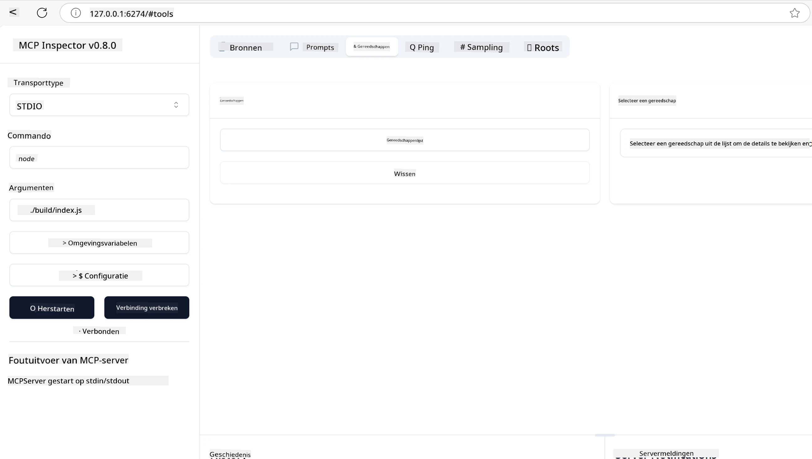
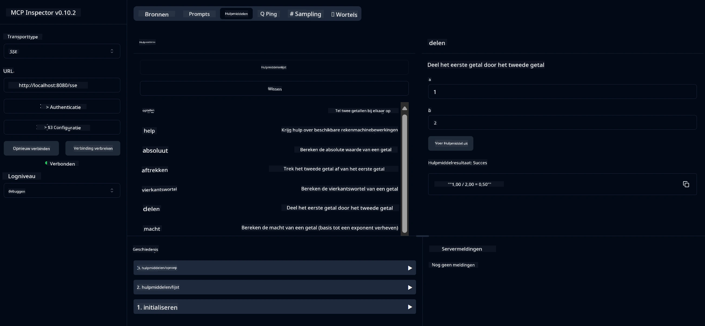
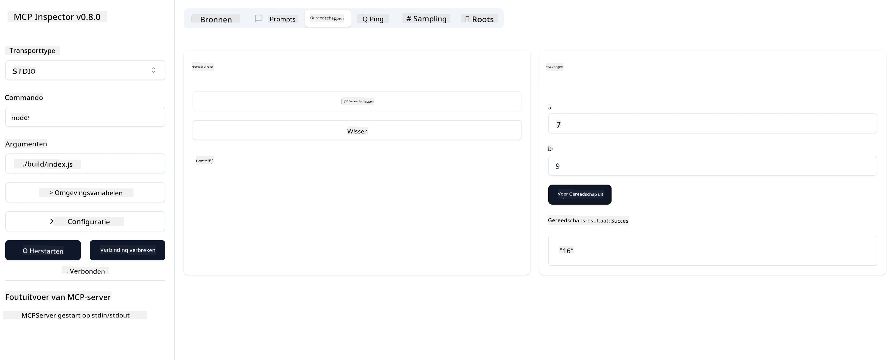

# Aan de slag met MCP

> [!NOTE]
> Het Java HTTP-voorbeeld in deze les gebruikt de legacy HTTP+SSE-transportlaag en
> is gericht op een SDK die compatibel is met MCP `2025-11-25`. Voor nieuwe externe servers gebruik
> het `2026-07-28` Streamable HTTP-transport en controleer de ondersteuning in je SDK.

Welkom bij je eerste stappen met het Model Context Protocol (MCP)! Of je nu nieuw bent met MCP of je begrip wilt verdiepen, deze gids neemt je mee door het essentiële opzet- en ontwikkelproces. Je ontdekt hoe MCP naadloze integratie mogelijk maakt tussen AI-modellen en applicaties, en leert hoe je snel je omgeving klaarzet voor het bouwen en testen van MCP-gestuurde oplossingen.

> Samenvattend; Als je AI-apps bouwt, weet je dat je gereedschappen en andere hulpmiddelen kunt toevoegen aan je LLM (groot taalmodel), om de LLM meer kennis te geven. Maar als je die gereedschappen en hulpmiddelen op een server plaatst, kunnen de app en servermogelijkheden door elke client met/zonder een LLM worden gebruikt.

## Overzicht

Deze les biedt praktische begeleiding voor het opzetten van MCP-omgevingen en het bouwen van je eerste MCP-applicaties. Je leert hoe je de benodigde tools en frameworks instelt, basis MCP-servers bouwt, hostapplicaties maakt en je implementaties test.

Het Model Context Protocol (MCP) is een open protocol dat standaardiseert hoe applicaties context aan LLMs leveren. Zie MCP als een USB-C-poort voor AI-applicaties — het biedt een gestandaardiseerde manier om AI-modellen te verbinden met verschillende databronnen en tools.

## Leerdoelen

Aan het einde van deze les kun je:

- Ontwikkelomgevingen voor MCP in C#, Java, Python, TypeScript en Rust opzetten
- Basis MCP-servers bouwen en implementeren met aangepaste functies (resources, prompts en tools)
- Hostapplicaties maken die verbinding maken met MCP-servers
- MCP-implementaties testen en debuggen

## Je MCP-omgeving instellen

Voordat je met MCP aan de slag gaat, is het belangrijk om je ontwikkelomgeving voor te bereiden en de basisworkflow te begrijpen. Deze sectie begeleidt je door de eerste opzetstappen om een soepele start met MCP te garanderen.

### Vereisten

Voordat je aan MCP-ontwikkeling begint, zorg dat je het volgende hebt:

- **Ontwikkelomgeving**: Voor je gekozen taal (C#, Java, Python, TypeScript of Rust)
- **IDE/Editor**: Visual Studio, Visual Studio Code, IntelliJ, Eclipse, PyCharm of een moderne code-editor
- **Pakketmanagers**: NuGet, Maven/Gradle, pip, npm/yarn of Cargo
- **API-sleutels**: Voor AI-diensten die je in je hostapplicaties wilt gebruiken

## Basis MCP-serverstructuur

Een MCP-server bevat doorgaans:

- **Serverconfiguratie**: Poortinstellingen, authenticatie en andere configuraties
- **Resources**: Data en context beschikbaar voor LLMs
- **Tools**: Functionaliteit die modellen kunnen aanroepen
- **Prompts**: Sjablonen voor het genereren of structureren van tekst

Hier is een vereenvoudigd voorbeeld in TypeScript:

```typescript
import { McpServer, ResourceTemplate } from "@modelcontextprotocol/sdk/server/mcp.js";
import { StdioServerTransport } from "@modelcontextprotocol/sdk/server/stdio.js";
import { z } from "zod";

// Maak een MCP-server aan
const server = new McpServer({
  name: "Demo",
  version: "1.0.0"
});

// Voeg een opteltool toe
server.tool("add",
  { a: z.number(), b: z.number() },
  async ({ a, b }) => ({
    content: [{ type: "text", text: String(a + b) }]
  })
);

// Voeg een dynamische groet resource toe
server.resource(
  "file",
  // De 'list' parameter bepaalt hoe de resource beschikbare bestanden weergeeft. Instellen op undefined schakelt de lijstweergave voor deze resource uit.
  new ResourceTemplate("file://{path}", { list: undefined }),
  async (uri, { path }) => ({
    contents: [{
      uri: uri.href,
      text: `File, ${path}!`
    }]
  })
);

// Voeg een bestandsresource toe die de inhoud van het bestand leest
server.resource(
  "file",
  new ResourceTemplate("file://{path}", { list: undefined }),
  async (uri, { path }) => {
    let text;
    try {
      text = await fs.readFile(path, "utf8");
    } catch (err) {
      text = `Error reading file: ${err.message}`;
    }
    return {
      contents: [{
        uri: uri.href,
        text
      }]
    };
  }
);

server.prompt(
  "review-code",
  { code: z.string() },
  ({ code }) => ({
    messages: [{
      role: "user",
      content: {
        type: "text",
        text: `Please review this code:\n\n${code}`
      }
    }]
  })
);

// Begin met het ontvangen van berichten op stdin en het verzenden van berichten op stdout
const transport = new StdioServerTransport();
await server.connect(transport);
```

In bovenstaande code:

- Importeer je de benodigde klassen uit de MCP TypeScript SDK.
- Maak en configureer je een nieuwe MCP-serverinstantie.
- Registreer je een aangepaste tool (`calculator`) met een handlerfunctie.
- Start je de server om inkomende MCP-verzoeken te luisteren.

## Testen en Debuggen

Voordat je begint met testen van je MCP-server is het belangrijk om de beschikbare tools en best practices voor debuggen te begrijpen. Effectief testen zorgt ervoor dat je server werkt zoals verwacht en helpt je problemen snel op te sporen en op te lossen. De volgende sectie beschrijft aanbevolen methoden voor het valideren van je MCP-implementatie.

MCP biedt tools om je te helpen bij het testen en debuggen van je servers:

- **Inspector tool**, deze grafische interface stelt je in staat om verbinding te maken met je server en je tools, prompts en resources te testen.
- **curl**, je kunt ook met een commandoregeltool zoals curl of andere clients verbinding maken die HTTP-opdrachten kunnen maken en uitvoeren.

### MCP Inspector gebruiken

De [MCP Inspector](https://github.com/modelcontextprotocol/inspector) is een visuele testtool die je helpt:

1. **Servermogelijkheden ontdekken**: Beschikbare resources, tools en prompts automatisch detecteren
2. **Tooluitvoering testen**: Verschillende parameters proberen en reacties in realtime zien
3. **Servermetadata bekijken**: Serverinformatie, schema’s en configuraties inspecteren

```bash
# bijv. TypeScript, MCP Inspector installeren en uitvoeren
npx @modelcontextprotocol/inspector node build/index.js
```

Wanneer je bovenstaande opdrachten uitvoert, start MCP Inspector een lokale webinterface in je browser. Je ziet een dashboard met je geregistreerde MCP-servers, hun beschikbare tools, resources en prompts. De interface maakt interactieve tests van tooluitvoeringen mogelijk, inspecteert servermetadata en toont realtime reacties, wat het valideren en debuggen van je MCP-serverimplementaties vereenvoudigt.

Hier is een screenshot van hoe het eruit kan zien:



## Veelvoorkomende installatiefouten en oplossingen

| Probleem | Mogelijke Oplossing |
|---------|--------------------|
| Verbinding geweigerd | Controleer of de server draait en de poort correct is |
| Fouten bij tooluitvoering | Controleer parametervalidatie en foutafhandeling |
| Authenticatiefouten | Controleer API-sleutels en machtigingen |
| Fouten bij schema-validatie | Zorg dat parameters overeenkomen met het gedefinieerde schema |
| Server start niet | Controleer op poortconflicten of ontbrekende afhankelijkheden |
| CORS-fouten | Stel de juiste CORS-headers in voor cross-origin verzoeken |
| Authenticatieproblemen | Controleer tokenvaliditeit en machtigingen |

## Lokale ontwikkeling

Voor lokale ontwikkeling en testen kun je MCP-servers direct op je machine draaien:

1. **Start het serverproces**: Voer je MCP-serverapplicatie uit
2. **Configureer netwerken**: Zorg dat de server bereikbaar is op de verwachte poort
3. **Verbind clients**: Gebruik lokale verbindings-URL’s zoals `http://localhost:3000`

```bash
# Voorbeeld: Het lokaal uitvoeren van een TypeScript MCP-server
npm run start
# Server draait op http://localhost:3000
```

## Je eerste MCP-server bouwen

We hebben in een voorgaande les [Kernconcepten](../../01-CoreConcepts/README.md) besproken, nu is het tijd om die kennis toe te passen.

### Wat een server kan doen

Voordat we code gaan schrijven, herinneren we ons wat een server allemaal kan doen:

Een MCP-server kan bijvoorbeeld:

- Toegang krijgen tot lokale bestanden en databases
- Verbinding maken met externe API’s
- Berekeningen uitvoeren
- Integreren met andere tools en diensten
- Een gebruikersinterface bieden voor interactie

Prima, nu we weten wat we ermee kunnen doen, laten we beginnen met coderen.

## Oefening: Een server maken

Om een server te maken, volg je deze stappen:

- Installeer de MCP SDK.
- Maak een project aan en zet de projectstructuur op.
- Schrijf de servercode.
- Test de server.

### -1- Project aanmaken

#### TypeScript

```sh
# Maak projectdirectory aan en initialiseer npm-project
mkdir calculator-server
cd calculator-server
npm init -y
```

#### Python

```sh
# Maak projectmap aan
mkdir calculator-server
cd calculator-server
# Open de map in Visual Studio Code - Sla dit over als je een andere IDE gebruikt
code .
```

#### .NET

```sh
dotnet new console -n McpCalculatorServer
cd McpCalculatorServer
```

#### Java

Maak voor Java een Spring Boot-project aan:

```bash
curl https://start.spring.io/starter.zip \
  -d dependencies=web \
  -d javaVersion=21 \
  -d type=maven-project \
  -d groupId=com.example \
  -d artifactId=calculator-server \
  -d name=McpServer \
  -d packageName=com.microsoft.mcp.sample.server \
  -o calculator-server.zip
```

Pak het zipbestand uit:

```bash
unzip calculator-server.zip -d calculator-server
cd calculator-server
# optioneel verwijder de ongebruikte test
rm -rf src/test/java
```

Voeg de volgende complete configuratie toe aan je *pom.xml* bestand:

```xml
<?xml version="1.0" encoding="UTF-8"?>
<project xmlns="http://maven.apache.org/POM/4.0.0"
    xmlns:xsi="http://www.w3.org/2001/XMLSchema-instance"
    xsi:schemaLocation="http://maven.apache.org/POM/4.0.0 http://maven.apache.org/xsd/maven-4.0.0.xsd">
    <modelVersion>4.0.0</modelVersion>
    
    <!-- Spring Boot parent for dependency management -->
    <parent>
        <groupId>org.springframework.boot</groupId>
        <artifactId>spring-boot-starter-parent</artifactId>
        <version>3.5.0</version>
        <relativePath />
    </parent>

    <!-- Project coordinates -->
    <groupId>com.example</groupId>
    <artifactId>calculator-server</artifactId>
    <version>0.0.1-SNAPSHOT</version>
    <name>Calculator Server</name>
    <description>Basic calculator MCP service for beginners</description>

    <!-- Properties -->
    <properties>
        <java.version>21</java.version>
        <maven.compiler.source>21</maven.compiler.source>
        <maven.compiler.target>21</maven.compiler.target>
    </properties>

    <!-- Spring AI BOM for version management -->
    <dependencyManagement>
        <dependencies>
            <dependency>
                <groupId>org.springframework.ai</groupId>
                <artifactId>spring-ai-bom</artifactId>
                <version>1.0.0-SNAPSHOT</version>
                <type>pom</type>
                <scope>import</scope>
            </dependency>
        </dependencies>
    </dependencyManagement>

    <!-- Dependencies -->
    <dependencies>
        <dependency>
            <groupId>org.springframework.ai</groupId>
            <artifactId>spring-ai-starter-mcp-server-webflux</artifactId>
        </dependency>
        <dependency>
            <groupId>org.springframework.boot</groupId>
            <artifactId>spring-boot-starter-actuator</artifactId>
        </dependency>
        <dependency>
         <groupId>org.springframework.boot</groupId>
         <artifactId>spring-boot-starter-test</artifactId>
         <scope>test</scope>
      </dependency>
    </dependencies>

    <!-- Build configuration -->
    <build>
        <plugins>
            <plugin>
                <groupId>org.springframework.boot</groupId>
                <artifactId>spring-boot-maven-plugin</artifactId>
            </plugin>
            <plugin>
                <groupId>org.apache.maven.plugins</groupId>
                <artifactId>maven-compiler-plugin</artifactId>
                <configuration>
                    <release>21</release>
                </configuration>
            </plugin>
        </plugins>
    </build>

    <!-- Repositories for Spring AI snapshots -->
    <repositories>
        <repository>
            <id>spring-milestones</id>
            <name>Spring Milestones</name>
            <url>https://repo.spring.io/milestone</url>
            <snapshots>
                <enabled>false</enabled>
            </snapshots>
        </repository>
        <repository>
            <id>spring-snapshots</id>
            <name>Spring Snapshots</name>
            <url>https://repo.spring.io/snapshot</url>
            <releases>
                <enabled>false</enabled>
            </releases>
        </repository>
    </repositories>
</project>
```

#### Rust

```sh
mkdir calculator-server
cd calculator-server
cargo init
```

### -2- Afhankelijkheden toevoegen

Nu je je project hebt aangemaakt, voegen we nu afhankelijkheden toe:

#### TypeScript

```sh
# Indien nog niet geïnstalleerd, installeer TypeScript wereldwijd
npm install typescript -g

# Installeer de MCP SDK en Zod voor schema-validatie
npm install @modelcontextprotocol/sdk zod
npm install -D @types/node typescript
```

#### Python

```sh
# Maak een virtuele omgeving aan en installeer afhankelijkheden
python -m venv venv
venv\Scripts\activate
pip install "mcp[cli]"
```

#### Java

```bash
cd calculator-server
./mvnw clean install -DskipTests
```

#### Rust

```sh
cargo add rmcp --features server,transport-io
cargo add serde
cargo add tokio --features rt-multi-thread
```

### -3- Projectbestanden aanmaken

#### TypeScript

Open het *package.json* bestand en vervang de inhoud met het volgende om te zorgen dat je de server kunt bouwen en draaien:

```json
{
  "name": "calculator-server",
  "version": "1.0.0",
  "main": "index.js",
  "type": "module",
  "scripts": {
    "build": "tsc",
    "start": "npm run build && node ./build/index.js",
  },
  "keywords": [],
  "author": "",
  "license": "ISC",
  "description": "A simple calculator server using Model Context Protocol",
  "dependencies": {
    "@modelcontextprotocol/sdk": "^1.16.0",
    "zod": "^3.25.76"
  },
  "devDependencies": {
    "@types/node": "^24.0.14",
    "typescript": "^5.8.3"
  }
}
```

Maak een *tsconfig.json* met de volgende inhoud aan:

```json
{
  "compilerOptions": {
    "target": "ES2022",
    "module": "Node16",
    "moduleResolution": "Node16",
    "outDir": "./build",
    "rootDir": "./src",
    "strict": true,
    "esModuleInterop": true,
    "skipLibCheck": true,
    "forceConsistentCasingInFileNames": true
  },
  "include": ["src/**/*"],
  "exclude": ["node_modules"]
}
```

Maak een map aan voor je broncode:

```sh
mkdir src
touch src/index.ts
```

#### Python

Maak een bestand *server.py* aan

```sh
touch server.py
```

#### .NET

Installeer de benodigde NuGet-pakketten:

```sh
dotnet add package ModelContextProtocol --prerelease
dotnet add package Microsoft.Extensions.Hosting
```

#### Java

Voor Java Spring Boot-projecten wordt de projectstructuur automatisch aangemaakt.

#### Rust

Voor Rust wordt er standaard een *src/main.rs* bestand aangemaakt bij het uitvoeren van `cargo init`. Open het bestand en verwijder de standaardcode.

### -4- Servercode schrijven

#### TypeScript

Maak een bestand *index.ts* aan en voeg de volgende code toe:

```typescript
import { McpServer, ResourceTemplate } from "@modelcontextprotocol/sdk/server/mcp.js";
import { StdioServerTransport } from "@modelcontextprotocol/sdk/server/stdio.js";
import { z } from "zod";
 
// Maak een MCP-server
const server = new McpServer({
  name: "Calculator MCP Server",
  version: "1.0.0"
});
```

Nu heb je een server, maar hij doet nog niet veel, laten we dat oplossen.

#### Python

```python
# server.py
from mcp.server.fastmcp import FastMCP

# Maak een MCP-server aan
mcp = FastMCP("Demo")
```

#### .NET

```csharp
using Microsoft.Extensions.DependencyInjection;
using Microsoft.Extensions.Hosting;
using Microsoft.Extensions.Logging;
using ModelContextProtocol.Server;
using System.ComponentModel;

var builder = Host.CreateApplicationBuilder(args);
builder.Logging.AddConsole(consoleLogOptions =>
{
    // Configure all logs to go to stderr
    consoleLogOptions.LogToStandardErrorThreshold = LogLevel.Trace;
});

builder.Services
    .AddMcpServer()
    .WithStdioServerTransport()
    .WithToolsFromAssembly();
await builder.Build().RunAsync();

// add features
```

#### Java

Voor Java maak je de kernservercomponenten. Pas eerst de hoofdapplicatieklasse aan:

*src/main/java/com/microsoft/mcp/sample/server/McpServerApplication.java*:

```java
package com.microsoft.mcp.sample.server;

import org.springframework.ai.tool.ToolCallbackProvider;
import org.springframework.ai.tool.method.MethodToolCallbackProvider;
import org.springframework.boot.SpringApplication;
import org.springframework.boot.autoconfigure.SpringBootApplication;
import org.springframework.context.annotation.Bean;
import com.microsoft.mcp.sample.server.service.CalculatorService;

@SpringBootApplication
public class McpServerApplication {

    public static void main(String[] args) {
        SpringApplication.run(McpServerApplication.class, args);
    }
    
    @Bean
    public ToolCallbackProvider calculatorTools(CalculatorService calculator) {
        return MethodToolCallbackProvider.builder().toolObjects(calculator).build();
    }
}
```

Maak de calculatorservice *src/main/java/com/microsoft/mcp/sample/server/service/CalculatorService.java* aan:

```java
package com.microsoft.mcp.sample.server.service;

import org.springframework.ai.tool.annotation.Tool;
import org.springframework.stereotype.Service;

/**
 * Service for basic calculator operations.
 * This service provides simple calculator functionality through MCP.
 */
@Service
public class CalculatorService {

    /**
     * Add two numbers
     * @param a The first number
     * @param b The second number
     * @return The sum of the two numbers
     */
    @Tool(description = "Add two numbers together")
    public String add(double a, double b) {
        double result = a + b;
        return formatResult(a, "+", b, result);
    }

    /**
     * Subtract one number from another
     * @param a The number to subtract from
     * @param b The number to subtract
     * @return The result of the subtraction
     */
    @Tool(description = "Subtract the second number from the first number")
    public String subtract(double a, double b) {
        double result = a - b;
        return formatResult(a, "-", b, result);
    }

    /**
     * Multiply two numbers
     * @param a The first number
     * @param b The second number
     * @return The product of the two numbers
     */
    @Tool(description = "Multiply two numbers together")
    public String multiply(double a, double b) {
        double result = a * b;
        return formatResult(a, "*", b, result);
    }

    /**
     * Divide one number by another
     * @param a The numerator
     * @param b The denominator
     * @return The result of the division
     */
    @Tool(description = "Divide the first number by the second number")
    public String divide(double a, double b) {
        if (b == 0) {
            return "Error: Cannot divide by zero";
        }
        double result = a / b;
        return formatResult(a, "/", b, result);
    }

    /**
     * Calculate the power of a number
     * @param base The base number
     * @param exponent The exponent
     * @return The result of raising the base to the exponent
     */
    @Tool(description = "Calculate the power of a number (base raised to an exponent)")
    public String power(double base, double exponent) {
        double result = Math.pow(base, exponent);
        return formatResult(base, "^", exponent, result);
    }

    /**
     * Calculate the square root of a number
     * @param number The number to find the square root of
     * @return The square root of the number
     */
    @Tool(description = "Calculate the square root of a number")
    public String squareRoot(double number) {
        if (number < 0) {
            return "Error: Cannot calculate square root of a negative number";
        }
        double result = Math.sqrt(number);
        return String.format("√%.2f = %.2f", number, result);
    }

    /**
     * Calculate the modulus (remainder) of division
     * @param a The dividend
     * @param b The divisor
     * @return The remainder of the division
     */
    @Tool(description = "Calculate the remainder when one number is divided by another")
    public String modulus(double a, double b) {
        if (b == 0) {
            return "Error: Cannot divide by zero";
        }
        double result = a % b;
        return formatResult(a, "%", b, result);
    }

    /**
     * Calculate the absolute value of a number
     * @param number The number to find the absolute value of
     * @return The absolute value of the number
     */
    @Tool(description = "Calculate the absolute value of a number")
    public String absolute(double number) {
        double result = Math.abs(number);
        return String.format("|%.2f| = %.2f", number, result);
    }

    /**
     * Get help about available calculator operations
     * @return Information about available operations
     */
    @Tool(description = "Get help about available calculator operations")
    public String help() {
        return "Basic Calculator MCP Service\n\n" +
               "Available operations:\n" +
               "1. add(a, b) - Adds two numbers\n" +
               "2. subtract(a, b) - Subtracts the second number from the first\n" +
               "3. multiply(a, b) - Multiplies two numbers\n" +
               "4. divide(a, b) - Divides the first number by the second\n" +
               "5. power(base, exponent) - Raises a number to a power\n" +
               "6. squareRoot(number) - Calculates the square root\n" + 
               "7. modulus(a, b) - Calculates the remainder of division\n" +
               "8. absolute(number) - Calculates the absolute value\n\n" +
               "Example usage: add(5, 3) will return 5 + 3 = 8";
    }

    /**
     * Format the result of a calculation
     */
    private String formatResult(double a, String operator, double b, double result) {
        return String.format("%.2f %s %.2f = %.2f", a, operator, b, result);
    }
}
```

**Optionele componenten voor een productieklaar service:**

Maak een startupconfiguratie aan *src/main/java/com/microsoft/mcp/sample/server/config/StartupConfig.java*:

```java
package com.microsoft.mcp.sample.server.config;

import org.springframework.boot.CommandLineRunner;
import org.springframework.context.annotation.Bean;
import org.springframework.context.annotation.Configuration;

@Configuration
public class StartupConfig {
    
    @Bean
    public CommandLineRunner startupInfo() {
        return args -> {
            System.out.println("\n" + "=".repeat(60));
            System.out.println("Calculator MCP Server is starting...");
            System.out.println("SSE endpoint: http://localhost:8080/sse");
            System.out.println("Health check: http://localhost:8080/actuator/health");
            System.out.println("=".repeat(60) + "\n");
        };
    }
}
```

Maak een health-controller *src/main/java/com/microsoft/mcp/sample/server/controller/HealthController.java*:

```java
package com.microsoft.mcp.sample.server.controller;

import org.springframework.http.ResponseEntity;
import org.springframework.web.bind.annotation.GetMapping;
import org.springframework.web.bind.annotation.RestController;
import java.time.LocalDateTime;
import java.util.HashMap;
import java.util.Map;

@RestController
public class HealthController {
    
    @GetMapping("/health")
    public ResponseEntity<Map<String, Object>> healthCheck() {
        Map<String, Object> response = new HashMap<>();
        response.put("status", "UP");
        response.put("timestamp", LocalDateTime.now().toString());
        response.put("service", "Calculator MCP Server");
        return ResponseEntity.ok(response);
    }
}
```

Maak een exception handler *src/main/java/com/microsoft/mcp/sample/server/exception/GlobalExceptionHandler.java*:

```java
package com.microsoft.mcp.sample.server.exception;

import org.springframework.http.HttpStatus;
import org.springframework.http.ResponseEntity;
import org.springframework.web.bind.annotation.ExceptionHandler;
import org.springframework.web.bind.annotation.RestControllerAdvice;

@RestControllerAdvice
public class GlobalExceptionHandler {

    @ExceptionHandler(IllegalArgumentException.class)
    public ResponseEntity<ErrorResponse> handleIllegalArgumentException(IllegalArgumentException ex) {
        ErrorResponse error = new ErrorResponse(
            "Invalid_Input", 
            "Invalid input parameter: " + ex.getMessage());
        return new ResponseEntity<>(error, HttpStatus.BAD_REQUEST);
    }

    public static class ErrorResponse {
        private String code;
        private String message;

        public ErrorResponse(String code, String message) {
            this.code = code;
            this.message = message;
        }

        // Getters
        public String getCode() { return code; }
        public String getMessage() { return message; }
    }
}
```

Maak een aangepast bannerbestand *src/main/resources/banner.txt*:

```text
_____      _            _       _             
 / ____|    | |          | |     | |            
| |     __ _| | ___ _   _| | __ _| |_ ___  _ __ 
| |    / _` | |/ __| | | | |/ _` | __/ _ \| '__|
| |___| (_| | | (__| |_| | | (_| | || (_) | |   
 \_____\__,_|_|\___|\__,_|_|\__,_|\__\___/|_|   
                                                
Calculator MCP Server v1.0
Spring Boot MCP Application
```

</details>

#### Rust

Voeg de volgende code toe aan het begin van het *src/main.rs* bestand. Deze importeert de benodigde bibliotheken en modules voor je MCP-server.

```rust
use rmcp::{
    handler::server::{router::tool::ToolRouter, tool::Parameters},
    model::{ServerCapabilities, ServerInfo},
    schemars, tool, tool_handler, tool_router,
    transport::stdio,
    ServerHandler, ServiceExt,
};
use std::error::Error;
```

De calculatorserver wordt eenvoudig en kan twee getallen bij elkaar optellen. Laten we een struct maken om het calculatorverzoek te vertegenwoordigen.

```rust
#[derive(Debug, serde::Deserialize, schemars::JsonSchema)]
pub struct CalculatorRequest {
    pub a: f64,
    pub b: f64,
}
```

Maak vervolgens een struct aan om de calculatorserver te vertegenwoordigen. Deze struct houdt de toolrouter bij, die wordt gebruikt om tools te registreren.

```rust
#[derive(Debug, Clone)]
pub struct Calculator {
    tool_router: ToolRouter<Self>,
}
```

Nu kunnen we de `Calculator` struct implementeren om een nieuwe instantie van de server te maken en de serverhandler te implementeren om serverinformatie te leveren.

```rust
#[tool_router]
impl Calculator {
    pub fn new() -> Self {
        Self {
            tool_router: Self::tool_router(),
        }
    }
}

#[tool_handler]
impl ServerHandler for Calculator {
    fn get_info(&self) -> ServerInfo {
        ServerInfo {
            instructions: Some("A simple calculator tool".into()),
            capabilities: ServerCapabilities::builder().enable_tools().build(),
            ..Default::default()
        }
    }
}
```

Tot slot moet de main-functie worden geïmplementeerd om de server te starten. Deze functie maakt een instantie van de `Calculator` struct en serveert die via standaardinvoer/-uitvoer.

```rust
#[tokio::main]
async fn main() -> Result<(), Box<dyn Error>> {
    let service = Calculator::new().serve(stdio()).await?;
    service.waiting().await?;
    Ok(())
}
```

De server is nu opgezet om basisinformatie over zichzelf te bieden. Vervolgens voegen we een tool toe om optellingen uit te voeren.

### -5- Een tool en resource toevoegen

Voeg een tool en een resource toe door onderstaande code toe te voegen:

#### TypeScript

```typescript
server.tool(
  "add",
  { a: z.number(), b: z.number() },
  async ({ a, b }) => ({
    content: [{ type: "text", text: String(a + b) }]
  })
);

server.resource(
  "greeting",
  new ResourceTemplate("greeting://{name}", { list: undefined }),
  async (uri, { name }) => ({
    contents: [{
      uri: uri.href,
      text: `Hello, ${name}!`
    }]
  })
);
```

Je tool neemt parameters `a` en `b` en voert een functie uit die een reactie geeft in de vorm van:

```typescript
{
  contents: [{
    type: "text", content: "some content"
  }]
}
```

Je resource wordt benaderd via een string "greeting" en neemt een parameter `name` aan en geeft een soortgelijke reactie als de tool:

```typescript
{
  uri: "<href>",
  text: "a text"
}
```

#### Python

```python
# Voeg een optellingstool toe
@mcp.tool()
def add(a: int, b: int) -> int:
    """Add two numbers"""
    return a + b


# Voeg een dynamische groetbron toe
@mcp.resource("greeting://{name}")
def get_greeting(name: str) -> str:
    """Get a personalized greeting"""
    return f"Hello, {name}!"
```

In bovenstaande code:

- Is een tool `add` gedefinieerd die parameters `a` en `b` neemt, beide integers.
- Is een resource `greeting` aangemaakt die parameter `name` inneemt.

#### .NET

Voeg dit toe aan je Program.cs bestand:

```csharp
[McpServerToolType]
public static class CalculatorTool
{
    [McpServerTool, Description("Adds two numbers")]
    public static string Add(int a, int b) => $"Sum {a + b}";
}
```

#### Java

De tools zijn al aangemaakt in de vorige stap.

#### Rust

Voeg een nieuwe tool toe binnen de `impl Calculator` blok:

```rust
#[tool(description = "Adds a and b")]
async fn add(
    &self,
    Parameters(CalculatorRequest { a, b }): Parameters<CalculatorRequest>,
) -> String {
    (a + b).to_string()
}
```

### -6- Definitieve code

Laten we de laatste code toevoegen die we nodig hebben zodat de server kan starten:

#### TypeScript

```typescript
// Begin met het ontvangen van berichten op stdin en het verzenden van berichten op stdout
const transport = new StdioServerTransport();
await server.connect(transport);
```

Hier is de volledige code:

```typescript
// index.ts
import { McpServer, ResourceTemplate } from "@modelcontextprotocol/sdk/server/mcp.js";
import { StdioServerTransport } from "@modelcontextprotocol/sdk/server/stdio.js";
import { z } from "zod";

// Maak een MCP-server aan
const server = new McpServer({
  name: "Calculator MCP Server",
  version: "1.0.0"
});

// Voeg een optellingstool toe
server.tool(
  "add",
  { a: z.number(), b: z.number() },
  async ({ a, b }) => ({
    content: [{ type: "text", text: String(a + b) }]
  })
);

// Voeg een dynamische begroetingsbron toe
server.resource(
  "greeting",
  new ResourceTemplate("greeting://{name}", { list: undefined }),
  async (uri, { name }) => ({
    contents: [{
      uri: uri.href,
      text: `Hello, ${name}!`
    }]
  })
);

// Begin met het ontvangen van berichten op stdin en het verzenden van berichten op stdout
const transport = new StdioServerTransport();
server.connect(transport);
```

#### Python

```python
# server.py
from mcp.server.fastmcp import FastMCP

# Maak een MCP-server
mcp = FastMCP("Demo")


# Voeg een toevoegingshulpmiddel toe
@mcp.tool()
def add(a: int, b: int) -> int:
    """Add two numbers"""
    return a + b


# Voeg een dynamische begroetingsbron toe
@mcp.resource("greeting://{name}")
def get_greeting(name: str) -> str:
    """Get a personalized greeting"""
    return f"Hello, {name}!"

# Hoofduitvoeringsblok - dit is nodig om de server te draaien
if __name__ == "__main__":
    mcp.run()
```

#### .NET

Maak een Program.cs bestand aan met de volgende inhoud:

```csharp
using Microsoft.Extensions.DependencyInjection;
using Microsoft.Extensions.Hosting;
using Microsoft.Extensions.Logging;
using ModelContextProtocol.Server;
using System.ComponentModel;

var builder = Host.CreateApplicationBuilder(args);
builder.Logging.AddConsole(consoleLogOptions =>
{
    // Configure all logs to go to stderr
    consoleLogOptions.LogToStandardErrorThreshold = LogLevel.Trace;
});

builder.Services
    .AddMcpServer()
    .WithStdioServerTransport()
    .WithToolsFromAssembly();
await builder.Build().RunAsync();

[McpServerToolType]
public static class CalculatorTool
{
    [McpServerTool, Description("Adds two numbers")]
    public static string Add(int a, int b) => $"Sum {a + b}";
}
```

#### Java

Je complete hoofdapplicatieklasse zou er zo uit moeten zien:

```java
// McpServerApplication.java
package com.microsoft.mcp.sample.server;

import org.springframework.ai.tool.ToolCallbackProvider;
import org.springframework.ai.tool.method.MethodToolCallbackProvider;
import org.springframework.boot.SpringApplication;
import org.springframework.boot.autoconfigure.SpringBootApplication;
import org.springframework.context.annotation.Bean;
import com.microsoft.mcp.sample.server.service.CalculatorService;

@SpringBootApplication
public class McpServerApplication {

    public static void main(String[] args) {
        SpringApplication.run(McpServerApplication.class, args);
    }
    
    @Bean
    public ToolCallbackProvider calculatorTools(CalculatorService calculator) {
        return MethodToolCallbackProvider.builder().toolObjects(calculator).build();
    }
}
```

#### Rust

De definitieve code voor de Rust-server zou er zo uit moeten zien:

```rust
use rmcp::{
    ServerHandler, ServiceExt,
    handler::server::{router::tool::ToolRouter, tool::Parameters},
    model::{ServerCapabilities, ServerInfo},
    schemars, tool, tool_handler, tool_router,
    transport::stdio,
};
use std::error::Error;

#[derive(Debug, serde::Deserialize, schemars::JsonSchema)]
pub struct CalculatorRequest {
    pub a: f64,
    pub b: f64,
}

#[derive(Debug, Clone)]
pub struct Calculator {
    tool_router: ToolRouter<Self>,
}

#[tool_router]
impl Calculator {
    pub fn new() -> Self {
        Self {
            tool_router: Self::tool_router(),
        }
    }
    
    #[tool(description = "Adds a and b")]
    async fn add(
        &self,
        Parameters(CalculatorRequest { a, b }): Parameters<CalculatorRequest>,
    ) -> String {
        (a + b).to_string()
    }
}

#[tool_handler]
impl ServerHandler for Calculator {
    fn get_info(&self) -> ServerInfo {
        ServerInfo {
            instructions: Some("A simple calculator tool".into()),
            capabilities: ServerCapabilities::builder().enable_tools().build(),
            ..Default::default()
        }
    }
}

#[tokio::main]
async fn main() -> Result<(), Box<dyn Error>> {
    let service = Calculator::new().serve(stdio()).await?;
    service.waiting().await?;
    Ok(())
}
```

### -7- De server testen

Start de server met het volgende commando:

#### TypeScript

```sh
npm run build
```

#### Python

```sh
mcp run server.py
```

> Om MCP Inspector te gebruiken, gebruik `mcp dev server.py` wat automatisch de Inspector start en de benodigde proxy sessietoken levert. Bij gebruik van `mcp run server.py` moet je handmatig de Inspector starten en de verbinding configureren.

#### .NET

Zorg dat je in je projectmap bent:

```sh
cd McpCalculatorServer
dotnet run
```

#### Java

```bash
./mvnw clean install -DskipTests
java -jar target/calculator-server-0.0.1-SNAPSHOT.jar
```

#### Rust

Voer de volgende commando’s uit om de server te formatteren en te draaien:

```sh
cargo fmt
cargo run
```

### -8- Runnen met de inspector

De inspector is een geweldige tool die je server kan opstarten en waarmee je kunt interacteren, zodat je kunt testen of hij werkt. Laten we starten:

> [!NOTE]
> het kan er anders uitzien in het veld "command" omdat het commando voor het draaien van een server met jouw specifieke runtime bevat/

#### TypeScript

```sh
npx @modelcontextprotocol/inspector node build/index.js
```

of voeg het toe aan je *package.json* zoals: `"inspector": "npx @modelcontextprotocol/inspector node build/index.js"` en voer dan `npm run inspector` uit

#### Python

Python gebruikt een Node.js tool genaamd inspector. Het is mogelijk deze tool als volgt aan te roepen:

```sh
mcp dev server.py
```


Het implementeert echter niet alle methoden die beschikbaar zijn op de tool, dus wordt aanbevolen om de Node.js-tool rechtstreeks uit te voeren zoals hieronder:

```sh
npx @modelcontextprotocol/inspector mcp run server.py
```

Als je een tool of IDE gebruikt waarmee je opdrachten en argumenten voor het uitvoeren van scripts kunt configureren, 
zorg er dan voor dat je `python` instelt in het veld `Command` en `server.py` als `Arguments`. Dit zorgt ervoor dat het script correct wordt uitgevoerd.

#### .NET

Zorg dat je in je projectmap bent:

```sh
cd McpCalculatorServer
npx @modelcontextprotocol/inspector dotnet run
```

#### Java

Zorg ervoor dat je rekenservers actief zijn
Voer dan de inspector uit:

```cmd
npx @modelcontextprotocol/inspector
```

In de webinterface van de inspector:

1. Selecteer "SSE" als het type transport
2. Stel de URL in op: `http://localhost:8080/sse`
3. Klik op "Connect"



**Je bent nu verbonden met de server**
**De testsectie van de Java-server is nu afgerond**

De volgende sectie gaat over interactie met de server.

Je zou de volgende gebruikersinterface moeten zien:


1. Maak verbinding met de server door op de Connect-knop te klikken
  Zodra je verbonden bent met de server, zie je nu het volgende:

  

1. Selecteer "Tools" en "listTools", je zou "Add" moeten zien verschijnen, selecteer "Add" en vul de parameterwaarden in.

  Je zou de volgende respons moeten zien, dat wil zeggen een resultaat van de "add" tool:

  

Gefeliciteerd, je bent erin geslaagd je eerste server te maken en uit te voeren!

#### Rust

Om de Rust-server met de MCP Inspector CLI uit te voeren, gebruik je de volgende opdracht:

```sh
npx @modelcontextprotocol/inspector cargo run --cli --method tools/call --tool-name add --tool-arg a=1 b=2
```

### Officiële SDK's

MCP biedt officiële SDK's voor meerdere talen:

- [C# SDK](https://github.com/modelcontextprotocol/csharp-sdk) - Onderhouden in samenwerking met Microsoft
- [Java SDK](https://github.com/modelcontextprotocol/java-sdk) - Onderhouden in samenwerking met Spring AI
- [TypeScript SDK](https://github.com/modelcontextprotocol/typescript-sdk) - De officiële TypeScript-implementatie
- [Python SDK](https://github.com/modelcontextprotocol/python-sdk) - De officiële Python-implementatie
- [Kotlin SDK](https://github.com/modelcontextprotocol/kotlin-sdk) - De officiële Kotlin-implementatie
- [Swift SDK](https://github.com/modelcontextprotocol/swift-sdk) - Onderhouden in samenwerking met Loopwork AI
- [Rust SDK](https://github.com/modelcontextprotocol/rust-sdk) - De officiële Rust-implementatie

## Belangrijke punten

- Het opzetten van een MCP-ontwikkelomgeving is eenvoudig met taalspecifieke SDK's
- Het bouwen van MCP-servers omvat het creëren en registreren van tools met duidelijke schema's
- Testen en debuggen zijn essentieel voor betrouwbare MCP-implementaties

## Voorbeelden

- [Java Calculator](../samples/java/calculator/README.md)
- [.NET Calculator](../../../../03-GettingStarted/samples/csharp)
- [JavaScript Calculator](../samples/javascript/README.md)
- [TypeScript Calculator](../samples/typescript/README.md)
- [Python Calculator](../../../../03-GettingStarted/samples/python)
- [Rust Calculator](../../../../03-GettingStarted/samples/rust)

## Opdracht

Maak een eenvoudige MCP-server met een tool naar keuze:

1. Implementeer de tool in je voorkeurstaal (.NET, Java, Python, TypeScript of Rust).
2. Definieer invoerparameters en retourwaarden.
3. Voer de inspector-tool uit om te zorgen dat de server werkt zoals bedoeld.
4. Test de implementatie met verschillende invoerwaarden.

## Oplossing

[Oplossing](./solution/README.md)

## Aanvullende bronnen

- [Agents bouwen met Model Context Protocol op Azure](https://learn.microsoft.com/azure/developer/ai/intro-agents-mcp)
- [Remote MCP met Azure Container Apps (Node.js/TypeScript/JavaScript)](https://learn.microsoft.com/samples/azure-samples/mcp-container-ts/mcp-container-ts/)
- [.NET OpenAI MCP Agent](https://learn.microsoft.com/samples/azure-samples/openai-mcp-agent-dotnet/openai-mcp-agent-dotnet/)

## Wat nu

Volgende: [Beginnen met MCP Clients](../02-client/README.md)

---

<!-- CO-OP TRANSLATOR DISCLAIMER START -->
**Disclaimer**:
Dit document is vertaald met behulp van de AI vertaaldienst [Co-op Translator](https://github.com/Azure/co-op-translator). Hoewel we streven naar nauwkeurigheid, dient u er rekening mee te houden dat geautomatiseerde vertalingen fouten of onnauwkeurigheden kunnen bevatten. Het originele document in de oorspronkelijke taal moet worden beschouwd als de gezaghebbende bron. Voor kritieke informatie wordt professionele menselijke vertaling aanbevolen. Wij zijn niet aansprakelijk voor eventuele misverstanden of verkeerde interpretaties die voortvloeien uit het gebruik van deze vertaling.
<!-- CO-OP TRANSLATOR DISCLAIMER END -->