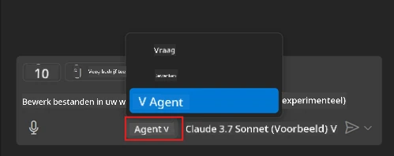
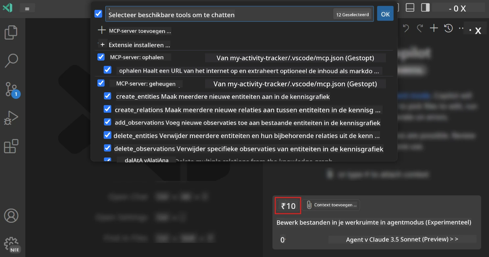
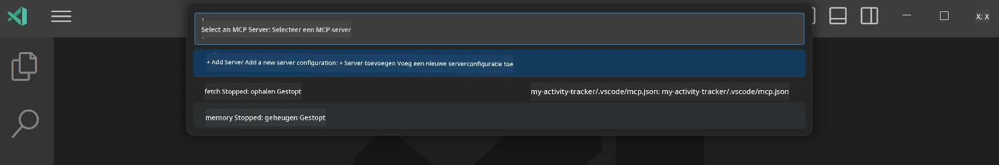
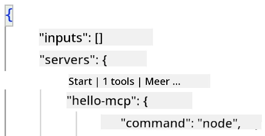
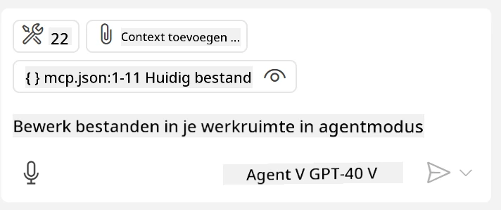
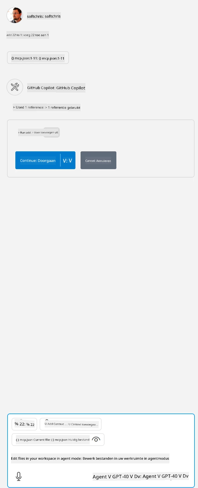

# Een server gebruiken vanuit GitHub Copilot Agent modus

Visual Studio Code en GitHub Copilot kunnen fungeren als een client en een MCP Server gebruiken. Je vraagt je misschien af waarom we dat zouden willen doen? Nou, dat betekent dat welke functies de MCP Server ook heeft, deze nu vanuit je IDE gebruikt kunnen worden. Stel je bijvoorbeeld voor dat je de MCP-server van GitHub toevoegt, dit zou het mogelijk maken om GitHub te bedienen via prompts in plaats van specifieke commando's in de terminal te typen. Of stel je in het algemeen iets voor dat je ontwikkelaarservaring kan verbeteren, allemaal bestuurd door natuurlijke taal. Nu begin je het voordeel te zien, toch?

## Overzicht

Deze les behandelt hoe je Visual Studio Code en GitHub Copilot's Agent modus kunt gebruiken als client voor jouw MCP Server.

## Leerdoelen

Aan het eind van deze les kun je:

- Een MCP Server gebruiken via Visual Studio Code.
- Capaciteiten zoals tools uitvoeren via GitHub Copilot.
- Visual Studio Code configureren om jouw MCP Server te vinden en te beheren.

## Gebruik

Je kunt jouw MCP-server op twee verschillende manieren bedienen:

- Gebruikersinterface, je zult later in dit hoofdstuk zien hoe dit wordt gedaan.
- Terminal, het is mogelijk om dingen vanaf de terminal te bedienen met het `code` uitvoerbare bestand:

  Om een MCP-server toe te voegen aan je gebruikersprofiel, gebruik je de --add-mcp opdrachtregeloptie en geef je de JSON serverconfiguratie in de vorm {\"name\":\"server-naam\",\"command\":...}.

  ```
  code --add-mcp "{\"name\":\"my-server\",\"command\": \"uvx\",\"args\": [\"mcp-server-fetch\"]}"
  ```

### Screenshots





Laten we in de volgende secties meer praten over hoe we de visuele interface gebruiken.

## Aanpak

Zo moeten we dit op hoofdlijnen aanpakken:

- Een bestand configureren om onze MCP Server te vinden.
- De genoemde server opstarten/verbinden om zijn mogelijkheden te laten zien.
- Die mogelijkheden gebruiken via de GitHub Copilot Chat interface.

Geweldig, nu we het proces begrijpen, laten we proberen een MCP Server via Visual Studio Code te gebruiken aan de hand van een oefening.

## Oefening: Een server gebruiken

In deze oefening zullen we Visual Studio Code configureren om jouw MCP Server te vinden zodat deze via de GitHub Copilot Chat interface gebruikt kan worden.

### -0- Vooraf: MCP Server ontdekking inschakelen

Mogelijk moet je het ontdekken van MCP Servers inschakelen.

1. Ga naar `File -> Preferences -> Settings` in Visual Studio Code.

1. Zoek naar "MCP" en schakel `chat.mcp.discovery.enabled` in het settings.json bestand in.

### -1- Configuratiebestand aanmaken

Begin met het aanmaken van een configuratiebestand in de hoofdmap van je project, je hebt een bestand genaamd MCP.json nodig en je plaatst dit in een map genaamd .vscode. Het zou er als volgt uit moeten zien:

```text
.vscode
|-- mcp.json
```

Laten we daarna kijken hoe we een serververmelding kunnen toevoegen.

### -2- Een server configureren

Voeg de volgende inhoud toe aan *mcp.json*:

```json
{
    "inputs": [],
    "servers": {
       "hello-mcp": {
           "command": "node",
           "args": [
               "build/index.js"
           ]
       }
    }
}
```

Bovenstaand is een eenvoudig voorbeeld van hoe je een server start die geschreven is in Node.js; voor andere runtimes geef je het juiste commando voor het starten van de server op met `command` en `args`.

### -3- De server starten

Nu je een vermelding hebt toegevoegd, starten we de server:

1. Zoek jouw vermelding in *mcp.json* en zorg dat je het "play" icoon vindt:

    

1. Klik op het "play" icoon, je zou moeten zien dat het tools-icoon in GitHub Copilot Chat toeneemt in aantal beschikbare tools. Klik op dat tools-icoon om een lijst van geregistreerde tools te zien. Je kunt elke tool aan- of uitvinken afhankelijk of je wilt dat GitHub Copilot die als context gebruikt:

  

1. Om een tool uit te voeren, typ je een prompt die overeenkomt met de beschrijving van een van jouw tools, bijvoorbeeld een prompt zoals "add 22 to 1":

  

  Je zou een antwoord moeten zien met de waarde 23.

## Opdracht

Probeer een serververmelding toe te voegen aan jouw *mcp.json* bestand en zorg dat je de server kunt starten/en stoppen. Zorg er ook voor dat je via GitHub Copilot Chat interface kunt communiceren met de tools op je server.

## Oplossing

[Oplossing](./solution/README.md)

## Belangrijke Leerpunten

De belangrijkste leerpunten van dit hoofdstuk zijn:

- Visual Studio Code is een geweldige client waarmee je meerdere MCP Servers en hun tools kunt gebruiken.
- GitHub Copilot Chat interface is hoe je met de servers communiceert.
- Je kunt gebruikers om invoer vragen zoals API-sleutels die aan de MCP Server worden doorgegeven bij het configureren van de serververmelding in *mcp.json* bestand.

## Voorbeelden

- [Java Rekenkundige](../samples/java/calculator/README.md)
- [.Net Rekenkundige](../../../../03-GettingStarted/samples/csharp)
- [JavaScript Rekenkundige](../samples/javascript/README.md)
- [TypeScript Rekenkundige](../samples/typescript/README.md)
- [Python Rekenkundige](../../../../03-GettingStarted/samples/python)

## Extra Bronnen

- [Visual Studio documentatie](https://code.visualstudio.com/docs/copilot/chat/mcp-servers)

## Wat is de volgende stap

- Volgende: [Een stdio Server maken](../05-stdio-server/README.md)

---

<!-- CO-OP TRANSLATOR DISCLAIMER START -->
**Disclaimer**:
Dit document is vertaald met behulp van de AI vertaaldienst [Co-op Translator](https://github.com/Azure/co-op-translator). Hoewel we streven naar nauwkeurigheid, dient u er rekening mee te houden dat geautomatiseerde vertalingen fouten of onnauwkeurigheden kunnen bevatten. Het originele document in de oorspronkelijke taal moet worden beschouwd als de gezaghebbende bron. Voor kritieke informatie wordt professionele menselijke vertaling aanbevolen. Wij zijn niet aansprakelijk voor eventuele misverstanden of verkeerde interpretaties die voortvloeien uit het gebruik van deze vertaling.
<!-- CO-OP TRANSLATOR DISCLAIMER END -->