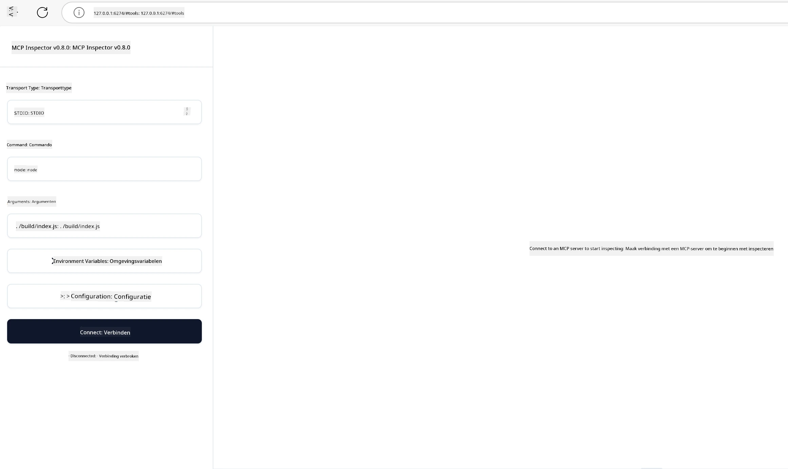

## Testen en Debuggen

Voordat je begint met het testen van je MCP-server, is het belangrijk om de beschikbare tools en best practices voor debugging te begrijpen. Effectief testen zorgt ervoor dat je server zich gedraagt zoals verwacht en helpt je om snel problemen te identificeren en op te lossen. De volgende sectie beschrijft aanbevolen benaderingen voor het valideren van je MCP-implementatie.

## Overzicht

Deze les behandelt hoe je de juiste testbenadering en het meest effectieve testhulpmiddel kunt kiezen.

## Leerdoelen

Aan het einde van deze les kun je:

- Verschillende benaderingen voor testen beschrijven.
- Verschillende tools gebruiken om je code effectief te testen.

## MCP-servers testen

MCP biedt tools om je te helpen je servers te testen en te debuggen:

- **MCP Inspector**: Een commandoregeltool die zowel als CLI-tool als visueel hulpmiddel kan worden uitgevoerd.
- **Handmatig testen**: Je kunt een tool zoals curl gebruiken om webverzoeken uit te voeren, maar elke tool die HTTP kan uitvoeren is geschikt.
- **Unittesten**: Het is mogelijk om je favoriete testframework te gebruiken om functies van zowel server als client te testen.

### MCP Inspector gebruiken

We hebben het gebruik van deze tool in eerdere lessen beschreven, maar laten we er hier op hoog niveau iets over zeggen. Het is een tool gebouwd in Node.js en je kunt het gebruiken door het `npx` uitvoerbare bestand aan te roepen, dat de tool zelf tijdelijk zal downloaden en installeren en zichzelf opruimt zodra je verzoek is uitgevoerd.

De [MCP Inspector](https://github.com/modelcontextprotocol/inspector) helpt je:

- **Servermogelijkheden ontdekken**: Automatisch beschikbare bronnen, tools en prompts detecteren
- **Testen van tooluitvoering**: Verschillende parameters proberen en reacties realtime bekijken
- **Servermetadata bekijken**: Serverinformatie, schema's en configuraties onderzoeken

Een typische uitvoering van de tool ziet er als volgt uit:

```bash
npx @modelcontextprotocol/inspector node build/index.js
```

Bovenstaande opdracht start een MCP en zijn visuele interface en opent een lokale webinterface in je browser. Je kunt een dashboard verwachten dat je geregistreerde MCP-servers toont, hun beschikbare tools, bronnen en prompts. De interface stelt je in staat om interactief tooluitvoering te testen, servermetadata te inspecteren en realtime reacties te bekijken, wat het eenvoudiger maakt om je MCP-serverimplementaties te valideren en debuggen.

Zo kan het eruitzien: 

Je kunt deze tool ook in CLI-modus uitvoeren, in dat geval voeg je de `--cli` eigenschap toe. Hier is een voorbeeld van het uitvoeren van de tool in "CLI"-modus, die alle tools op de server weergeeft:

```sh
npx @modelcontextprotocol/inspector --cli node build/index.js --method tools/list
```

### Handmatig testen

Naast het uitvoeren van de inspector tool om servermogelijkheden te testen, is een vergelijkbare aanpak het uitvoeren van een client die HTTP kan gebruiken, bijvoorbeeld curl.

Met curl kun je MCP-servers rechtstreeks testen met HTTP-verzoeken:

```bash
# Voorbeeld: Testserver metadata
curl http://localhost:3000/v1/metadata

# Voorbeeld: Voer een tool uit
curl -X POST http://localhost:3000/v1/tools/execute \
  -H "Content-Type: application/json" \
  -d '{"name": "calculator", "parameters": {"expression": "2+2"}}'
```

Zoals je kunt zien aan het bovenstaande gebruik van curl, gebruik je een POST-verzoek om een tool aan te roepen met een payload bestaande uit de toolnaam en de parameters. Gebruik de aanpak die het beste bij je past. CLI-tools zijn over het algemeen sneller in gebruik en lenen zich goed om gescript te worden, wat nuttig kan zijn in een CI/CD-omgeving.

### Unittesten

Maak unittests voor je tools en bronnen om ervoor te zorgen dat ze werken zoals verwacht. Hier is een voorbeeld van testcode.

```python
import pytest

from mcp.server.fastmcp import FastMCP
from mcp.shared.memory import (
    create_connected_server_and_client_session as create_session,
)

# Markeer de hele module voor asynchrone tests
pytestmark = pytest.mark.anyio


async def test_list_tools_cursor_parameter():
    """Test that the cursor parameter is accepted for list_tools.

    Note: FastMCP doesn't currently implement pagination, so this test
    only verifies that the cursor parameter is accepted by the client.
    """

 server = FastMCP("test")

    # Maak een paar testtools aan
    @server.tool(name="test_tool_1")
    async def test_tool_1() -> str:
        """First test tool"""
        return "Result 1"

    @server.tool(name="test_tool_2")
    async def test_tool_2() -> str:
        """Second test tool"""
        return "Result 2"

    async with create_session(server._mcp_server) as client_session:
        # Test zonder cursorparameter (weggelaten)
        result1 = await client_session.list_tools()
        assert len(result1.tools) == 2

        # Test met cursor=None
        result2 = await client_session.list_tools(cursor=None)
        assert len(result2.tools) == 2

        # Test met cursor als tekenreeks
        result3 = await client_session.list_tools(cursor="some_cursor_value")
        assert len(result3.tools) == 2

        # Test met lege tekenreeks als cursor
        result4 = await client_session.list_tools(cursor="")
        assert len(result4.tools) == 2
    
```

De bovenstaande code doet het volgende:

- Maakt gebruik van het pytest-framework, waarmee je tests als functies kunt maken en assert-statements kunt gebruiken.
- Creëert een MCP-server met twee verschillende tools.
- Gebruikt het `assert` statement om te controleren of bepaalde voorwaarden zijn voldaan.

Bekijk het [volledige bestand hier](https://github.com/modelcontextprotocol/python-sdk/blob/main/tests/client/test_list_methods_cursor.py)

Met het bovenstaande bestand kun je je eigen server testen om te zorgen dat mogelijkheden correct worden gemaakt.

Alle belangrijke SDK's hebben vergelijkbare testsecties, dus je kunt deze aanpassen aan je gekozen runtime.

## Voorbeelden

- [Java Calculator](../samples/java/calculator/README.md)
- [.Net Calculator](../../../../03-GettingStarted/samples/csharp)
- [JavaScript Calculator](../samples/javascript/README.md)
- [TypeScript Calculator](../samples/typescript/README.md)
- [Python Calculator](../../../../03-GettingStarted/samples/python)

## Aanvullende bronnen

- [Python SDK](https://github.com/modelcontextprotocol/python-sdk)

## Wat nu

- Volgende: [Deployment](../09-deployment/README.md)

---

<!-- CO-OP TRANSLATOR DISCLAIMER START -->
**Disclaimer**:
Dit document is vertaald met behulp van de AI-vertalingsdienst [Co-op Translator](https://github.com/Azure/co-op-translator). Hoewel we streven naar nauwkeurigheid, dient u zich ervan bewust te zijn dat automatische vertalingen fouten of onnauwkeurigheden kunnen bevatten. Het oorspronkelijke document in de moedertaal geldt als de gezaghebbende bron. Voor kritieke informatie wordt professionele menselijke vertaling aanbevolen. Wij zijn niet aansprakelijk voor eventuele misverstanden of verkeerde interpretaties die voortvloeien uit het gebruik van deze vertaling.
<!-- CO-OP TRANSLATOR DISCLAIMER END -->