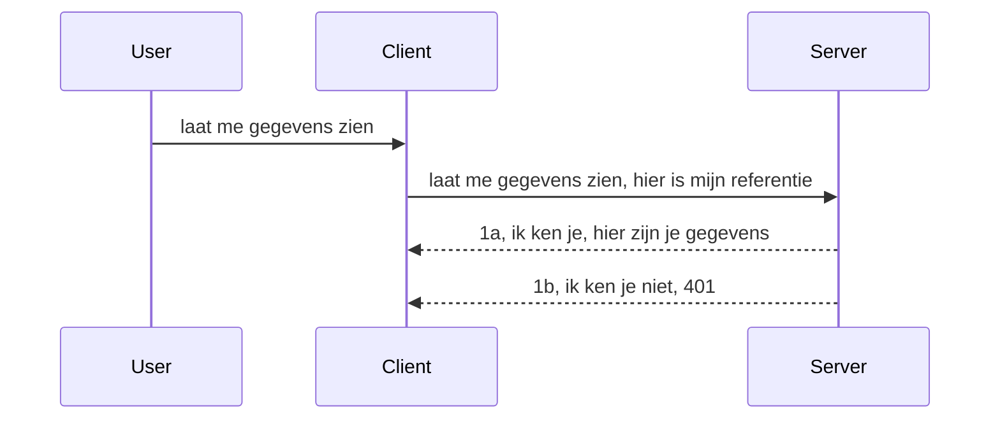

# Eenvoudige authenticatie

MCP SDK's ondersteunen het gebruik van OAuth 2.1 wat eerlijk gezegd een behoorlijk ingewikkeld proces is met concepten zoals authserver, resource server, het posten van inloggegevens, het krijgen van een code, het ruilen van de code voor een bearer-token totdat je eindelijk je resource data kunt ophalen. Als je niet gewend bent aan OAuth wat een geweldige implementatie is, is het een goed idee om te starten met een basisniveau van authenticatie en op te bouwen naar betere en betere beveiliging. Daarom bestaat dit hoofdstuk, om je op te bouwen naar meer geavanceerde authenticatie.

## Auth, wat bedoelen we?

Auth is een afkorting van authenticatie en autorisatie. Het idee is dat we twee dingen moeten doen:

- **Authenticatie**, dat is het proces om te achterhalen of we iemand toelaten om ons huis binnen te gaan, dat die persoon het recht heeft om "hier" te zijn, dat wil zeggen toegang hebben tot onze resource server waar onze MCP Server functies draaien.
- **Autorisatie**, is het proces om te bepalen of een gebruiker toegang zou moeten hebben tot die specifieke bronnen waar ze om vragen, bijvoorbeeld deze bestellingen of deze producten, of dat ze alleen toegang hebben om de content te lezen maar niet te verwijderen als een ander voorbeeld.

## Inloggegevens: hoe we het systeem vertellen wie we zijn

Nou, de meeste webontwikkelaars denken in termen van het verstrekken van een inloggegeven aan de server, meestal een geheim dat zegt of ze hier mogen zijn "Authenticatie". Dit inloggegeven is meestal een base64-gecodeerde versie van gebruikersnaam en wachtwoord of een API-sleutel die een specifieke gebruiker uniek identificeert.

Dit houdt in dat je het via een header verstuurt die "Authorization" heet, zoals:

```json
{ "Authorization": "secret123" }
```

Dit wordt meestal aangeduid als basic authentication. Hoe de algehele flow dan werkt is als volgt:


Nu we begrijpen hoe het werkt vanuit een flow-standpunt, hoe implementeren we het? Nou, de meeste webservers hebben een concept middleware, een stuk code dat draait als onderdeel van het verzoek dat inloggegevens kan verifiëren, en als de inloggegevens geldig zijn, kan het verzoek doorgelaten worden. Als er geen geldige inloggegevens zijn, krijg je een auth-fout. Laten we eens kijken hoe dit geïmplementeerd kan worden:

**Python**

```python
class AuthMiddleware(BaseHTTPMiddleware):
    async def dispatch(self, request, call_next):

        has_header = request.headers.get("Authorization")
        if not has_header:
            print("-> Missing Authorization header!")
            return Response(status_code=401, content="Unauthorized")

        if not valid_token(has_header):
            print("-> Invalid token!")
            return Response(status_code=403, content="Forbidden")

        print("Valid token, proceeding...")
       
        response = await call_next(request)
        # voeg eventuele klantheaders toe of wijzig op een bepaalde manier de respons
        return response


starlette_app.add_middleware(CustomHeaderMiddleware)
```

Hier hebben we:

- Een middleware gemaakt genaamd `AuthMiddleware` waar de `dispatch` methode door de webserver wordt aangeroepen.
- De middleware toegevoegd aan de webserver:

    ```python
    starlette_app.add_middleware(AuthMiddleware)
    ```

- Validatielogica geschreven die controleert of de Authorization-header aanwezig is en of het meegezonden geheim geldig is:

    ```python
    has_header = request.headers.get("Authorization")
    if not has_header:
        print("-> Missing Authorization header!")
        return Response(status_code=401, content="Unauthorized")

    if not valid_token(has_header):
        print("-> Invalid token!")
        return Response(status_code=403, content="Forbidden")
    ```

    als het geheim aanwezig en geldig is dan laten we het verzoek doorgaan door `call_next` aan te roepen en de response te retourneren.

    ```python
    response = await call_next(request)
    # voeg eventuele klantkoppen toe of wijzig op een of andere manier de respons
    return response
    ```

Hoe het werkt is dat als een webverzoek naar de server wordt gemaakt, de middleware wordt aangeroepen en gezien de implementatie wordt het verzoek of doorgelaten of er wordt een fout geretourneerd die aangeeft dat de client niet door mag gaan.

**TypeScript**

Hier maken we een middleware met het populaire framework Express en onderscheppen het verzoek voordat het bij de MCP Server aankomt. Hier is de code daarvoor:

```typescript
function isValid(secret) {
    return secret === "secret123";
}

app.use((req, res, next) => {
    // 1. Aanwezigheid van autorisatiekoptekst?
    if(!req.headers["Authorization"]) {
        res.status(401).send('Unauthorized');
    }
    
    let token = req.headers["Authorization"];

    // 2. Controleer geldigheid.
    if(!isValid(token)) {
        res.status(403).send('Forbidden');
    }

   
    console.log('Middleware executed');
    // 3. Geeft het verzoek door aan de volgende stap in de verwerkingspijplijn.
    next();
});
```

In deze code:

1. Controleren we of de Authorization-header in de eerste plaats aanwezig is, zo niet, sturen we een 401-fout.
2. Controleren we of het inloggegeven/token geldig is, zo niet, sturen we een 403-fout.
3. Tenslotte laten we het verzoek verder gaan in de request pipeline en retourneren de gevraagde resource.

## Oefening: Implementeer authenticatie

Laten we onze kennis gebruiken en het proberen te implementeren. Hier is het plan:

Server

- Maak een webserver- en MCP-instance.
- Implementeer een middleware voor de server.

Client

- Stuur webverzoek, met inloggegeven, via header.

### -1- Maak een webserver- en MCP-instance

In onze eerste stap moeten we de webserver-instance en de MCP Server aanmaken.

**Python**

Hier maken we een MCP server instance, maken we een starlette web app en hosten die met uvicorn.

```python
# MCP-server aan het maken

app = FastMCP(
    name="MCP Resource Server",
    instructions="Resource Server that validates tokens via Authorization Server introspection",
    host=settings["host"],
    port=settings["port"],
    debug=True
)

# starlette webapp aan het maken
starlette_app = app.streamable_http_app()

# app serveren via uvicorn
async def run(starlette_app):
    import uvicorn
    config = uvicorn.Config(
            starlette_app,
            host=app.settings.host,
            port=app.settings.port,
            log_level=app.settings.log_level.lower(),
        )
    server = uvicorn.Server(config)
    await server.serve()

run(starlette_app)
```

In deze code:

- Maken we de MCP Server aan.
- Construeren we de starlette web app van de MCP Server, `app.streamable_http_app()`.
- Hosten en serveren we de web app met uvicorn `server.serve()`.

**TypeScript**

Hier maken we een MCP Server instance.

```typescript
const server = new McpServer({
      name: "example-server",
      version: "1.0.0"
    });

    // ... stel serverbronnen, tools en prompts in ...
```

Deze MCP Server creatie moet plaatsvinden binnen onze POST /mcp route-definitie, dus laten we bovenstaande code verplaatsen zoals hieronder:

```typescript
import express from "express";
import { randomUUID } from "node:crypto";
import { McpServer } from "@modelcontextprotocol/sdk/server/mcp.js";
import { StreamableHTTPServerTransport } from "@modelcontextprotocol/sdk/server/streamableHttp.js";
import { isInitializeRequest } from "@modelcontextprotocol/sdk/types.js"

const app = express();
app.use(express.json());

// Kaart om transporten op te slaan per sessie-ID
const transports: { [sessionId: string]: StreamableHTTPServerTransport } = {};

// Verwerk POST-verzoeken voor client-naar-server communicatie
app.post('/mcp', async (req, res) => {
  // Controleer op bestaande sessie-ID
  const sessionId = req.headers['mcp-session-id'] as string | undefined;
  let transport: StreamableHTTPServerTransport;

  if (sessionId && transports[sessionId]) {
    // Hergebruik bestaande transport
    transport = transports[sessionId];
  } else if (!sessionId && isInitializeRequest(req.body)) {
    // Nieuwe initialisatie-aanvraag
    transport = new StreamableHTTPServerTransport({
      sessionIdGenerator: () => randomUUID(),
      onsessioninitialized: (sessionId) => {
        // Sla het transport op per sessie-ID
        transports[sessionId] = transport;
      },
      // DNS rebinding bescherming is standaard uitgeschakeld voor achterwaartse compatibiliteit. Als u deze server
      // lokaal uitvoert, zorg dan dat u het volgende instelt:
      // enableDnsRebindingProtection: true,
      // allowedHosts: ['127.0.0.1'],
    });

    // Ruim transport op wanneer gesloten
    transport.onclose = () => {
      if (transport.sessionId) {
        delete transports[transport.sessionId];
      }
    };
    const server = new McpServer({
      name: "example-server",
      version: "1.0.0"
    });

    // ... stel serverbronnen, tools en prompts in ...

    // Verbind met de MCP-server
    await server.connect(transport);
  } else {
    // Ongeldig verzoek
    res.status(400).json({
      jsonrpc: '2.0',
      error: {
        code: -32000,
        message: 'Bad Request: No valid session ID provided',
      },
      id: null,
    });
    return;
  }

  // Verwerk het verzoek
  await transport.handleRequest(req, res, req.body);
});

// Herbruikbare handler voor GET- en DELETE-verzoeken
const handleSessionRequest = async (req: express.Request, res: express.Response) => {
  const sessionId = req.headers['mcp-session-id'] as string | undefined;
  if (!sessionId || !transports[sessionId]) {
    res.status(400).send('Invalid or missing session ID');
    return;
  }
  
  const transport = transports[sessionId];
  await transport.handleRequest(req, res);
};

// Verwerk GET-verzoeken voor server-naar-client notificaties via SSE
app.get('/mcp', handleSessionRequest);

// Verwerk DELETE-verzoeken voor sessiebeëindiging
app.delete('/mcp', handleSessionRequest);

app.listen(3000);
```

Nu zie je hoe de MCP Server creatie is verplaatst binnen `app.post("/mcp")`.

Laten we doorgaan naar de volgende stap om de middleware te maken zodat we de inkomende inloggegevens kunnen valideren.

### -2- Implementeer een middleware voor de server

Laten we doorgaan met het middleware-gedeelte. Hier maken we een middleware die zoekt naar inloggegevens in de `Authorization` header en valideert. Als het acceptabel is, gaat het verzoek door om te doen wat het moet doen (bijvoorbeeld tools lijst, resource lezen of welke MCP-functionaliteit de client ook vroeg).

**Python**

Om de middleware te maken, moeten we een klasse maken die erft van `BaseHTTPMiddleware`. Er zijn twee interessante onderdelen:

- Het verzoek `request` , waar we header-info uit lezen.
- `call_next` de callback die we moeten aanroepen als de client een inloggegeven meebrengt die we accepteren.

Eerst moeten we het geval afhandelen als de `Authorization` header ontbreekt:

```python
has_header = request.headers.get("Authorization")

# geen kop aanwezig, faal met 401, anders doorgaan.
if not has_header:
    print("-> Missing Authorization header!")
    return Response(status_code=401, content="Unauthorized")
```

Hier sturen we een 401 unauthorized bericht omdat de client niet slaagt voor authenticatie.

Vervolgens, als er een inloggegeven is meegezonden, moeten we de geldigheid controleren zoals:

```python
 if not valid_token(has_header):
    print("-> Invalid token!")
    return Response(status_code=403, content="Forbidden")
```

Let op hoe we hierboven een 403 forbidden bericht sturen. Hieronder de volledige middleware die alles implementeert wat we hierboven noemden:

```python
class AuthMiddleware(BaseHTTPMiddleware):
    async def dispatch(self, request, call_next):

        has_header = request.headers.get("Authorization")
        if not has_header:
            print("-> Missing Authorization header!")
            return Response(status_code=401, content="Unauthorized")

        if not valid_token(has_header):
            print("-> Invalid token!")
            return Response(status_code=403, content="Forbidden")

        print("Valid token, proceeding...")
        print(f"-> Received {request.method} {request.url}")
        response = await call_next(request)
        response.headers['Custom'] = 'Example'
        return response

```

Geweldig, maar hoe zit het met de functie `valid_token`? Die zie je hieronder:

```python
# NIET gebruiken voor productie - verbeter het !!
def valid_token(token: str) -> bool:
    # verwijder de "Bearer " prefix
    if token.startswith("Bearer "):
        token = token[7:]
        return token == "secret-token"
    return False
```

Dit kan uiteraard verbeterd worden.

BELANGRIJK: Je moet NOOIT geheimen zoals deze in code hebben staan. Je zou idealiter de waarde om mee te vergelijken ophalen uit een databron of van een IDP (identity service provider) of beter nog, de IDP het validatiewerk laten doen.

**TypeScript**

Om dit met Express te implementeren, moeten we de `use` methode aanroepen die middleware functies accepteert.

We moeten:

- Interacteren met het verzoek-variabele om het meegegeven inloggegeven in de `Authorization` eigenschap te controleren.
- Het inloggegeven valideren, en als dat klopt het verzoek verder laten gaan zodat de client zijn MCP-verzoek kan doen wat het moet (bijv tools lijsten, resource lezen of iets anders MCP-gerelateerd).

Hier controleren we of de `Authorization` header aanwezig is en als dat niet zo is stoppen we het verzoek:

```typescript
if(!req.headers["authorization"]) {
    res.status(401).send('Unauthorized');
    return;
}
```

Als de header helemaal niet wordt meegestuurd in de eerste plaats, krijg je een 401.

Vervolgens controleren we of het inloggegeven geldig is, zo niet stoppen we het verzoek weer maar nu met een iets andere melding:

```typescript
if(!isValid(token)) {
    res.status(403).send('Forbidden');
    return;
} 
```

Let op dat je nu een 403-fout krijgt.

Hier is de volledige code:

```typescript
app.use((req, res, next) => {
    console.log('Request received:', req.method, req.url, req.headers);
    console.log('Headers:', req.headers["authorization"]);
    if(!req.headers["authorization"]) {
        res.status(401).send('Unauthorized');
        return;
    }
    
    let token = req.headers["authorization"];

    if(!isValid(token)) {
        res.status(403).send('Forbidden');
        return;
    }  

    console.log('Middleware executed');
    next();
});
```

We hebben de webserver zo opgezet dat het een middleware accepteert om het inloggegeven te checken die de client hopelijk meegeeft. Hoe zit het met de client zelf?

### -3- Verstuur webverzoek met inloggegeven via header

We moeten ervoor zorgen dat de client het inloggegeven via de header meestuurt. Omdat we een MCP client gaan gebruiken, moeten we uitzoeken hoe dat moet.

**Python**

Voor de client moeten we een header meesturen met onze inloggegeven zoals:

```python
# SCHRIJF DE WAARDE NIET HARDCODEREN, bewaar deze minimaal in een omgevingsvariabele of een veiligere opslag
token = "secret-token"

async with streamablehttp_client(
        url = f"http://localhost:{port}/mcp",
        headers = {"Authorization": f"Bearer {token}"}
    ) as (
        read_stream,
        write_stream,
        session_callback,
    ):
        async with ClientSession(
            read_stream,
            write_stream
        ) as session:
            await session.initialize()
      
            # TODO, wat je gedaan wilt hebben in de client, bv. lijst gereedschappen, roep gereedschappen aan etc.
```

Let op dat we de `headers` property zo populeren ` headers = {"Authorization": f"Bearer {token}"}`.

**TypeScript**

We kunnen dit in twee stappen oplossen:

1. Populeer een configuratie-object met onze inloggegeven.
2. Geef het configuratie-object door aan de transport.

```typescript

// GEEF DE WAARDE NIET hardcoded op zoals hier getoond. Gebruik minimaal een omgevingsvariabele en iets als dotenv (in ontwikkelmodus).
let token = "secret123"

// definieer een client transportoptieobject
let options: StreamableHTTPClientTransportOptions = {
  sessionId: sessionId,
  requestInit: {
    headers: {
      "Authorization": "secret123"
    }
  }
};

// geef het optiesobject door aan de transportlaag
async function main() {
   const transport = new StreamableHTTPClientTransport(
      new URL(serverUrl),
      options
   );
```

Hier zie je hierboven hoe we een `options` object moesten maken en onze headers onder de `requestInit` eigenschap plaatsten.

BELANGRIJK: Hoe verbeteren we dit vanaf hier? Wel, de huidige implementatie heeft wat problemen. Ten eerste, het meesturen van inloggegevens op deze manier is behoorlijk riskant tenzij je op zijn minst HTTPS hebt. Zelfs dan kan het inloggegeven gestolen worden, dus je hebt een systeem nodig waarin je het token makkelijk kunt intrekken en extra checks kunt toevoegen zoals waar het vandaan komt, vindt het verzoek te vaak plaats (bot-achtig gedrag), kortom er zijn veel zorgen.

Het moet gezegd worden dat dit een goede start is voor hele simpele API's waarbij je niet wilt dat zomaar iedereen je API kan aanroepen zonder geverifieerd te zijn.

Met dat gezegd, laten we proberen de beveiliging wat te versterken door een gestandaardiseerd formaat te gebruiken zoals JSON Web Token, ook bekend als JWT of "JOT" tokens.

## JSON Web Tokens, JWT

Dus, we proberen dingen te verbeteren ten opzichte van het sturen van heel simpele inloggegevens. Wat zijn de directe verbeteringen als we JWT adopteren?

- **Beveiligingsverbeteringen**. In basic auth stuur je de gebruikersnaam en het wachtwoord als base64-gecodeerd token (of je stuurt een API sleutel) keer op keer mee wat het risico verhoogt. Met JWT stuur je je gebruikersnaam en wachtwoord en krijgt een token terug die ook tijdgebonden is, dat wil zeggen dat het verloopt. JWT laat je makkelijk gebruik maken van fijnmazige toegangscontrole via rollen, scopes en permissies.
- **Stateloosheid en schaalbaarheid**. JWT's zijn self-contained, ze dragen alle gebruikersinfo en elimineren de noodzaak van server-side sessie opslag. Token kan ook lokaal gevalideerd worden.
- **Interoperabiliteit en federation**. JWT's zijn centraal in Open ID Connect en worden gebruikt met bekende identity providers zoals Entra ID, Google Identity en Auth0. Ze maken ook single sign on mogelijk en nog veel meer waardoor het enterprise-grade is.
- **Modulariteit en flexibiliteit**. JWT's kunnen ook worden gebruikt met API Gateways zoals Azure API Management, NGINX en meer. Het ondersteunt authenticatiescenario's en server-to-service communicatie inclusief imitatie en delegatie scenario's.
- **Prestaties en caching**. JWT's kunnen gecached worden na decodering wat het parsen vermindert. Dit helpt vooral bij apps met veel verkeer omdat het doorvoer verbetert en de belasting op je infrastructuur verlaagt.
- **Geavanceerde features**. Het ondersteunt ook introspectie (validiteit checken op server) en intrekking (token ongeldig maken).

Met al deze voordelen, laten we kijken hoe we onze implementatie naar het volgende niveau kunnen tillen.

## Basic auth omzetten naar JWT

Dus de veranderingen die we op hoofdlijnen moeten doen zijn:

- **Leren een JWT token te construeren** en klaar te maken voor verzending van client naar server.
- **Een JWT token valideren**, en als dat klopt, de client onze resources laten gebruiken.
- **Veilige token opslag**. Hoe we dit token opslaan.
- **Bescherm de routes**. We moeten de routes beschermen, in ons geval moeten we routes en specifieke MCP-functies beveiligen.
- **Voeg refresh tokens toe**. Zorg dat we tokens maken die korte levensduur hebben maar refresh tokens die lang leven en gebruikt kunnen worden om nieuwe tokens te krijgen als ze verlopen zijn. Zorg ook dat er een refresh endpoint en een rotatiestrategie is.

### -1- Maak een JWT token

Ten eerste heeft een JWT token de volgende onderdelen:

- **header**, gebruikte algoritme en token type.
- **payload**, claims, zoals sub (de gebruiker of entiteit die het token representeert. In een auth-scenario is dit typisch de userid), exp (wanneer het verloopt) rol (de rol)
- **handtekening**, ondertekend met een geheim of private sleutel.

Hiervoor moeten we de header, payload en het geëncodeerde token maken.

**Python**

```python

import jwt
import jwt
from jwt.exceptions import ExpiredSignatureError, InvalidTokenError
import datetime

# Geheime sleutel gebruikt om de JWT te ondertekenen
secret_key = 'your-secret-key'

header = {
    "alg": "HS256",
    "typ": "JWT"
}

# de gebruikersinformatie en zijn claims en vervaltijd
payload = {
    "sub": "1234567890",               # Onderwerp (gebruikers-ID)
    "name": "User Userson",                # Aangepaste claim
    "admin": True,                     # Aangepaste claim
    "iat": datetime.datetime.utcnow(),# Uitgegeven op
    "exp": datetime.datetime.utcnow() + datetime.timedelta(hours=1)  # Vervaldatum
}

# codeer het
encoded_jwt = jwt.encode(payload, secret_key, algorithm="HS256", headers=header)
```

In de bovenstaande code hebben we:

- Een header gedefinieerd met HS256 als algoritme en type JWT.
- Een payload geconstrueerd die een subject of user id bevat, een gebruikersnaam, een rol, wanneer het uitgegeven is en wanneer het verloopt waarmee het tijdgebonden aspect wordt geïmplementeerd.

**TypeScript**

Hier hebben we wat dependencies nodig die ons helpen de JWT token te construeren.

Dependencies

```sh

npm install jsonwebtoken
npm install --save-dev @types/jsonwebtoken
```

Nu dat we dat op orde hebben, gaan we de header, payload maken en daarmee het geëncodeerde token creëren.

```typescript
import jwt from 'jsonwebtoken';

const secretKey = 'your-secret-key'; // Gebruik omgevingsvariabelen in productie

// Definieer de payload
const payload = {
  sub: '1234567890',
  name: 'User usersson',
  admin: true,
  iat: Math.floor(Date.now() / 1000), // Uitgegeven op
  exp: Math.floor(Date.now() / 1000) + 60 * 60 // Verloopt over 1 uur
};

// Definieer de header (optioneel, jsonwebtoken stelt standaardwaarden in)
const header = {
  alg: 'HS256',
  typ: 'JWT'
};

// Maak de token aan
const token = jwt.sign(payload, secretKey, {
  algorithm: 'HS256',
  header: header
});

console.log('JWT:', token);
```

Deze token is:

Ondertekend met HS256
Geldig voor 1 uur
Bevat claims zoals sub, name, admin, iat en exp.

### -2- Valideer een token

We moeten ook een token valideren, dit moeten we op de server doen om zeker te weten dat wat de client ons stuurt geldig is. Er zijn veel controles die we moeten doen, van de structuur tot de geldigheid. Je wordt ook aangemoedigd extra controles toe te voegen om te zien of de gebruiker in jouw systeem zit en meer.

Om een token te valideren moeten we het decoderen zodat we het kunnen lezen en dan beginnen met validatie:

**Python**

```python

# Decodeer en verifieer de JWT
try:
    decoded = jwt.decode(token, secret_key, algorithms=["HS256"])
    print("✅ Token is valid.")
    print("Decoded claims:")
    for key, value in decoded.items():
        print(f"  {key}: {value}")
except ExpiredSignatureError:
    print("❌ Token has expired.")
except InvalidTokenError as e:
    print(f"❌ Invalid token: {e}")

```

In deze code roepen we `jwt.decode` aan met als input de token, de geheime sleutel en het gekozen algoritme. Let op dat we een try-catch constructie gebruiken omdat een mislukte validatie een fout veroorzaakt.

**TypeScript**

Hier moeten we `jwt.verify` aanroepen om een gedecodeerde versie van de token te krijgen om verder te analyseren. Als deze call faalt, betekent dat dat de structuur van de token niet correct is of dat hij niet meer geldig is.

```typescript

try {
  const decoded = jwt.verify(token, secretKey);
  console.log('Decoded Payload:', decoded);
} catch (err) {
  console.error('Token verification failed:', err);
}
```

OPMERKING: zoals eerder vermeld, moeten we extra controles doen om zeker te zijn dat deze token verwijst naar een gebruiker in ons systeem en dat de gebruiker de rechten heeft die wordt opgegeven.

Laten we nu kijken naar op rol gebaseerde toegangscontrole, ook wel RBAC genoemd.
## Rollen-gebaseerde toegangscontrole toevoegen

Het idee is dat we willen uitdrukken dat verschillende rollen verschillende permissies hebben. Bijvoorbeeld, we gaan ervan uit dat een admin alles kan doen, een normale gebruiker lezen/schrijven kan en een gast alleen kan lezen. Daarom zijn hier enkele mogelijke permissieniveaus:

- Admin.Write  
- User.Read  
- Guest.Read  

Laten we bekijken hoe we zo'n controle met middleware kunnen implementeren. Middleware kan per route worden toegevoegd, maar ook voor alle routes.

**Python**

```python
from starlette.middleware.base import BaseHTTPMiddleware
from starlette.responses import JSONResponse
import jwt

# HEEFT NIET het geheim in de code zoals, dit is alleen voor demonstratiedoeleinden. Lees het van een veilige plek.
SECRET_KEY = "your-secret-key" # zet dit in een env-variabele
REQUIRED_PERMISSION = "User.Read"

class JWTPermissionMiddleware(BaseHTTPMiddleware):
    async def dispatch(self, request, call_next):
        auth_header = request.headers.get("Authorization")
        if not auth_header or not auth_header.startswith("Bearer "):
            return JSONResponse({"error": "Missing or invalid Authorization header"}, status_code=401)

        token = auth_header.split(" ")[1]
        try:
            decoded = jwt.decode(token, SECRET_KEY, algorithms=["HS256"])
        except jwt.ExpiredSignatureError:
            return JSONResponse({"error": "Token expired"}, status_code=401)
        except jwt.InvalidTokenError:
            return JSONResponse({"error": "Invalid token"}, status_code=401)

        permissions = decoded.get("permissions", [])
        if REQUIRED_PERMISSION not in permissions:
            return JSONResponse({"error": "Permission denied"}, status_code=403)

        request.state.user = decoded
        return await call_next(request)


```
  
Er zijn een paar verschillende manieren om de middleware toe te voegen zoals hieronder:

```python

# Alt 1: voeg middleware toe tijdens het construeren van de starlette-app
middleware = [
    Middleware(JWTPermissionMiddleware)
]

app = Starlette(routes=routes, middleware=middleware)

# Alt 2: voeg middleware toe nadat de starlette-app al is geconstrueerd
starlette_app.add_middleware(JWTPermissionMiddleware)

# Alt 3: voeg middleware per route toe
routes = [
    Route(
        "/mcp",
        endpoint=..., # handler
        middleware=[Middleware(JWTPermissionMiddleware)]
    )
]
```
  
**TypeScript**

We kunnen `app.use` gebruiken en een middleware die voor alle verzoeken wordt uitgevoerd.

```typescript
app.use((req, res, next) => {
    console.log('Request received:', req.method, req.url, req.headers);
    console.log('Headers:', req.headers["authorization"]);

    // 1. Controleer of de autorisatieheader is verzonden

    if(!req.headers["authorization"]) {
        res.status(401).send('Unauthorized');
        return;
    }
    
    let token = req.headers["authorization"];

    // 2. Controleer of het token geldig is
    if(!isValid(token)) {
        res.status(403).send('Forbidden');
        return;
    }  

    // 3. Controleer of de gebruiker van het token in ons systeem bestaat
    if(!isExistingUser(token)) {
        res.status(403).send('Forbidden');
        console.log("User does not exist");
        return;
    }
    console.log("User exists");

    // 4. Verifieer of het token de juiste rechten heeft
    if(!hasScopes(token, ["User.Read"])){
        res.status(403).send('Forbidden - insufficient scopes');
    }

    console.log("User has required scopes");

    console.log('Middleware executed');
    next();
});

```
  
Er zijn behoorlijk wat dingen die onze middleware kan doen en die onze middleware MOET doen, namelijk:

1. Controleren of de autorisatie-header aanwezig is  
2. Controleren of het token geldig is; we roepen `isValid` aan, een methode die we hebben geschreven die de integriteit en geldigheid van het JWT-token controleert.  
3. Verifiëren dat de gebruiker bestaat in ons systeem, hier moeten we op controleren.

   ```typescript
    // gebruikers in DB
   const users = [
     "user1",
     "User usersson",
   ]

   function isExistingUser(token) {
     let decodedToken = verifyToken(token);

     // TODO, controleer of gebruiker bestaat in DB
     return users.includes(decodedToken?.name || "");
   }
   ```
  
   Boven hebben we een eenvoudige `users` lijst gemaakt, die natuurlijk in een database zou moeten staan.

4. Daarnaast moeten we ook controleren of het token de juiste permissies heeft.

   ```typescript
   if(!hasScopes(token, ["User.Read"])){
        res.status(403).send('Forbidden - insufficient scopes');
   }
   ```
  
   In bovenstaande code in de middleware controleren we dat het token User.Read permissie bevat; zo niet, sturen we een 403-fout. Hieronder staat de `hasScopes` helper-methode.

   ```typescript
   function hasScopes(scope: string, requiredScopes: string[]) {
     let decodedToken = verifyToken(scope);
    return requiredScopes.every(scope => decodedToken?.scopes.includes(scope));
  }  
   ```

Have a think which additional checks you should be doing, but these are the absolute minimum of checks you should be doing.

Using Express as a web framework is a common choice. There are helpers library when you use JWT so you can write less code.

- `express-jwt`, helper library that provides a middleware that helps decode your token.
- `express-jwt-permissions`, this provides a middleware `guard` that helps check if a certain permission is on the token.

Here's what these libraries can look like when used:

```typescript
const express = require('express');
const jwt = require('express-jwt');
const guard = require('express-jwt-permissions')();

const app = express();
const secretKey = 'your-secret-key'; // put this in env variable

// Decode JWT and attach to req.user
app.use(jwt({ secret: secretKey, algorithms: ['HS256'] }));

// Check for User.Read permission
app.use(guard.check('User.Read'));

// multiple permissions
// app.use(guard.check(['User.Read', 'Admin.Access']));

app.get('/protected', (req, res) => {
  res.json({ message: `Welcome ${req.user.name}` });
});

// Error handler
app.use((err, req, res, next) => {
  if (err.code === 'permission_denied') {
    return res.status(403).send('Forbidden');
  }
  next(err);
});

```
  
Je hebt nu gezien hoe middleware zowel voor authenticatie als autorisatie kan worden gebruikt, maar hoe zit het met MCP? Verandert het iets aan hoe we authenticeren? Laten we dat ontdekken in de volgende sectie.

### -3- RBAC toevoegen aan MCP

Je hebt tot nu toe gezien hoe je RBAC via middleware kunt toevoegen, maar voor MCP is er geen gemakkelijke manier om RBAC per MCP-functie toe te voegen, wat doen we dan? Nou, we moeten gewoon code toevoegen zoals deze die in dit geval controleert of de client de rechten heeft om een specifieke tool aan te roepen:

Je hebt verschillende keuzes om RBAC per functie te realiseren, hier zijn er een paar:

- Voeg een controle toe voor elke tool, bron, prompt waar je het permissieniveau moet controleren.

   **python**

   ```python
   @tool()
   def delete_product(id: int):
      try:
          check_permissions(role="Admin.Write", request)
      catch:
        pass # client mislukt bij autorisatie, werp autorisatiefout op
   ```
  
   **typescript**

   ```typescript
   server.registerTool(
    "delete-product",
    {
      title: Delete a product",
      description: "Deletes a product",
      inputSchema: { id: z.number() }
    },
    async ({ id }) => {
      
      try {
        checkPermissions("Admin.Write", request);
        // todo, stuur id naar productService en remote entry
      } catch(Exception e) {
        console.log("Authorization error, you're not allowed");  
      }

      return {
        content: [{ type: "text", text: `Deletected product with id ${id}` }]
      };
    }
   );
   ```


- Gebruik een geavanceerde serveraanpak en de request handlers zodat je het aantal plekken waar je de controle moet doen minimaliseert.

   **Python**

   ```python
   
   tool_permission = {
      "create_product": ["User.Write", "Admin.Write"],
      "delete_product": ["Admin.Write"]
   }

   def has_permission(user_permissions, required_permissions) -> bool:
      # gebruikersrechten: lijst van rechten die de gebruiker heeft
      # vereiste_rechten: lijst van rechten die nodig zijn voor de tool
      return any(perm in user_permissions for perm in required_permissions)

   @server.call_tool()
   async def handle_call_tool(
     name: str, arguments: dict[str, str] | None
   ) -> list[types.TextContent]:
    # Neem aan dat request.user.permissions een lijst is van rechten voor de gebruiker
     user_permissions = request.user.permissions
     required_permissions = tool_permission.get(name, [])
     if not has_permission(user_permissions, required_permissions):
        # Gooi een foutmelding "Je hebt geen toestemming om de tool {name} te gebruiken"
        raise Exception(f"You don't have permission to call tool {name}")
     # doorgaan en de tool aanroepen
     # ...
   ```   
   

   **TypeScript**

   ```typescript
   function hasPermission(userPermissions: string[], requiredPermissions: string[]): boolean {
       if (!Array.isArray(userPermissions) || !Array.isArray(requiredPermissions)) return false;
       // Retourneer true als de gebruiker minstens één vereiste toestemming heeft
       
       return requiredPermissions.some(perm => userPermissions.includes(perm));
   }
  
   server.setRequestHandler(CallToolRequestSchema, async (request) => {
      const { params: { name } } = request;
  
      let permissions = request.user.permissions;
  
      if (!hasPermission(permissions, toolPermissions[name])) {
         return new Error(`You don't have permission to call ${name}`);
      }
  
      // ga door..
   });
   ```
  
   Let op, je moet ervoor zorgen dat je middleware een gedecodeerd token toekent aan de gebruiker-eigenschap van het verzoek, zodat bovenstaande code eenvoudig is.

### Samenvatting

Nu we hebben besproken hoe ondersteuning voor RBAC in het algemeen en voor MCP in het bijzonder kan worden toegevoegd, is het tijd om zelf beveiliging te implementeren om te zorgen dat je de gepresenteerde concepten hebt begrepen.

## Opdracht 1: Bouw een MCP-server en MCP-client met basis authenticatie

Hier ga je aan de slag met wat je hebt geleerd over het versturen van inloggegevens via headers.

## Oplossing 1

[Oplossing 1](./code/basic/README.md)

## Opdracht 2: Upgrade de oplossing uit Opdracht 1 naar JWT

Neem de eerste oplossing, maar deze keer verbeteren we het.

In plaats van Basic Auth, gebruiken we JWT.

## Oplossing 2

[Oplossing 2](./solution/jwt-solution/README.md)

## Uitdaging

Voeg RBAC per tool toe zoals beschreven in de sectie "Add RBAC to MCP".

## Samenvatting

Hopelijk heb je veel geleerd in dit hoofdstuk, van geen beveiliging, tot basis beveiliging, tot JWT en hoe dit aan MCP kan worden toegevoegd.

We hebben een stevige basis gelegd met aangepaste JWT’s, maar naarmate we opschalen, bewegen we naar een op standaarden gebaseerd identiteitsmodel. Het adopteren van een IdP zoals Entra of Keycloak stelt ons in staat om token-uitgifte, validatie en levenscyclusbeheer over te dragen aan een vertrouwd platform — zodat wij ons kunnen richten op applicatielogica en gebruikerservaring.

Hiervoor hebben we een meer [geavanceerd hoofdstuk over Entra](../../05-AdvancedTopics/mcp-security-entra/README.md)

## Wat volgt hierna

- Volgende: [Het opzetten van MCP Hosts](../12-mcp-hosts/README.md)

---

<!-- CO-OP TRANSLATOR DISCLAIMER START -->
**Disclaimer**:  
Dit document is vertaald met behulp van de AI-vertalingsdienst [Co-op Translator](https://github.com/Azure/co-op-translator). Hoewel we streven naar nauwkeurigheid, dient u er rekening mee te houden dat automatische vertalingen fouten of onnauwkeurigheden kunnen bevatten. Het oorspronkelijke document in de oorspronkelijke taal geldt als de gezaghebbende bron. Voor belangrijke informatie wordt professionele menselijke vertaling aanbevolen. Wij zijn niet aansprakelijk voor eventuele misverstanden of verkeerde interpretaties die voortvloeien uit het gebruik van deze vertaling.
<!-- CO-OP TRANSLATOR DISCLAIMER END -->