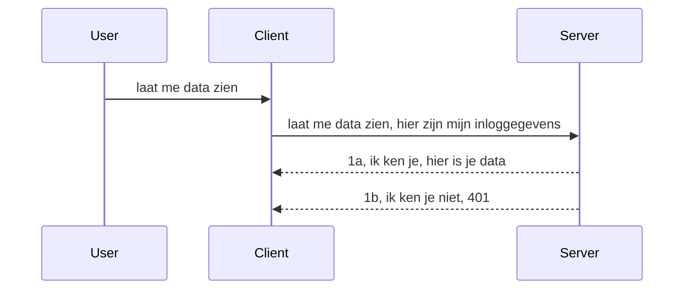

# Eenvoudige authenticatie

MCP SDK's ondersteunen het gebruik van OAuth 2.1, wat eerlijk gezegd een tamelijk complex proces is met concepten zoals auth-server, resource-server, het versturen van inloggegevens, het verkrijgen van een code, het omwisselen van die code voor een bearer-token totdat je uiteindelijk toegang hebt tot je resourcegegevens. Als je niet gewend bent aan OAuth, wat een geweldige implementatie is, is het een goed idee om te beginnen met een basisniveau van authenticatie en op te bouwen naar steeds betere beveiliging. Daarom bestaat dit hoofdstuk, om je op te bouwen naar meer geavanceerde authenticatie.

## Authenticatie, wat bedoelen we ermee?

Authenticatie is een afkorting van authenticatie en autorisatie. Het idee is dat we twee dingen moeten doen:

- **Authenticatie**, het proces om te achterhalen of we iemand ons huis laten betreden, oftewel dat ze het recht hebben om "hier te zijn", dat wil zeggen toegang tot onze resource-server waar onze MCP Server-functies zich bevinden.
- **Autorisatie**, het proces om uit te zoeken of een gebruiker toegang mag hebben tot de specifieke resources die ze opvragen, bijvoorbeeld deze bestellingen of producten, of dat ze bijvoorbeeld alleen de inhoud mogen lezen maar niet mogen verwijderen.

## Inloggegevens: hoe we het systeem vertellen wie we zijn

Nou, de meeste webontwikkelaars denken in termen van het verstrekken van een inloggegeven aan de server, meestal een geheim dat aangeeft of ze hier mogen zijn "Authenticatie". Dit inloggegeven is meestal een base64-gecodeerde versie van gebruikersnaam en wachtwoord of een API-sleutel die een specifieke gebruiker uniek identificeert.

Dit houdt in dat het wordt verzonden via een header genaamd "Authorization", zoals volgt:

```json
{ "Authorization": "secret123" }
```

Dit wordt meestal basic authentication genoemd. Hoe de algemene flow dan werkt, is op de volgende manier:


```mermaid
sequenceDiagram
   participant User
   participant Client
   participant Server

   User->>Client: laat me data zien
   Client->>Server: laat me data zien, hier zijn mijn inloggegevens
   Server-->>Client: 1a, ik ken je, hier is je data
   Server-->>Client: 1b, ik ken je niet, 401 
```

Nu we begrijpen hoe het werkt vanuit een flowperspectief, hoe implementeren we het? Nou, de meeste webservers hebben een concept genaamd middleware, een stukje code dat als onderdeel van het verzoek wordt uitgevoerd en inloggegevens kan verifiëren, en als de inloggegevens geldig zijn, kan het verzoek doorgang verlenen. Als het verzoek geen geldige inloggegevens heeft, krijg je een authenticatiefout. Laten we zien hoe dit geïmplementeerd kan worden:

**Python**

```python
class AuthMiddleware(BaseHTTPMiddleware):
    async def dispatch(self, request, call_next):

        has_header = request.headers.get("Authorization")
        if not has_header:
            print("-> Missing Authorization header!")
            return Response(status_code=401, content="Unauthorized")

        if not valid_token(has_header):
            print("-> Invalid token!")
            return Response(status_code=403, content="Forbidden")

        print("Valid token, proceeding...")
       
        response = await call_next(request)
        # voeg eventuele klantkoppen toe of wijzig op enige wijze de reactie
        return response


starlette_app.add_middleware(CustomHeaderMiddleware)
```

Hier hebben we:

- Een middleware gemaakt genaamd `AuthMiddleware` waar de `dispatch` methode door de webserver wordt aangeroepen.
- De middleware toegevoegd aan de webserver:

    ```python
    starlette_app.add_middleware(AuthMiddleware)
    ```

- Validatielogica geschreven die controleert of de Authorization-header aanwezig is en of het meegezonden geheim geldig is:

    ```python
    has_header = request.headers.get("Authorization")
    if not has_header:
        print("-> Missing Authorization header!")
        return Response(status_code=401, content="Unauthorized")

    if not valid_token(has_header):
        print("-> Invalid token!")
        return Response(status_code=403, content="Forbidden")
    ```

    als het geheim aanwezig en geldig is, laten we het verzoek doorgaan door `call_next` aan te roepen en geven we de response terug.

    ```python
    response = await call_next(request)
    # voeg eventuele klantkoppen toe of wijzig de reactie op een bepaalde manier
    return response
    ```

Hoe het werkt is dat als een webverzoek naar de server wordt gedaan, de middleware wordt aangeroepen en gezien de implementatie laat het ofwel het verzoek door, of in het geval van ongeldig, geeft het een foutmelding terug die aangeeft dat de client niet mag doorgaan.

**TypeScript**

Hier maken we een middleware met het populaire framework Express en onderscheppen het verzoek voordat het de MCP Server bereikt. Hier is de code daarvoor:

```typescript
function isValid(secret) {
    return secret === "secret123";
}

app.use((req, res, next) => {
    // 1. Autorisatieheader aanwezig?
    if(!req.headers["Authorization"]) {
        res.status(401).send('Unauthorized');
    }
    
    let token = req.headers["Authorization"];

    // 2. Controleer geldigheid.
    if(!isValid(token)) {
        res.status(403).send('Forbidden');
    }

   
    console.log('Middleware executed');
    // 3. Geeft verzoek door aan de volgende stap in de aanvraagpijplijn.
    next();
});
```

In deze code:

1. Controleren we of de Authorization-header überhaupt aanwezig is, zo niet dan sturen we een 401 fout.
2. Controleren we of het inloggegeven/token geldig is, zo niet sturen we een 403 fout.
3. Geven het verzoek door in de request pipeline en retourneren de gevraagde resource.

## Oefening: Implementeer authenticatie

Laten we onze kennis gebruiken en proberen het te implementeren. Dit is het plan:

Server

- Maak een webserver en MCP instantie.
- Implementeer een middleware voor de server.

Client

- Verstuur een webverzoek met inloggegeven via header.

### -1- Maak een webserver en MCP instantie

> [!WARNING]
> Het TypeScript voorbeeld hieronder richt zich op MCP `2025-11-25`. Het volgt transports
> via `mcp-session-id` en is geen actueel `2026-07-28` transportvoorbeeld. MCP
> `2026-07-28` verwijdert de `initialize` handshake en protocol session ID; nieuwe
> implementaties gebruiken self-contained requests. Zie
> [Wat is er veranderd in MCP: De 2026-07-28 Specificatie](../../01-CoreConcepts/mcp-2026-07-28.md).

In onze eerste stap moeten we de webserver-instantie en de MCP Server aanmaken.

**Python**

Hier maken we een MCP server-instantie, creëren een starlette webapp en hosten deze met uvicorn.

```python
# server MCP aan het maken

app = FastMCP(
    name="MCP Resource Server",
    instructions="Resource Server that validates tokens via Authorization Server introspection",
    host=settings["host"],
    port=settings["port"],
    debug=True
)

# starlette webapp aan het maken
starlette_app = app.streamable_http_app()

# app serveren via uvicorn
async def run(starlette_app):
    import uvicorn
    config = uvicorn.Config(
            starlette_app,
            host=app.settings.host,
            port=app.settings.port,
            log_level=app.settings.log_level.lower(),
        )
    server = uvicorn.Server(config)
    await server.serve()

run(starlette_app)
```

In deze code:

- Maken we de MCP Server aan.
- Bouwt de starlette webapp van de MCP Server, `app.streamable_http_app()`.
- Host en serveert de webapp met uvicorn via `server.serve()`.

**TypeScript**

Hier maken we een MCP Server instantie aan.

```typescript
const server = new McpServer({
      name: "example-server",
      version: "1.0.0"
    });

    // ... serverbronnen, tools en prompts instellen ...
```

Deze MCP Server creatie moet binnen onze POST /mcp route-definitie plaatsvinden, dus laten we bovenstaande code verplaatsen zoals volgt:

```typescript
import express from "express";
import { randomUUID } from "node:crypto";
import { McpServer } from "@modelcontextprotocol/sdk/server/mcp.js";
import { StreamableHTTPServerTransport } from "@modelcontextprotocol/sdk/server/streamableHttp.js";
import { isInitializeRequest } from "@modelcontextprotocol/sdk/types.js"

const app = express();
app.use(express.json());

// Kaart om transports op te slaan per sessie-ID
const transports: { [sessionId: string]: StreamableHTTPServerTransport } = {};

// Verwerk POST-verzoeken voor communicatie van client naar server
app.post('/mcp', async (req, res) => {
  // Controleer op bestaande sessie-ID
  const sessionId = req.headers['mcp-session-id'] as string | undefined;
  let transport: StreamableHTTPServerTransport;

  if (sessionId && transports[sessionId]) {
    // Hergebruik bestaand transport
    transport = transports[sessionId];
  } else if (!sessionId && isInitializeRequest(req.body)) {
    // Nieuw initialisatieverzoek
    transport = new StreamableHTTPServerTransport({
      sessionIdGenerator: () => randomUUID(),
      onsessioninitialized: (sessionId) => {
        // Sla het transport op per sessie-ID
        transports[sessionId] = transport;
      },
      // DNS-rebindingbescherming is standaard uitgeschakeld voor achterwaartse compatibiliteit. Als je deze server
      // lokaal uitvoert, zorg er dan voor dat je instelt:
      // enableDnsRebindingProtection: true,
      // allowedHosts: ['127.0.0.1'],
    });

    // Ruim transport op wanneer gesloten
    transport.onclose = () => {
      if (transport.sessionId) {
        delete transports[transport.sessionId];
      }
    };
    const server = new McpServer({
      name: "example-server",
      version: "1.0.0"
    });

    // ... stel serverbronnen, hulpmiddelen en prompts in ...

    // Maak verbinding met de MCP-server
    await server.connect(transport);
  } else {
    // Ongeldig verzoek
    res.status(400).json({
      jsonrpc: '2.0',
      error: {
        code: -32000,
        message: 'Bad Request: No valid session ID provided',
      },
      id: null,
    });
    return;
  }

  // Verwerk het verzoek
  await transport.handleRequest(req, res, req.body);
});

// Herbruikbare handler voor GET- en DELETE-verzoeken
const handleSessionRequest = async (req: express.Request, res: express.Response) => {
  const sessionId = req.headers['mcp-session-id'] as string | undefined;
  if (!sessionId || !transports[sessionId]) {
    res.status(400).send('Invalid or missing session ID');
    return;
  }
  
  const transport = transports[sessionId];
  await transport.handleRequest(req, res);
};

// Verwerk GET-verzoeken voor server-naar-client notificaties via SSE
app.get('/mcp', handleSessionRequest);

// Verwerk DELETE-verzoeken voor sessiebeëindiging
app.delete('/mcp', handleSessionRequest);

app.listen(3000);
```

Nu zie je dat de MCP Server creatie binnen `app.post("/mcp")` is verplaatst.

Laten we verdergaan naar de volgende stap, het maken van de middleware zodat we het binnenkomende inloggegeven kunnen valideren.

### -2- Implementeer een middleware voor de server

Laten we nu de middleware aanpakken. Hier creëren we een middleware die zoekt naar een inloggegeven in de `Authorization` header en dit valideert. Als het acceptabel is, zal het verzoek doorgaan om te doen wat het moet (zoals tools tonen, een resource lezen of welke MCP-functionaliteit de client ook opvraagt).

**Python**

Om de middleware te maken, moeten we een klasse creëren die erft van `BaseHTTPMiddleware`. Er zijn twee interessante onderdelen:

- Het verzoek `request`, waar we de header info van lezen.
- `call_next` de callback die we moeten aanroepen als de client een geaccepteerd inloggegeven heeft meegebracht.

Eerst moeten we het geval afhandelen als de `Authorization` header ontbreekt:

```python
has_header = request.headers.get("Authorization")

# geen header aanwezig, fout met 401, anders doorgaan.
if not has_header:
    print("-> Missing Authorization header!")
    return Response(status_code=401, content="Unauthorized")
```

Hier sturen we een 401 unauthorized bericht omdat de client faalt bij de authenticatie.

Daarna, als een inloggegeven is meegezonden, moeten we controleren of het geldig is, als volgt:

```python
 if not valid_token(has_header):
    print("-> Invalid token!")
    return Response(status_code=403, content="Forbidden")
```

Let op hoe we hierboven een 403 forbidden bericht sturen. Hieronder staat de volledige middleware die alles implementeert wat we hierboven noemden:

```python
class AuthMiddleware(BaseHTTPMiddleware):
    async def dispatch(self, request, call_next):

        has_header = request.headers.get("Authorization")
        if not has_header:
            print("-> Missing Authorization header!")
            return Response(status_code=401, content="Unauthorized")

        if not valid_token(has_header):
            print("-> Invalid token!")
            return Response(status_code=403, content="Forbidden")

        print("Valid token, proceeding...")
        print(f"-> Received {request.method} {request.url}")
        response = await call_next(request)
        response.headers['Custom'] = 'Example'
        return response

```

Geweldig, maar hoe zit het met de functie `valid_token`? Hier is die:

```python
# NIET gebruiken voor productie - verbeter het !!
def valid_token(token: str) -> bool:
    # verwijder het "Bearer " voorvoegsel
    if token.startswith("Bearer "):
        token = token[7:]
        return token == "secret-token"
    return False
```

Dit moet uiteraard verbeterd worden.

BELANGRIJK: Je zou NOOIT geheimen zoals deze in code moeten hebben. Idealiter haal je de waarde waarmee je vergelijkt uit een databron of van een IDP (identity service provider) of beter nog, laat de IDP de validatie uitvoeren.

**TypeScript**

Om dit met Express te implementeren, moeten we de `use` methode aanroepen die middleware-functies accepteert.

We moeten:

- Interacteren met het request object om het meegezonden inloggegeven in de `Authorization` eigenschap te controleren.
- Het inloggegeven valideren, en zo ja, het verzoek laten doorgaan zodat de client zijn MCP verzoek kan uitvoeren (zoals tools tonen, resource lezen of andere MCP acties).

Hier controleren we of de `Authorization` header aanwezig is en zo niet, stoppen we het verzoek:

```typescript
if(!req.headers["authorization"]) {
    res.status(401).send('Unauthorized');
    return;
}
```

Als de header niet is meegestuurd, krijg je een 401.

Dan controleren we of het inloggegeven geldig is, zo niet stoppen we weer het verzoek maar met een iets andere melding:

```typescript
if(!isValid(token)) {
    res.status(403).send('Forbidden');
    return;
} 
```

Let op dat je nu een 403 foutmelding krijgt.

Hier is de volledige code:

```typescript
app.use((req, res, next) => {
    console.log('Request received:', req.method, req.url, req.headers);
    console.log('Headers:', req.headers["authorization"]);
    if(!req.headers["authorization"]) {
        res.status(401).send('Unauthorized');
        return;
    }
    
    let token = req.headers["authorization"];

    if(!isValid(token)) {
        res.status(403).send('Forbidden');
        return;
    }  

    console.log('Middleware executed');
    next();
});
```

We hebben de webserver zo ingesteld dat een middleware het inloggegeven controleert dat de client hopelijk naar ons stuurt. Maar hoe zit het met de client zelf?

### -3- Verstuur webverzoek met inloggegeven via header

We moeten ervoor zorgen dat de client het inloggegeven doorgeeft via de header. Omdat we een MCP client gebruiken, moeten we uitzoeken hoe dat gaat.

**Python**

Voor de client moeten we een header doorgeven met ons inloggegeven zoals volgt:

```python
# HARD CODEER DE WAARDE NIET, bewaar deze minimaal in een omgevingsvariabele of een veiliger opslag
token = "secret-token"

async with streamablehttp_client(
        url = f"http://localhost:{port}/mcp",
        headers = {"Authorization": f"Bearer {token}"}
    ) as (
        read_stream,
        write_stream,
        session_callback,
    ):
        async with ClientSession(
            read_stream,
            write_stream
        ) as session:
            await session.initialize()
      
            # TODO, wat je gedaan wilt hebben in de client, bijv. lijsttools, oproeptools etc.
```

Let op hoe we de `headers` eigenschap vullen als ` headers = {"Authorization": f"Bearer {token}"}`.

**TypeScript**

We kunnen dit in twee stappen oplossen:

1. Maak een configuratie-object aan met ons inloggegeven.
2. Geef het configuratie-object door aan de transportlaag.

```typescript

// HARDcode de waarde niet zoals hier getoond. Heb het minimaal als een omgevingsvariabele en gebruik iets zoals dotenv (in ontwikkelmodus).
let token = "secret123"

// definieer een client transportoptie-object
let options: StreamableHTTPClientTransportOptions = {
  sessionId: sessionId,
  requestInit: {
    headers: {
      "Authorization": "secret123"
    }
  }
};

// geef het opties-object door aan de transportlaag
async function main() {
   const transport = new StreamableHTTPClientTransport(
      new URL(serverUrl),
      options
   );
```

Hier zie je dat we een `options` object moesten maken en onze headers in de `requestInit` eigenschap plaatsten.

BELANGRIJK: Hoe verbeteren we het vanaf hier? Wel, de huidige implementatie heeft enkele problemen. Ten eerste is het doorgeven van een inloggegeven op deze manier tamelijk riskant, tenzij je minimaal HTTPS hebt. Zelfs dan kan het inloggegeven gestolen worden, dus je hebt een systeem nodig waarbij je het token gemakkelijk kunt intrekken en extra controles kunt toevoegen zoals waar ter wereld het vandaan komt, of het verzoek te vaak plaatsvindt (bot-achtig gedrag), kortom, er zijn veel aandachtspunten.

Wel moet gezegd worden, voor heel eenvoudige API's waar je niet wilt dat zomaar iedereen je API aanroept zonder te zijn geauthenticeerd, is wat we hier hebben een goede start.

Daarmee gezegd, laten we proberen de beveiliging iets te versterken door een gestandaardiseerd formaat te gebruiken zoals JSON Web Token, ook bekend als JWT of "JOT" tokens.

## JSON Web Tokens, JWT

Dus, we proberen te verbeteren ten opzichte van het versturen van zeer simpele inloggegevens. Wat zijn de directe verbeteringen bij het gebruik van JWT?

- **Veiligheidsverbeteringen**. Bij basic auth stuur je username en wachtwoord als base64-encoded token (of een API sleutel) keer op keer mee, wat het risico verhoogt. Met JWT stuur je je username en wachtwoord en ontvang je een token die ook tijdgebonden is, dus die verloopt. JWT maakt het eenvoudig om fijnmazige toegangscontrole te gebruiken met rollen, scopes en permissies.
- **Stateloosheid en schaalbaarheid**. JWTs zijn self-contained, ze dragen alle gebruikersinformatie mee en elimineren de noodzaak voor server-side sessieopslag. Tokens kunnen ook lokaal gevalideerd worden.
- **Interoperabiliteit en federatie**. JWT is centraal in Open ID Connect en wordt gebruikt met bekende identity providers zoals Entra ID, Google Identity en Auth0. Ze maken single sign-on mogelijk en meer, waardoor het enterprise-geschikt is.
- **Modulariteit en flexibiliteit**. JWTs kunnen ook gebruikt worden met API Gateways zoals Azure API Management, NGINX en meer. Het ondersteunt authenticatiescenario's en server-naar-service communicatie inclusief handelingen namens en delegatie.
- **Prestaties en caching**. JWTs kunnen gecached worden na decoding, wat parsing vermindert. Dit helpt specifiek bij apps met veel verkeer aangezien het de doorvoer verbetert en de belasting van de infrastructuur vermindert.
- **Geavanceerde functies**. Het ondersteunt ook introspectie (controle op geldigheid op server) en intrekking (token ongeldig maken).

Met al deze voordelen, laten we zien hoe we onze implementatie naar een hoger niveau kunnen tillen.

## Basic auth omzetten naar JWT

De wijzigingen die we op hoog niveau moeten maken zijn:

- **Leer een JWT token te construeren** en maak het klaar om van client naar server gestuurd te worden.
- **Valideer een JWT token**, en zo ja, laat de client onze resources krijgen.
- **Veilige tokenopslag**. Hoe we dit token opslaan.
- **Bescherm de routes**. We moeten de routes beschermen, in ons geval de routes en specifieke MCP functies.
- **Voeg refresh tokens toe**. Zorg dat we tokens maken die kortdurend zijn maar refresh tokens die langdurig zijn zodat nieuwe tokens verkregen kunnen worden als ze verlopen. Zorg ook dat er een refresh endpoint is en een rotatiestrategie.

### -1- Maak een JWT token

Allereerst heeft een JWT token de volgende delen:

- **header**, gebruikte algoritme en token type.
- **payload**, claims, zoals sub (de gebruiker of entiteit die het token representeert. In een authenticatiescenario is dit meestal de userid), exp (wanneer het verloopt), rol (de rol)
- **handtekening**, ondertekend met een geheim of private sleutel.

Hiervoor moeten we de header, payload en het gecodeerde token construeren.

**Python**

```python

import jwt
import jwt
from jwt.exceptions import ExpiredSignatureError, InvalidTokenError
import datetime

# Geheime sleutel gebruikt om de JWT te ondertekenen
secret_key = 'your-secret-key'

header = {
    "alg": "HS256",
    "typ": "JWT"
}

# de gebruikersinformatie en de claims en vervaltijd
payload = {
    "sub": "1234567890",               # Onderwerp (gebruikers-ID)
    "name": "User Userson",                # Aangepaste claim
    "admin": True,                     # Aangepaste claim
    "iat": datetime.datetime.utcnow(),# Uitgegeven op
    "exp": datetime.datetime.utcnow() + datetime.timedelta(hours=1)  # Vervaltijd
}

# codeer het
encoded_jwt = jwt.encode(payload, secret_key, algorithm="HS256", headers=header)
```

In bovenstaande code:

- Definieerden we de header met HS256 als algoritme en type JWT.
- Construeren we een payload die een subject of userid bevat, username, rol, wanneer het uitgegeven is en wanneer het verloopt zodat we het tijdgebonden aspect implementeren dat we eerder noemden.

**TypeScript**

Hier hebben we enkele dependencies nodig die ons helpen de JWT token te construeren.

Dependencies

```sh

npm install jsonwebtoken
npm install --save-dev @types/jsonwebtoken
```

Nu dat we dat op orde hebben, laten we de header, payload maken en daarmee het gecodeerde token creëren.

```typescript
import jwt from 'jsonwebtoken';

const secretKey = 'your-secret-key'; // Gebruik omgevingsvariabelen in productie

// Definieer de payload
const payload = {
  sub: '1234567890',
  name: 'User usersson',
  admin: true,
  iat: Math.floor(Date.now() / 1000), // Uitgegeven op
  exp: Math.floor(Date.now() / 1000) + 60 * 60 // Vervalt over 1 uur
};

// Definieer de header (optioneel, jsonwebtoken stelt standaardwaarden in)
const header = {
  alg: 'HS256',
  typ: 'JWT'
};

// Maak de token aan
const token = jwt.sign(payload, secretKey, {
  algorithm: 'HS256',
  header: header
});

console.log('JWT:', token);
```

Dit token is:

Ondertekend met HS256
Geldig voor 1 uur
Bevat claims zoals sub, name, admin, iat en exp.

### -2- Valideer een token

We moeten het token ook valideren, dit is iets dat we op de server moeten doen om er zeker van te zijn dat wat de client aanlevert inderdaad geldig is. Er zijn veel controles die we hier moeten doen, van het valideren van de structuur tot geldigheid. Hoe dan ook wordt aangeraden ook andere controles toe te voegen, zoals controleren of de gebruiker in jouw systeem bestaat enzovoorts.

Om een token te valideren moeten we het decoderen zodat we het kunnen lezen en dan controleren of het geldig is:

**Python**

```python

# Decodeer en verifieer de JWT
try:
    decoded = jwt.decode(token, secret_key, algorithms=["HS256"])
    print("✅ Token is valid.")
    print("Decoded claims:")
    for key, value in decoded.items():
        print(f"  {key}: {value}")
except ExpiredSignatureError:
    print("❌ Token has expired.")
except InvalidTokenError as e:
    print(f"❌ Invalid token: {e}")

```


In deze code roepen we `jwt.decode` aan met de token, de geheime sleutel en het gekozen algoritme als invoer. Let op hoe we een try-catch constructie gebruiken, omdat een mislukte validatie leidt tot het genereren van een fout.

**TypeScript**

Hier moeten we `jwt.verify` aanroepen om een gedecodeerde versie van de token te krijgen die we verder kunnen analyseren. Als deze oproep mislukt, betekent dit dat de structuur van de token onjuist is of dat deze niet langer geldig is.

```typescript

try {
  const decoded = jwt.verify(token, secretKey);
  console.log('Decoded Payload:', decoded);
} catch (err) {
  console.error('Token verification failed:', err);
}
```

OPMERKING: zoals eerder vermeld, moeten we extra controles uitvoeren om ervoor te zorgen dat deze token verwijst naar een gebruiker in ons systeem en om te garanderen dat de gebruiker de rechten heeft die hij beweert te hebben.

Laten we nu eens kijken naar op rollen gebaseerde toegangscontrole, ook wel RBAC genoemd.

## Rollen gebaseerde toegangscontrole toevoegen

Het idee is dat we willen aangeven dat verschillende rollen verschillende permissies hebben. Bijvoorbeeld, we veronderstellen dat een admin alles kan doen, een normale gebruiker kan lezen/schrijven en een gast alleen kan lezen. Daarom zijn hier enkele mogelijke permissieniveaus:

- Admin.Write 
- User.Read
- Guest.Read

Laten we bekijken hoe we zo’n controle kunnen implementeren met middleware. Middleware kan worden toegevoegd per route evenals voor alle routes.

**Python**

```python
from starlette.middleware.base import BaseHTTPMiddleware
from starlette.responses import JSONResponse
import jwt

# HEB NIET het geheim in de code zoals, dit is alleen voor demonstratiedoeleinden. Lees het van een veilige plek.
SECRET_KEY = "your-secret-key" # plaats dit in een omgevingsvariabele
REQUIRED_PERMISSION = "User.Read"

class JWTPermissionMiddleware(BaseHTTPMiddleware):
    async def dispatch(self, request, call_next):
        auth_header = request.headers.get("Authorization")
        if not auth_header or not auth_header.startswith("Bearer "):
            return JSONResponse({"error": "Missing or invalid Authorization header"}, status_code=401)

        token = auth_header.split(" ")[1]
        try:
            decoded = jwt.decode(token, SECRET_KEY, algorithms=["HS256"])
        except jwt.ExpiredSignatureError:
            return JSONResponse({"error": "Token expired"}, status_code=401)
        except jwt.InvalidTokenError:
            return JSONResponse({"error": "Invalid token"}, status_code=401)

        permissions = decoded.get("permissions", [])
        if REQUIRED_PERMISSION not in permissions:
            return JSONResponse({"error": "Permission denied"}, status_code=403)

        request.state.user = decoded
        return await call_next(request)


```

Er zijn enkele verschillende manieren om de middleware toe te voegen, zoals hieronder:

```python

# Alt 1: voeg middleware toe tijdens het construeren van de starlette-app
middleware = [
    Middleware(JWTPermissionMiddleware)
]

app = Starlette(routes=routes, middleware=middleware)

# Alt 2: voeg middleware toe nadat de starlette-app al is geconstrueerd
starlette_app.add_middleware(JWTPermissionMiddleware)

# Alt 3: voeg middleware per route toe
routes = [
    Route(
        "/mcp",
        endpoint=..., # handler
        middleware=[Middleware(JWTPermissionMiddleware)]
    )
]
```

**TypeScript**

We kunnen `app.use` gebruiken en een middleware die voor alle verzoeken wordt uitgevoerd.

```typescript
app.use((req, res, next) => {
    console.log('Request received:', req.method, req.url, req.headers);
    console.log('Headers:', req.headers["authorization"]);

    // 1. Controleer of de autorisatie-header is verzonden

    if(!req.headers["authorization"]) {
        res.status(401).send('Unauthorized');
        return;
    }
    
    let token = req.headers["authorization"];

    // 2. Controleer of token geldig is
    if(!isValid(token)) {
        res.status(403).send('Forbidden');
        return;
    }  

    // 3. Controleer of token gebruiker bestaat in ons systeem
    if(!isExistingUser(token)) {
        res.status(403).send('Forbidden');
        console.log("User does not exist");
        return;
    }
    console.log("User exists");

    // 4. Verifieer of de token de juiste permissies heeft
    if(!hasScopes(token, ["User.Read"])){
        res.status(403).send('Forbidden - insufficient scopes');
    }

    console.log("User has required scopes");

    console.log('Middleware executed');
    next();
});

```

Er zijn nogal wat taken die we onze middleware kunnen toevertrouwen en die onze middleware MOET uitvoeren, namelijk:

1. Controleren of de autorisatie-header aanwezig is
2. Controleren of de token geldig is, we roepen `isValid` aan, een methode die wij hebben geschreven die de integriteit en geldigheid van de JWT-token controleert.
3. Controleren of de gebruiker bestaat in ons systeem, dit moeten we controleren.

   ```typescript
    // gebruikers in DB
   const users = [
     "user1",
     "User usersson",
   ]

   function isExistingUser(token) {
     let decodedToken = verifyToken(token);

     // TODO, controleer of gebruiker bestaat in DB
     return users.includes(decodedToken?.name || "");
   }
   ```

   Boven hebben we een heel eenvoudige `users` lijst gemaakt, die natuurlijk in een database zou moeten staan.

4. Daarnaast moeten we ook controleren of de token de juiste permissies bevat.

   ```typescript
   if(!hasScopes(token, ["User.Read"])){
        res.status(403).send('Forbidden - insufficient scopes');
   }
   ```

   In bovenstaande code uit de middleware controleren we of de token de permissie User.Read bevat, zo niet dan sturen we een 403-fout. Hieronder staat de `hasScopes` hulpfunctie.

   ```typescript
   function hasScopes(scope: string, requiredScopes: string[]) {
     let decodedToken = verifyToken(scope);
    return requiredScopes.every(scope => decodedToken?.scopes.includes(scope));
  }
   ```

Have a think which additional checks you should be doing, but these are the absolute minimum of checks you should be doing.

Using Express as a web framework is a common choice. There are helpers library when you use JWT so you can write less code.

- `express-jwt`, helper library that provides a middleware that helps decode your token.
- `express-jwt-permissions`, this provides a middleware `guard` that helps check if a certain permission is on the token.

Here's what these libraries can look like when used:

```typescript
const express = require('express');
const jwt = require('express-jwt');
const guard = require('express-jwt-permissions')();

const app = express();
const secretKey = 'your-secret-key'; // put this in env variable

// Decode JWT and attach to req.user
app.use(jwt({ secret: secretKey, algorithms: ['HS256'] }));

// Check for User.Read permission
app.use(guard.check('User.Read'));

// multiple permissions
// app.use(guard.check(['User.Read', 'Admin.Access']));

app.get('/protected', (req, res) => {
  res.json({ message: `Welcome ${req.user.name}` });
});

// Error handler
app.use((err, req, res, next) => {
  if (err.code === 'permission_denied') {
    return res.status(403).send('Forbidden');
  }
  next(err);
});

```

Nu je hebt gezien hoe middleware kan worden gebruikt voor zowel authenticatie als autorisatie, hoe zit het dan met MCP, verandert dat hoe we auth doen? Laten we dat ontdekken in de volgende sectie.

### -3- Voeg RBAC toe aan MCP

Je hebt tot nu toe gezien hoe je RBAC kunt toevoegen via middleware, maar voor MCP is er geen gemakkelijke manier om RBAC per MCP-functie toe te voegen. Wat doen we dan? We moeten gewoon code toevoegen die in dit geval controleert of de client de rechten heeft om een specifiek hulpmiddel aan te roepen:

Je hebt een paar verschillende keuzes om RBAC per functie te bereiken, hier zijn enkele:

- Voeg een controle toe voor elk hulpmiddel, resource, prompt waar je het permissieniveau moet controleren.

   **python**

   ```python
   @tool()
   def delete_product(id: int):
      try:
          check_permissions(role="Admin.Write", request)
      catch:
        pass # cliënt heeft autorisatie niet gehaald, geef autorisatie foutmelding
   ```

   **typescript**

   ```typescript
   server.registerTool(
    "delete-product",
    {
      title: Delete a product",
      description: "Deletes a product",
      inputSchema: { id: z.number() }
    },
    async ({ id }) => {
      
      try {
        checkPermissions("Admin.Write", request);
        // todo, stuur id naar productService en externe ingang
      } catch(Exception e) {
        console.log("Authorization error, you're not allowed");  
      }

      return {
        content: [{ type: "text", text: `Deletected product with id ${id}` }]
      };
    }
   );
   ```


- Gebruik een geavanceerde serveraanpak en de request handlers zodat je het aantal plekken waar je de controle moet doen minimaliseert.

   **Python**

   ```python
   
   tool_permission = {
      "create_product": ["User.Write", "Admin.Write"],
      "delete_product": ["Admin.Write"]
   }

   def has_permission(user_permissions, required_permissions) -> bool:
      # user_permissions: lijst van permissies die de gebruiker heeft
      # required_permissions: lijst van permissies die voor het hulpmiddel vereist zijn
      return any(perm in user_permissions for perm in required_permissions)

   @server.call_tool()
   async def handle_call_tool(
     name: str, arguments: dict[str, str] | None
   ) -> list[types.TextContent]:
    # Ga ervan uit dat request.user.permissions een lijst van permissies voor de gebruiker is
     user_permissions = request.user.permissions
     required_permissions = tool_permission.get(name, [])
     if not has_permission(user_permissions, required_permissions):
        # Foutmelding geven "Je hebt geen toestemming om het hulpmiddel {name} aan te roepen"
        raise Exception(f"You don't have permission to call tool {name}")
     # doorgaan en het hulpmiddel aanroepen
     # ...
   ```   
   

   **TypeScript**

   ```typescript
   function hasPermission(userPermissions: string[], requiredPermissions: string[]): boolean {
       if (!Array.isArray(userPermissions) || !Array.isArray(requiredPermissions)) return false;
       // Retourneer waar als gebruiker ten minste één vereiste toestemming heeft
       
       return requiredPermissions.some(perm => userPermissions.includes(perm));
   }
  
   server.setRequestHandler(CallToolRequestSchema, async (request) => {
      const { params: { name } } = request;
  
      let permissions = request.user.permissions;
  
      if (!hasPermission(permissions, toolPermissions[name])) {
         return new Error(`You don't have permission to call ${name}`);
      }
  
      // ga door..
   });
   ```

   Let op, je moet ervoor zorgen dat je middleware een gedecodeerde token toewijst aan de user-eigenschap van het verzoek zodat bovenstaande code eenvoudig is.

### Samenvatting

Nu we hebben besproken hoe we ondersteuning voor RBAC in het algemeen en voor MCP in het bijzonder kunnen toevoegen, is het tijd om zelf beveiliging te implementeren om te zorgen dat je de gepresenteerde concepten begrijpt.

## Opdracht 1: Bouw een MCP-server en MCP-client met basis authenticatie

Hier ga je toepassen wat je hebt geleerd over het versturen van inloggegevens via headers.

## Oplossing 1

[Oplossing 1](./code/basic/README.md)

## Opdracht 2: Upgrade de oplossing van Opdracht 1 naar gebruik van JWT

Neem de eerste oplossing, maar verbeter die deze keer.

In plaats van Basic Auth, gebruik JWT.

## Oplossing 2

[Oplossing 2](./solution/jwt-solution/README.md)

## Uitdaging

Voeg de RBAC per hulpmiddel toe zoals beschreven in de sectie "Voeg RBAC toe aan MCP".

## Samenvatting

Hopelijk heb je veel geleerd in dit hoofdstuk, van geen beveiliging, tot basisbeveiliging, tot JWT en hoe het kan worden toegevoegd aan MCP.

We hebben een solide basis gelegd met aangepaste JWT's, maar naarmate we opschalen, bewegen we naar een op standaarden gebaseerde identiteitsmodel. Het adopteren van een IdP zoals Entra of Keycloak stelt ons in staat om het uitgeven, valideren en beheren van tokens uit te besteden aan een vertrouwd platform — waardoor we ons kunnen richten op app-logica en gebruikerservaring.

Voor dat doel hebben we een geavanceerder [hoofdstuk over Entra](../../05-AdvancedTopics/mcp-security-entra/README.md)

## Wat Nu

- Volgende: [MCP Hosts instellen](../12-mcp-hosts/README.md)

---

<!-- CO-OP TRANSLATOR DISCLAIMER START -->
**Disclaimer**:
Dit document is vertaald met behulp van de AI vertaaldienst [Co-op Translator](https://github.com/Azure/co-op-translator). Hoewel we streven naar nauwkeurigheid, dient u er rekening mee te houden dat geautomatiseerde vertalingen fouten of onnauwkeurigheden kunnen bevatten. Het originele document in de oorspronkelijke taal moet worden beschouwd als de gezaghebbende bron. Voor kritieke informatie wordt professionele menselijke vertaling aanbevolen. Wij zijn niet aansprakelijk voor eventuele misverstanden of verkeerde interpretaties die voortvloeien uit het gebruik van deze vertaling.
<!-- CO-OP TRANSLATOR DISCLAIMER END -->