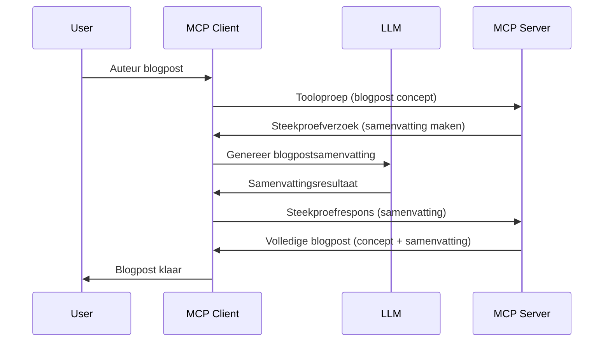

> [!WARNING]
> Sampling is verouderd in MCP `2026-07-28`. Deze les wordt behouden voor
> legacy-implementaties. Nieuwe servers moeten direct integreren met een LLM
> provider API.

# Sampling - delegeer functies aan de Client

> Sampling blijft in de `2026-07-28` specificatie voor compatibiliteit en komt
> in aanmerking voor verwijdering in de eerste revisie die wordt uitgebracht op of na 28 juli,
> 2027. Voorbeelden in deze les kunnen SDK-API's gebruiken die `2025-11-25`
> implementeren. Zie [Wat is veranderd in MCP: De 2026-07-28-specificatie](../../01-CoreConcepts/mcp-2026-07-28.md).

In legacy-implementaties stelt Sampling een MCP-server in staat om hulp aan te vragen bij een LLM
die door de client wordt beheerd. Voor nieuwe implementaties bel je in plaats daarvan direct
de gekozen LLM-provider aan.

Laten we enkele gebruiksscenario's bekijken en hoe je een oplossing bouwt met sampling.

## Overzicht

In deze les richten we ons op het uitleggen wanneer en waar Sampling te gebruiken is en hoe het te configureren.

## Leerdoelen

In dit hoofdstuk zullen we:

- Uitleggen wat Sampling is en wanneer het te gebruiken.
- Tonen hoe Sampling in MCP te configureren.
- Voorbeelden geven van Sampling in actie.

## Wat is Sampling en waarom gebruiken?

Sampling is een geavanceerde functie die op de volgende manier werkt:



### Sampling aanvraag

Oké, nu we een overzicht hebben van een geloofwaardig scenario, laten we het hebben over de sampling aanvraag die de server terugstuurt naar de client. Dit is hoe zo'n aanvraag eruit kan zien in JSON-RPC formaat:

```json
{
  "jsonrpc": "2.0",
  "id": 1,
  "method": "sampling/createMessage",
  "params": {
    "messages": [
      {
        "role": "user",
        "content": {
          "type": "text",
          "text": "Create a blog post summary of the following blog post: <BLOG POST>"
        }
      }
    ],
    "modelPreferences": {
      "hints": [
        {
          "name": "claude-3-sonnet"
        }
      ],
      "intelligencePriority": 0.8,
      "speedPriority": 0.5
    },
    "systemPrompt": "You are a helpful assistant.",
    "maxTokens": 100
  }
}
```

Er zijn een paar zaken die het waard zijn om uit te lichten:

- Prompt, onder content -> text, is onze prompt die een instructie is voor de LLM om blogpost-inhoud samen te vatten.

- **modelPreferences**. Dit gedeelte is precies dat, een voorkeur, een aanbeveling welke configuratie te gebruiken met de LLM. De gebruiker kan zelf kiezen of hij deze aanbevelingen volgt of verandert. In dit geval gaat het om aanbevelingen voor welk model te gebruiken en prioriteit voor snelheid en intelligentie.
- **systemPrompt**, dit is je normale systeem-prompt die je LLM een persoonlijkheid geeft en richtlijnen bevat.
- **maxTokens**, dit is een andere eigenschap die gebruikt wordt om aan te geven hoeveel tokens aanbevolen zijn voor deze taak.

### Sampling reactie

Deze reactie is wat de MCP Client uiteindelijk terugstuurt naar de MCP Server en is het resultaat van de client die de LLM aanroept, wacht op die reactie en dan dit bericht opstelt. Dit is hoe het eruit kan zien in JSON-RPC:

```json
{
  "jsonrpc": "2.0",
  "id": 1,
  "result": {
    "role": "assistant",
    "content": {
      "type": "text",
      "text": "Here's your abstract <ABSTRACT>"
    },
    "model": "gpt-5",
    "stopReason": "endTurn"
  }
}
```

Let op hoe de reactie een samenvatting is van de blogpost, precies zoals gevraagd. Let ook op dat het gebruikte `model` niet is wat we vroegen, maar "gpt-5" in plaats van "claude-3-sonnet". Dit illustreert dat de gebruiker van gedachte kan veranderen over wat te gebruiken en dat je sampling aanvraag een aanbeveling is.

Oké, nu we de hoofdflow begrijpen en een nuttige taak om het voor te gebruiken "blogpostcreatie + samenvatting", laten we zien wat we moeten doen om het te laten werken.

### Berichttypen

Sampling berichten zijn niet beperkt tot enkel tekst maar je kunt ook afbeeldingen en audio verzenden. Zo ziet de JSON-RPC er anders uit:

**Tekst**

```json
{
  "type": "text",
  "text": "The message content"
}
```

**Afbeeldingsinhoud**

```json
{
  "type": "image",
  "data": "base64-encoded-image-data",
  "mimeType": "image/jpeg"
}
```

**Audio-inhoud**

```json
{
  "type": "audio",
  "data": "base64-encoded-audio-data",
  "mimeType": "audio/wav"
}
```

> NOTE: Voor de huidige status en migratierichtlijnen, zie de
> [verouderde Sampling documentatie](https://modelcontextprotocol.io/specification/2026-07-28/client/sampling).

## Hoe Sampling te Configureren in de Client

> Opmerking: als je alleen een server bouwt, hoef je hier weinig te doen.

In een client moet je de volgende functie als volgt specificeren:

```json
{
  "capabilities": {
    "sampling": {}
  }
}
```

Dit wordt vervolgens opgepikt wanneer jouw gekozen client initialiseert met de server.

## Voorbeeld van Sampling in Actie - Maak een Blogpost

Laten we samen een sampling server coderen, we moeten het volgende doen:

1. Maak een tool op de server.
1. Die tool moet een sampling aanvraag aanmaken.
1. De tool moet wachten tot er een antwoord komt op de sampling aanvraag van de client.
1. Daarna moet het resultaat van de tool worden geproduceerd.

Laten we de code stap voor stap bekijken:

### -1- Maak de tool

**python**

```python
@mcp.tool()
async def create_blog(title: str, content: str, ctx: Context[ServerSession, None]) -> str:
    """Create a blog post and generate a summary"""

```

### -2- Maak een sampling aanvraag

Breid je tool uit met de volgende code:

**python**

```python
post = BlogPost(
        id=len(posts) + 1,
        title=title,
        content=content,
        abstract=""
    )

prompt = f"Create an abstract of the following blog post: title: {title} and draft: {content} "

result = await ctx.session.create_message(
        messages=[
            SamplingMessage(
                role="user",
                content=TextContent(type="text", text=prompt),
            )
        ],
        max_tokens=100,
)

```

### -3- Wacht op het antwoord en retourneer het antwoord

**python**

```python
post.abstract = result.content.text

posts.append(post)

# retourneer het volledige product
return json.dumps({
    "id": post.title,
    "abstract": post.abstract
})
```

### -4- Volledige code

**python**

```python
from starlette.applications import Starlette
from starlette.routing import Mount, Host

from mcp.server.fastmcp import Context, FastMCP

from mcp.server.session import ServerSession
from mcp.types import SamplingMessage, TextContent

import json


from uuid import uuid4
from typing import List
from pydantic import BaseModel


mcp = FastMCP("Blog post generator")

# app = FastAPI()

posts = []

class BlogPost(BaseModel):
    id: int
    title: str
    content: str
    abstract: str

posts: List[BlogPost] = []

@mcp.tool()
async def create_blog(title: str, content: str, ctx: Context[ServerSession, None]) -> str:
    """Create a blog post and generate a summary"""

    post = BlogPost(
        id=len(posts) + 1,
        title=title,
        content=content,
        abstract=""
    )

    prompt = f"Create an abstract of the following blog post: title: {title} and draft: {content} "

    result = await ctx.session.create_message(
        messages=[
            SamplingMessage(
                role="user",
                content=TextContent(type="text", text=prompt),
            )
        ],
        max_tokens=100,
    )

    post.abstract = result.content.text

    posts.append(post)

    # retourneer de volledige blogpost
    return json.dumps({
        "id": post.title,
        "abstract": post.abstract
    })

if __name__ == "__main__":
    print("Starting server...")
    # mcp.run()
    mcp.run(transport="streamable-http")

# start de app met: python server.py
```

### -5- Testen in Visual Studio Code

Om dit te testen in Visual Studio Code, doe het volgende:

1. Start de server in een terminal
1. Voeg deze toe aan *mcp.json* (en zorg dat hij gestart is), bijvoorbeeld zo:

   ```json
   "servers": {
      "blog-server": {
        "type": "http",
        "url": "http://localhost:8000/mcp"
      }
   }
   ```

1. Typ een prompt:

   ```text
   create a blog post named "Where Python comes from", the content is "Python is actually named after Monty Python Flying Circus"
   ```

1. Sta Sampling toe om plaats te vinden. De eerste keer dat je dit test verschijnt een extra dialoog die je moet accepteren, daarna zie je de normale dialoog waarin je gevraagd wordt een tool te runnen.

1. Inspecteer de resultaten. Je ziet de resultaten netjes weergegeven in GitHub Copilot Chat, maar je kunt ook de ruwe JSON-reactie inspecteren.

**Bonus**. Visual Studio Code tooling heeft uitstekende ondersteuning voor Sampling. Je kunt Sampling toegang configureren op je geïnstalleerde server door er als volgt naartoe te navigeren:

1. Navigeer naar het extensiegedeelte.
1. Selecteer het tandwielicoon voor jouw geïnstalleerde server in de sectie "MCP SERVERS - INSTALLED".
1 Selecteer "Configure Model Access", hier kun je selecteren welke Modellen GitHub Copilot mag gebruiken bij het uitvoeren van Sampling. Je kunt ook alle recente sampling aanvragen zien door "Show Sampling requests" te selecteren.

## Opdracht

In deze opdracht bouw je een iets andere Sampling, namelijk een sampling integratie die het genereren van een productbeschrijving ondersteunt. Dit is je scenario:

**Scenario**: De backoffice medewerker van een e-commerce heeft hulp nodig, het kost te veel tijd om productbeschrijvingen te genereren. Daarom ga je een oplossing bouwen waar je een tool "create_product" kunt aanroepen met "title" en "keywords" als argumenten en die een compleet product produceert inclusief een "description" veld dat wordt ingevuld door de LLM van een client.

TIP: gebruik wat je eerder hebt geleerd om deze server en zijn tool te bouwen met een sampling aanvraag.

## Oplossing

[Oplossing](./solution/README.md)

## Belangrijke inzichten

Sampling is een krachtige functie die de server toestaat taken te delegeren aan de client wanneer hulp van een LLM nodig is.

## Wat Nu

- [Hoofdstuk 4 - Praktische implementatie](../../04-PracticalImplementation/README.md)

---

<!-- CO-OP TRANSLATOR DISCLAIMER START -->
**Disclaimer**:
Dit document is vertaald met behulp van de AI vertaaldienst [Co-op Translator](https://github.com/Azure/co-op-translator). Hoewel we streven naar nauwkeurigheid, dient u er rekening mee te houden dat geautomatiseerde vertalingen fouten of onnauwkeurigheden kunnen bevatten. Het originele document in de oorspronkelijke taal moet worden beschouwd als de gezaghebbende bron. Voor kritieke informatie wordt professionele menselijke vertaling aanbevolen. Wij zijn niet aansprakelijk voor eventuele misverstanden of verkeerde interpretaties die voortvloeien uit het gebruik van deze vertaling.
<!-- CO-OP TRANSLATOR DISCLAIMER END -->