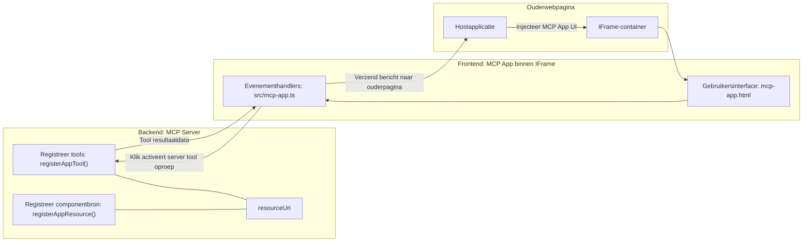
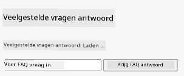
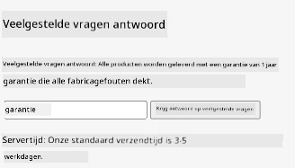
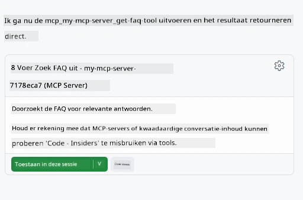

# MCP Apps

MCP Apps is een nieuw paradigma in MCP. Het idee is dat je niet alleen gegevens teruggeeft vanuit een tool-aanroep, maar ook informatie verstrekt over hoe met deze informatie moet worden omgegaan. Dit betekent dat toolresultaten nu UI-informatie kunnen bevatten. Waarom zouden we dat willen? Nou, denk eens aan hoe je dingen tegenwoordig doet. Waarschijnlijk consumeer je de resultaten van een MCP Server door er een soort frontend voor te zetten, dat is code die je moet schrijven en onderhouden. Soms is dat wat je wilt, maar soms zou het geweldig zijn als je gewoon een stukje informatie kunt binnenhalen dat zelfstandig is, met alles erin van data tot gebruikersinterface.

## Overzicht

Deze les biedt praktische aanwijzingen over MCP Apps, hoe je ermee aan de slag kunt gaan en hoe je het kunt integreren in je bestaande Web Apps. MCP Apps is een zeer nieuwe toevoeging aan de MCP Standard.

## Leerdoelen

Aan het einde van deze les kun je:

- Uitleggen wat MCP Apps zijn.
- Wanneer je MCP Apps moet gebruiken.
- Je eigen MCP Apps bouwen en integreren.

## MCP Apps - hoe werkt het

Het idee met MCP Apps is om een respons te bieden die in wezen een component is om te renderen. Zo'n component kan zowel visuals als interactiviteit hebben, bijvoorbeeld knopklikken, gebruikersinvoer en meer. Laten we beginnen met de serverzijde en onze MCP Server. Om een MCP App-component te maken, moet je een tool creëren, maar ook de application resource. Deze twee helften zijn verbonden door een resourceUri. 

Hier is een voorbeeld. Laten we proberen te visualiseren wat erbij betrokken is en welke delen wat doen:

```text
server.ts -- responsible for registering tools and the component as a UI component
src/
  mcp-app.ts -- wiring up event handlers
mcp-app.html -- the user interface
```

Deze visual beschrijft de architectuur voor het maken van een component en de logica ervan.


Laten we proberen de verantwoordelijkheden voor backend en frontend respectievelijk te beschrijven.

### De backend

We moeten hier twee dingen doen:

- De tools registreren waarmee we willen interacteren.
- De component definiëren. 

**De tool registreren**

```typescript
registerAppTool(
    server,
    "get-time",
    {
      title: "Get Time",
      description: "Returns the current server time.",
      inputSchema: {},
      _meta: { ui: { resourceUri } }, // Koppelt dit hulpmiddel aan zijn UI-bron
    },
    async () => {
      const time = new Date().toISOString();
      return { content: [{ type: "text", text: time }] };
    },
  );

```

De bovenstaande code beschrijft het gedrag, waarbij het een tool genaamd `get-time` blootstelt. Deze neemt geen invoer, maar levert uiteindelijk de huidige tijd. We hebben de mogelijkheid om een `inputSchema` te definiëren voor tools waar we gebruikersinvoer voor moeten kunnen accepteren.

**De component registreren**

In hetzelfde bestand moeten we ook de component registreren:

```typescript
const resourceUri = "ui://get-time/mcp-app.html";

// Registreer de resource, die de gebundelde HTML/JavaScript voor de UI retourneert.
registerAppResource(
  server,
  resourceUri,
  resourceUri,
  { mimeType: RESOURCE_MIME_TYPE },
  async () => {
    const html = await fs.readFile(path.join(DIST_DIR, "mcp-app.html"), "utf-8");

    return {
    contents: [
        { uri: resourceUri, mimeType: RESOURCE_MIME_TYPE, text: html },
    ],
    };
  },
);
```

Merk op hoe we `resourceUri` vermelden om de component met zijn tools te verbinden. Ook interessant is de callback waarin we het UI-bestand laden en de component teruggeven.

### De frontend van de component

Net als bij de backend zijn hier twee onderdelen:

- Een frontend geschreven in pure HTML.
- Code die evenementen afhandelt en wat te doen, bijvoorbeeld tools aanroepen of berichten naar het hoofdvenster sturen.

**Gebruikersinterface**

Laten we eens kijken naar de gebruikersinterface.

```html
<!-- mcp-app.html -->
<!DOCTYPE html>
<html lang="en">
  <head>
    <meta charset="UTF-8" />
    <title>Get Time App</title>
  </head>
  <body>
    <p>
      <strong>Server Time:</strong> <code id="server-time">Loading...</code>
    </p>
    <button id="get-time-btn">Get Server Time</button>
    <script type="module" src="/src/mcp-app.ts"></script>
  </body>
</html>
```

**Evenementkoppeling**

Het laatste onderdeel is de evenementkoppeling. Dat betekent dat we identificeren welk deel van onze UI event handlers nodig heeft en wat te doen als er events worden opgewekt:

```typescript
// mcp-app.ts

import { App } from "@modelcontextprotocol/ext-apps";

// Elementreferenties ophalen
const serverTimeEl = document.getElementById("server-time")!;
const getTimeBtn = document.getElementById("get-time-btn")!;

// App-instantie maken
const app = new App({ name: "Get Time App", version: "1.0.0" });

// Verwerk toolresultaten van de server. Zet dit vóór `app.connect()` om te voorkomen
// dat het initiële toolresultaat mist.
app.ontoolresult = (result) => {
  const time = result.content?.find((c) => c.type === "text")?.text;
  serverTimeEl.textContent = time ?? "[ERROR]";
};

// Koppeling knopklik
getTimeBtn.addEventListener("click", async () => {
  // `app.callServerTool()` laat de UI verse data van de server opvragen
  const result = await app.callServerTool({ name: "get-time", arguments: {} });
  const time = result.content?.find((c) => c.type === "text")?.text;
  serverTimeEl.textContent = time ?? "[ERROR]";
});

// Verbinden met host
app.connect();
```

Zoals je hierboven kunt zien, is dit normale code om DOM-elementen aan events te koppelen. Noemenswaardig is de aanroep van `callServerTool` die uiteindelijk een tool op de backend aanroept.

## Omgaan met gebruikersinvoer

Tot nu toe hebben we een component gezien die een knop heeft die bij klikken een tool aanroept. Laten we kijken of we meer UI-elementen kunnen toevoegen, zoals een invoerveld, en of we argumenten naar een tool kunnen sturen. Laten we een FAQ-functionaliteit implementeren. Zo zou het moeten werken:

- Er moet een knop en een invoerelement zijn waar de gebruiker een trefwoord typt om bijvoorbeeld naar "Shipping" te zoeken. Dit moet een tool op de backend aanroepen die zoekt in de FAQ-gegevens.
- Een tool die de genoemde FAQ-zoekfunctie ondersteunt.

Laten we eerst de benodigde ondersteuning aan de backend toevoegen:

```typescript
const faq: { [key: string]: string } = {
    "shipping": "Our standard shipping time is 3-5 business days.",
    "return policy": "You can return any item within 30 days of purchase.",
    "warranty": "All products come with a 1-year warranty covering manufacturing defects.",
  }

registerAppTool(
    server,
    "get-faq",
    {
      title: "Search FAQ",
      description: "Searches the FAQ for relevant answers.",
      inputSchema: zod.object({
        query: zod.string().default("shipping"),
      }),
      _meta: { ui: { resourceUri: faqResourceUri } }, // Koppelt dit hulpmiddel aan zijn UI-bron
    },
    async ({ query }) => {
      const answer: string = faq[query.toLowerCase()] || "Sorry, I don't have an answer for that.";
      return { content: [{ type: "text", text: answer }] };
    },
  );
```

Wat we hier zien is hoe we `inputSchema` vullen en het een `zod`-schema geven zoals:

```typescript
inputSchema: zod.object({
  query: zod.string().default("shipping"),
})
```

In bovenstaand schema geven we aan dat we een invoerparameter hebben genaamd `query` en dat deze optioneel is met een standaardwaarde van "shipping".

Oké, laten we verder gaan naar *mcp-app.html* om te zien welke UI we hiervoor moeten maken:

```html
<div class="faq">
    <h1>FAQ response</h1>
    <p>FAQ Response: <code id="faq-response">Loading...</code></p>
    <input type="text" id="faq-query" placeholder="Enter FAQ query" />
    <button id="get-faq-btn">Get FAQ Response</button>
  </div>
```

Geweldig, nu hebben we een invoerelement en knop. Laten we naar *mcp-app.ts* gaan om deze events te koppelen:

```typescript
const getFaqBtn = document.getElementById("get-faq-btn")!;
const faqQueryInput = document.getElementById("faq-query") as HTMLInputElement;

getFaqBtn.addEventListener("click", async () => {
  const query = faqQueryInput.value;
  const result = await app.callServerTool({ name: "get-faq", arguments: { query } });
  const faq = result.content?.find((c) => c.type === "text")?.text;
  faqResponseEl.textContent = faq ?? "[ERROR]";
});
```

In bovenstaande code:

- Maken we verwijzingen naar de interessante UI-elementen.
- Handelen we een knopklik af door de waarde van het invoerelement te parsen en roepen we ook `app.callServerTool()` aan met `name` en `arguments`, waarbij het laatste `query` als waarde doorgeeft.

Wat er eigenlijk gebeurt wanneer je `callServerTool` aanroept, is dat er een bericht naar het hoofdvenster wordt gestuurd en dat venster uiteindelijk de MCP Server aanroept.

### Probeer het uit

Door dit uit te proberen zouden we nu het volgende moeten zien:



en hier proberen we het met invoer zoals "warranty"



Om deze code te draaien, ga naar de [Code sectie](./code/README.md)

## Testen in Visual Studio Code

Visual Studio Code heeft geweldige ondersteuning voor MVP Apps en is waarschijnlijk een van de makkelijkste manieren om je MCP Apps te testen. Om Visual Studio Code te gebruiken, voeg je een serververmelding toe aan *mcp.json* zoals:

```json
"my-mcp-server-7178eca7": {
    "url": "http://localhost:3001/mcp",
    "type": "http"
  }
```

Start vervolgens de server, je zou in staat moeten zijn om te communiceren met je MVP App via het Chat Venster, mits je GitHub Copilot hebt geïnstalleerd.

door te triggeren via prompt, bijvoorbeeld "#get-faq":



en net als toen je het via een webbrowser draaide, wordt het op dezelfde manier gerenderd:


## Opdracht

Maak een steen-papier-schaar spel. Het moet het volgende bevatten:

UI:

- een dropdownlijst met opties
- een knop om een keuze in te dienen
- een label dat toont wie wat koos en wie won

Server:

- moet een tool voor steen-papier-schaar hebben die "choice" als invoer neemt. Het moet ook een computerkeuze renderen en de winnaar bepalen

## Oplossing

[Oplossing](./assignment/README.md)

## Samenvatting

We hebben geleerd over dit nieuwe paradigma MCP Apps. Het is een nieuw paradigma dat MCP Servers in staat stelt een mening te hebben over niet alleen de data, maar ook hoe deze data gepresenteerd moet worden.

Daarnaast hebben we geleerd dat deze MCP Apps worden gehost in een IFrame en om te communiceren met MCP Servers berichten naar de ouderwebapp moeten sturen. Er zijn verschillende libraries beschikbaar, zowel voor plain JavaScript als React en meer, die deze communicatie vergemakkelijken.

## Belangrijke punten

Dit heb je geleerd:

- MCP Apps is een nieuwe standaard die nuttig kan zijn wanneer je zowel data als UI-functies wil leveren.
- Dit soort apps draaien om veiligheidsredenen in een IFrame.

## Wat nu?

- [Hoofdstuk 4](../../04-PracticalImplementation/README.md)

---

<!-- CO-OP TRANSLATOR DISCLAIMER START -->
**Disclaimer**:
Dit document is vertaald met behulp van de AI-vertalingsdienst [Co-op Translator](https://github.com/Azure/co-op-translator). Hoewel we streven naar nauwkeurigheid, dient u er rekening mee te houden dat automatische vertalingen fouten of onnauwkeurigheden kunnen bevatten. Het oorspronkelijke document in de originele taal moet als gezaghebbende bron worden beschouwd. Voor belangrijke informatie wordt professionele menselijke vertaling aanbevolen. Wij zijn niet aansprakelijk voor enige misverstanden of verkeerde interpretaties die voortvloeien uit het gebruik van deze vertaling.
<!-- CO-OP TRANSLATOR DISCLAIMER END -->