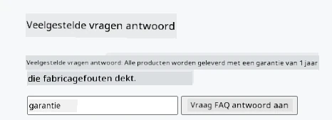
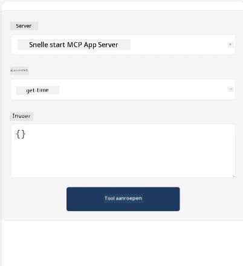
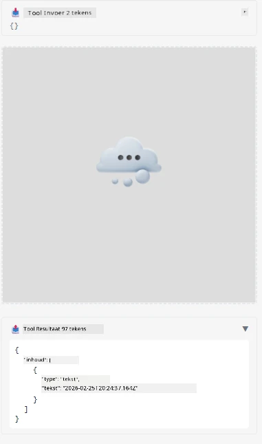

Hier is een voorbeeld waarin MCP App wordt gedemonstreerd

## Installeren

1. Navigeer naar de map *mcp-app*
1. Voer `npm install` uit, hiermee worden de frontend- en backend-afhankelijkheden geïnstalleerd

Controleer of de backend compileert door uit te voeren:

```sh
npx tsc --noEmit
```

Er mag geen output zijn als alles in orde is.

## Backend uitvoeren

> Dit vergt wat extra werk als je op een Windows-machine werkt, omdat de MCP Apps-oplossing de `concurrently` bibliotheek gebruikt om te draaien, waarvoor je een vervanger moet vinden. Hier is de probleemregel in *package.json* van de MCP App:

    ```json
    "start": "concurrently \"cross-env NODE_ENV=development INPUT=mcp-app.html vite build --watch\" \"tsx watch main.ts\""
    ```

Deze app bestaat uit twee delen, een backenddeel en een hostdeel.

Start de backend door het volgende uit te voeren:

```sh
npm start
```

Dit zou de backend moeten starten op `http://localhost:3001/mcp`. 

> Let op, als je in een Codespace werkt, moet je mogelijk de poortzichtbaarheid op openbaar zetten. Controleer of je de endpoint kunt bereiken in de browser via https://<naam van Codespace>.app.github.dev/mcp

## Keuze -1 Test de app in Visual Studio Code

Om de oplossing te testen in Visual Studio Code, doe het volgende:

- Voeg een serververmelding toe aan `mcp.json` zoals:

    ```json
    {
        "servers": {
            "my-mcp-server-7178eca7": {
                "url": "http://localhost:3001/mcp",
                "type": "http"
            }
        },
        "inputs": []
    }
    ```

1. Klik op de "start" knop in *mcp.json*
1. Zorg dat er een chatvenster open is en typ `get-faq`, je zou een resultaat moeten zien zoals:

    

## Keuze -2- Test de app met een host

De repo <https://github.com/modelcontextprotocol/ext-apps> bevat verschillende hosts die je kunt gebruiken om je MVP Apps te testen.

We presenteren hier twee verschillende opties:

### Lokale machine

- Navigeer naar *ext-apps* nadat je de repo hebt gekloond.

- Installeer de afhankelijkheden

   ```sh
   npm install
   ```

- Open in een apart terminalvenster *ext-apps/examples/basic-host*

    > als je een Codespace gebruikt, moet je naar serve.ts gaan en regel 27 vervangen door jouw Codespace URL voor de backend in plaats van http://localhost:3001/mcp, bijvoorbeeld https://psychic-xylophone-657rpjgvxpc5g64-3001.app.github.dev/mcp

- Start de host:

    ```sh
    npm start
    ```

    Dit zou de host met de backend moeten verbinden en je zou de app zo moeten zien draaien:

    

### Codespace

Het vergt wat extra werk om een Codespace-omgeving werkend te krijgen. Om een host via Codespace te gebruiken:

- Ga naar de *ext-apps* map en vervolgens naar *examples/basic-host*.
- Voer `npm install` uit om afhankelijkheden te installeren
- Voer `npm start` uit om de host te starten.

## Test de app

Probeer de app als volgt:

- Selecteer de knop "Call Tool" en je zou het resultaat zo moeten zien:

    

Geweldig, alles werkt.

---

<!-- CO-OP TRANSLATOR DISCLAIMER START -->
**Disclaimer**:  
Dit document is vertaald met gebruik van de AI-vertalingsdienst [Co-op Translator](https://github.com/Azure/co-op-translator). Hoewel we streven naar nauwkeurigheid, dient u er rekening mee te houden dat geautomatiseerde vertalingen fouten of onnauwkeurigheden kunnen bevatten. Het oorspronkelijke document in de oorspronkelijke taal wordt beschouwd als de gezaghebbende bron. Voor cruciale informatie wordt een professionele menselijke vertaling aanbevolen. Wij zijn niet aansprakelijk voor misverstanden of verkeerde interpretaties die voortkomen uit het gebruik van deze vertaling.
<!-- CO-OP TRANSLATOR DISCLAIMER END -->