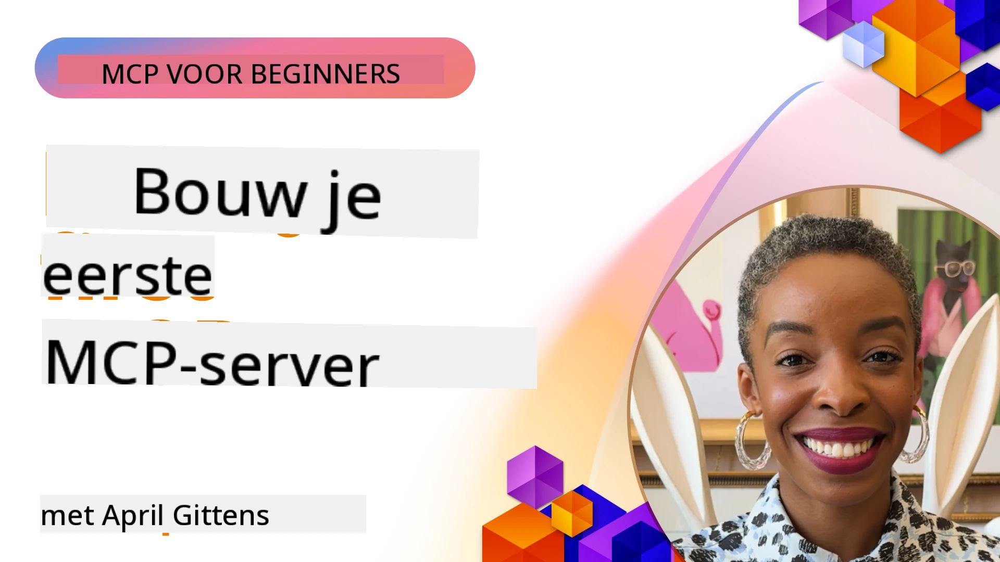

## Aan de slag  

_(Klik op de afbeelding hierboven om de video van deze les te bekijken)_

Deze sectie bestaat uit verschillende lessen:

- **1 Je eerste server**, in deze eerste les leer je hoe je je eerste server maakt en deze inspeert met de inspector-tool, een waardevolle manier om je server te testen en te debuggen, [naar de les](01-first-server/README.md)

- **2 Client**, in deze les leer je hoe je een client schrijft die verbinding kan maken met je server, [naar de les](02-client/README.md)

- **3 Client met LLM**, een nog betere manier om een client te schrijven is door er een LLM aan toe te voegen zodat het met je server kan "onderhandelen" over wat te doen, [naar de les](03-llm-client/README.md)

- **4 Gebruik van de server GitHub Copilot Agent-modus in Visual Studio Code**. Hier bekijken we het draaien van onze MCP Server binnen Visual Studio Code, [naar de les](04-vscode/README.md)

- **5 stdio Transport Server** stdio transport is de aanbevolen standaard voor lokale MCP-server-naar-client communicatie, met veilige subprocess-gebaseerde communicatie en ingebouwde procesisolatie [naar de les](05-stdio-server/README.md)

- **6 HTTP Streaming met MCP (Streambare HTTP)**. Leer over de standaard
	remote transport in [MCP Specificatie 2026-07-28](https://modelcontextprotocol.io/specification/2026-07-28/basic/transports/streamable-http),
	plús de legacy sessiegebaseerde implementatie behouden in de les.
	[naar de les](06-http-streaming/README.md)

- **7 Gebruik van AI Toolkit voor VSCode** om je MCP Clients en Servers te gebruiken en testen [naar de les](07-aitk/README.md)

- **8 Testen**. Hier ligt de focus op hoe we onze server en client op verschillende manieren kunnen testen, [naar de les](08-testing/README.md)

- **9 Implementatie**. Dit hoofdstuk behandelt verschillende manieren om je MCP-oplossingen te implementeren, [naar de les](09-deployment/README.md)

- **10 Geavanceerd servergebruik**. Dit hoofdstuk behandelt geavanceerd servergebruik, [naar de les](./10-advanced/README.md)

- **11 Authenticatie**. Dit hoofdstuk behandelt het toevoegen van eenvoudige authenticatie, van Basic Auth tot het gebruik van JWT en RBAC. We raden je aan hier te beginnen en dan te kijken naar gevorderde onderwerpen in Hoofdstuk 5 en aanvullende beveiligingsversterking via aanbevelingen in Hoofdstuk 2, [naar de les](./11-simple-auth/README.md)

- **12 MCP Hosts**. Configureer en gebruik populaire MCP host clients zoals Claude Desktop, Cursor, Cline en Windsurf. Leer transporttypes en probleemoplossing, [naar de les](./12-mcp-hosts/README.md)

- **13 MCP Inspector**. Debug en test je MCP servers interactief met de MCP Inspector tool. Leer tools, bronnen en protocolberichten troubleshooten, [naar de les](./13-mcp-inspector/README.md)

- **14 Sampling**. Leer de legacy Sampling-primitief voor `2025-11-25` en
	hoe je nieuwe ontwerpen migreert naar directe LLM-provider integratie. Sampling is
	afgeschreven in MCP `2026-07-28`. [naar de les](./14-sampling/README.md)

- **15 MCP Apps**. Bouw MCP Servers die ook reageren met UI-instructies, [naar de les](./15-mcp-apps/README.md)

Het Model Context Protocol (MCP) is een open protocol dat standaardiseert hoe applicaties context aan LLMs bieden. Zie MCP als een USB-C poort voor AI applicaties - het biedt een gestandaardiseerde manier om AI modellen aan verschillende databronnen en tools te koppelen.

## Leerdoelen

Aan het einde van deze les kun je:

- Ontwikkelomgevingen opzetten voor MCP in C#, Java, Python, TypeScript en JavaScript
- Basis MCP servers bouwen en implementeren met aangepaste functies (resources, prompts en tools)
- Hostapplicaties maken die verbinding maken met MCP servers
- MCP implementaties testen en debuggen
- Veelvoorkomende setup problemen en hun oplossingen begrijpen
- Je MCP implementaties koppelen aan populaire LLM diensten

## Je MCP omgeving opzetten

Voordat je begint met werken met MCP is het belangrijk je ontwikkelomgeving voor te bereiden en de basisworkflow te begrijpen. Deze sectie begeleidt je bij de eerste setup stappen voor een soepele start met MCP.

### Vereisten

Zorg voordat je met MCP ontwikkeling begint dat je:

- **Ontwikkelomgeving**: Voor je gekozen taal (C#, Java, Python, TypeScript of JavaScript)
- **IDE/Editor**: Visual Studio, Visual Studio Code, IntelliJ, Eclipse, PyCharm of een moderne code-editor
- **Package Managers**: NuGet, Maven/Gradle, pip of npm/yarn
- **API Sleutels**: Voor alle AI diensten die je in je hostapplicaties wil gebruiken

### Officiële SDKs

In de komende hoofdstukken zie je oplossingen gebouwd met Python, TypeScript,
Java en .NET. Hier zijn de officiële SDKs.

SDK ondersteuning voor MCP `2026-07-28` komt onafhankelijk beschikbaar per taal.
Controleer, voordat je een voorbeeld draait, de versies van het pakket en de release notes van de SDK
voor ondersteunde protocolrevisies. Zie de
[officiële SDK lijst](https://modelcontextprotocol.io/docs/sdk):
- [C# SDK](https://github.com/modelcontextprotocol/csharp-sdk) - Onderhouden in samenwerking met Microsoft
- [Java SDK](https://github.com/modelcontextprotocol/java-sdk) - Onderhouden in samenwerking met Spring AI
- [TypeScript SDK](https://github.com/modelcontextprotocol/typescript-sdk) - De officiële TypeScript implementatie
- [Python SDK](https://github.com/modelcontextprotocol/python-sdk) - De officiële Python implementatie (FastMCP)
- [Kotlin SDK](https://github.com/modelcontextprotocol/kotlin-sdk) - De officiële Kotlin implementatie
- [Swift SDK](https://github.com/modelcontextprotocol/swift-sdk) - Onderhouden in samenwerking met Loopwork AI
- [Rust SDK](https://github.com/modelcontextprotocol/rust-sdk) - De officiële Rust implementatie
- [Go SDK](https://github.com/modelcontextprotocol/go-sdk) - De officiële Go implementatie

## Belangrijke punten

- Het opzetten van een MCP ontwikkelomgeving is eenvoudig met taal-specifieke SDKs
- MCP servers bouwen betekent tools maken en registreren met duidelijke schema's
- MCP clients verbinden met servers en modellen om uitgebreide mogelijkheden te benutten
- Testen en debuggen zijn essentieel voor betrouwbare MCP implementaties
- Implementatieopties variëren van lokale ontwikkeling tot cloud-gebaseerde oplossingen

## Oefenen

We hebben een set voorbeelden die de oefeningen aanvullen die je in alle hoofdstukken van deze sectie ziet. Daarnaast heeft elk hoofdstuk ook eigen oefeningen en opdrachten

- [Java Calculator](./samples/java/calculator/README.md)
- [.NET Calculator](../../../03-GettingStarted/samples/csharp)
- [JavaScript Calculator](./samples/javascript/README.md)
- [TypeScript Calculator](./samples/typescript/README.md)
- [Python Calculator](../../../03-GettingStarted/samples/python)

## Extra bronnen

- [Bouw Agents met Model Context Protocol op Azure](https://learn.microsoft.com/azure/developer/ai/intro-agents-mcp)
- [Remote MCP met Azure Container Apps (Node.js/TypeScript/JavaScript)](https://learn.microsoft.com/samples/azure-samples/mcp-container-ts/mcp-container-ts/)
- [.NET OpenAI MCP Agent](https://learn.microsoft.com/samples/azure-samples/openai-mcp-agent-dotnet/openai-mcp-agent-dotnet/)

## Wat volgende is

Begin met de eerste les: [Je eerste MCP Server maken](01-first-server/README.md)

Zodra je deze module hebt afgerond, ga verder naar: [Module 4: Praktische Implementatie](../04-PracticalImplementation/README.md)

---

<!-- CO-OP TRANSLATOR DISCLAIMER START -->
**Disclaimer**:
Dit document is vertaald met behulp van de AI vertaaldienst [Co-op Translator](https://github.com/Azure/co-op-translator). Hoewel we streven naar nauwkeurigheid, dient u er rekening mee te houden dat geautomatiseerde vertalingen fouten of onnauwkeurigheden kunnen bevatten. Het originele document in de oorspronkelijke taal moet worden beschouwd als de gezaghebbende bron. Voor kritieke informatie wordt professionele menselijke vertaling aanbevolen. Wij zijn niet aansprakelijk voor eventuele misverstanden of verkeerde interpretaties die voortvloeien uit het gebruik van deze vertaling.
<!-- CO-OP TRANSLATOR DISCLAIMER END -->