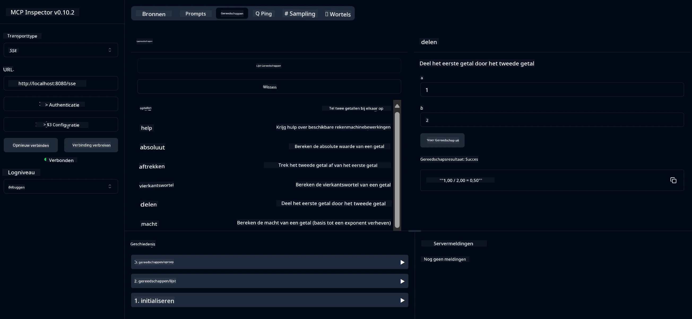

# Basisrekenmachine MCP-service

> [!NOTE]
> Dit voorbeeld gebruikt de legacy HTTP+SSE-transport en richt zich op een SDK die compatibel is
> met MCP `2025-11-25`. Nieuwe externe servers zouden de `2026-07-28` Streamable
> HTTP-ondersteuning moeten gebruiken.

Deze service biedt basisrekenmachinebewerkingen via het Model Context Protocol (MCP) met behulp van Spring Boot met WebFlux-transport. Het is ontworpen als een eenvoudig voorbeeld voor beginners die leren over MCP-implementaties.

Voor meer informatie, zie de [MCP Server Boot Starter](https://docs.spring.io/spring-ai/reference/api/mcp/mcp-server-boot-starter-docs.html) referentiedocumentatie.

## Overzicht

De service toont:
- Ondersteuning voor SSE (Server-Sent Events)
- Automatische toolregistratie met de `@Tool` annotatie van Spring AI
- Basisrekenmachinefuncties:
  - Optellen, aftrekken, vermenigvuldigen, delen
  - Machtsberekening en vierkantswortel
  - Modulus (rest) en absolute waarde
  - Helpfunctie voor beschrijvingen van bewerkingen

## Kenmerken

Deze rekenmachineservice biedt de volgende mogelijkheden:

1. **Basisrekenkundige bewerkingen**:
   - Optellen van twee getallen
   - Aftrekken van één getal van een ander
   - Vermenigvuldigen van twee getallen
   - Delen van één getal door een ander (inclusief controle op deling door nul)

2. **Geavanceerde bewerkingen**:
   - Machtsberekening (het verheffen van een grondgetal tot een exponent)
   - Berekening van de vierkantswortel (met controle op negatieve getallen)
   - Modulus (rest) berekening
   - Berekening van de absolute waarde

3. **Helpsysteem**:
   - Ingebouwde helpfunctie die alle beschikbare bewerkingen uitlegt

## Gebruik van de service

De service biedt de volgende API-eindpunten via het MCP-protocol:

- `add(a, b)`: Tel twee getallen bij elkaar op
- `subtract(a, b)`: Trek het tweede getal af van het eerste
- `multiply(a, b)`: Vermenigvuldig twee getallen
- `divide(a, b)`: Deel het eerste getal door het tweede (met controle op nul)
- `power(base, exponent)`: Bereken de macht van een getal
- `squareRoot(number)`: Bereken de vierkantswortel (met controle op negatieve getallen)
- `modulus(a, b)`: Bereken de rest bij deling
- `absolute(number)`: Bereken de absolute waarde
- `help()`: Verkrijg informatie over beschikbare bewerkingen

## Testclient

Er is een eenvoudige testclient opgenomen in het pakket `com.microsoft.mcp.sample.client`. De klasse `SampleCalculatorClient` toont de beschikbare bewerkingen van de rekenmachineservice.

## Gebruik van de LangChain4j-client

Het project bevat een voorbeeldclient LangChain4j in `com.microsoft.mcp.sample.client.LangChain4jClient` die laat zien hoe je de rekenmachineservice integreert met LangChain4j en GitHub-modellen:

### Vereisten

1. **GitHub Token Setup**:
   
   Om de AI-modellen van GitHub (zoals phi-4) te gebruiken, heb je een persoonlijk toegangstoken van GitHub nodig:

   a. Ga naar je GitHub-accountinstellingen: https://github.com/settings/tokens
   
   b. Klik op "Generate new token" → "Generate new token (classic)"
   
   c. Geef je token een beschrijvende naam
   
   d. Selecteer de volgende scopes:
      - `repo` (Volledige controle over privé-repositories)
      - `read:org` (Lees org- en teamlidmaatschappen, lees org-projecten)
      - `gist` (Maak gists)
      - `user:email` (Toegang tot e-mailadressen van gebruikers (alleen-lezen))
   
   e. Klik op "Generate token" en kopieer je nieuwe token
   
   f. Stel deze in als een omgevingsvariabele:
      
      Op Windows:
      ```
      set GITHUB_TOKEN=your-github-token
      ```
      
      Op macOS/Linux:
      ```bash
      export GITHUB_TOKEN=your-github-token
      ```

   g. Voor een blijvende instelling, voeg het toe aan je omgevingsvariabelen via systeeminstellingen

2. Voeg de LangChain4j GitHub-afhankelijkheid toe aan je project (al opgenomen in pom.xml):
   ```xml
   <dependency>
       <groupId>dev.langchain4j</groupId>
       <artifactId>langchain4j-github</artifactId>
       <version>${langchain4j.version}</version>
   </dependency>
   ```

3. Zorg ervoor dat de rekenmachineserver draait op `localhost:8080`

### De LangChain4j-client uitvoeren

Dit voorbeeld demonstreert:
- Verbinden met de calculator MCP-server via SSE-transport
- Gebruik van LangChain4j om een chatbot te maken die rekenmachinebewerkingen gebruikt
- Integratie met GitHub AI-modellen (nu met phi-4 model)

De client stuurt de volgende voorbeeldvragen om functionaliteit te demonstreren:
1. Berekening van de som van twee getallen
2. Het vinden van de vierkantswortel van een getal
3. Informatie over beschikbare rekenmachinebewerkingen opvragen

Voer het voorbeeld uit en controleer de console-uitvoer om te zien hoe het AI-model de rekenmachinetools gebruikt om op vragen te reageren.

### GitHub-modelconfiguratie

De LangChain4j-client is geconfigureerd om het phi-4 model van GitHub te gebruiken met de volgende instellingen:

```java
ChatLanguageModel model = GitHubChatModel.builder()
    .apiKey(System.getenv("GITHUB_TOKEN"))
    .timeout(Duration.ofSeconds(60))
    .modelName("phi-4")
    .logRequests(true)
    .logResponses(true)
    .build();
```

Om verschillende GitHub-modellen te gebruiken, wijzig je eenvoudig de parameter `modelName` naar een ander ondersteund model (bijv. "claude-3-haiku-20240307", "llama-3-70b-8192", etc.).

## Afhankelijkheden

Het project vereist de volgende belangrijke afhankelijkheden:

```xml
<!-- For MCP Server -->
<dependency>
    <groupId>org.springframework.ai</groupId>
    <artifactId>spring-ai-starter-mcp-server-webflux</artifactId>
</dependency>

<!-- For LangChain4j integration -->
<dependency>
    <groupId>dev.langchain4j</groupId>
    <artifactId>langchain4j-mcp</artifactId>
    <version>${langchain4j.version}</version>
</dependency>

<!-- For GitHub models support -->
<dependency>
    <groupId>dev.langchain4j</groupId>
    <artifactId>langchain4j-github</artifactId>
    <version>${langchain4j.version}</version>
</dependency>
```

## Het project bouwen

Bouw het project met Maven:
```bash
./mvnw clean install -DskipTests
```

## De server starten

### Gebruik van Java

```bash
java -jar target/calculator-server-0.0.1-SNAPSHOT.jar
```

### Gebruik van MCP Inspector

De MCP Inspector is een handig hulpmiddel om met MCP-diensten te communiceren. Om het met deze rekenmachineservice te gebruiken:

1. **Installeer en start MCP Inspector** in een nieuw terminalvenster:
   ```bash
   npx @modelcontextprotocol/inspector
   ```

2. **Ga naar de web-UI** door op de URL van de app te klikken (typisch http://localhost:6274)

3. **Configureer de verbinding**:
   - Stel het transporttype in op "SSE"
   - Stel de URL in naar de SSE-eindpunt van je draaiende server: `http://localhost:8080/sse`
   - Klik op "Connect"

4. **Gebruik de tools**:
   - Klik op "List Tools" om beschikbare rekenmachinebewerkingen te zien
   - Selecteer een tool en klik op "Run Tool" om een bewerking uit te voeren



### Gebruik van Docker

Het project bevat een Dockerfile voor containerimplementatie:

1. **Bouw de Docker-image**:
   ```bash
   docker build -t calculator-mcp-service .
   ```

2. **Start de Docker-container**:
   ```bash
   docker run -p 8080:8080 calculator-mcp-service
   ```

Dit zal:
- Een multi-stage Docker-image bouwen met Maven 3.9.9 en Eclipse Temurin 24 JDK
- Een geoptimaliseerde container-image creëren
- De service exposen op poort 8080
- De MCP rekenmachineservice binnen de container starten

Je kunt de service bereiken op `http://localhost:8080` zodra de container draait.

## Problemen oplossen

### Veelvoorkomende problemen met GitHub-token

1. **Token-permissieproblemen**: Als je een 403 Forbidden-fout krijgt, controleer dan of je token de juiste permissies heeft zoals beschreven in de vereisten.

2. **Token niet gevonden**: Als je een "No API key found"-fout krijgt, zorg dan dat de GITHUB_TOKEN-omgevingsvariabele correct is ingesteld.

3. **Rate limiting**: De GitHub API kent limieten. Als je een rate limit-fout (statuscode 429) krijgt, wacht dan een paar minuten voordat je het opnieuw probeert.

4. **Tokenvervaldatum**: GitHub-tokens kunnen verlopen. Als je authenticatiefouten krijgt na enige tijd, genereer dan een nieuw token en werk je omgevingsvariabele bij.

Als je verdere hulp nodig hebt, bekijk dan de [LangChain4j-documentatie](https://github.com/langchain4j/langchain4j) of de [GitHub API-documentatie](https://docs.github.com/en/rest).

---

<!-- CO-OP TRANSLATOR DISCLAIMER START -->
**Disclaimer**:
Dit document is vertaald met behulp van de AI vertaaldienst [Co-op Translator](https://github.com/Azure/co-op-translator). Hoewel we streven naar nauwkeurigheid, dient u er rekening mee te houden dat geautomatiseerde vertalingen fouten of onnauwkeurigheden kunnen bevatten. Het originele document in de oorspronkelijke taal moet worden beschouwd als de gezaghebbende bron. Voor kritieke informatie wordt professionele menselijke vertaling aanbevolen. Wij zijn niet aansprakelijk voor eventuele misverstanden of verkeerde interpretaties die voortvloeien uit het gebruik van deze vertaling.
<!-- CO-OP TRANSLATOR DISCLAIMER END -->