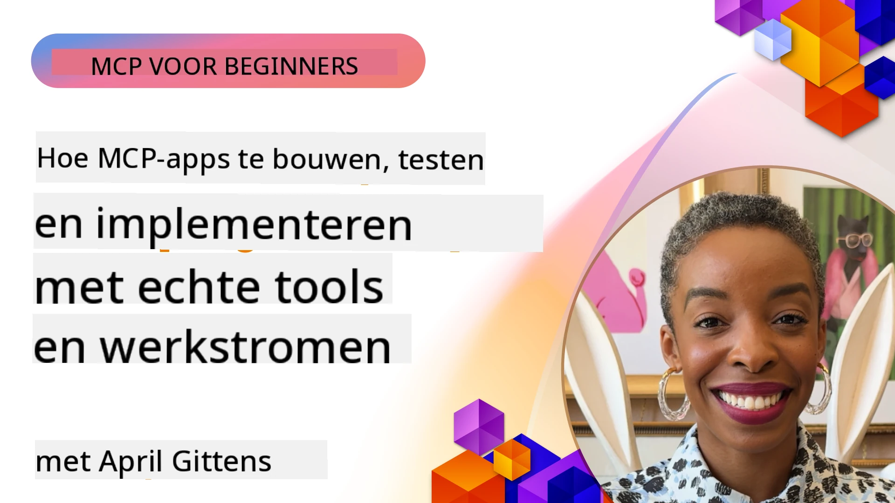

# Praktische Implementatie

[](https://youtu.be/vCN9-mKBDfQ)

_(Klik op de afbeelding hierboven om de video van deze les te bekijken)_

Praktische implementatie is waar de kracht van het Model Context Protocol (MCP) tastbaar wordt. Terwijl het begrijpen van de theorie en architectuur achter MCP belangrijk is, komt de echte waarde naar voren wanneer u deze concepten toepast om oplossingen te bouwen, testen en implementeren die echte problemen oplossen. Dit hoofdstuk overbrugt de kloof tussen conceptuele kennis en praktische ontwikkeling en begeleidt u door het proces van het tot leven brengen van MCP-gebaseerde applicaties.

Of u nu intelligente assistenten ontwikkelt, AI integreert in bedrijfsworkflows, of aangepaste tools bouwt voor dataverwerking, MCP biedt een flexibele basis. Het taal-agnostische ontwerp en de officiële SDK's voor populaire programmeertalen maken het toegankelijk voor een breed scala aan ontwikkelaars. Door gebruik te maken van deze SDK's kunt u snel prototypen, itereren en uw oplossingen opschalen over verschillende platforms en omgevingen.

In de volgende secties vindt u praktische voorbeelden, voorbeeldcode en implementatiestrategieën die laten zien hoe u MCP in C#, Java met Spring, TypeScript, JavaScript en Python kunt implementeren. U leert ook hoe u uw MCP-servers debugt en test, API's beheert en oplossingen naar de cloud implementeert met Azure. Deze praktische bronnen zijn ontworpen om uw leerproces te versnellen en u te helpen zelfverzekerd robuuste, productieklare MCP-applicaties te bouwen.

## Overzicht

Deze les richt zich op praktische aspecten van MCP-implementatie in meerdere programmeertalen. We verkennen hoe je MCP SDK's kunt gebruiken in C#, Java met Spring, TypeScript, JavaScript en Python om robuuste applicaties te bouwen, MCP-servers te debuggen en testen en herbruikbare bronnen, prompts en tools te creëren.

## Leerdoelen

Aan het einde van deze les kunt u:

- MCP-oplossingen implementeren met officiële SDK's in verschillende programmeertalen
- MCP-servers systematisch debuggen en testen
- Serverfuncties (Resources, Prompts en Tools) creëren en gebruiken
- Effectieve MCP-workflows ontwerpen voor complexe taken
- MCP-implementaties optimaliseren voor prestaties en betrouwbaarheid

## Officiële SDK-bronnen

Het Model Context Protocol biedt officiële SDK's voor meerdere talen (in lijn met [MCP Specification 2025-11-25](https://spec.modelcontextprotocol.io/specification/2025-11-25/)):

- [C# SDK](https://github.com/modelcontextprotocol/csharp-sdk)
- [Java met Spring SDK](https://github.com/modelcontextprotocol/java-sdk) **Let op:** vereist afhankelijkheid van [Project Reactor](https://projectreactor.io). (Zie [discussie issue 246](https://github.com/orgs/modelcontextprotocol/discussions/246).)
- [TypeScript SDK](https://github.com/modelcontextprotocol/typescript-sdk)
- [Python SDK](https://github.com/modelcontextprotocol/python-sdk)
- [Kotlin SDK](https://github.com/modelcontextprotocol/kotlin-sdk)
- [Go SDK](https://github.com/modelcontextprotocol/go-sdk)

## Werken met MCP SDK's

Deze sectie biedt praktische voorbeelden van het implementeren van MCP in verschillende programmeertalen. U vindt voorbeeldcode in de map `samples` georganiseerd per taal.

### Beschikbare voorbeelden

De repository bevat [voorbeeldimplementaties](../../../04-PracticalImplementation/samples) in de volgende talen:

- [C#](./samples/csharp/README.md)
- [Java met Spring](./samples/java/containerapp/README.md)
- [TypeScript](./samples/typescript/README.md)
- [JavaScript](./samples/javascript/README.md)
- [Python](./samples/python/README.md)

Elk voorbeeld demonstreert belangrijke MCP-concepten en implementatiepatronen voor die specifieke taal en ecosysteem.

### Praktische gidsen

Aanvullende gidsen voor praktische MCP-implementatie:

- [Paginering en grote resultaten](./pagination/README.md) - Omgaan met cursor-gebaseerde paginering voor tools, resources en grote datasets

## Kernserverfuncties

MCP-servers kunnen elke combinatie van deze functies implementeren:

### Resources

Resources bieden context en data voor de gebruiker of AI-model om te gebruiken:

- Document repositories
- Kennisbases
- Gestructureerde databronnen
- Bestandsystemen

### Prompts

Prompts zijn sjablonen voor berichten en workflows voor gebruikers:

- Vooraf gedefinieerde conversatiesjablonen
- Geleide interactiepatronen
- Gespecialiseerde dialoogstructuren

### Tools

Tools zijn functies die door het AI-model kunnen worden uitgevoerd:

- Hulpprogramma's voor dataverwerking
- Integraties met externe API's
- Computationele mogelijkheden
- Zoekfunctionaliteit

## Voorbeeldimplementaties: C# Implementatie

De officiële C# SDK-repository bevat verschillende voorbeeldimplementaties die verschillende aspecten van MCP demonstreren:

- **Basis MCP Client**: eenvoudig voorbeeld van het maken van een MCP-client en het aanroepen van tools
- **Basis MCP Server**: minimale serverimplementatie met basis tool-registratie
- **Geavanceerde MCP Server**: volledig uitgeruste server met tool-registratie, authenticatie en foutafhandeling
- **ASP.NET-integratie**: voorbeelden die integratie met ASP.NET Core demonstreren
- **Tool-implementatiepatronen**: verschillende patronen voor het implementeren van tools met verschillende complexiteitsniveaus

De MCP C# SDK is in preview en APIs kunnen veranderen. We zullen deze blog continu bijwerken naarmate de SDK evolueert.

### Belangrijke functies

- [C# MCP Nuget ModelContextProtocol](https://www.nuget.org/packages/ModelContextProtocol)
- Bouw uw [eerste MCP Server](https://devblogs.microsoft.com/dotnet/build-a-model-context-protocol-mcp-server-in-csharp/).

Voor volledige C# implementatievoorbeelden, bezoek de [officiële C# SDK voorbeelden repository](https://github.com/modelcontextprotocol/csharp-sdk)

## Voorbeeldimplementatie: Java met Spring Implementatie

De Java met Spring SDK biedt robuuste MCP-implementatieopties met enterprise-grade functies.

### Belangrijke functies

- Integratie met Spring Framework
- Sterke typesafety
- Ondersteuning voor reactive programming
- Uitgebreide foutafhandeling

Voor een volledige voorbeeldimplementatie in Java met Spring, zie [Java met Spring voorbeeld](samples/java/containerapp/README.md) in de samples directory.

## Voorbeeldimplementatie: JavaScript Implementatie

De JavaScript SDK biedt een lichte en flexibele benadering van MCP-implementatie.

### Belangrijke functies

- Ondersteuning voor Node.js en browsers
- Op promises gebaseerde API
- Gemakkelijke integratie met Express en andere frameworks
- WebSocket-ondersteuning voor streaming

Voor een volledige JavaScript-voorbeeldimplementatie, zie [JavaScript voorbeeld](samples/javascript/README.md) in de samples directory.

## Voorbeeldimplementatie: Python Implementatie

De Python SDK biedt een Pythonische benadering van MCP-implementatie met uitstekende integratie voor ML-frameworks.

### Belangrijke functies

- Async/await-ondersteuning met asyncio
- FastAPI-integratie``
- Eenvoudige tool-registratie
- Natuurlijke integratie met populaire ML-bibliotheken

Voor een volledige Python-voorbeeldimplementatie, zie [Python voorbeeld](samples/python/README.md) in de samples directory.

## API-beheer

Azure API Management is een uitstekende oplossing om MCP-servers te beveiligen. Het idee is om een Azure API Management-instantie voor uw MCP-server te plaatsen en deze te laten omgaan met functies die u waarschijnlijk wilt, zoals:

- rate limiting
- tokenbeheer
- monitoring
- load balancing
- beveiliging

### Azure Voorbeeld

Hier is een Azure voorbeeld dat precies dit doet, namelijk [een MCP Server creëren en beveiligen met Azure API Management](https://github.com/Azure-Samples/remote-mcp-apim-functions-python).

Zie hoe de autorisatieflow plaatsvindt in onderstaande afbeelding:


In de bovenstaande afbeelding vindt het volgende plaats:

- Authenticatie/Autorisatie gebeurt via Microsoft Entra.
- Azure API Management fungeert als gateway en gebruikt policies om het verkeer te sturen en te beheren.
- Azure Monitor logt alle verzoeken voor verdere analyse.

#### Autorisatiestroom

Laten we de autorisatiestroom iets gedetailleerder bekijken:


#### MCP autorisatiespecificatie

Lees meer over de [MCP Autorisatiespecificatie](https://spec.modelcontextprotocol.io/specification/2025-11-25/basic/authorization/)

## Remote MCP Server Implementeren naar Azure

Laten we kijken of we het eerder genoemde voorbeeld kunnen implementeren:

1. Clone de repo

    ```bash
    git clone https://github.com/Azure-Samples/remote-mcp-apim-functions-python.git
    cd remote-mcp-apim-functions-python
    ```

1. Registreer de resourceprovider `Microsoft.App`.

   - Als u Azure CLI gebruikt, voer dan `az provider register --namespace Microsoft.App --wait` uit.
   - Als u Azure PowerShell gebruikt, voer dan `Register-AzResourceProvider -ProviderNamespace Microsoft.App` uit. Controleer daarna met `(Get-AzResourceProvider -ProviderNamespace Microsoft.App).RegistrationState` of de registratie voltooid is.

1. Voer deze [azd](https://aka.ms/azd) opdracht uit om de API Management service, functie-app (met code) en alle andere benodigde Azure-resources te provisioneren

    ```shell
    azd up
    ```

    Deze opdracht zou alle cloudresources op Azure moeten implementeren

### Testen van uw server met MCP Inspector

1. Open een **nieuw terminalvenster**, installeer en start MCP Inspector

    ```shell
    npx @modelcontextprotocol/inspector
    ```

    U zou een interface moeten zien die lijkt op:

    

1. CTRL klik om de MCP Inspector webapp te laden vanaf de URL die de app toont (bijv. [http://127.0.0.1:6274/#resources](http://127.0.0.1:6274/#resources))
1. Stel het transporttype in op `SSE`
1. Stel de URL in op uw draaiende API Management SSE-eindpunt zoals weergegeven na `azd up` en **Verbind**:

    ```shell
    https://<apim-servicename-from-azd-output>.azure-api.net/mcp/sse
    ```

1. **Lijst Tools**. Klik op een tool en **Voer Tool uit**.

Als alle stappen gelukt zijn, bent u nu verbonden met de MCP-server en kunt u een tool aanroepen.

## MCP-servers voor Azure

[Remote-mcp-functions](https://github.com/Azure-Samples/remote-mcp-functions-dotnet): Deze set repositories is een quickstart template voor het bouwen en implementeren van aangepaste remote MCP (Model Context Protocol) servers met Azure Functions in Python, C# .NET of Node/TypeScript.

De samples bieden een complete oplossing waarmee ontwikkelaars kunnen:

- Lokaal bouwen en uitvoeren: ontwikkel en debug een MCP-server op een lokale machine
- Implementeren naar Azure: eenvoudig implementeren naar de cloud met een simpele azd up opdracht
- Verbinden vanuit clients: verbinden met de MCP-server vanuit diverse clients, inclusief VS Code's Copilot agent modus en de MCP Inspector tool

### Belangrijke functies

- Beveiliging by design: de MCP-server wordt beveiligd met sleutels en HTTPS
- Authenticatie-opties: ondersteunt OAuth met ingebouwde authenticatie en/of API Management
- Netwerkisolatie: maakt netwerkisolatie mogelijk via Azure Virtual Networks (VNET)
- Serverless architectuur: maakt gebruik van Azure Functions voor schaalbare, event-driven uitvoering
- Lokale ontwikkeling: uitgebreide ondersteuning voor lokale ontwikkeling en debugging
- Eenvoudige implementatie: gestroomlijnd implementatieproces naar Azure

De repository bevat alle benodigde configuratiebestanden, broncode en infrastructuurdefinities om snel van start te gaan met een productieklare MCP-serverimplementatie.

- [Azure Remote MCP Functions Python](https://github.com/Azure-Samples/remote-mcp-functions-python) - Voorbeeldimplementatie van MCP met Azure Functions in Python

- [Azure Remote MCP Functions .NET](https://github.com/Azure-Samples/remote-mcp-functions-dotnet) - Voorbeeldimplementatie van MCP met Azure Functions in C# .NET

- [Azure Remote MCP Functions Node/Typescript](https://github.com/Azure-Samples/remote-mcp-functions-typescript) - Voorbeeldimplementatie van MCP met Azure Functions in Node/TypeScript.

## Belangrijkste inzichten

- MCP SDK's bieden taalspecifieke tools voor het implementeren van robuuste MCP-oplossingen
- Het debuggen en testen is cruciaal voor betrouwbare MCP-applicaties
- Herbruikbare promptsjablonen maken consistente AI-interacties mogelijk
- Goed ontworpen workflows kunnen complexe taken orkestreren met meerdere tools
- Implementatie van MCP-oplossingen vereist aandacht voor beveiliging, prestaties en foutafhandeling

## Oefening

Ontwerp een praktische MCP-workflow die een probleem uit uw werkveld aanpakt:

1. Identificeer 3-4 tools die nuttig zouden zijn voor het oplossen van dit probleem
2. Maak een workflowdiagram waarin wordt getoond hoe deze tools samenwerken
3. Implementeer een basisversie van een van de tools met uw voorkeursprogramma
4. Maak een promptsjabloon dat het model helpt uw tool effectief te gebruiken

## Aanvullende bronnen

---

## Wat nu?

Volgende: [Geavanceerde onderwerpen](../05-AdvancedTopics/README.md)

---

<!-- CO-OP TRANSLATOR DISCLAIMER START -->
**Disclaimer**:  
Dit document is vertaald met behulp van de AI-vertalingsservice [Co-op Translator](https://github.com/Azure/co-op-translator). Hoewel we streven naar nauwkeurigheid, moet u er rekening mee houden dat geautomatiseerde vertalingen fouten of onnauwkeurigheden kunnen bevatten. Het originele document in de oorspronkelijke taal dient als gezaghebbende bron te worden beschouwd. Voor cruciale informatie wordt professionele menselijke vertaling aanbevolen. Wij zijn niet aansprakelijk voor eventuele misverstanden of verkeerde interpretaties die voortvloeien uit het gebruik van deze vertaling.
<!-- CO-OP TRANSLATOR DISCLAIMER END -->