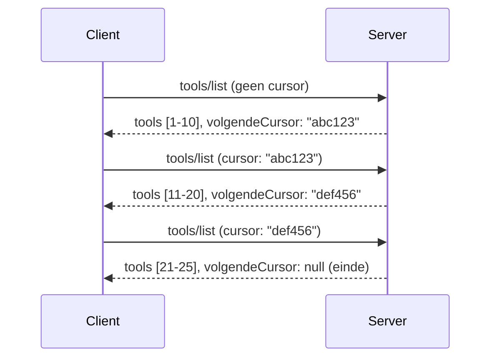

# Paginering en Grote Resultaatsets in MCP

Wanneer je MCP-server grote datasets verwerkt - of het nu gaat om duizenden bestanden, database records of zoekresultaten - heb je paginering nodig om het geheugen efficiënt te beheren en responsieve gebruikerservaringen te bieden. Deze gids behandelt hoe je paginering in MCP implementeert en gebruikt.

## Waarom Paginering Belangrijk Is

Zonder paginering kunnen grote antwoorden leiden tot:

- **Geheugentekort** - Miljoenen records tegelijk laden
- **Trage responstijden** - Gebruikers wachten terwijl alle data wordt geladen
- **Timeout fouten** - Verzoeken overschrijden timeout limieten
- **Slechte AI-prestaties** - LLM's worstelen met enorme contexten

MCP gebruikt **cursor-gebaseerde paginering** voor betrouwbare, consistente navigatie door resultaatsets.

---

## Hoe MCP Paginering Werkt

### Het Cursorconcept

Een **cursor** is een ondoorzichtige string die je positie in een resultaatset markeert. Zie het als een bladwijzer in een lang boek.



### Paginering in MCP Methoden

Deze MCP-methoden ondersteunen paginering:

| Methode | Retourneert | Cursorondersteuning |
|--------|------------|---------------------|
| `tools/list` | Tooldefinities | ✅ |
| `resources/list` | Resourcedefinities | ✅ |
| `prompts/list` | Promptdefinities | ✅ |
| `resources/templates/list` | Resourcetemplates | ✅ |

---

## Serverimplementatie

### Python (FastMCP)

```python
from mcp.server import Server
from mcp.types import Tool, ListToolsResult
import math

app = Server("paginated-server")

# Gesimuleerde grote dataset
ALL_TOOLS = [
    Tool(name=f"tool_{i}", description=f"Tool number {i}", inputSchema={})
    for i in range(100)
]

PAGE_SIZE = 10

@app.list_tools()
async def list_tools(cursor: str | None = None) -> ListToolsResult:
    """List tools with pagination support."""
    
    # Decodeer de cursor om de startindex te krijgen
    start_index = 0
    if cursor:
        try:
            start_index = int(cursor)
        except ValueError:
            start_index = 0
    
    # Haal een pagina met resultaten op
    end_index = min(start_index + PAGE_SIZE, len(ALL_TOOLS))
    page_tools = ALL_TOOLS[start_index:end_index]
    
    # Bereken de volgende cursor
    next_cursor = None
    if end_index < len(ALL_TOOLS):
        next_cursor = str(end_index)
    
    return ListToolsResult(
        tools=page_tools,
        nextCursor=next_cursor
    )
```

### TypeScript

```typescript
import { Server } from "@modelcontextprotocol/sdk/server/index.js";
import { ListToolsResultSchema } from "@modelcontextprotocol/sdk/types.js";

const server = new Server({
  name: "paginated-server",
  version: "1.0.0"
});

// Gesimuleerde grote dataset
const ALL_TOOLS = Array.from({ length: 100 }, (_, i) => ({
  name: `tool_${i}`,
  description: `Tool number ${i}`,
  inputSchema: { type: "object", properties: {} }
}));

const PAGE_SIZE = 10;

server.setRequestHandler(ListToolsResultSchema, async (request) => {
  // Decodeer cursor
  let startIndex = 0;
  if (request.params?.cursor) {
    startIndex = parseInt(request.params.cursor, 10) || 0;
  }
  
  // Verkrijg pagina met resultaten
  const endIndex = Math.min(startIndex + PAGE_SIZE, ALL_TOOLS.length);
  const pageTools = ALL_TOOLS.slice(startIndex, endIndex);
  
  // Bereken volgende cursor
  const nextCursor = endIndex < ALL_TOOLS.length ? String(endIndex) : undefined;
  
  return {
    tools: pageTools,
    nextCursor
  };
});
```

### Java (Spring MCP)

```java
@Service
public class PaginatedToolService {
    
    private static final int PAGE_SIZE = 10;
    private final List<Tool> allTools;
    
    public PaginatedToolService() {
        // Initialiseer grote dataset
        this.allTools = IntStream.range(0, 100)
            .mapToObj(i -> new Tool("tool_" + i, "Tool number " + i, Map.of()))
            .collect(Collectors.toList());
    }
    
    @McpMethod("tools/list")
    public ListToolsResult listTools(@Param("cursor") String cursor) {
        // Decodeer cursor
        int startIndex = 0;
        if (cursor != null && !cursor.isEmpty()) {
            try {
                startIndex = Integer.parseInt(cursor);
            } catch (NumberFormatException e) {
                startIndex = 0;
            }
        }
        
        // Haal pagina met resultaten op
        int endIndex = Math.min(startIndex + PAGE_SIZE, allTools.size());
        List<Tool> pageTools = allTools.subList(startIndex, endIndex);
        
        // Bereken volgende cursor
        String nextCursor = endIndex < allTools.size() ? String.valueOf(endIndex) : null;
        
        return new ListToolsResult(pageTools, nextCursor);
    }
}
```

---

## Clientimplementatie

### Python Client

```python
from mcp import ClientSession

async def get_all_tools(session: ClientSession) -> list:
    """Fetch all tools using pagination."""
    all_tools = []
    cursor = None
    
    while True:
        result = await session.list_tools(cursor=cursor)
        all_tools.extend(result.tools)
        
        if result.nextCursor is None:
            break
        cursor = result.nextCursor
    
    return all_tools

# Gebruik
async with client_session as session:
    tools = await get_all_tools(session)
    print(f"Found {len(tools)} tools")
```

### TypeScript Client

```typescript
import { Client } from "@modelcontextprotocol/sdk/client/index.js";

async function getAllTools(client: Client): Promise<Tool[]> {
  const allTools: Tool[] = [];
  let cursor: string | undefined = undefined;
  
  do {
    const result = await client.listTools({ cursor });
    allTools.push(...result.tools);
    cursor = result.nextCursor;
  } while (cursor);
  
  return allTools;
}

// Gebruik
const tools = await getAllTools(client);
console.log(`Found ${tools.length} tools`);
```

### Lazy Loading Patroon

Voor zeer grote datasets, laad pagina's op aanvraag:

```python
class PaginatedToolIterator:
    """Lazily iterate through paginated tools."""
    
    def __init__(self, session: ClientSession):
        self.session = session
        self.cursor = None
        self.buffer = []
        self.exhausted = False
    
    async def __anext__(self):
        # Retourneer uit buffer indien beschikbaar
        if self.buffer:
            return self.buffer.pop(0)
        
        # Controleer of we alle pagina's hebben doorlopen
        if self.exhausted:
            raise StopAsyncIteration
        
        # Haal volgende pagina op
        result = await self.session.list_tools(cursor=self.cursor)
        self.buffer = list(result.tools)
        self.cursor = result.nextCursor
        
        if self.cursor is None:
            self.exhausted = True
        
        if not self.buffer:
            raise StopAsyncIteration
        
        return self.buffer.pop(0)
    
    def __aiter__(self):
        return self

# Gebruik - geheugenefficiënt voor grote datasets
async for tool in PaginatedToolIterator(session):
    process_tool(tool)
```

---

## Paginering voor Resources

Resources hebben vaak paginering nodig voor mappen of grote datasets:

```python
from mcp.server import Server
from mcp.types import Resource, ListResourcesResult
import os

app = Server("file-server")

@app.list_resources()
async def list_resources(cursor: str | None = None) -> ListResourcesResult:
    """List files in directory with pagination."""
    
    directory = "/data/files"
    all_files = sorted(os.listdir(directory))
    
    # Decodeer cursor (bestand index)
    start_index = int(cursor) if cursor else 0
    page_size = 20
    end_index = min(start_index + page_size, len(all_files))
    
    # Maak resource lijst voor deze pagina
    resources = []
    for filename in all_files[start_index:end_index]:
        filepath = os.path.join(directory, filename)
        resources.append(Resource(
            uri=f"file://{filepath}",
            name=filename,
            mimeType="application/octet-stream"
        ))
    
    # Bereken volgende cursor
    next_cursor = str(end_index) if end_index < len(all_files) else None
    
    return ListResourcesResult(
        resources=resources,
        nextCursor=next_cursor
    )
```

---

## Cursorontwerpstrategieën

### Strategie 1: Index-gebaseerd (Eenvoudig)

```python
# Cursor is gewoon de index
cursor = "50"  # Begin bij item 50
```

**Voordelen:** Eenvoudig, stateless
**Nadelen:** Resultaten kunnen verschuiven als items worden toegevoegd/verwijderd

### Strategie 2: ID-gebaseerd (Stabiel)

```python
# Cursor is de laatst geziene ID
cursor = "item_abc123"  # Begin na dit item
```

**Voordelen:** Stabiel, ook als items veranderen
**Nadelen:** Vereist geordende IDs

### Strategie 3: Geëncodeerde Status (Complex)

```python
import base64
import json

def encode_cursor(state: dict) -> str:
    return base64.b64encode(json.dumps(state).encode()).decode()

def decode_cursor(cursor: str) -> dict:
    return json.loads(base64.b64decode(cursor).decode())

# Cursor bevat meerdere statusvelden
cursor = encode_cursor({
    "offset": 50,
    "filter": "active",
    "sort": "name"
})
```

**Voordelen:** Kan complexe staten coderen
**Nadelen:** Complexer, grotere cursorstrings

---

## Best Practices

### 1. Kies Passende Paginagroottes

```python
# Houd rekening met de gegevensgrootte
PAGE_SIZE_SMALL_ITEMS = 100   # Eenvoudige metadata
PAGE_SIZE_MEDIUM_ITEMS = 20   # Rijkere objecten
PAGE_SIZE_LARGE_ITEMS = 5     # Complexe inhoud
```

### 2. Ga Om met Ongeldige Cursors op een Vriendelijke Manier

```python
@app.list_tools()
async def list_tools(cursor: str | None = None) -> ListToolsResult:
    try:
        start_index = int(cursor) if cursor else 0
        if start_index < 0 or start_index >= len(ALL_TOOLS):
            start_index = 0  # Terug naar begin
    except (ValueError, TypeError):
        start_index = 0  # Ongeldige cursor, opnieuw beginnen
    # ...
```

### 3. Voeg Totaal Aantal Toe (Optioneel)

```python
return ListToolsResult(
    tools=page_tools,
    nextCursor=next_cursor,
    # Sommige implementaties bevatten totaal voor voortgang in de gebruikersinterface
    _meta={"total": len(ALL_TOOLS)}
)
```

### 4. Test Randgevallen

```python
async def test_pagination():
    # Lege resultaatsset
    result = await session.list_tools()
    assert result.tools == []
    assert result.nextCursor is None
    
    # Enkele pagina
    result = await session.list_tools()
    assert len(result.tools) <= PAGE_SIZE
    
    # Ongeldige cursor
    result = await session.list_tools(cursor="invalid")
    assert result.tools  # Moet eerste pagina retourneren
```

---

## Veel Voorkomende Valkuilen

### ❌ Alle Resultaten Terugdraaien en Dan Client-Side Pagineren

```python
# SLECHT: Laadt alles in het geheugen
@app.list_tools()
async def list_tools() -> ListToolsResult:
    all_tools = load_all_tools()  # 1 miljoen tools!
    return ListToolsResult(tools=all_tools)
```

### ✅ Pagineer aan de Databron

```python
# GOED: Laadt alleen wat nodig is
@app.list_tools()
async def list_tools(cursor: str | None = None) -> ListToolsResult:
    offset = int(cursor) if cursor else 0
    tools = await db.query_tools(offset=offset, limit=PAGE_SIZE)
    return ListToolsResult(tools=tools, nextCursor=...)
```

---

## Wat Nu?

- [Module 5.14 - Context Engineering](../../05-AdvancedTopics/mcp-contextengineering/README.md)
- [Module 8 - Best Practices](../../08-BestPractices/README.md)
- [3.8 - Testen van Je MCP Server](../../03-GettingStarted/08-testing/README.md)

---

## Aanvullende Bronnen

- [MCP Specificatie - Paginering](https://modelcontextprotocol.io/specification/2026-07-28/)
- [Cursor-Gebaseerde Paginering Uitgelegd](https://slack.engineering/evolving-api-pagination-at-slack/)
- [Python SDK paginering tests](https://github.com/modelcontextprotocol/python-sdk/blob/main/tests/client/test_list_methods_cursor.py)

---

<!-- CO-OP TRANSLATOR DISCLAIMER START -->
**Disclaimer**:
Dit document is vertaald met behulp van de AI vertaaldienst [Co-op Translator](https://github.com/Azure/co-op-translator). Hoewel we streven naar nauwkeurigheid, dient u er rekening mee te houden dat geautomatiseerde vertalingen fouten of onnauwkeurigheden kunnen bevatten. Het originele document in de oorspronkelijke taal moet worden beschouwd als de gezaghebbende bron. Voor kritieke informatie wordt professionele menselijke vertaling aanbevolen. Wij zijn niet aansprakelijk voor eventuele misverstanden of verkeerde interpretaties die voortvloeien uit het gebruik van deze vertaling.
<!-- CO-OP TRANSLATOR DISCLAIMER END -->