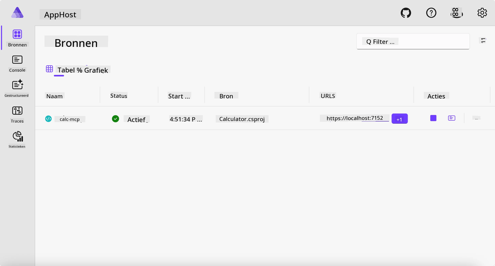
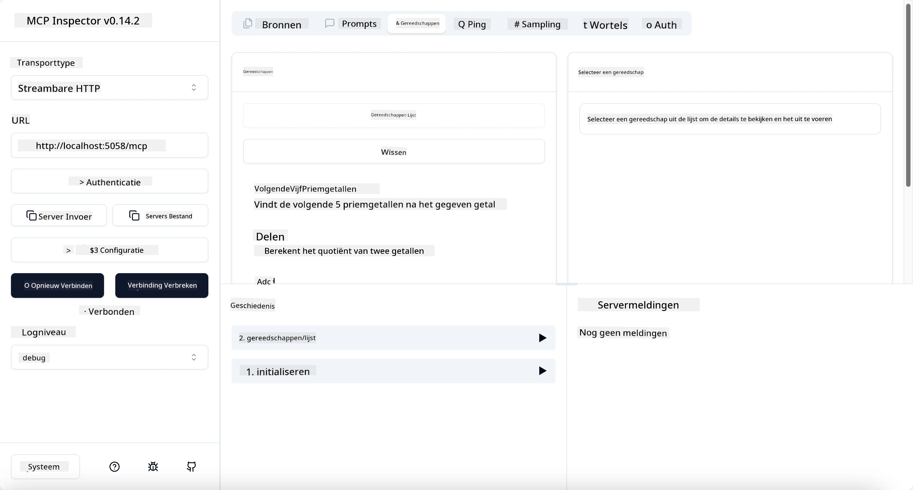
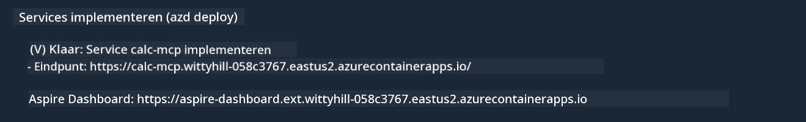

# Voorbeeld

Het vorige voorbeeld toont hoe je een lokaal .NET-project kunt gebruiken met het type `stdio`. En hoe je de server lokaal in een container kunt draaien. Dit is in veel situaties een goede oplossing. Het kan echter nuttig zijn om de server op afstand te laten draaien, bijvoorbeeld in een cloudomgeving. Hier komt het type `http` om de hoek kijken.

Als je kijkt naar de oplossing in de map `04-PracticalImplementation`, lijkt het misschien veel complexer dan het vorige voorbeeld. Maar in werkelijkheid is dat niet zo. Als je goed kijkt naar het project `src/Calculator`, zie je dat het grotendeels dezelfde code is als het vorige voorbeeld. Het enige verschil is dat we een andere bibliotheek `ModelContextProtocol.AspNetCore` gebruiken om de HTTP-verzoeken af te handelen. En we veranderen de methode `IsPrime` in privé, gewoon om te laten zien dat je privé-methoden in je code kunt hebben. De rest van de code is hetzelfde als voorheen.

De andere projecten zijn van [Aspire](https://aspire.dev/get-started/what-is-aspire/). Het hebben van Aspire in de oplossing verbetert de ervaring van de ontwikkelaar tijdens het ontwikkelen en testen en helpt met observability. Het is niet vereist om de server te draaien, maar het is een goede gewoonte om het in je oplossing te hebben.

## Start de server lokaal

1. Ga in VS Code (met de C# DevKit-extensie) naar de map `04-PracticalImplementation/samples/csharp`.
1. Voer het volgende commando uit om de server te starten:

   ```bash
    dotnet watch run --project ./src/AppHost
   ```

1. Wanneer er een webbrowser opent op het Aspire-dashboard, let dan op de `http`-URL. Het zou iets moeten zijn als `http://localhost:5058/`.

   

## Test Streamable HTTP met de MCP Inspector

Als je Node.js 22.7.5 of hoger hebt, kun je de MCP Inspector gebruiken om je server te testen.

Start de server en voer het volgende commando uit in een terminal:

```bash
npx @modelcontextprotocol/inspector http://localhost:5058
```



- Selecteer `Streamable HTTP` als transporttype.
- Vul in het veld Url de eerder genoteerde URL van de server in, en voeg `/mcp` toe. Het moet `http` zijn (niet `https`), iets als `http://localhost:5058/mcp`.
- Selecteer de knop Connect.

Een fijn aspect van de Inspector is dat het een mooie zichtbaarheid geeft op wat er gebeurt.

- Probeer de beschikbare tools te tonen.
- Probeer een aantal van hen, het zou net zo moeten werken als eerder.

## Test MCP Server met GitHub Copilot Chat in VS Code

Om het Streamable HTTP transport te gebruiken met GitHub Copilot Chat, verander je de configuratie van de eerder gemaakte `calc-mcp` server zodat deze er zo uitziet:

```jsonc
// .vscode/mcp.json
{
  "servers": {
    "calc-mcp": {
      "type": "http",
      "url": "http://localhost:5058/mcp"
    }
  }
}
```

Doe wat tests:

- Vraag om "3 priemgetallen na 6780". Let erop dat Copilot de nieuwe tools `NextFivePrimeNumbers` gebruikt en alleen de eerste 3 priemgetallen teruggeeft.
- Vraag om "7 priemgetallen na 111", om te zien wat er gebeurt.
- Vraag om "John heeft 24 lolly's en wil ze allemaal verdelen onder zijn 3 kinderen. Hoeveel lolly's krijgt elk kind?", om te zien wat er gebeurt.

## Zet de server in productie op Azure

Laten we de server naar Azure uitrollen zodat meer mensen hem kunnen gebruiken.

Ga in een terminal naar de map `04-PracticalImplementation/samples/csharp` en voer het volgende commando uit:

```bash
azd up
```

Zodra de uitrol klaar is, zou je een bericht moeten zien zoals dit:



Pak de URL en gebruik deze in de MCP Inspector en in de GitHub Copilot Chat.

```jsonc
// .vscode/mcp.json
{
  "servers": {
    "calc-mcp": {
      "type": "http",
      "url": "https://calc-mcp.gentleriver-3977fbcf.australiaeast.azurecontainerapps.io/mcp"
    }
  }
}
```

## Wat nu?

We proberen verschillende transporttypes en testtools. We rollen ook je MCP-server uit naar Azure. Maar wat als onze server toegang moet hebben tot privébronnen? Bijvoorbeeld een database of een privé-API? In het volgende hoofdstuk zullen we zien hoe we de beveiliging van onze server kunnen verbeteren.

---

<!-- CO-OP TRANSLATOR DISCLAIMER START -->
**Disclaimer**:
Dit document is vertaald met behulp van de AI vertaaldienst [Co-op Translator](https://github.com/Azure/co-op-translator). Hoewel we streven naar nauwkeurigheid, dient u er rekening mee te houden dat geautomatiseerde vertalingen fouten of onnauwkeurigheden kunnen bevatten. Het originele document in de oorspronkelijke taal moet worden beschouwd als de gezaghebbende bron. Voor kritieke informatie wordt professionele menselijke vertaling aanbevolen. Wij zijn niet aansprakelijk voor eventuele misverstanden of verkeerde interpretaties die voortvloeien uit het gebruik van deze vertaling.
<!-- CO-OP TRANSLATOR DISCLAIMER END -->