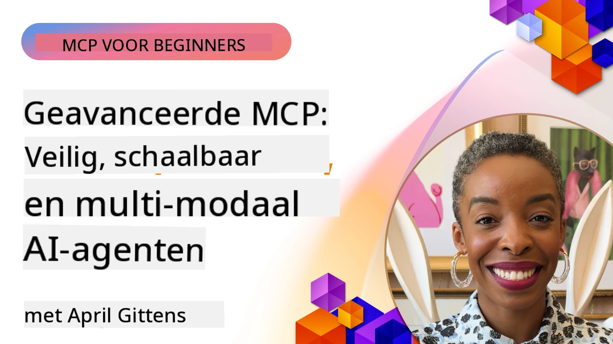

# Gevorderde Onderwerpen in MCP

_(Klik op de afbeelding hierboven om de video van deze les te bekijken)_

Dit hoofdstuk behandelt een reeks geavanceerde onderwerpen in de implementatie van het Model Context Protocol (MCP), waaronder multimodale integratie, schaalbaarheid, beste beveiligingspraktijken en integratie in ondernemingen. Deze onderwerpen zijn cruciaal voor het bouwen van robuuste en productieklaar MCP-applicaties die kunnen voldoen aan de eisen van moderne AI-systemen.

## Overzicht

Deze les onderzoekt geavanceerde concepten in de implementatie van het Model Context Protocol, met focus op multimodale integratie, schaalbaarheid, beste beveiligingspraktijken en integratie in ondernemingen. Deze onderwerpen zijn essentieel voor het bouwen van productieklare MCP-toepassingen die complexe eisen in zakelijke omgevingen kunnen afhandelen.

> **Opmerking huidige specificatie:** MCP `2026-07-28` veroudert de Roots- en
> Sampling-primitieven die behandeld worden in lessen 5.4 en 5.6. Het verplaatst ook de
> experimentele Taak-functie genoemd in Protocol Features (5.16) naar een
> speciale Taak-extensie. Die lessen worden behouden voor legacy
> `2025-11-25` implementaties en bevatten migratie-instructies. Zie
> [Wat is veranderd in MCP: de specificatie van 2026-07-28](../01-CoreConcepts/mcp-2026-07-28.md).

## Leerdoelen

Aan het einde van deze les kun je:

- Multimodale mogelijkheden binnen MCP-frameworks implementeren
- Schaalbare MCP-architecturen ontwerpen voor scenario's met hoge vraag
- Beveiligingsbest practices toepassen in lijn met de beveiligingsprincipes van MCP
- MCP integreren met AI-systemen en frameworks in ondernemingen
- Prestaties en betrouwbaarheid optimaliseren in productieomgevingen

## Lessen en voorbeeldprojecten

| Link | Titel | Beschrijving |
|------|-------|-------------|
| [5.1 Integratie met Azure](./mcp-integration/README.md) | Integreren met Azure | Leer hoe je je MCP-server op Azure integreert |
| [5.2 Multimodaal voorbeeld](./mcp-multi-modality/README.md) | MCP multimodale voorbeelden  | Voorbeelden voor audio, afbeelding en multimodale respons |
| [5.3 MCP OAuth2 voorbeeld](../../../05-AdvancedTopics/mcp-oauth2-demo) | MCP OAuth2 Demo | Minimale Spring Boot app die OAuth2 toont met MCP, zowel als Authorisatie- als Resource-server. Demonstreert veilige tokenuitgifte, beveiligde eindpunten, Azure Container Apps-deployment en API Management-integratie. |
| [5.4 Root Contexts](./mcp-root-contexts/README.md) | Root contexten  | Leer de legacy `2025-11-25` Roots-primitief en de huidige migratie-opties (verouderd in `2026-07-28`) |
| [5.5 Routering](./mcp-routing/README.md) | Routering | Leer verschillende soorten routering |
| [5.6 Sampling](./mcp-sampling/README.md) | Sampling | Leer de legacy `2025-11-25` Sampling-primitief en huidige migratie-opties (verouderd in `2026-07-28`) |
| [5.7 Schalen](./mcp-scaling/README.md) | Schalen  | Leer over schalen |
| [5.8 Beveiliging](./mcp-security/README.md) | Beveiliging  | Beveilig je MCP-server |
| [5.9 Web Search voorbeeld](./web-search-mcp/README.md) | Web Search MCP | Python MCP-server en client die integreert met SerpAPI voor realtime web-, nieuws-, productzoektochten en Q&A. Demonstreert multi-tool orkestratie, externe API-integratie en robuuste foutafhandeling. |
| [5.10 Realtime Streaming](./mcp-realtimestreaming/README.md) | Streaming  | Realtime datastreaming is vandaag essentieel in een door data aangedreven wereld, waar bedrijven en toepassingen onmiddellijke toegang tot informatie nodig hebben om tijdig beslissingen te nemen.|
| [5.11 Realtime Web Search](./mcp-realtimesearch/README.md) | Web Search | Realtime webzoektocht: hoe MCP realtime webzoektochten transformeert door een gestandaardiseerde aanpak te bieden voor contextbeheer over AI-modellen, zoekmachines en toepassingen.| 
| [5.12  Entra ID authenticatie voor Model Context Protocol Servers](./mcp-security-entra/README.md) | Entra ID Authenticatie | Microsoft Entra ID biedt een robuuste cloudgebaseerde identiteits- en toegangsbeheeroplossing die helpt garanderen dat alleen geautoriseerde gebruikers en toepassingen kunnen communiceren met je MCP-server.|
| [5.13 Microsoft Foundry Agent Integratie](./mcp-foundry-agent-integration/README.md) | Microsoft Foundry Integratie | Leer hoe je Model Context Protocol-servers integreert met Microsoft Foundry agents, wat krachtige toolorkestratie en bedrijfs-AI-mogelijkheden mogelijk maakt met gestandaardiseerde verbindingen met externe databronnen.|
| [5.14 Context Engineering](./mcp-contextengineering/README.md) | Context Engineering | De toekomstige kansen van context engineering technieken voor MCP-servers, inclusief contextoptimalisatie, dynamisch contextbeheer en strategieën voor effectieve prompt engineering binnen MCP-frameworks.|
| [5.15 MCP Custom Transport](./mcp-transport/README.md) | Custom Transport | Leer hoe je aangepaste transportmechanismen implementeert voor gespecialiseerde MCP-communicatiescenario's.|
| [5.16 Protocol Features Deep Dive](./mcp-protocol-features/README.md) | Protocol Features | Beheers geavanceerde protocolfuncties zoals voortgangsnotificaties, verzoekannulering, resource-templates en foutafhandelingspatronen.|
| [5.17 Adversarial Multi-Agent Reasoning](./mcp-adversarial-agents/README.md) | Adversarial Agents | Gebruik twee agenten met tegengestelde posities, die een enkele MCP-toolset delen, om hallucinaties op te sporen, randgevallen te blootleggen en beter gekalibreerde uitkomsten te produceren via gestructureerde discussies.|

> **Historische `2025-11-25` opmerking:** die revisie introduceerde experimentele
> Taken en breidde verschillende protocolfuncties uit. In `2026-07-28` zijn Taken overgegaan naar
> een officiële extensie en zijn Roots verouderd. Gebruik de
> `2025-11-25` functie-status niet als huidige richtlijn; zie de
> [2026-07-28 wijzigingslog](https://modelcontextprotocol.io/specification/2026-07-28/changelog).

## Aanvullende Referenties

Voor de meest actuele informatie over geavanceerde MCP-onderwerpen, raadpleeg:
- [MCP Documentatie](https://modelcontextprotocol.io/)
- [MCP Specificatie (2026-07-28)](https://modelcontextprotocol.io/specification/2026-07-28/)
- [GitHub Repository](https://github.com/modelcontextprotocol)
- [OWASP MCP Top 10](https://microsoft.github.io/mcp-azure-security-guide/mcp/) - Beveiligingsrisico's en mitigaties
- [MCP Security Summit Workshop (Sherpa)](https://azure-samples.github.io/sherpa/) - Praktische beveiligingstraining

## Belangrijkste Leerpunten

- Multimodale MCP-implementaties breiden AI-capaciteiten uit voorbij tekstverwerking
- Schaalbaarheid is essentieel voor implementaties in ondernemingen en kan worden aangepakt via horizontale en verticale schaalvergroting
- Omvattende beveiligingsmaatregelen beschermen data en zorgen voor passende toegangscontrole
- Integratie in ondernemingen met platforms zoals Azure OpenAI en Microsoft AI Foundry versterkt MCP-capaciteiten
- Geavanceerde MCP-implementaties profiteren van geoptimaliseerde architecturen en zorgvuldig middelenbeheer

## Oefening

Ontwerp een MCP-implementatie van ondernemingskwaliteit voor een specifieke use case:

1. Identificeer multimodale vereisten voor je use case
2. Schets de beveiligingscontroles die nodig zijn om gevoelige data te beschermen
3. Ontwerp een schaalbare architectuur die verschillende belastingen aankan
4. Plan integratiepunten met AI-systemen in ondernemingen
5. Documenteer mogelijke prestatieknelpunten en mitigatiestrategieën

## Aanvullende Middelen

- [Azure OpenAI Documentatie](https://learn.microsoft.com/en-us/azure/ai-services/openai/)
- [Microsoft AI Foundry Documentatie](https://learn.microsoft.com/en-us/ai-services/)

---

## Wat nu?

Verken de lessen in deze module, beginnend met: [5.1 MCP Integratie](./mcp-integration/README.md)

Zodra je deze module hebt afgerond, ga door naar: [Module 6: Communitybijdragen](../06-CommunityContributions/README.md)

---

<!-- CO-OP TRANSLATOR DISCLAIMER START -->
**Disclaimer**:
Dit document is vertaald met behulp van de AI vertaaldienst [Co-op Translator](https://github.com/Azure/co-op-translator). Hoewel we streven naar nauwkeurigheid, dient u er rekening mee te houden dat geautomatiseerde vertalingen fouten of onnauwkeurigheden kunnen bevatten. Het originele document in de oorspronkelijke taal moet worden beschouwd als de gezaghebbende bron. Voor kritieke informatie wordt professionele menselijke vertaling aanbevolen. Wij zijn niet aansprakelijk voor eventuele misverstanden of verkeerde interpretaties die voortvloeien uit het gebruik van deze vertaling.
<!-- CO-OP TRANSLATOR DISCLAIMER END -->