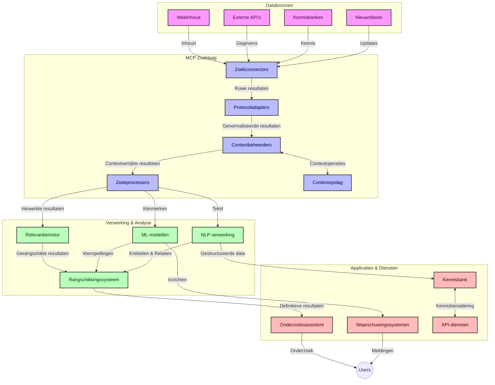
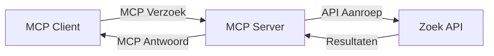
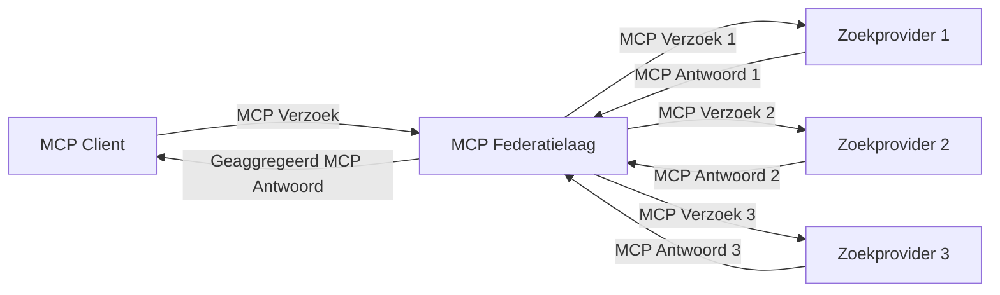
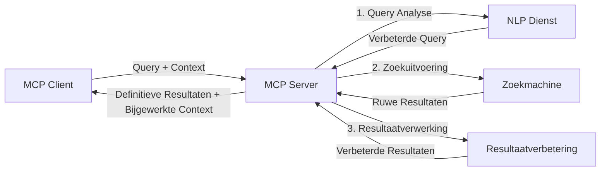

# Model Context Protocol voor Real-Time Web Search

## Overzicht

Real-time web search is essentieel geworden in de hedendaagse informatiegestuurde omgeving, waar toepassingen onmiddellijk toegang moeten hebben tot actuele informatie over het internet om relevante en tijdige antwoorden te bieden. Het Model Context Protocol (MCP) vertegenwoordigt een significante vooruitgang in het optimaliseren van deze real-time zoekprocessen, door zoek efficiëntie te verbeteren, contextuele integriteit te behouden en de algehele systeemprestaties te verbeteren.

Deze module onderzoekt hoe MCP real-time web search transformeert door een gestandaardiseerde aanpak te bieden voor contextbeheer tussen AI-modellen, zoekmachines en applicaties.

### Wat je zult leren

In deze uitgebreide gids ontdek je:

- Hoe MCP een naadloze brug slaat tussen AI-modellen en real-time web zoekmogelijkheden
- Architecturale patronen voor het implementeren van efficiënte en schaalbare zoekoplossingen met MCP
- Technieken voor het behouden van zoekcontext over meerdere zoekopdrachten en interacties
- Praktische code-implementaties in Python en JavaScript voor diverse zoekscenario's
- Methoden om relevantie, actualiteit en prestaties in MCP-aangedreven zoeksystemen in balans te brengen

## Inleiding tot Real-Time Web Search

Real-time web search is een technologische benadering die continue query's, verwerking en analyse van webgebaseerde informatie mogelijk maakt zodra deze wordt gepubliceerd of bijgewerkt, waardoor systemen verse en relevante informatie met minimale vertraging kunnen aanbieden. In tegenstelling tot traditionele zoekssystemen die werken op geïndexeerde data die uren of dagen oud kunnen zijn, verwerken real-time zoekprocessen live data van het web, wat inzichten en informatie levert die de actuele staat van online content weerspiegelen.

### Kernconcepten van Real-Time Web Search:

- **Continue Queryverwerking**: Zoekopdrachten worden verwerkt op steeds vernieuwende databronnen
- **Actualiteitsprioritering**: Systemen zijn ontworpen om verse informatie te prioriteren
- **Balans tussen Relevantie en Actualiteit**: Een balans behouden tussen relevantie en actualiteit
- **Schaalbare Architectuur**: Systemen moeten variabele querybelastingen en datavolumes afhandelen
- **Contextueel Begrip**: Het behouden van gebruikerscontext over zoekiteraties is cruciaal voor betekenisvolle resultaten
- **Dynamische Queryherschikking**: Aanpassen van zoekopdrachten op basis van context en eerdere resultaten
- **Integratie van Meerdere Bronnen**: Resultaten combineren van meerdere zoekproviders en webbronnen
- **Semantisch Begrip**: Queries en inhoud verwerken op basis van betekenis in plaats van alleen zoekwoorden
- **Realtime Ranking**: Resultaatrangschikkingen continu aanpassen naarmate nieuwe informatie beschikbaar komt

### Het Model Context Protocol en Real-Time Web Search

Het Model Context Protocol (MCP) adresseert verschillende kritieke uitdagingen in real-time web zoekomgevingen:

1. **Behoud van Zoekcontext**: MCP standaardiseert hoe context wordt behouden over gedistribueerde zoekcomponenten, zodat AI-modellen en verwerkingsknooppunten toegang hebben tot relevante zoekgeschiedenis en gebruikersvoorkeuren.

2. **Efficiënt Querybeheer**: Door gestructureerde mechanismen voor contextoverdracht te bieden, vermindert MCP de overhead van het steeds opnieuw overdragen van context in elke zoekiteratie.

3. **Interoperabiliteit**: MCP creëert een gemeenschappelijke taal voor contextdeling tussen diverse zoektechnologieën en AI-modellen, wat flexibeler en uitbreidbare architecturen mogelijk maakt.

4. **Zoek-geoptimaliseerde Context**: MCP-implementaties kunnen prioriteren welke contextelementen het meest relevant zijn voor effectieve zoekopdrachten, waarmee ze prestaties en nauwkeurigheid optimaliseren.

5. **Adaptieve Zoekverwerking**: Met goed contextbeheer via MCP kunnen zoeksystemen hun verwerking dynamisch aanpassen op basis van veranderende gebruikersbehoeften en informatiestromen.

In moderne toepassingen, variërend van nieuwsaggregatie tot onderzoeksassistenten, maakt de integratie van MCP met web zoektechnologieën intelligentere, contextbewuste zoekopdrachten mogelijk die steeds relevantere resultaten kunnen bieden naarmate gebruikersinteracties doorgaan.

## Leerdoelen

Aan het einde van deze les kun je:

- De fundamenten van real-time web search en haar uitdagingen in moderne toepassingen begrijpen
- Uitleggen hoe het Model Context Protocol (MCP) de mogelijkheden van real-time web search verbetert
- MCP-gebaseerde zoekoplossingen implementeren met populaire frameworks en API's
- Schaalbare, hoog-presterende zoekarchitecturen ontwerpen en uitrollen met MCP
- MCP-concepten toepassen op verschillende use cases, waaronder semantische zoekopdrachten, onderzoeksassistentie en AI-ondersteund browsen
- Opkomende trends en toekomstige innovaties in MCP-gebaseerde zoektechnologieën evalueren
- Contextbewuste zoeksystemen ontwikkelen die leren van gebruikersinteracties
- Web zoekmogelijkheden integreren in AI-assistenten met behulp van gestandaardiseerde MCP-protocollen
- Multi-stage zoekpijplijnen creëren die resultaten progressief verfijnen op basis van context
- Zoekprestaties optimaliseren terwijl een uitgebreide contextbewustheid wordt behouden

### Definitie en Betekenis

Real-time web search omvat het continu opvragen, ophalen en leveren van webgebaseerde informatie met minimale vertraging. In tegenstelling tot traditionele zoekmachines, die periodiek het web crawlen en indexeren, streeft real-time search ernaar informatie te tonen zodra deze beschikbaar komt, wat onmiddellijke toegang tot de meest actuele inhoud mogelijk maakt.

Belangrijke kenmerken van real-time web search zijn onder meer:

- **Actualiteit**: Het prioriteren van recente inhoud en updates
- **Continue Verwerking**: Voortdurend monitoren op nieuwe informatie
- **Query Aanpassing**: Zoekopdrachten verfijnen op basis van context en feedback
- **Onmiddellijke Levering**: Zoekresultaten met minimale vertraging bieden
- **Contextbehoud**: Bouwen op eerdere zoekopdrachten voor verbeterde relevantie

### Uitdagingen in Traditionele Web Search

Traditionele web-zoekbenaderingen hebben verschillende beperkingen wanneer toegepast op real-time scenario’s:

1. **Contextfragmentatie**: Moeilijkheden bij het behouden van zoekcontext over meerdere opdrachten
2. **Informatieverversing**: Uitdagingen bij het toegankelijk maken en prioriteren van de meest recente informatie
3. **Integratiecomplexiteit**: Problemen met interoperabiliteit tussen zoeksystemen en applicaties
4. **Latentieproblemen**: Balanceren van uitgebreide zoekacties met reactietijdeisen
5. **Relevantie Afstemming**: Nauwkeurigheid en relevantie garanderen terwijl actualiteit wordt geprioriteerd

## Begrip van Model Context Protocol (MCP) voor Zoekopdrachten

### Wat is MCP in Zoekcontexten?

Het Model Context Protocol (MCP) is een gestandaardiseerd communicatieprotocol dat efficiënte interactie tussen AI-modellen en applicaties faciliteert. In de context van real-time web search biedt MCP een raamwerk voor:

- Het behouden van zoekcontext gedurende queryreeksen
- Het standaardiseren van zoekopdracht- en resultaatformaten
- Het optimaliseren van de overdracht van zoekparameters en resultaten
- Het verbeteren van communicatie tussen model en zoekmachine

### Kerncomponenten en Architectuur

De MCP-architectuur voor real-time web search bestaat uit meerdere sleutelcomponenten:

1. **Query Context Handlers**: Beheren en onderhouden zoekcontext over meerdere zoekopdrachten
2. **Search Processors**: Verwerken binnenkomende zoekopdrachten met contextbewuste technieken
3. **Protocol Adapters**: Converteren tussen verschillende zoek-API's terwijl context behouden blijft
4. **Context Store**: Efficiënt opslaan en ophalen van zoekgeschiedenis en voorkeuren
5. **Search Connectors**: Verbinden met verschillende zoekmachines en web-API's



### Hoe MCP Real-Time Web Search Verbeterd

MCP pakt traditionele web zoekuitdagingen aan door:

- **Contextuele Continuïteit**: Relaties tussen zoekopdrachten behouden gedurende de hele zoeksessie
- **Geoptimaliseerde Overdracht**: Redundantie in zoekparameters verminderen door intelligent contextbeheer
- **Gestandaardiseerde Interfaces**: Consistente API's voor zoekcomponenten bieden
- **Verminderde Latentie**: Verwerkingsoverhead minimaliseren door efficiënt contextbeheer
- **Verbeterde Relevantie**: Zoekrelevantie verbeteren door gebruikersintentie te bewaren over meerdere zoekopdrachten

## Integratie en Implementatie

Real-time web zoeksystemen vereisen zorgvuldige architecturale ontwerp en implementatie om zowel prestaties als contextuele integriteit te behouden. Het Model Context Protocol biedt een gestandaardiseerde aanpak om AI-modellen en zoektechnologieën te integreren, waardoor geavanceerdere, contextbewuste zoekpijplijnen mogelijk worden.

### Overzicht van MCP-integratie in Zoekarchitecturen

Implementatie van MCP in real-time web zoekomgevingen vraagt rekening te houden met:

1. **Serialisatie van Zoekcontext**: MCP biedt efficiënte mechanismen om contextuele informatie binnen zoekopdrachten te coderen, waardoor essentiële context de query door de verwerkingspijplijn volgt. Dit omvat gestandaardiseerde serialisatieformaten die geoptimaliseerd zijn voor zoekgerelateerde metadata.

2. **Toestandsbewuste Zoekverwerking**: MCP maakt intelligentere toestandsbewuste verwerking mogelijk door consistente contextrepresentatie over zoekiteraties te behouden. Dit is vooral waardevol in multi-stage zoekpijplijnen waarbij contextverfijning resultaten verbetert.

3. **Query-uitbreiding en -verfijning**: MCP-implementaties in zoeksystemen kunnen geavanceerde query-uitbreiding en -verfijning faciliteren op basis van verzamelde context, waardoor resultaten steeds relevanter worden naarmate de zoek sessie vordert.

4. **Resultaatcaching en prioritering**: Door contextafhandeling te standaardiseren helpt MCP bij het beheren van resultaatcaching en prioritering, zodat componenten zich kunnen aanpassen aan de evoluerende zoekcontext.

5. **Zoek Federatie en Aggregatie**: MCP maakt meer geavanceerde federatie van zoekopdrachten over meerdere backends mogelijk door gestructureerde representaties van zoekcontext te bieden, wat een betere aggregatie van resultaten uit diverse bronnen ondersteunt.

De implementatie van MCP over diverse zoektechnologieën creëert een uniforme aanpak van contextbeheer, vermindert de noodzaak voor maatwerkcode bij integraties en verbetert de capaciteit van het systeem om betekenisvolle context te behouden terwijl zoekopdrachten evolueren.

### MCP in Diverse Web Zoekimplementaties

Deze voorbeelden volgen de huidige MCP-specificatie die zich richt op een JSON-RPC-gebaseerd protocol met onderscheidende transportmechanismen. De code toont hoe je aangepaste zoekintegraties kunt implementeren terwijl volledige compatibiliteit met het MCP-protocol behouden blijft.


<details>
<summary>Python-implementatie met generieke Zoek-API</summary>

```python
import asyncio
import json
import aiohttp
from typing import Dict, Any, Optional, List
from contextlib import asynccontextmanager
from collections.abc import AsyncIterator

# Importeer standaard MCP-bibliotheken
from mcp.client.session import ClientSession
from mcp.client.streamable_http import streamablehttp_client
from mcp.types import TextContent, CreateMessageRequestParams, CreateMessageResult
from mcp.server.fastmcp import FastMCP

# Maak een FastMCP-server voor webzoeken
search_server = FastMCP("WebSearch")

# Klasse om webzoekbewerkingen te verwerken
class WebSearchHandler:
    def __init__(self, api_endpoint: str, api_key: str):
        self.api_endpoint = api_endpoint
        self.api_key = api_key
        self.session = None
        
    async def initialize(self):
        """Initialize the HTTP session"""
        self.session = aiohttp.ClientSession(
            headers={"Authorization": f"Bearer {self.api_key}"}
        )
    
    async def close(self):
        """Close the HTTP session"""
        if self.session:
            await self.session.close()
            
    async def perform_search(self, query: str, max_results: int = 5, 
                           include_domains: List[str] = None, 
                           exclude_domains: List[str] = None,
                           time_period: str = "any") -> Dict[str, Any]:
        """Perform web search using the search API"""
        # Stel zoekparameters samen
        search_params = {
            "q": query,
            "limit": max_results,
            "time": time_period
        }
        
        if include_domains:
            search_params["site"] = ",".join(include_domains)
            
        if exclude_domains:
            search_params["exclude_site"] = ",".join(exclude_domains)
        
        # Voer het zoekverzoek uit
        try:
            async with self.session.get(
                self.api_endpoint,
                params=search_params
            ) as response:
                if response.status != 200:
                    error_text = await response.text()
                    raise Exception(f"Search API error: {response.status} - {error_text}")
                
                search_data = await response.json()
                
                # Zet API-specifiek antwoord om naar een standaardformaat
                results = []
                for item in search_data.get("results", []):
                    results.append({
                        "title": item.get("title", ""),
                        "url": item.get("url", ""),
                        "snippet": item.get("snippet", ""),
                        "date": item.get("published_date", ""),
                        "source": item.get("source", "")
                    })
                
                return {
                    "query": query,
                    "totalResults": len(results),
                    "results": results
                }
        except Exception as e:
            print(f"Search API request error: {e}")
            raise

# Initialiseer de zoekhandler
search_handler = WebSearchHandler(
    api_endpoint="https://api.search-service.example/search",
    api_key="your-api-key-here"
)

# Stel lifespan in om de zoekhandler te beheren
@asyncio.asynccontextmanager
async def app_lifespan(server: FastMCP):
    """Manage application lifecycle"""
    await search_handler.initialize()
    try:
        yield {"search_handler": search_handler}
    finally:
        await search_handler.close()

# Stel lifespan in voor de server
search_server = FastMCP("WebSearch", lifespan=app_lifespan)

# Registreer een webzoektool
@search_server.tool()
async def web_search(query: str, max_results: int = 5, 
                   include_domains: List[str] = None,
                   exclude_domains: List[str] = None,
                   time_period: str = "any") -> Dict[str, Any]:
    """
    Search the web for information
    
    Args:
        query: The search query
        max_results: Maximum number of results to return (default: 5)
        include_domains: List of domains to include in search results
        exclude_domains: List of domains to exclude from search results
        time_period: Time period for results ("day", "week", "month", "any")
        
    Returns:
        Dictionary containing search results
    """
    ctx = search_server.get_context()
    search_handler = ctx.request_context.lifespan_context["search_handler"]
    
    results = await search_handler.perform_search(
        query=query,
        max_results=max_results,
        include_domains=include_domains,
        exclude_domains=exclude_domains,
        time_period=time_period
    )
    
    return results

# Voorbeeldgebruik door een client
async def client_example():
    # Maak verbinding met de zoekserver via Streamable HTTP-transport
    async with streamablehttp_client("http://localhost:8000/mcp") as (read, write, _):
        async with ClientSession(read, write) as session:
            # Initialiseer de verbinding
            await session.initialize()
            
            # Roep de web_search-tool aan
            search_results = await session.call_tool(
                "web_search", 
                {
                    "query": "latest developments in AI and Model Context Protocol",
                    "max_results": 5,
                    "time_period": "day",
                    "include_domains": ["github.com", "microsoft.com"]
                }
            )
            
            print(f"Search results: {search_results}")

# Voorbeeld van serveruitvoering
if __name__ == "__main__":
    # Start de server met Streamable HTTP-transport
    search_server.run(transport="streamable-http")
```
</details> 

<details>
<summary>JavaScript-implementatie met browsergebaseerde zoekfunctie</summary>


```javascript
// MCP-serverimplementatie voor webzoekopdrachten
import { McpServer, ResourceTemplate } from '@modelcontextprotocol/sdk/server/mcp.js';
import { StreamableHTTPServerTransport } from '@modelcontextprotocol/sdk/server/streamableHttp.js';
import { z } from 'zod';

// Maak een MCP-server voor webzoekopdrachten
const searchServer = new McpServer({
    name: "BrowserSearch",
    description: "A server that provides web search capabilities"
});

// Zoekserviceklasse
class SearchService {
    constructor(searchApiUrl, apiKey) {
        this.searchApiUrl = searchApiUrl;
        this.apiKey = apiKey;
    }

    async performSearch(parameters) {
        const {
            query = '',
            maxResults = 5,
            includeDomains = [],
            excludeDomains = [],
            timePeriod = 'any'
        } = parameters;
        
        // Bouw zoek-URL met parameters
        const url = new URL(this.searchApiUrl);
        url.searchParams.append('q', query);
        url.searchParams.append('limit', maxResults);
        url.searchParams.append('time', timePeriod);
        
        if (includeDomains.length > 0) {
            url.searchParams.append('site', includeDomains.join(','));
        }
        
        if (excludeDomains.length > 0) {
            url.searchParams.append('exclude_site', excludeDomains.join(','));
        }
        
        try {
            const response = await fetch(url.toString(), {
                method: 'GET',
                headers: {
                    'Authorization': `Bearer ${this.apiKey}`,
                    'Content-Type': 'application/json'
                }
            });
            
            if (!response.ok) {
                const errorText = await response.text();
                throw new Error(`Search API error: ${response.status} - ${errorText}`);
            }
            
            const searchData = await response.json();
            
            // Transformeer API-specifieke reactie naar een standaardformaat
            const results = searchData.results?.map(item => ({
                title: item.title || '',
                url: item.url || '',
                snippet: item.snippet || '',
                date: item.published_date || '',
                source: item.source || ''
            })) || [];
            
            return {
                query,
                totalResults: results.length,
                results
            };
        } catch (error) {
            console.error('Search API request error:', error);
            throw error;
        }
    }
}

// Initialiseer de zoekservice
const searchService = new SearchService(
    'https://api.search-service.example/search',
    'your-api-key-here'
);

// Stel de contextprovider voor de server in
searchServer.setContextProvider(() => {
    return {
        searchService
    };
});

// Registreer webzoektool
searchServer.tool({
    name: 'web_search',
    description: 'Search the web for information',
    parameters: {
        type: 'object',
        properties: {
            query: {
                type: 'string',
                description: 'The search query'
            },
            maxResults: {
                type: 'integer',
                description: 'Maximum number of results to return',
                default: 5
            },
            includeDomains: {
                type: 'array',
                items: { type: 'string' },
                description: 'List of domains to include in search results'
            },
            excludeDomains: {
                type: 'array',
                items: { type: 'string' },
                description: 'List of domains to exclude from search results'
            },
            timePeriod: {
                type: 'string',
                description: 'Time period for results',
                enum: ['day', 'week', 'month', 'any'],
                default: 'any'
            }
        },
        required: ['query']
    },
    handler: async (params, context) => {
        const { searchService } = context;
        return await searchService.performSearch(params);
    }
});

// Voorbeeld clientcode om verbinding te maken met de zoekserver
import { Client } from '@modelcontextprotocol/sdk/client/index.js';
import { StreamableHTTPClientTransport } from '@modelcontextprotocol/sdk/client/streamableHttp.js';

async function connectToSearchServer() {
    // Verbinden met de zoekserver
    const transport = new StreamableHTTPClientTransport(
        new URL('http://localhost:8000/mcp')
    );
    
    const client = new Client({
        name: 'search-client',
        version: '1.0.0'
    });
    
    await client.connect(transport);
    
    // Voer de zoektool uit
    const searchResults = await client.callTool({
        name: 'web_search',
        arguments: {
            query: 'Model Context Protocol implementation examples',
            maxResults: 10,
            timePeriod: 'week',
            includeDomains: ['github.com', 'docs.microsoft.com']
        }
    });
    
    console.log('Search results:', searchResults);
    
    // Opruimen
    await client.disconnect();
}

// Start de server
const transport = new StreamableHTTPServerTransport();
await searchServer.connect(transport);
console.log('Search server running at http://localhost:8000/mcp');

// In een aparte proces of nadat de server is gestart
// connectToSearchServer().catch(console.error);
```
</details> 


## Disclaimer Codevoorbeelden

> **Belangrijke Opmerking**: De onderstaande codevoorbeelden tonen de integratie van het Model Context Protocol (MCP) met web zoekfunctionaliteit. Hoewel ze de patronen en structuren volgen van de officiële MCP SDK’s, zijn ze vereenvoudigd voor educatieve doeleinden.
> 
> Deze voorbeelden laten zien:
> 
> 1. **Python-implementatie**: Een FastMCP-serverimplementatie die een web zoektool biedt en verbinding maakt met een externe zoek-API. Dit voorbeeld toont correct levensduurbeheer, contextafhandeling en toolimplementatie volgens de patronen van de [officiële MCP Python SDK](https://github.com/modelcontextprotocol/python-sdk). De server maakt gebruik van de aanbevolen Streamable HTTP-transportlaag die de oudere SSE-transportlaag voor productiedepartementen heeft vervangen.
> 
> 2. **JavaScript-implementatie**: Een TypeScript/JavaScript-implementatie volgens het FastMCP-patroon van de [officiële MCP TypeScript SDK](https://github.com/modelcontextprotocol/typescript-sdk) om een zoekserver te creëren met correcte tooldefinities en clientverbindingen. Het volgt de nieuwste aanbevolen patronen voor sessiebeheer en contextbehoud.
> 
> Voor productietoepassingen zouden deze voorbeelden aanvullende foutafhandeling, authenticatie en specifieke API-integratiecode vereisen. De getoonde zoek-API endpoints (`https://api.search-service.example/search`) zijn tijdelijke aanduidingen die vervangen moeten worden door daadwerkelijke zoekservice endpoints.
> 
> Voor complete implementatiedetails en de meest actuele benaderingen, zie de [officiële MCP-specificatie](https://spec.modelcontextprotocol.io/) en SDK-documentatie.

## Kernconcepten

### Het Model Context Protocol (MCP) Kader

In de kern biedt het Model Context Protocol een gestandaardiseerde manier voor AI-modellen, applicaties en diensten om context uit te wisselen. In real-time web search is dit raamwerk essentieel voor het creëren van coherente, multi-turn zoekervaringen. Belangrijke componenten zijn:

1. **Client-Server Architectuur**: MCP stelt een duidelijke scheiding vast tussen zoekclients (aanvragers) en zoekservers (aanbieders), wat flexibele implementatiemodellen mogelijk maakt.

2. **JSON-RPC Communicatie**: Het protocol gebruikt JSON-RPC voor berichtuitwisseling, waardoor het compatibel is met webtechnologieën en gemakkelijk te implementeren is op diverse platformen.

3. **Contextbeheer**: MCP definieert gestructureerde methoden voor het onderhouden, bijwerken en benutten van zoekcontext over meerdere interacties.

4. **Tooldefinities**: Zoekmogelijkheden worden blootgesteld als gestandaardiseerde tools met duidelijk gedefinieerde parameters en retourwaarden.

5. **Streaming-ondersteuning**: Het protocol ondersteunt streamingresultaten, essentieel voor real-time zoekopdrachten waarbij resultaten progressief kunnen binnenkomen.

### Patronen voor Integratie in Web Search

Bij het integreren van MCP met web search komen verschillende patronen naar voren:

#### 1. Directe Integratie van Zoekprovider



In dit patroon interfaceert de MCP-server rechtstreeks met een of meer zoek-API’s, vertaalt MCP-aanvragen naar API-specifieke oproepen en formatteert de resultaten als MCP-antwoorden.

#### 2. Gefedereerde Zoekopdracht met Contextbehoud



Dit patroon verdeelt zoekopdrachten over meerdere MCP-compatibele zoekproviders, die elk mogelijk gespecialiseerd zijn in verschillende typen inhoud of zoekmogelijkheden, terwijl een uniforme context behouden blijft.

#### 3. Contextverrijkte Zoekketen



In dit patroon wordt het zoekproces opgesplitst in meerdere fasen, waarbij context in elke stap wordt verrijkt, resulterend in progressief relevantere zoekresultaten.

### Zoekcontextcomponenten

In MCP-gebaseerde web search omvat context doorgaans:

- **Zoekgeschiedenis**: Vorige zoekopdrachten in de sessie
- **Gebruikersvoorkeuren**: Taal, regio, veilige zoekinstellingen
- **Interactieverleden**: Welke resultaten werden aangeklikt, tijd besteed aan resultaten
- **Zoekparameters**: Filters, sorteervolgorde en andere zoekmodifiers
- **Domeinkennis**: Vak-specifieke context relevant voor de zoekopdracht
- **Tijdelijke Context**: Tijdgebaseerde relevantiefactoren
- **Bronvoorkeuren**: Vertrouwde of geprefereerde informatiebronnen

## Use Cases en Toepassingen

### Onderzoek en Informatieverzameling

MCP verbetert onderzoeksworkflow door:

- Onderzoekcontext over zoeksessies te behouden
- Meer geavanceerde en contextueel relevante zoekopdrachten mogelijk te maken
- Ondersteuning voor multi-source zoekfederatie
- Het faciliteren van kennisextractie uit zoekresultaten

### Real-Time Nieuws- en Trendmonitoring

MCP-aangedreven zoekopdrachten bieden voordelen voor nieuwsmonitoring:

- Bijna real-time ontdekking van opkomende nieuwsverhalen
- Contextuele filtering van relevante informatie
- Onderwerp- en entiteittracking over meerdere bronnen
- Gepersonaliseerde nieuwsalerts gebaseerd op gebruikerscontext

### AI-ondersteund Browsen en Onderzoek

MCP creëert nieuwe mogelijkheden voor AI-ondersteund browsen:

- Contextuele zoekvoorstellen gebaseerd op actuele browseractiviteit
- Naadloze integratie van web search met LLM-aangedreven assistenten
- Multi-turn zoekverfijning met behouden context
- Verbeterde feitcontrole en informatieverificatie

## Toekomstige Trends en Innovaties

### Evolutie van MCP in Web Search

Vooruitkijkend verwachten we dat MCP zich ontwikkelt om aan te pakken:


- **Multimodale Zoekfunctie**: Integratie van tekst-, beeld-, audio- en videozoekopdrachten met behouden context
- **Gedecentraliseerde Zoekfunctie**: Ondersteuning van gedistribueerde en gefedereerde zoekecosystemen
- **Zoekprivacy**: Contextbewuste privacybeschermende zoekmechanismen
- **Begrip van Zoekopdrachten**: Diepgaande semantische analyse van zoekopdrachten in natuurlijke taal

### Potentiële Technologische Vooruitgangen

Opkomende technologieën die de toekomst van MCP-zoeken zullen vormen:

1. **Neuronale Zoekarchitecturen**: Zoekssystemen op basis van embeddings geoptimaliseerd voor MCP
2. **Gepersonaliseerde Zoekcontext**: Leren van individuele gebruikerszoekpatronen in de tijd
3. **Integratie van Kennisgrafieken**: Contextuele zoekfunctie versterkt door domeinspecifieke kennisgrafieken
4. **Cross-Modal Context**: Behoud van context over verschillende zoekmodaliteiten heen

## Praktische Oefeningen

### Oefening 1: Een Basispijplijn voor MCP-zoeken Opzetten

In deze oefening leer je hoe je:
- Een basis MCP-zoekomgeving configureert
- Context handlers implementeert voor webzoekopdrachten
- Contextbehoud test en valideert over zoekiteraties heen

### Oefening 2: Een Onderzoekassistent Bouwen met MCP-zoeken

Maak een volledige applicatie die:
- Onderzoeksvragen in natuurlijke taal verwerkt
- Contextbewuste webzoekopdrachten uitvoert
- Informatie uit meerdere bronnen synthetiseert
- Georganiseerde onderzoeksbevindingen presenteert

### Oefening 3: Federatie van Meervoudige Bronnen met MCP-zoeken Implementeren

Gevorderde oefening die behandelt:
- Contextbewuste verzending van zoekopdrachten naar verschillende zoekmachines
- Resultaatrangschikking en aggregatie
- Contextuele deduplicatie van zoekresultaten
- Omgaan met bron-specifieke metadata

## Aanvullende Bronnen

- [Model Context Protocol Specificatie](https://spec.modelcontextprotocol.io/) - Officiële MCP-specificatie en gedetailleerde protocoldocumentatie
- [Model Context Protocol Documentatie](https://modelcontextprotocol.io/) - Uitgebreide tutorials en implementatiehandleidingen
- [MCP Python SDK](https://github.com/modelcontextprotocol/python-sdk) - Officiële Python-implementatie van het MCP-protocol
- [MCP TypeScript SDK](https://github.com/modelcontextprotocol/typescript-sdk) - Officiële TypeScript-implementatie van het MCP-protocol
- [MCP Referentieservers](https://github.com/modelcontextprotocol/servers) - Referentie-implementaties van MCP-servers
- [Bing Web Search API Documentatie](https://learn.microsoft.com/en-us/bing/search-apis/bing-web-search/overview) - Microsofts webzoek-API
- [Google Custom Search JSON API](https://developers.google.com/custom-search/v1/overview) - Google's programmeerbare zoekmachine
- [SerpAPI Documentatie](https://serpapi.com/search-api) - API voor zoekmachine-resultaatpagina’s
- [Meilisearch Documentatie](https://www.meilisearch.com/docs) - Open-source zoekmachine
- [Elasticsearch Documentatie](https://www.elastic.co/guide/index.html) - Gedistribueerde zoek- en analysemachine
- [LangChain Documentatie](https://python.langchain.com/docs/get_started/introduction) - Applicaties bouwen met LLM's

## Leerresultaten

Door het voltooien van deze module kun je:

- De basisprincipes van real-time webzoeken en de uitdagingen ervan begrijpen
- Uitleggen hoe het Model Context Protocol (MCP) real-time webzoekmogelijkheden verbetert
- MCP-gebaseerde zoekoplossingen implementeren met populaire frameworks en API’s
- Schaalbare, hoogwaardige zoekarchitecturen ontwerpen en inzetten met MCP
- MCP-concepten toepassen op verschillende use-cases, waaronder semantisch zoeken, onderzoeksassistentie en met AI ondersteund browsen
- Opkomende trends en toekomstige innovaties in MCP-gebaseerde zoektechnologieën evalueren


### Overwegingen voor Vertrouwen en Veiligheid

Bij het implementeren van MCP-gebaseerde webzoekoplossingen, onthoud deze belangrijke principes uit de MCP-specificatie:

1. **Toestemming en Controle van Gebruikers**: Gebruikers moeten expliciet instemmen met en begrijpen welke gegevens worden geraadpleegd en welke handelingen plaatsvinden. Dit is vooral belangrijk voor webzoekimplementaties die externe databronnen kunnen benaderen.

2. **Gegevensprivacy**: Zorg voor passende behandeling van zoekopdrachten en resultaten, vooral wanneer deze gevoelige informatie kunnen bevatten. Implementeer adequate toegangscontroles ter bescherming van gebruikersgegevens.

3. **Veiligheid van Tools**: Zorg voor juiste autorisatie en validatie van zoektools, aangezien deze mogelijke beveiligingsrisico’s vormen via arbitraire code-uitvoering. Beschrijvingen van toolgedrag moeten als onbetrouwbaar worden beschouwd tenzij verkregen van een vertrouwde server.

4. **Duidelijke Documentatie**: Bied duidelijke documentatie over de mogelijkheden, beperkingen en beveiligingsaspecten van jouw MCP-gebaseerde zoekimplementatie, in navolging van de implementatierichtlijnen uit de MCP-specificatie.

5. **Robuuste Toestemmingsprocessen**: Bouw robuuste toestemmings- en autorisatieprocessen die duidelijk uitleggen wat elke tool doet voordat het gebruik wordt goedgekeurd, vooral voor tools die met externe webbronnen communiceren.

Voor volledige details over MCP-beveiliging en vertrouwen, raadpleeg de [officiële documentatie](https://modelcontextprotocol.io/specification/2025-11-25/basic/security_best_practices).

## Wat volgt

- [5.12 Entra ID Authenticatie voor Model Context Protocol Servers](../mcp-security-entra/README.md)

---

<!-- CO-OP TRANSLATOR DISCLAIMER START -->
**Disclaimer**:
Dit document is vertaald met behulp van de AI vertaaldienst [Co-op Translator](https://github.com/Azure/co-op-translator). Hoewel we streven naar nauwkeurigheid, dient u er rekening mee te houden dat geautomatiseerde vertalingen fouten of onnauwkeurigheden kunnen bevatten. Het originele document in de oorspronkelijke taal moet worden beschouwd als de gezaghebbende bron. Voor kritieke informatie wordt professionele menselijke vertaling aanbevolen. Wij zijn niet aansprakelijk voor eventuele misverstanden of verkeerde interpretaties die voortvloeien uit het gebruik van deze vertaling.
<!-- CO-OP TRANSLATOR DISCLAIMER END -->