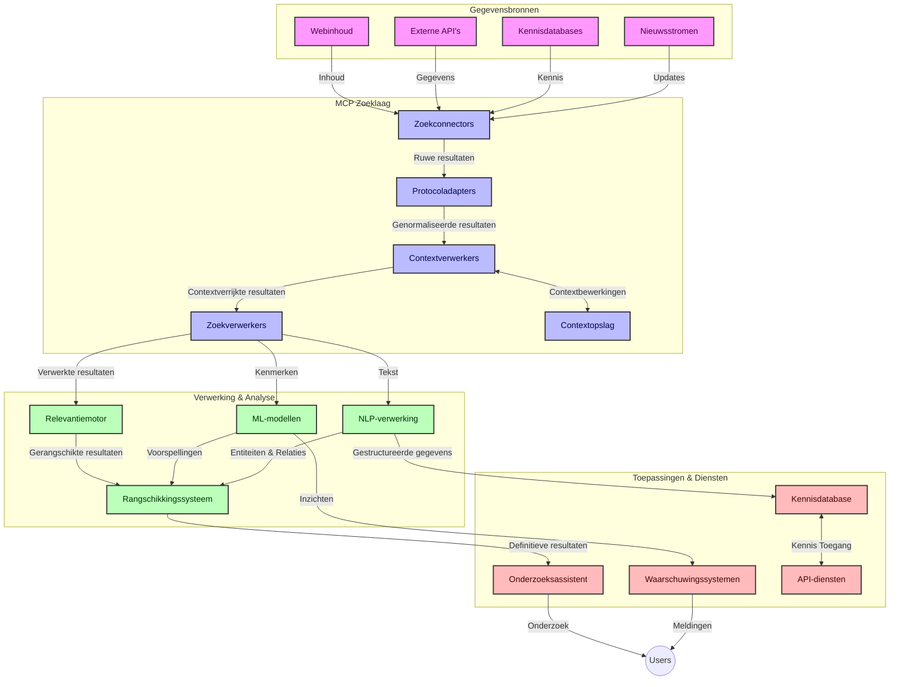
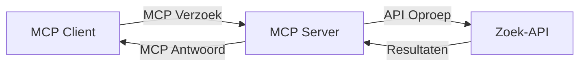
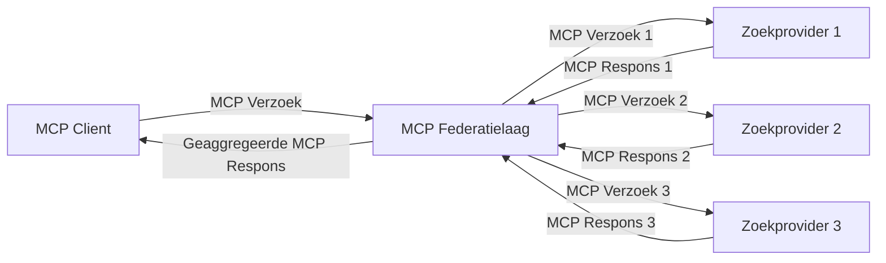
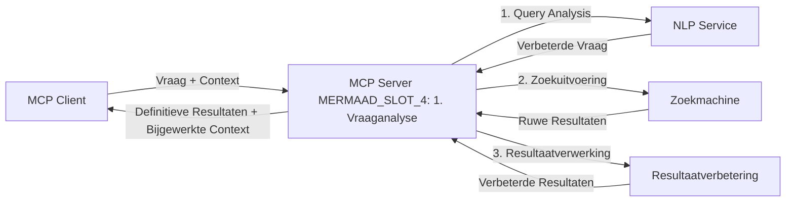

# Model Context Protocol voor Real-Time Web Search

## Overzicht

Real-time web search is essentieel geworden in de hedendaagse informatiegedreven omgeving, waar applicaties directe toegang nodig hebben tot up-to-date informatie verspreid over het internet om relevante en tijdige antwoorden te bieden. Het Model Context Protocol (MCP) vertegenwoordigt een belangrijke vooruitgang in het optimaliseren van deze real-time zoekprocessen, het verbeteren van zoek efficiëntie, het behouden van contextuele integriteit en het verbeteren van de algehele systeemprestaties.

Deze module onderzoekt hoe MCP real-time web search transformeert door een gestandaardiseerde aanpak te bieden voor contextbeheer tussen AI-modellen, zoekmachines en applicaties.

### Wat Je Zal Leren

In deze uitgebreide gids ontdek je:

- Hoe MCP een naadloze brug slaat tussen AI-modellen en real-time web search mogelijkheden
- Architecturale patronen voor het implementeren van efficiënte en schaalbare zoekoplossingen met MCP
- Technieken om zoekcontext over meerdere zoekopdrachten en interacties heen te bewaren
- Praktische code-implementaties in Python en JavaScript voor diverse zoekscenario's
- Methoden om relevantie, actualiteit en prestaties in MCP-gestuurde zoeksystemen in balans te brengen

## Introductie tot Real-Time Web Search

Real-time web search is een technologische aanpak die continue querying, verwerking en analyse van webgebaseerde informatie mogelijk maakt zodra deze wordt gepubliceerd of bijgewerkt. Dit stelt systemen in staat om met minimale vertraging verse en relevante informatie te leveren. In tegenstelling tot traditionele zoeksystemen die opereren op geïndexeerde data die uren of dagen oud kunnen zijn, verwerkt real-time search live data van het web en levert inzichten en informatie die de huidige staat van online inhoud weerspiegelen.

### Kernconcepten van Real-Time Web Search:

- **Continue Queryverwerking**: Zoekopdrachten worden verwerkt tegen voortdurend bijgewerkte gegevensbronnen
- **Actualiteit Prioritering**: Systemen zijn ontworpen om verse informatie te prioriteren
- **Relevantie Balans**: Het behouden van een balans tussen relevantie en actualiteit
- **Schaalbare Architectuur**: Systemen moeten variabele zoekbelasting en datavolumes aankunnen
- **Contextueel Begrip**: Het behouden van gebruikerscontext over zoekiteraties is cruciaal voor betekenisvolle resultaten
- **Dynamische Query Hervorming**: Adaptief aanpassen van zoekopdrachten op basis van context en eerdere resultaten
- **Multi-Source Integratie**: Resultaten van meerdere zoekproviders en webbronnen combineren
- **Semantisch Begrip**: Verwerken van zoekopdrachten en inhoud op basis van betekenis in plaats van alleen trefwoorden
- **Real-Time Ranking**: Continu aanpassen van resultaatrangschikking naarmate nieuwe informatie beschikbaar komt

### Het Model Context Protocol en Real-Time Web Search

Het Model Context Protocol (MCP) pakt verschillende kritieke uitdagingen aan in real-time web search omgevingen:

1. **Bewaring van Zoekcontext**: MCP standaardiseert hoe context wordt behouden over gedistribueerde zoekcomponenten, zodat AI-modellen en verwerkingsknooppunten toegang hebben tot relevante zoekgeschiedenis en gebruikersvoorkeuren.

2. **Efficiënt Querybeheer**: Door gestructureerde mechanismen voor contexttransmissie te bieden, vermindert MCP de overhead van het herhalen van context bij elke zoekiteratie.

3. **Interoperabiliteit**: MCP creëert een gemeenschappelijke taal voor contextdeling tussen diverse zoektechnologieën en AI-modellen, wat flexibele en uitbreidbare architecturen mogelijk maakt.

4. **Zoek-Geoptimaliseerde Context**: MCP-implementaties kunnen prioriteit geven aan de contextuele elementen die het meest relevant zijn voor effectieve zoekopdrachten, geoptimaliseerd voor zowel prestatie als nauwkeurigheid.

5. **Adaptieve Zoekverwerking**: Met goed contextbeheer via MCP kunnen zoeksystemen de verwerking dynamisch aanpassen op basis van veranderende gebruikersbehoeften en informatiesituaties.

In moderne applicaties, van nieuwsaggregatie tot onderzoeksassistenten, maakt de integratie van MCP met webzoektechnologieën mogelijk om intelligentere, contextbewuste zoekfuncties te bieden die naarmate gebruikersinteracties doorgaan steeds relevantere resultaten leveren.

## Leerdoelen

Aan het einde van deze les zul je in staat zijn om:

- De basisprincipes van real-time web search en de uitdagingen ervan in moderne applicaties te begrijpen
- Uit te leggen hoe het Model Context Protocol (MCP) real-time web search mogelijkheden verbetert
- MCP-gebaseerde zoekoplossingen te implementeren met populaire frameworks en API's
- Schaalbare, hoogpresterende zoekarchitecturen te ontwerpen en uit te rollen met MCP
- MCP-concepten toe te passen op diverse use cases, inclusief semantisch zoeken, onderzoeksassistentie en AI-ondersteund browsen
- Opkomende trends en toekomstige innovaties in MCP-gebaseerde zoektechnologieën te evalueren
- Contextbewuste zoeksystemen te ontwikkelen die leren van gebruikersinteracties
- Web zoekmogelijkheden te integreren in AI-assistenten met gestandaardiseerde MCP-protocollen
- Multi-stage zoekpijplijnen te creëren die resultaten progressief verfijnen op basis van context
- Zoekprestaties te optimaliseren terwijl volledige contextbewaking behouden blijft

### Definitie en Belang

Real-time web search omvat het continu opvragen, ophalen en leveren van webgebaseerde informatie met minimale vertraging. In tegenstelling tot traditionele zoekmachines die periodiek het web crawlen en indexeren, streeft real-time search ernaar informatie aan te bieden zodra deze beschikbaar is, waardoor onmiddellijke toegang tot de meest actuele inhoud mogelijk is.

Belangrijke kenmerken van real-time web search zijn onder andere:

- **Versheid**: Het prioriteren van recente inhoud en updates
- **Continue Verwerking**: Constante monitoring op nieuwe informatie
- **Query Aanpassing**: Het verfijnen van zoekopdrachten op basis van context en feedback
- **Onmiddellijke Levering**: Het bieden van zoekresultaten met minimale vertraging
- **Contextbehoud**: Voortbouwen op eerdere zoekopdrachten voor verbeterde relevantie

### Uitdagingen in Traditionele Web Search

Traditionele web search benaderingen ondervinden verschillende beperkingen als ze worden toegepast in real-time scenario’s:

1. **Contextfragmentatie**: Moeilijkheden bij het behouden van zoekcontext over meerdere zoekopdrachten
2. **Informatieversheid**: Problemen bij het verkrijgen en prioriteren van de meest recente informatie
3. **Integratiecomplexiteit**: Problemen met interoperabiliteit tussen zoeksystemen en applicaties
4. **Latencyproblemen**: Balanceren van uitgebreide zoekopdrachten met responstijdvereisten
5. **Relevantie Afstemming**: Zorgen voor nauwkeurigheid en relevantie terwijl actualiteit wordt geprioriteerd

## Begrip van Model Context Protocol (MCP) voor Zoeken

### Wat is MCP in Zoekcontexten?

Het Model Context Protocol (MCP) is een gestandaardiseerd communicatieprotocol dat is ontworpen om efficiënte interactie tussen AI-modellen en applicaties te faciliteren. In de context van real-time web search biedt MCP een kader voor:

- Het behouden van zoekcontext doorzoek zoekopdrachtreeksen heen
- Het standaardiseren van zoekopdracht- en resultaatformaten
- Het optimaliseren van de overdracht van zoekparameters en resultaten
- Het verbeteren van communicatie tussen modellen en zoekmachines

### Kerncomponenten en Architectuur

De MCP-architectuur voor real-time web search bestaat uit verschillende belangrijke componenten:

1. **Query Context Handlers**: Beheren en behouden van zoekcontext over meerdere zoekopdrachten
2. **Search Processors**: Verwerken van binnenkomende zoekopdrachten met contextbewuste technieken
3. **Protocol Adapters**: Converteren tussen verschillende zoek-API’s terwijl context behouden blijft
4. **Context Store**: Efficiënt opslaan en ophalen van zoekgeschiedenis en voorkeuren
5. **Search Connectors**: Verbinden met diverse zoekmachines en web-API’s



### Hoe MCP Real-Time Web Search Verbeterd

MCP pakt traditionele web search uitdagingen aan door:

- **Contextuele Continuïteit**: Relaties tussen zoekopdrachten onderhouden over de hele zoeksessie
- **Geoptimaliseerde Transmissie**: Verminderen van redundantie in zoekparameters via intelligent contextbeheer
- **Gestandaardiseerde Interfaces**: Consistente API’s voor zoekcomponenten bieden
- **Verminderde Latentie**: Verwerkingskosten minimaliseren door efficiënt contextbeheer
- **Verbeterde Relevantie**: Zoekrelevantie vergroten door gebruikersintentie over meerdere zoekopdrachten te behouden

## Integratie en Implementatie

Real-time web search systemen vereisen zorgvuldige architecturale ontwerp en implementatie om zowel prestatie als contextuele integriteit te behouden. Het Model Context Protocol biedt een gestandaardiseerde aanpak voor het integreren van AI-modellen en zoektechnologieën, wat geavanceerdere, contextbewuste zoekpijplijnen mogelijk maakt.

### Overzicht van MCP Integratie in Zoekarchitecturen

Implementatie van MCP in real-time web search omgevingen houdt rekening met verschillende belangrijke aspecten:

1. **Search Context Serialisatie**: MCP biedt efficiënte mechanismen voor het coderen van contextuele informatie binnen zoekopdrachten, zodat essentiële context de zoekopdracht door de verwerkingspijplijn volgt. Dit omvat gestandaardiseerde serialisatieformaten die geoptimaliseerd zijn voor zoekgerelateerde metadata.

2. **Stateful Zoekverwerking**: MCP maakt intelligentere stateful verwerking mogelijk door consistente contextrepresentatie over zoekiteraties heen te behouden. Dit is vooral waardevol in multi-stage zoekpijplijnen waar contextverfijning resultaten verbetert.

3. **Query Uitbreiding en Verfijning**: MCP-implementaties in zoeksystemen kunnen geavanceerde query uitbreiding en verfijning faciliteren op basis van verzamelde context, waardoor de resultaten naarmate de zoek sessie vordert steeds relevanter worden.

4. **Resultaatcaching en Prioritering**: Door contextbehandeling te standaardiseren helpt MCP bij het beheren van caching en prioritering van resultaten, waardoor componenten zich kunnen aanpassen aan de evoluerende zoekcontext.

5. **Zoekfederatie en Aggregatie**: MCP faciliteert meer geavanceerde federatie van zoekopdrachten over meerdere backends door gestructureerde representaties van zoekcontext te bieden, wat zinvolle aggregatie van resultaten uit diverse bronnen mogelijk maakt.

De implementatie van MCP over verschillende zoektechnologieën heen creëert een uniforme aanpak voor contextbeheer, vermindert de noodzaak voor maatwerk code integratie en verbetert het vermogen van het systeem om betekenisvolle context te behouden naarmate zoekopdrachten evolueren.

### MCP in Diverse Web Search Implementaties

Deze voorbeelden volgen de huidige MCP-specificatie die zich richt op een JSON-RPC-gebaseerd protocol met verschillende transportmechanismen. De code laat zien hoe je aangepaste zoekintegraties kunt maken met behoud van volledige compatibiliteit met het MCP-protocol.


<details>
<summary>Python Implementatie met Generieke Search API</summary>

```python
import asyncio
import json
import aiohttp
from typing import Dict, Any, Optional, List
from contextlib import asynccontextmanager
from collections.abc import AsyncIterator

# Importeer standaard MCP-bibliotheken
from mcp.client.session import ClientSession
from mcp.client.streamable_http import streamablehttp_client
from mcp.types import TextContent, CreateMessageRequestParams, CreateMessageResult
from mcp.server.fastmcp import FastMCP

# Maak een FastMCP-server voor web zoeken
search_server = FastMCP("WebSearch")

# Klasse om web zoekbewerkingen te verwerken
class WebSearchHandler:
    def __init__(self, api_endpoint: str, api_key: str):
        self.api_endpoint = api_endpoint
        self.api_key = api_key
        self.session = None
        
    async def initialize(self):
        """Initialize the HTTP session"""
        self.session = aiohttp.ClientSession(
            headers={"Authorization": f"Bearer {self.api_key}"}
        )
    
    async def close(self):
        """Close the HTTP session"""
        if self.session:
            await self.session.close()
            
    async def perform_search(self, query: str, max_results: int = 5, 
                           include_domains: List[str] = None, 
                           exclude_domains: List[str] = None,
                           time_period: str = "any") -> Dict[str, Any]:
        """Perform web search using the search API"""
        # Stel zoekparameters samen
        search_params = {
            "q": query,
            "limit": max_results,
            "time": time_period
        }
        
        if include_domains:
            search_params["site"] = ",".join(include_domains)
            
        if exclude_domains:
            search_params["exclude_site"] = ",".join(exclude_domains)
        
        # Voer het zoekverzoek uit
        try:
            async with self.session.get(
                self.api_endpoint,
                params=search_params
            ) as response:
                if response.status != 200:
                    error_text = await response.text()
                    raise Exception(f"Search API error: {response.status} - {error_text}")
                
                search_data = await response.json()
                
                # Transformeer API-specifiek antwoord naar een standaardformaat
                results = []
                for item in search_data.get("results", []):
                    results.append({
                        "title": item.get("title", ""),
                        "url": item.get("url", ""),
                        "snippet": item.get("snippet", ""),
                        "date": item.get("published_date", ""),
                        "source": item.get("source", "")
                    })
                
                return {
                    "query": query,
                    "totalResults": len(results),
                    "results": results
                }
        except Exception as e:
            print(f"Search API request error: {e}")
            raise

# Initialiseer de zoekhandler
search_handler = WebSearchHandler(
    api_endpoint="https://api.search-service.example/search",
    api_key="your-api-key-here"
)

# Stel levensduur in om de zoekhandler te beheren
@asyncio.asynccontextmanager
async def app_lifespan(server: FastMCP):
    """Manage application lifecycle"""
    await search_handler.initialize()
    try:
        yield {"search_handler": search_handler}
    finally:
        await search_handler.close()

# Stel levensduur in voor de server
search_server = FastMCP("WebSearch", lifespan=app_lifespan)

# Registreer een web zoektool
@search_server.tool()
async def web_search(query: str, max_results: int = 5, 
                   include_domains: List[str] = None,
                   exclude_domains: List[str] = None,
                   time_period: str = "any") -> Dict[str, Any]:
    """
    Search the web for information
    
    Args:
        query: The search query
        max_results: Maximum number of results to return (default: 5)
        include_domains: List of domains to include in search results
        exclude_domains: List of domains to exclude from search results
        time_period: Time period for results ("day", "week", "month", "any")
        
    Returns:
        Dictionary containing search results
    """
    ctx = search_server.get_context()
    search_handler = ctx.request_context.lifespan_context["search_handler"]
    
    results = await search_handler.perform_search(
        query=query,
        max_results=max_results,
        include_domains=include_domains,
        exclude_domains=exclude_domains,
        time_period=time_period
    )
    
    return results

# Voorbeeld van clientgebruik
async def client_example():
    # Verbind met de zoekserver via Streamable HTTP-transport
    async with streamablehttp_client("http://localhost:8000/mcp") as (read, write, _):
        async with ClientSession(read, write) as session:
            # Initialiseer de verbinding
            await session.initialize()
            
            # Roep de web_search tool aan
            search_results = await session.call_tool(
                "web_search", 
                {
                    "query": "latest developments in AI and Model Context Protocol",
                    "max_results": 5,
                    "time_period": "day",
                    "include_domains": ["github.com", "microsoft.com"]
                }
            )
            
            print(f"Search results: {search_results}")

# Voorbeeld van serveruitvoering
if __name__ == "__main__":
    # Voer de server uit met Streamable HTTP-transport
    search_server.run(transport="streamable-http")
```
</details> 

<details>
<summary>JavaScript Implementatie met Browser-Based Search</summary>


```javascript
// MCP-serverimplementatie voor webzoekopdracht
import { McpServer, ResourceTemplate } from '@modelcontextprotocol/sdk/server/mcp.js';
import { StreamableHTTPServerTransport } from '@modelcontextprotocol/sdk/server/streamableHttp.js';
import { z } from 'zod';

// Maak een MCP-server voor webzoekopdracht
const searchServer = new McpServer({
    name: "BrowserSearch",
    description: "A server that provides web search capabilities"
});

// Zoekserviceklasse
class SearchService {
    constructor(searchApiUrl, apiKey) {
        this.searchApiUrl = searchApiUrl;
        this.apiKey = apiKey;
    }

    async performSearch(parameters) {
        const {
            query = '',
            maxResults = 5,
            includeDomains = [],
            excludeDomains = [],
            timePeriod = 'any'
        } = parameters;
        
        // Stel zoek-URL samen met parameters
        const url = new URL(this.searchApiUrl);
        url.searchParams.append('q', query);
        url.searchParams.append('limit', maxResults);
        url.searchParams.append('time', timePeriod);
        
        if (includeDomains.length > 0) {
            url.searchParams.append('site', includeDomains.join(','));
        }
        
        if (excludeDomains.length > 0) {
            url.searchParams.append('exclude_site', excludeDomains.join(','));
        }
        
        try {
            const response = await fetch(url.toString(), {
                method: 'GET',
                headers: {
                    'Authorization': `Bearer ${this.apiKey}`,
                    'Content-Type': 'application/json'
                }
            });
            
            if (!response.ok) {
                const errorText = await response.text();
                throw new Error(`Search API error: ${response.status} - ${errorText}`);
            }
            
            const searchData = await response.json();
            
            // Transformeer API-specifieke respons naar een standaardformaat
            const results = searchData.results?.map(item => ({
                title: item.title || '',
                url: item.url || '',
                snippet: item.snippet || '',
                date: item.published_date || '',
                source: item.source || ''
            })) || [];
            
            return {
                query,
                totalResults: results.length,
                results
            };
        } catch (error) {
            console.error('Search API request error:', error);
            throw error;
        }
    }
}

// Initialiseer de zoekservice
const searchService = new SearchService(
    'https://api.search-service.example/search',
    'your-api-key-here'
);

// Stel de contextprovider voor de server in
searchServer.setContextProvider(() => {
    return {
        searchService
    };
});

// Registreer webzoektool
searchServer.tool({
    name: 'web_search',
    description: 'Search the web for information',
    parameters: {
        type: 'object',
        properties: {
            query: {
                type: 'string',
                description: 'The search query'
            },
            maxResults: {
                type: 'integer',
                description: 'Maximum number of results to return',
                default: 5
            },
            includeDomains: {
                type: 'array',
                items: { type: 'string' },
                description: 'List of domains to include in search results'
            },
            excludeDomains: {
                type: 'array',
                items: { type: 'string' },
                description: 'List of domains to exclude from search results'
            },
            timePeriod: {
                type: 'string',
                description: 'Time period for results',
                enum: ['day', 'week', 'month', 'any'],
                default: 'any'
            }
        },
        required: ['query']
    },
    handler: async (params, context) => {
        const { searchService } = context;
        return await searchService.performSearch(params);
    }
});

// Voorbeeldclientcode om verbinding te maken met de zoekserver
import { Client } from '@modelcontextprotocol/sdk/client/index.js';
import { StreamableHTTPClientTransport } from '@modelcontextprotocol/sdk/client/streamableHttp.js';

async function connectToSearchServer() {
    // Maak verbinding met de zoekserver
    const transport = new StreamableHTTPClientTransport(
        new URL('http://localhost:8000/mcp')
    );
    
    const client = new Client({
        name: 'search-client',
        version: '1.0.0'
    });
    
    await client.connect(transport);
    
    // Voer de zoektool uit
    const searchResults = await client.callTool({
        name: 'web_search',
        arguments: {
            query: 'Model Context Protocol implementation examples',
            maxResults: 10,
            timePeriod: 'week',
            includeDomains: ['github.com', 'docs.microsoft.com']
        }
    });
    
    console.log('Search results:', searchResults);
    
    // Opruimen
    await client.disconnect();
}

// Start de server
const transport = new StreamableHTTPServerTransport();
await searchServer.connect(transport);
console.log('Search server running at http://localhost:8000/mcp');

// In een apart proces of nadat de server is gestart
// connectToSearchServer().catch(console.error);
```
</details> 


## Disclaimer Codevoorbeelden

> **Belangrijke Opmerking**: De onderstaande codevoorbeelden demonstreren de integratie van het Model Context Protocol (MCP) met web zoekfunctionaliteit. Hoewel ze de patronen en structuren van de officiële MCP SDK’s volgen, zijn ze vereenvoudigd voor educatieve doeleinden.
> 
> Deze voorbeelden tonen:
> 
> 1. **Python Implementatie**: Een FastMCP servers-implementatie die een web zoektool aanbiedt en verbinding maakt met een externe zoek-API. Dit voorbeeld laat zien hoe levensduurbeheer, contextafhandeling en toolimplementatie volgens de patronen van de [officiële MCP Python SDK](https://github.com/modelcontextprotocol/python-sdk) correct worden toegepast. De server gebruikt de aanbevolen Streamable HTTP transport, die de oudere SSE transport voor productieomgevingen heeft vervangen.
> 
> 2. **JavaScript Implementatie**: Een TypeScript/JavaScript implementatie met het FastMCP-patroon van de [officiële MCP TypeScript SDK](https://github.com/modelcontextprotocol/typescript-sdk) om een zoekserver te creëren met correcte tooldefinities en clientverbindingen. Dit volgt de nieuwste aanbevolen patronen voor sessiebeheer en contextbehoud.
> 
> Deze voorbeelden vereisen aanvullende foutafhandeling, authenticatie en specifieke API integratiecode voor productiegebruik. De getoonde zoek-API endpoints (`https://api.search-service.example/search`) zijn plaatsaanduidingen en moeten worden vervangen door werkelijke zoekservice endpoints.
> 
> Voor volledige implementatiedetails en de meest actuele benaderingen,
> raadpleeg de [officiële MCP specificatie](https://modelcontextprotocol.io/specification/2026-07-28/)
> en SDK-documentatie.

## Kernconcepten

### Het Model Context Protocol (MCP) Framework

In de kern biedt het Model Context Protocol een gestandaardiseerde manier voor AI-modellen, applicaties en services om context uit te wisselen. In real-time web search is dit raamwerk essentieel voor het creëren van coherente, multi-turn zoekervaringen. Belangrijke componenten zijn onder meer:

1. **Client-Server Architectuur**: MCP stelt een duidelijke scheiding vast tussen zoekclients (aanvragers) en zoekservers (aanbieders), wat flexibele implementatiemodellen mogelijk maakt.

2. **JSON-RPC Communicatie**: Het protocol gebruikt JSON-RPC voor berichtuitwisseling, waardoor het compatibel is met webtechnologieën en gemakkelijk te implementeren op verschillende platforms.

3. **Contextbeheer**: MCP definieert gestructureerde methoden voor het onderhouden, bijwerken en gebruiken van zoekcontext over meerdere interacties heen.

4. **Tooldefinities**: Zoekmogelijkheden worden blootgesteld als gestandaardiseerde tools met goed gedefinieerde parameters en retourwaarden.

5. **Streaming Ondersteuning**: Het protocol ondersteunt het streamen van resultaten, essentieel voor real-time search waarbij resultaten progressief kunnen binnenkomen.

### Web Search Integratiepatronen

Bij het integreren van MCP met web search ontstaan verschillende patronen:

#### 1. Directe Integratie met Zoekprovider



In dit patroon interfaced de MCP-server rechtstreeks met één of meer zoek-API’s, vertaalt MCP-aanvragen naar API-specifieke oproepen en formatteert de resultaten als MCP-antwoorden.

#### 2. Gefedereerde Zoekopdrachten met Contextbehoud



Dit patroon verdeelt zoekopdrachten over meerdere MCP-compatibele zoekproviders, die elk mogelijk gespecialiseerd zijn in verschillende soorten inhoud of zoekmogelijkheden, terwijl een uniforme context behouden blijft.

#### 3. Contextverrijkte Zoekketen



In dit patroon wordt het zoekproces in meerdere fasen verdeeld, waarbij context in elke stap wordt verrijkt, wat resulteert in steeds relevantere resultaten.

### Componenten van Zoekcontext

In MCP-gebaseerde web search omvat context doorgaans:

- **Zoekgeschiedenis**: Vorige zoekopdrachten in de sessie
- **Gebruikersvoorkeuren**: Taal, regio, safe search instellingen
- **Interactieverleden**: Welke resultaten zijn aangeklikt, tijd besteed aan resultaten
- **Zoekparameters**: Filters, sorteervolgorde en andere zoekmodificaties
- **Domeinkennis**: Onderwerp specifieke context relevant voor de zoekopdracht
- **Tijdgebonden Context**: Tijdsgebonden relevantiefactoren
- **Bronvoorkeuren**: Vertrouwde of geprefereerde informatiebronnen

## Use Cases en Applicaties

### Onderzoek en Informatieverzameling

MCP verbetert onderzoeksworkflows door:

- Het bewaren van onderzoekcontext over zoek sessies heen
- Het mogelijk maken van geavanceerdere en contextueel relevante zoekopdrachten
- Het ondersteunen van multi-source zoekfederatie
- Het faciliteren van kennisextractie uit zoekresultaten

### Real-Time Nieuws en Trendmonitoring

MCP-gestuurde zoekopdrachten bieden voordelen voor nieuwsmonitoring:

- Bijna real-time ontdekking van opkomende nieuwsverhalen
- Contextuele filtering van relevante informatie
- Onderwerp- en entiteitstracking over meerdere bronnen
- Gepersonaliseerde nieuwsupdates gebaseerd op gebruikerscontext

### AI-ondersteund Browsen en Onderzoek

MCP opent nieuwe mogelijkheden voor AI-ondersteund browsen:

- Contextuele zoekvoorslagen gebaseerd op huidige browseractiviteit
- Naadloze integratie van web search met LLM-aangedreven assistenten
- Multi-turn zoekverfijning met behoud van context
- Verbeterde feitelijke controle en informatieverificatie

## Toekomstige Trends en Innovaties

### Evolutie van MCP in Web Search

Vooruitkijkend verwachten we dat MCP zich zal ontwikkelen om aan te pakken:


- **Multimodale Zoekopdracht**: Integratie van tekst-, beeld-, audio- en videozoekopdrachten met behouden context
- **Gedecentraliseerde Zoekopdracht**: Ondersteuning van gedistribueerde en gefedereerde zoekecosystemen
- **Zoekprivacy**: Contextbewuste privacybeschermende zoekmechanismen
- **Zoekopdracht Begrip**: Diepe semantische analyse van zoekopdrachten in natuurlijke taal

### Potentiële Technologische Ontwikkelingen

Opkomende technologieën die de toekomst van MCP-zoekopdrachten zullen vormgeven:

1. **Neurale Zoekarchitecturen**: Zoek systemen op basis van embedding geoptimaliseerd voor MCP
2. **Gepersonaliseerde Zoekcontext**: Leren van individuele gebruikerszoekpatronen in de loop van de tijd
3. **Integratie van Kennisgrafen**: Contextuele zoekopdracht verbeterd door domeinspecifieke kennisgrafen
4. **Cross-Modal Context**: Behoud van context over verschillende zoekmodaliteiten heen

## Praktische Oefeningen

### Oefening 1: Opzetten van een Basis MCP Zoekpipeline

In deze oefening leer je hoe je:
- Een basis MCP zoekomgeving configureert
- Contexthandlers implementeert voor webzoekopdrachten
- Contextbehoud test en valideert over zoekiteraties heen

### Oefening 2: Bouwen van een Onderzoeksassistent met MCP Zoekopdrachten

Maak een volledige applicatie die:
- Vragen in natuurlijke taal verwerkt
- Contextbewuste webzoekopdrachten uitvoert
- Informatie uit meerdere bronnen synthetiseert
- Georganiseerde onderzoeksresultaten presenteert

### Oefening 3: Implementeren van Multi-Source Zoekfederatie met MCP

Gevorderde oefening die behandelt:
- Contextbewuste query dispatching naar meerdere zoekmachines
- Resultaat rangschikking en aggregatie
- Contextuele deduplicatie van zoekresultaten
- Afhandeling van bron-specifieke metadata

## Aanvullende Bronnen

- [Model Context Protocol Specificatie](https://modelcontextprotocol.io/specification/2026-07-28/) - Officiële MCP-specificatie en gedetailleerde protocoldocumentatie
- [Model Context Protocol Documentatie](https://modelcontextprotocol.io/) - Gedetailleerde tutorials en implementatiehandleidingen
- [MCP Python SDK](https://github.com/modelcontextprotocol/python-sdk) - Officiële Python-implementatie van het MCP-protocol
- [MCP TypeScript SDK](https://github.com/modelcontextprotocol/typescript-sdk) - Officiële TypeScript-implementatie van het MCP-protocol
- [MCP Referentie Servers](https://github.com/modelcontextprotocol/servers) - Referentie-implementaties van MCP-servers
- [Bing Web Search API Documentatie](https://learn.microsoft.com/en-us/bing/search-apis/bing-web-search/overview) - Microsoft’s webzoek-API
- [Google Custom Search JSON API](https://developers.google.com/custom-search/v1/overview) - Google’s programmeerbare zoekmachine
- [SerpAPI Documentatie](https://serpapi.com/search-api) - API voor zoekmachine resultatenpagina’s
- [Meilisearch Documentatie](https://www.meilisearch.com/docs) - Open-source zoekmachine
- [Elasticsearch Documentatie](https://www.elastic.co/guide/index.html) - Gedistribueerde zoek- en analyse-engine
- [LangChain Documentatie](https://python.langchain.com/docs/get_started/introduction) - Applicaties bouwen met LLM’s

## Leerresultaten

Na voltooiing van deze module ben je in staat om:

- De basisprincipes van real-time webzoekopdrachten en de daarbij behorende uitdagingen te begrijpen
- Uit te leggen hoe het Model Context Protocol (MCP) real-time webzoekmogelijkheden verbetert
- MCP-gebaseerde zoekoplossingen te implementeren met populaire frameworks en API’s
- Schaalbare, high-performance zoekarchitecturen met MCP te ontwerpen en implementeren
- MCP-concepten toe te passen op diverse gebruiksscenario’s, waaronder semantisch zoeken, onderzoeksassistentie en AI-verrijkte browsing
- Opkomende trends en toekomstige innovaties in MCP-gebaseerde zoektechnologieën te evalueren


### Overwegingen voor Vertrouwen en Veiligheid

Bij het implementeren van MCP-gebaseerde webzoekoplossingen moet je rekening houden met de volgende belangrijke principes uit de MCP-specificatie:

1. **Toestemming en Controle van de Gebruiker**: Gebruikers moeten expliciet toestemming geven en volledig begrijpen welke data toegang en operaties plaatsvinden. Dit is vooral belangrijk bij webzoekimplementaties die mogelijk externe databronnen benaderen.

2. **Dataprivacy**: Zorg voor passende omgang met zoekopdrachten en resultaten, vooral wanneer deze gevoelige informatie kunnen bevatten. Implementeer passende toegangscontroles om gebruikersdata te beschermen.

3. **Veiligheid van Hulpmiddelen**: Implementeer juiste autorisatie en validatie voor zoekhulpmiddelen, aangezien deze veiligheidsrisico’s kunnen vormen via willekeurige code-uitvoering. Beschrijvingen van hulpmiddelgedrag dienen als onbetrouwbaar beschouwd te worden tenzij verkregen van een betrouwbare server.

4. **Duidelijke Documentatie**: Bied duidelijke documentatie over de mogelijkheden, beperkingen en veiligheidsaspecten van je MCP-gebaseerde zoekimplementatie, volgens de implementatierichtlijnen uit de MCP-specificatie.

5. **Robuuste Toestemmingsstromen**: Bouw robuuste toestemmings- en autorisatiestromen die duidelijk uitleggen wat elk hulpmiddel doet voordat het gebruik wordt geautoriseerd, vooral voor hulpmiddelen die met externe webbronnen communiceren.

Voor volledige details over MCP-beveiliging en vertrouwen overwegingen, raadpleeg de
[officiële documentatie](https://modelcontextprotocol.io/specification/2026-07-28/basic/security_best_practices).

## Wat is de volgende stap

- [5.12 Entra ID Authenticatie voor Model Context Protocol Servers](../mcp-security-entra/README.md)

---

<!-- CO-OP TRANSLATOR DISCLAIMER START -->
**Disclaimer**:
Dit document is vertaald met behulp van de AI vertaaldienst [Co-op Translator](https://github.com/Azure/co-op-translator). Hoewel we streven naar nauwkeurigheid, dient u er rekening mee te houden dat geautomatiseerde vertalingen fouten of onnauwkeurigheden kunnen bevatten. Het originele document in de oorspronkelijke taal moet worden beschouwd als de gezaghebbende bron. Voor kritieke informatie wordt professionele menselijke vertaling aanbevolen. Wij zijn niet aansprakelijk voor eventuele misverstanden of verkeerde interpretaties die voortvloeien uit het gebruik van deze vertaling.
<!-- CO-OP TRANSLATOR DISCLAIMER END -->