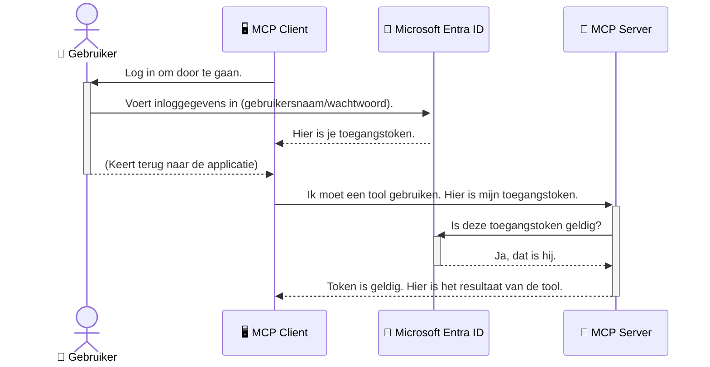

# AI-workflows beveiligen: Entra ID-authenticatie voor Model Context Protocol-servers

> [!NOTE]
> De remote servercode in deze les beschermt legacy `/sse` en `/message`
> eindpunten en is gericht op MCP `2025-11-25`. Behoud de identiteit en token-validatie-
> methoden, maar gebruik een `2026-07-28`-compatibele Streamable HTTP-transport voor nieuwe
> implementaties.

## Inleiding
Het beveiligen van je Model Context Protocol (MCP) server is net zo belangrijk als het op slot doen van de voordeur van je huis. Een open MCP-server stelt je tools en data bloot aan onbevoegde toegang, wat kan leiden tot beveiligingsinbreuken. Microsoft Entra ID biedt een robuuste cloudgebaseerde identiteits- en toegangsbeheeroplossing, waarmee je ervoor zorgt dat alleen geautoriseerde gebruikers en applicaties met je MCP-server kunnen communiceren. In deze sectie leer je hoe je je AI-workflows beschermt met Entra ID-authenticatie.

## Leerdoelen
Aan het einde van deze sectie kun je:

- Het belang van het beveiligen van MCP-servers begrijpen.
- De basis van Microsoft Entra ID en OAuth 2.0-authenticatie uitleggen.
- Het verschil herkennen tussen publieke en vertrouwelijke clients.
- Entra ID-authenticatie implementeren in zowel lokale (publieke client) als remote (vertrouwelijke client) MCP-server scenario's.
- Beveiligingsbest practices toepassen bij het ontwikkelen van AI-workflows.

## Beveiliging en MCP

Net zoals je de voordeur van je huis niet onbewaakt zou laten, moet je je MCP-server niet openstellen voor iedereen. Het beveiligen van je AI-workflows is essentieel voor het bouwen van robuuste, betrouwbare en veilige toepassingen. Dit hoofdstuk introduceert het gebruik van Microsoft Entra ID om je MCP-servers te beveiligen, zodat alleen geautoriseerde gebruikers en applicaties toegang krijgen tot je tools en data.

## Waarom beveiliging belangrijk is voor MCP-servers

Stel je voor dat je MCP-server een tool heeft die e-mails kan versturen of toegang kan krijgen tot een klantendatabase. Een onbeveiligde server betekent dat iedereen die tool kan gebruiken, wat kan leiden tot onbevoegde toegang tot data, spam of andere kwaadaardige activiteiten.

Door authenticatie te implementeren, zorg je ervoor dat elk verzoek aan je server wordt geverifieerd, waarbij de identiteit van de gebruiker of applicatie die het verzoek doet wordt bevestigd. Dit is de eerste en belangrijkste stap om je AI-workflows te beveiligen.

## Introductie tot Microsoft Entra ID

[**Microsoft Entra ID**](https://adoption.microsoft.com/microsoft-security/entra/) is een cloudgebaseerde dienst voor identiteits- en toegangsbeheer. Zie het als een universele beveiligingsbeveiliger voor je applicaties. Het regelt het complexe proces van het verifiëren van gebruikersidentiteiten (authenticatie) en bepaalt wat ze mogen doen (autorisatie).

Door Entra ID te gebruiken kun je:

- Veilige aanmelding voor gebruikers mogelijk maken.
- API's en diensten beschermen.
- Toegangsbeleid centraal beheren.

Voor MCP-servers biedt Entra ID een robuuste en breed vertrouwde oplossing om te beheren wie toegang heeft tot de mogelijkheden van je server.

---

## Het magische begrijpen: hoe Entra ID-authenticatie werkt

Entra ID gebruikt open standaarden zoals **OAuth 2.0** om authenticatie af te handelen. Hoewel de details complex kunnen zijn, is het kernconcept eenvoudig en met een analogie te begrijpen.

### Een zachte introductie tot OAuth 2.0: de valet key

Zie OAuth 2.0 als een valetservice voor je auto. Wanneer je bij een restaurant aankomt, geef je de valet niet je hoofdsleutel. In plaats daarvan geef je een **valet key** die beperkte rechten heeft—deze kan de auto starten en de deuren vergrendelen, maar opent niet de kofferbak of het dashboardkastje.

In deze analogie:

- **Jij** bent de **Gebruiker**.
- **Je auto** is de **MCP-server** met zijn waardevolle tools en data.
- De **Valet** is **Microsoft Entra ID**.
- De **Parkeerwachter** is de **MCP Client** (de applicatie die de server probeert te benaderen).
- De **Valet Key** is de **Access Token**.

De access token is een veilige tekststring die de MCP client van Entra ID ontvangt nadat je bent ingelogd. De client presenteert deze token bij elk verzoek aan de MCP-server. De server kan de token verifiëren om te zorgen dat het verzoek legitiem is en dat de client over de noodzakelijke rechten beschikt, zonder je daadwerkelijke inloggegevens (zoals je wachtwoord) te hoeven verwerken.

### De authenticatiestroom

Zo werkt het proces in de praktijk:



### Introductie van de Microsoft Authentication Library (MSAL)

Voordat we in de code duiken, is het belangrijk een sleutelcomponent uit de voorbeelden te introduceren: de **Microsoft Authentication Library (MSAL)**.

MSAL is een bibliotheek ontwikkeld door Microsoft die het voor ontwikkelaars veel eenvoudiger maakt om authenticatie te regelen. In plaats van zelf alle complexe code voor security tokens, aanmeldingen en sessieversies te schrijven, regelt MSAL het zware werk.

Het gebruik van een bibliotheek als MSAL wordt sterk aanbevolen omdat:

- **Het is veilig:** Het implementeert standaard protocollen en beste beveiligingspraktijken, waarmee de kans op kwetsbaarheden in je code wordt verkleind.
- **Het vereenvoudigt ontwikkeling:** Het onttrekt de complexiteit van OAuth 2.0 en OpenID Connect, waardoor je met een paar regels code sterke authenticatie toevoegt aan je applicatie.
- **Het wordt onderhouden:** Microsoft onderhoudt en werkt MSAL actief bij om nieuwe beveiligingsdreigingen en platformwijzigingen aan te pakken.

MSAL ondersteunt een breed scala aan programmeertalen en frameworks, zoals .NET, JavaScript/TypeScript, Python, Java, Go en mobiele platformen zoals iOS en Android. Dit betekent dat je consistente authenticatiepatronen kunt gebruiken over je gehele technologiestack.

Voor meer informatie over MSAL kun je de officiële [MSAL overview documentation](https://learn.microsoft.com/entra/identity-platform/msal-overview) bekijken.

---

## Je MCP-server beveiligen met Entra ID: een stapsgewijze handleiding

Laten we nu bekijken hoe je een lokale MCP-server (die communiceert via `stdio`) met Entra ID beveiligt. Dit voorbeeld gebruikt een **publieke client**, wat geschikt is voor applicaties die op de machine van een gebruiker draaien, zoals een desktopapp of een lokale ontwikkelserver.

### Scenario 1: Een lokale MCP-server beveiligen (met een publieke client)

In dit scenario bekijken we een MCP-server die lokaal draait, communiceert via `stdio` en Entra ID gebruikt om de gebruiker te authenticeren voordat toegang wordt verleend tot de tools. De server heeft één tool die gebruikersprofielinformatie ophaalt van de Microsoft Graph API.

#### 1. De applicatie instellen in Entra ID

Voordat je code schrijft, moet je je applicatie registreren in Microsoft Entra ID. Dit vertelt Entra ID over je applicatie en verleent toestemming om authenticatie te gebruiken.

1. Ga naar de **[Microsoft Entra portal](https://entra.microsoft.com/)**.
2. Ga naar **App registrations** en klik op **New registration**.
3. Geef je applicatie een naam (bijv. "My Local MCP Server").
4. Selecteer bij **Supported account types**: **Accounts in this organizational directory only**.
5. Laat de **Redirect URI** leeg voor dit voorbeeld.
6. Klik op **Register**.

Noteer na registratie de **Application (client) ID** en **Directory (tenant) ID**. Je hebt deze nodig in je code.

#### 2. De code: een overzicht

Laten we de belangrijkste code delen bekijken die authenticatie afhandelen. De volledige code is beschikbaar in de [Entra ID - Local - WAM](https://github.com/Azure-Samples/mcp-auth-servers/tree/main/src/entra-id-local-wam) map van de [mcp-auth-servers GitHub repository](https://github.com/Azure-Samples/mcp-auth-servers).

**`AuthenticationService.cs`**

Deze klasse is verantwoordelijk voor de interactie met Entra ID.

- **`CreateAsync`**: Deze methode initialiseert de `PublicClientApplication` van MSAL (Microsoft Authentication Library). Hij wordt geconfigureerd met de `clientId` en `tenantId` van je applicatie.
- **`WithBroker`**: Hiermee wordt het gebruik van een broker (zoals Windows Web Account Manager) ingeschakeld, wat een veiligere en naadloze single sign-on ervaring biedt.
- **`AcquireTokenAsync`**: Dit is de kernmethode. Eerst probeert het een token stilletjes te verkrijgen (zodat de gebruiker niet opnieuw hoeft in te loggen als er al een geldige sessie is). Als dat niet lukt, wordt de gebruiker gevraagd zich interactief aan te melden.

```csharp
// Simplified for clarity
public static async Task<AuthenticationService> CreateAsync(ILogger<AuthenticationService> logger)
{
    var msalClient = PublicClientApplicationBuilder
        .Create(_clientId) // Your Application (client) ID
        .WithAuthority(AadAuthorityAudience.AzureAdMyOrg)
        .WithTenantId(_tenantId) // Your Directory (tenant) ID
        .WithBroker(new BrokerOptions(BrokerOptions.OperatingSystems.Windows))
        .Build();

    // ... cache registration ...

    return new AuthenticationService(logger, msalClient);
}

public async Task<string> AcquireTokenAsync()
{
    try
    {
        // Try silent authentication first
        var accounts = await _msalClient.GetAccountsAsync();
        var account = accounts.FirstOrDefault();

        AuthenticationResult? result = null;

        if (account != null)
        {
            result = await _msalClient.AcquireTokenSilent(_scopes, account).ExecuteAsync();
        }
        else
        {
            // If no account, or silent fails, go interactive
            result = await _msalClient.AcquireTokenInteractive(_scopes).ExecuteAsync();
        }

        return result.AccessToken;
    }
    catch (Exception ex)
    {
        _logger.LogError(ex, "An error occurred while acquiring the token.");
        throw; // Optionally rethrow the exception for higher-level handling
    }
}
```

**`Program.cs`**

Hier wordt de MCP-server opgezet en de authenticatieservice geïntegreerd.

- **`AddSingleton<AuthenticationService>`**: Dit registreert de `AuthenticationService` bij de dependency injection container, zodat andere onderdelen van de applicatie (zoals onze tool) deze kunnen gebruiken.
- **`GetUserDetailsFromGraph` tool**: Deze tool vereist een instantie van `AuthenticationService`. Voordat het iets doet, roept het `authService.AcquireTokenAsync()` aan om een geldige access token te krijgen. Bij succes gebruikt de tool de token om de Microsoft Graph API aan te roepen en de gebruikersgegevens op te halen.

```csharp
// Simplified for clarity
[McpServerTool(Name = "GetUserDetailsFromGraph")]
public static async Task<string> GetUserDetailsFromGraph(
    AuthenticationService authService)
{
    try
    {
        // This will trigger the authentication flow
        var accessToken = await authService.AcquireTokenAsync();

        // Use the token to create a GraphServiceClient
        var graphClient = new GraphServiceClient(
            new BaseBearerTokenAuthenticationProvider(new TokenProvider(authService)));

        var user = await graphClient.Me.GetAsync();

        return System.Text.Json.JsonSerializer.Serialize(user);
    }
    catch (Exception ex)
    {
        return $"Error: {ex.Message}";
    }
}
```

#### 3. Hoe alles samenwerkt

1. Wanneer de MCP-client de `GetUserDetailsFromGraph` tool wil gebruiken, roept deze eerst `AcquireTokenAsync` aan.
2. `AcquireTokenAsync` activeert de MSAL-bibliotheek om te controleren op een geldige token.
3. Als er geen token gevonden wordt, zal MSAL via de broker de gebruiker vragen in te loggen met zijn Entra ID-account.
4. Nadat de gebruiker is ingelogd, geeft Entra ID een access token uit.
5. De tool ontvangt de token en gebruikt die om een beveiligde oproep te doen aan de Microsoft Graph API.
6. De gebruikersinformatie wordt teruggegeven aan de MCP-client.

Dit proces zorgt ervoor dat alleen geauthenticeerde gebruikers de tool kunnen gebruiken, waardoor je lokale MCP-server effectief wordt beveiligd.

### Scenario 2: Een remote MCP-server beveiligen (met een vertrouwelijke client)

Wanneer je MCP-server op een remote machine draait (zoals een cloudserver) en communiceert via een protocol als HTTP Streaming, zijn de beveiligingseisen anders. In dit geval gebruik je een **vertrouwelijke client** en de **Authorization Code Flow**. Dit is een veiligere methode omdat de geheime gegevens van de applicatie nooit aan de browser worden blootgesteld.

Dit voorbeeld gebruikt een TypeScript-gebaseerde MCP-server die Express.js gebruikt om HTTP-verzoeken af te handelen.

#### 1. De applicatie instellen in Entra ID

De setup in Entra ID is vergelijkbaar met die voor de publieke client, maar met één belangrijk verschil: je moet een **client secret** aanmaken.

1. Ga naar de **[Microsoft Entra portal](https://entra.microsoft.com/)**.
2. Ga in je app-registratie naar het tabblad **Certificates & secrets**.
3. Klik op **New client secret**, geef een beschrijving op, en klik op **Add**.
4. **Belangrijk:** Kopieer onmiddellijk de geheime waarde. Je kunt die later niet meer terugzien.
5. Je moet ook een **Redirect URI** configureren. Ga naar het tabblad **Authentication**, klik op **Add a platform**, kies voor **Web** en voer de redirect URI van je applicatie in (bijv. `http://localhost:3001/auth/callback`).

> **⚠️ Belangrijke beveiligingsopmerking:** Voor productieapplicaties raadt Microsoft sterk aan om **authenticatiemethoden zonder secrets** te gebruiken, zoals **Managed Identity** of **Workload Identity Federation** in plaats van client secrets. Client secrets brengen beveiligingsrisico's met zich mee omdat ze kunnen lekken of worden gecompromitteerd. Managed identities bieden een veiliger aanpak door het vermijden van opslag van inloggegevens in je code of configuratie.
>
> Voor meer informatie over managed identities en hoe je die implementeert, zie de [Managed identities for Azure resources overview](https://learn.microsoft.com/entra/identity/managed-identities-azure-resources/overview).

#### 2. De code: een overzicht

Dit voorbeeld gebruikt een sessiegebaseerde aanpak. Wanneer de gebruiker authenticatie voltooit, slaat de server de access token en refresh token op in een sessie en geeft de gebruiker een sessietoken. Dat sessietoken wordt vervolgens gebruikt voor volgende verzoeken. De volledige code van dit voorbeeld is beschikbaar in de [Entra ID - Confidential client](https://github.com/Azure-Samples/mcp-auth-servers/tree/main/src/entra-id-cca-session) map van de [mcp-auth-servers GitHub repository](https://github.com/Azure-Samples/mcp-auth-servers).

**`Server.ts`**

Dit bestand zet de Express-server en de MCP transportlaag op.

- **`requireBearerAuth`**: Dit is middleware die de `/sse` en `/message` endpoints beschermt. Het controleert op een geldige bearer token in de `Authorization` header van het verzoek.
- **`EntraIdServerAuthProvider`**: Dit is een custom klasse die de `McpServerAuthorizationProvider` interface implementeert. Het is verantwoordelijk voor het afhandelen van de OAuth 2.0-stroom.
- **`/auth/callback`**: Dit eindpunt verwerkt de redirect van Entra ID nadat de gebruiker is geauthenticeerd. Het wisselt de authorization code in voor een access token en refresh token.

```typescript
// Vereenvoudigd voor duidelijkheid
const app = express();
const { server } = createServer();
const provider = new EntraIdServerAuthProvider();

// Beveilig het SSE-eindpunt
app.get("/sse", requireBearerAuth({
  provider,
  requiredScopes: ["User.Read"]
}), async (req, res) => {
  // ... verbinden met de transport ...
});

// Beveilig het bericht-eindpunt
app.post("/message", requireBearerAuth({
  provider,
  requiredScopes: ["User.Read"]
}), async (req, res) => {
  // ... verwerk het bericht ...
});

// Verwerk de OAuth 2.0 callback
app.get("/auth/callback", (req, res) => {
  provider.handleCallback(req.query.code, req.query.state)
    .then(result => {
      // ... verwerk succes of mislukking ...
    });
});
```

**`Tools.ts`**

Dit bestand definieert de tools die de MCP-server aanbiedt. De `getUserDetails` tool lijkt op die uit het vorige voorbeeld, maar haalt de access token uit de sessie.

```typescript
// Vereenvoudigd voor duidelijkheid
server.setRequestHandler(CallToolRequestSchema, async (request) => {
  const { name } = request.params;
  const context = request.params?.context as { token?: string } | undefined;
  const sessionToken = context?.token;

  if (name === ToolName.GET_USER_DETAILS) {
    if (!sessionToken) {
      throw new AuthenticationError("Authentication token is missing or invalid. Ensure the token is provided in the request context.");
    }

    // Haal het Entra ID-token op uit de sessieopslag
    const tokenData = tokenStore.getToken(sessionToken);
    const entraIdToken = tokenData.accessToken;

    const graphClient = Client.init({
      authProvider: (done) => {
        done(null, entraIdToken);
      }
    });

    const user = await graphClient.api('/me').get();

    // ... retourneer gebruikersgegevens ...
  }
});
```

**`auth/EntraIdServerAuthProvider.ts`**

Deze klasse behandelt de logica voor:

- Het omleiden van de gebruiker naar de Entra ID-aanmeldpagina.
- Het wisselen van de authorization code voor een access token.
- Het opslaan van de tokens in de `tokenStore`.
- Het vernieuwen van de access token wanneer deze verloopt.


#### 3. Hoe het allemaal samenwerkt

1. Wanneer een gebruiker voor het eerst probeert verbinding te maken met de MCP-server, zal de `requireBearerAuth` middleware zien dat ze geen geldige sessie hebben en hen doorverwijzen naar de Entra ID-aanmeldpagina.
2. De gebruiker meldt zich aan met zijn of haar Entra ID-account.
3. Entra ID stuurt de gebruiker terug naar de `/auth/callback`-endpoint met een autorisatiecode.
4. De server wisselt de code in voor een toegangstoken en een verversingstoken, slaat deze op en maakt een sessietoken aan die naar de client wordt gestuurd.
5. De client kan nu dit sessietoken gebruiken in de `Authorization` header voor alle toekomstige aanvragen naar de MCP-server.
6. Wanneer het `getUserDetails`-hulpmiddel wordt aangeroepen, gebruikt het het sessietoken om het Entra ID-toegangstoken op te zoeken en gebruikt dat vervolgens om de Microsoft Graph API aan te roepen.

Deze flow is complexer dan de workflow voor publieke clients, maar is vereist voor internetgerichte endpoints. Omdat externe MCP-servers via het openbare internet toegankelijk zijn, hebben ze sterkere beveiligingsmaatregelen nodig om ongeautoriseerde toegang en mogelijke aanvallen te voorkomen.


## Beveiligingsbest practices

- **Gebruik altijd HTTPS**: Versleutel de communicatie tussen client en server om te voorkomen dat tokens onderschept worden.
- **Implementeer Role-Based Access Control (RBAC)**: Controleer niet alleen *of* een gebruiker is geverifieerd; controleer *wat* ze mogen doen. Je kunt rollen definiëren in Entra ID en deze controleren in je MCP-server.
- **Monitor en audit**: Log alle authenticatiegebeurtenissen zodat je verdachte activiteiten kunt detecteren en erop kunt reageren.
- **Behandel rate limiting en throttling**: Microsoft Graph en andere API's passen rate limiting toe om misbruik te voorkomen. Implementeer exponential backoff en retry-logica in je MCP-server om netjes om te gaan met HTTP 429 (Too Many Requests) reacties. Overweeg het cachen van frequent geraadpleegde data om API-aanroepen te verminderen.
- **Veilige tokenopslag**: Sla toegangstokens en verversingstokens veilig op. Voor lokale applicaties gebruik je de beveiligde opslagmechanismen van het systeem. Voor serverapplicaties overweeg je versleutelde opslag of veilige sleutelbeheer-diensten zoals Azure Key Vault.
- **Afhandeling van tokenverval**: Toegangstokens hebben een beperkte levensduur. Implementeer automatische tokenverversing met behulp van verversingstokens voor een naadloze gebruikerservaring zonder opnieuw te hoeven authenticeren.
- **Overweeg Azure API Management te gebruiken**: Hoewel directe beveiliging in je MCP-server je fijne controle geeft, kunnen API-gateways zoals Azure API Management veel van deze beveiligingsaspecten automatisch afhandelen, zoals authenticatie, autorisatie, rate limiting en monitoring. Zij bieden een gecentraliseerde beveiligingslaag tussen je clients en MCP-servers. Voor meer details over het gebruik van API-gateways met MCP, zie onze [Azure API Management Your Auth Gateway For MCP Servers](https://techcommunity.microsoft.com/blog/integrationsonazureblog/azure-api-management-your-auth-gateway-for-mcp-servers/4402690).


## Belangrijke punten

- Het beveiligen van je MCP-server is cruciaal voor het beschermen van je data en tools.
- Microsoft Entra ID biedt een robuuste en schaalbare oplossing voor authenticatie en autorisatie.
- Gebruik een **publieke client** voor lokale applicaties en een **vertrouwelijke client** voor externe servers.
- De **Authorization Code Flow** is de veiligste optie voor webapplicaties.


## Oefening

1. Denk na over een MCP-server die je zou kunnen bouwen. Zou het een lokale server of een externe server zijn?
2. Op basis van je antwoord, zou je dan een publieke of vertrouwelijke client gebruiken?
3. Welke machtiging zou je MCP-server nodig hebben om acties tegen Microsoft Graph uit te voeren?


## Praktische oefeningen

### Oefening 1: Registreer een applicatie in Entra ID
Navigeer naar het Microsoft Entra-portaal.
Registreer een nieuwe applicatie voor je MCP-server.
Noteer de Application (client) ID en Directory (tenant) ID.

### Oefening 2: Beveilig een lokale MCP-server (Publieke Client)
- Volg het codevoorbeeld om MSAL (Microsoft Authentication Library) te integreren voor gebruikersauthenticatie.
- Test de authenticatieflow door het MCP-hulpmiddel aan te roepen dat gebruikersdetails van Microsoft Graph ophaalt.

### Oefening 3: Beveilig een externe MCP-server (Vertrouwelijke Client)
- Registreer een vertrouwelijke client in Entra ID en maak een client secret aan.
- Configureer je Express.js MCP-server om de Authorization Code Flow te gebruiken.
- Test de beveiligde endpoints en bevestig toegang op basis van tokens.

### Oefening 4: Pas beveiligingsbest practices toe
- Schakel HTTPS in voor je lokale of externe server.
- Implementeer role-based access control (RBAC) in je serverlogica.
- Voeg afhandeling van tokenverval en veilige tokenopslag toe.

## Bronnen

1. **MSAL Overzicht Documentatie**  
   Leer hoe de Microsoft Authentication Library (MSAL) veilige tokenverwerving mogelijk maakt op meerdere platforms:  
   [MSAL Overview on Microsoft Learn](https://learn.microsoft.com/en-gb/entra/msal/overview)

2. **Azure-Samples/mcp-auth-servers GitHub Repository**  
   Referentie-implementaties van MCP-servers die authenticatieflows demonstreren:  
   [Azure-Samples/mcp-auth-servers on GitHub](https://github.com/Azure-Samples/mcp-auth-servers)

3. **Beheerste Identiteiten voor Azure Resources Overzicht**  
   Begrijp hoe je geheimen elimineert door systeem- of gebruikers-toegewezen managed identities te gebruiken:  
   [Managed Identities Overview on Microsoft Learn](https://learn.microsoft.com/en-us/entra/identity/managed-identities-azure-resources/)

4. **Azure API Management: Je Auth Gateway voor MCP-servers**  
   Een diepgaande blik op het gebruik van APIM als een veilige OAuth2-gateway voor MCP-servers:  
   [Azure API Management Your Auth Gateway For MCP Servers](https://techcommunity.microsoft.com/blog/integrationsonazureblog/azure-api-management-your-auth-gateway-for-mcp-servers/4402690)

5. **Microsoft Graph Machtigingen Referentie**  
   Uitgebreide lijst van gedelegeerde en applicatiemachtigingen voor Microsoft Graph:  
   [Microsoft Graph Permissions Reference](https://learn.microsoft.com/zh-tw/graph/permissions-reference)


## Leerresultaten
Na het voltooien van deze sectie kun je:

- Uitleggen waarom authenticatie cruciaal is voor MCP-servers en AI-workflows.
- Entra ID-authenticatie opzetten en configureren voor zowel lokale als externe MCP-server scenario’s.
- Het juiste type client kiezen (publiek of vertrouwelijk) op basis van de implementatie van je server.
- Veilige codeerpraktijken implementeren, inclusief tokenopslag en op rollen gebaseerde autorisatie.
- Met vertrouwen je MCP-server en haar tools beschermen tegen ongeautoriseerde toegang.

## Wat nu

- [5.13 Model Context Protocol (MCP) Integratie met Microsoft Foundry](../mcp-foundry-agent-integration/README.md)

---

<!-- CO-OP TRANSLATOR DISCLAIMER START -->
**Disclaimer**:
Dit document is vertaald met behulp van de AI vertaaldienst [Co-op Translator](https://github.com/Azure/co-op-translator). Hoewel we streven naar nauwkeurigheid, dient u er rekening mee te houden dat geautomatiseerde vertalingen fouten of onnauwkeurigheden kunnen bevatten. Het originele document in de oorspronkelijke taal moet worden beschouwd als de gezaghebbende bron. Voor kritieke informatie wordt professionele menselijke vertaling aanbevolen. Wij zijn niet aansprakelijk voor eventuele misverstanden of verkeerde interpretaties die voortvloeien uit het gebruik van deze vertaling.
<!-- CO-OP TRANSLATOR DISCLAIMER END -->