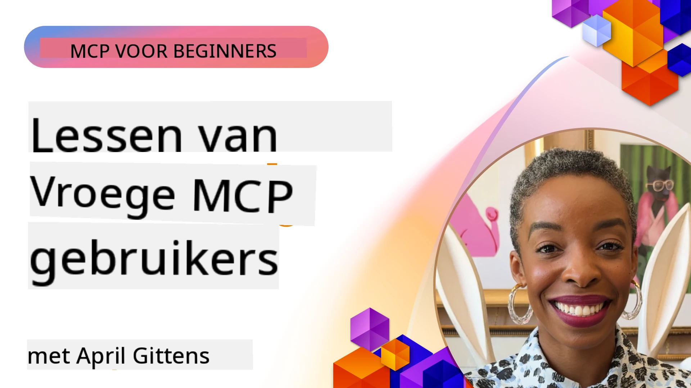

# 🌟 Lessen van Vroege Gebruikers

[](https://youtu.be/jds7dSmNptE)

_(Klik op de afbeelding hierboven om de video van deze les te bekijken)_

## 🎯 Wat Dit Module Behandelt

Deze module verkent hoe echte organisaties en ontwikkelaars het Model Context Protocol (MCP) gebruiken om daadwerkelijke uitdagingen op te lossen en innovatie te stimuleren. Door middel van gedetailleerde casestudies, praktische projecten en voorbeelden ontdek je hoe MCP veilige, schaalbare AI-integratie mogelijk maakt die taalmodellen, tools en bedrijfsdata met elkaar verbindt.

### 📚 Zie MCP in Actie

Wil je zien hoe deze principes worden toegepast op productieklare tools? Bekijk onze [**10 Microsoft MCP Servers Die de Productiviteit van Ontwikkelaars Transformeren**](microsoft-mcp-servers.md), die echte Microsoft MCP-servers laat zien die je vandaag kunt gebruiken.

## Overzicht

Deze les verkent hoe vroege gebruikers het Model Context Protocol (MCP) hebben ingezet om echte uitdagingen in de praktijk op te lossen en innovatie in verschillende sectoren te bevorderen. Door gedetailleerde casestudies en praktische projecten zie je hoe MCP gestandaardiseerde, veilige en schaalbare AI-integratie mogelijk maakt—door grote taalmodellen, tools en bedrijfsdata te verbinden in een uniform kader. Je doet praktische ervaring op met het ontwerpen en bouwen van op MCP gebaseerde oplossingen, leert van bewezen implementatiepatronen en ontdekt best practices voor het inzetten van MCP in productieomgevingen. De les benadrukt ook opkomende trends, toekomstige richtingen en open-source bronnen om je aan de voorhoede van MCP-technologie en het evoluerende ecosysteem te houden.

## Leerdoelen

- Analyseer implementaties van MCP in de praktijk in verschillende sectoren
- Ontwerp en bouw complete op MCP gebaseerde applicaties
- Verken opkomende trends en toekomstrichtingen in MCP-technologie
- Pas best practices toe in echte ontwikkelscenario’s

## Implementaties van MCP in de Praktijk

### Casestudy 1: Automatisering van Klantenservice in Bedrijven

Een multinational implementeerde een op MCP gebaseerde oplossing om AI-interacties binnen hun klantenservicesystemen te standaardiseren. Dit stelde hen in staat om:

- Een uniforme interface te creëren voor meerdere LLM-aanbieders
- Consistente promptbeheersing te behouden over afdelingen heen
- Robuuste beveiligings- en compliance-controles te implementeren
- Eenvoudig te schakelen tussen verschillende AI-modellen op basis van specifieke behoeften

**Technische Implementatie:**

```python
# Python MCP-serverimplementatie voor klantenondersteuning
import logging
import asyncio
from modelcontextprotocol import create_server, ServerConfig
from modelcontextprotocol.server import MCPServer
from modelcontextprotocol.transports import create_http_transport
from modelcontextprotocol.resources import ResourceDefinition
from modelcontextprotocol.prompts import PromptDefinition
from modelcontextprotocol.tool import ToolDefinition

# Logging configureren
logging.basicConfig(level=logging.INFO)

async def main():
    # Maak serverconfiguratie aan
    config = ServerConfig(
        name="Enterprise Customer Support Server",
        version="1.0.0",
        description="MCP server for handling customer support inquiries"
    )
    
    # Initialiseer MCP-server
    server = create_server(config)
    
    # Registreer kennisbasisbronnen
    server.resources.register(
        ResourceDefinition(
            name="customer_kb",
            description="Customer knowledge base documentation"
        ),
        lambda params: get_customer_documentation(params)
    )
    
    # Registreer prompt-sjablonen
    server.prompts.register(
        PromptDefinition(
            name="support_template",
            description="Templates for customer support responses"
        ),
        lambda params: get_support_templates(params)
    )
    
    # Registreer ondersteuningshulpmiddelen
    server.tools.register(
        ToolDefinition(
            name="ticketing",
            description="Create and update support tickets"
        ),
        handle_ticketing_operations
    )
    
    # Start server met HTTP-transport
    transport = create_http_transport(port=8080)
    await server.run(transport)

if __name__ == "__main__":
    asyncio.run(main())
```

**Resultaten:** 30% kostenreductie in modellen, 45% verbetering in responsconsistentie en verbeterde compliance in wereldwijde operaties.

### Casestudy 2: Diagnostische Assistent in de Gezondheidszorg

Een zorgaanbieder ontwikkelde een MCP-infrastructuur om meerdere gespecialiseerde medische AI-modellen te integreren, terwijl gevoelige patiëntgegevens beschermd bleven:

- Naadloos schakelen tussen generalistische en specialistische medische modellen
- Strikte privacycontroles en audit trails
- Integratie met bestaande Elektronische Patiëntenregistratiesystemen (EPR)
- Consistente prompt-engineering voor medische terminologie

**Technische Implementatie:**

```csharp
// C# MCP host application implementation in healthcare application
using Microsoft.Extensions.DependencyInjection;
using ModelContextProtocol.SDK.Client;
using ModelContextProtocol.SDK.Security;
using ModelContextProtocol.SDK.Resources;

public class DiagnosticAssistant
{
    private readonly MCPHostClient _mcpClient;
    private readonly PatientContext _patientContext;
    
    public DiagnosticAssistant(PatientContext patientContext)
    {
        _patientContext = patientContext;
        
        // Configure MCP client with healthcare-specific settings
        var clientOptions = new ClientOptions
        {
            Name = "Healthcare Diagnostic Assistant",
            Version = "1.0.0",
            Security = new SecurityOptions
            {
                Encryption = EncryptionLevel.Medical,
                AuditEnabled = true
            }
        };
        
        _mcpClient = new MCPHostClientBuilder()
            .WithOptions(clientOptions)
            .WithTransport(new HttpTransport("https://healthcare-mcp.example.org"))
            .WithAuthentication(new HIPAACompliantAuthProvider())
            .Build();
    }
    
    public async Task<DiagnosticSuggestion> GetDiagnosticAssistance(
        string symptoms, string patientHistory)
    {
        // Create request with appropriate resources and tool access
        var resourceRequest = new ResourceRequest
        {
            Name = "patient_records",
            Parameters = new Dictionary<string, object>
            {
                ["patientId"] = _patientContext.PatientId,
                ["requestingProvider"] = _patientContext.ProviderId
            }
        };
        
        // Request diagnostic assistance using appropriate prompt
        var response = await _mcpClient.SendPromptRequestAsync(
            promptName: "diagnostic_assistance",
            parameters: new Dictionary<string, object>
            {
                ["symptoms"] = symptoms,
                patientHistory = patientHistory,
                relevantGuidelines = _patientContext.GetRelevantGuidelines()
            });
            
        return DiagnosticSuggestion.FromMCPResponse(response);
    }
}
```

**Resultaten:** Verbeterde diagnostische suggesties voor artsen, terwijl volledige HIPAA-compliance behouden bleef en aanzienlijke vermindering van contextwisselingen tussen systemen.

### Casestudy 3: Risicoanalyse in Financiële Dienstverlening

Een financiële instelling paste MCP toe om hun risicoanalyseprocessen af te stemmen over verschillende afdelingen:

- Een uniforme interface gecreëerd voor kredietrisico, fraudedetectie en investeringsrisicomodellen
- Strikte toegangscontroles en versiebeheer van modellen geïmplementeerd
- Auditbaarheid van alle AI-aanbevelingen gegarandeerd
- Consistente dataformattering gehandhaafd over diverse systemen

**Technische Implementatie:**

```java
// Java MCP-server voor financiële risicoanalyse
import org.mcp.server.*;
import org.mcp.security.*;

public class FinancialRiskMCPServer {
    public static void main(String[] args) {
        // Maak MCP-server met functies voor financiële naleving
        MCPServer server = new MCPServerBuilder()
            .withModelProviders(
                new ModelProvider("risk-assessment-primary", new AzureOpenAIProvider()),
                new ModelProvider("risk-assessment-audit", new LocalLlamaProvider())
            )
            .withPromptTemplateDirectory("./compliance/templates")
            .withAccessControls(new SOCCompliantAccessControl())
            .withDataEncryption(EncryptionStandard.FINANCIAL_GRADE)
            .withVersionControl(true)
            .withAuditLogging(new DatabaseAuditLogger())
            .build();
            
        server.addRequestValidator(new FinancialDataValidator());
        server.addResponseFilter(new PII_RedactionFilter());
        
        server.start(9000);
        
        System.out.println("Financial Risk MCP Server running on port 9000");
    }
}
```

**Resultaten:** Verhoogde naleving van regelgeving, 40% snellere modeluitrol cycli en verbeterde consistentie in risico-inschattingen over afdelingen.

### Casestudy 4: Microsoft Playwright MCP Server voor Browserautomatisering

Microsoft ontwikkelde de [Playwright MCP server](https://github.com/microsoft/playwright-mcp) om veilige, gestandaardiseerde browserautomatisering mogelijk te maken via het Model Context Protocol. Deze productieklare server laat AI-agenten en LLM's op een gecontroleerde, auditeerbare en uitbreidbare manier met webbrowsers interacteren—wat gebruiksscenario’s zoals geautomatiseerd webtesten, data-extractie en end-to-end workflows mogelijk maakt.

> **🎯 Productieklaar Hulpmiddel**
> 
> Deze casestudy toont een echte MCP-server die je vandaag kunt gebruiken! Leer meer over de Playwright MCP Server en 9 andere productieklare Microsoft MCP-servers in onze [**Microsoft MCP Servers Gids**](microsoft-mcp-servers.md#8--playwright-mcp-server).

**Belangrijkste Kenmerken:**
- Browserautomatiseringsmogelijkheden (navigatie, formulier invullen, screenshot maken, enz.) als MCP-tools blootgesteld
- Strikte toegangscontroles en sandboxing geïmplementeerd om ongeautoriseerde acties te voorkomen
- Gedetailleerde auditlogs voor alle browserinteracties verstrekt
- Integratie met Azure OpenAI en andere LLM-aanbieders voor agentgedreven automatisering ondersteund
- Voedt GitHub Copilot's Coding Agent met webbrowse-mogelijkheden

**Technische Implementatie:**

```typescript
// TypeScript: Registreren van Playwright browserautomatiseringstools in een MCP-server
import { createServer, ToolDefinition } from 'modelcontextprotocol';
import { launch } from 'playwright';

const server = createServer({
  name: 'Playwright MCP Server',
  version: '1.0.0',
  description: 'MCP server for browser automation using Playwright'
});

// Registreer een tool voor het navigeren naar een URL en het vastleggen van een screenshot
server.tools.register(
  new ToolDefinition({
    name: 'navigate_and_screenshot',
    description: 'Navigate to a URL and capture a screenshot',
    parameters: {
      url: { type: 'string', description: 'The URL to visit' }
    }
  }),
  async ({ url }) => {
    const browser = await launch();
    const page = await browser.newPage();
    await page.goto(url);
    const screenshot = await page.screenshot();
    await browser.close();
    return { screenshot };
  }
);

// Start de MCP-server
server.listen(8080);
```

**Resultaten:**

- Maakte veilige, programmeerbare browserautomatisering mogelijk voor AI-agenten en LLMs
- Verminderde handmatige testinspanningen en verbeterde testdekking voor webapplicaties
- Bood een herbruikbaar, uitbreidbaar kader voor browsergebaseerde tool-integratie in bedrijfsomgevingen
- Voedt de webbrowse-mogelijkheden van GitHub Copilot

**Referenties:**

- [Playwright MCP Server GitHub Repository](https://github.com/microsoft/playwright-mcp)
- [Microsoft AI en Automatiseringsoplossingen](https://azure.microsoft.com/en-us/products/ai-services/)

### Casestudy 5: Azure MCP – Enterprise-Grade Model Context Protocol als Service

Azure MCP Server ([https://aka.ms/azmcp](https://aka.ms/azmcp)) is Microsoft’s beheerde, enterprise-grade implementatie van het Model Context Protocol, ontworpen om schaalbare, veilige en conforme MCP-serverfunctionaliteit als clouddienst te leveren. Azure MCP stelt organisaties in staat om MCP-servers snel te implementeren, beheren en integreren met Azure AI, data en beveiligingsdiensten, waardoor operationele overhead wordt verminderd en AI-adoptie wordt versneld.

> **🎯 Productieklaar Hulpmiddel**
> 
> Dit is een echte MCP-server die je vandaag kunt gebruiken! Leer meer over de Microsoft Foundry MCP Server in onze [**Microsoft MCP Servers Gids**](microsoft-mcp-servers.md).


- Volledig beheerde MCP-serverhosting met ingebouwde schaalbaarheid, monitoring en beveiliging
- Natuurlijke integratie met Azure OpenAI, Azure AI Search en andere Azure-diensten
- Enterprise-authenticatie en autorisatie via Microsoft Entra ID
- Ondersteuning voor aangepaste tools, promptsjablonen en resourceconnectors
- Naleving van enterprise beveiligings- en regelgevingsvereisten

**Technische Implementatie:**

```yaml
# Example: Azure MCP server deployment configuration (YAML)
apiVersion: mcp.microsoft.com/v1
kind: McpServer
metadata:
  name: enterprise-mcp-server
spec:
  modelProviders:
    - name: azure-openai
      type: AzureOpenAI
      endpoint: https://<your-openai-resource>.openai.azure.com/
      apiKeySecret: <your-azure-keyvault-secret>
  tools:
    - name: document_search
      type: AzureAISearch
      endpoint: https://<your-search-resource>.search.windows.net/
      apiKeySecret: <your-azure-keyvault-secret>
  authentication:
    type: EntraID
    tenantId: <your-tenant-id>
  monitoring:
    enabled: true
    logAnalyticsWorkspace: <your-log-analytics-id>
```

**Resultaten:**  
- Verminderde time-to-value voor enterprise AI-projecten door een kant-en-klaar, compliant MCP-serverplatform te bieden
- Vereenvoudigde integratie van LLMs, tools en bedrijfsdatasources
- Verbeterde beveiliging, observeerbaarheid en operationele efficiëntie voor MCP-workloads
- Verbeterde codekwaliteit met Azure SDK best practices en actuele authenticatiepatronen

**Referenties:**  
- [Azure MCP Documentatie](https://aka.ms/azmcp)
- [Azure MCP Server GitHub Repository](https://github.com/Azure/azure-mcp)
- [Azure AI Diensten](https://azure.microsoft.com/en-us/products/ai-services/)
- [Microsoft MCP Centrum](https://mcp.azure.com)

## Casestudy 6: NLWeb 
MCP (Model Context Protocol) is een opkomend protocol voor chatbots en AI-assistenten om te interacteren met tools. Elke NLWeb-instantie is ook een MCP-server, die één kernmethode ondersteunt, ask, die gebruikt wordt om een website een vraag te stellen in natuurlijke taal. Het teruggegeven antwoord maakt gebruik van schema.org, een veelgebruikt vocabulaire voor het beschrijven van webdata. Vrij vertaald is MCP voor NLWeb wat Http is voor HTML. NLWeb combineert protocollen, Schema.org-formats en voorbeeldcode om sites te helpen deze endpoints snel te creëren, wat zowel mensen via conversatie-interfaces als machines via natuurlijke agent-tot-agent interactie ten goede komt.

Er zijn twee afzonderlijke componenten in NLWeb.
- Een protocol, heel eenvoudig om mee te beginnen, om te interfacen met een site in natuurlijke taal en een format, gebruikmakend van json en schema.org voor het teruggegeven antwoord. Zie de documentatie over de REST API voor meer details.
- Een eenvoudige implementatie van (1) die gebruikmaakt van bestaande opmaak, voor sites die als lijsten van items (producten, recepten, attracties, recensies, enz.) kunnen worden geabstraheerd. Samen met een set van gebruikersinterface-widgets kunnen sites eenvoudig conversatie-interfaces voor hun inhoud bieden. Zie de documentatie over Life of a chat query voor meer details over hoe dit werkt.
 
**Referenties:**  
- [Azure MCP Documentatie](https://aka.ms/azmcp)
- [NLWeb](https://github.com/microsoft/NlWeb)

### Casestudy 7: Microsoft Foundry MCP Server – Enterprise AI Agent Integratie

Microsoft Foundry MCP-servers demonstreren hoe MCP kan worden gebruikt om AI-agenten en workflows in enterprise-omgevingen te orkestreren en beheren. Door MCP te integreren met Microsoft Foundry kunnen organisaties agentinteracties standaardiseren, gebruikmaken van Foundry’s workflowbeheer en zorgen voor veilige, schaalbare uitrol.

> **🎯 Productieklaar Hulpmiddel**
> 
> Dit is een echte MCP-server die je vandaag kunt gebruiken! Leer meer over de Microsoft Foundry MCP Server in onze [**Microsoft MCP Servers Gids**](microsoft-mcp-servers.md#9--microsoft-foundry-mcp-server).

**Belangrijkste Kenmerken:**
- Uitgebreide toegang tot het Azure AI-ecosysteem, inclusief modelcatalogi en beheer van uitrol
- Kennisindexering met Azure AI Search voor RAG-toepassingen
- Evaluatietools voor AI-modelprestaties en kwaliteitszorg
- Integratie met Microsoft Foundry Catalog en Labs voor baanbrekende onderzoeksmodellen
- Agentbeheer en evaluatiecapaciteiten voor productiescenario's

**Resultaten:**
- Snelle prototyping en robuuste monitoring van AI-agentworkflows
- Naadloze integratie met Azure AI-diensten voor geavanceerde scenario’s
- Uniforme interface voor het bouwen, uitrollen en monitoren van agentpipelines
- Verbeterde beveiliging, compliance en operationele efficiëntie voor enterprises
- Versnelde AI-adoptie terwijl de controle over complexe agentgestuurde processen behouden blijft

**Referenties:**
- [Microsoft Foundry MCP Server GitHub Repository](https://github.com/azure-ai-foundry/mcp-foundry)
- [Integratie van Azure AI Agents met MCP (Microsoft Foundry Blog)](https://devblogs.microsoft.com/foundry/integrating-azure-ai-agents-mcp/)

### Casestudy 8: Foundry MCP Playground – Experimenteren en Prototyping

De Foundry MCP Playground biedt een kant-en-klare omgeving om te experimenteren met MCP-servers en Microsoft Foundry-integraties. Ontwikkelaars kunnen snel AI-modellen en agentworkflows prototypen, testen en evalueren met bronnen uit de Microsoft Foundry Catalog en Labs. De playground vereenvoudigt de setup, biedt voorbeeldprojecten en ondersteunt samenwerking bij ontwikkeling, waardoor het makkelijk is om best practices en nieuwe scenario’s met minimale overhead te verkennen. Het is vooral nuttig voor teams die ideeën willen valideren, experimenten delen en leren versnellen zonder complexe infrastructuur. Door de instapdrempel te verlagen, bevordert de playground innovatie en communitybijdragen in het MCP- en Microsoft Foundry-ecosysteem.

**Referenties:**

- [Foundry MCP Playground GitHub Repository](https://github.com/azure-ai-foundry/foundry-mcp-playground)

### Casestudy 9: Microsoft Learn Docs MCP Server – Met AI Aangedreven Toegang tot Documentatie

De Microsoft Learn Docs MCP Server is een cloudgehoste dienst die AI-assistenten realtime toegang geeft tot officiële Microsoft-documentatie via het Model Context Protocol. Deze productieklare server is verbonden met het uitgebreide Microsoft Learn-ecosysteem en maakt semantische zoekopdrachten over alle officiële Microsoft-bronnen mogelijk.

> **🎯 Productieklaar Hulpmiddel**
> 
> Dit is een echte MCP-server die je vandaag kunt gebruiken! Leer meer over de Microsoft Learn Docs MCP Server in onze [**Microsoft MCP Servers Gids**](microsoft-mcp-servers.md#1--microsoft-learn-docs-mcp-server).

**Belangrijkste Kenmerken:**
- Realtime toegang tot officiële Microsoft-documentatie, Azure-docs en Microsoft 365-documentatie
- Geavanceerde semantische zoekmogelijkheden die context en intentie begrijpen
- Altijd up-to-date informatie omdat Microsoft Learn-inhoud gepubliceerd wordt
- Uitgebreide dekking van Microsoft Learn, Azure-documentatie en Microsoft 365-bronnen
- Biedt tot 10 hoogwaardige contentstukken met artikeltitels en URL's

**Waarom het Kritisch is:**
- Lost het probleem van "verouderde AI-kennis" voor Microsoft-technologieën op
- Zorgt dat AI-assistenten toegang hebben tot de nieuwste .NET, C#, Azure en Microsoft 365-functies
- Biedt gezaghebbende, eerstelijnsinformatie voor nauwkeurige codegeneratie
- Essentieel voor ontwikkelaars die werken met snel evoluerende Microsoft-technologieën

**Resultaten:**
- Dramatisch verbeterde nauwkeurigheid van AI-gegenereerde code voor Microsoft-technologieën
- Verminderde tijd besteed aan het zoeken naar actuele documentatie en best practices
- Verhoogde ontwikkelaarsproductiviteit door contextbewuste documentatietoegang
- Naadloze integratie met ontwikkelworkflows zonder de IDE te verlaten

**Referenties:**
- [Microsoft Learn Docs MCP Server GitHub Repository](https://github.com/MicrosoftDocs/mcp)
- [Microsoft Learn Documentatie](https://learn.microsoft.com/)

## Hands-on Projecten

### Project 1: Bouw een Multi-Provider MCP Server

**Doel:** Maak een MCP-server die verzoeken kan routeren naar meerdere AI-modelaanbieders op basis van specifieke criteria.

**Vereisten:**

- Ondersteun minimaal drie verschillende modelaanbieders (bijv. OpenAI, Anthropic, lokale modellen)
- Implementeer een routeringsmechanisme op basis van verzoekmetadata
- Maak een configuratiesysteem voor het beheren van providerreferenties
- Voeg caching toe om prestaties en kosten te optimaliseren
- Bouw een eenvoudig dashboard voor gebruiksmonitoring

**Stappen voor Implementatie:**

1. Richt de basisinfrastructuur van de MCP-server in
2. Implementeer provider-adapters voor elke AI-modelservice
3. Creëer de routeringslogica op basis van verzoekattributen
4. Voeg cachingmechanismen toe voor frequente verzoeken
5. Ontwikkel het monitoringdashboard
6. Test met diverse verzoekpatronen

**Technologieën:** Kies uit Python (.NET/Java/Python op basis van je voorkeur), Redis voor caching en een eenvoudig webframework voor het dashboard.

### Project 2: Enterprise Prompt Management System

**Doel:** Ontwikkel een op MCP gebaseerd systeem voor het beheren, versies bijhouden en uitrollen van promptsjablonen binnen een organisatie.

**Vereisten:**


- Maak een gecentraliseerde opslagplaats voor prompttemplates
- Implementeer versiebeheer en goedkeuringsworkflows
- Bouw testmogelijkheden voor templates met voorbeeldinvoer
- Ontwikkel toegangscontroles op basis van rollen
- Maak een API voor het ophalen en inzetten van templates

**Implementatiestappen:**

1. Ontwerp het databaseschema voor templateopslag
2. Maak de kern-API voor CRUD-bewerkingen van templates
3. Implementeer het versiebeheersysteem
4. Bouw de goedkeuringsworkflow
5. Ontwikkel het testframework
6. Maak een eenvoudige webinterface voor beheer
7. Integreer met een MCP-server

**Technologieën:** Jouw keuze van backendframework, SQL- of NoSQL-database, en een frontendframework voor de beheerinterface.

### Project 3: MCP-gebaseerd contentgeneratieplatform

**Doel:** Bouw een contentgeneratieplatform dat MCP benut om consistente resultaten te bieden voor verschillende contenttypes.

**Vereisten:**

- Ondersteuning voor meerdere contentformaten (blogposts, sociale media, marketingteksten)
- Implementeer template-gebaseerde generatie met aanpassingsopties
- Maak een contentreview- en feedbacksysteem
- Volg prestatie-indicatoren voor content
- Ondersteun contentversiebeheer en iteratie

**Implementatiestappen:**

1. Zet de MCP-clientinfrastructuur op
2. Maak templates voor verschillende contenttypen
3. Bouw de contentgeneratiepijplijn
4. Implementeer het reviewsysteem
5. Ontwikkel het systeem voor het volgen van prestatiegegevens
6. Maak een gebruikersinterface voor templatebeheer en contentgeneratie

**Technologieën:** Jouw favoriete programmeertaal, webframework en databasesysteem.

## Toekomstige Richtingen voor MCP-technologie

### Opkomende Trends

1. **Multimodale MCP**
   - Uitbreiding van MCP om interacties met beeld-, audio- en videomodellen te standaardiseren
   - Ontwikkeling van cross-modale redeneervermogen
   - Gestandaardiseerde promptformaten voor verschillende modaliteiten

2. **Gefedereerde MCP-infrastructuur**
   - Gedistribueerde MCP-netwerken die middelen kunnen delen tussen organisaties
   - Gestandaardiseerde protocollen voor veilig model-delen
   - Privacybeschermende berekeningstechnieken

3. **MCP-marktplaatsen**
   - Ecosystemen voor het delen en gelde maken van MCP-templates en -plug-ins
   - Kwaliteitsborging en certificeringsprocessen
   - Integratie met modelmarktplaatsen

4. **MCP voor edge computing**
   - Aanpassing van MCP-standaarden voor resource-beperkte edge-apparaten
   - Geoptimaliseerde protocollen voor omgevingen met lage bandbreedte
   - Gespecialiseerde MCP-implementaties voor IoT-ecosystemen

5. **Regelgevende Kaders**
   - Ontwikkeling van MCP-uitbreidingen voor naleving van regelgeving
   - Gestandaardiseerde audittrajecten en uitlegbaarheidsinterfaces
   - Integratie met opkomende AI-governancekaders

### MCP-oplossingen van Microsoft

Microsoft en Azure hebben verschillende open-source repositories ontwikkeld om ontwikkelaars te helpen MCP in diverse scenario’s te implementeren:

#### Microsoft Organization

1. [playwright-mcp](https://github.com/microsoft/playwright-mcp) - Een Playwright MCP-server voor browserautomatisering en testing
2. [files-mcp-server](https://github.com/microsoft/files-mcp-server) - Een OneDrive MCP-serverimplementatie voor lokale testing en communitybijdragen
3. [NLWeb](https://github.com/microsoft/NlWeb) - NLWeb is een verzameling van open protocollen en bijbehorende open source tools. De focus ligt op het creëren van een fundamentele laag voor het AI-web

#### Azure-Samples Organization

1. [mcp](https://github.com/Azure-Samples/mcp) - Links naar voorbeelden, tools en bronnen voor het bouwen en integreren van MCP-servers op Azure met meerdere talen
2. [mcp-auth-servers](https://github.com/Azure-Samples/mcp-auth-servers) - Referentie-MCP-servers die authenticatie demonstreren met de huidige Model Context Protocol-specificatie
3. [remote-mcp-functions](https://github.com/Azure-Samples/remote-mcp-functions) - Landingpage voor Remote MCP Server-implementaties in Azure Functions met linken naar taal-specifieke repositories
4. [remote-mcp-functions-python](https://github.com/Azure-Samples/remote-mcp-functions-python) - Quickstart-sjabloon voor het bouwen en uitrollen van aangepaste remote MCP-servers met Azure Functions en Python
5. [remote-mcp-functions-dotnet](https://github.com/Azure-Samples/remote-mcp-functions-dotnet) - Quickstart-sjabloon voor het bouwen en uitrollen van aangepaste remote MCP-servers met Azure Functions en .NET/C#
6. [remote-mcp-functions-typescript](https://github.com/Azure-Samples/remote-mcp-functions-typescript) - Quickstart-sjabloon voor het bouwen en uitrollen van aangepaste remote MCP-servers met Azure Functions en TypeScript
7. [remote-mcp-apim-functions-python](https://github.com/Azure-Samples/remote-mcp-apim-functions-python) - Azure API Management als AI-gateway naar Remote MCP-servers met Python
8. [AI-Gateway](https://github.com/Azure-Samples/AI-Gateway) - APIM ❤️ AI-experimenten inclusief MCP-mogelijkheden, integratie met Azure OpenAI en AI Foundry

Deze repositories bieden diverse implementaties, templates en bronnen om te werken met het Model Context Protocol in verschillende programmeertalen en Azure-diensten. Ze omvatten een scala aan gebruiksscenario’s, van basis serverimplementaties tot authenticatie, clouddeployments en enterprise-integratiescenario’s.

#### MCP Resources Directory

De [MCP Resources directory](https://github.com/microsoft/mcp/tree/main/Resources) in de officiële Microsoft MCP-repository biedt een zorgvuldig samengestelde verzameling van voorbeeldbronnen, prompttemplates en tooldefinities voor gebruik met Model Context Protocol-servers. Deze directory is ontworpen om ontwikkelaars snel aan de slag te helpen met MCP door herbruikbare bouwstenen en best-practicevoorbeelden te bieden voor:

- **Prompt Templates:** Direct bruikbare prompttemplates voor gangbare AI-taken en scenario’s, die kunnen worden aangepast voor eigen MCP-serverimplementaties.
- **Tool Definitions:** Voorbeeldtoolschemas en metadata om toolintegratie en -aanroep te standaardiseren over verschillende MCP-servers heen.
- **Resource Samples:** Voorbeeldbronnendefinities voor het verbinden met databronnen, API’s en externe diensten binnen het MCP-framework.
- **Reference Implementations:** Praktische voorbeelden die laten zien hoe je bronnen, prompts en tools structureert en organiseert in echte MCP-projecten.

Deze bronnen versnellen de ontwikkeling, bevorderen standaardisering en helpen best practices te waarborgen bij het bouwen en uitrollen van op MCP gebaseerde oplossingen.

#### MCP Resources Directory

- [MCP Resources (Voorbeeldprompts, Tools en Bronnendefinities)](https://github.com/microsoft/mcp/tree/main/Resources)

### Onderzoeksmogelijkheden

- Efficiënte optimalisatietechnieken voor prompts binnen MCP-frameworks
- Beveiligingsmodellen voor multi-tenant MCP-implementaties
- Prestatiemeting over verschillende MCP-implementaties heen
- Formele verificatiemethoden voor MCP-servers

## Conclusie

Het Model Context Protocol (MCP) vormt snel de toekomst van gestandaardiseerde, veilige en interoperabele AI-integratie in uiteenlopende sectoren. Door de casestudies en praktische projecten in deze les heb je gezien hoe vroege gebruikers—including Microsoft en Azure—MCP inzetten om echte uitdagingen op te lossen, de AI-adoptie te versnellen en naleving, veiligheid en schaalbaarheid te waarborgen. De modulaire aanpak van MCP stelt organisaties in staat grote taalmodellen, tools en bedrijfsdata te verbinden in een uniform en controleerbaar kader. Naarmate MCP zich blijft ontwikkelen, zal betrokken blijven bij de community, het verkennen van open-source-resources en het toepassen van best practices cruciaal zijn voor het bouwen van robuuste, toekomstbestendige AI-oplossingen.

## Aanvullende Bronnen

- [MCP Foundry GitHub-repository](https://github.com/azure-ai-foundry/mcp-foundry)
- [Foundry MCP Playground](https://github.com/azure-ai-foundry/foundry-mcp-playground)
- [Integratie van Azure AI-agents met MCP (Microsoft Foundry Blog)](https://devblogs.microsoft.com/foundry/integrating-azure-ai-agents-mcp/)
- [MCP GitHub-repository (Microsoft)](https://github.com/microsoft/mcp)
- [MCP Resources Directory (voorbeeldprompts, tools en bronndefinities)](https://github.com/microsoft/mcp/tree/main/Resources)
- [MCP-community & documentatie](https://modelcontextprotocol.io/introduction)
- [MCP-specificatie (2026-07-28)](https://modelcontextprotocol.io/specification/2026-07-28/)
- [Azure MCP-documentatie](https://aka.ms/azmcp)
- [OWASP MCP Top 10](https://microsoft.github.io/mcp-azure-security-guide/mcp/) - Beveiligingsbest practices
- [Playwright MCP Server GitHub-repository](https://github.com/microsoft/playwright-mcp)
- [Files MCP Server (OneDrive)](https://github.com/microsoft/files-mcp-server)
- [Azure-Samples MCP](https://github.com/Azure-Samples/mcp)
- [MCP Auth Servers (Azure-Samples)](https://github.com/Azure-Samples/mcp-auth-servers)
- [Remote MCP Functions (Azure-Samples)](https://github.com/Azure-Samples/remote-mcp-functions)
- [Remote MCP Functions Python (Azure-Samples)](https://github.com/Azure-Samples/remote-mcp-functions-python)
- [Remote MCP Functions .NET (Azure-Samples)](https://github.com/Azure-Samples/remote-mcp-functions-dotnet)
- [Remote MCP Functions TypeScript (Azure-Samples)](https://github.com/Azure-Samples/remote-mcp-functions-typescript)
- [Remote MCP APIM Functions Python (Azure-Samples)](https://github.com/Azure-Samples/remote-mcp-apim-functions-python)
- [AI-Gateway (Azure-Samples)](https://github.com/Azure-Samples/AI-Gateway)
- [Microsoft AI- en automatiseringsoplossingen](https://azure.microsoft.com/en-us/products/ai-services/)

## Oefeningen

1. Analyseer een van de casestudies en stel een alternatieve implementatieaanpak voor.
2. Kies een van de projectideeën en maak een gedetailleerde technische specificatie.
3. Onderzoek een industrie die niet in de casestudies is behandeld en beschrijf hoe MCP de specifieke uitdagingen ervan zou kunnen aanpakken.
4. Verken een van de toekomstige richtingen en ontwikkel een concept voor een nieuwe MCP-uitbreiding ter ondersteuning hiervan.

## Wat Nu?

Verken meer: [Microsoft MCP Servers](./microsoft-mcp-servers.md)

Ga verder naar: [Module 8: Best Practices](../08-BestPractices/README.md)

---

<!-- CO-OP TRANSLATOR DISCLAIMER START -->
**Disclaimer**:
Dit document is vertaald met behulp van de AI vertaaldienst [Co-op Translator](https://github.com/Azure/co-op-translator). Hoewel we streven naar nauwkeurigheid, dient u er rekening mee te houden dat geautomatiseerde vertalingen fouten of onnauwkeurigheden kunnen bevatten. Het originele document in de oorspronkelijke taal moet worden beschouwd als de gezaghebbende bron. Voor kritieke informatie wordt professionele menselijke vertaling aanbevolen. Wij zijn niet aansprakelijk voor eventuele misverstanden of verkeerde interpretaties die voortvloeien uit het gebruik van deze vertaling.
<!-- CO-OP TRANSLATOR DISCLAIMER END -->