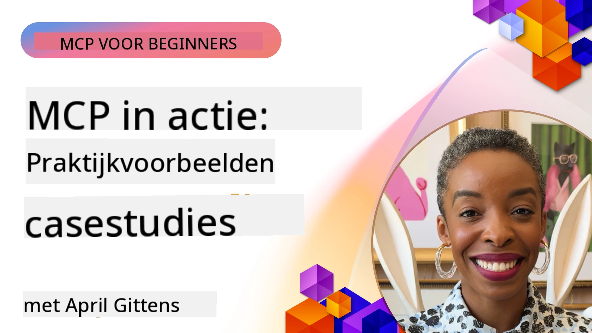

# MCP in Actie: Praktijkvoorbeelden

_(Klik op de bovenstaande afbeelding om de video van deze les te bekijken)_

Het Model Context Protocol (MCP) verandert de manier waarop AI-toepassingen omgaan met gegevens, tools en services. Deze sectie presenteert praktijkvoorbeelden die het gebruik van MCP in verschillende bedrijfsomgevingen laten zien.

## Overzicht

Deze sectie toont concrete voorbeelden van MCP-implementaties, met nadruk op hoe organisaties dit protocol gebruiken om complexe zakelijke uitdagingen op te lossen. Door het bestuderen van deze praktijkvoorbeelden krijg je inzicht in de veelzijdigheid, schaalbaarheid en praktische voordelen van MCP in de echte wereld.

## Belangrijkste Leerdoelen

Door deze praktijkvoorbeelden te verkennen, zul je:

- Begrijpen hoe MCP kan worden toegepast om specifieke zakelijke problemen op te lossen
- Leren over verschillende integratiepatronen en architecturale benaderingen
- Best practices herkennen voor het implementeren van MCP in bedrijfsomgevingen
- Inzicht krijgen in de uitdagingen en oplossingen uit de praktijk
- Kansen identificeren om vergelijkbare patronen in je eigen projecten toe te passen

## Uitgelichte Praktijkvoorbeelden

### 1. [Azure AI Reisbureaus – Referentie-implementatie](./travelagentsample.md)

Deze casestudy onderzoekt Microsoft's uitgebreide referentie-oplossing die laat zien hoe een multi-agent, AI-gestuurde reisplanningsapplicatie kan worden gebouwd met MCP, Azure OpenAI en Azure AI Search. Het project toont:

- Multi-agent orkestratie via MCP
- Integratie van bedrijfsgegevens met Azure AI Search
- Veilige, schaalbare architectuur met Azure-diensten
- Uitbreidbare tooling met herbruikbare MCP-componenten
- Conversationele gebruikerservaring aangedreven door Azure OpenAI

De architectuur en implementatiedetails bieden waardevolle inzichten in het bouwen van complexe multi-agent systemen met MCP als coördinatielaag.

### 2. [Azure DevOps Items bijwerken met YouTube-gegevens](./UpdateADOItemsFromYT.md)

Deze casestudy toont een praktische toepassing van MCP voor het automatiseren van workflowprocessen. Het laat zien hoe MCP-tools kunnen worden gebruikt om:

- Gegevens te extraheren van online platforms (YouTube)
- Werkitems bij te werken in Azure DevOps-systemen
- Herhaalbare automatiseringsworkflows te creëren
- Gegevens te integreren tussen verschillende systemen

Dit voorbeeld illustreert hoe zelfs relatief eenvoudige MCP-implementaties aanzienlijke efficiëntiewinst kunnen opleveren door routinetaken te automatiseren en de gegevensconsistentie over systemen te verbeteren.

### 3. [Realtime Documentatie Ophalen met MCP](./docs-mcp/README.md)

Deze casestudy begeleidt je bij het verbinden van een Python-consoleclient met een Model Context Protocol (MCP) server om realtime, contextbewuste Microsoft-documentatie op te halen en te loggen. Je leert hoe je:

- Verbindt met een MCP-server met een Python-client en de officiële MCP SDK
- Streaming HTTP-clients gebruikt voor efficiënte, realtime data-ophaling
- Documentatietools op de server aanroept en reacties direct naar de console logt
- Up-to-date Microsoft-documentatie integreert in je workflow zonder de terminal te verlaten

Het hoofdstuk bevat een hands-on opdracht, een minimaal werkende codevoorbeeld en links naar aanvullende bronnen voor verdieping. Zie de volledige walkthrough en code in het gekoppelde hoofdstuk om te begrijpen hoe MCP documentatietoegang en ontwikkelaarproductiviteit in console-omgevingen kan transformeren.

### 4. [Interactieve Studieplangenerator Webapp met MCP](./docs-mcp/README.md)

Deze casestudy toont hoe je een interactieve webapplicatie bouwt met Chainlit en het Model Context Protocol (MCP) om gepersonaliseerde studieplannen te genereren voor elk onderwerp. Gebruikers kunnen een onderwerp specificeren (zoals "AI-900 certificering") en een studietermijn (bijv. 8 weken), waarna de app een week-tot-week overzicht geeft van aanbevolen inhoud. Chainlit maakt een conversationele chatinterface mogelijk, wat de ervaring boeiend en adaptief maakt.

- Conversationele webapp aangedreven door Chainlit
- Gebruikersgestuurde prompts voor onderwerp en duur
- Week-tot-week inhoudsaanbevelingen met MCP
- Realtime, adaptieve reacties in een chatinterface

Het project laat zien hoe conversationele AI en MCP gecombineerd kunnen worden tot dynamische, gebruikersgestuurde educatieve tools in een moderne webomgeving.

### 5. [In-Editor Documentatie met MCP Server in VS Code](./docs-mcp/README.md)

Deze casestudy laat zien hoe je Microsoft Learn Docs rechtstreeks in je VS Code-omgeving brengt met de MCP-server—geen tabbladen wisselen meer! Je ziet hoe je:

- Documentatie onmiddellijk doorzoekt en leest binnen VS Code via het MCP-paneel of de command palette
- Referentiedocumentatie aanroept en links direct in je README of cursus-markdownbestanden invoegt
- GitHub Copilot en MCP samen gebruikt voor naadloze, AI-gestuurde documentatie- en codeworkflows
- Je documentatie valideert en verbetert met realtime feedback en Microsoft-gesourcede nauwkeurigheid
- MCP integreert met GitHub-workflows voor continue documentatievalidatie

De implementatie omvat:

- Voorbeeld `.vscode/mcp.json` configuratie voor eenvoudige setup
- Screenshot-ondersteunde walkthroughs van de in-editor ervaring
- Tips voor het combineren van Copilot en MCP voor maximale productiviteit

Dit scenario is ideaal voor cursusmakers, documentatieschrijvers en ontwikkelaars die gefocust willen blijven in hun editor terwijl ze werken met docs, Copilot, en validatietools—alles aangedreven door MCP.

### 6. [APIM MCP Server Creatie](./apimsample.md)

Deze casestudy biedt een stapsgewijze handleiding voor het creëren van een MCP-server met Azure API Management (APIM). Het behandelt:

- Het opzetten van een MCP-server in Azure API Management
- API-operaties blootstellen als MCP-tools
- Configureren van policies voor rate limiting en beveiliging
- MCP-server testen met Visual Studio Code en GitHub Copilot

Dit voorbeeld illustreert hoe je Azure's mogelijkheden benut om een robuuste MCP-server te maken die in verschillende toepassingen kan worden gebruikt, wat de integratie van AI-systemen met bedrijfs-API's versterkt.

### 7. [GitHub MCP Registry — Versnellen van Agentische Integratie](https://github.com/mcp)

Deze casestudy onderzoekt hoe GitHub's MCP Registry, gelanceerd in september 2025, een kritisch probleem in het AI-ecosysteem aanpakt: de gefragmenteerde ontdekking en inzet van Model Context Protocol (MCP) servers.

#### Overzicht
De **MCP Registry** lost het groeiende probleem van verspreide MCP-servers over repositories en registers op, wat integratie eerder traag en foutgevoelig maakte. Deze servers stellen AI-agenten in staat om te communiceren met externe systemen zoals API's, databases en documentatiebronnen.

#### Probleemstelling
Ontwikkelaars die agentische workflows bouwen, ondervonden meerdere uitdagingen:
- **Slechte vindbaarheid** van MCP-servers op verschillende platforms
- **Redundante setupvragen** verspreid over forums en documentatie
- **Beveiligingsrisico's** door onverifieerde en niet-vertrouwde bronnen
- **Gebrek aan standaardisatie** in serverkwaliteit en compatibiliteit

#### Oplossingsarchitectuur
GitHub's MCP Registry centraliseert vertrouwde MCP-servers met belangrijke kenmerken:
- **One-click install**-integratie via VS Code voor eenvoudige setup
- **Signal-over-noise sortering** op basis van sterren, activiteit en community-validatie
- **Directe integratie** met GitHub Copilot en andere MCP-compatibele tools
- **Open bijdrage-model** waarmee zowel community als enterprise partners kunnen bijdragen

#### Zakelijke Impact
Het register heeft meetbare verbeteringen opgeleverd:
- **Snellere onboarding** voor ontwikkelaars met tools zoals de Microsoft Learn MCP-server, die officiële documentatie rechtstreeks naar agenten streamt
- **Verbeterde productiviteit** via gespecialiseerde servers zoals `github-mcp-server`, die natuurlijke taal GitHub-automatisering (PR-creatie, CI-herhalingen, code scanning) mogelijk maken
- **Sterker ecosysteemvertrouwen** dankzij gecureerde lijsten en transparante configuratiestandaarden

#### Strategische Waarde
Voor specialisten in agent lifecycle management en reproduceerbare workflows biedt de MCP Registry:
- **Modulaire agent deployment** met gestandaardiseerde componenten
- **Registry-ondersteunde evaluatiepijplijnen** voor consistente testing en validatie
- **Cross-tool interoperabiliteit** voor naadloze integratie over verschillende AI-platforms

Deze casestudy bewijst dat de MCP Registry meer is dan een directory—het is een fundamenteel platform voor schaalbare, real-world modelintegratie en agentische systeemuitrol.

### 8. [Publiceren naar Sociale Netwerken vanuit een Agent](./publora-social-publishing.md)

Deze casestudy neemt je mee door een **write-capable remote MCP-server** — één waarvan de tools onomkeerbare acties namens een gebruiker uitvoeren — met sociale publicatie als voorbeeld. Een agent stelt een bericht op, een mens keurt het goed, en de server plant het in op de netwerken.

Het interessante zijn de ontwerpbeperkingen die publicatie oplegt, die van toepassing zijn op elke server die schrijft in plaats van leest:

- **Open ontdekking, geauthenticeerde uitvoering** — `tools/list` wordt zonder credentials beantwoord zodat registers en clients kunnen introspecteren, terwijl elke `tools/call` een token vereist en anders `401` met een `WWW-Authenticate` header retourneert
- **OAuth-registratie zonder out-of-band stap** — dynamische clientregistratie vandaag, met Client ID Metadata Documenten als richting waar de `2026-07-28` specificatie naar wijst
- **Toolannotaties** (`readOnlyHint`, `destructiveHint`, `idempotentHint`) die clients gebruiken om te beslissen wat bevestigd moet worden — hints in plaats van afdwingen, en iets wat connector directories inmiddels verwachten bij review
- **Onverzinbare identifiers**, zodat een gehallucineerde waarde luidruchtig faalt in plaats van op een plausibel uitziende te handelen
- **Idempotentiesleutels op de post-creator tools**, zodat een herhaling van een agent runtime geen duplicaat publicatie wordt
- **Een no-op target beschreven in het toolschema** die de volledige schrijfroute oefent en niets publiceert, voor reviewers en CI

Het hoofdstuk sluit af met een korte checklist die je kunt toepassen op een server die je bouwt.

## Conclusie

Deze acht uitgebreide praktijkvoorbeelden tonen de opmerkelijke veelzijdigheid en praktische toepassingen van het Model Context Protocol in diverse echte situaties. Van complexe multi-agent reisplanningssystemen en bedrijfs-API-beheer tot gestroomlijnde documentatieworkflows en het revolutionaire GitHub MCP Registry, laten deze voorbeelden zien hoe MCP een gestandaardiseerde, schaalbare manier biedt om AI-systemen te verbinden met de tools, data en services die ze nodig hebben om uitzonderlijke waarde te leveren.

De praktijkvoorbeelden beslaan meerdere dimensies van MCP-implementatie:
- **Enterprise Integratie**: Azure API Management en Azure DevOps-automatisering
- **Multi-Agent Orkestratie**: Reisplanning met gecoördineerde AI-agenten
- **Ontwikkelaarproductiviteit**: VS Code-integratie en realtime documentatietoegang
- **Ecosysteemontwikkeling**: GitHub's MCP Registry als fundamenteel platform
- **Educatieve Toepassingen**: Interactieve studieplan generators en conversationele interfaces

Door deze implementaties te bestuderen, krijg je essentiële inzichten in:
- **Architectuurpatronen** voor verschillende schaalgroottes en gebruikssituaties
- **Implementatiestrategieën** die functionaliteit balanceren met onderhoudbaarheid
- **Beveiligings- en schaalbaarheidsaspecten** voor productie-omgevingen
- **Best practices** voor MCP-servers ontwikkeling en clientintegratie
- **Ecosysteemdenken** voor het bouwen van onderling verbonden AI-gedreven oplossingen

Deze voorbeelden samen tonen aan dat MCP niet slechts een theoretisch kader is, maar een volwassen, productieklare protocol die praktische oplossingen voor complexe zakelijke uitdagingen mogelijk maakt. Of je nu eenvoudige automatiseringstools of geavanceerde multi-agent systemen bouwt, de patronen en benaderingen die hier worden geïllustreerd vormen een solide basis voor je eigen MCP-projecten.

## Aanvullende Bronnen

- [Azure AI Reisbureaus GitHub Repository](https://github.com/Azure-Samples/azure-ai-travel-agents)
- [Azure DevOps MCP Tool](https://github.com/microsoft/azure-devops-mcp)
- [Playwright MCP Tool](https://github.com/microsoft/playwright-mcp)
- [Microsoft Docs MCP Server](https://github.com/MicrosoftDocs/mcp)
- [GitHub MCP Registry — Versnellen van Agentische Integratie](https://github.com/mcp)
- [MCP Community Examples](https://github.com/microsoft/mcp)

## Wat Nu?

- Vorige: [Module 8: Best Practices](../08-BestPractices/README.md)
- Volgende: [Module 10: Stroomlijnen van AI-workflows: Bouw een MCP-server met AI Toolkit](../10-StreamliningAIWorkflowsBuildingAnMCPServerWithAIToolkit/README.md)

---

<!-- CO-OP TRANSLATOR DISCLAIMER START -->
**Disclaimer**:
Dit document is vertaald met behulp van de AI vertaaldienst [Co-op Translator](https://github.com/Azure/co-op-translator). Hoewel we streven naar nauwkeurigheid, dient u er rekening mee te houden dat geautomatiseerde vertalingen fouten of onnauwkeurigheden kunnen bevatten. Het originele document in de oorspronkelijke taal moet worden beschouwd als de gezaghebbende bron. Voor kritieke informatie wordt professionele menselijke vertaling aanbevolen. Wij zijn niet aansprakelijk voor eventuele misverstanden of verkeerde interpretaties die voortvloeien uit het gebruik van deze vertaling.
<!-- CO-OP TRANSLATOR DISCLAIMER END -->