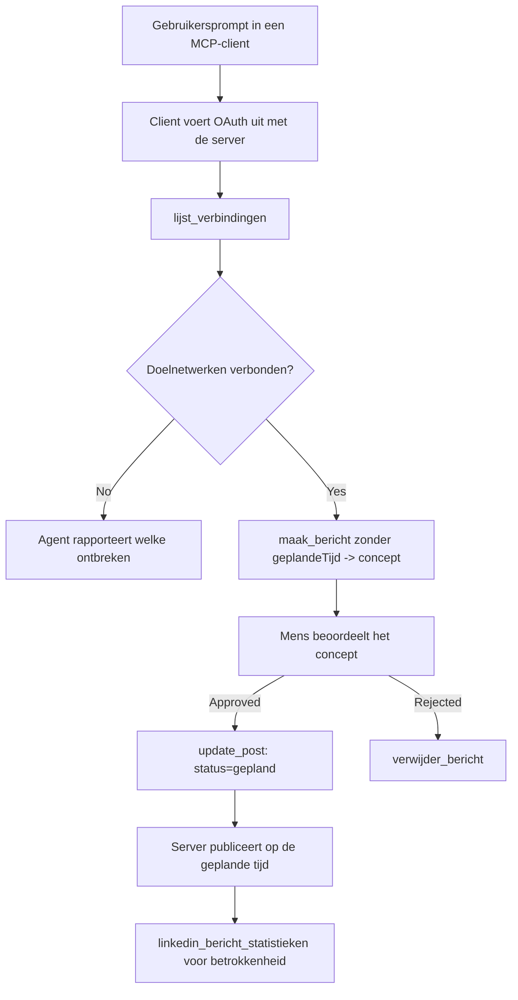

# Casestudy: Publiceren op sociale netwerken vanuit een agent met een externe MCP-server

> **Disclaimer:** Verschillende diensten en open-source projecten kunnen publiceren op sociale netwerken, en een team zou ook elke netwerk-API direct kunnen integreren. Hieronder wordt één uitgewerkt voorbeeld gegeven van hoe een **write-capable remote MCP-server** kan worden ontworpen en gebruikt. Publora is een commerciële dienst met een gratis tier; de hier beschreven patronen zijn van toepassing op elke MCP-server die onomkeerbare acties namens een gebruiker uitvoert.

## Overzicht

Agents zijn goed in het opstellen van content maar slecht in het daadwerkelijk publiceren ervan. Een model kan in seconden een persbericht schrijven, en daarna stopt het werk: publiceren betekent een API per netwerk, een OAuth-app per netwerk, en een andere set mediavoorschriften voor elk. De meeste teams lossen dit op door de tekst handmatig in een browser te kopiëren.

Deze casestudy bekijkt hoe deze laatste stap gesloten wordt met een enkele externe MCP-server, en — nuttiger voor iedereen die er een bouwt — de ontwerpbeslissingen die een **write-capable** server goed moet maken. Gegevens lezen is vergevingsgezind. Publiceren niet: een foute tool-aanroep is zichtbaar voor een publiek en kan niet ongedaan worden gemaakt.

## Scenario

Een klein developer-relations team stelt berichten op in een agent (Claude, VS Code, Cursor — de client maakt niet uit). Ze willen dat de agent:

- kan zien welke sociale accounts het team heeft gekoppeld,
- een bericht kan opstellen en bewaren als concept voor menselijke goedkeuring,
- een afbeelding kan toevoegen,
- het kan inplannen op verschillende netwerken op een gekozen tijdstip,
- en later rapporteren over de prestaties ervan.

Cruciaal is dat ze willen dat de agent *niet* per ongeluk kan publiceren terwijl ze nog aan het experimenteren zijn.

## Gebruikte tools

- [Publora MCP Server](https://github.com/publora/mcp-server) — een externe MCP-server (`streamable-http`) die publicatie-, planning-, media- en LinkedIn-analysetools aanbiedt. Geregistreerd in het officiële MCP-register als `com.publora/mcp-server`.

## Stapsgewijze workflow

1. **Verbind de server.** Clients die OAuth spreken voltooien de authorization-code flow met PKCE tegen het eigen toestemmingsscherm van de server; clients die dat niet doen, zoals headless CLI's, gebruiken een Publora API-sleutel in een header. Beide routes worden ondersteund, en welke je krijgt hangt af van de client, niet van de server.
2. **Lijst verbindingen.** De agent roept `list_connections` aan en ontvangt de gekoppelde accounts met hun identificatoren.
3. **Concept.** De agent roept `create_post` aan *zonder* geplande tijd. Het bericht wordt als concept opgeslagen — er wordt niets gepubliceerd.
4. **Voeg media toe.** Publieke afbeeldings-URL's worden in dezelfde aanroep meegegeven; de server downloadt en valideert ze.
5. **Plan in.** Na goedkeuring door een mens stelt `update_post` de status in op ingepland met een ISO 8601 tijd.
6. **Meet.** Voor LinkedIn geeft `linkedin_post_stats` de betrokkenheid terug zodra het bericht live is.

## Voorbeeld prompt

```text
Which social accounts do I have connected?
Draft a post announcing our new changelog page, attach the screenshot at
https://example.com/changelog.png, and keep it as a draft — do not publish it.
Once I approve, schedule it to LinkedIn and Bluesky for tomorrow at 09:00 UTC.
```

## Mermaid flowchart



## Technische implementatie

De lessen hieronder zijn het overdraagbare deel van deze casestudy.

### Open discovery, geauthenticeerde uitvoering

`tools/list` wordt zonder credentials aangeboden; elke `tools/call` vereist een token
en geeft anders `401` terug met een `WWW-Authenticate` header die wijst naar de
protected-resource metadata. De legacy endpoint van de server antwoordt ook op een
ongeauthenticeerde `initialize` voor clients op protocolversies vóór
`2026-07-28`; huidige clients gebruiken die handdruk niet.

Deze serverspecifieke splitsing laat registries, catalogi en clients toe om tool
namen, schema's en annotaties te inspecteren zonder een geheim terwijl anonieme
uitvoering wordt voorkomen. Open discovery is een keuze in deployment, geen MCP-vereiste; een
beschermde deployment kan ook autorisatie voor `tools/list` vereisen.

### Registratie: dynamische clientregistratie en wat het vervangt

De server adverteert `/.well-known/oauth-protected-resource` en `/.well-known/oauth-authorization-server`, en ondersteunt de authorization-code flow met PKCE (`S256`), refresh tokens en **dynamische clientregistratie**.

Dynamische registratie verwijderde de handmatige stap voor legacy clients: zonder deze
had elke client een vooraf uitgegeven `client_id` van de leverancier nodig.

Behandel dit als compatibiliteitsgedrag in plaats van als ontwerp om te kopiëren. De `2026-07-28` herziening van de specificatie deprecieert dynamische clientregistratie ten gunste van Client ID Metadata Documenten, waarbij de client een metadata-document host op een stabiele HTTPS-URL en die URL *de* `client_id` is. DCR werkt voorlopig door, maar een server die vandaag wordt gebouwd moet plannen voor CIMD en DCR alleen aanhouden voor oudere clients.

### Toolannotaties zijn geen versiering

Elke tool draagt een `title` en de toepasselijke hints: `readOnlyHint`, `destructiveHint`, `idempotentHint`, `openWorldHint`.

Twee redenen om erin te investeren. Ten eerste gebruiken clients de hints om te beslissen wat zij met de gebruiker bevestigen — een client kan een alleen-lezen opzoeking automatisch uitvoeren en stoppen voor goedkeuring vóór het verwijderen. De specificatie is expliciet dat annotaties onvertrouwde hints zijn, geen autorisatiemechanisme: ze bepalen wat een client aanbiedt te doen, ze stoppen niets op de server, en een server moet nog steeds zijn eigen regels afhandelen. Ten tweede vereisen de belangrijkste connectordirectories ze nu *voor review*; een server met tools zonder titels en hints zal worden teruggestuurd ongeacht hoe goed hij werkt.

### Maak identificatoren onuitvindbaar

Platform-identificatoren zijn ondoorzichtige strings teruggegeven door `list_connections`, en de schema-beschrijving zegt expliciet dat ze letterlijk gekopieerd moeten worden en nooit geraden. De server wijst anders af.

Modellen zijn gevorderde gokkers. Elke write-capable server moet aannemen dat een identificator ooit gehallucineerd wordt en dat pad luid en vroeg laten falen, in plaats van een plausibel-uitsendende waarde te accepteren.

### Faal vóór publiceren, met een acteerbaar bericht

Sommige netwerken weigeren tekst-alleen berichten en vereisen een afbeelding of video. Dat wordt gevalideerd wanneer het bericht wordt ingepland, en de fout noemt het platform en de ontbrekende vereiste.

Een agent kan herstellen van "Instagram vereist media — voeg een afbeelding of video toe" zonder een extra omweg. Hij kan niet herstellen van een generieke `400`.

### Maak herhalingen veilig

De twee tools die content maken, `create_post` en `update_post`, accepteren een idempotentiesleutel: hergebruik ervan met een identieke aanvraag herhaalt het oorspronkelijke antwoord in plaats van een tweede bericht aan te maken. Agent runtime-omgevingen proberen opnieuw bij time-outs; zonder idempotentie wordt een trage respons een dubbele publicatie. De andere write-tools — verwijderingen, media-stappen, LinkedIn-reacties en opmerkingen — nemen dit niet, dus een retry is daar niet automatisch veilig. Het is goed te weten welke eigen mutaties beschermd zijn en welke niet.

### Voorzie een manier om te testen zonder iets te publiceren

De server accepteert een gereserveerd doel, `publora-playground`, dat wordt gevalideerd en erkend als een echte bestemming en dan wordt weggegooid — niets bereikt een live account. Het wordt beschreven in het tool-schema zelf, dat elke client zonder credentials kan lezen: het `platforms` veld van `create_post` documenteert dit als "een connectietestdoel dat geen echte verbinding vereist — het bericht wordt erkend en weggegooid, er wordt niets gepubliceerd". Roep het aan door het als enige invoer mee te geven: `platforms: ["publora-playground"]`.

Dit bleek een van de meest nuttige details van het hele oppervlak. Beoordelaars van connector directories, bijdragers en CI kunnen het volledige schrijfpad end-to-end oefenen zonder risico op een echt publiek. Elke MCP-server met onomkeerbare acties profiteert van een gedocumenteerd no-op doel.

## Resultaten en impact

- De publicatiestap verplaatste van een browser naar hetzelfde gesprek waar de content wordt geschreven, en een draft-first gewoonte houdt een mens in de lus. Wees precies over wat dat is: een concept is een conventie, geen grens. Dezelfde credential kan plannen of publiceren, dus wie een echte goedkeuringspoort nodig heeft, moet die buiten het tooloppervlak afdwingen — aparte credentials, of een beleidslaag voor de server.
- Verschillen per netwerk — media-eisen, threading, reply-controles — worden één keer in de server afgehandeld in plaats van in elke agent die ermee praat.
- Dezelfde server ondersteunt meerdere MCP-clients zonder vooraf uitgegeven credentials.
    Huidige clients kunnen Client ID Metadata Documenten gebruiken; DCR blijft een fallback
    voor oudere clients.
- De hierboven genoemde ontwerpbeperkingen zijn gevormd door connector-directory reviews evenzeer als door gebruikers: annotaties, OAuth en een veilig testdoel werden elk door minstens één geëist.

## Referenties

- [Publora MCP Server (bron)](https://github.com/publora/mcp-server)
- [Publora API en MCP documentatie](https://docs.publora.com)
- [MCP Register entry: `com.publora/mcp-server`](https://registry.modelcontextprotocol.io/v0/servers?search=com.publora/mcp-server)
- [MCP-specificatie — Autorisatie](https://modelcontextprotocol.io/specification/2026-07-28/basic/authorization)
- [MCP-specificatie — Toolannotaties](https://modelcontextprotocol.io/docs/concepts/tools)

## Wat nu?

- Pak een MCP-server die je bouwt en check de drie goedkoopste winstpunten hier: annotaties op elke tool, een idempotentiesleutel voor elke write, en een gedocumenteerd no-op doel.
- Probeer de open-discovery splitsing: bel `tools/list` bij een publieke externe server zonder credentials, roep daarna een tool aan en inspecteer de `401` challenge.
- Overweeg wat "ongedaan maken" betekent voor je domein. Publiceren kent concepten en verwijderen; als je acties dat niet kennen, hoort bevestiging in het toolontwerp, niet in de prompt.

---

<!-- CO-OP TRANSLATOR DISCLAIMER START -->
**Disclaimer**:
Dit document is vertaald met behulp van de AI vertaaldienst [Co-op Translator](https://github.com/Azure/co-op-translator). Hoewel we streven naar nauwkeurigheid, dient u er rekening mee te houden dat geautomatiseerde vertalingen fouten of onnauwkeurigheden kunnen bevatten. Het originele document in de oorspronkelijke taal moet worden beschouwd als de gezaghebbende bron. Voor kritieke informatie wordt professionele menselijke vertaling aanbevolen. Wij zijn niet aansprakelijk voor eventuele misverstanden of verkeerde interpretaties die voortvloeien uit het gebruik van deze vertaling.
<!-- CO-OP TRANSLATOR DISCLAIMER END -->