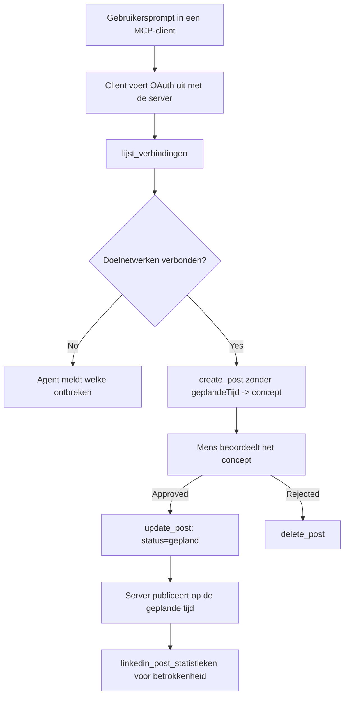

# Case Study: Publiceren op sociale netwerken vanuit een agent met een externe MCP-server

> **Disclaimer:** Verschillende diensten en open-source projecten kunnen publiceren op sociale netwerken, en een team zou ook direct de API van elk netwerk kunnen integreren. Het onderstaande scenario wordt gegeven als een uitgewerkt voorbeeld van hoe een **schrijfbare externe MCP-server** kan worden ontworpen en gebruikt. Publora is een commerciële dienst met een gratis abonnement; de hier beschreven patronen zijn van toepassing op elke MCP-server die onomkeerbare acties namens een gebruiker uitvoert.

## Overzicht

Agents zijn goed in het opstellen van content en slecht in het afleveren ervan. Een model kan binnen enkele seconden een persbericht schrijven, en daarna stopt het werk: publiceren betekent een API per netwerk, een OAuth-app per netwerk, en een andere set mediaregels voor elk. De meeste teams lossen dit op door de tekst met de hand in een browser te kopiëren.

Deze case study bekijkt hoe die laatste stap wordt afgesloten met een enkele externe MCP-server, en — nuttiger voor iedereen die er een bouwt — de ontwerpkeuzes die een **schrijfbare** server goed moet maken. Gegevens lezen is vergevingsgezind. Publiceren niet: een verkeerde tool-aanroep is zichtbaar voor een publiek en kan niet ongedaan worden gemaakt.

## Scenario

Een klein developer-relations team stelt berichten op binnen een agent (Claude, VS Code, Cursor — de client maakt niet uit). Ze willen dat de agent:

- ziet welke sociale accounts het team heeft verbonden,
- een bericht opstelt en het als concept bewaart voor een menselijke goedkeuring,
- een afbeelding toevoegt,
- het inplant op meerdere netwerken op een gekozen tijd,
- en later rapporteert hoe het presteerde.

Cruciaal is dat ze willen dat de agent *niet* per ongeluk kan publiceren terwijl ze nog experimenteren.

## Gebruikte tools

- [Publora MCP Server](https://github.com/publora/mcp-server) — een externe MCP-server (`streamable-http`) die publiceren, plannen, media en LinkedIn-analysetools aanbiedt. Geregistreerd in het officiële MCP-register als `com.publora/mcp-server`.

## Stapsgewijze workflow

1. **Verbind de server.** Clients die OAuth gebruiken doorlopen de autorisatiecode-flow met PKCE tegen het eigen toestemmingsscherm van de server; clients die dat niet doen, zoals headless CLI's, gebruiken een Publora API-sleutel in een header. Beide paden worden ondersteund, en welke je krijgt hangt af van de client, niet van de server.
2. **Lijst verbindingen.** De agent roept `list_connections` aan en ontvangt de verbonden accounts met hun identificatoren.
3. **Concept.** De agent roept `create_post` *zonder* een geplande tijd aan. Het bericht wordt opgeslagen als concept — niets wordt gepubliceerd.
4. **Media toevoegen.** Openbare afbeeldings-URL's worden in dezelfde call meegegeven; de server downloadt en valideert ze.
5. **Inplannen.** Nadat een mens goedkeurt, stelt `update_post` de status in op gepland met een ISO 8601 tijd.
6. **Meten.** Voor LinkedIn retourneert `linkedin_post_stats` betrokkenheid zodra het bericht live is.

## Voorbeeldprompt

```text
Which social accounts do I have connected?
Draft a post announcing our new changelog page, attach the screenshot at
https://example.com/changelog.png, and keep it as a draft — do not publish it.
Once I approve, schedule it to LinkedIn and Bluesky for tomorrow at 09:00 UTC.
```

## Mermaid-stroomschema



## Technische implementatie

De hieronder genoemde lessen zijn het overdraagbare deel van deze case study.

### Open ontdekking, geauthenticeerde uitvoering

`tools/list` wordt zonder inloggegevens aangeboden; elke `tools/call` vereist een token en geeft anders een `401` met een `WWW-Authenticate` header die wijst naar de metadata van de beschermde bron. (De server reageert ook op een niet-geauthenticeerde `initialize`, wat alleen relevant is voor clients op protocolveries vóór `2026-07-28`; die revisie verwijderde de handshake volledig.)

Deze splitsing is in de praktijk van belang. Registers, catalogi en clients kunnen het tooloppervlak — namen, schema's, annotaties — introspecteren zonder een geheime sleutel, terwijl niets anoniem kan worden *uitgevoerd*. Een server die voor `initialize` een token vereist, is effectief onzichtbaar voor tools; een server die anonieme `tools/call` toelaat is een risico.

### Registratie: dynamische clientregistratie, en wat dat vervangt

De server adverteert `/.well-known/oauth-protected-resource` en `/.well-known/oauth-authorization-server`, en ondersteunt de autorisatiecode-flow met PKCE (`S256`), refresh tokens en **dynamische clientregistratie**.

Dynamische registratie verwijdert de handmatige stap: zonder deze heeft elke client een vooraf uitgegeven `client_id` nodig, wat een out-of-band verzoek aan de leverancier betekent voor elke nieuwe client.

Zie dit als compatibiliteitsgedrag in plaats van als ontwerp om te kopiëren. De revisie van de specificatie van `2026-07-28` deprecieert dynamische clientregistratie ten gunste van Client ID Metadata Documents, waarbij de client een metadata-document host op een stabiele HTTPS-URL en die URL *is* de `client_id`. DCR blijft voorlopig werken, maar een server die vandaag wordt gebouwd zou moeten plannen op CIMD en DCR alleen voor oudere clients behouden.

### Toolannotaties zijn geen versiering

Elke tool draagt een `title` en de toepasbare hints: `readOnlyHint`, `destructiveHint`, `idempotentHint`, `openWorldHint`.

Twee redenen om erin te investeren. Ten eerste gebruiken clients de hints om te beslissen wat ze met de gebruiker moeten bevestigen — een client kan een alleen-lezen opzoeking automatisch uitvoeren en stoppen voor goedkeuring vóór een verwijdering. De specificatie stelt expliciet dat annotaties onbetrouwbare hints zijn, geen autorisatiemechanisme: ze bepalen wat een client aanbiedt te doen, stoppen niets op de server, en een server moet nog steeds zijn eigen regels afdwingen. Ten tweede vereisen de grote connectorcatalogi ze nu *voor beoordeling*; een server waarvan de tools geen titels en hints hebben wordt teruggestuurd, ongeacht hoe goed het werkt.

### Maak identificatoren niet verzinbaar

Platformidentificatoren zijn ondoorzichtige strings die worden geretourneerd door `list_connections`, en de schema-beschrijving zegt uitdrukkelijk dat ze letterlijk gekopieerd moeten worden en nooit geraden. De server wijst anders af.

Modellen zijn vloeiende radenmakers. Elke schrijfbare server moet ervan uitgaan dat een identifier uiteindelijk wordt gehallucineerd en dat pad luid en vroeg moet falen, in plaats van te handelen op een plausibel uitziende waarde.

### Faal vóór publicatie, met een bruikbare boodschap

Sommige netwerken weigeren alleen-tekstberichten en vereisen een afbeelding of video. Dat wordt gevalideerd wanneer het bericht wordt gepland, en de fout noemt het platform en het ontbrekende vereiste.

Een agent kan herstellen van "Instagram vereist media — voeg een afbeelding of video toe" zonder een extra ronde reizen. Het kan niet herstellen van een generieke `400`.

### Maak herhalingen veilig

De twee tools die content creëren, `create_post` en `update_post`, accepteren een idempotentiesleutel: die opnieuw gebruiken met een identieke aanvraag herhaalt de oorspronkelijke respons in plaats van een tweede bericht aan te maken. Agent-runtime's proberen opnieuw bij time-outs; zonder idempotentie wordt een trage respons een dubbele publicatie. De andere schrijftools — verwijderingen, media-stappen, LinkedIn-reacties en -commentaren — nemen geen idempotentiesleutel, dus een retry daar is niet automatisch veilig. Goed om te weten welke van je eigen mutaties beschermd zijn en welke niet.

### Bied een manier om te testen die niets publiceert

De server accepteert een gereserveerd doel, `publora-playground`, dat gevalideerd en erkend wordt als een echte bestemming en vervolgens wordt weggegooid — niets bereikt een live account. Het wordt beschreven in het toolschema zelf, dat elke client zonder inloggegevens kan lezen: het `platforms`-veld van `create_post` documenteert het als "een verbindingstestdoel dat geen echte verbinding vereist — het bericht wordt erkend en weggegooid, er wordt niets gepubliceerd". Roep het aan door het als enige invoer te geven: `platforms: ["publora-playground"]`.

Dit bleek een van de nuttigste details van het hele oppervlak te zijn. Reviewers van connectorcatalogi, bijdragers en CI kunnen het volledige schrijfpad end-to-end testen zonder risico voor een echt publiek. Elke MCP-server met onomkeerbare acties profiteert van een gedocumenteerd no-op doel.

## Resultaten en impact

- De publicatiestap verplaatste van een browser naar hetzelfde gesprek waarin de content wordt geschreven, en een concept-eerst gewoonte houdt een mens in de lus. Wees precies over wat dat betekent: een concept is een conventie, geen grens. Dezelfde credential kan plannen of publiceren, dus wie een echte goedkeuringspoort nodig heeft moet die afdwingen buiten het tooloppervlak — aparte credentials, of een beleidslaag voor de server.
- Verschillen per netwerk — media-eisen, threading, reply-regelingen — worden eenmaal in de server afgehandeld in plaats van in elke agent die ermee praat.
- Dezelfde server ondersteunt meerdere MCP-clients zonder werk per client, omdat ontdekking open is en registratie dynamisch.
- De ontwerpbeperkingen hierboven werden net zoveel gevormd door connectorcatalogusbeoordelingen als door gebruikers: annotaties, OAuth en een veilig testdoel waren elk verplicht door ten minste één van hen.

## Referenties

- [Publora MCP Server (broncode)](https://github.com/publora/mcp-server)
- [Publora API en MCP documentatie](https://docs.publora.com)
- [MCP Registry invoer: `com.publora/mcp-server`](https://registry.modelcontextprotocol.io/v0/servers?search=com.publora/mcp-server)
- [MCP-specificatie — Autorisatie](https://modelcontextprotocol.io/specification/draft/basic/authorization)
- [MCP-specificatie — Toolannotaties](https://modelcontextprotocol.io/docs/concepts/tools)

## Wat nu

- Neem een MCP-server die je bouwt en controleer de drie goedkoopste verbeteringen hier: annotaties op elke tool, een idempotentiesleutel op elke schrijfopdracht, en een gedocumenteerd no-op doel.
- Probeer de open-ontdekking splitsing: roep `tools/list` aan tegen een openbare externe server zonder credentials, roep dan een tool aan en inspecteer de `401` uitdaging.
- Overweeg wat "ongedaan maken" betekent voor je domein. Publiceren heeft concepten en verwijderen; als jouw acties geen equivalent hebben, hoort bevestiging thuis in het toolontwerp, niet in de prompt.

---

<!-- CO-OP TRANSLATOR DISCLAIMER START -->
**Disclaimer**:
Dit document is vertaald met behulp van de AI vertaaldienst [Co-op Translator](https://github.com/Azure/co-op-translator). Hoewel we streven naar nauwkeurigheid, dient u er rekening mee te houden dat geautomatiseerde vertalingen fouten of onnauwkeurigheden kunnen bevatten. Het originele document in de oorspronkelijke taal moet worden beschouwd als de gezaghebbende bron. Voor kritieke informatie wordt professionele menselijke vertaling aanbevolen. Wij zijn niet aansprakelijk voor eventuele misverstanden of verkeerde interpretaties die voortvloeien uit het gebruik van deze vertaling.
<!-- CO-OP TRANSLATOR DISCLAIMER END -->