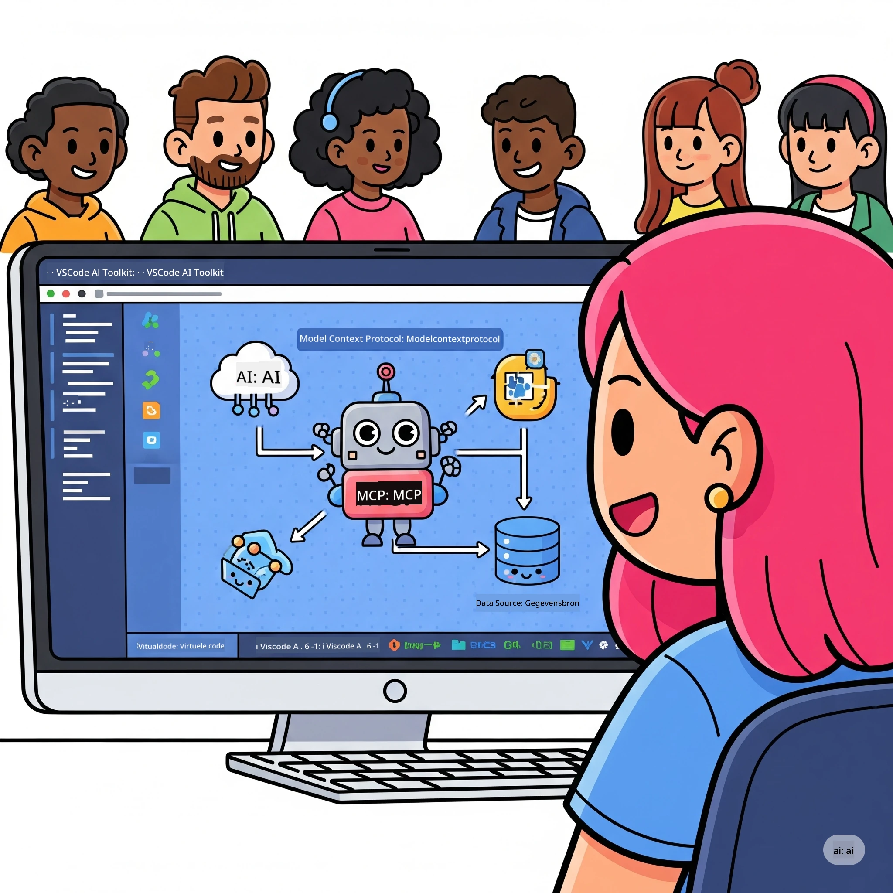
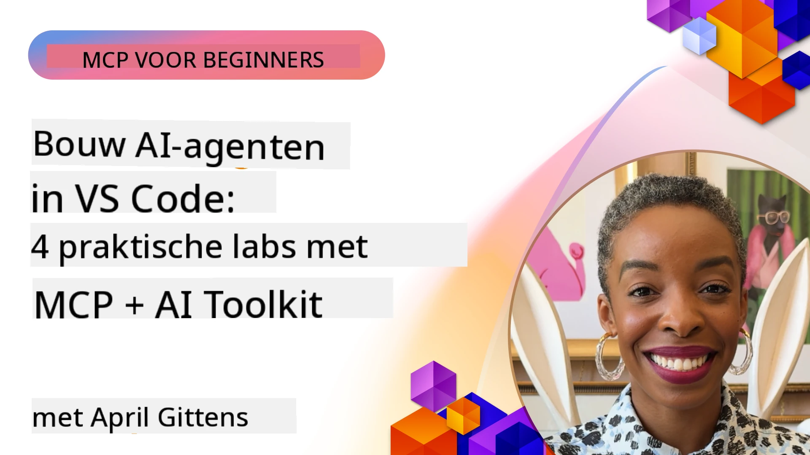

# Stroomlijnen van AI-Workflows: Het Bouwen van een MCP Server met Microsoft Foundry Toolkit

## 🎯 Overzicht

_(Klik op de afbeelding hierboven om de video van deze les te bekijken)_

Welkom bij de **Model Context Protocol (MCP) Workshop**! Deze uitgebreide hands-on workshop combineert twee baanbrekende technologieën om AI-applicatieontwikkeling te revolutioneren:

> **Compatibiliteitsopmerking:** de workshopcode is gebouwd en getest met MCP
> `2025-11-25`, zoals weergegeven door het hierboven getoonde badge. Gebruik de
> [huidige `2026-07-28` specificatie](https://modelcontextprotocol.io/specification/2026-07-28/)
> voor nieuwe protocolimplementaties en bekijk de SDK-release-opmerkingen voordat u
> de labs migreert.

- **🔗 Model Context Protocol (MCP)**: Een open standaard voor naadloze AI-gereedschapsintegratie
- **🛠️ Microsoft Foundry Toolkit Extensie voor VS Code**: De krachtige AI-ontwikkeluitbreiding van Microsoft

### 🎓 Wat je zult leren

Aan het einde van deze workshop beheers je de kunst van het bouwen van intelligente applicaties die AI-modellen verbinden met tools en services uit de echte wereld. Van geautomatiseerd testen tot aangepaste API-integraties, je krijgt praktische vaardigheden om complexe zakelijke uitdagingen op te lossen.

## 🏗️ Technologie Stack

### 🔌 Model Context Protocol (MCP)

MCP is de **"USB-C voor AI"** - een universele standaard die AI-modellen verbindt met externe tools en databronnen.

**✨ Belangrijkste kenmerken:**

- 🔄 **Gestandaardiseerde Integratie**: Universele interface voor AI-toolverbindingen
- 🏛️ **Flexibele Architectuur**: Lokale & externe servers via stdio/SSE transport
- 🧰 **Rijk Ecosysteem**: Tools, prompts en bronnen in één protocol
- 🔒 **Klaar voor Enterprise**: Ingebouwde veiligheid en betrouwbaarheid

**🎯 Waarom MCP belangrijk is:**
Net zoals USB-C de kabelchaos elimineerde, vereenvoudigt MCP de complexiteit van AI-integraties. Eén protocol, oneindige mogelijkheden.

### 🤖 Microsoft Foundry Toolkit Extensie voor VS Code

Microsoft's vlaggenschip AI-ontwikkeluitbreiding die VS Code transformeert tot een AI-krachtpatser.

**🚀 Kernmogelijkheden:**

- 📦 **Modelcatalogus**: Toegang tot modellen van Azure AI, GitHub, Hugging Face, Ollama
- ⚡ **Lokale Inferentie**: ONNX-geoptimaliseerde CPU/GPU/NPU-uitvoering
- 🏗️ **Agent Builder**: Visuele AI-agentontwikkeling met MCP-integratie
- 🎭 **Multi-Modal**: Tekst-, visie- en gestructureerde output ondersteuning

**💡 Ontwikkelvoordelen:**

- Zero-config model implementatie
- Visuele prompt engineering
- Realtime testomgeving
- Naadloze MCP server integratie

## 📚 Leertraject

### [🚀 Module 1: Microsoft Foundry Toolkit Basisprincipes](./lab1/README.md)

**Duur**: 15 minuten

- 🛠️ Installeer en configureer Microsoft Foundry Toolkit voor VS Code
- 🗂️ Verken de Modelcatalogus (100+ modellen van GitHub, ONNX, OpenAI, Anthropic, Google)
- 🎮 Beheers de interactieve speelplaats voor realtime modeltesten
- 🤖 Bouw je eerste AI-agent met Agent Builder
- 📊 Evalueer modelprestaties met ingebouwde metrics (F1, relevantie, gelijkenis, coherentie)
- ⚡ Leer batchverwerking en multi-modal ondersteuningsmogelijkheden

**🎯 Leerresultaat**: Maak een functionele AI-agent met een uitgebreid begrip van Microsoft Foundry Toolkit mogelijkheden

### [🌐 Module 2: MCP met Microsoft Foundry Toolkit Basisprincipes](./lab2/README.md)

**Duur**: 20 minuten

- 🧠 Beheers Model Context Protocol (MCP) architectuur en concepten
- 🌐 Verken het Microsoft MCP server ecosysteem
- 🤖 Bouw een browser automatiseringsagent met Playwright MCP server
- 🔧 Integreer MCP servers met Microsoft Foundry Toolkit Agent Builder
- 📊 Configureer en test MCP tools binnen je agents
- 🚀 Exporteer en zet MCP-aangedreven agents in voor productiegebruik

**🎯 Leerresultaat**: Zet een AI-agent in die extra kracht krijgt door externe tools via MCP

### [🔧 Module 3: Geavanceerde MCP Ontwikkeling met Microsoft Foundry Toolkit](./lab3/README.md)

**Duur**: 20 minuten

- 💻 Maak aangepaste MCP-servers met Microsoft Foundry Toolkit
- 🐍 Configureer en gebruik de nieuwste MCP Python SDK (v1.9.3)
- 🔍 Stel MCP Inspector in en gebruik deze voor debugging
- 🛠️ Bouw een Weather MCP Server met professionele debugging workflows
- 🧪 Debug MCP-servers in zowel Agent Builder als Inspector omgevingen

**🎯 Leerresultaat**: Ontwikkel en debug aangepaste MCP-servers met moderne tools

### [🐙 Module 4: Praktische MCP Ontwikkeling - Aangepaste GitHub Clone Server](./lab4/README.md)

**Duur**: 30 minuten

- 🏗️ Bouw een echte GitHub Clone MCP Server voor ontwikkelingsworkflows
- 🔄 Implementeer slimme repository cloning met validatie en foutafhandeling
- 📁 Maak intelligent directorybeheer en VS Code-integratie
- 🤖 Gebruik GitHub Copilot Agent Modus met aangepaste MCP-tools
- 🛡️ Pas productieklare betrouwbaarheid en platformonafhankelijke compatibiliteit toe

**🎯 Leerresultaat**: Zet een productieklare MCP server in die echte ontwikkelingsworkflows vereenvoudigt

## 💡 Toepassingen en Impact in de Praktijk

### 🏢 Enterprise Use Cases

#### 🔄 DevOps Automatisering

Transformeer je ontwikkelingsworkflow met intelligente automatisering:

- **Slim Repositorybeheer**: AI-gedreven code review en merge beslissingen
- **Intelligente CI/CD**: Geautomatiseerde pijplijnoptimalisatie gebaseerd op codewijzigingen
- **Issue Triage**: Automatische bugclassificatie en toewijzing

#### 🧪 Revolutie in Kwaliteitsborging

Verhoog testen met AI-gestuurde automatisering:

- **Intelligente Testgeneratie**: Maak automatisch uitgebreide testsuites
- **Visuele Regressietests**: AI-gestuurde UI-veranderdetectie
- **Prestatiemonitoring**: Proactieve probleemidentificatie en -oplossing

#### 📊 Data Pipeline Intelligentie

Bouw slimmere gegevensverwerkingsworkflows:

- **Adaptieve ETL-processen**: Zelfoptimaliserende datatransformaties
- **Anomaliedetectie**: Realtime monitoring van datakwaliteit
- **Intelligente Routering**: Slim beheer van datastromen

#### 🎧 Verbetering van de Klantbeleving

Creëer buitengewone klanteninteracties:

- **Contextbewuste Ondersteuning**: AI-agents met toegang tot klantgeschiedenis
- **Proactieve Probleemoplossing**: Voorspellende klantenservice
- **Multi-Channel Integratie**: Geïntegreerde AI-ervaring over platforms heen

## 🛠️ Vereisten & Setup

### 💻 Systeemvereisten

| Component | Vereiste | Opmerkingen |
|-----------|----------|------------|
| **Besturingssysteem** | Windows 10+, macOS 10.15+, Linux | Elk modern OS |
| **Visual Studio Code** | Laatste stabiele versie | Vereist voor Microsoft Foundry Toolkit |
| **Node.js** | v18.0+ en npm | Voor MCP serverontwikkeling |
| **Python** | 3.10+ | Optioneel voor Python MCP-servers |
| **Geheugen** | Minimaal 8GB RAM | 16GB aanbevolen voor lokale modellen |

### 🔧 Ontwikkelomgeving

#### Aanbevolen VS Code Extensies

- **Microsoft Foundry Toolkit** (ms-windows-ai-studio.windows-ai-studio)
- **Python** (ms-python.python)
- **Python Debugger** (ms-python.debugpy)
- **GitHub Copilot** (GitHub.copilot) - Optioneel maar nuttig

#### Optionele Tools

- **uv**: Moderne Python pakketbeheerder
- **MCP Inspector**: Visuele debugging-tool voor MCP servers
- **Playwright**: Voor webautomatiseringsvoorbeelden

## 🎖️ Leerresultaten & Certificeringspad

### 🏆 Checklist Vaardigheidsbeheersing

Door deze workshop te voltooien, beheers je:

#### 🎯 Kerncompetenties

- [ ] **MCP Protocol Beheersing**: Diep begrip van architectuur en implementatiepatronen
- [ ] **Microsoft Foundry Toolkit Vaardigheid**: Deskundig gebruik van Microsoft Foundry Toolkit voor snelle ontwikkeling
- [ ] **Aangepaste Serverontwikkeling**: Bouw, implementeer en onderhoud productie MCP-servers
- [ ] **Uitmuntendheid in Toolintegratie**: Naadloze connectie van AI met bestaande ontwikkelingsworkflows
- [ ] **Probleemoplossend Toepassen**: Pas geleerde vaardigheden toe op echte zakelijke uitdagingen

#### 🔧 Technische Vaardigheden

- [ ] Stel Microsoft Foundry Toolkit in en configureer het in VS Code
- [ ] Ontwerp en implementeer aangepaste MCP-servers
- [ ] Integreer GitHub Modellen met MCP-architectuur
- [ ] Bouw geautomatiseerde testworkflows met Playwright
- [ ] Zet AI-agents in voor productiegebruik
- [ ] Debug en optimaliseer de prestaties van MCP-servers

#### 🚀 Geavanceerde Mogelijkheden

- [ ] Ontwerp enterprise-scale AI-integraties
- [ ] Implementeer beveiligingspraktijken voor AI-toepassingen
- [ ] Ontwerp schaalbare MCP serverarchitecturen
- [ ] Maak aangepaste toolchains voor specifieke domeinen
- [ ] Begeleid anderen in AI-native ontwikkeling

## 📖 Aanvullende Bronnen

- [MCP Specificatie (2026-07-28)](https://modelcontextprotocol.io/specification/2026-07-28/)
- [Microsoft Foundry Toolkit GitHub Repository](https://github.com/microsoft/vscode-ai-toolkit)
- [Voorbeeld MCP Servers Collectie](https://github.com/modelcontextprotocol/servers)
- [Handleiding Beste Praktijken](https://modelcontextprotocol.io/docs/best-practices)
- [OWASP MCP Top 10](https://microsoft.github.io/mcp-azure-security-guide/mcp/) - Beveiligingsrichtlijnen

---

**🚀 Klaar om je AI-ontwikkelworkflow te revolutioneren?**

Laten we samen de toekomst van intelligente applicaties bouwen met MCP en Microsoft Foundry Toolkit!

## Wat Nu

Ga verder naar: [Module 11: MCP Server Hands-On Labs](../11-MCPServerHandsOnLabs/README.md)

---

<!-- CO-OP TRANSLATOR DISCLAIMER START -->
**Disclaimer**:
Dit document is vertaald met behulp van de AI vertaaldienst [Co-op Translator](https://github.com/Azure/co-op-translator). Hoewel we streven naar nauwkeurigheid, dient u er rekening mee te houden dat geautomatiseerde vertalingen fouten of onnauwkeurigheden kunnen bevatten. Het originele document in de oorspronkelijke taal moet worden beschouwd als de gezaghebbende bron. Voor kritieke informatie wordt professionele menselijke vertaling aanbevolen. Wij zijn niet aansprakelijk voor eventuele misverstanden of verkeerde interpretaties die voortvloeien uit het gebruik van deze vertaling.
<!-- CO-OP TRANSLATOR DISCLAIMER END -->