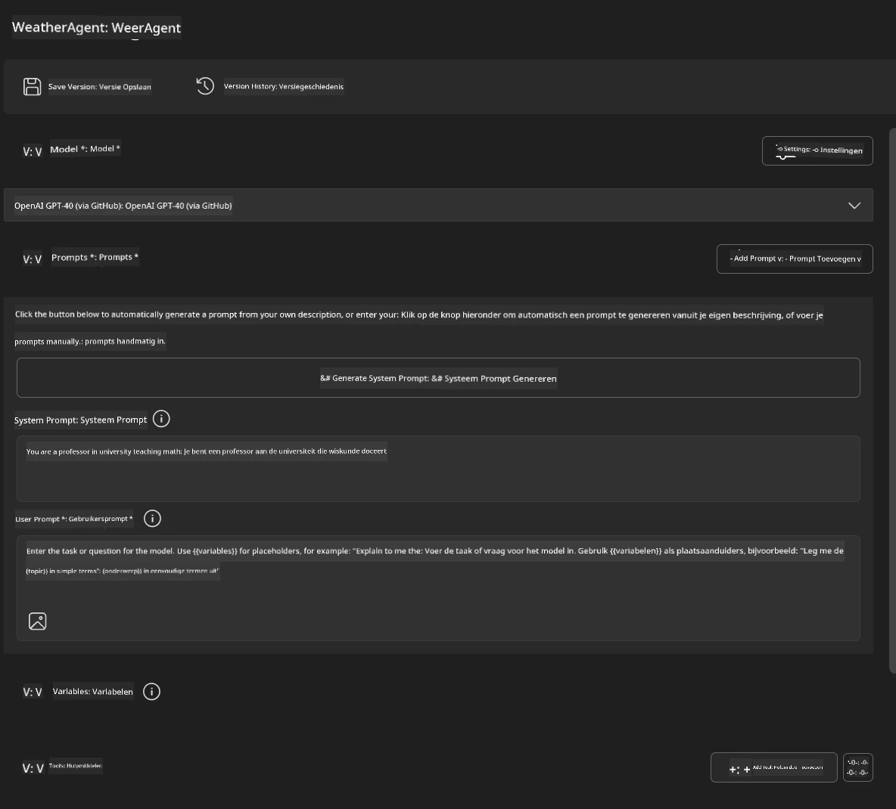
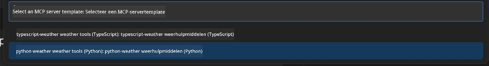
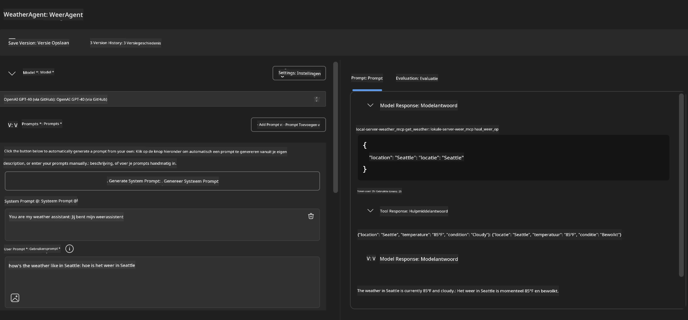
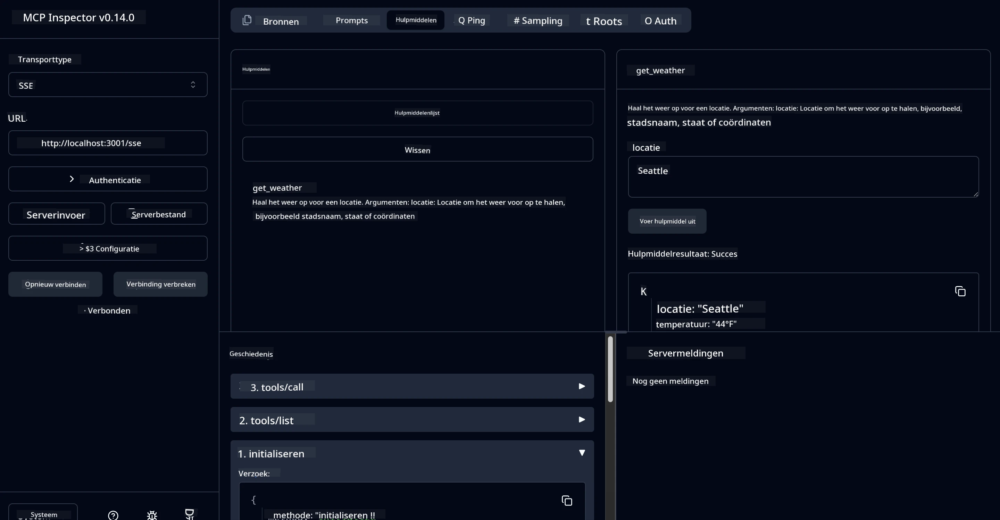

# 🔧 Module 3: Geavanceerde MCP-ontwikkeling met Microsoft Foundry Toolkit

> [!NOTE]
> Inspector-URL's in deze lab gebruiken de legacy `/sse`-endpoint en richten zich op de
> vastgezette MCP SDK `1.9.3` en Inspector `0.14.0` afhankelijkheden. Ze zijn niet
> de huidige `2026-07-28` Streamable HTTP-voorbeelden.


## 🎯 Leerdoelen

Aan het einde van deze lab kun je:

- ✅ Aangepaste MCP-servers creëren met behulp van Microsoft Foundry Toolkit
- ✅ De nieuwste MCP Python SDK (v1.9.3) configureren en gebruiken
- ✅ Het MCP Inspector gebruiken voor debugging
- ✅ MCP-servers debuggen in zowel Agent Builder als Inspector omgevingen
- ✅ Geavanceerde MCP-server ontwikkelingsworkflows begrijpen

## 📋 Vereisten

- Voltooiing van Lab 2 (MCP Fundamentals)
- VS Code met Microsoft Foundry Toolkit extensie geïnstalleerd
- Python 3.10+ omgeving
- Node.js en npm voor Inspector installatie

## 🏗️ Wat je gaat bouwen

In deze lab maak je een **Weather MCP Server** die het volgende demonstreert:
- Aangepaste MCP-server implementatie
- Integratie met Microsoft Foundry Toolkit Agent Builder
- Professionele debugging workflows
- Moderne MCP SDK gebruikspatronen

---

## 🔧 Overzicht van Kerncomponenten

### 🐍 MCP Python SDK
De Model Context Protocol Python SDK biedt de basis voor het bouwen van aangepaste MCP-servers. Je gebruikt versie 1.9.3 met verbeterde debugmogelijkheden.

### 🔍 MCP Inspector
Een krachtig debughulpmiddel dat het volgende biedt:
- Real-time servermonitoring
- Visualisatie van tooluitvoering
- Inspectie van netwerkverzoeken / -antwoorden
- Interactieve testomgeving

---

## 📖 Stapsgewijze Implementatie

### Stap 1: Maak een WeatherAgent in Agent Builder

1. **Start Agent Builder** in VS Code via de Microsoft Foundry Toolkit extensie
2. **Maak een nieuwe agent** met de volgende configuratie:
   - Agentnaam: `WeatherAgent`



### Stap 2: Initialiseer MCP Server Project

1. **Navigeer naar Tools** → **Add Tool** in Agent Builder
2. **Selecteer "MCP Server"** uit de beschikbare opties
3. **Kies "Create A new MCP Server"**
4. **Selecteer de `python-weather` template**
5. **Geef je server een naam:** `weather_mcp`



### Stap 3: Open en Onderzoek het Project

1. **Open het gegenereerde project** in VS Code
2. **Bekijk de projectstructuur:**
   ```
   weather_mcp/
   ├── src/
   │   ├── __init__.py
   │   └── server.py
   ├── inspector/
   │   ├── package.json
   │   └── package-lock.json
   ├── .vscode/
   │   ├── launch.json
   │   └── tasks.json
   ├── pyproject.toml
   └── README.md
   ```

### Stap 4: Upgrade naar de nieuwste MCP SDK

> **🔍 Waarom upgraden?** We willen de nieuwste MCP SDK (v1.9.3) en Inspector service (0.14.0) gebruiken voor verbeterde functionaliteiten en betere debugmogelijkheden.

#### 4a. Update Python dependencies

**Bewerk `pyproject.toml`:** update [./code/weather_mcp/pyproject.toml](../../../../10-StreamliningAIWorkflowsBuildingAnMCPServerWithAIToolkit/lab3/code/weather_mcp/pyproject.toml)


#### 4b. Update Inspector configuratie

**Bewerk `inspector/package.json`:** update [./code/weather_mcp/inspector/package.json](../../../../10-StreamliningAIWorkflowsBuildingAnMCPServerWithAIToolkit/lab3/code/weather_mcp/inspector/package.json)

#### 4c. Update Inspector dependencies

**Bewerk `inspector/package-lock.json`:** update [./code/weather_mcp/inspector/package-lock.json](../../../../10-StreamliningAIWorkflowsBuildingAnMCPServerWithAIToolkit/lab3/code/weather_mcp/inspector/package-lock.json)

> **📝 Opmerking:** Dit bestand bevat uitgebreide dependencydefinities. Hieronder staat de essentiële structuur – de volledige inhoud zorgt voor correcte dependencyresolutie.


> **⚡ Volledige Package Lock:** De complete package-lock.json bevat ~3000 regels aan dependencydefinities. Bovenstaand toont de hoofdstructuur – gebruik het geleverde bestand voor volledige dependencyresolutie.

### Stap 5: Configureer VS Code Debugging

*Opmerking: kopieer het bestand op het opgegeven pad om het overeenkomstige lokale bestand te vervangen*

#### 5a. Update launch configuratie

**Bewerk `.vscode/launch.json`:**

```json
{
  "version": "0.2.0",
  "configurations": [
    {
      "name": "Attach to Local MCP",
      "type": "debugpy",
      "request": "attach",
      "connect": {
        "host": "localhost",
        "port": 5678
      },
      "presentation": {
        "hidden": true
      },
      "internalConsoleOptions": "neverOpen",
      "postDebugTask": "Terminate All Tasks"
    },
    {
      "name": "Launch Inspector (Edge)",
      "type": "msedge",
      "request": "launch",
      "url": "http://localhost:6274?timeout=60000&serverUrl=http://localhost:3001/sse#tools",
      "cascadeTerminateToConfigurations": [
        "Attach to Local MCP"
      ],
      "presentation": {
        "hidden": true
      },
      "internalConsoleOptions": "neverOpen"
    },
    {
      "name": "Launch Inspector (Chrome)",
      "type": "chrome",
      "request": "launch",
      "url": "http://localhost:6274?timeout=60000&serverUrl=http://localhost:3001/sse#tools",
      "cascadeTerminateToConfigurations": [
        "Attach to Local MCP"
      ],
      "presentation": {
        "hidden": true
      },
      "internalConsoleOptions": "neverOpen"
    }
  ],
  "compounds": [
    {
      "name": "Debug in Agent Builder",
      "configurations": [
        "Attach to Local MCP"
      ],
      "preLaunchTask": "Open Agent Builder",
    },
    {
      "name": "Debug in Inspector (Edge)",
      "configurations": [
        "Launch Inspector (Edge)",
        "Attach to Local MCP"
      ],
      "preLaunchTask": "Start MCP Inspector",
      "stopAll": true
    },
    {
      "name": "Debug in Inspector (Chrome)",
      "configurations": [
        "Launch Inspector (Chrome)",
        "Attach to Local MCP"
      ],
      "preLaunchTask": "Start MCP Inspector",
      "stopAll": true
    }
  ]
}
```

**Bewerk `.vscode/tasks.json`:**

```
{
  "version": "2.0.0",
  "tasks": [
    {
      "label": "Start MCP Server",
      "type": "shell",
      "command": "python -m debugpy --listen 127.0.0.1:5678 src/__init__.py sse",
      "isBackground": true,
      "options": {
        "cwd": "${workspaceFolder}",
        "env": {
          "PORT": "3001"
        }
      },
      "problemMatcher": {
        "pattern": [
          {
            "regexp": "^.*$",
            "file": 0,
            "location": 1,
            "message": 2
          }
        ],
        "background": {
          "activeOnStart": true,
          "beginsPattern": ".*",
          "endsPattern": "Application startup complete|running"
        }
      }
    },
    {
      "label": "Start MCP Inspector",
      "type": "shell",
      "command": "npm run dev:inspector",
      "isBackground": true,
      "options": {
        "cwd": "${workspaceFolder}/inspector",
        "env": {
          "CLIENT_PORT": "6274",
          "SERVER_PORT": "6277",
        }
      },
      "problemMatcher": {
        "pattern": [
          {
            "regexp": "^.*$",
            "file": 0,
            "location": 1,
            "message": 2
          }
        ],
        "background": {
          "activeOnStart": true,
          "beginsPattern": "Starting MCP inspector",
          "endsPattern": "Proxy server listening on port"
        }
      },
      "dependsOn": [
        "Start MCP Server"
      ]
    },
    {
      "label": "Open Agent Builder",
      "type": "shell",
      "command": "echo ${input:openAgentBuilder}",
      "presentation": {
        "reveal": "never"
      },
      "dependsOn": [
        "Start MCP Server"
      ],
    },
    {
      "label": "Terminate All Tasks",
      "command": "echo ${input:terminate}",
      "type": "shell",
      "problemMatcher": []
    }
  ],
  "inputs": [
    {
      "id": "openAgentBuilder",
      "type": "command",
      "command": "ai-mlstudio.agentBuilder",
      "args": {
        "initialMCPs": [ "local-server-weather_mcp" ],
        "triggeredFrom": "vsc-tasks"
      }
    },
    {
      "id": "terminate",
      "type": "command",
      "command": "workbench.action.tasks.terminate",
      "args": "terminateAll"
    }
  ]
}
```


---

## 🚀 Je MCP Server draaien en testen

### Stap 6: Installeer dependencies

Na het aanbrengen van de configuratiewijzigingen, voer je de volgende commando's uit:

**Installeer Python dependencies:**
```bash
uv sync
```

**Installeer Inspector dependencies:**
```bash
cd inspector
npm install
```

### Stap 7: Debuggen met Agent Builder

1. **Druk op F5** of gebruik de **"Debug in Agent Builder"** configuratie
2. **Selecteer de compound configuratie** in het debugpaneel
3. **Wacht tot de server start** en Agent Builder opent
4. **Test je weather MCP server** met natuurlijke taalqueries

Voer een prompt in zoals deze

SYSTEM_PROMPT

```
You are my weather assistant
```

USER_PROMPT

```
How's the weather like in Seattle
```



### Stap 8: Debuggen met MCP Inspector

1. **Gebruik de "Debug in Inspector"** configuratie (Edge of Chrome)
2. **Open de Inspector interface** op `http://localhost:6274`
3. **Verken de interactieve testomgeving:**
   - Bekijk beschikbare tools
   - Test tooluitvoering
   - Monitor netwerkverzoeken
   - Debug serverresponses



---

## 🎯 Belangrijkste Leerresultaten

Door deze lab te voltooien, heb je:

- [x] **Een aangepaste MCP-server gemaakt** met Microsoft Foundry Toolkit templates
- [x] **Geüpgraded naar de nieuwste MCP SDK** (v1.9.3) voor verbeterde functionaliteit
- [x] **Professionele debugging workflows geconfigureerd** voor zowel Agent Builder als Inspector
- [x] **De MCP Inspector ingesteld** voor interactieve servertests
- [x] **VS Code debugging configuraties beheerst** voor MCP-ontwikkeling

## 🔧 Geavanceerde functies Verkend

| Functie | Beschrijving | Gebruikssituatie |
|---------|-------------|----------|
| **MCP Python SDK v1.9.3** | Nieuwste protocolimplementatie | Moderne serverontwikkeling |
| **MCP Inspector 0.14.0** | Interactief debughulpmiddel | Real-time servertests |
| **VS Code Debugging** | Geïntegreerde ontwikkelomgeving | Professionele debugging workflow |
| **Agent Builder Integratie** | Directe Microsoft Foundry Toolkit verbinding | End-to-end agenttesten |

## 📚 Aanvullende Bronnen

- [MCP Python SDK Documentatie](https://modelcontextprotocol.io/docs/sdk/python)
- [Microsoft Foundry Toolkit Extensie Gids](https://code.visualstudio.com/docs/ai/ai-toolkit)
- [VS Code Debugging Documentatie](https://code.visualstudio.com/docs/editor/debugging)
- [Model Context Protocol Specificatie](https://modelcontextprotocol.io/docs/concepts/architecture)

---

**🎉 Gefeliciteerd!** Je hebt Lab 3 succesvol afgerond en kunt nu aangepaste MCP-servers creëren, debuggen en uitrollen met professionele ontwikkelworkflows.

### 🔜 Ga door naar de Volgende Module

Klaar om je MCP-vaardigheden toe te passen in een echte ontwikkelworkflow? Ga verder met **[Module 4: Praktische MCP-ontwikkeling - Aangepaste GitHub Clone Server](../lab4/README.md)** waar je:
- Een productieklare MCP-server bouwt die GitHub repository-operaties automatiseert
- GitHub repository kloonfunctionaliteit implementeert via MCP
- Aangepaste MCP-servers integreert met VS Code en GitHub Copilot Agent Mode
- Aangepaste MCP-servers test en in productie uitrolt
- Praktische workflowautomatisering voor ontwikkelaars leert

---

<!-- CO-OP TRANSLATOR DISCLAIMER START -->
**Disclaimer**:
Dit document is vertaald met behulp van de AI vertaaldienst [Co-op Translator](https://github.com/Azure/co-op-translator). Hoewel we streven naar nauwkeurigheid, dient u er rekening mee te houden dat geautomatiseerde vertalingen fouten of onnauwkeurigheden kunnen bevatten. Het originele document in de oorspronkelijke taal moet worden beschouwd als de gezaghebbende bron. Voor kritieke informatie wordt professionele menselijke vertaling aanbevolen. Wij zijn niet aansprakelijk voor eventuele misverstanden of verkeerde interpretaties die voortvloeien uit het gebruik van deze vertaling.
<!-- CO-OP TRANSLATOR DISCLAIMER END -->