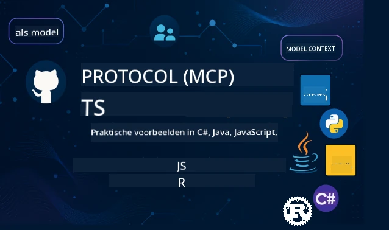

<!--
CO_OP_TRANSLATOR_METADATA:
{
  "original_hash": "35240f904db8c08d6198f6f15767d218",
  "translation_date": "2026-01-15T04:28:32+00:00",
  "source_file": "README.md",
  "language_code": "nl"
}
-->
 

[](https://GitHub.com/microsoft/mcp-for-beginners/graphs/contributors)
[](https://GitHub.com/microsoft/mcp-for-beginners/issues)
[](https://GitHub.com/microsoft/mcp-for-beginners/pulls)
[](http://makeapullrequest.com)

[](https://GitHub.com/microsoft/mcp-for-beginners/watchers)
[](https://GitHub.com/microsoft/mcp-for-beginners/fork)
[](https://GitHub.com/microsoft/mcp-for-beginners/stargazers)


[](https://discord.gg/nTYy5BXMWG)

Volg deze stappen om aan de slag te gaan met deze bronnen:
1. **Fork de Repository**: Klik [](https://GitHub.com/microsoft/mcp-for-beginners/fork)
2. **Clone de Repository**:   `git clone https://github.com/microsoft/mcp-for-beginners.git`
3. **Word lid van de** [](https://discord.gg/nTYy5BXMWG)


### 🌐 Meertalige Ondersteuning

#### Ondersteund via GitHub Action (Geautomatiseerd & Altijd Up-to-Date)

<!-- CO-OP TRANSLATOR LANGUAGES TABLE START -->
[Arabisch](../ar/README.md) | [Bengaals](../bn/README.md) | [Bulgaars](../bg/README.md) | [Birmaans (Myanmar)](../my/README.md) | [Chinees (Vereenvoudigd)](../zh/README.md) | [Chinees (Traditioneel, Hong Kong)](../hk/README.md) | [Chinees (Traditioneel, Macau)](../mo/README.md) | [Chinees (Traditioneel, Taiwan)](../tw/README.md) | [Kroatisch](../hr/README.md) | [Tsjechisch](../cs/README.md) | [Deens](../da/README.md) | [Nederlands](./README.md) | [Ests](../et/README.md) | [Fins](../fi/README.md) | [Frans](../fr/README.md) | [Duits](../de/README.md) | [Grieks](../el/README.md) | [Hebreeuws](../he/README.md) | [Hindi](../hi/README.md) | [Hongaars](../hu/README.md) | [Indonesisch](../id/README.md) | [Italiaans](../it/README.md) | [Japans](../ja/README.md) | [Kannada](../kn/README.md) | [Koreaans](../ko/README.md) | [Litouws](../lt/README.md) | [Maleis](../ms/README.md) | [Malayalam](../ml/README.md) | [Marathi](../mr/README.md) | [Nepalees](../ne/README.md) | [Nigeriaans Pidgin](../pcm/README.md) | [Noors](../no/README.md) | [Perzisch (Farsi)](../fa/README.md) | [Pools](../pl/README.md) | [Portugees (Brazilië)](../br/README.md) | [Portugees (Portugal)](../pt/README.md) | [Punjabi (Gurmukhi)](../pa/README.md) | [Roemeens](../ro/README.md) | [Russisch](../ru/README.md) | [Servisch (Cyrillisch)](../sr/README.md) | [Slowaaks](../sk/README.md) | [Sloveens](../sl/README.md) | [Spaans](../es/README.md) | [Swahili](../sw/README.md) | [Zweeds](../sv/README.md) | [Tagalog (Filipijns)](../tl/README.md) | [Tamil](../ta/README.md) | [Telugu](../te/README.md) | [Thais](../th/README.md) | [Turks](../tr/README.md) | [Oekraïens](../uk/README.md) | [Urdu](../ur/README.md) | [Vietnamees](../vi/README.md)

> **Liever lokaal clonen?**

> Deze repository bevat vertalingen in meer dan 50 talen, wat de downloadgrootte aanzienlijk vergroot. Om te clonen zonder vertalingen, gebruik sparse checkout:
> ```bash
> git clone --filter=blob:none --sparse https://github.com/microsoft/mcp-for-beginners.git
> cd mcp-for-beginners
> git sparse-checkout set --no-cone '/*' '!translations' '!translated_images'
> ```
> Dit geeft je alles wat je nodig hebt om de cursus te voltooien met een veel snellere download.
<!-- CO-OP TRANSLATOR LANGUAGES TABLE END -->

# 🚀 Model Context Protocol (MCP) Curriculum voor Beginners

## **Leer MCP met Praktische Code Voorbeelden in C#, Java, JavaScript, Rust, Python en TypeScript**

## 🧠 Overzicht van het Model Context Protocol Curriculum
Welkom op je reis in het Model Context Protocol! Als je je ooit hebt afgevraagd hoe AI-toepassingen communiceren met verschillende tools en diensten, sta je op het punt de elegante oplossing te ontdekken die ontwikkelaars helpt intelligente systemen te bouwen.

Zie MCP als een universele vertaler voor AI-toepassingen - net zoals USB-poorten je toestaan elk apparaat op je computer aan te sluiten, laat MCP AI-modellen op een gestandaardiseerde manier verbinding maken met elke tool of dienst. Of je nu je eerste chatbot bouwt of werkt aan complexe AI-workflows, het begrijpen van MCP geeft je de kracht om capabelere en flexibelere applicaties te maken.

Dit curriculum is zorgvuldig ontworpen met geduld en aandacht voor jouw leertraject. We beginnen met eenvoudige concepten die je al kent en bouwen je expertise stapsgewijs op via hands-on oefeningen in je favoriete programmeertaal. Elke stap bevat duidelijke uitleg, praktische voorbeelden en veel aanmoediging.

Tegen de tijd dat je deze reis hebt voltooid, heb je het vertrouwen om je eigen MCP-servers te bouwen, ze te integreren met populaire AI-platforms, en te begrijpen hoe deze technologie de toekomst van AI-ontwikkeling vormgeeft. Laten we samen aan dit spannende avontuur beginnen!

### Officiële Documentatie en Specificaties

Deze bronnen worden waardevoller naarmate je begrip groeit, maar voel je niet verplicht om alles direct te lezen. Begin met de onderwerpen die je het meest interesseren!
- 📘 [MCP Documentatie](https://modelcontextprotocol.io/) – Dit is je go-to bron voor stapsgewijze tutorials en gebruikershandleidingen. De documentatie is geschreven met beginners in gedachten, met duidelijke voorbeelden die je in je eigen tempo kunt volgen.
- 📜 [MCP Specificatie](https://modelcontextprotocol.io/docs/) – Zie dit als je uitgebreide referentiehandleiding. Terwijl je door het curriculum werkt, zul je hier vaak terugkeren om specifieke details op te zoeken en geavanceerde functies te verkennen.
- 📜 [Originele MCP Specificatie](https://modelcontextprotocol.io/specification/versioning) – Deze bevat aanvullende technische details die nuttig kunnen zijn voor gevorderde implementaties. Het is er wanneer je het nodig hebt, maar maak je er niet te druk over als je net begint.
- 🧑‍💻 [MCP GitHub Repository](https://github.com/modelcontextprotocol) – Hier vind je SDK's, tools en codevoorbeelden in meerdere programmeertalen. Het is als een schat aan praktische voorbeelden en kant-en-klare componenten.
- 🌐 [MCP Community](https://github.com/orgs/modelcontextprotocol/discussions) – Word lid van mede-leerlingen en ervaren ontwikkelaars in discussies over MCP. Het is een ondersteunende community waar vragen welkom zijn en kennis vrij wordt gedeeld.
  
## Leerdoelen

Aan het einde van dit curriculum voel je je zelfverzekerd en enthousiast over je nieuwe vaardigheden. Dit is wat je zult bereiken:

• **Begrijp MCP basisprincipes**: Je begrijpt wat het Model Context Protocol is en waarom het de manier waarop AI-toepassingen samenwerken revolutioneert, aan de hand van analogieën en voorbeelden die logisch zijn.

• **Bouw je eerste MCP server**: Je maakt een werkende MCP-server in je favoriete programmeertaal, beginnend met eenvoudige voorbeelden en geleidelijk je vaardigheden opbouwend.

• **Verbind AI-modellen met echte tools**: Je leert hoe je de kloof overbrugt tussen AI-modellen en daadwerkelijke diensten, waardoor je applicaties krachtige nieuwe mogelijkheden krijgen.

• **Implementeer beveiligingspraktijken**: Je begrijpt hoe je je MCP-implementaties veilig houdt, zodat zowel je applicaties als gebruikers beschermd zijn.

• **Implementeer met vertrouwen**: Je weet hoe je je MCP-projecten van ontwikkeling naar productie brengt, met praktische strategieën die in de echte wereld werken.

• **Word onderdeel van de MCP-community**: Je wordt onderdeel van een groeiende community van ontwikkelaars die de toekomst van AI-applicatieontwikkeling vormgeven. 

## Essentiële Achtergrond

Voordat we in MCP-details duiken, zorgen we ervoor dat je je comfortabel voelt met enkele basisbegrippen. Geen zorgen als je hierin geen expert bent - we leggen alles uit wat je moet weten!

### Begrijpen van Protocollen (De Basis)

Zie een protocol als de regels voor een gesprek. Als je een vriend belt, weten jullie allebei dat je "hallo" zegt als je opneemt, om beurten spreekt en "tot ziens" zegt als het gesprek klaar is. Computerprogramma's hebben soortgelijke regels nodig om effectief te communiceren.

MCP is een protocol – een set afspraken die AI-modellen en applicaties helpt productieve "gesprekken" te voeren met tools en diensten. Net zoals gespreksregels menselijke communicatie soepeler maken, maakt MCP communicatie tussen AI-toepassingen veel betrouwbaarder en krachtiger.

### Client-Server Relaties (Hoe Programma's Samenwerken)

Je gebruikt client-server relaties elke dag! Als je een webbrowser (de client) gebruikt om een website te bezoeken, maak je verbinding met een webserver die de pagina-inhoud naar je stuurt. De browser weet hoe hij om informatie moet vragen, en de server weet hoe hij moet antwoorden.

In MCP hebben we een vergelijkbare relatie: AI-modellen fungeren als clients die informatie of acties opvragen, terwijl MCP-servers die mogelijkheden bieden. Het is alsof er een behulpzame assistent (de server) is die de AI kan vragen om specifieke taken uit te voeren.

### Waarom Standaardisatie Belangrijk Is (Zorgen dat dingen samenwerken)

Stel je voor dat elke autofabrikant een andere vorm van benzinepompen gebruikte - je zou voor elke auto een andere adapter nodig hebben! Standaardisatie betekent dat iedereen het eens wordt over dezelfde aanpak, zodat dingen naadloos samenwerken.

MCP zorgt voor deze standaardisatie voor AI-toepassingen. In plaats van dat elk AI-model aangepaste code nodig heeft om met elke tool te werken, creëert MCP een universele manier om te communiceren. Dit betekent dat ontwikkelaars tools één keer kunnen maken die met veel verschillende AI-systemen werken.

## 🧭 Jouw Leerpad Overzicht

Je MCP-reis is zorgvuldig gestructureerd om je vertrouwen en vaardigheden geleidelijk op te bouwen. Elke fase introduceert nieuwe concepten en versterkt wat je al geleerd hebt.

### 🌱 Basisfase: De Basis Begrijpen (Modules 0-2)

Hier begint je avontuur! We introduceren MCP-concepten met behulp van bekende analogieën en eenvoudige voorbeelden. Je begrijpt wat MCP is, waarom het bestaat en hoe het past in de bredere AI-ontwikkelingswereld.

• **Module 0 - Introductie tot MCP**: We beginnen met het verkennen van wat MCP is en waarom het zo belangrijk is voor moderne AI-toepassingen. Je ziet praktijkvoorbeelden van MCP in actie en begrijpt hoe het veelvoorkomende problemen oplost waar ontwikkelaars tegenaan lopen.

• **Module 1 - Kernconcepten Uitgelegd**: Hier leer je de essentiële bouwstenen van MCP. We gebruiken veel analogieën en visuele voorbeelden om ervoor te zorgen dat deze concepten natuurlijk en begrijpelijk zijn.

• **Module 2 - Beveiliging in MCP**: Beveiliging klinkt misschien intimiderend, maar we laten je zien hoe MCP ingebouwde veiligheidsfuncties heeft en leren je best practices die je applicaties vanaf het begin beschermen.

### 🔨 Bouwfase: Je Eerste Implementaties Maken (Module 3)

Nu begint het echte werk! Je doet hands-on ervaring op met het bouwen van echte MCP-servers en clients. Maak je geen zorgen - we beginnen eenvoudig en begeleiden je bij elke stap.

Deze module bevat meerdere praktische gidsen waarin je kunt oefenen in je favoriete programmeertaal. Je maakt je eerste server, bouwt een client om ermee te verbinden, en integreert zelfs met populaire ontwikkeltools zoals VS Code.

Elke gids bevat complete codevoorbeelden, tips voor probleemoplossing en uitleg waarom we specifieke ontwerpkeuzes maken. Aan het einde van deze fase beschik je over werkende MCP-implementaties waar je trots op kunt zijn!
### 🚀 Groei Fase: Geavanceerde Concepten en Praktische Toepassing (Modules 4-5)

Met de basis onder de knie ben je klaar om meer verfijnde MCP-functies te verkennen. We behandelen praktische implementatiestrategieën, debugging-technieken en geavanceerde onderwerpen zoals multi-modale AI-integratie.

Je leert ook hoe je je MCP-implementaties schaalt voor productiegebruik en integreert met cloudplatforms zoals Azure. Deze modules bereiden je voor om MCP-oplossingen te bouwen die aan de eisen van de echte wereld kunnen voldoen.

### 🌟 Meesterschap Fase: Gemeenschap en Specialisatie (Modules 6-11)

De laatste fase richt zich op het aansluiten bij de MCP-gemeenschap en specialiseren in gebieden die jou het meest interesseren. Je leert hoe je kunt bijdragen aan open-source MCP-projecten, geavanceerde authenticatiepatronen implementeert en uitgebreide oplossingen met database-integratie bouwt.

Module 11 verdient speciale vermelding - het is een complete hands-on leerlijn van 13 labs die je leert productieklare MCP-servers te bouwen met PostgreSQL-integratie. Het is als een afstudeerproject dat alles samenbrengt wat je hebt geleerd!

### 📚 Volledige Curriculumstructuur

| Module | Onderwerp | Beschrijving | Link |
|--------|-----------|--------------|------|
| **Module 1-3: Basisprincipes** | | | |
| 00 | Introductie tot MCP | Overzicht van het Model Context Protocol en de betekenis ervan in AI-pijplijnen | [Lees meer](./00-Introduction/README.md) |
| 01 | Kernconcepten uitgelegd | Diepgaande verkenning van kernconcepten van MCP | [Lees meer](./01-CoreConcepts/README.md) |
| 02 | Beveiliging in MCP | Beveiligingsbedreigingen en best practices | [Lees meer](./02-Security/README.md) |
| 03 | Aan de slag met MCP | Omgevingsopzet, basisservers/-clients, integratie | [Lees meer](./03-GettingStarted/README.md) |
| **Module 3: Je eerste server & client bouwen** | | | |
| 3.1 | Eerste Server | Maak je eerste MCP-server | [Handleiding](./03-GettingStarted/01-first-server/README.md) |
| 3.2 | Eerste Client | Ontwikkel een basis MCP-client | [Handleiding](./03-GettingStarted/02-client/README.md) |
| 3.3 | Client met LLM | Integreer grote taalmodellen | [Handleiding](./03-GettingStarted/03-llm-client/README.md) |
| 3.4 | VS Code-integratie | Gebruik MCP-servers in VS Code | [Handleiding](./03-GettingStarted/04-vscode/README.md) |
| 3.5 | stdio Server | Maak servers met stdio-transport | [Handleiding](./03-GettingStarted/05-stdio-server/README.md) |
| 3.6 | HTTP Streaming | Implementeer HTTP-streaming in MCP | [Handleiding](./03-GettingStarted/06-http-streaming/README.md) |
| 3.7 | AI Toolkit | Gebruik AI Toolkit met MCP | [Handleiding](./03-GettingStarted/07-aitk/README.md) |
| 3.8 | Testen | Test je MCP-serverimplementatie | [Handleiding](./03-GettingStarted/08-testing/README.md) |
| 3.9 | Deployen | Deploy MCP-servers naar productie | [Handleiding](./03-GettingStarted/09-deployment/README.md) |
| 3.10 | Geavanceerd servergebruik | Gebruik geavanceerde servers voor geavanceerde functionaliteiten en verbeterde architectuur | [Handleiding](./03-GettingStarted/10-advanced/README.md) |
| 3.11 | Simpele authenticatie | Een hoofdstuk dat je authenticatie vanaf het begin en RBAC laat zien | [Handleiding](./03-GettingStarted/11-simple-auth/README.md) |
| **Module 4-5: Praktisch & Geavanceerd** | | | |
| 04 | Praktische Implementatie | SDK's, debugging, testen, herbruikbare prompttemplates | [Lees meer](./04-PracticalImplementation/README.md) |
| 05 | Geavanceerde MCP-onderwerpen | Multi-modale AI, schaling, gebruik voor ondernemingen | [Lees meer](./05-AdvancedTopics/README.md) |
| 5.1 | Azure-integratie | MCP-integratie met Azure | [Handleiding](./05-AdvancedTopics/mcp-integration/README.md) |
| 5.2 | Multi-modaliteit | Werken met meerdere modaliteiten | [Handleiding](./05-AdvancedTopics/mcp-multi-modality/README.md) |
| 5.3 | OAuth2 Demo | OAuth2-authenticatie implementeren | [Handleiding](./05-AdvancedTopics/mcp-oauth2-demo/README.md) |
| 5.4 | Root Contexts | Begrijp en implementeer root contexts | [Handleiding](./05-AdvancedTopics/mcp-root-contexts/README.md) |
| 5.5 | Routing | MCP-routingstrategieën | [Handleiding](./05-AdvancedTopics/mcp-routing/README.md) |
| 5.6 | Sampling | Sampling-technieken in MCP | [Handleiding](./05-AdvancedTopics/mcp-sampling/README.md) |
| 5.7 | Schalen | Scale MCP-implementaties | [Handleiding](./05-AdvancedTopics/mcp-scaling/README.md) |
| 5.8 | Beveiliging | Geavanceerde beveiligingsoverwegingen | [Handleiding](./05-AdvancedTopics/mcp-security/README.md) |
| 5.9 | Web Search | Implementeer web-zoekmogelijkheden | [Handleiding](./05-AdvancedTopics/web-search-mcp/README.md) |
| 5.10 | Realtime Streaming | Bouw realtime streamingfunctionaliteit | [Handleiding](./05-AdvancedTopics/mcp-realtimestreaming/README.md) |
| 5.11 | Realtime Search | Implementeer realtime zoeken | [Handleiding](./05-AdvancedTopics/mcp-realtimesearch/README.md) |
| 5.12 | Entra ID Authenticatie | Authenticatie met Microsoft Entra ID | [Handleiding](./05-AdvancedTopics/mcp-security-entra/README.md) |
| 5.13 | Foundry Integratie | Integreer met Azure AI Foundry | [Handleiding](./05-AdvancedTopics/mcp-foundry-agent-integration/README.md) |
| 5.14 | Context Engineering | Technieken voor effectieve context-engineering | [Handleiding](./05-AdvancedTopics/mcp-contextengineering/README.md) |
| 5.15 | MCP Custom Transport | Custom Transport-implementaties | [Handleiding](./05-AdvancedTopics/mcp-transport/README.md) |
| **Module 6-10: Gemeenschap & Best Practices** | | | |
| 06 | Gemeenschap Bijdragen | Hoe bij te dragen aan het MCP-ecosysteem | [Handleiding](./06-CommunityContributions/README.md) |
| 07 | Inzichten uit Vroege Adoptie | Verhalen over implementatie in de praktijk | [Handleiding](./07-LessonsFromEarlyAdoption/README.md) |
| 08 | Best Practices voor MCP | Prestatie, fouttolerantie, veerkracht | [Handleiding](./08-BestPractices/README.md) |
| 09 | MCP Case Studies | Praktische implementatievoorbeelden | [Handleiding](./09-CaseStudy/README.md) |
| 10 | Hands-on Workshop | Een MCP-server bouwen met AI Toolkit | [Lab](./10-StreamliningAIWorkflowsBuildingAnMCPServerWithAIToolkit/README.md) |
| **Module 11: MCP Server Hands On Lab** | | | |
| 11 | MCP Server Database-integratie | Complete 13-labs hands-on leerlijn voor PostgreSQL-integratie | [Labs](./11-MCPServerHandsOnLabs/README.md) |
| 11.1 | Introductie | Overzicht van MCP met database-integratie en retail analytics use-case | [Lab 00](./11-MCPServerHandsOnLabs/00-Introduction/README.md) |
| 11.2 | Kernarchitectuur | Begrip van MCP-serverarchitectuur, databaselagen en beveiligingspatronen | [Lab 01](./11-MCPServerHandsOnLabs/01-Architecture/README.md) |
| 11.3 | Beveiliging & Multi-Tenancy | Row Level Security, authenticatie en multi-tenant data toegang | [Lab 02](./11-MCPServerHandsOnLabs/02-Security/README.md) |
| 11.4 | Omgevingssetup | Opzetten van ontwikkelomgeving, Docker, Azure resources | [Lab 03](./11-MCPServerHandsOnLabs/03-Setup/README.md) |
| 11.5 | Databaseontwerp | PostgreSQL setup, retailschema ontwerp en voorbeelddata | [Lab 04](./11-MCPServerHandsOnLabs/04-Database/README.md) |
| 11.6 | MCP Server Implementatie | Het bouwen van de FastMCP-server met database-integratie | [Lab 05](./11-MCPServerHandsOnLabs/05-MCP-Server/README.md) |
| 11.7 | Toolontwikkeling | Maken van database query tools en schema introspectie | [Lab 06](./11-MCPServerHandsOnLabs/06-Tools/README.md) |
| 11.8 | Semantisch Zoeken | Implementatie van vector embeddings met Azure OpenAI en pgvector | [Lab 07](./11-MCPServerHandsOnLabs/07-Semantic-Search/README.md) |
| 11.9 | Testen & Debuggen | Teststrategieën, debugging-tools en validatiebenaderingen | [Lab 08](./11-MCPServerHandsOnLabs/08-Testing/README.md) |
| 11.10 | VS Code-integratie | Configureren van VS Code MCP-integratie en AI Chat gebruik | [Lab 09](./11-MCPServerHandsOnLabs/09-VS-Code/README.md) |
| 11.11 | Deploy-strategieën | Docker deployment, Azure Container Apps en schaaltips | [Lab 10](./11-MCPServerHandsOnLabs/10-Deployment/README.md) |
| 11.12 | Monitoring | Application Insights, logging, prestatiemonitoring | [Lab 11](./11-MCPServerHandsOnLabs/11-Monitoring/README.md) |
| 11.13 | Best Practices | Prestatieoptimalisatie, beveiligingsversterking en productietips | [Lab 12](./11-MCPServerHandsOnLabs/12-Best-Practices/README.md) |

### 💻 Voorbeeld Code Projecten

Een van de leukste onderdelen van het leren van MCP is zien hoe je codevaardigheden stapsgewijs verbeteren. We hebben onze codevoorbeelden zo ontworpen dat ze eenvoudig beginnen en steeds geavanceerder worden naarmate je begrip dieper wordt. Zo introduceren we concepten - met code die gemakkelijk te begrijpen is maar echte MCP-principes demonstreert, begrijp je niet alleen wat deze code doet, maar ook waarom het zo is opgebouwd en hoe het in grotere MCP-toepassingen past.

#### Basisvoorbeelden MCP Calculator

| Taal | Beschrijving | Link |
|------|--------------|------|
| C# | MCP Server Voorbeeld | [Bekijk Code](./03-GettingStarted/samples/csharp/README.md) |
| Java | MCP Calculator | [Bekijk Code](./03-GettingStarted/samples/java/calculator/README.md) |
| JavaScript | MCP Demo | [Bekijk Code](./03-GettingStarted/samples/javascript/README.md) |
| Python | MCP Server | [Bekijk Code](../../03-GettingStarted/samples/python/mcp_calculator_server.py) |
| TypeScript | MCP Voorbeeld | [Bekijk Code](./03-GettingStarted/samples/typescript/README.md) |
| Rust | MCP Voorbeeld | [Bekijk Code](./03-GettingStarted/samples/rust/README.md) |

#### Geavanceerde MCP-implementaties

| Taal | Beschrijving | Link |
|------|--------------|------|
| C# | Geavanceerd Voorbeeld | [Bekijk Code](./04-PracticalImplementation/samples/csharp/README.md) |
| Java met Spring | Container App Voorbeeld | [Bekijk Code](./04-PracticalImplementation/samples/java/containerapp/README.md) |
| JavaScript | Geavanceerd Voorbeeld | [Bekijk Code](./04-PracticalImplementation/samples/javascript/README.md) |
| Python | Complexe Implementatie | [Bekijk Code](../../04-PracticalImplementation/samples/python/READMEmd) |
| TypeScript | Container Voorbeeld | [Bekijk Code](./04-PracticalImplementation/samples/typescript/README.md) |


## 🎯 Vereisten om MCP te Leren

Om het meeste uit dit curriculum te halen, moet je beschikken over:

- Basiskennis van programmeren in ten minste een van de volgende talen: C#, Java, JavaScript, Python of TypeScript
- Begrip van het client-servermodel en API's
- Vertrouwdheid met REST- en HTTP-concepten
- (Optioneel) Achtergrond in AI/ML-concepten

- Deelname aan onze community-discussies voor ondersteuning

## 📚 Studiegids & Bronnen

Deze repository bevat verschillende bronnen om je te helpen efficiënt te navigeren en te leren:

### Studiegids

Een uitgebreide [Studiegids](./study_guide.md) is beschikbaar om je te helpen deze repository effectief te gebruiken. Deze visuele curriculumkaart toont hoe alle onderwerpen verbonden zijn en geeft richtlijnen voor het effectief gebruiken van de voorbeeldprojecten. Het is vooral nuttig als je een visuele leerling bent die graag het geheel wil zien.

De gids bevat:
- Een visuele curriculumkaart met alle behandelde onderwerpen
- Uitgebreide uitleg van elk onderdeel van de repository
- Richtlijnen voor het gebruik van voorbeeldprojecten
- Aanbevolen leerpaden voor verschillende vaardigheidsniveaus
- Extra bronnen als aanvulling op je leertraject

### Wijzigingslog

We onderhouden een gedetailleerde [Wijzigingslog](./changelog.md) die alle belangrijke updates van het curriculummateriaal bijhoudt, zodat je op de hoogte blijft van de nieuwste verbeteringen en toevoegingen.
- Nieuwe inhoud toegevoegd
- Structurele wijzigingen
- Verbeteringen van functies
- Updates van documentatie

## 🛠️ Hoe Gebruik Je Dit Curriculum Effectief

Elke les in deze gids omvat:

1. Duidelijke uitleg van MCP-concepten  
2. Live codevoorbeelden in meerdere talen  
3. Oefeningen om echte MCP-toepassingen te bouwen  
4. Extra bronnen voor gevorderde leerlingen
## Content On Demand

### [MCP Dev Days juli 2025](https://developer.microsoft.com/en-us/reactor/series/S-1563/)
#### [➡️Bekijk on demand - MCP Dev Days](https://developer.microsoft.com/en-us/reactor/series/S-1563/)
Maak je klaar voor twee dagen diepgaande technische inzichten, community-verbinding en hands-on leren tijdens MCP Dev Days, een virtueel evenement gewijd aan het Model Context Protocol (MCP) — de opkomende standaard die AI-modellen en de tools waarop ze vertrouwen met elkaar verbindt.  
Je kunt MCP Dev Days bekijken door je te registreren via onze evenementpagina: https://aka.ms/mcpdevdays.

#### [Dag 1: MCP Productiviteit, DevTools & Community:](https://developer.microsoft.com/en-us/reactor/series/S-1563/)

Gaat volledig over het versterken van ontwikkelaars om MCP te gebruiken in hun ontwikkelingsworkflow en het vieren van de geweldige MCP-community. We worden vergezeld door communityleden en partners zoals Arcade, Block, Okta en Neon om te zien hoe zij samenwerken met Microsoft om een open en uitbreidbaar MCP-ecosysteem vorm te geven.  
Reële demonstraties over VS Code, Visual Studio, GitHub Copilot en populaire communitytools  
Praktische, contextgestuurde ontwikkelworkflows  
Community-geleide sessies en inzichten  
Of je nu net begint met MCP of er al mee bouwt, Dag 1 zet het podium met inspiratie en bruikbare tips.

#### [Dag 2: Bouw MCP-servers met vertrouwen](https://developer.microsoft.com/en-us/reactor/series/S-1563/)

Is bedoeld voor MCP-bouwers. We duiken diep in implementatiestrategieën en best practices voor het creëren van MCP-servers en het integreren van MCP in je AI-workflows.

#### Onderwerpen zijn onder meer:

- Het bouwen van MCP-servers en hun integratie in agentervaringen  
- Prompt-gedreven ontwikkeling  
- Beste beveiligingspraktijken  
- Gebruik van bouwstenen zoals Functions, ACA en API Management  
- Registratie-alignment en tooling (1P + 3P)

Als je een ontwikkelaar, toolbouwer of AI-productstrateeg bent, zit deze dag vol met inzichten die je nodig hebt om schaalbare, veilige en toekomstbestendige MCP-oplossingen te bouwen.

### MCP Bootcamp augustus 2025  
Leer in intensieve videosessies hoe je MCP-servers maakt, integreert met VS Code en professioneel op Azure implementeert op basis van inhoud uit het MCP voor Beginners-curriculum. Loop weg met praktische vaardigheden in een technologie die al door grote bedrijven wordt gebruikt.

#### [➡️Bekijk on demand MCP Bootcamp | Engels](https://developer.microsoft.com/en-us/reactor/series/s-1568/)  
#### [➡️Bekijk on demand MCP Bootcamp | Braziliaans-Portugees](https://developer.microsoft.com/en-us/reactor/series/S-1566/)  
#### [➡️Bekijk on demand MCP Bootcamp | Spaans](https://developer.microsoft.com/en-us/reactor/series/S-1567/)

### Laten we MCP leren met C# - Tutorialserie  
Laten we het Model Context Protocol (MCP) leren kennen, een geavanceerd framework ontworpen om interacties tussen AI-modellen en clientapplicaties te standaardiseren. In deze sessie voor beginners introduceren we je MCP en begeleiden we je bij het maken van je eerste MCP-server.  
#### C#: [https://aka.ms/letslearnmcp-csharp](https://aka.ms/letslearnmcp-csharp)  
#### Java: [https://aka.ms/letslearnmcp-java](https://aka.ms/letslearnmcp-java)  
#### JavaScript: [https://aka.ms/letslearnmcp-javascript](https://aka.ms/letslearnmcp-javascript)  
#### Python: [https://aka.ms/letslearnmcp-python](https://aka.ms/letslearnmcp-python)  

## 🎓 Jouw MCP-reis begint

Gefeliciteerd! Je hebt zojuist de eerste stap gezet in een opwindende reis die je programmeervaardigheden zal uitbreiden en je zal verbinden met de nieuwste ontwikkelingen in AI-ontwikkeling.

### Wat je al hebt bereikt

Door deze introductie door te nemen, ben je al begonnen met het opbouwen van je MCP-kennisbasis. Je begrijpt wat MCP is, waarom het belangrijk is en hoe dit curriculum je leertraject zal ondersteunen. Dat is een belangrijke prestatie en het begin van je expertise in deze belangrijke technologie.

### Het avontuur dat voor je ligt

Terwijl je door de modules gaat, onthoud dan dat elke expert ooit een beginner was. De concepten die nu misschien complex lijken, worden vanzelfsprekend naarmate je ze oefent en toepast. Elke kleine stap bouwt aan krachtige vaardigheden die je je hele ontwikkelaarscarrière van pas zullen komen.

### Je ondersteuningsnetwerk

Je sluit je aan bij een gemeenschap van leerlingen en experts die enthousiast zijn over MCP en graag anderen helpen slagen. Of je nu vastloopt bij een codeeruitdaging of enthousiast bent om een doorbraak te delen, de community staat klaar om je te ondersteunen.

Als je vastloopt of vragen hebt over het bouwen van AI-apps, doe mee met medeleerlingen en ervaren ontwikkelaars in discussies over MCP. Het is een ondersteunende gemeenschap waar vragen welkom zijn en kennis vrijelijk wordt gedeeld.

[](https://discord.gg/nTYy5BXMWG)

Als je productfeedback hebt of fouten tegenkomt tijdens het bouwen, bezoek dan:

[](https://aka.ms/foundry/forum)

### Klaar om te beginnen?

Je MCP-avontuur begint nu! Begin met Module 0 om je eerste hands-on MCP-ervaringen te beleven, of bekijk de voorbeeldprojecten om te zien wat je zult bouwen. Onthoud - elke expert begon precies waar jij nu bent, en met geduld en oefening zul je versteld staan van wat je kunt bereiken.

Welkom in de wereld van Model Context Protocol-ontwikkeling. Laten we samen iets geweldigs bouwen!

## 🤝 Bijdragen aan de leercommunity

Dit curriculum wordt sterker door bijdragen van leerlingen zoals jij! Of je nu een typefout corrigeert, een duidelijkere uitleg voorstelt of een nieuw voorbeeld toevoegt, je bijdragen helpen andere beginners te slagen.

Dank aan Microsoft Valued Professional [Shivam Goyal](https://www.linkedin.com/in/shivam2003/) voor het leveren van codesamples.

Het bijdrageproces is ontworpen om gastvrij en ondersteunend te zijn. De meeste bijdragen vereisen een Contributor License Agreement (CLA), maar de geautomatiseerde tools begeleiden je soepel door het proces.

## 📜 Open Source Leren

Het hele curriculum is beschikbaar onder de MIT [LICENSE](../../LICENSE), wat betekent dat je het vrij kunt gebruiken, aanpassen en delen. Dit ondersteunt onze missie om MCP-kennis wereldwijd toegankelijk te maken voor ontwikkelaars.

## 🤝 Richtlijnen voor bijdragen

Dit project verwelkomt bijdragen en suggesties. De meeste bijdragen vereisen dat je akkoord gaat met een Contributor License Agreement (CLA) waarin je verklaart dat je het recht hebt en daadwerkelijk aan ons verleent om je bijdrage te gebruiken. Voor details, bezoek <https://cla.opensource.microsoft.com>.

Wanneer je een pull request indient, bepaalt een CLA-bot automatisch of je een CLA moet voorzien en voorziet de PR van de juiste aanduidingen (bijv. statuscontrole, commentaar). Volg gewoon de instructies van de bot. Dit hoef je slechts één keer te doen voor alle repositories die onze CLA gebruiken.

Dit project heeft de [Microsoft Open Source Gedragscode](https://opensource.microsoft.com/codeofconduct/) overgenomen. Voor meer informatie zie de [Gedragscode FAQ](https://opensource.microsoft.com/codeofconduct/faq/) of neem contact op met [opencode@microsoft.com](mailto:opencode@microsoft.com) bij aanvullende vragen of opmerkingen.

---

*Klaar om je MCP-reis te starten? Begin met [Module 00 - Introductie van MCP](./00-Introduction/README.md) en zet je eerste stappen in de wereld van Model Context Protocol-ontwikkeling!*


## 🎒 Andere cursussen  
Ons team produceert ook andere cursussen! Bekijk ze hier:

<!-- CO-OP TRANSLATOR OTHER COURSES START -->
### LangChain  
[](https://aka.ms/langchain4j-for-beginners)  
[](https://aka.ms/langchainjs-for-beginners?WT.mc_id=m365-94501-dwahlin)

---

### Azure / Edge / MCP / Agents  
[](https://github.com/microsoft/AZD-for-beginners?WT.mc_id=academic-105485-koreyst)  
[](https://github.com/microsoft/edgeai-for-beginners?WT.mc_id=academic-105485-koreyst)  
[](https://github.com/microsoft/mcp-for-beginners?WT.mc_id=academic-105485-koreyst)  
[](https://github.com/microsoft/ai-agents-for-beginners?WT.mc_id=academic-105485-koreyst)

---

### Generatieve AI-reeks  
[](https://github.com/microsoft/generative-ai-for-beginners?WT.mc_id=academic-105485-koreyst)  
[-9333EA?style=for-the-badge&labelColor=E5E7EB&color=9333EA)](https://github.com/microsoft/Generative-AI-for-beginners-dotnet?WT.mc_id=academic-105485-koreyst)  
[-C084FC?style=for-the-badge&labelColor=E5E7EB&color=C084FC)](https://github.com/microsoft/generative-ai-for-beginners-java?WT.mc_id=academic-105485-koreyst)  
[-E879F9?style=for-the-badge&labelColor=E5E7EB&color=E879F9)](https://github.com/microsoft/generative-ai-with-javascript?WT.mc_id=academic-105485-koreyst)

---

### Kernleren  
[](https://aka.ms/ml-beginners?WT.mc_id=academic-105485-koreyst)  
[](https://aka.ms/datascience-beginners?WT.mc_id=academic-105485-koreyst)  
[](https://aka.ms/ai-beginners?WT.mc_id=academic-105485-koreyst)  
[](https://github.com/microsoft/Security-101?WT.mc_id=academic-96948-sayoung)  
[](https://aka.ms/webdev-beginners?WT.mc_id=academic-105485-koreyst)
[](https://aka.ms/iot-beginners?WT.mc_id=academic-105485-koreyst)
[](https://github.com/microsoft/xr-development-for-beginners?WT.mc_id=academic-105485-koreyst)

---
 
### Copilot Serie
[](https://aka.ms/GitHubCopilotAI?WT.mc_id=academic-105485-koreyst)
[](https://github.com/microsoft/mastering-github-copilot-for-dotnet-csharp-developers?WT.mc_id=academic-105485-koreyst)
[](https://github.com/microsoft/CopilotAdventures?WT.mc_id=academic-105485-koreyst)
<!-- CO-OP TRANSLATOR OTHER COURSES END -->

---

<!-- CO-OP TRANSLATOR DISCLAIMER START -->
**Disclaimer**:  
Dit document is vertaald met behulp van de AI-vertalingsdienst [Co-op Translator](https://github.com/Azure/co-op-translator). Hoewel we streven naar nauwkeurigheid, dient u er rekening mee te houden dat automatische vertalingen fouten of onvolkomenheden kunnen bevatten. Het originele document in de oorspronkelijke taal geldt als de gezaghebbende bron. Voor cruciale informatie wordt een professionele menselijke vertaling aanbevolen. Wij zijn niet aansprakelijk voor eventuele misverstanden of verkeerde interpretaties die voortvloeien uit het gebruik van deze vertaling.
<!-- CO-OP TRANSLATOR DISCLAIMER END -->