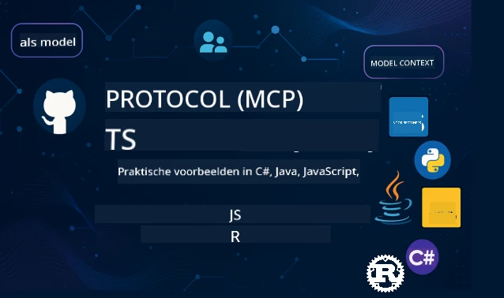

 

[](https://GitHub.com/microsoft/mcp-for-beginners/graphs/contributors)
[](https://GitHub.com/microsoft/mcp-for-beginners/issues)
[](https://GitHub.com/microsoft/mcp-for-beginners/pulls)
[](http://makeapullrequest.com)

[](https://GitHub.com/microsoft/mcp-for-beginners/watchers)
[](https://GitHub.com/microsoft/mcp-for-beginners/fork)
[](https://GitHub.com/microsoft/mcp-for-beginners/stargazers)


[](https://discord.gg/nTYy5BXMWG)

Volg deze stappen om te beginnen met deze bronnen:
1. **Fork de Repository**: Klik [](https://GitHub.com/microsoft/mcp-for-beginners/fork)
2. **Clone de Repository**:   `git clone https://github.com/microsoft/mcp-for-beginners.git`
3. **Word lid van de** [](https://discord.gg/nTYy5BXMWG)


### 🌐 Meertalige Ondersteuning

#### Ondersteund via GitHub Action (Automatisch & Altijd Up-to-Date)

<!-- CO-OP TRANSLATOR LANGUAGES TABLE START -->
[Arabisch](../ar/README.md) | [Bengaals](../bn/README.md) | [Bulgaars](../bg/README.md) | [Birmaans (Myanmar)](../my/README.md) | [Chinees (Vereenvoudigd)](../zh-CN/README.md) | [Chinees (Traditioneel, Hong Kong)](../zh-HK/README.md) | [Chinees (Traditioneel, Macau)](../zh-MO/README.md) | [Chinees (Traditioneel, Taiwan)](../zh-TW/README.md) | [Kroatisch](../hr/README.md) | [Tsjechisch](../cs/README.md) | [Deens](../da/README.md) | [Nederlands](./README.md) | [Ests](../et/README.md) | [Fins](../fi/README.md) | [Frans](../fr/README.md) | [Duits](../de/README.md) | [Grieks](../el/README.md) | [Hebreeuws](../he/README.md) | [Hindi](../hi/README.md) | [Hongaars](../hu/README.md) | [Indonesisch](../id/README.md) | [Italiaans](../it/README.md) | [Japans](../ja/README.md) | [Kannada](../kn/README.md) | [Koreaans](../ko/README.md) | [Litouws](../lt/README.md) | [Maleis](../ms/README.md) | [Malayalam](../ml/README.md) | [Marathi](../mr/README.md) | [Nepalees](../ne/README.md) | [Nigerian Pidgin](../pcm/README.md) | [Noors](../no/README.md) | [Perzisch (Farsi)](../fa/README.md) | [Pools](../pl/README.md) | [Portugees (Brazilië)](../pt-BR/README.md) | [Portugees (Portugal)](../pt-PT/README.md) | [Punjabi (Gurmukhi)](../pa/README.md) | [Roemeens](../ro/README.md) | [Russisch](../ru/README.md) | [Servisch (Cyrillisch)](../sr/README.md) | [Slowaaks](../sk/README.md) | [Sloveens](../sl/README.md) | [Spaans](../es/README.md) | [Swahili](../sw/README.md) | [Zweeds](../sv/README.md) | [Tagalog (Filipijns)](../tl/README.md) | [Tamil](../ta/README.md) | [Telugu](../te/README.md) | [Thais](../th/README.md) | [Turks](../tr/README.md) | [Oekraïens](../uk/README.md) | [Urdu](../ur/README.md) | [Vietnamees](../vi/README.md)

> **Liever lokaal klonen?**
>
> Deze repository bevat 50+ vertalingen wat de downloadgrootte aanzienlijk vergroot. Om zonder vertalingen te klonen, gebruik een sparse checkout:
>
> **Bash / macOS / Linux:**
> ```bash
> git clone --filter=blob:none --sparse https://github.com/microsoft/mcp-for-beginners.git
> cd mcp-for-beginners
> git sparse-checkout set --no-cone '/*' '!translations' '!translated_images'
> ```
>
> **CMD (Windows):**
> ```cmd
> git clone --filter=blob:none --sparse https://github.com/microsoft/mcp-for-beginners.git
> cd mcp-for-beginners
> git sparse-checkout set --no-cone "/*" "!translations" "!translated_images"
> ```
>
> Dit geeft je alles wat je nodig hebt om de cursus te voltooien met een veel snellere download.
<!-- CO-OP TRANSLATOR LANGUAGES TABLE END -->

# 🚀 Model Context Protocol (MCP) Curriculum voor Beginners

## **Leer MCP met hands-on codevoorbeelden in C#, Java, JavaScript, Rust, Python en TypeScript**

## 🧠 Overzicht van het Model Context Protocol Curriculum
Welkom op jouw reis in het Model Context Protocol! Als je ooit hebt afgevraagd hoe AI-toepassingen communiceren met verschillende tools en diensten, sta je op het punt de elegante oplossing te ontdekken die ontwikkelaars helpt intelligente systemen te bouwen.

Zie MCP als een universele vertaler voor AI-toepassingen – net zoals USB-poorten je toestaan om elk apparaat op je computer aan te sluiten, laat MCP AI-modellen toe om met elke tool of dienst op een gestandaardiseerde manier te verbinden. Of je nu je eerste chatbot bouwt of werkt aan complexe AI-workflows, het begrijpen van MCP geeft je de kracht om capabelere en flexibelere applicaties te maken.

Dit curriculum is met geduld en zorg ontworpen voor jouw leerproces. We beginnen met eenvoudige concepten die je al kent en bouwen geleidelijk je expertise op met praktische oefening in je favoriete programmeertaal. Elke stap bevat duidelijke uitleg, praktische voorbeelden en veel aanmoediging onderweg.

Tegen de tijd dat je deze reis hebt voltooid, heb je het vertrouwen om je eigen MCP-servers te bouwen, deze te integreren met populaire AI-platforms en te begrijpen hoe deze technologie de toekomst van AI-ontwikkeling hervormt. Laten we samen dit spannende avontuur beginnen!

### Officiële Documentatie en Specificaties

Dit curriculum is afgestemd op **MCP Specificatie 2025-11-25** (de nieuwste stabiele versie). De MCP-specificatie gebruikt datumgebaseerde versiebeheer (YYYY-MM-DD-formaat) voor duidelijke tracking van protocolversies.

Deze bronnen worden waardevoller naarmate je meer begrijpt, maar voel je niet gedwongen alles meteen te lezen. Begin met de gebieden die jou het meest interesseren!
- 📘 [MCP Documentatie](https://modelcontextprotocol.io/) – Dit is jouw hoofdhulpbron met stapsgewijze tutorials en gebruikershandleidingen. De documentatie is geschreven voor beginners en biedt heldere voorbeelden die je in je eigen tempo kunt volgen.
- 📜 [MCP Specificatie](https://modelcontextprotocol.io/specification/2025-11-25) – Zie dit als je uitgebreide referentiehandleiding. Naarmate je het curriculum doorloopt, zul je hier vaak terugkeren om specifieke details op te zoeken en geavanceerde functies te verkennen.
- 📜 [MCP Specificatie Versiebeheer](https://modelcontextprotocol.io/specification/versioning) – Bevat informatie over de geschiedenis van protocolversies en hoe MCP datumgebaseerd versiebeheer toepast (YYYY-MM-DD-formaat).
- 🧑‍💻 [MCP GitHub Repository](https://github.com/modelcontextprotocol) – Hier vind je SDK's, tools en codevoorbeelden in meerdere programmeertalen. Het is een schatkamer van praktische voorbeelden en direct bruikbare componenten.
- 🌐 [MCP Community](https://github.com/orgs/modelcontextprotocol/discussions) – Sluit je aan bij mede-leerlingen en ervaren ontwikkelaars in discussies over MCP. Het is een ondersteunende community waar vragen welkom zijn en kennis vrij wordt gedeeld.
  
## Leerdoelen

Aan het einde van dit curriculum voel je je zelfverzekerd en enthousiast over je nieuwe vaardigheden. Dit bereik je:

• **Begrijp MCP-kennis**: Je krijgt inzicht in wat het Model Context Protocol is en waarom het AI-toepassingen helpt beter samen te werken, met analogieën en voorbeelden die helder zijn.

• **Bouw je eerste MCP-server**: Je maakt een werkende MCP-server in je favoriete programmeertaal, beginnend met eenvoudige voorbeelden en groeispoten stap voor stap.

• **Verbind AI-modellen met echte tools**: Je leert de kloof over tebruggen tussen AI-modellen en daadwerkelijke services, waarmee je applicaties krachtige nieuwe mogelijkheden krijgen.

• **Pas beveiligingspraktijken toe**: Je begrijpt hoe je je MCP-implementaties veilig houdt, zodat zowel je applicaties als gebruikers beschermd zijn.

• **Implementeer met vertrouwen**: Je weet hoe je je MCP-projecten van ontwikkeling naar productie brengt, met praktische implementatiestrategieën die in de echte wereld werken.

• **Word lid van de MCP-community**: Je sluit je aan bij een groeiende gemeenschap van ontwikkelaars die de toekomst van AI-ontwikkeling vormgeven.

## Essentiële achtergrond

Voordat we ingaan op MCP-specifieke details, zorgen we ervoor dat je vertrouwd bent met enkele basisconcepten. Maak je geen zorgen als je geen expert bent — we leggen alles uit wat je nodig hebt!

### Begrip van protocollen (de basis)

Zie een protocol als de regels voor een gesprek. Als je een vriend belt, weet je beiden dat je “hallo” zegt bij opnemen, om de beurt spreekt en “dag” zegt als het klaar is. Computerprogramma’s hebben soortgelijke regels nodig om effectief te communiceren.

MCP is een protocol – een set afgesproken regels die AI-modellen en applicaties helpen productief "te praten" met tools en diensten. Net zoals gespreksregels menselijke communicatie vloeiender maken, maakt MCP communicatie tussen AI-applicaties betrouwbaarder en krachtiger.

### Client-server relaties (hoe programma’s samenwerken)

Je gebruikt client-server relaties elke dag! Wanneer je een webbrowser (de client) gebruikt om een website te bezoeken, maak je verbinding met een webserver die de pagina inhoud stuurt. De browser weet hoe hij informatie moet opvragen, en de server weet hoe hij moet antwoorden.

In MCP hebben we een vergelijkbare relatie: AI-modellen fungeren als clients die informatie of acties opvragen, terwijl MCP-servers die mogelijkheden bieden. Het is alsof je een behulpzame assistent (de server) hebt die AI specifieke taken uit kan laten voeren.

### Waarom standaardisatie belangrijk is (samenwerken mogelijk maken)

Stel je voor dat elke autofabrikant een ander gevormde benzinepomp zou gebruiken – dan zou je voor elke auto een andere adapter nodig hebben! Standaardisatie betekent het eens worden over gemeenschappelijke aanpakken, zodat dingen naadloos samenwerken.

MCP biedt deze standaardisatie voor AI-toepassingen. In plaats van dat elk AI-model aangepaste code nodig heeft voor elke tool, creëert MCP een universele communicatie manier. Dit betekent dat ontwikkelaars tools één keer kunnen bouwen en die met veel verschillende AI-systemen laten werken.

## 🧭 Overzicht van jouw leertraject

Jouw MCP-reis is zorgvuldig gestructureerd om je vertrouwen en vaardigheden progressief op te bouwen. Elke fase introduceert nieuwe concepten en versterkt wat je al geleerd hebt.

### 🌱 Basisfase: Begrijpen van de basis (Modules 0-2)

Hier begint je avontuur! We introduceren MCP-concepten met vertrouwde analogieën en eenvoudige voorbeelden. Je begrijpt wat MCP is, waarom het bestaat en hoe het past in de bredere wereld van AI-ontwikkeling.

• **Module 0 - Introductie tot MCP**: We beginnen met het verkennen van wat MCP is en waarom het zo belangrijk is voor moderne AI-toepassingen. Je ziet praktische voorbeelden van MCP in actie en begrijpt hoe het veelvoorkomende problemen van ontwikkelaars oplost.

• **Module 1 - Kernconcepten uitgelegd**: Hier leer je de essentiële bouwstenen van MCP. We gebruiken veel analogieën en visuele voorbeelden om ervoor te zorgen dat deze concepten natuurlijk en begrijpelijk aanvoelen.

• **Module 2 - Beveiliging in MCP**: Beveiliging klinkt misschien intimiderend, maar we laten zien hoe MCP ingebouwde veiligheidsfuncties heeft en leren je best practices die je applicaties vanaf het begin beschermen.

### 🔨 Bouwfase: Je eerste implementaties maken (Module 3)

Nu begint het echte plezier! Je krijgt praktische ervaring met het bouwen van echte MCP-servers en clients. Geen zorgen – we beginnen eenvoudig en begeleiden je bij elke stap.
Deze module bevat meerdere hands-on handleidingen waarmee je kunt oefenen in je favoriete programmeertaal. Je maakt je eerste server, bouwt een client die verbinding maakt met die server, en integreert zelfs met populaire ontwikkeltools zoals VS Code.

Elke handleiding bevat volledige codevoorbeelden, tips voor probleemoplossing en uitleg waarom we bepaalde ontwerpkeuzes maken. Aan het einde van deze fase heb je werkende MCP-implementaties waar je trots op kunt zijn!

### 🚀 Groei Fase: Gevorderde Concepten en Toepassingen uit de Praktijk (Modules 4-5)

Met de basis onder de knie, ben je klaar om meer geavanceerde MCP-functies te verkennen. We behandelen praktische implementatiestrategieën, debuggingtechnieken en geavanceerde onderwerpen zoals multimodale AI-integratie.

Je leert ook hoe je je MCP-implementaties kunt opschalen voor productiegebruik en hoe je integreert met cloudplatforms zoals Azure. Deze modules bereiden je voor om MCP-oplossingen te bouwen die voldoen aan de eisen uit de praktijk.

### 🌟 Meesterschapsfase: Community en Specialisatie (Modules 6-11)

De laatste fase richt zich op het deelnemen aan de MCP-community en specialiseren in gebieden die je het meest interesseren. Je leert hoe je bijdraagt aan open-source MCP-projecten, geavanceerde authenticatiepatronen implementeert en uitgebreide oplossingen bouwt die geïntegreerd zijn met databases.

Module 11 verdient een speciale vermelding - het is een complete 13-labs hands-on leerroute die je leert productieklare MCP-servers te bouwen met PostgreSQL-integratie. Het is als een slotproject dat alles wat je geleerd hebt samenbrengt!

### 📚 Volledige Curriculumstructuur

| Module | Onderwerp | Beschrijving | Link |
|--------|----------|--------------|------|
| **Module 0-3: Basisprincipes** | | | |
| 00 | Introductie tot MCP | Overzicht van het Model Context Protocol en het belang ervan in AI-pijplijnen | [Lees meer](./00-Introduction/README.md) |
| 01 | Kernconcepten uitgelegd | Diepgaande verkenning van kernconcepten van MCP | [Lees meer](./01-CoreConcepts/README.md) |
| 02 | Beveiliging in MCP | Beveiligingsbedreigingen en best practices | [Lees meer](./02-Security/README.md) |
| 03 | Aan de slag met MCP | Omgevingsinstelling, basisservers/clients, integratie | [Lees meer](./03-GettingStarted/README.md) |
| **Module 3: Je eerste server & client bouwen** | | | |
| 3.1 | Eerste server | Maak je eerste MCP-server | [Handleiding](./03-GettingStarted/01-first-server/README.md) |
| 3.2 | Eerste client | Ontwikkel een basis MCP-client | [Handleiding](./03-GettingStarted/02-client/README.md) |
| 3.3 | Client met LLM | Integreer grote taalmodellen | [Handleiding](./03-GettingStarted/03-llm-client/README.md) |
| 3.4 | VS Code-integratie | Gebruik MCP-servers in VS Code | [Handleiding](./03-GettingStarted/04-vscode/README.md) |
| 3.5 | stdio-server | Maak servers met stdio transport | [Handleiding](./03-GettingStarted/05-stdio-server/README.md) |
| 3.6 | HTTP-streaming | Implementeer HTTP-streaming in MCP | [Handleiding](./03-GettingStarted/06-http-streaming/README.md) |
| 3.7 | AI Toolkit | Gebruik AI Toolkit met MCP | [Handleiding](./03-GettingStarted/07-aitk/README.md) |
| 3.8 | Testen | Test je MCP-serverimplementatie | [Handleiding](./03-GettingStarted/08-testing/README.md) |
| 3.9 | Uitrol | Zet MCP-servers in productie | [Handleiding](./03-GettingStarted/09-deployment/README.md) |
| 3.10 | Geavanceerd servergebruik | Gebruik geavanceerde servers voor geavanceerde functies en verbeterde architectuur | [Handleiding](./03-GettingStarted/10-advanced/README.md) |
| 3.11 | Eenvoudige authenticatie | Een hoofdstuk dat je vanaf het begin auth en RBAC laat zien | [Handleiding](./03-GettingStarted/11-simple-auth/README.md) |
| 3.12 | MCP Hosts | Configureer Claude Desktop, Cursor, Cline en andere MCP-hosts | [Handleiding](./03-GettingStarted/12-mcp-hosts/README.md) |
| 3.13 | MCP Inspector | Debug en test MCP-servers met de Inspector tool | [Handleiding](./03-GettingStarted/13-mcp-inspector/README.md) |
| 3.14 | Sampling | Gebruik sampling om samen te werken met de client | [Handleiding](./03-GettingStarted/14-sampling/README.md) |
| **Module 4-5: Praktisch & Geavanceerd** | | | |
| 04 | Praktische implementatie | SDK's, debugging, testen, herbruikbare prompttemplates | [Lees meer](./04-PracticalImplementation/README.md) |
| 4.1 | Paginering | Omgaan met grote resultaatsets met cursor-gebaseerde paginering | [Handleiding](./04-PracticalImplementation/pagination/README.md) |
| 05 | Geavanceerde onderwerpen in MCP | Multimodale AI, opschalen, gebruik in ondernemingen | [Lees meer](./05-AdvancedTopics/README.md) |
| 5.1 | Azure-integratie | MCP-integratie met Azure | [Handleiding](./05-AdvancedTopics/mcp-integration/README.md) |
| 5.2 | Multimodaliteit | Werken met meerdere modaliteiten | [Handleiding](./05-AdvancedTopics/mcp-multi-modality/README.md) |
| 5.3 | OAuth2-demo | OAuth2-authenticatie implementeren | [Handleiding](./05-AdvancedTopics/mcp-oauth2-demo/README.md) |
| 5.4 | Root Contexts | Begrijp en implementeer root contexts | [Handleiding](./05-AdvancedTopics/mcp-root-contexts/README.md) |
| 5.5 | Routing | MCP-routingstrategieën | [Handleiding](./05-AdvancedTopics/mcp-routing/README.md) |
| 5.6 | Sampling | Samplingtechnieken in MCP | [Handleiding](./05-AdvancedTopics/mcp-sampling/README.md) |
| 5.7 | Opschalen | Schaal MCP-implementaties op | [Handleiding](./05-AdvancedTopics/mcp-scaling/README.md) |
| 5.8 | Beveiliging | Geavanceerde beveiligingsoverwegingen | [Handleiding](./05-AdvancedTopics/mcp-security/README.md) |
| 5.9 | Websearch | Implementeer webzoekfuncties | [Handleiding](./05-AdvancedTopics/web-search-mcp/README.md) |
| 5.10 | Realtime streaming | Bouw realtime streaming-functionaliteit | [Handleiding](./05-AdvancedTopics/mcp-realtimestreaming/README.md) |
| 5.11 | Realtime zoeken | Implementeer realtime zoeken | [Handleiding](./05-AdvancedTopics/mcp-realtimesearch/README.md) |
| 5.12 | Entra ID-authenticatie | Authenticatie met Microsoft Entra ID | [Handleiding](./05-AdvancedTopics/mcp-security-entra/README.md) |
| 5.13 | Foundry-integratie | Integreer met Azure AI Foundry | [Handleiding](./05-AdvancedTopics/mcp-foundry-agent-integration/README.md) |
| 5.14 | Context-engineering | Technieken voor effectieve context-engineering | [Handleiding](./05-AdvancedTopics/mcp-contextengineering/README.md) |
| 5.15 | MCP Custom Transport | Implementaties van Custom Transport | [Handleiding](./05-AdvancedTopics/mcp-transport/README.md) |
| 5.16 | Protocolfuncties | Voortgangsnotificaties, annulering, resourcetemplates | [Handleiding](./05-AdvancedTopics/mcp-protocol-features/README.md) |
| **Module 6-10: Community & Best Practices** | | | |
| 06 | Communitybijdragen | Hoe bij te dragen aan het MCP-ecosysteem | [Handleiding](./06-CommunityContributions/README.md) |
| 07 | Inzichten uit vroege adoptie | Verhalen over implementaties uit de praktijk | [Handleiding](./07-LessonsfromEarlyAdoption/README.md) |
| 08 | Best practices voor MCP | Prestaties, fouttolerantie, veerkracht | [Handleiding](./08-BestPractices/README.md) |
| 09 | MCP casestudies | Voorbeelden van praktische implementaties | [Handleiding](./09-CaseStudy/README.md) |
| 10 | Hands-on workshop | Bouwen van een MCP-server met AI Toolkit | [Lab](./10-StreamliningAIWorkflowsBuildingAnMCPServerWithAIToolkit/README.md) |
| **Module 11: MCP Server Hands On Lab** | | | |
| 11 | MCP Server database-integratie | Uitgebreide 13-labs hands-on leerroute voor PostgreSQL-integratie | [Labs](./11-MCPServerHandsOnLabs/README.md) |
| 11.1 | Introductie | Overzicht van MCP met database-integratie en use case retail analytics | [Lab 00](./11-MCPServerHandsOnLabs/00-Introduction/README.md) |
| 11.2 | Kernarchitectuur | Begrip van MCP-serverarchitectuur, databaselagen en beveiligingspatronen | [Lab 01](./11-MCPServerHandsOnLabs/01-Architecture/README.md) |
| 11.3 | Beveiliging & multi-tenancy | Row Level Security, authenticatie en multi-tenant data toegang | [Lab 02](./11-MCPServerHandsOnLabs/02-Security/README.md) |
| 11.4 | Omgevingsinstelling | Ontwikkelomgeving instellen, Docker, Azure-resources | [Lab 03](./11-MCPServerHandsOnLabs/03-Setup/README.md) |
| 11.5 | Databaseontwerp | PostgreSQL installatie, retail schema ontwerp en voorbeeldgegevens | [Lab 04](./11-MCPServerHandsOnLabs/04-Database/README.md) |
| 11.6 | MCP Server-implementatie | Bouwen van de FastMCP-server met database-integratie | [Lab 05](./11-MCPServerHandsOnLabs/05-MCP-Server/README.md) |
| 11.7 | Toolontwikkeling | Maken van database-querytools en schema introspectie | [Lab 06](./11-MCPServerHandsOnLabs/06-Tools/README.md) |
| 11.8 | Semantisch zoeken | Implementeer vector embeddings met Azure OpenAI en pgvector | [Lab 07](./11-MCPServerHandsOnLabs/07-Semantic-Search/README.md) |
| 11.9 | Testen & debuggen | Teststrategieën, debuggingtools en validatiebenaderingen | [Lab 08](./11-MCPServerHandsOnLabs/08-Testing/README.md) |
| 11.10 | VS Code-integratie | Configureren van VS Code MCP-integratie en AI Chat-gebruik | [Lab 09](./11-MCPServerHandsOnLabs/09-VS-Code/README.md) |
| 11.11 | Uitrolstrategieën | Docker-implementatie, Azure Container Apps, en schaaloverwegingen | [Lab 10](./11-MCPServerHandsOnLabs/10-Deployment/README.md) |
| 11.12 | Monitoring | Application Insights, logging, prestatiemonitoring | [Lab 11](./11-MCPServerHandsOnLabs/11-Monitoring/README.md) |
| 11.13 | Best practices | Prestatieoptimalisatie, beveiligingsversterking en productietips | [Lab 12](./11-MCPServerHandsOnLabs/12-Best-Practices/README.md) |

### 💻 Voorbeelden van codeprojecten

Een van de meest spannende onderdelen van het leren van MCP is het zien van je codeervaardigheden die zich geleidelijk ontwikkelen. We hebben onze codevoorbeelden zo ontworpen dat ze eenvoudig beginnen en steeds geavanceerder worden naarmate je kennis groeit. Zo introduceren we concepten - met code die makkelijk te begrijpen is maar echte MCP-principes demonstreert, begrijp je niet alleen wat deze code doet, maar ook waarom het zo is opgezet en hoe het past in grotere MCP-toepassingen.

#### Basisvoorbeelden van MCP-calculators

| Taal | Beschrijving | Link |
|-------|-------------|------|
| C# | MCP-servervoorbeeld | [Bekijk code](./03-GettingStarted/samples/csharp/README.md) |
| Java | MCP-calculator | [Bekijk code](./03-GettingStarted/samples/java/calculator/README.md) |
| JavaScript | MCP-demo | [Bekijk code](./03-GettingStarted/samples/javascript/README.md) |
| Python | MCP-server | [Bekijk code](../../03-GettingStarted/samples/python/mcp_calculator_server.py) |
| TypeScript | MCP-voorbeeld | [Bekijk code](./03-GettingStarted/samples/typescript/README.md) |
| Rust | MCP-voorbeeld | [Bekijk code](./03-GettingStarted/samples/rust/README.md) |

#### Geavanceerde MCP-implementaties

| Taal | Beschrijving | Link |
|-------|-------------|------|
| C# | Geavanceerd voorbeeld | [Bekijk code](./04-PracticalImplementation/samples/csharp/README.md) |
| Java met Spring | Container app voorbeeld | [Bekijk code](./04-PracticalImplementation/samples/java/containerapp/README.md) |
| JavaScript | Geavanceerd voorbeeld | [Bekijk code](./04-PracticalImplementation/samples/javascript/README.md) |
| Python | Complexe implementatie | [Bekijk code](./04-PracticalImplementation/samples/python/README.md) |
| TypeScript | Container voorbeeld | [Bekijk code](./04-PracticalImplementation/samples/typescript/README.md) |


## 🎯 Vereisten voor het leren van MCP

Om het meeste uit dit curriculum te halen, moet je beschikken over:
- Basiskennis van programmeren in ten minste één van de volgende talen: C#, Java, JavaScript, Python of TypeScript
- Begrip van het client-servermodel en API's
- Vertrouwdheid met REST- en HTTP-concepten
- (Optioneel) Achtergrond in AI/ML-concepten

- Deelname aan onze communitydiscussies voor ondersteuning

## 📚 Studiegids & Bronnen

Deze repository bevat verschillende bronnen om je te helpen effectief te navigeren en te leren:

### Studiegids

Een uitgebreide [Studiegids](./study_guide.md) is beschikbaar om je te helpen deze repository effectief te gebruiken. Deze visuele curriculumkaart toont hoe alle onderwerpen met elkaar verbonden zijn en geeft richtlijnen over hoe je de voorbeeldprojecten effectief kunt gebruiken. Het is vooral handig als je een visuele leerling bent die graag het overzicht ziet.

De gids bevat:
- Een visuele curriculumkaart met alle behandelde onderwerpen
- Gedetailleerde uitsplitsing van elk sectie van de repository
- Richtlijnen voor het gebruik van voorbeeldprojecten
- Aanbevolen leerpaden voor verschillende vaardigheidsniveaus
- Aanvullende bronnen ter ondersteuning van je leertraject

### Wijzigingslog

We onderhouden een gedetailleerde [Wijzigingslog](./changelog.md) die alle belangrijke updates van het curriculummateriaal bijhoudt, zodat je op de hoogte blijft van de nieuwste verbeteringen en aanvullingen.
- Toevoegingen van nieuwe inhoud
- Structurele wijzigingen
- Verbeteringen van functies
- Updates van documentatie

## 🛠️ Hoe dit Curriculum Effectief te Gebruiken

Elke les in deze gids bevat:

1. Duidelijke uitleg van MCP-concepten  
2. Live codevoorbeelden in meerdere talen  
3. Oefeningen om echte MCP-applicaties te bouwen  
4. Extra bronnen voor gevorderde leerlingen

### Laten we MCP leren met C# - Tutorialserie
Laten we meer leren over het Model Context Protocol (MCP), een geavanceerd raamwerk dat is ontworpen om interacties tussen AI-modellen en client-applicaties te standaardiseren. Via deze beginnende-vriendelijke sessie introduceren we je in MCP en begeleiden we je bij het maken van je eerste MCP-server.
#### C#: [https://aka.ms/letslearnmcp-csharp](https://aka.ms/letslearnmcp-csharp)
#### Java: [https://aka.ms/letslearnmcp-java](https://aka.ms/letslearnmcp-java)
#### JavaScript: [https://aka.ms/letslearnmcp-javascript](https://aka.ms/letslearnmcp-javascript)
#### Python: [https://aka.ms/letslearnmcp-python](https://aka.ms/letslearnmcp-python)

## 🎓 Je MCP-reis Begint

Gefeliciteerd! Je hebt zojuist de eerste stap gezet in een spannende reis die je programmeervaardigheden zal uitbreiden en je zal verbinden met de voorhoede van AI-ontwikkeling.

### Wat Je Al Hebt Bereikt

Door deze introductie te lezen, ben je al begonnen met het opbouwen van je MCP-kennisbasis. Je begrijpt wat MCP is, waarom het belangrijk is, en hoe dit curriculum je leertraject zal ondersteunen. Dat is een belangrijke prestatie en het begin van je expertise in deze belangrijke technologie.

### Het Avontuur dat Voor je Ligt

Terwijl je door de modules vordert, bedenk dan dat elke expert ooit een beginner was. De concepten die nu misschien complex lijken, zullen vanzelfsprekend worden naarmate je oefent en ze toepast. Elke kleine stap bouwt aan krachtige vaardigheden die je je hele ontwikkelingscarrière zullen dienen.

### Je Ondersteuningsnetwerk

Je sluit je aan bij een gemeenschap van leerlingen en experts die gepassioneerd zijn over MCP en graag anderen helpen slagen. Of je nu vastzit bij een codeeruitdaging of enthousiast bent om een doorbraak te delen, de community is er om je te ondersteunen.

Als je vastloopt of vragen hebt over het bouwen van AI-apps, doe mee met andere leerlingen en ervaren ontwikkelaars in discussies over MCP. Het is een ondersteunende community waar vragen welkom zijn en kennis vrij gedeeld wordt.

[](https://discord.gg/nTYy5BXMWG)

Als je feedback over het product hebt of fouten tegenkomt bij het bouwen, bezoek:

[](https://aka.ms/foundry/forum)

### Klaar om te Beginnen?

Je MCP-avontuur begint nu! Begin met Module 0 om aan je eerste hands-on MCP-ervaring te beginnen, of verken de voorbeeldprojecten om te zien wat je gaat bouwen. Onthoud - elke expert is precies daar begonnen waar jij nu bent, en met geduld en oefening zul je versteld staan van wat je kunt bereiken.

Welkom in de wereld van Model Context Protocol-ontwikkeling. Laten we samen iets geweldigs bouwen!

## 🤝 Bijdragen aan de Leercommunity

Dit curriculum wordt sterker door bijdragen van leerlingen zoals jij! Of je nu een typfout corrigeert, een duidelijkere uitleg voorstelt of een nieuw voorbeeld toevoegt, jouw bijdragen helpen andere beginners slagen.

Dank aan Microsoft Valued Professional [Shivam Goyal](https://www.linkedin.com/in/shivam2003/) voor het bijdragen van codevoorbeelden.

Het bijdrageproces is ontworpen om gastvrij en ondersteunend te zijn. De meeste bijdragen vereisen een Contributor License Agreement (CLA), maar de geautomatiseerde tools begeleiden je soepel door het proces.

## 📜 Open Source Leren

Dit hele curriculum is beschikbaar onder de MIT [LICENSE](../../LICENSE), wat betekent dat je het vrij kunt gebruiken, aanpassen en delen. Dit ondersteunt onze missie om MCP-kennis toegankelijk te maken voor ontwikkelaars overal.
## 🤝 Richtlijnen voor Bijdragen

Dit project verwelkomt bijdragen en suggesties. De meeste bijdragen vereisen dat je akkoord gaat met een
Contributor License Agreement (CLA) waarin je verklaart dat je het recht hebt en daadwerkelijk de rechten verleent
om je bijdrage te gebruiken. Voor details, bezoek <https://cla.opensource.microsoft.com>.

Wanneer je een pull request indient, bepaalt een CLA-bot automatisch of je een
CLA moet aanleveren en wordt de PR dienovereenkomstig gemarkeerd (bijvoorbeeld statuscontrole, opmerking). Volg gewoon de instructies
van de bot. Je hoeft dit maar één keer te doen voor alle repos die onze CLA gebruiken.

Dit project heeft de [Microsoft Open Source Code of Conduct](https://opensource.microsoft.com/codeofconduct/) aangenomen.
Voor meer informatie zie de [Code of Conduct FAQ](https://opensource.microsoft.com/codeofconduct/faq/) of neem contact op met
[opencode@microsoft.com](mailto:opencode@microsoft.com) voor extra vragen of opmerkingen.

---

*Klaar om aan je MCP-reis te beginnen? Start met [Module 00 - Introductie tot MCP](./00-Introduction/README.md) en zet je eerste stappen in de wereld van Model Context Protocol-ontwikkeling!*


## 🎒 Andere Cursussen
Ons team produceert ook andere cursussen! Bekijk:

<!-- CO-OP TRANSLATOR OTHER COURSES START -->
### LangChain
[](https://aka.ms/langchain4j-for-beginners)
[](https://aka.ms/langchainjs-for-beginners?WT.mc_id=m365-94501-dwahlin)
[](https://github.com/microsoft/langchain-for-beginners?WT.mc_id=m365-94501-dwahlin)
---

### Azure / Edge / MCP / Agents
[](https://github.com/microsoft/AZD-for-beginners?WT.mc_id=academic-105485-koreyst)
[](https://github.com/microsoft/edgeai-for-beginners?WT.mc_id=academic-105485-koreyst)
[](https://github.com/microsoft/mcp-for-beginners?WT.mc_id=academic-105485-koreyst)
[](https://github.com/microsoft/ai-agents-for-beginners?WT.mc_id=academic-105485-koreyst)

---
 
### Generatieve AI-serie
[](https://github.com/microsoft/generative-ai-for-beginners?WT.mc_id=academic-105485-koreyst)
[-9333EA?style=for-the-badge&labelColor=E5E7EB&color=9333EA)](https://github.com/microsoft/Generative-AI-for-beginners-dotnet?WT.mc_id=academic-105485-koreyst)
[-C084FC?style=for-the-badge&labelColor=E5E7EB&color=C084FC)](https://github.com/microsoft/generative-ai-for-beginners-java?WT.mc_id=academic-105485-koreyst)
[-E879F9?style=for-the-badge&labelColor=E5E7EB&color=E879F9)](https://github.com/microsoft/generative-ai-with-javascript?WT.mc_id=academic-105485-koreyst)

---
 
### Kernleren
[](https://aka.ms/ml-beginners?WT.mc_id=academic-105485-koreyst)
[](https://aka.ms/datascience-beginners?WT.mc_id=academic-105485-koreyst)
[](https://aka.ms/ai-beginners?WT.mc_id=academic-105485-koreyst)
[](https://github.com/microsoft/Security-101?WT.mc_id=academic-96948-sayoung)
[](https://aka.ms/webdev-beginners?WT.mc_id=academic-105485-koreyst)
[](https://aka.ms/iot-beginners?WT.mc_id=academic-105485-koreyst)
[](https://github.com/microsoft/xr-development-for-beginners?WT.mc_id=academic-105485-koreyst)

---
 
### Copilot-serie
[](https://aka.ms/GitHubCopilotAI?WT.mc_id=academic-105485-koreyst)
[](https://github.com/microsoft/mastering-github-copilot-for-dotnet-csharp-developers?WT.mc_id=academic-105485-koreyst)
[](https://github.com/microsoft/CopilotAdventures?WT.mc_id=academic-105485-koreyst)
<!-- CO-OP TRANSLATOR OTHER COURSES END -->

---

<!-- CO-OP TRANSLATOR DISCLAIMER START -->
**Disclaimer**:
Dit document is vertaald met behulp van de AI-vertalingsdienst [Co-op Translator](https://github.com/Azure/co-op-translator). Hoewel we streven naar nauwkeurigheid, dient u er rekening mee te houden dat automatische vertalingen fouten of onnauwkeurigheden kunnen bevatten. Het oorspronkelijke document in de oorspronkelijke taal moet worden beschouwd als de gezaghebbende bron. Voor kritieke informatie wordt professionele menselijke vertaling aanbevolen. Wij zijn niet aansprakelijk voor eventuele misverstanden of verkeerde interpretaties die voortvloeien uit het gebruik van deze vertaling.
<!-- CO-OP TRANSLATOR DISCLAIMER END -->