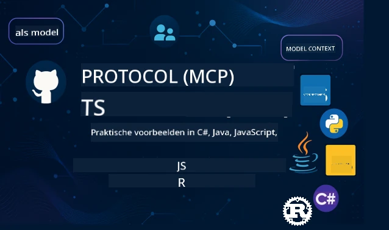

 

[](https://GitHub.com/microsoft/mcp-for-beginners/graphs/contributors)
[](https://GitHub.com/microsoft/mcp-for-beginners/issues)
[](https://GitHub.com/microsoft/mcp-for-beginners/pulls)
[](http://makeapullrequest.com)
[](https://mcptoplist.com/server/mcp.so%2Fmcp-for-beginners%2Fmicrosoft)

[](https://GitHub.com/microsoft/mcp-for-beginners/watchers)
[](https://GitHub.com/microsoft/mcp-for-beginners/fork)
[](https://GitHub.com/microsoft/mcp-for-beginners/stargazers)


[](https://discord.gg/nTYy5BXMWG)

Volg deze stappen om aan de slag te gaan met deze bronnen:
1. **Fork de repository**: Klik op [](https://GitHub.com/microsoft/mcp-for-beginners/fork)
2. **Clone de repository**:   `git clone https://github.com/microsoft/mcp-for-beginners.git`
3. **Word lid van de** [](https://discord.gg/nTYy5BXMWG)


### 🌐 Meertalige ondersteuning

#### Ondersteund via GitHub Action (Geautomatiseerd & Altijd Up-to-Date)

<!-- CO-OP TRANSLATOR LANGUAGES TABLE START -->
[Arabisch](../ar/README.md) | [Bengaals](../bn/README.md) | [Bulgaars](../bg/README.md) | [Birmaans (Myanmar)](../my/README.md) | [Chinees (Vereenvoudigd)](../zh-CN/README.md) | [Chinees (Traditioneel, Hong Kong)](../zh-HK/README.md) | [Chinees (Traditioneel, Macau)](../zh-MO/README.md) | [Chinees (Traditioneel, Taiwan)](../zh-TW/README.md) | [Kroatisch](../hr/README.md) | [Tsjechisch](../cs/README.md) | [Deens](../da/README.md) | [Nederlands](./README.md) | [Ests](../et/README.md) | [Fins](../fi/README.md) | [Frans](../fr/README.md) | [Duits](../de/README.md) | [Grieks](../el/README.md) | [Hebreeuws](../he/README.md) | [Hindi](../hi/README.md) | [Hongaars](../hu/README.md) | [Indonesisch](../id/README.md) | [Italiaans](../it/README.md) | [Japans](../ja/README.md) | [Kannada](../kn/README.md) | [Khmer](../km/README.md) | [Koreaans](../ko/README.md) | [Litouws](../lt/README.md) | [Maleis](../ms/README.md) | [Malayalam](../ml/README.md) | [Marathi](../mr/README.md) | [Nepalees](../ne/README.md) | [Nigeriaans Pidgin](../pcm/README.md) | [Noors](../no/README.md) | [Perzisch (Farsi)](../fa/README.md) | [Pools](../pl/README.md) | [Portugees (Brazilië)](../pt-BR/README.md) | [Portugees (Portugal)](../pt-PT/README.md) | [Punjabi (Gurmukhi)](../pa/README.md) | [Roemeens](../ro/README.md) | [Russisch](../ru/README.md) | [Servisch (Cyrillisch)](../sr/README.md) | [Slowaaks](../sk/README.md) | [Sloveens](../sl/README.md) | [Spaans](../es/README.md) | [Swahili](../sw/README.md) | [Zweeds](../sv/README.md) | [Tagalog (Filipijns)](../tl/README.md) | [Tamil](../ta/README.md) | [Telugu](../te/README.md) | [Thai](../th/README.md) | [Turks](../tr/README.md) | [Oekraïens](../uk/README.md) | [Urdu](../ur/README.md) | [Vietnamees](../vi/README.md)

> **Verkies je lokaal te clonen?**
>
> Deze repository bevat meer dan 50 taalvertalingen, wat de downloadgrootte aanzienlijk vergroot. Om zonder vertalingen te clonen, gebruik sparse checkout:
>
> **Bash / macOS / Linux:**
> ```bash
> git clone --filter=blob:none --sparse https://github.com/microsoft/mcp-for-beginners.git
> cd mcp-for-beginners
> git sparse-checkout set --no-cone '/*' '!translations' '!translated_images'
> ```
>
> **CMD (Windows):**
> ```cmd
> git clone --filter=blob:none --sparse https://github.com/microsoft/mcp-for-beginners.git
> cd mcp-for-beginners
> git sparse-checkout set --no-cone "/*" "!translations" "!translated_images"
> ```
>
> Dit geeft je alles wat je nodig hebt om de cursus te voltooien met een veel snellere download.
<!-- CO-OP TRANSLATOR LANGUAGES TABLE END -->

# 🚀 Model Context Protocol (MCP) Curriculum voor Beginners

## **Leer MCP met Hands-on Codevoorbeelden in C#, Java, JavaScript, Rust, Python en TypeScript**

## 🧠 Overzicht van het Model Context Protocol Curriculum
Welkom op je reis in het Model Context Protocol! Als je ooit hebt gewonderd hoe AI-toepassingen communiceren met verschillende tools en diensten, ontdek je nu de elegante oplossing die ontwikkelaars transformeert in het bouwen van intelligente systemen.

Zie MCP als een universele vertaler voor AI-toepassingen - net zoals USB-poorten je toestaan om elk apparaat aan je computer te koppelen, laat MCP AI-modellen toe om op gestandaardiseerde wijze verbinding te maken met elke tool of dienst. Of je nu je eerste chatbot bouwt of werkt aan complexe AI-workflows, het begrijpen van MCP geeft je de kracht om capabelere en flexibelere applicaties te creëren.

Dit curriculum is met geduld en zorg ontworpen voor je leertraject. We beginnen met eenvoudige concepten die je al kent en bouwen je expertise geleidelijk op via praktische oefeningen in je favoriete programmeertaal. Elke stap bevat duidelijke uitleg, praktische voorbeelden en veel aanmoediging onderweg.

Tegen de tijd dat je deze reis hebt voltooid, heb je het vertrouwen om je eigen MCP-servers te bouwen, ze te integreren met populaire AI-platformen, en te begrijpen hoe deze technologie de toekomst van AI-ontwikkeling vormgeeft. Laten we samen aan dit spannende avontuur beginnen!

### Officiële documentatie en specificaties

Dit curriculum is afgestemd op **MCP Specificatie 2025-11-25** (de laatste stabiele versie). De MCP-specificatie gebruikt datumgebaseerde versiebeheer (YYYY-MM-DD-formaat) om duidelijke protocolversietracking te waarborgen.

> **Vooruitkijkend:** een release candidate voor de volgende specificatieversie, **2026-07-28**, zal worden uitgebracht op 28 juli 2026. Het maakt het protocol stateloos op de transportlaag, formaliseert een extensiekader (MCP Apps, Tasks), versterkt autorisatie en schakelt Roots, Sampling en Logging uit. Zie [Wat verandert er in MCP: De 2026-07-28 Release Candidate](./01-CoreConcepts/mcp-2026-07-28-release-candidate.md) voor een volledige uitleg.

Deze bronnen worden waardevoller naarmate je begrip groeit, maar voel je niet onder druk gezet om alles meteen te lezen. Begin met de gebieden die je het meest interesseren!
- 📘 [MCP Documentatie](https://modelcontextprotocol.io/) – Dit is je go-to bron voor stapsgewijze tutorials en gebruikersgidsen. De documentatie is geschreven met beginners in gedachten, met duidelijke voorbeelden die je in je eigen tempo kunt volgen.
- 📜 [MCP Specificatie](https://modelcontextprotocol.io/specification/2025-11-25) – Zie dit als je uitgebreide handboek. Terwijl je door het curriculum werkt, zul je hier terugkomen om specifieke details op te zoeken en geavanceerde functies te verkennen.
- 📜 [MCP Specificatie Versiebeheer](https://modelcontextprotocol.io/specification/versioning) – Dit bevat informatie over de protocolversiegeschiedenis en hoe MCP datumgebaseerd versiebeheer toepast (YYYY-MM-DD-formaat).
- 🧑‍💻 [MCP GitHub Repository](https://github.com/modelcontextprotocol) – Hier vind je SDK's, tools en codevoorbeelden in meerdere programmeertalen. Het is als een schat aan praktische voorbeelden en kant-en-klare componenten.
- 🌐 [MCP Community](https://github.com/orgs/modelcontextprotocol/discussions) – Sluit je aan bij mede-lerenden en ervaren ontwikkelaars in discussies over MCP. Het is een ondersteunende gemeenschap waar vragen welkom zijn en kennis vrij wordt gedeeld.
  
## Leerdoelen

Aan het einde van dit curriculum voel je je zelfverzekerd en enthousiast over je nieuwe vaardigheden. Dit bereik je:

• **Begrijp MCP-grondbeginselen**: Je begrijpt wat het Model Context Protocol is en waarom het de manier waarop AI-applicaties samenwerken revolutioneert, met analogieën en voorbeelden die logisch zijn.

• **Bouw je eerste MCP-server**: Je maakt een werkende MCP-server in je voorkeursprogrammeertaal, beginnend met eenvoudige voorbeelden en je vaardigheden stap voor stap uitbreidend.

• **Verbind AI-modellen met echte tools**: Je leert de kloof te overbruggen tussen AI-modellen en echte diensten, waardoor je applicaties krachtige nieuwe mogelijkheden krijgen.

• **Voer beveiligingsbest practices uit**: Je begrijpt hoe je je MCP-implementaties veilig en beveiligd houdt, zodat je zowel je applicaties als gebruikers beschermt.

• **Implementeer met vertrouwen**: Je weet hoe je je MCP-projecten van ontwikkeling naar productie brengt, met praktische implementatiestrategieën die in de echte wereld werken.

• **Word lid van de MCP-community**: Je wordt deel van een groeiende gemeenschap van ontwikkelaars die de toekomst van AI-applicatieontwikkeling vormgeven.

## Essentiële achtergrond

Voordat we dieper ingaan op MCP-specifieke zaken, zorgen we ervoor dat je je comfortabel voelt met enkele basisconcepten. Maak je geen zorgen als je hier geen expert in bent - we leggen alles uit wat je moet weten terwijl we verder gaan!

### Begrijpen van protocollen (De basis)

Zie een protocol als de regels voor een gesprek. Wanneer je een vriend belt, weet je beiden dat je "hallo" zegt als je opneemt, om beurten spreekt, en "tot ziens" zegt als het gesprek voorbij is. Computerprogramma's hebben vergelijkbare regels nodig om effectief te communiceren.

MCP is een protocol - een set afgesproken regels die AI-modellen en applicaties helpt om productieve "gesprekken" te voeren met tools en diensten. Net zoals gesprekregels menselijke communicatie soepeler maken, maakt MCP communicatie tussen AI-applicaties veel betrouwbaarder en krachtiger.

### Client-serverrelaties (Hoe programma's samenwerken)

Je gebruikt client-serverrelaties al elke dag! Als je een webbrowser (de client) gebruikt om een website te bezoeken, maak je verbinding met een webserver die je de pagina-inhoud stuurt. De browser weet hoe hij om informatie moet vragen, en de server weet hoe hij moet antwoorden.

In MCP hebben we een vergelijkbare relatie: AI-modellen fungeren als clients die informatie of acties aanvragen, terwijl MCP-servers deze mogelijkheden bieden. Het is alsof je een behulpzame assistent hebt (de server) die de AI kan vragen om specifieke taken uit te voeren.

### Waarom standaardisatie belangrijk is (Dingen laten samenwerken)

Stel je voor dat elke autofabrikant een andere vorm brandstofpomp gebruikt - je zou voor elke auto een andere adapter nodig hebben! Standaardisatie betekent overeenstemming over gemeenschappelijke benaderingen zodat dingen naadloos samenwerken.

MCP zorgt voor deze standaardisatie voor AI-toepassingen. In plaats van dat elk AI-model aangepaste code nodig heeft om met elke tool te werken, creëert MCP een universele manier voor ze om te communiceren. Dit betekent dat ontwikkelaars tools één keer kunnen bouwen en ze kunnen laten werken met vele verschillende AI-systemen.

## 🧭 Jouw leerpad overzicht

Je MCP-reis is zorgvuldig gestructureerd om je vertrouwen en vaardigheden geleidelijk op te bouwen. Elke fase introduceert nieuwe concepten terwijl het versterkt wat je al hebt geleerd.

### 🌱 Basisfase: begrip van de basisprincipes (Modules 0-2)

Hier begint je avontuur! We introduceren MCP-concepten met behulp van bekende analogieën en eenvoudige voorbeelden. Je zult begrijpen wat MCP is, waarom het bestaat en hoe het past in de bredere wereld van AI-ontwikkeling.


• **Module 0 - Introductie tot MCP**: We beginnen met het verkennen wat MCP is en waarom het zo belangrijk is voor moderne AI-toepassingen. Je ziet realistische voorbeelden van MCP in actie en begrijpt hoe het veelvoorkomende problemen oplost waar ontwikkelaars tegenaan lopen.

• **Module 1 - Kernconcepten uitgelegd**: Hier leer je de essentiële bouwstenen van MCP. We gebruiken veel analogieën en visuele voorbeelden om te zorgen dat deze concepten natuurlijk en begrijpelijk aanvoelen.

• **Module 2 - Beveiliging in MCP**: Beveiliging klinkt misschien intimiderend, maar we laten je zien hoe MCP ingebouwde veiligheidskenmerken heeft en leren je best practices die je applicaties vanaf het begin beschermen.

### 🔨 Bouwfase: Je eerste implementaties creëren (Module 3)

Nu begint het echte plezier! Je krijgt hands-on ervaring met het bouwen van echte MCP-servers en clients. Maak je geen zorgen - we beginnen eenvoudig en begeleiden je bij elke stap.

Deze module bevat meerdere hands-on gidsen waarmee je kunt oefenen in je favoriete programmeertaal. Je maakt je eerste server, bouwt een client om verbinding mee te maken, en integreert zelfs met populaire ontwikkeltools zoals VS Code.

Elke gids bevat volledige codevoorbeelden, tips bij het oplossen van problemen en uitleg waarom we specifieke ontwerpkeuzes maken. Aan het einde van deze fase heb je werkende MCP-implementaties waar je trots op kunt zijn!

### 🚀 Groeifase: Geavanceerde concepten en toepassing in de praktijk (Modules 4-5)

Met de basis onder de knie ben je klaar om meer geavanceerde MCP-functies te verkennen. We behandelen praktische implementatiestrategieën, debuggingtechnieken en geavanceerde onderwerpen zoals multi-modale AI-integratie.

Je leert ook hoe je je MCP-implementaties kunt opschalen voor productiegebruik en integreren met cloudplatforms zoals Azure. Deze modules bereiden je voor om MCP-oplossingen te bouwen die de eisen van de praktijk aankunnen.

### 🌟 Meesterfase: Gemeenschap en specialisatie (Modules 6-11)

De laatste fase richt zich op het aansluiten bij de MCP-gemeenschap en specialiseren in gebieden die jou het meest interesseren. Je leert hoe je kunt bijdragen aan open-source MCP-projecten, geavanceerde authenticatiepatronen implementeert, en uitgebreide oplossingen bouwt met database-integratie.

Module 11 verdient speciale vermelding - het is een volledige leerlijn met 13 labs waarin je leert productieklare MCP-servers te bouwen met PostgreSQL-integratie. Het is als een afsluitend project dat alles samenbrengt wat je geleerd hebt!

### 📚 Volledige curriculumstructuur

| Module | Onderwerp | Beschrijving | Link |
|--------|----------|--------------|------|
| **Module 0-3: Fundamenten** | | | |
| 00 | Introductie tot MCP | Overzicht van het Model Context Protocol en het belang ervan in AI-pijplijnen | [Lees meer](./00-Introduction/README.md) |
| 01 | Kernconcepten uitgelegd | Diepgaande verkenning van kernconcepten van MCP | [Lees meer](./01-CoreConcepts/README.md) |
| 1.1 | Wat verandert er in MCP (2026-07-28 RC) | Stateless protocol, extensiekader en functie-afschaffingen in de volgende specificatieversie | [Gids](./01-CoreConcepts/mcp-2026-07-28-release-candidate.md) |
| 02 | Beveiliging in MCP | Beveiligingsbedreigingen en best practices | [Lees meer](./02-Security/README.md) |
| 03 | Aan de slag met MCP | Omgevingsinstelling, basisservers/clients, integratie | [Lees meer](./03-GettingStarted/README.md) |
| **Module 3: Je eerste server & client bouwen** | | | |
| 3.1 | Eerste server | Maak je eerste MCP-server | [Gids](./03-GettingStarted/01-first-server/README.md) |
| 3.2 | Eerste client | Ontwikkel een basis MCP-client | [Gids](./03-GettingStarted/02-client/README.md) |
| 3.3 | Client met LLM | Integreer grote taalmodellen | [Gids](./03-GettingStarted/03-llm-client/README.md) |
| 3.4 | VS Code-integratie | Gebruik MCP-servers in VS Code | [Gids](./03-GettingStarted/04-vscode/README.md) |
| 3.5 | stdio-server | Maak servers met stdio-transport | [Gids](./03-GettingStarted/05-stdio-server/README.md) |
| 3.6 | HTTP-streaming | Implementeer HTTP-streaming in MCP | [Gids](./03-GettingStarted/06-http-streaming/README.md) |
| 3.7 | Microsoft Foundry Toolkit | Gebruik Microsoft Foundry Toolkit met MCP | [Gids](./03-GettingStarted/07-aitk/README.md) |
| 3.8 | Testen | Test je MCP-serverimplementatie | [Gids](./03-GettingStarted/08-testing/README.md) |
| 3.9 | Uitrol | Zet MCP-servers in productie | [Gids](./03-GettingStarted/09-deployment/README.md) |
| 3.10 | Geavanceerd servergebruik | Gebruik geavanceerde servers voor geavanceerd featuregebruik en verbeterde architectuur | [Gids](./03-GettingStarted/10-advanced/README.md) |
| 3.11 | Simpele auth | Een hoofdstuk over authenticatie vanaf het begin en RBAC | [Gids](./03-GettingStarted/11-simple-auth/README.md) |
| 3.12 | MCP-hosts | Configureer Claude Desktop, Cursor, Cline en andere MCP-hosts | [Gids](./03-GettingStarted/12-mcp-hosts/README.md) |
| 3.13 | MCP Inspector | Debug en test MCP-servers met de Inspector-tool | [Gids](./03-GettingStarted/13-mcp-inspector/README.md) |
| 3.14 | Sampling | Gebruik sampling om samen te werken met de client | [Gids](./03-GettingStarted/14-sampling/README.md) |
| 3.15 | MCP-apps | Bouw MCP-apps | [Gids](./03-GettingStarted/15-mcp-apps/README.md) |
| **Module 4-5: Praktisch & Geavanceerd** | | | |
| 04 | Praktische implementatie | SDK's, debuggen, testen, herbruikbare prompttemplates | [Lees meer](./04-PracticalImplementation/README.md) |
| 4.1 | Paginering | Omgaan met grote resultaatsets met cursor-gebaseerde paginering | [Gids](./04-PracticalImplementation/pagination/README.md) |
| 05 | Geavanceerde onderwerpen in MCP | Multi-modale AI, opschalen, enterprisegebruik | [Lees meer](./05-AdvancedTopics/README.md) |
| 5.1 | Azure-integratie | MCP-integratie met Azure | [Gids](./05-AdvancedTopics/mcp-integration/README.md) |
| 5.2 | Multimodaliteit | Werken met meerdere modaliteiten | [Gids](./05-AdvancedTopics/mcp-multi-modality/README.md) |
| 5.3 | OAuth2-demo | Implementeer OAuth2-authenticatie | [Gids](./05-AdvancedTopics/mcp-oauth2-demo/README.md) |
| 5.4 | Root-contexten | Begrijp en implementeer root-contexten | [Gids](./05-AdvancedTopics/mcp-root-contexts/README.md) |
| 5.5 | Routing | MCP-routingsstrategieën | [Gids](./05-AdvancedTopics/mcp-routing/README.md) |
| 5.6 | Sampling | Samplingtechnieken in MCP | [Gids](./05-AdvancedTopics/mcp-sampling/README.md) |
| 5.7 | Opschalen | Schaal MCP-implementaties | [Gids](./05-AdvancedTopics/mcp-scaling/README.md) |
| 5.8 | Beveiliging | Geavanceerde beveiligingsoverwegingen | [Gids](./05-AdvancedTopics/mcp-security/README.md) |
| 5.9 | Websearch | Implementeer websearch-mogelijkheden | [Gids](./05-AdvancedTopics/web-search-mcp/README.md) |
| 5.10 | Realtime streaming | Bouw realtime streamingfunctionaliteit | [Gids](./05-AdvancedTopics/mcp-realtimestreaming/README.md) |
| 5.11 | Realtime search | Implementeer realtime zoeken | [Gids](./05-AdvancedTopics/mcp-realtimesearch/README.md) |
| 5.12 | Entra ID-authenticatie | Authenticatie met Microsoft Entra ID | [Gids](./05-AdvancedTopics/mcp-security-entra/README.md) |
| 5.13 | Foundry-integratie | Integreer met Microsoft Foundry | [Gids](./05-AdvancedTopics/mcp-foundry-agent-integration/README.md) |
| 5.14 | Context engineering | Technieken voor effectieve context engineering | [Gids](./05-AdvancedTopics/mcp-contextengineering/README.md) |
| 5.15 | MCP Custom Transport | Custom Transport-implementaties | [Gids](./05-AdvancedTopics/mcp-transport/README.md) |
| 5.16 | Protocolfeatures | Voortgangsnotificaties, annulering, resourcetemplates | [Gids](./05-AdvancedTopics/mcp-protocol-features/README.md) |
| 5.17 | Adversarial Multi-Agent Reasoning | Twee agents voeren tegengestelde argumenten met gedeelde MCP tools, geëvalueerd door een beoordelaar | [Gids](./05-AdvancedTopics/mcp-adversarial-agents/README.md) |
| **Module 6-10: Gemeenschap & Best Practices** | | | |
| 06 | Bijdragen van de gemeenschap | Hoe bij te dragen aan het MCP-ecosysteem | [Gids](./06-CommunityContributions/README.md) |
| 07 | Inzichten uit vroege adoptie | Praktijkverhalen van implementatie | [Gids](./07-LessonsfromEarlyAdoption/README.md) |
| 08 | Best practices voor MCP | Prestaties, fouttolerantie, veerkracht | [Gids](./08-BestPractices/README.md) |
| 09 | MCP-case studies | Praktijkvoorbeelden van implementaties | [Gids](./09-CaseStudy/README.md) |
| 10 | Hands-on workshop | Een MCP-server bouwen met Microsoft Foundry Toolkit | [Lab](./10-StreamliningAIWorkflowsBuildingAnMCPServerWithAIToolkit/README.md) |
| **Module 11: MCP Server Hands-On Lab** | | | |
| 11 | MCP-server database-integratie | Uitgebreide hands-on leerlijn met 13 labs voor PostgreSQL-integratie | [Labs](./11-MCPServerHandsOnLabs/README.md) |
| 11.1 | Introductie | Overzicht van MCP met database-integratie en retail analytics use case | [Lab 00](./11-MCPServerHandsOnLabs/00-Introduction/README.md) |
| 11.2 | Kernarchitectuur | Begrip van MCP-serverarchitectuur, databaselagen en beveiligingspatronen | [Lab 01](./11-MCPServerHandsOnLabs/01-Architecture/README.md) |
| 11.3 | Beveiliging & multi-tenancy | Row Level Security, authenticatie en multi-tenant data toegang | [Lab 02](./11-MCPServerHandsOnLabs/02-Security/README.md) |
| 11.4 | Omgevingsinstelling | Ontwikkelomgeving opzetten, Docker, Azure resources | [Lab 03](./11-MCPServerHandsOnLabs/03-Setup/README.md) |
| 11.5 | Databaseontwerp | PostgreSQL-opzet, retail schema ontwerp en voorbeelddata | [Lab 04](./11-MCPServerHandsOnLabs/04-Database/README.md) |
| 11.6 | MCP-serverimplementatie | Bouw de FastMCP-server met database-integratie | [Lab 05](./11-MCPServerHandsOnLabs/05-MCP-Server/README.md) |
| 11.7 | Toolontwikkeling | Maak tools voor databasequery's en schema-introspectie | [Lab 06](./11-MCPServerHandsOnLabs/06-Tools/README.md) |
| 11.8 | Semantisch zoeken | Implementeer vector embeddings met Azure OpenAI en pgvector | [Lab 07](./11-MCPServerHandsOnLabs/07-Semantic-Search/README.md) |
| 11.9 | Testen & debuggen | Teststrategieën, debugtools en validatie-methoden | [Lab 08](./11-MCPServerHandsOnLabs/08-Testing/README.md) |
| 11.10 | VS Code-integratie | Configureer VS Code MCP-integratie en AI Chat-gebruik | [Lab 09](./11-MCPServerHandsOnLabs/09-VS-Code/README.md) |
| 11.11 | Uitrolstrategieën | Docker-uitrol, Azure Container Apps en schaaloverwegingen | [Lab 10](./11-MCPServerHandsOnLabs/10-Deployment/README.md) |
| 11.12 | Monitoring | Application Insights, logging, prestatiemonitoring | [Lab 11](./11-MCPServerHandsOnLabs/11-Monitoring/README.md) |
| 11.13 | Best practices | Prestatieoptimalisatie, beveiligingsversterking en productietips | [Lab 12](./11-MCPServerHandsOnLabs/12-Best-Practices/README.md) |
| **Module 12: MCP-tooling** | | | |
| 12.1 | Tooling | MCP-gebruik in Copilot App | [ Gids ](./12-tooling/README.md) |

### 💻 Voorbeeldcodeprojecten

Een van de meest opwindende onderdelen van het leren van MCP is het zien hoe je codeervaardigheden geleidelijk groeien. We hebben onze codevoorbeelden zo ontworpen dat ze eenvoudig beginnen en steeds geavanceerder worden naarmate je begrip groeit. Zo introduceren we concepten - met code die makkelijk te begrijpen is maar echte MCP-principes laat zien, begrijp je niet alleen wat deze code doet, maar ook waarom het zo is gestructureerd en hoe het past in grotere MCP-toepassingen.

#### Basis MCP rekenmachinevoorbeelden

| Taal | Beschrijving | Link |
|----------|-------------|------|

| C# | MCP Server Voorbeeld | [Bekijk Code](./03-GettingStarted/samples/csharp/README.md) |
| Java | MCP Calculator | [Bekijk Code](./03-GettingStarted/samples/java/calculator/README.md) |
| JavaScript | MCP Demo | [Bekijk Code](./03-GettingStarted/samples/javascript/README.md) |
| Python | MCP Server | [Bekijk Code](../../03-GettingStarted/samples/python/mcp_calculator_server.py) |
| TypeScript | MCP Voorbeeld | [Bekijk Code](./03-GettingStarted/samples/typescript/README.md) |
| Rust | MCP Voorbeeld | [Bekijk Code](./03-GettingStarted/samples/rust/README.md) |

#### Geavanceerde MCP-Implementaties

| Taal | Beschrijving | Link |
|----------|-------------|------|
| C# | Geavanceerd Voorbeeld | [Bekijk Code](./04-PracticalImplementation/samples/csharp/README.md) |
| Java met Spring | Container App Voorbeeld | [Bekijk Code](./04-PracticalImplementation/samples/java/containerapp/README.md) |
| JavaScript | Geavanceerd Voorbeeld | [Bekijk Code](./04-PracticalImplementation/samples/javascript/README.md) |
| Python | Complexe Implementatie | [Bekijk Code](./04-PracticalImplementation/samples/python/README.md) |
| TypeScript | Container Voorbeeld | [Bekijk Code](./04-PracticalImplementation/samples/typescript/README.md) |


## 🎯 Vereisten voor het leren van MCP

Om het meeste uit deze leerstof te halen, moet je beschikken over:

- Basiskennis van programmeren in ten minste een van de volgende talen: C#, Java, JavaScript, Python, of TypeScript
- Begrip van client-server model en API's
- Vertrouwdheid met REST- en HTTP-concepten
- (Optioneel) Achtergrond in AI/ML-concepten

- Deelname aan onze community-discussies voor ondersteuning

## 📚 Studiegids & Bronnen

Deze repository bevat verschillende bronnen om je te helpen effectief te navigeren en te leren:

### Studiegids

Een uitgebreide [Studiegids](./study_guide.md) is beschikbaar om je te helpen deze repository effectief te gebruiken. Deze visuele cursuskaart toont hoe alle onderwerpen met elkaar verbonden zijn en geeft aanwijzingen over hoe je de voorbeeldprojecten efficiënt kunt gebruiken. Het is vooral nuttig als je een visuele leerling bent die graag het grote geheel ziet.

De gids bevat:
- Een visuele cursuskaart die alle behandelde onderwerpen laat zien
- Gedetailleerde uitsplitsing van elk deel van de repository
- Aanwijzingen over hoe je voorbeeldprojecten kunt gebruiken
- Aanbevolen leerpaden voor verschillende vaardigheidsniveaus
- Extra bronnen ter aanvulling op je leerreis

### Wijzigingslogboek

We onderhouden een gedetailleerd [Wijzigingslogboek](./changelog.md) waarin alle belangrijke updates van het lesmateriaal worden bijgehouden, zodat je op de hoogte blijft van de nieuwste verbeteringen en toevoegingen.
- Toevoegingen van nieuwe inhoud
- Structurele wijzigingen
- Verbeteringen van functionaliteiten
- Documentatie-updates

## 🛠️ Hoe deze leerstof effectief te gebruiken

Iedere les in deze gids bevat:

1. Duidelijke uitleg over MCP-concepten  
2. Live codevoorbeelden in meerdere talen  
3. Oefeningen om echte MCP-toepassingen te bouwen  
4. Extra bronnen voor gevorderde leerlingen

### Laten we MCP leren met C# - Tutorials
Laten we het Model Context Protocol (MCP) leren kennen, een geavanceerd raamwerk ontworpen om interacties tussen AI-modellen en clientapplicaties te standaardiseren. In deze beginnersvriendelijke sessie introduceren we je MCP en begeleiden we je bij het maken van je eerste MCP-server.
#### C#: [https://aka.ms/letslearnmcp-csharp](https://aka.ms/letslearnmcp-csharp)
#### Java: [https://aka.ms/letslearnmcp-java](https://aka.ms/letslearnmcp-java)
#### JavaScript: [https://aka.ms/letslearnmcp-javascript](https://aka.ms/letslearnmcp-javascript)
#### Python: [https://aka.ms/letslearnmcp-python](https://aka.ms/letslearnmcp-python)

## 🎓 Je MCP-reis begint

Gefeliciteerd! Je hebt zojuist de eerste stap gezet in een spannende reis die je programmeervaardigheden zal uitbreiden en je verbindt met de voorhoede van AI-ontwikkeling.

### Wat je al hebt bereikt

Door deze introductie door te lezen, ben je al begonnen met het opbouwen van je MCP-kennisbasis. Je begrijpt wat MCP is, waarom het belangrijk is, en hoe deze leerstof je leerproces zal ondersteunen. Dat is een aanzienlijke prestatie en het begin van je expertise in deze belangrijke technologie.

### Het avontuur dat voor je ligt

Terwijl je de modules doorloopt, onthoud dat iedere expert ooit een beginner was. De concepten die nu misschien complex lijken, worden vanzelfsprekend naarmate je oefent en ze toepast. Elke kleine stap bouwt aan krachtige vaardigheden die je je hele ontwikkelaarscarrière zullen dienen.

### Je ondersteuningsnetwerk

Je sluit je aan bij een gemeenschap van leerlingen en experts die enthousiast zijn over MCP en graag anderen helpen slagen. Of je nu vastzit aan een programmeeruitdaging of enthousiast bent om een doorbraak te delen, de community staat klaar om je te ondersteunen.

Als je vastloopt of vragen hebt over het bouwen van AI-apps, sluit je dan aan bij mede-lerenden en ervaren ontwikkelaars in discussies over MCP. Het is een ondersteunende gemeenschap waar vragen welkom zijn en kennis vrij gedeeld wordt.

[](https://discord.gg/nTYy5BXMWG)

Als je productfeedback hebt of fouten tegenkomt tijdens het bouwen, bezoek dan:

[](https://aka.ms/foundry/forum)

### Klaar om te beginnen?

Je MCP avontuur begint nu! Begin met Module 0 om je eerste praktische MCP-ervaringen op te doen, of verken de voorbeeldprojecten om te zien wat je gaat bouwen. Onthoud - iedere expert is precies waar jij nu bent begonnen, en met geduld en oefening zul je versteld staan van wat je kunt bereiken.

Welkom in de wereld van Model Context Protocol-ontwikkeling. Laten we samen iets geweldigs bouwen!

## 🤝 Bijdragen aan de leercommunity

Deze leerstof wordt sterker dankzij bijdragen van leerlingen zoals jij! Of je nu een typefout corrigeert, een duidelijkere uitleg voorstelt, of een nieuw voorbeeld toevoegt, jouw bijdragen helpen andere beginners te slagen.

Dank aan Microsoft Valued Professional [Shivam Goyal](https://www.linkedin.com/in/shivam2003/) voor het bijdragen van codevoorbeelden.

Het bijdrageproces is ontworpen om gastvrij en ondersteunend te zijn. De meeste bijdragen vereisen een Contributor License Agreement (CLA), maar de geautomatiseerde tools begeleiden je soepel door het proces.

## 📜 Open Source Leren

Deze hele leerstof is beschikbaar onder de MIT [LICENSE](../../LICENSE), wat betekent dat je het vrij kunt gebruiken, aanpassen en delen. Dit ondersteunt onze missie om MCP-kennis toegankelijk te maken voor ontwikkelaars overal.
## 🤝 Richtlijnen voor bijdragen

Dit project verwelkomt bijdragen en suggesties. De meeste bijdragen vereisen dat je akkoord gaat met een
Contributor License Agreement (CLA) waarin je verklaart dat je het recht hebt en daadwerkelijk toestaat
dat wij jouw bijdrage mogen gebruiken. Voor details, bezoek <https://cla.opensource.microsoft.com>.

Wanneer je een pull request indient, bepaalt een CLA-bot automatisch of je een
CLA moet verstrekken en voorziet de PR passend van decoraties (bijvoorbeeld statuscontrole, commentaar). Volg gewoon de instructies
van de bot. Dit hoef je slechts één keer te doen voor alle repos die onze CLA gebruiken.

Dit project heeft de [Microsoft Open Source Code of Conduct](https://opensource.microsoft.com/codeofconduct/) aangenomen.
Voor meer informatie zie de [Code of Conduct FAQ](https://opensource.microsoft.com/codeofconduct/faq/) of
neem contact op met [opencode@microsoft.com](mailto:opencode@microsoft.com) voor aanvullende vragen of opmerkingen.

---

*Klaar om je MCP-reis te starten? Begin met [Module 00 - Introductie tot MCP](./00-Introduction/README.md) en zet je eerste stappen in de wereld van Model Context Protocol-ontwikkeling!*


## 🎒 Andere Cursussen
Ons team maakt ook andere cursussen! Bekijk:

<!-- CO-OP TRANSLATOR OTHER COURSES START -->
### LangChain
[](https://aka.ms/langchain4j-for-beginners)
[](https://aka.ms/langchainjs-for-beginners?WT.mc_id=m365-94501-dwahlin)
[](https://github.com/microsoft/langchain-for-beginners?WT.mc_id=m365-94501-dwahlin)
---

### Azure / Edge / MCP / Agents
[](https://github.com/microsoft/AZD-for-beginners?WT.mc_id=academic-105485-koreyst)
[](https://github.com/microsoft/edgeai-for-beginners?WT.mc_id=academic-105485-koreyst)
[](https://github.com/microsoft/mcp-for-beginners?WT.mc_id=academic-105485-koreyst)
[](https://github.com/microsoft/ai-agents-for-beginners?WT.mc_id=academic-105485-koreyst)

---
 
### Generatieve AI Serie
[](https://github.com/microsoft/generative-ai-for-beginners?WT.mc_id=academic-105485-koreyst)
[-9333EA?style=for-the-badge&labelColor=E5E7EB&color=9333EA)](https://github.com/microsoft/Generative-AI-for-beginners-dotnet?WT.mc_id=academic-105485-koreyst)
[-C084FC?style=for-the-badge&labelColor=E5E7EB&color=C084FC)](https://github.com/microsoft/generative-ai-for-beginners-java?WT.mc_id=academic-105485-koreyst)
[-E879F9?style=for-the-badge&labelColor=E5E7EB&color=E879F9)](https://github.com/microsoft/generative-ai-with-javascript?WT.mc_id=academic-105485-koreyst)

---
 
### Kernleren
[](https://aka.ms/ml-beginners?WT.mc_id=academic-105485-koreyst)
[](https://aka.ms/datascience-beginners?WT.mc_id=academic-105485-koreyst)
[](https://aka.ms/ai-beginners?WT.mc_id=academic-105485-koreyst)

[](https://github.com/microsoft/Security-101?WT.mc_id=academic-96948-sayoung)
[](https://aka.ms/webdev-beginners?WT.mc_id=academic-105485-koreyst)
[](https://aka.ms/iot-beginners?WT.mc_id=academic-105485-koreyst)
[](https://github.com/microsoft/xr-development-for-beginners?WT.mc_id=academic-105485-koreyst)

---
 
### Copilot Serie
[](https://aka.ms/GitHubCopilotAI?WT.mc_id=academic-105485-koreyst)
[](https://github.com/microsoft/mastering-github-copilot-for-dotnet-csharp-developers?WT.mc_id=academic-105485-koreyst)
[](https://github.com/microsoft/CopilotAdventures?WT.mc_id=academic-105485-koreyst)
<!-- CO-OP TRANSLATOR OTHER COURSES END -->

---

<!-- CO-OP TRANSLATOR DISCLAIMER START -->
**Disclaimer**:
Dit document is vertaald met behulp van de AI vertaaldienst [Co-op Translator](https://github.com/Azure/co-op-translator). Hoewel we streven naar nauwkeurigheid, dient u er rekening mee te houden dat geautomatiseerde vertalingen fouten of onnauwkeurigheden kunnen bevatten. Het originele document in de oorspronkelijke taal moet worden beschouwd als de gezaghebbende bron. Voor kritieke informatie wordt professionele menselijke vertaling aanbevolen. Wij zijn niet aansprakelijk voor eventuele misverstanden of verkeerde interpretaties die voortvloeien uit het gebruik van deze vertaling.
<!-- CO-OP TRANSLATOR DISCLAIMER END -->