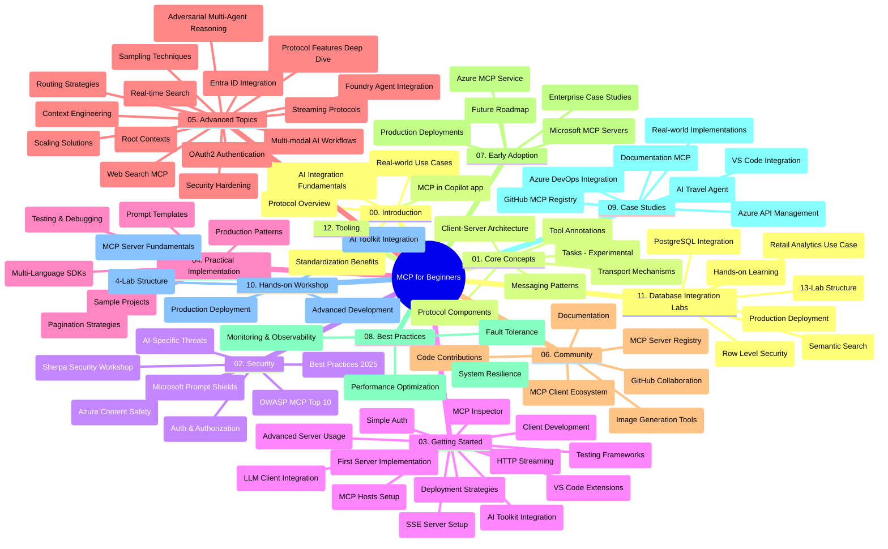

# Model Context Protocol (MCP) voor Beginners - Studiegids

Deze studiegids geeft een overzicht van de repository-structuur en inhoud voor het curriculum "Model Context Protocol (MCP) voor Beginners". Gebruik deze gids om efficiënt door de repository te navigeren en optimaal gebruik te maken van de beschikbare middelen.

## Overzicht van de Repository

Het Model Context Protocol (MCP) is een gestandaardiseerd kader voor interacties tussen AI-modellen en clienttoepassingen. Oorspronkelijk gecreëerd door Anthropic, wordt MCP nu beheerd door de bredere MCP-gemeenschap via de officiële GitHub-organisatie. Deze repository biedt een uitgebreid curriculum met praktische codevoorbeelden in C#, Java, JavaScript, Python en TypeScript, ontworpen voor AI-ontwikkelaars, systeemarchitecten en software-engineers.

## Visuele Curriculumkaart

## Repositorystructuur

De repository is georganiseerd in twaalf hoofdsecties, elk gericht op verschillende aspecten van MCP:

1. **Inleiding (00-Introduction/)**
   - Overzicht van het Model Context Protocol
   - Waarom standaardisatie belangrijk is in AI-pijplijnen
   - Praktische gebruikssituaties en voordelen

2. **Kernconcepten (01-CoreConcepts/)**
   - Client-server architectuur
   - Belangrijke protocolcomponenten
   - Berichtgevingspatronen in MCP
   - Huidige specificatie: [Wat is veranderd in MCP: De specificatie van 2026-07-28](./01-CoreConcepts/mcp-2026-07-28.md) — de stateless protocolkern, Extensions-framework en afschaffingen van Roots/Sampling/Logging

3. **Beveiliging (02-Security/)**
   - Beveiligingsdreigingen in MCP-gebaseerde systemen
   - Best practices voor het beveiligen van implementaties
   - Authenticatie- en autorisatiestrategieën
   - Hands-on [CIMD en DCR autorisatievoorbeeld](./02-Security/samples/cimd-dcr-auth/README.md)
   - **Uitgebreide beveiligingsdocumentatie**:
     - MCP Beveiligingsbest Practices
     - Azure Content Safety Implementatiehandleiding
     - MCP Beveiligingscontroles en Technieken
     - MCP Best Practices Snelreferentie
   - **Belangrijke beveiligingsonderwerpen**:
     - Promptinjectie en toolvergiftigingsaanvallen
     - Sessiekaping en confused deputy-problemen
     - Kwetsbaarheden in token-passthrough
     - Overmatige machtigingen en toegangscontrole
     - Supply chain-beveiliging voor AI-componenten
     - Integratie van Microsoft Prompt Shields

4. **Aan de Slag (03-GettingStarted/)**
   - Omgevingsinstelling en configuratie
   - Het maken van basis MCP-servers en clients
   - Integratie met bestaande applicaties
   - Bevat secties voor:
     - Eerste serverimplementatie
     - Clientontwikkeling
     - LLM-clientintegratie
     - VS Code-integratie
     - Server-Sent Events (SSE) server
     - Geavanceerd servergebruik
     - HTTP-streaming
     - AI Toolkit-integratie
     - Teststrategieën
     - Deploymentrichtlijnen

5. **Praktische Implementatie (04-PracticalImplementation/)**
   - Gebruik van SDK’s in verschillende programmeertalen
   - Debugging-, test- en validatietechnieken
   - Het maken van herbruikbare promptsjablonen en workflows
   - Voorbeeldprojecten met implementatievoorbeelden

6. **Geavanceerde Onderwerpen (05-AdvancedTopics/)**
   - Contextengineering technieken
   - Foundry-agentintegratie
   - Multimodale AI-workflows 
   - OAuth2-authenticatiedemo’s
   - Real-time zoekmogelijkheden
   - Real-time streaming
   - Implementatie van root contexts
   - Routeringsstrategieën
   - Samplingstechnieken
   - Schaalstrategieën
   - Beveiligingsoverwegingen
   - Entra ID-beveiligingsintegratie
   - Webzoekintegratie
   - Adversarial multi-agent redeneren (debatpatronen)

7. **Communitybijdragen (06-CommunityContributions/)**
   - Hoe code en documentatie bij te dragen
   - Samenwerken via GitHub
   - Community-gedreven verbeteringen en feedback
   - Gebruik van diverse MCP-clients (Claude Desktop, Cline, VSCode)
   - Werken met populaire MCP-servers inclusief beeldgeneratie

8. **Lessen uit Vroege Adoptie (07-LessonsfromEarlyAdoption/)**
   - Praktische implementaties en succesverhalen
   - Bouwen en implementeren van MCP-gebaseerde oplossingen
   - Trends en toekomstplannen
   - **Microsoft MCP Servers Gids**: Uitgebreide gids voor 10 productieklare Microsoft MCP-servers, waaronder:
     - Microsoft Learn Docs MCP Server
     - Azure MCP Server (15+ gespecialiseerde connectors)
     - GitHub MCP Server
     - Azure DevOps MCP Server
     - MarkItDown MCP Server
     - SQL Server MCP Server
     - Playwright MCP Server
     - Dev Box MCP Server
     - Microsoft Foundry MCP Server
     - Microsoft 365 Agents Toolkit MCP Server

9. **Best Practices (08-BestPractices/)**
   - Prestatie-afstemming en optimalisatie
   - Het ontwerpen van fouttolerante MCP-systemen
   - Test- en veerkrachtstrategieën

10. **Casestudy’s (09-CaseStudy/)**
    - **Zeven uitgebreide casestudy’s** die de veelzijdigheid van MCP aantonen in diverse scenario’s:
    - **Azure AI Travel Agents**: Multi-agent orkestratie met Azure OpenAI en AI Search
    - **Azure DevOps Integratie**: Automatisering van workflowprocessen met YouTube gegevensupdates
    - **Realtime Documentatieterugwinning**: Python consoleclient met streaming HTTP
    - **Interactieve Studieplangenerator**: Chainlit web-app met conversationele AI
    - **Documentatie in de editor**: VS Code-integratie met GitHub Copilot workflows
    - **Azure API Management**: Enterprise API-integratie met MCP-servercreatie
    - **GitHub MCP Registry**: Ecosysteemontwikkeling en agentieke integratieplatform
    - Implementatievoorbeelden die enterprise-integratie, ontwikkelaarproductiviteit en ecosysteemontwikkeling omvatten

11. **Hands-on Workshop (10-StreamliningAIWorkflowsBuildingAnMCPServerWithAIToolkit/)**
    - Uitgebreide hands-on workshop die MCP combineert met AI Toolkit
    - Bouwen van intelligente toepassingen die AI-modellen verbinden met tools uit de echte wereld
    - Praktische modules over fundamentele concepten, aangepaste serverontwikkeling en productie-implementatiestrategieën
    - **Labstructuur**:
      - Lab 1: MCP Server Fundamentals
      - Lab 2: Geavanceerde MCP Serverontwikkeling
      - Lab 3: AI Toolkit-integratie
      - Lab 4: Productie-implementatie en schaalvergroting
    - Labs-gebaseerde leerbenadering met stapsgewijze instructies

12. **MCP Server Database Integratie Labs (11-MCPServerHandsOnLabs/)**
    - **Uitgebreid 13-labs leertraject** voor het bouwen van productieklare MCP-servers met PostgreSQL-integratie
    - **Reële retailanalyse-implementatie** met de Zava Retail use case
    - **Enterprise-grade patronen** waaronder Row Level Security (RLS), semantisch zoeken en multi-tenant datatoegang
    - **Volledige Labstructuur**:
      - **Labs 00-03: Fundamenten** - Inleiding, Architectuur, Beveiliging, Omgevingsconfiguratie
      - **Labs 04-06: Het bouwen van de MCP Server** - Databasedesign, MCP Serverimplementatie, Toolontwikkeling
      - **Labs 07-09: Geavanceerde functies** - Semantisch zoeken, Testen & Debugging, VS Code-integratie
      - **Labs 10-12: Productie & Best Practices** - Deployment, Monitoring, Optimalisatie
    - **Behandelde technologieën**: FastMCP framework, PostgreSQL, Azure OpenAI, Azure Container Apps, Application Insights
    - **Leerresultaten**: Productieklare MCP-servers, databaseintegratiepatronen, AI-gestuurde analytics, enterprise-beveiliging

13. **Tooling (12-tooling/)**
    - Leer hoe je MCP gebruikt in de Copilot-app en andere tools

## Aanvullende bronnen

De repository bevat ondersteunende bronnen:

- **Afbeeldingenmap**: Bevat diagrammen en illustraties die door het hele curriculum worden gebruikt
- **Vertalingen**: Meertalige ondersteuning met geautomatiseerde vertalingen van documentatie
- **Officiële MCP-bronnen**:
  - [MCP Documentatie](https://modelcontextprotocol.io/)
  - [MCP Specificatie](https://modelcontextprotocol.io/specification/2026-07-28/)
  - [MCP GitHub Repository](https://github.com/modelcontextprotocol)

## Hoe Deze Repository te Gebruiken

1. **Sequentieel Leren**: Volg de hoofdstukken op volgorde (00 tot 11) voor een gestructureerde leerervaring.
2. **Taalgerichte Focus**: Als je geïnteresseerd bent in een specifieke programmeertaal, verken dan de samples-mappen voor implementaties in jouw voorkeurstaal.
3. **Praktische Implementatie**: Begin met de sectie "Aan de Slag" om je omgeving in te stellen en je eerste MCP-server en client te maken.
4. **Geavanceerde Verkenning**: Zodra je vertrouwd bent met de basis, duik in de geavanceerde onderwerpen om je kennis uit te breiden.
5. **Community Betrokkenheid**: Word lid van de MCP-community via GitHub-discussies en Discord-kanalen om contact te maken met experts en medeontwikkelaars.

## MCP Clients en Tools

Het curriculum behandelt verschillende MCP-clients en tools:

1. **Officiële Clients**:
   - Visual Studio Code 
   - MCP in Visual Studio Code
   - Claude Desktop
   - Claude in VSCode 
   - Claude API

2. **Community Clients**:
   - Cline (terminal-gebaseerd)
   - Cursor (code-editor)
   - ChatMCP
   - Windsurf

3. **MCP Management Tools**:
   - MCP CLI
   - MCP Manager
   - MCP Linker
   - MCP Router

## Populaire MCP Servers

De repository introduceert verschillende MCP-servers, waaronder:

1. **Officiële Microsoft MCP Servers**:
   - Microsoft Learn Docs MCP Server
   - Azure MCP Server (15+ gespecialiseerde connectors)
   - GitHub MCP Server
   - Azure DevOps MCP Server
   - MarkItDown MCP Server
   - SQL Server MCP Server
   - Playwright MCP Server
   - Dev Box MCP Server
   - Microsoft Foundry MCP Server
   - Microsoft 365 Agents Toolkit MCP Server

2. **Officiële Referentieservers**:
   - Filesystem
   - Fetch
   - Memory
   - Sequential Thinking

3. **Beeldgeneratie**:
   - Azure OpenAI DALL-E 3
   - Stable Diffusion WebUI
   - Replicate

4. **Ontwikkeltools**:
   - Git MCP
   - Terminal Control
   - Code Assistant

5. **Gespecialiseerde Servers**:
   - Salesforce
   - Microsoft Teams
   - Jira & Confluence

## Bijdragen

Deze repository verwelkomt bijdragen van de gemeenschap. Zie de sectie Communitybijdragen voor richtlijnen over hoe effectief bij te dragen aan het MCP-ecosysteem.

----

*Deze studiegids is voor het laatst bijgewerkt op 9 september 2026. Het weerspiegelt MCP
Specificatie `2026-07-28`, de huidige protocolherziening. Sommige hands-on
voorbeelden blijven expliciet versiegebonden aan `2025-11-25` terwijl hun SDK’s en tools
de stateless protocol-API's overnemen.*

---

<!-- CO-OP TRANSLATOR DISCLAIMER START -->
**Disclaimer**:
Dit document is vertaald met behulp van de AI vertaaldienst [Co-op Translator](https://github.com/Azure/co-op-translator). Hoewel we streven naar nauwkeurigheid, dient u er rekening mee te houden dat geautomatiseerde vertalingen fouten of onnauwkeurigheden kunnen bevatten. Het originele document in de oorspronkelijke taal moet worden beschouwd als de gezaghebbende bron. Voor kritieke informatie wordt professionele menselijke vertaling aanbevolen. Wij zijn niet aansprakelijk voor eventuele misverstanden of verkeerde interpretaties die voortvloeien uit het gebruik van deze vertaling.
<!-- CO-OP TRANSLATOR DISCLAIMER END -->