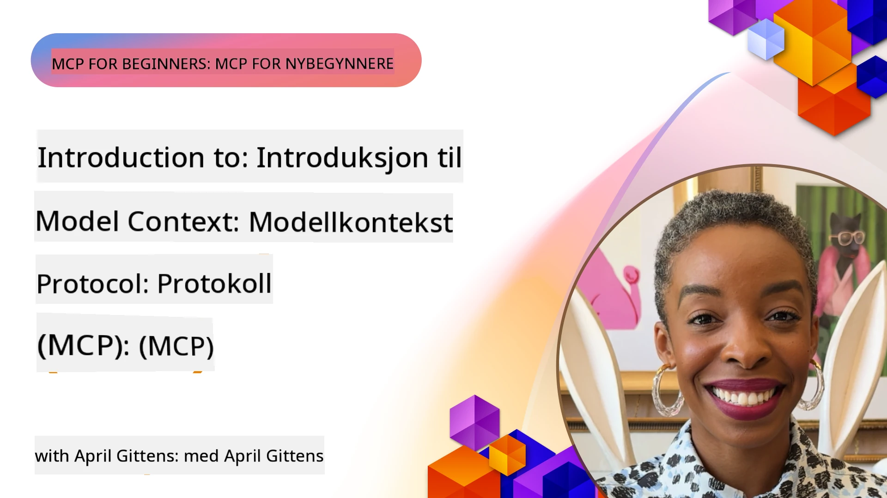
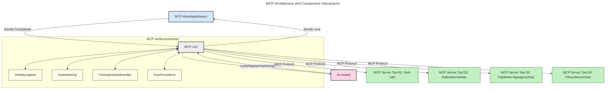
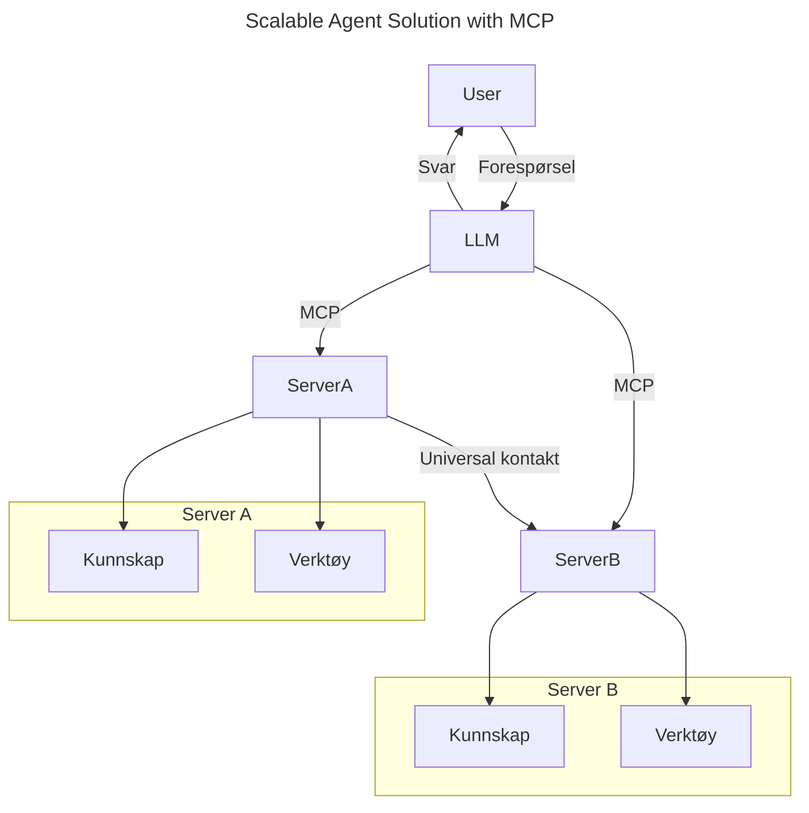
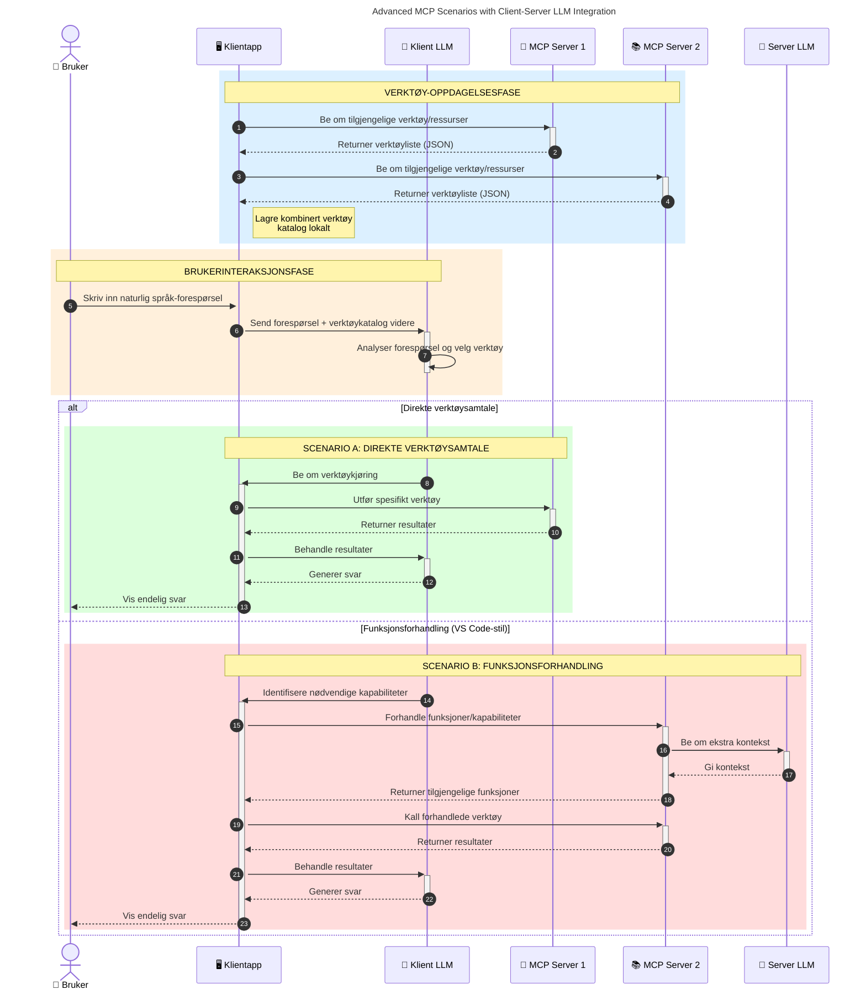

# Introduksjon til Model Context Protocol (MCP): Hvorfor det er viktig for skalerbare AI-applikasjoner

_(Klikk på bildet over for å se videoen til denne leksen)_

Generative AI-applikasjoner er et stort steg fremover da de ofte lar brukeren samhandle med appen ved hjelp av naturlige språkkommandoer. Men etter hvert som mer tid og ressurser investeres i slike apper, ønsker du å sikre at du enkelt kan integrere funksjonaliteter og ressurser på en måte som er lett å utvide, at appen din kan håndtere mer enn én modell, og kan takle ulike modellspesifikke utfordringer. Kort sagt, det er lett å begynne å bygge Gen AI-apper, men når de vokser og blir mer komplekse, må du begynne å definere en arkitektur og vil sannsynligvis trenge å stole på en standard for å sikre at appene dine bygges på en konsistent måte. Her kommer MCP inn for å organisere ting og tilby en standard.

---

## **🔍 Hva er Model Context Protocol (MCP)?**

**Model Context Protocol (MCP)** er et **åpent, standardisert grensesnitt** som lar store språkmodeller (LLMs) samhandle sømløst med eksterne verktøy, API-er og datakilder. Det tilbyr en konsistent arkitektur for å utvide funksjonaliteten til AI-modeller utover treningsdataene deres, som muliggjør smartere, skalerbare og mer responsive AI-systemer.

---

## **🎯 Hvorfor standardisering i AI er viktig**

Etter hvert som generative AI-applikasjoner blir mer komplekse, er det viktig å ta i bruk standarder som sikrer **skalerbarhet, utvidbarhet, vedlikeholdbarhet** og **unngå leverandørlåsning**. MCP håndterer disse behovene ved å:

- Samle modell-verktøy-integrasjoner under en enhetlig standard
- Redusere skjøre, engangs-skjreddersydde løsninger
- Tillate flere modeller fra ulike leverandører å leve side om side i ett økosystem

**Merk:** Selv om MCP omtaler seg som en åpen standard, er det ingen planer om å standardisere MCP gjennom eksisterende standardiseringsorganer som IEEE, IETF, W3C, ISO eller andre.

---

## **📚 Læringsmål**

Når du er ferdig med denne artikkelen, vil du kunne:

- Definere **Model Context Protocol (MCP)** og dets brukstilfeller
- Forstå hvordan MCP standardiserer kommunikasjon mellom modell og verktøy
- Identifisere de sentrale komponentene i MCP-arkitekturen
- Utforske virkelige bruksområder for MCP i bedrifts- og utviklingssammenhenger

---

## **💡 Hvorfor Model Context Protocol (MCP) er en banebryter**

### **🔗 MCP løser fragmentering i AI-samhandlinger**

Før MCP krevde integrering av modeller med verktøy:

- Egne tilpassede kodesnutter per verktøy-modell-par
- Ikke-standardiserte API-er for hver leverandør
- Hyppige avbrudd grunnet oppdateringer
- Dårlig skalerbarhet med flere verktøy

### **✅ Fordeler med MCP-standardisering**

| **Fordel**                | **Beskrivelse**                                                                |
|--------------------------|--------------------------------------------------------------------------------|
| Interoperabilitet        | LLM-er fungerer sømløst med verktøy fra forskjellige leverandører              |
| Konsistens               | Ensartet oppførsel på tvers av plattformer og verktøy                          |
| Gjenbruk                 | Verktøy bygget én gang kan brukes på tvers av prosjekter og systemer          |
| Raskere utvikling        | Reduserer utviklingstid ved å bruke standardiserte ”plug-and-play” grensesnitt |

---

## **🧱 Overordnet MCP-arkitektur**

MCP følger en **klient-server-modell**, der:

- **MCP-verter** kjører AI-modellene
- **MCP-klienter** initierer forespørsler
- **MCP-servere** server kontekst, verktøy og funksjonalitet

### **Nøkkelkomponenter:**

- **Ressurser** – Statisk eller dynamisk data for modeller  
- **Prompt** – Forhåndsdefinerte arbeidsflyter for veiledet generering  
- **Verktøy** – Kjørebare funksjoner som søk, beregninger  
- **Sampling** – Agentisk oppførsel via rekursive interaksjoner (utelatt i
    MCP `2026-07-28`; nye implementasjoner bør integrere direkte med en LLM-
    leverandør)
- **Elicitation** – Server-initierte forespørsler for brukerinput
- **Roots** – Informative filsystemlokasjoner relevante for en server
    (utelatt i MCP `2026-07-28`; foretrekk verktøyparametere, ressurs-URI-er eller
    serverkonfigurasjon)

### **Protokollarkitektur:**

MCP bruker en to-lags arkitektur:
- **Datalag**: JSON-RPC 2.0-meldinger, metadata per forespørsel, oppdagelse, og
    protokollprimitive
- **Transportlag**: stdio for lokale underprosesser og Streamable HTTP for
    eksterne servere. Streamable HTTP kan bruke SSE-innramming for strømmede svar,
    men den eldre HTTP+SSE-transporten er utfaset.

---

## Hvordan MCP-servere fungerer

MCP-servere fungerer på følgende måte:

- **Forespørselsflyt**:
    1. En forespørsel initiert av en sluttbruker eller programvare som handler på deres vegne.
    2. **MCP-klienten** sender forespørselen til en **MCP-vert**, som administrerer AI-modellens kjøretid.
    3. **AI-modellen** mottar brukerprompt og kan be om tilgang til eksterne verktøy eller data via en eller flere verktøysanrop.
    4. **MCP-verten**, ikke modellen direkte, kommuniserer med passende **MCP-server(e)** ved hjelp av den standardiserte protokollen.
- **MCP-vertsfunksjonalitet**:
    - **Verktøyregister**: Opprettholder en katalog over tilgjengelige verktøy og deres funksjoner.
    - **Autentisering**: Verifiserer tillatelser for verktøytilgang.
    - **Forespørselsbehandler**: Behandler innkommende verktøyforespørsler fra modellen.
    - **Svarformatør**: Strukturert verktøyutdata i et format modellen kan forstå.
- **Utførelse på MCP-server**:
    - **MCP-verten** ruter verktøysanrop til en eller flere **MCP-servere**, som hver tilbyr spesialiserte funksjoner (f.eks søk, beregninger, databaseforespørsler).
    - **MCP-serverne** utfører operasjonene og returnerer resultater til **MCP-verten** i et konsistent format.
    - **MCP-verten** formaterer og videresender disse resultatene til **AI-modellen**.
- **Fullføring av svar**:
    - **AI-modellen** inkorporerer verktøyutdataene i et sluttrespons.
    - **MCP-verten** sender dette svaret tilbake til **MCP-klienten**, som leverer det til sluttbrukeren eller den kallende programvaren.
    

## 👨‍💻 Hvordan bygge en MCP-server (med eksempler)

MCP-servere lar deg utvide LLM-funksjonalitet ved å tilby data og funksjoner. 

Klar til å prøve? Her er språk- og/eller stackspesifikke SDK-er med eksempler på å lage enkle MCP-servere i ulike språk/stacks:

- **Python SDK**: https://github.com/modelcontextprotocol/python-sdk

- **TypeScript SDK**: https://github.com/modelcontextprotocol/typescript-sdk

- **Java SDK**: https://github.com/modelcontextprotocol/java-sdk

- **C#/.NET SDK**: https://github.com/modelcontextprotocol/csharp-sdk

## 🌍 Virkelige brukstilfeller for MCP

MCP muliggjør mange applikasjoner ved å utvide AI-funksjonalitet:

| **Applikasjon**              | **Beskrivelse**                                                                |
|------------------------------|--------------------------------------------------------------------------------|
| Integrasjon av bedriftsdata  | Koble LLM-er til databaser, CRM-er eller interne verktøy                        |
| Agentisk AI-systemer         | Aktiver autonome agenter med verktøystøtte og arbeidsflyt for beslutningstaking |
| Multi-modale applikasjoner   | Kombiner tekst-, bilde- og lydverktøy i én samlet AI-app                        |
| Sanntids dataintegrasjon     | Bring levende data inn i AI-samhandlinger for mer nøyaktige, aktuelle svar     |

### 🧠 MCP = Universell standard for AI-samhandlinger

Model Context Protocol (MCP) fungerer som en universell standard for AI-samhandlinger, på samme måte som USB-C standardiserte fysiske tilkoblinger for enheter. I AI-verdenen tilbyr MCP et konsistent grensesnitt som lar modeller (klienter) integrere sømløst med eksterne verktøy og dataleverandører (servere). Dette eliminerer behovet for mange forskjellige, spesiallagde protokoller for hver API eller datakilde.

Under MCP følger et MCP-kompatibelt verktøy (referert til som en MCP-server) en samlet standard. Disse serverne kan liste opp verktøyene eller handlingene de tilbyr og utføre disse når en AI-agent ber om det. AI-agent-plattformer som støtter MCP kan oppdage tilgjengelige verktøy fra serverne og kalle dem via denne standardiserte protokollen.

### 💡 Tilrettelegger tilgang til kunnskap

Utover bare verktøy legger MCP også til rette for tilgang til kunnskap. Det gjør at applikasjoner kan gi kontekst til store språkmodeller (LLM-er) ved å koble dem til ulike datakilder. For eksempel kan en MCP-server representere en bedrifts dokumentlager, som lar agenter hente relevant informasjon på forespørsel. En annen server kan håndtere spesifikke handlinger som å sende e-poster eller oppdatere register. Fra agentens perspektiv er dette bare verktøy det kan bruke – noen verktøy returnerer data (kunnskapskontekst), mens andre utfører handlinger. MCP håndterer begge deler effektivt.

En agent som kobler seg til en MCP-server lærer automatisk om serverens tilgjengelige funksjoner og tilgang til data gjennom et standardisert format. Denne standardiseringen muliggjør dynamisk tilgjengelighet av verktøy. For eksempel gjør det å legge til en ny MCP-server i et agentsystem dets funksjoner umiddelbart brukbare uten at agenten må tilpasses ytterligere.

Denne strømlinjeformede integrasjonen stemmer overens med flyten vist i følgende diagram, hvor servere tilbyr både verktøy og kunnskap, og sikrer sømløst samarbeid på tvers av systemer.

### 👉 Eksempel: Skalerbar агент-løsning

Den universelle kobleren gjør det mulig for MCP-servere å kommunisere og dele kapasitet med hverandre, slik at ServerA kan delegere oppgaver til ServerB eller få tilgang til dens verktøy og kunnskap. Dette føderer verktøy og data på tvers av servere, og støtter skalerbare og modulære agentarkitekturer. Fordi MCP standardiserer verktøyeksponering, kan agenter dynamisk oppdage og rute forespørsler mellom servere uten faste integrasjoner.

Samarbeid om verktøy og kunnskap: Verktøy og data kan aksesseres på tvers av servere, som muliggjør mer skalerbare og modulære agentiske arkitekturer.

### 🔄 Avanserte MCP-scenarier med LLM-integrasjon på klientsiden

Utover grunnleggende MCP-arkitektur finnes avanserte scenarier der både klient og server inneholder LLM-er, noe som muliggjør mer sofistikerte interaksjoner. I diagrammet under kan **Klientapp** være en IDE med flere MCP-verktøy tilgjengelig for bruk av LLM-en:

## 🔐 Praktiske fordeler med MCP

Her er de praktiske fordelene ved bruk av MCP:

- **Aktualitet**: Modeller kan få tilgang til oppdatert informasjon utover treningsdata
- **Utvidet funksjonalitet**: Modeller kan benytte spesialiserte verktøy for oppgaver de ikke er trent for
- **Redusert hallusinasjoner**: Eksterne datakilder gir faktabasert støtte
- **Personvern**: Sensitiv data kan holdes innenfor sikre omgivelser i stedet for å være innebygget i prompt

## 📌 Viktige punkter

Følgende er viktige punkter ved bruk av MCP:

- **MCP** standardiserer hvordan AI-modeller samhandler med verktøy og data
- Fremmer **utvidbarhet, konsistens og interoperabilitet**
- MCP hjelper til med å **redusere utviklingstid, forbedre pålitelighet og utvide modellens funksjoner**
- Klient-server-arkitekturen **muliggjør fleksible, utvidbare AI-applikasjoner**

## 🧠 Oppgave

Tenk på en AI-applikasjon du er interessert i å bygge.

- Hvilke **eksterne verktøy eller data** kan forbedre dens funksjoner?
- Hvordan kan MCP gjøre integrasjonen **enklere og mer pålitelig?**

## Ytterligere ressurser

- [MCP GitHub Repository](https://github.com/modelcontextprotocol)

## Hva kommer nå

Neste: [Kapittel 1: Kjernebegreper](../01-CoreConcepts/README.md)

---

<!-- CO-OP TRANSLATOR DISCLAIMER START -->
**Ansvarsfraskrivelse**:
Dette dokumentet er oversatt ved hjelp av AI-oversettelsestjenesten [Co-op Translator](https://github.com/Azure/co-op-translator). Selv om vi streber etter nøyaktighet, vær oppmerksom på at automatiske oversettelser kan inneholde feil eller unøyaktigheter. Det opprinnelige dokumentet på originalspråket skal betraktes som den autoritative kilden. For kritisk informasjon anbefales profesjonell menneskelig oversettelse. Vi er ikke ansvarlige for eventuelle misforståelser eller feiltolkninger som oppstår ved bruk av denne oversettelsen.
<!-- CO-OP TRANSLATOR DISCLAIMER END -->