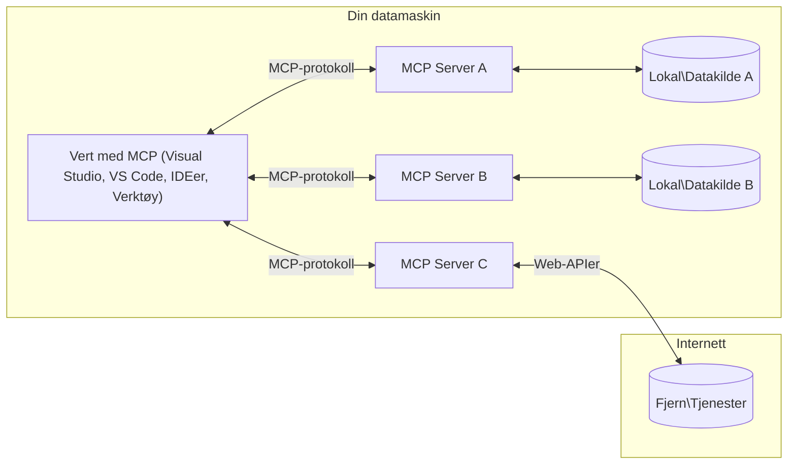

# MCP Kjernebegreper: Mestre Model Context Protocol for AI-integrasjon

[](https://youtu.be/earDzWGtE84)

_(Klikk på bildet over for å se video av denne leksjonen)_

[Model Context Protocol (MCP)](https://github.com/modelcontextprotocol) er et kraftig, standardisert rammeverk som optimaliserer kommunikasjonen mellom store språkmodeller (LLMs) og eksterne verktøy, applikasjoner og datakilder.  
Denne guiden vil lede deg gjennom kjernebegrepene i MCP. Du vil lære om dens klient-server-arkitektur, essensielle komponenter, kommunikasjonsmekanismer og beste praksis for implementering.

- **Eksplisitt brukersamtykke**: All datatilgang og operasjoner krever eksplisitt godkjenning fra brukeren før utførelse. Brukere må klart forstå hvilken data som vil bli aksessert og hvilke handlinger som vil bli utført, med granulær kontroll over tillatelser og autorisasjoner.

- **Datapersonvern**: Brukerdata eksponeres kun med eksplisitt samtykke og må beskyttes av robuste tilgangskontroller gjennom hele interaksjonslivssyklusen. Implementasjoner må forhindre uautorisert datatransmisjon og opprettholde strenge personverngrenser.

- **Sikkerhet ved verktøykjøring**: Hver verktøysanrop krever eksplisitt brukersamtykke med klar forståelse av verktøyets funksjonalitet, parametere og potensiell påvirkning. Robuste sikkerhetsgrenser må forhindre utilsiktet, usikker eller ondsinnet verktøykjøring.

- **Transportlagssikkerhet**: Alle kommunikasjonskanaler bør bruke passende kryptering og autentiseringsmekanismer. Fjernforbindelser bør implementere sikre transportprotokoller og korrekt håndtering av legitimasjon.

#### Implementeringsretningslinjer:

- **Tillatelsesstyring**: Implementer finmasket tillatelsessystem som lar brukere kontrollere hvilke servere, verktøy og ressurser som er tilgjengelige  
- **Autentisering og autorisasjon**: Bruk sikre autentiseringsmetoder (OAuth, API-nøkler) med korrekt tokenhåndtering og utløp  
- **Inndata-validering**: Valider alle parametere og data i henhold til definerte skjemaer for å forhindre injeksjonsangrep  
- **Revisjonslogging**: Oppretthold omfattende logger over alle operasjoner for sikkerhetsovervåking og samsvar

## Oversikt

Denne leksjonen utforsker den grunnleggende arkitekturen og komponentene som utgjør Model Context Protocol (MCP)-økosystemet. Du vil lære om klient-server-arkitekturen, nøkkelkomponenter og kommunikasjonsmekanismer som driver MCP-interaksjoner.

## Viktige læringsmål

Ved slutten av denne leksjonen vil du:

- Forstå MCP klient-server-arkitektur.  
- Identifisere roller og ansvar for Hosts, Clients og Servers.  
- Analysere kjernefunksjonene som gjør MCP til et fleksibelt integrasjonslag.  
- Lære hvordan informasjon flyter innen MCP-økosystemet.  
- Få praktiske innsikter gjennom kodeeksempler i .NET, Java, Python og JavaScript.

## MCP-arkitektur: Et dypere blikk

MCP-økosystemet er bygget på en klient-server-modell. Denne modulære strukturen lar AI-applikasjoner samhandle effektivt med verktøy, databaser, API-er og kontekstuelle ressurser. La oss bryte ned denne arkitekturen i dens kjernekomponenter.

I kjernen følger MCP en klient-server-arkitektur hvor en host-applikasjon kan koble til flere servere:


- **MCP Hosts**: Programmer som VSCode, Claude Desktop, IDE-er eller AI-verktøy som ønsker å aksessere data gjennom MCP  
- **MCP Clients**: Protokollklienter som opprettholder 1:1-forbindelser med servere  
- **MCP Servers**: Lettvektsprogrammer som hver eksponerer spesifikke funksjoner gjennom den standardiserte Model Context Protocol  
- **Lokale datakilder**: Din datamaskins filer, databaser og tjenester som MCP-servere kan aksessere sikkert  
- **Fjern-tjenester**: Eksterne systemer tilgjengelig over internett som MCP-servere kan koble til via API-er.

MCP-protokollen er en utviklende standard som bruker datobasert versjonering (YYYY-MM-DD-format). Den nåværende protokollversjonen er **2025-11-25**. Du kan se de siste oppdateringene til [protokollspesifikasjonen](https://modelcontextprotocol.io/specification/2025-11-25/)

### 1. Hosts

I Model Context Protocol (MCP) er **Hosts** AI-applikasjoner som fungerer som det primære grensesnittet brukere interagerer med protokollen gjennom. Hosts koordinerer og administrerer tilkoblinger til flere MCP-servere ved å opprette dedikerte MCP-klienter for hver serverforbindelse. Eksempler på Hosts inkluderer:

- **AI-applikasjoner**: Claude Desktop, Visual Studio Code, Claude Code  
- **Utviklingsmiljøer**: IDE-er og kodeeditorer med MCP-integrasjon  
- **Egendefinerte applikasjoner**: Spesialbygde AI-agenter og verktøy

**Hosts** er applikasjoner som koordinerer AI-modellinteraksjoner. De:

- **Orkestrerer AI-modeller**: Utfører eller samhandler med LLM-er for å generere svar og koordinere AI-arbeidsflyter  
- **Administrerer klienttilkoblinger**: Oppretter og opprettholder én MCP-klient per MCP-serverforbindelse  
- **Kontrollerer brukergrensesnitt**: Håndterer samtaleflyt, brukerinteraksjoner og presentasjon av svar  
- **Håndhever sikkerhet**: Kontrollerer tillatelser, sikkerhetsbegrensninger og autentisering  
- **Håndterer brukersamtykke**: Administrerer brukerens godkjenning for datadeling og verktøykjøring

### 2. Clients

**Clients** er essensielle komponenter som opprettholder dedikerte én-til-én-forbindelser mellom Hosts og MCP-servere. Hver MCP-klient opprettes av Host for å koble til en spesifikk MCP-server, noe som sikrer organiserte og sikre kommunikasjonskanaler. Flere klienter gjør det mulig for Hosts å koble til flere servere samtidig.

**Clients** er koblingskomponenter innen host-applikasjonen. De:

- **Protokollkommunikasjon**: Sender JSON-RPC 2.0-forespørsler til servere med prompts og instruksjoner  
- **Funksjonsforhandling**: Forhandler støttede funksjoner og protokollversjoner med servere under initialisering  
- **Verktøykjøring**: Håndterer verktøykjøringsforespørsler fra modeller og behandler svar  
- **Sanntidsoppdateringer**: Håndterer varsler og sanntidsoppdateringer fra servere  
- **Svarbehandling**: Behandler og formaterer serversvar for visning til brukere

### 3. Servers

**Servers** er programmer som tilbyr kontekst, verktøy og funksjonalitet til MCP-klienter. De kan kjøre lokalt (på samme maskin som Host) eller eksternt (på eksterne plattformer), og er ansvarlige for å håndtere klientforespørsler og gi strukturerte svar. Servere eksponerer spesifikk funksjonalitet gjennom den standardiserte Model Context Protocol.

**Servers** er tjenester som tilbyr kontekst og funksjonalitet. De:

- **Funksjonsregistrering**: Registrerer og eksponerer tilgjengelige primitive (ressurser, prompts, verktøy) til klienter  
- **Forespørselsbehandling**: Mottar og utfører verktøysanrop, ressursforespørsler og prompt-forespørsler fra klienter  
- **Konteksttilbud**: Gir kontekstuell informasjon og data for å forbedre modelsvar  
- **Tilstandshåndtering**: Opprettholder sesjonstilstand og håndterer tilstandsfylte interaksjoner ved behov  
- **Sanntidsvarsler**: Sender varsler om funksjonsendringer og oppdateringer til tilkoblede klienter

Servere kan utvikles av hvem som helst for å utvide modelfunksjonalitet med spesialisert funksjonalitet, og de støtter både lokale og eksterne distribusjonsscenarier.

### 4. Server Primitives

Servere i Model Context Protocol (MCP) tilbyr tre kjerne-**primitive** som definerer de grunnleggende byggesteinene for rike interaksjoner mellom klienter, hosts og språkmodeller. Disse primitive spesifiserer typene kontekstuell informasjon og handlinger som er tilgjengelige gjennom protokollen.

MCP-servere kan eksponere en hvilken som helst kombinasjon av følgende tre kjerneprimitive:

#### Resources

**Ressurser** er datakilder som gir kontekstuell informasjon til AI-applikasjoner. De representerer statisk eller dynamisk innhold som kan forbedre modellens forståelse og beslutningstaking:

- **Kontekstuell data**: Strukturert informasjon og kontekst for AI-modellens konsum  
- **Kunnskapsbaser**: Dokumentarkiver, artikler, manualer og forskningsartikler  
- **Lokale datakilder**: Filer, databaser og lokal systeminformasjon  
- **Ekstern data**: API-responser, webtjenester og fjernsystemdata  
- **Dynamisk innhold**: Sanntidsdata som oppdateres basert på eksterne forhold

Ressurser identifiseres med URI-er og støtter oppdagelse via `resources/list` og henting via `resources/read` metoder:

```text
file://documents/project-spec.md
database://production/users/schema
api://weather/current
```

#### Prompts

**Prompts** er gjenbrukbare maler som hjelper til med å strukturere interaksjoner med språkmodeller. De gir standardiserte interaksjonsmønstre og malbaserte arbeidsflyter:

- **Malbaserte interaksjoner**: Forhåndsstrukturerte meldinger og samtalestartere  
- **Arbeidsflytmaler**: Standardiserte sekvenser for vanlige oppgaver og interaksjoner  
- **Få-skudd-eksempler**: Eksempelbaserte maler for modellinstruksjon  
- **Systemprompter**: Grunnleggende prompter som definerer modellens oppførsel og kontekst  
- **Dynamiske maler**: Parameteriserte prompter som tilpasses spesifikke kontekster

Prompter støtter variabelsubstitusjon og kan oppdages via `prompts/list` og hentes med `prompts/get`:

```markdown
Generate a {{task_type}} for {{product}} targeting {{audience}} with the following requirements: {{requirements}}
```

#### Tools

**Verktøy** er kjørbare funksjoner som AI-modeller kan påkalle for å utføre spesifikke handlinger. De representerer "verbene" i MCP-økosystemet, og gjør det mulig for modeller å samhandle med eksterne systemer:

- **Kjørbare funksjoner**: Diskrete operasjoner som modeller kan påkalle med spesifikke parametere  
- **Integrasjon med eksterne systemer**: API-kall, databaseforespørsler, filoperasjoner, beregninger  
- **Unik identitet**: Hvert verktøy har et distinkt navn, beskrivelse og parameterskjema  
- **Strukturert I/O**: Verktøy aksepterer validerte parametere og returnerer strukturerte, typede svar  
- **Handlingskapasiteter**: Gjør det mulig for modeller å utføre virkelige handlinger og hente live data

Verktøy defineres med JSON Schema for parameter-validering og oppdages via `tools/list` og utføres via `tools/call`:

```typescript
server.tool(
  "search_products", 
  {
    query: z.string().describe("Search query for products"),
    category: z.string().optional().describe("Product category filter"),
    max_results: z.number().default(10).describe("Maximum results to return")
  }, 
  async (params) => {
    // Utfør søk og returner strukturerte resultater
    return await productService.search(params);
  }
);
```

## Client Primitives

I Model Context Protocol (MCP) kan **klienter** eksponere primitive som gjør det mulig for servere å be om ekstra funksjonalitet fra host-applikasjonen. Disse klient-side primitive tillater rikere, mer interaktive serverimplementasjoner som kan aksessere AI-modellkapasiteter og brukerinteraksjoner.

### Sampling

**Sampling** lar servere be om språkmodellfullføringer fra klientens AI-applikasjon. Denne primitive gjør det mulig for servere å aksessere LLM-kapasiteter uten å innebygge egne modellavhengigheter:

- **Modelluavhengig tilgang**: Servere kan be om fullføringer uten å inkludere LLM-SDK-er eller håndtere modelltilgang  
- **Serverinitiert AI**: Gjør det mulig for servere å autonomt generere innhold ved bruk av klientens AI-modell  
- **Rekursiv LLM-interaksjon**: Støtter komplekse scenarier hvor servere trenger AI-hjelp til prosessering  
- **Dynamisk innholdsgenerering**: Lar servere lage kontekstuelle svar ved bruk av hostens modell

Sampling initieres gjennom `sampling/complete`-metoden, hvor servere sender fullføringsforespørsler til klienter.

### Elicitation

**Elicitation** gjør det mulig for servere å be om tilleggsinformasjon eller bekreftelse fra brukere via klientgrensesnittet:

- **Brukerinput-forespørsler**: Servere kan be om ekstra informasjon når det trengs for verktøykjøring  
- **Bekreftelsesdialoger**: Be om brukerens godkjenning for sensitive eller innvirkningsfulle operasjoner  
- **Interaktive arbeidsflyter**: Gjør det mulig for servere å lage trinnvise brukerinteraksjoner  
- **Dynamisk parameterinnsamling**: Samle manglende eller valgfrie parametere under verktøykjøring

Elicitation-forespørsler gjøres med `elicitation/request`-metoden for å samle brukerinput via klientens grensesnitt.

### Logging

**Logging** lar servere sende strukturerte loggmeldinger til klienter for feilsøking, overvåking og operasjonell synlighet:

- **Feilsøkingsstøtte**: Gjør det mulig for servere å gi detaljerte kjørelogger for problemløsning  
- **Operasjonell overvåking**: Sender statusoppdateringer og ytelsesmetrikker til klienter  
- **Feilrapportering**: Gir detaljert feilkontekst og diagnostisk informasjon  
- **Revisjonsspor**: Lager omfattende logger over serveroperasjoner og beslutninger

Loggmeldinger sendes til klienter for å gi innsikt i serveroperasjoner og lette feilsøking.

## Informasjonsflyt i MCP

Model Context Protocol (MCP) definerer en strukturert informasjonsflyt mellom hosts, clients, servers og modeller. Å forstå denne flyten hjelper med å klargjøre hvordan brukerforespørsler behandles og hvordan eksterne verktøy og data integreres i modelsvar.

- **Host initierer tilkobling**  
  Host-applikasjonen (som en IDE eller chattegrensesnitt) etablerer en tilkobling til en MCP-server, vanligvis via STDIO, WebSocket eller en annen støttet transport.

- **Funksjonsforhandling**  
  Klienten (innebygd i host) og serveren utveksler informasjon om sine støttede funksjoner, verktøy, ressurser og protokollversjoner. Dette sikrer at begge parter forstår hvilke kapasiteter som er tilgjengelige for økten.

- **Brukerforespørsel**  
  Brukeren interagerer med host (f.eks. skriver inn en prompt eller kommando). Host samler inn denne inputen og sender den til klienten for behandling.

- **Ressurs- eller verktøybruk**  
  - Klienten kan be om ekstra kontekst eller ressurser fra serveren (som filer, databaseoppføringer eller kunnskapsbaseartikler) for å berike modellens forståelse.  
  - Hvis modellen avgjør at et verktøy trengs (f.eks. for å hente data, utføre en beregning eller kalle et API), sender klienten en verktøysanropsforespørsel til serveren, med spesifisering av verktøynavn og parametere.

- **Serverutførelse**  
  Serveren mottar ressurs- eller verktøyforespørselen, utfører nødvendige operasjoner (som å kjøre en funksjon, spørre en database eller hente en fil), og returnerer resultatene til klienten i et strukturert format.

- **Svargenerering**  
  Klienten integrerer serversvarene (ressursdata, verktøyutdata osv.) i den pågående modellinteraksjonen. Modellen bruker denne informasjonen til å generere et omfattende og kontekstuelt relevant svar.

- **Resultatpresentasjon**  
  Host mottar det endelige resultatet fra klienten og presenterer det for brukeren, ofte inkludert både modellens genererte tekst og eventuelle resultater fra verktøykjøringer eller ressursoppslag.

Denne flyten gjør det mulig for MCP å støtte avanserte, interaktive og kontekstbevisste AI-applikasjoner ved sømløst å koble modeller med eksterne verktøy og datakilder.

## Protokollarkitektur og lag

MCP består av to distinkte arkitekturlag som samarbeider for å tilby et komplett kommunikasjonsrammeverk:

### Datalag

**Datalaget** implementerer kjernen i MCP-protokollen ved å bruke **JSON-RPC 2.0** som fundament. Dette laget definerer meldingsstruktur, semantikk og interaksjonsmønstre:

#### Kjernekomponenter:

- **JSON-RPC 2.0-protokoll**: All kommunikasjon bruker standardisert JSON-RPC 2.0 meldingsformat for metodekall, svar og varsler
- **Livssyklusadministrasjon**: Håndterer tilkoblingsinitialisering, kapabilitetsforhandling og sesjonsavslutning mellom klienter og servere  
- **Serverprimitiver**: Gjør det mulig for servere å tilby kjernefunksjonalitet gjennom verktøy, ressurser og prompt  
- **Klientprimitiver**: Gjør det mulig for servere å be om sampling fra LLM-er, hente brukerinput og sende loggmeldinger  
- **Sanntidsvarsler**: Støtter asynkrone varsler for dynamiske oppdateringer uten polling  

#### Nøkkelfunksjoner:

- **Protokollversjonsforhandling**: Bruker datobasert versjonering (ÅÅÅÅ-MM-DD) for å sikre kompatibilitet  
- **Kapabilitetsoppdagelse**: Klienter og servere utveksler informasjon om støttede funksjoner under initialisering  
- **Tilstandsholdige sesjoner**: Opprettholder tilkoblingsstatus over flere interaksjoner for kontekstkontinuitet  

### Transportlag

**Transportlaget** håndterer kommunikasjonskanaler, meldingsinnramming og autentisering mellom MCP-deltakere:

#### Støttede transportmekanismer:

1. **STDIO Transport**:  
   - Bruker standard input/output-strømmer for direkte prosesskommunikasjon  
   - Optimalt for lokale prosesser på samme maskin uten nettverkskostnader  
   - Vanlig brukt for lokale MCP-serverimplementasjoner  

2. **Streambar HTTP Transport**:  
   - Bruker HTTP POST for klient-til-server meldinger  
   - Valgfri Server-Sent Events (SSE) for server-til-klient streaming  
   - Muliggjør fjernserverkommunikasjon over nettverk  
   - Støtter standard HTTP-autentisering (bearer tokens, API-nøkler, egendefinerte headere)  
   - MCP anbefaler OAuth for sikker tokenbasert autentisering  

#### Transportabstraksjon:

Transportlaget abstraherer kommunikasjonsdetaljer fra datalaget, og muliggjør samme JSON-RPC 2.0 meldingsformat på tvers av alle transportmekanismer. Denne abstraksjonen gjør det mulig for applikasjoner å bytte sømløst mellom lokale og eksterne servere.

### Sikkerhetshensyn

MCP-implementasjoner må følge flere kritiske sikkerhetsprinsipper for å sikre trygge, pålitelige og sikre interaksjoner i alle protokolloperasjoner:

- **Brukersamtykke og kontroll**: Brukere må gi eksplisitt samtykke før data tilgås eller operasjoner utføres. De skal ha klar kontroll over hvilke data som deles og hvilke handlinger som autoriseres, støttet av intuitive brukergrensesnitt for gjennomgang og godkjenning av aktiviteter.

- **Datapersonvern**: Brukerdata skal kun eksponeres med eksplisitt samtykke og må beskyttes med passende tilgangskontroller. MCP-implementasjoner må forhindre uautorisert datatransmisjon og sikre at personvern opprettholdes i alle interaksjoner.

- **Verktøysikkerhet**: Før et verktøy kalles, kreves eksplisitt brukersamtykke. Brukere skal ha klar forståelse av hvert verktøys funksjonalitet, og robuste sikkerhetsgrenser må håndheves for å forhindre utilsiktet eller usikker verktøyutførelse.

Ved å følge disse sikkerhetsprinsippene sikrer MCP brukerens tillit, personvern og sikkerhet i alle protokollinteraksjoner samtidig som kraftige AI-integrasjoner muliggjøres.

## Kodeeksempler: Nøkkelkomponenter

Nedenfor er kodeeksempler i flere populære programmeringsspråk som illustrerer hvordan man implementerer sentrale MCP-serverkomponenter og verktøy.

### .NET-eksempel: Lage en enkel MCP-server med verktøy

Her er et praktisk .NET-kodeeksempel som demonstrerer hvordan man implementerer en enkel MCP-server med egendefinerte verktøy. Eksemplet viser hvordan man definerer og registrerer verktøy, håndterer forespørsler og kobler serveren ved hjelp av Model Context Protocol.

```csharp
using System;
using System.Threading.Tasks;
using ModelContextProtocol.Server;
using ModelContextProtocol.Server.Transport;
using ModelContextProtocol.Server.Tools;

public class WeatherServer
{
    public static async Task Main(string[] args)
    {
        // Create an MCP server
        var server = new McpServer(
            name: "Weather MCP Server",
            version: "1.0.0"
        );
        
        // Register our custom weather tool
        server.AddTool<string, WeatherData>("weatherTool", 
            description: "Gets current weather for a location",
            execute: async (location) => {
                // Call weather API (simplified)
                var weatherData = await GetWeatherDataAsync(location);
                return weatherData;
            });
        
        // Connect the server using stdio transport
        var transport = new StdioServerTransport();
        await server.ConnectAsync(transport);
        
        Console.WriteLine("Weather MCP Server started");
        
        // Keep the server running until process is terminated
        await Task.Delay(-1);
    }
    
    private static async Task<WeatherData> GetWeatherDataAsync(string location)
    {
        // This would normally call a weather API
        // Simplified for demonstration
        await Task.Delay(100); // Simulate API call
        return new WeatherData { 
            Temperature = 72.5,
            Conditions = "Sunny",
            Location = location
        };
    }
}

public class WeatherData
{
    public double Temperature { get; set; }
    public string Conditions { get; set; }
    public string Location { get; set; }
}
```

### Java-eksempel: MCP-serverkomponenter

Dette eksemplet demonstrerer samme MCP-server og verktøyregistrering som .NET-eksemplet over, men implementert i Java.

```java
import io.modelcontextprotocol.server.McpServer;
import io.modelcontextprotocol.server.McpToolDefinition;
import io.modelcontextprotocol.server.transport.StdioServerTransport;
import io.modelcontextprotocol.server.tool.ToolExecutionContext;
import io.modelcontextprotocol.server.tool.ToolResponse;

public class WeatherMcpServer {
    public static void main(String[] args) throws Exception {
        // Opprett en MCP-server
        McpServer server = McpServer.builder()
            .name("Weather MCP Server")
            .version("1.0.0")
            .build();
            
        // Registrer et værverktøy
        server.registerTool(McpToolDefinition.builder("weatherTool")
            .description("Gets current weather for a location")
            .parameter("location", String.class)
            .execute((ToolExecutionContext ctx) -> {
                String location = ctx.getParameter("location", String.class);
                
                // Hent værdata (forenklet)
                WeatherData data = getWeatherData(location);
                
                // Returner formatert svar
                return ToolResponse.content(
                    String.format("Temperature: %.1f°F, Conditions: %s, Location: %s", 
                    data.getTemperature(), 
                    data.getConditions(), 
                    data.getLocation())
                );
            })
            .build());
        
        // Koble serveren ved hjelp av stdio-transport
        try (StdioServerTransport transport = new StdioServerTransport()) {
            server.connect(transport);
            System.out.println("Weather MCP Server started");
            // Hold serveren kjørende til prosessen avsluttes
            Thread.currentThread().join();
        }
    }
    
    private static WeatherData getWeatherData(String location) {
        // Implementeringen ville kalle en vær-API
        // Forenklet for eksempelets skyld
        return new WeatherData(72.5, "Sunny", location);
    }
}

class WeatherData {
    private double temperature;
    private String conditions;
    private String location;
    
    public WeatherData(double temperature, String conditions, String location) {
        this.temperature = temperature;
        this.conditions = conditions;
        this.location = location;
    }
    
    public double getTemperature() {
        return temperature;
    }
    
    public String getConditions() {
        return conditions;
    }
    
    public String getLocation() {
        return location;
    }
}
```

### Python-eksempel: Bygge en MCP-server

Dette eksemplet bruker fastmcp, så sørg for å installere det først:

```python
pip install fastmcp
```
Kodeeksempel:

```python
#!/usr/bin/env python3
import asyncio
from fastmcp import FastMCP
from fastmcp.transports.stdio import serve_stdio

# Opprett en FastMCP-server
mcp = FastMCP(
    name="Weather MCP Server",
    version="1.0.0"
)

@mcp.tool()
def get_weather(location: str) -> dict:
    """Gets current weather for a location."""
    return {
        "temperature": 72.5,
        "conditions": "Sunny",
        "location": location
    }

# Alternativ tilnærming ved bruk av en klasse
class WeatherTools:
    @mcp.tool()
    def forecast(self, location: str, days: int = 1) -> dict:
        """Gets weather forecast for a location for the specified number of days."""
        return {
            "location": location,
            "forecast": [
                {"day": i+1, "temperature": 70 + i, "conditions": "Partly Cloudy"}
                for i in range(days)
            ]
        }

# Registrer klasseverktøy
weather_tools = WeatherTools()

# Start serveren
if __name__ == "__main__":
    asyncio.run(serve_stdio(mcp))
```

### JavaScript-eksempel: Lage en MCP-server

Dette eksemplet viser opprettelse av MCP-server i JavaScript og hvordan man registrerer to værrelaterte verktøy.

```javascript
// Bruke den offisielle Model Context Protocol SDK
import { McpServer } from "@modelcontextprotocol/sdk/server/mcp.js";
import { StdioServerTransport } from "@modelcontextprotocol/sdk/server/stdio.js";
import { z } from "zod"; // For parameter validering

// Opprett en MCP-server
const server = new McpServer({
  name: "Weather MCP Server",
  version: "1.0.0"
});

// Definer et værverktøy
server.tool(
  "weatherTool",
  {
    location: z.string().describe("The location to get weather for")
  },
  async ({ location }) => {
    // Dette ville normalt kalle en vær-API
    // Forenklet for demonstrasjon
    const weatherData = await getWeatherData(location);
    
    return {
      content: [
        { 
          type: "text", 
          text: `Temperature: ${weatherData.temperature}°F, Conditions: ${weatherData.conditions}, Location: ${weatherData.location}` 
        }
      ]
    };
  }
);

// Definer et prognoseverktøy
server.tool(
  "forecastTool",
  {
    location: z.string(),
    days: z.number().default(3).describe("Number of days for forecast")
  },
  async ({ location, days }) => {
    // Dette ville normalt kalle en vær-API
    // Forenklet for demonstrasjon
    const forecast = await getForecastData(location, days);
    
    return {
      content: [
        { 
          type: "text", 
          text: `${days}-day forecast for ${location}: ${JSON.stringify(forecast)}` 
        }
      ]
    };
  }
);

// Hjelpefunksjoner
async function getWeatherData(location) {
  // Simuler API-kall
  return {
    temperature: 72.5,
    conditions: "Sunny",
    location: location
  };
}

async function getForecastData(location, days) {
  // Simuler API-kall
  return Array.from({ length: days }, (_, i) => ({
    day: i + 1,
    temperature: 70 + Math.floor(Math.random() * 10),
    conditions: i % 2 === 0 ? "Sunny" : "Partly Cloudy"
  }));
}

// Koble serveren ved hjelp av stdio-transport
const transport = new StdioServerTransport();
server.connect(transport).catch(console.error);

console.log("Weather MCP Server started");
```

Dette JavaScript-eksemplet demonstrerer hvordan man lager en MCP-klient som kobler til en server, sender en prompt og behandler responsen inkludert eventuelle verktøykall som ble gjort.

## Sikkerhet og autorisasjon

MCP inkluderer flere innebygde konsepter og mekanismer for å håndtere sikkerhet og autorisasjon gjennom hele protokollen:

1. **Verktøytillatelseskontroll**:  
  Klienter kan spesifisere hvilke verktøy en modell har lov til å bruke under en sesjon. Dette sikrer at kun eksplisitt autoriserte verktøy er tilgjengelige, noe som reduserer risikoen for utilsiktede eller usikre operasjoner. Tillatelser kan konfigureres dynamisk basert på brukerpreferanser, organisasjonspolicyer eller konteksten for interaksjonen.

2. **Autentisering**:  
  Servere kan kreve autentisering før tilgang gis til verktøy, ressurser eller sensitive operasjoner. Dette kan innebære API-nøkler, OAuth-tokens eller andre autentiseringsordninger. Korrekt autentisering sikrer at kun betrodde klienter og brukere kan påkalle serverkapabiliteter.

3. **Validering**:  
  Parameter-validering håndheves for alle verktøykall. Hvert verktøy definerer forventede typer, formater og begrensninger for sine parametere, og serveren validerer innkommende forespørsler deretter. Dette forhindrer feilaktig eller ondsinnet input fra å nå verktøyimplementasjoner og bidrar til å opprettholde operasjonenes integritet.

4. **Ratebegrensning**:  
  For å forhindre misbruk og sikre rettferdig bruk av serverressurser kan MCP-servere implementere ratebegrensning for verktøykall og ressursaksess. Rategrenser kan anvendes per bruker, per sesjon eller globalt, og hjelper til med å beskytte mot tjenestenektangrep eller overdreven ressursbruk.

Ved å kombinere disse mekanismene gir MCP et sikkert fundament for integrering av språkmodeller med eksterne verktøy og datakilder, samtidig som brukere og utviklere får detaljert kontroll over tilgang og bruk.

## Protokollmeldinger og kommunikasjonsflyt

MCP-kommunikasjon bruker strukturerte **JSON-RPC 2.0**-meldinger for å legge til rette for klare og pålitelige interaksjoner mellom verter, klienter og servere. Protokollen definerer spesifikke meldingsmønstre for ulike typer operasjoner:

### Kjerne meldingstyper:

#### **Initialiseringsmeldinger**
- **`initialize`-forespørsel**: Etablerer tilkobling og forhandler protokollversjon og kapabiliteter  
- **`initialize`-respons**: Bekrefter støttede funksjoner og serverinformasjon  
- **`notifications/initialized`**: Signalerer at initialisering er fullført og sesjonen er klar  

#### **Oppdagelsesmeldinger**
- **`tools/list`-forespørsel**: Oppdager tilgjengelige verktøy fra serveren  
- **`resources/list`-forespørsel**: Lister tilgjengelige ressurser (datakilder)  
- **`prompts/list`-forespørsel**: Henter tilgjengelige promptmaler  

#### **Utførelsesmeldinger**  
- **`tools/call`-forespørsel**: Utfører et spesifikt verktøy med angitte parametere  
- **`resources/read`-forespørsel**: Henter innhold fra en spesifikk ressurs  
- **`prompts/get`-forespørsel**: Henter en promptmal med valgfrie parametere  

#### **Klientside-meldinger**
- **`sampling/complete`-forespørsel**: Server ber om LLM-komplettering fra klient  
- **`elicitation/request`**: Server ber om brukerinput via klientgrensesnitt  
- **Loggmeldinger**: Server sender strukturerte loggmeldinger til klient  

#### **Varslingsmeldinger**
- **`notifications/tools/list_changed`**: Server varsler klient om endringer i verktøyliste  
- **`notifications/resources/list_changed`**: Server varsler klient om endringer i ressursliste  
- **`notifications/prompts/list_changed`**: Server varsler klient om endringer i promptliste  

### Meldingsstruktur:

Alle MCP-meldinger følger JSON-RPC 2.0-format med:  
- **Forespørselsmeldinger**: Inkluderer `id`, `method` og valgfrie `params`  
- **Responsmeldinger**: Inkluderer `id` og enten `result` eller `error`  
- **Varslingsmeldinger**: Inkluderer `method` og valgfrie `params` (ingen `id` eller forventet respons)  

Denne strukturerte kommunikasjonen sikrer pålitelige, sporbare og utvidbare interaksjoner som støtter avanserte scenarier som sanntidsoppdateringer, verktøykjededannelse og robust feilhåndtering.

## Viktige punkter

- **Arkitektur**: MCP bruker en klient-server-arkitektur der verter administrerer flere klienttilkoblinger til servere  
- **Deltakere**: Økosystemet inkluderer verter (AI-applikasjoner), klienter (protokollkoblinger) og servere (kapabilitetsleverandører)  
- **Transportmekanismer**: Kommunikasjon støtter STDIO (lokal) og Streambar HTTP med valgfri SSE (fjern)  
- **Kjerneprimitiver**: Servere eksponerer verktøy (kjørbare funksjoner), ressurser (datakilder) og prompts (maler)  
- **Klientprimitiver**: Servere kan be om sampling (LLM-kompletteringer), elicitation (brukerinput) og logging fra klienter  
- **Protokollgrunnlag**: Bygget på JSON-RPC 2.0 med datobasert versjonering (nåværende: 2025-11-25)  
- **Sanntidskapabiliteter**: Støtter varsler for dynamiske oppdateringer og sanntidssynkronisering  
- **Sikkerhet først**: Eksplisitt brukersamtykke, databeskyttelse og sikker transport er kjernekrav  

## Øvelse

Design et enkelt MCP-verktøy som ville være nyttig i ditt domene. Definer:  
1. Hva verktøyet skal hete  
2. Hvilke parametere det skal akseptere  
3. Hvilket output det skal returnere  
4. Hvordan en modell kan bruke dette verktøyet for å løse brukerproblemer  


---

## Hva er neste

Neste: [Kapittel 2: Sikkerhet](../02-Security/README.md)

---

<!-- CO-OP TRANSLATOR DISCLAIMER START -->
**Ansvarsfraskrivelse**:
Dette dokumentet er oversatt ved hjelp av AI-oversettelsestjenesten [Co-op Translator](https://github.com/Azure/co-op-translator). Selv om vi streber etter nøyaktighet, vennligst vær oppmerksom på at automatiske oversettelser kan inneholde feil eller unøyaktigheter. Det opprinnelige dokumentet på originalspråket skal anses som den autoritative kilden. For kritisk informasjon anbefales profesjonell menneskelig oversettelse. Vi er ikke ansvarlige for eventuelle misforståelser eller feiltolkninger som oppstår ved bruk av denne oversettelsen.
<!-- CO-OP TRANSLATOR DISCLAIMER END -->