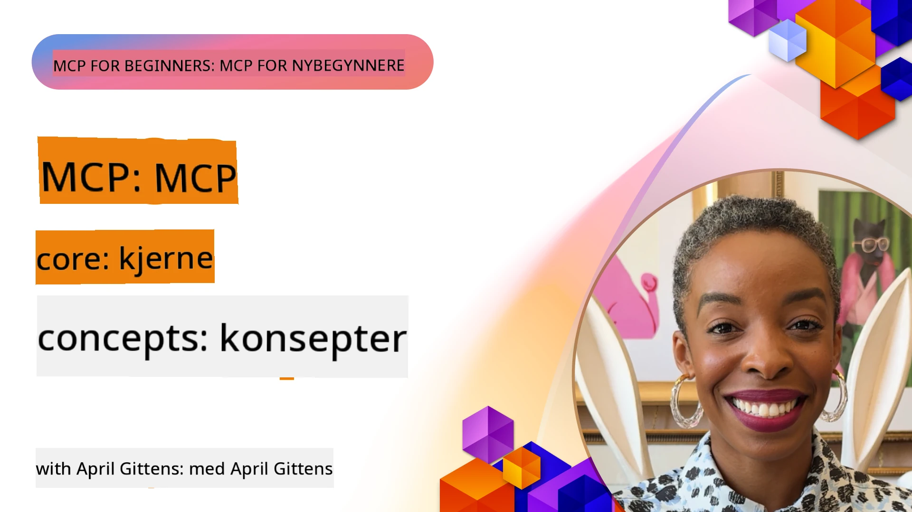
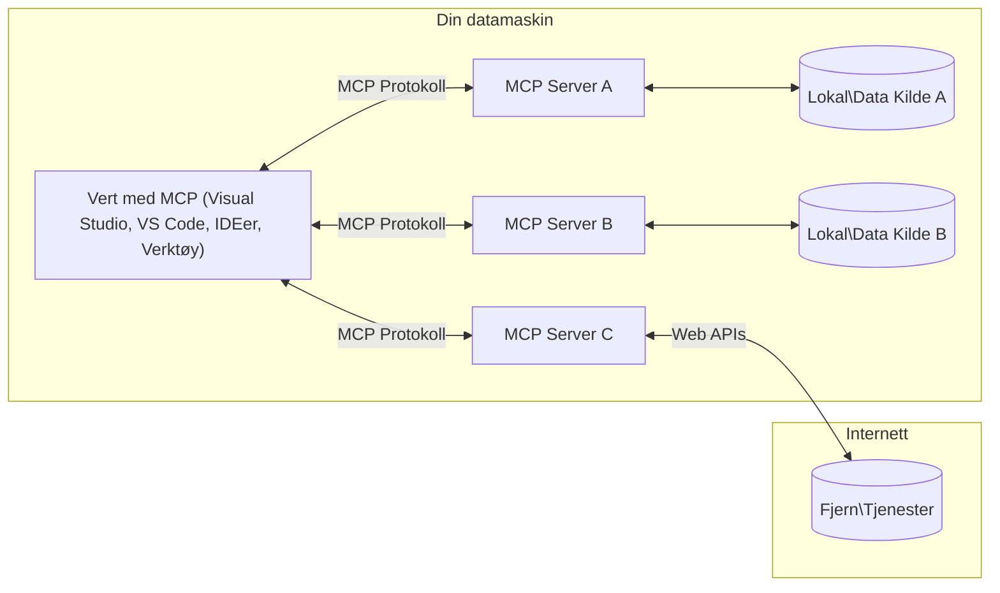

# MCP Kjernebegreper: Mestre Model Context Protocol for AI-integrasjon

[](https://youtu.be/earDzWGtE84)

_(Klikk på bildet ovenfor for å se videoen til denne leksjonen)_

[Model Context Protocol (MCP)](https://github.com/modelcontextprotocol) er et kraftig, standardisert rammeverk som optimaliserer kommunikasjon mellom store språkmodeller (LLMs) og eksterne verktøy, applikasjoner og datakilder.
Denne guiden vil lede deg gjennom kjernebegrepene i MCP. Du vil lære om dens klient-server-arkitektur, essensielle komponenter, kommunikasjonsmekanismer og beste praksis for implementering.

- **Brukerkontroll og samtykke**: Verter bør tydelig vise hvilke data og verktøy en
  server eksponerer, la brukere nekte operasjoner, og få eksplisitt bekreftelse
  for sensitive eller konsekvensielle handlinger. MCP krever ikke en bekreftelses-
  dialog før hvert verktøy-kall.

- **Personvern**: Brukerdata eksponeres kun med eksplisitt samtykke og må beskyttes av robuste tilgangskontroller gjennom hele interaksjonslivssyklusen. Implementasjoner må forhindre uautorisert datatransmisjon og opprettholde strenge personverngrenser.

- **Sikkerhet ved verktøykjøring**: Verter bør gjøre verktøy-invokasjoner synlige og holde
  en menneskelig bruker i stand til å nekte dem. Sensitive operasjoner bør vise verktøy-inndata
  og konsekvenser før utførelse, med sikkerhetsgrenser som forhindrer utilsiktede
  eller skadelige handlinger.

- **Transport-sikkerhet**: Fjernforbindelser bør bruke HTTPS og MCPs
  autorisasjonsmodell. Lokale stdio-servere er avhengige av prosessisolasjon, pålitelig
  konfigurasjon og sikker håndtering av arvede legitimasjoner.

#### Implementeringsretningslinjer:

- **Tillatelsesstyring**: Implementer detaljerte tillatelsessystemer som lar brukere kontrollere hvilke servere, verktøy og ressurser som er tilgjengelige
- **Autentisering & autorisasjon**: Bruk sikre autentiseringsmetoder (OAuth, API-nøkler) med korrekt tokenhåndtering og utløp  
- **Inndata-validering**: Valider alle parametere og data-inndata i henhold til definerte skjemaer for å forhindre injeksjonsangrep
- **Revisjonslogging**: Oppretthold omfattende logger av alle operasjoner for sikkerhetsovervåking og overholdelse

## Oversikt

Denne leksjonen utforsker den grunnleggende arkitekturen og komponentene som utgjør Model Context Protocol (MCP)-økosystemet. Du vil lære om klient-server-arkitekturen, nøkkelkomponenter og kommunikasjonsmekanismer som driver MCP-interaksjoner.

## Viktige læringsmål

Ved slutten av denne leksjonen vil du:

- Forstå MCP-klient-server-arkitekturen.
- Identifisere roller og ansvarsområder for Verter, Klienter og Servere.
- Analysere kjernefunksjonene som gjør MCP til et fleksibelt integrasjonslag.
- Lære hvordan informasjon flyter innen MCP-økosystemet.
- Få praktisk innsikt gjennom kodeeksempler i .NET, Java, Python og JavaScript.

## MCP-arkitektur: Et nærmere blikk

MCP-økosystemet er bygget på en klient-server-modell. Denne modulære strukturen tillater AI-applikasjoner å samhandle effektivt med verktøy, databaser, API-er og kontekstuelle ressurser. La oss dele denne arkitekturen inn i kjernens komponenter.

I kjernen følger MCP en klient-server-arkitektur hvor en vert-applikasjon kan koble til flere servere:


```mermaid
flowchart LR
    subgraph "Din datamaskin"
        Host["Vert med MCP (Visual Studio, VS Code, IDEer, Verktøy)"]
        S1["MCP Server A"]
        S2["MCP Server B"]
        S3["MCP Server C"]
        Host <-->|"MCP Protokoll"| S1
        Host <-->|"MCP Protokoll"| S2
        Host <-->|"MCP Protokoll"| S3
        S1 <--> D1[("Lokal\Data Kilde A")]
        S2 <--> D2[("Lokal\Data Kilde B")]
    end
    subgraph "Internett"
        S3 <-->|"Web APIs"| D3[("Fjern\Tjenester")]
    end
```

- **MCP-verter**: Programmer som VSCode, Claude Desktop, IDE-er eller AI-verktøy som ønsker å få tilgang til data gjennom MCP
- **MCP-klienter**: Protokollkomponenter som opprettholder én logisk relasjon
  med en server; MCP `2026-07-28`-forespørsler er ikke avhengige av én persistent
  tilkobling eller sesjon
- **MCP-servere**: Lettvektsprogrammer som hver eksponerer spesifikke kapasiteter gjennom den standardiserte Model Context Protocol
- **Lokale datakilder**: Dine datamaskinfiler, databaser og tjenester som MCP-servere kan få sikker tilgang til
- **Eksterne tjenester**: Eksterne systemer tilgjengelige over internett som MCP-servere kan koble til via API-er.

MCP-protokollen er en utviklende standard som bruker datobasert versjonering
(YYYY-MM-DD-format). Den nåværende protokollversjonen er **2026-07-28**. Se
[protokollspesifikasjonen for 2026-07-28](https://modelcontextprotocol.io/specification/2026-07-28/).

> **Nåværende utgivelse:** MCP `2026-07-28` gjør protokollen stateless på
> transportlaget ved å fjerne `initialize`-håndtrykket og protokollnivå-
> sesjons-IDer. Den formaliserer også et Extensions-rammeverk og avvikler
> Roots, Sampling og Logging til fordel for nyere mønstre. Se
> [Hva som er endret i MCP: Spesifikasjonen 2026-07-28](./mcp-2026-07-28.md)
> for en fullstendig gjennomgang og migrasjonsveiledning. Eksempler som eksplisitt retter seg mot
> `2025-11-25` beholdes som gamle kompatibilitetsleksjoner.

### 1. Verter

I Model Context Protocol (MCP) er **verter** AI-applikasjoner som fungerer som det primære grensesnittet brukerne bruker for å samhandle med protokollen. Verter koordinerer og administrerer tilkoblinger til flere MCP-servere ved å opprette dedikerte MCP-klienter for hver servertilkobling. Eksempler på verter inkluderer:

- **AI-applikasjoner**: Claude Desktop, Visual Studio Code, Claude Code
- **Utviklingsmiljøer**: IDE-er og kodeeditorer med MCP-integrasjon  
- **Egendefinerte applikasjoner**: Formålsbygde AI-agenter og verktøy

**Verter** er applikasjoner som koordinerer AI-modellinteraksjoner. De:

- **Orkestrerer AI-modeller**: Utfører eller samhandler med LLM-er for å generere svar og koordinere AI-arbeidsflyter
- **Administrerer klientrelasjoner**: Oppretter og administrerer en MCP-klient for hver MCP
  server som verten bruker
- **Styrer brukergrensesnittet**: Håndterer samtaleflyt, brukerinteraksjoner og responsvisning  
- **Håndhever sikkerhet**: Styrer tillatelser, sikkerhetsbegrensninger og autentisering
- **Håndterer brukersamtykke**: Administrerer brukergodkjenning for datadeling og verktøykjøring


### 2. Klienter

**Klienter** er protokollkomponenter opprettet av en vert for bestemte MCP-
servere. Dette er en logisk en-til-en-relasjon, ikke et krav om en
persistent nettverkstilkobling. I MCP `2026-07-28` er hver forespørsel
selvstendig og kan håndteres av hvilken som helst serverinstans.

**Klienter** er koblingskomponenter innen vert-applikasjonen. De:

- **Protokollkommunikasjon**: Sender JSON-RPC 2.0-forespørsler til servere med prompt og instruksjoner
- **Kapasitetsoppdagelse**: Bruker `server/discover` for å lære en servers støttede
  protokollversjoner, kapasiteter og utvidelser
- **Verktøykjøring**: Administrerer forespørsler om verktøykjøring fra modeller og behandler svar
- **Sanntidsoppdateringer**: Håndterer varsler og sanntidsoppdateringer fra servere
- **Responsbehandling**: Behandler og formaterer serversvar for visning til brukere

### 3. Servere

**Servere** er programmer som gir kontekst, verktøy og kapasiteter til MCP-klienter. De kan kjøre lokalt (samme maskin som verten) eller eksternt (på eksterne plattformer), og er ansvarlige for å håndtere klientforespørsler og gi strukturerte svar. Servere eksponerer spesifikk funksjonalitet gjennom den standardiserte Model Context Protocol.

**Servere** er tjenester som gir kontekst og kapasiteter. De:


- **Funksjonsregistrering**: Registrer og eksponer tilgjengelige primitive (ressurser, prompt, verktøy) til klienter
- **Forespørselsbehandling**: Motta og utfør verktøykall, ressursforespørsler og promptforespørsler fra klienter
- **Kontekstilbud**: Gi kontekstuell informasjon og data for å forbedre modellens svar
- **Tilstandshåndtering**: Vedlikehold applikasjonstilstand med eksplisitte håndtak som sendes
  i forespørsler når det er nødvendig; MCP `2026-07-28` har ingen protokollnivåøkter
- **Sanntidsvarsler**: Send varsler om endringer i kapabiliteter og oppdateringer til tilkoblede klienter

Servere kan utvikles av hvem som helst for å utvide modellers kapasiteter med spesialisert funksjonalitet, og de støtter både lokale og eksterne distribusjonsscenarier.

### 4. Serverprimitiver

Servere i Model Context Protocol (MCP) tilbyr tre kjerne-**primitive** som definerer grunnleggende byggeklosser for rik interaksjon mellom klienter, verter og språkmønstre. Disse primitive spesifiserer typer kontekstuell informasjon og handlinger som er tilgjengelige gjennom protokollen.

MCP-servere kan eksponere en hvilken som helst kombinasjon av følgende tre kjerneprimitiver:

#### Ressurser 

**Ressurser** er datakilder som gir kontekstuell informasjon til AI-applikasjoner. De representerer statisk eller dynamisk innhold som kan forbedre modellens forståelse og beslutningstaking:

- **Kontekstuell data**: Strukturert informasjon og kontekst for AI-modellbruk
- **Kunnskapsbaser**: Dokumentarkiver, artikler, manualer og forskningsartikler
- **Lokale datakilder**: Filer, databaser og lokal systeminformasjon  
- **Ekstern data**: API-responser, webtjenester og eksterne systemdata
- **Dynamisk innhold**: Sanntidsdata som oppdateres basert på eksterne forhold

Ressurser identifiseres ved URIer og støtter oppdagelse gjennom `resources/list` og henting via `resources/read` metoder:

```text
file://documents/project-spec.md
database://production/users/schema
api://weather/current
```

#### Prompter

**Prompter** er gjenbrukbare maler som hjelper til med å strukturere interaksjoner med språkmodeller. De gir standardiserte interaksjonsmønstre og malbaserte arbeidsflyter:

- **Malbaserte interaksjoner**: Forhåndsstrukturerte meldinger og samtalestartere
- **Arbeidsflytmaler**: Standardiserte sekvenser for vanlige oppgaver og interaksjoner
- **Få-eksempel-maler**: Eksempelbaserte maler for modellinstruksjon
- **Systemprompter**: Grunnleggende prompter som definerer modellens adferd og kontekst
- **Dynamiske maler**: Parameteriserte prompter som tilpasses spesifikke kontekster

Prompter støtter variabelsubstitusjon og kan oppdages via `prompts/list` og hentes med `prompts/get`:

```markdown
Generate a {{task_type}} for {{product}} targeting {{audience}} with the following requirements: {{requirements}}
```

#### Verktøy

**Verktøy** er kjørbare funksjoner som AI-modeller kan påkalle for å utføre spesifikke handlinger. De representerer "verbene" i MCP-økosystemet og gjør det mulig for modeller å samhandle med eksterne systemer:

- **Kjørbare funksjoner**: Diskrete operasjoner som modeller kan påkalle med spesifikke parametere
- **Integrasjon av eksterne systemer**: API-kall, databaseforespørsler, filoperasjoner, beregninger
- **Unik identitet**: Hvert verktøy har et tydelig navn, beskrivelse og parameterskjema
- **Strukturert I/O**: Verktøy tar imot validerte parametere og returnerer strukturerte, typerespons
- **Handlingskapasiteter**: Gjør modeller i stand til å utføre virkelige handlinger og hente live-data

Verktøy defineres med JSON Schema for parametervalidering og oppdages gjennom `tools/list` og utføres via `tools/call`. Verktøy kan også inkludere **ikoner** som tilleggsm­etadata for bedre UI-presentasjon.

**Verktøyannotasjoner**: Verktøy støtter atferdsannotasjoner (f.eks. `readOnlyHint`, `destructiveHint`) som beskriver om et verktøy er skrivebeskyttet eller destruktivt, og hjelper klienter å ta informerte beslutninger om verktøyutførelse.

Eksempel på verktøydefinisjon:

```typescript
server.tool(
  "search_products", 
  {
    query: z.string().describe("Search query for products"),
    category: z.string().optional().describe("Product category filter"),
    max_results: z.number().default(10).describe("Maximum results to return")
  }, 
  async (params) => {
    // Utfør søk og returner strukturerte resultater
    return await productService.search(params);
  }
);
```

## Klientprimitiver

I Model Context Protocol (MCP) kan **klienter** eksponere primitiv som gjør det mulig for servere å be om ekstra kapasiteter fra vertsapplikasjonen. Disse klient-side primitivene tillater rikere, mer interaktive serverimplementasjoner som kan få tilgang til AI-modellkapasiteter og brukerinteraksjoner.

### Sampling

> **Avviklet i MCP `2026-07-28`:** Sampling er fortsatt tilgjengelig for
> kompatibilitet, men nye implementasjoner bør integrere direkte med en LLM
> leverandør-API. Det er aktuelt for fjerning i første spesi­fikasjon­revisi­jon
> lansert på eller etter 28. juli 2027. Se
> [Hva er endret i MCP: Spesifikasjonen 2026-07-28](./mcp-2026-07-28.md).

**Sampling** lar servere be om fullføringer fra språkmodell fra klientens AI-applikasjon. Denne primitive gjør at servere kan få tilgang til LLM-kapasiteter uten å innebygge egne modellavhengigheter:

- **Modelluavhengig tilgang**: Servere kan be om fullføringer uten å inkludere LLM SDKer eller administrere modelltilgang
- **Server-initiert AI**: Gjør servere i stand til å autonomt generere innhold ved hjelp av klientens AI-modell
- **Rekursiv LLM-interaksjon**: Støtter komplekse scenarier der servere trenger AI-assistanse for bearbeiding
- **Dynamisk innholds­generering**: Gjør at servere kan lage kontekstuelle svar ved bruk av vertens modell
- **Verktøykallstøtte**: Servere kan inkludere `tools` og `toolChoice` parametere for å gjøre det mulig for klientens modell å invokes verktøy under sampling

Sampling bruker metoden `sampling/createMessage`, hvor servere ber om en
fullføring fra klienter.

### Rooter

> **Avviklet i MCP `2026-07-28`:** Rooter er fortsatt tilgjengelige for
> kompatibilitet, men nye implementasjoner bør sende mapper eller filer via
> verktøyparametere, ressurs-URIer eller serverkonfigurasjon. Rooter er
> aktuelle for fjerning i første spesifikasjonsrevisjon lansert på eller etter
> 28. juli 2027. Se
> [Hva er endret i MCP: Spesifikasjonen 2026-07-28](./mcp-2026-07-28.md).

**Rooter** gir en standardisert måte for klienter å identifisere filsystem-
steder som er relevante for servere:

- **Filsystemtips**: Identifiser kataloger og filer som er relevante for forespørselen
- **Separat autorisasjon**: Gir ikke tilgang eller håndhever en sikkerhetsgrense
- **Per-forespørsel kapasitet**: Klienter annonserer støtte for Rooter i forespørselsmetadata
- **URI-basert identifikasjon**: Rooter bruker `file://` URIer for å identifisere tilgjengelige kataloger og filer

I MCP `2026-07-28` ber en server om `roots/list` gjennom et
`InputRequiredResult` mens den behandler en støttet klientforespørsel. Klienten
returnerer rootene når den prøver den originale forespørselen på nytt.

### Elicitering  

**Elicitering** gjør det mulig for servere å be om ekstra informasjon eller bekreftelse fra brukere via klientgrensesnittet:

- **Brukerinnsats­forespørsler**: Servere kan be om tilleggsinfo når det er nødvendig for verktøyutførelse
- **Bekreftelsesdialoger**: Be om brukergodkjenning for sensitive eller viktige operasjoner
- **Interaktive arbeidsflyter**: Gjør at servere kan lage trinnvise brukerinteraksjoner
- **Dynamisk parametersamling**: Samle manglende eller valgfrie parametere under verktøybruk

Elicitering bruker metoden `elicitation/create` inne i et
`InputRequiredResult` for å samle brukerinput via klientens grensesnitt.


**URL-modus elicitering**: Servere kan også be om URL-baserte brukerinteraksjoner, slik at servere kan dirigere brukere til eksterne nettsider for autentisering, bekreftelse eller dataregistrering.

### Logging

> **Avviklet i MCP `2026-07-28`:** Logging er fortsatt tilgjengelig for
> kompatibilitet, men nye implementasjoner bør bruke `stderr` med stdio og
> OpenTelemetry for strukturert observabilitet. Logging kan fjernes
> i den første spesifikasjonsrevisjonen utgitt 28. juli 2027 eller senere. Se
> [Hva som har endret seg i MCP: Spesifikasjonen 2026-07-28](./mcp-2026-07-28.md).

**Logging** lar servere sende strukturerte loggmeldinger til klienter for feilsøking, overvåkning og operasjonell synlighet:

- **Feilsøkingsstøtte**: Gjør det mulig for servere å levere detaljerte utførelseslogger for feilsøking
- **Operasjonell overvåkning**: Sender statusoppdateringer og ytelsesmetrikk til klienter
- **Feilrapportering**: Gir detaljert feilkontekst og diagnostisk informasjon
- **Revisjonsspor**: Lager omfattende logger over serveroperasjoner og beslutninger

Loggmeldinger sendes til klienter for å gi innsyn i serveroperasjoner og lette feilsøking.

## Informasjonsflyt i MCP

Model Context Protocol (MCP) definerer en strukturert informasjonsflyt mellom verter, klienter, servere og modeller. Å forstå denne flyten hjelper til med å klargjøre hvordan brukerforespørsler behandles og hvordan eksterne verktøy og data integreres i modellens svar.

- **Vert initierer tilkobling**  
  Vertsøknaden (for eksempel en IDE eller chattegrensesnitt) etablerer en tilkobling til en MCP-server, vanligvis via STDIO, WebSocket eller et annet støttet transportmedium.

- **Evnenegosiering**  
  Klienten (innebygd i verten) og serveren utveksler informasjon om hvilke funksjoner, verktøy, ressurser og protokollversjoner de støtter. Dette sikrer at begge parter forstår hvilke evner som er tilgjengelige for økten.

- **Brukerforespørsel**  
  Brukeren interagerer med verten (f.eks. skriver inn en prompt eller kommando). Verten samler denne inputen og sender den til klienten for behandling.

- **Ressurs- eller verktøybruk**  
  - Klienten kan be om ytterligere kontekst eller ressurser fra serveren (som filer, databaseoppføringer eller kunnskapsbaseartikler) for å berike modellens forståelse.
  - Hvis modellen bestemmer at et verktøy trengs (f.eks. for å hente data, utføre en beregning eller kalle en API), sender klienten en verktøyinvokasjonsforespørsel til serveren, som spesifiserer verktøyets navn og parametere.

- **Serverutførelse**  
  Serveren mottar ressurs- eller verktøyforespørselen, utfører nødvendige operasjoner (som å kjøre en funksjon, spørring i en database eller hente en fil) og returnerer resultatene til klienten i et strukturert format.

- **Responsgenerering**  
  Klienten integrerer serverens svar (ressursdata, verktøyutdata osv.) i den pågående modellinteraksjonen. Modellen bruker denne informasjonen til å generere et omfattende og kontekstuelt relevant svar.

- **Resultatpresentasjon**  
  Verten mottar den endelige outputen fra klienten og presenterer den for brukeren, ofte inkludert både modellens genererte tekst og eventuelle resultater fra verktøyutførelser eller ressursoppslag.

Denne flyten gjør det mulig for MCP å støtte avanserte, interaktive og kontekstbevisste AI-applikasjoner ved sømløst å knytte modeller til eksterne verktøy og datakilder.

## Protokollarkitektur og lag

MCP består av to distinkte arkitekturlag som samarbeider for å tilby et komplett kommunikasjonsrammeverk:

### Datalag

**Datalaget** implementerer kjernen i MCP-protokollen ved bruk av **JSON-RPC 2.0** som fundament. Dette laget definerer meldingsstruktur, semantikk og interaksjonsmønstre:

#### Kjernekomponenter:

- **JSON-RPC 2.0-protokoll**: All kommunikasjon bruker standardisert JSON-RPC 2.0 meldingsformat for metodekall, svar og varsler
- **Livssyklusadministrasjon**: Håndterer tilkoblingsinitialisering, evnenegosiering og øktavslutning mellom klienter og servere
- **Serverprimitiver**: Gjør det mulig for servere å tilby kjernefunksjonalitet gjennom verktøy, ressurser og prompts
- **Klientprimitiver**: Gjør det mulig for servere å be om sampling fra LLM-er, hente brukerinput og sende loggmeldinger
- **Realtidsvarsler**: Støtter asynkrone varsler for dynamiske oppdateringer uten polling

#### Nøkkelfunksjoner:

- **Protokollversjonsforhandling**: Bruker datobasert versjonering (ÅÅÅÅ-MM-DD) for å sikre kompatibilitet
- **Evneoppdagelse**: Klienter og servere utveksler informasjon om støttede funksjoner under initialisering
- **Tilstandsfulle økter**: Opprettholder tilkoblingstilstand gjennom flere interaksjoner for kontekstuelt kontinuitet

### Transportlag

**Transportlaget** håndterer kommunikasjonskanaler, meldingspakking og autentisering mellom MCP-deltakere:

#### Støttede transportmekanismer:

1. **STDIO-transport**:
   - Bruker standard inndata/utdata-strømmer for direkte prosesskommunikasjon
   - Optimal for lokale prosesser på samme maskin uten nettverkskostnader
   - Vanlig brukt for lokale MCP-serverimplementasjoner

2. **Streambar HTTP-transport**:
   - Bruker HTTP POST for klient-til-server meldinger  
   - Valgfri Server-Sent Events (SSE) for server-til-klient streaming
   - Muliggjør fjernserverkommunikasjon over nettverk
   - Støtter standard HTTP-autentisering (bearer tokens, API-nøkler, egendefinerte headers)
   - MCP anbefaler OAuth for sikker token-basert autentisering

#### Transportabstraksjon:

Transportlaget abstraherer kommunikasjonsdetaljer fra datalaget, og gjør at samme JSON-RPC 2.0 meldingsformat kan brukes på tvers av alle transportmekanismer. Denne abstraksjonen lar applikasjoner sømløst bytte mellom lokale og eksterne servere.

### Sikkerhetshensyn

MCP-implementeringer må følge flere kritiske sikkerhetsprinsipper for å sikre trygge, pålitelige og sikre interaksjoner gjennom alle protokolloperasjoner:

- **Brukersamtykke og kontroll**: Brukere må gi eksplisitt samtykke før noen data aksesseres eller operasjoner utføres. De skal ha klar kontroll over hvilke data som deles og hvilke handlinger som autoriseres, støttet av intuitive brukergrensesnitt for gjennomgang og godkjenning.

- **Dataprivacy**: Brukerdata skal kun eksponeres med eksplisitt samtykke og må beskyttes med passende tilgangskontroller. MCP-implementeringer må forhindre uautorisert datatransmisjon og sikre at personvern opprettholdes gjennom alle interaksjoner.

- **Verktøysikkerhet**: Før noe verktøy påkalles, kreves eksplisitt brukersamtykke. Brukere bør ha klar forståelse av hvert verktøys funksjonalitet, og robuste sikkerhetsgrenser må håndheves for å forhindre utilsiktet eller usikker verktøyutførelse.

Ved å følge disse sikkerhetsprinsippene sikrer MCP brukertillit, personvern og sikkerhet i alle protokollinteraksjoner samtidig som kraftige AI-integrasjoner muliggjøres.

## Kodeeksempler: Viktige komponenter

Nedenfor er kodeeksempler i flere populære programmeringsspråk som illustrerer hvordan man implementerer viktige MCP-serverkomponenter og verktøy.

### .NET-eksempel: Opprette en enkel MCP-server med verktøy

Her er et praktisk .NET-kodeeksempel som viser hvordan man implementerer en enkel MCP-server med egendefinerte verktøy. Dette eksemplet viser hvordan definere og registrere verktøy, håndtere forespørsler og koble serveren til Model Context Protocol.

```csharp
using System;
using System.Threading.Tasks;
using ModelContextProtocol.Server;
using ModelContextProtocol.Server.Transport;
using ModelContextProtocol.Server.Tools;

public class WeatherServer
{
    public static async Task Main(string[] args)
    {
        // Create an MCP server
        var server = new McpServer(
            name: "Weather MCP Server",
            version: "1.0.0"
        );
        
        // Register our custom weather tool
        server.AddTool<string, WeatherData>("weatherTool", 
            description: "Gets current weather for a location",
            execute: async (location) => {
                // Call weather API (simplified)
                var weatherData = await GetWeatherDataAsync(location);
                return weatherData;
            });
        
        // Connect the server using stdio transport
        var transport = new StdioServerTransport();
        await server.ConnectAsync(transport);
        
        Console.WriteLine("Weather MCP Server started");
        
        // Keep the server running until process is terminated
        await Task.Delay(-1);
    }
    
    private static async Task<WeatherData> GetWeatherDataAsync(string location)
    {
        // This would normally call a weather API
        // Simplified for demonstration
        await Task.Delay(100); // Simulate API call
        return new WeatherData { 
            Temperature = 72.5,
            Conditions = "Sunny",
            Location = location
        };
    }
}

public class WeatherData
{
    public double Temperature { get; set; }
    public string Conditions { get; set; }
    public string Location { get; set; }
}
```

### Java-eksempel: MCP-serverkomponenter

Dette eksemplet viser samme MCP-server og verktøyregistrering som .NET-eksemplet ovenfor, men implementert i Java.

```java
import io.modelcontextprotocol.server.McpServer;
import io.modelcontextprotocol.server.McpToolDefinition;
import io.modelcontextprotocol.server.transport.StdioServerTransport;
import io.modelcontextprotocol.server.tool.ToolExecutionContext;
import io.modelcontextprotocol.server.tool.ToolResponse;

public class WeatherMcpServer {
    public static void main(String[] args) throws Exception {
        // Opprett en MCP-server
        McpServer server = McpServer.builder()
            .name("Weather MCP Server")
            .version("1.0.0")
            .build();
            
        // Registrer et værverktøy
        server.registerTool(McpToolDefinition.builder("weatherTool")
            .description("Gets current weather for a location")
            .parameter("location", String.class)
            .execute((ToolExecutionContext ctx) -> {
                String location = ctx.getParameter("location", String.class);
                
                // Hent værdata (forenklet)
                WeatherData data = getWeatherData(location);
                
                // Returner formatert svar
                return ToolResponse.content(
                    String.format("Temperature: %.1f°F, Conditions: %s, Location: %s", 
                    data.getTemperature(), 
                    data.getConditions(), 
                    data.getLocation())
                );
            })
            .build());
        
        // Koble serveren ved hjelp av stdio-transport
        try (StdioServerTransport transport = new StdioServerTransport()) {
            server.connect(transport);
            System.out.println("Weather MCP Server started");
            // Hold serveren i gang til prosessen avsluttes
            Thread.currentThread().join();
        }
    }
    
    private static WeatherData getWeatherData(String location) {
        // Implementering ville kalle en vær-API
        // Forenklet for eksempelets skyld
        return new WeatherData(72.5, "Sunny", location);
    }
}

class WeatherData {
    private double temperature;
    private String conditions;
    private String location;
    
    public WeatherData(double temperature, String conditions, String location) {
        this.temperature = temperature;
        this.conditions = conditions;
        this.location = location;
    }
    
    public double getTemperature() {
        return temperature;
    }
    
    public String getConditions() {
        return conditions;
    }
    
    public String getLocation() {
        return location;
    }
}
```

### Python-eksempel: Bygge en MCP-server

Dette eksemplet bruker fastmcp, så vennligst installer det først:

```python
pip install fastmcp
```
Kodeeksempel:

```python
#!/usr/bin/env python3
import asyncio
from fastmcp import FastMCP
from fastmcp.transports.stdio import serve_stdio

# Opprett en FastMCP-server
mcp = FastMCP(
    name="Weather MCP Server",
    version="1.0.0"
)

@mcp.tool()
def get_weather(location: str) -> dict:
    """Gets current weather for a location."""
    return {
        "temperature": 72.5,
        "conditions": "Sunny",
        "location": location
    }

# Alternativ tilnærming med bruk av en klasse
class WeatherTools:
    @mcp.tool()
    def forecast(self, location: str, days: int = 1) -> dict:
        """Gets weather forecast for a location for the specified number of days."""
        return {
            "location": location,
            "forecast": [
                {"day": i+1, "temperature": 70 + i, "conditions": "Partly Cloudy"}
                for i in range(days)
            ]
        }

# Registrer klasseverktøy
weather_tools = WeatherTools()

# Start serveren
if __name__ == "__main__":
    asyncio.run(serve_stdio(mcp))
```

### JavaScript-eksempel: Opprette en MCP-server

Dette eksemplet viser MCP-serveropprettelse i JavaScript og hvordan registrere to værrelaterte verktøy.

```javascript
// Bruke den offisielle Model Context Protocol SDK
import { McpServer } from "@modelcontextprotocol/sdk/server/mcp.js";
import { StdioServerTransport } from "@modelcontextprotocol/sdk/server/stdio.js";
import { z } from "zod"; // For parameterbekreftelse

// Opprett en MCP-server
const server = new McpServer({
  name: "Weather MCP Server",
  version: "1.0.0"
});

// Definer et værverktøy
server.tool(
  "weatherTool",
  {
    location: z.string().describe("The location to get weather for")
  },
  async ({ location }) => {
    // Dette ville normalt kalle en vær-API
    // Forenklet for demonstrasjon
    const weatherData = await getWeatherData(location);
    
    return {
      content: [
        { 
          type: "text", 
          text: `Temperature: ${weatherData.temperature}°F, Conditions: ${weatherData.conditions}, Location: ${weatherData.location}` 
        }
      ]
    };
  }
);

// Definer et værmeldingsverktøy
server.tool(
  "forecastTool",
  {
    location: z.string(),
    days: z.number().default(3).describe("Number of days for forecast")
  },
  async ({ location, days }) => {
    // Dette ville normalt kalle en vær-API
    // Forenklet for demonstrasjon
    const forecast = await getForecastData(location, days);
    
    return {
      content: [
        { 
          type: "text", 
          text: `${days}-day forecast for ${location}: ${JSON.stringify(forecast)}` 
        }
      ]
    };
  }
);

// Hjelpefunksjoner
async function getWeatherData(location) {
  // Simuler API-kall
  return {
    temperature: 72.5,
    conditions: "Sunny",
    location: location
  };
}

async function getForecastData(location, days) {
  // Simuler API-kall
  return Array.from({ length: days }, (_, i) => ({
    day: i + 1,
    temperature: 70 + Math.floor(Math.random() * 10),
    conditions: i % 2 === 0 ? "Sunny" : "Partly Cloudy"
  }));
}

// Koble serveren ved bruk av stdio transport
const transport = new StdioServerTransport();
server.connect(transport).catch(console.error);

console.log("Weather MCP Server started");
```

Dette JavaScript-eksemplet viser hvordan man oppretter en MCP-server ved bruk av Model Context Protocol SDK. Det viser hvordan registrere to verktøy kalt `weatherTool` og `forecastTool` og gjøre dem tilgjengelige for MCP-klienter gjennom `StdioServerTransport`.

## Sikkerhet og autorisasjon

MCP inkluderer flere innebygde konsepter og mekanismer for å administrere sikkerhet og autorisasjon gjennom hele protokollen:

1. **Verktøysrettighetskontroll**:  
  Klienter kan spesifisere hvilke verktøy en modell kan bruke for hver forespørsel eller arbeidsflyt.
  Dette sikrer at kun eksplisitt autoriserte verktøy er tilgjengelige, noe som reduserer
  risikoen for utilsiktede eller usikre operasjoner.

2. **Autentisering**:  
  Servere kan kreve autentisering før tilgang gis til verktøy, ressurser eller sensitive operasjoner. Dette kan omfatte API-nøkler, OAuth-tokens eller andre autentiseringsordninger. Riktig autentisering sikrer at kun betrodde klienter og brukere kan kalle serverkapasiteter.

3. **Validering**:  
  Parametervalidering håndheves for alle verktøyinvokasjoner. Hvert verktøy definerer forventede typer, formater og begrensninger for sine parametere, og serveren validerer innkommende forespørsler i henhold til dette. Dette hindrer feilaktig eller ondsinnet input fra å nå verktøyimplementasjoner og bidrar til å opprettholde operasjonenes integritet.

4. **Ratebegrensning**:  
  For å forhindre misbruk og sikre rettferdig bruk av serverressurser, kan MCP-servere
  implementere ratebegrensning for verktøysamtaler og ressursadgang. Ratebegrensninger kan
  anvendes per bruker, legitimasjon, operasjon eller globalt.

Ved å kombinere disse mekanismene gir MCP et sikkert fundament for integrasjon av språkmodeller med eksterne verktøy og datakilder, samtidig som brukere og utviklere får detaljert kontroll over tilgang og bruk.

## Protokollmeldinger og kommunikasjonsflyt

MCP-kommunikasjon bruker strukturerte **JSON-RPC 2.0** meldinger for å muliggjøre klare og pålitelige interaksjoner mellom verter, klienter og servere. Protokollen definerer spesifikke meldingsmønstre for ulike typer operasjoner:

### Kjerne meldingstyper

#### **Metadata og oppdagelse for forespørsler**

- **Metadata per forespørsel**: Hver `2026-07-28`-forespørsel er selvstendig og
  bærer protokollversjon, klientidentitet og klientfunksjoner i `_meta`.
- **`server/discover` forespørsel**: Henter støttede protokollversjoner, server
  identitet, funksjoner og utvidelser når klienten trenger det.
- **Streambare HTTP-headere**: HTTP-forespørsler inkluderer `MCP-Protocol-Version` og
  `Mcp-Method`; metoder som retter seg mot et navngitt verktøy eller ressurs inkluderer også
  `Mcp-Name`.

`initialize`/`initialized` håndtrykk og protokoll-nivå økt-IDer tilhører
tidligere protokollrevisjoner og er ikke del av MCP `2026-07-28`.

#### **Oppdagelsesmeldinger**
- **`tools/list` forespørsel**: Oppdager tilgjengelige verktøy fra serveren
- **`resources/list` forespørsel**: Lister tilgjengelige ressurser (datakilder)
- **`prompts/list` forespørsel**: Henter tilgjengelige promptmaler

#### **Utførelsesmeldinger**  
- **`tools/call` forespørsel**: Utfører et spesifikt verktøy med angitte parametere
- **`resources/read` forespørsel**: Henter innhold fra en spesifikk ressurs
- **`prompts/get` forespørsel**: Henter en promptmal med valgfrie parametere

#### **Klientside input-forespørsler**

- **`elicitation/create`**: Server ber om brukerinput gjennom klientgrensesnittet
  mens en klientforespørsel behandles.
- **`sampling/createMessage`**: Avviklet serverforespørsel for en LLM fullføring.
- **`roots/list`**: Avviklet serverforespørsel for klientens filsystemrøtter.

Under `2026-07-28` bruker server-til-klient input-forespørsler det fler-runde-
turen `InputRequiredResult`-mønsteret i stedet for å stole på en vedvarende økt.

#### **Varslingsmeldinger**
- **`notifications/tools/list_changed`**: Server varsler klient om verktøysendringer
- **`notifications/resources/list_changed`**: Server varsler klient om ressursendringer  
- **`notifications/prompts/list_changed`**: Server varsler klient om promptendringer

### Meldingsstruktur:

Alle MCP-meldinger følger JSON-RPC 2.0-format med:
- **Forespørselsmeldinger**: Inkluderer `id`, `method` og valgfrie `params`
- **Svarmeldinger**: Inkluderer `id` og enten `result` eller `error`  
- **Varslingsmeldinger**: Inkluderer `method` og valgfrie `params` (ingen `id` eller svar forventet)

Denne strukturerte kommunikasjonen sikrer pålitelige, sporbare og utvidbare interaksjoner som støtter avanserte scenarier som sanntidsoppdateringer, verktøykjeding og robust feilbehandling.

### Tasks-utvidelse

I MCP `2026-07-28` er Tasks en offisiell utvidelse fremfor en eksperimentell
kjernefunksjon. Den bruker et redesignet livssyklus for `tasks/get`, `tasks/update` og
`tasks/cancel`; `tasks/list` ble fjernet. Den eksperimentelle
`2025-11-25` Tasks API er ikke bakoverkompatibel med denne utvidelsen. Se
[Hva som har endret seg i MCP: Spesifikasjonen 2026-07-28](./mcp-2026-07-28.md).

**Tasks** gir holdbare utførelseswrappere for utsatt resultatinnhenting og
statussporing:

- **Langvarige operasjoner**: Sporer kostbare beregninger, arbeidsflytautomatisering og batch-prosessering
- **Utsatte resultater**: Poller etter oppgavestatus og henter resultater når operasjoner er fullført
- **Statussporing**: Overvåker oppgaveprogresjon gjennom definerte livssyklusstadier
- **Flertrinnsoperasjoner**: Støtter komplekse arbeidsflyter som spenner over flere interaksjoner

Tasks pakker standard MCP-forespørsler for å muliggjøre asynkrone utførelsesmønstre for operasjoner som ikke kan fullføres umiddelbart.

## Viktige punkter

- **Arkitektur**: MCP bruker en klient-server-arkitektur der verter administrerer flere klienttilkoblinger til servere
- **Deltakere**: Økosystemet inkluderer verter (AI-applikasjoner), klienter (protokollkoblinger) og servere (kapasitetsleverandører)
- **Transportmekanismer**: Kommunikasjon støtter stdio (lokalt) og Streambar
  HTTP (fjern); `2026-07-28` fjerner den frittstående GET hendelsesstrømmen
- **Kjerneprimitiver**: Servere eksponerer verktøy (kjørbare funksjoner), ressurser (datakilder) og prompts (maler)
- **Klientprimitiver**: Elicitering støtter brukerinput, mens Sampling og
  Roots beholdes kun som avviklede kompatibilitetsfunksjoner
- **Utvidelser**: Den offisielle Tasks-utvidelsen gir holdbare utførelseswrappere
  for langvarige operasjoner
- **Protokollgrunnlag**: Bygget på JSON-RPC 2.0 med datobasert versjonering
  (gjeldende: `2026-07-28`)

- **Sanntidsfunksjoner**: Støtter varsler for dynamiske oppdateringer og sanntidssynkronisering
- **Sikkerhet først**: Eksplisitt brukersamtykke, databeskyttelse og sikker transport er kjernekrav

## Øvelse

Design et enkelt MCP-verktøy som ville være nyttig i ditt domene. Definer:
1. Hva verktøyet skulle hete
2. Hvilke parametere det skulle godta
3. Hva slags utdata det skulle returnere
4. Hvordan en modell kunne bruke dette verktøyet til å løse brukerproblemer


---

## Hva er neste

Neste: [Kapittel 2: Sikkerhet](../02-Security/README.md)

Les [Hva som har endret seg i MCP: Spesifikasjonen 2026-07-28](./mcp-2026-07-28.md)
for migrasjonsveiledning fra `2025-11-25`.

---

<!-- CO-OP TRANSLATOR DISCLAIMER START -->
**Ansvarsfraskrivelse**:
Dette dokumentet er oversatt ved hjelp av AI-oversettelsestjenesten [Co-op Translator](https://github.com/Azure/co-op-translator). Selv om vi streber etter nøyaktighet, vær oppmerksom på at automatiske oversettelser kan inneholde feil eller unøyaktigheter. Det opprinnelige dokumentet på originalspråket skal betraktes som den autoritative kilden. For kritisk informasjon anbefales profesjonell menneskelig oversettelse. Vi er ikke ansvarlige for eventuelle misforståelser eller feiltolkninger som oppstår ved bruk av denne oversettelsen.
<!-- CO-OP TRANSLATOR DISCLAIMER END -->