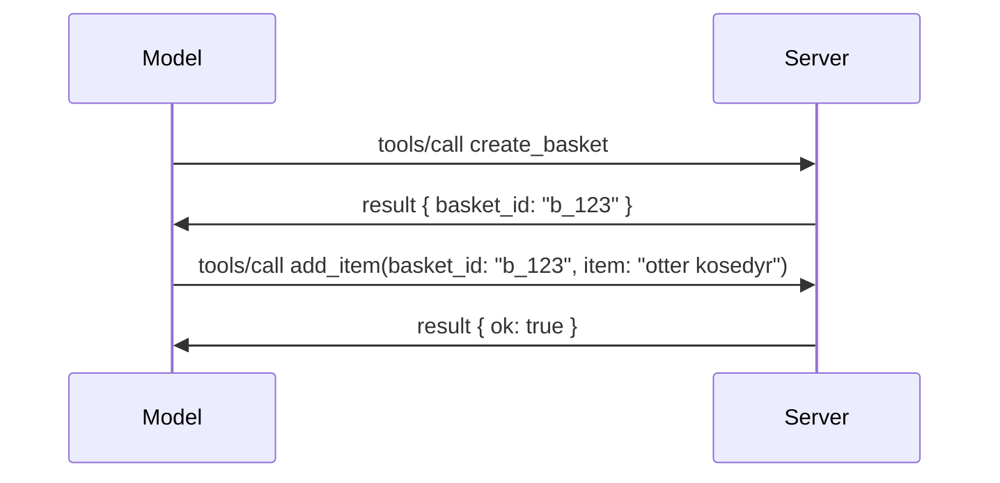

# Hva som er endret i MCP: Spesifikasjonen 2026-07-28

> **Status:** Endelig. MCP-spesifikasjonen `2026-07-28` ble levert 28. juli 2026
> og er den nåværende protokollrevisjonen. Denne leksjonen beskriver den endelige
> spesifikasjonen. Noen læreplanseksempler er eksplisitt versjonert til
> `2025-11-25` fordi SDK-ene deres ennå ikke har tatt i bruk den nye stateless API-en;
> behandle disse eksemplene som veiledning for eldre kompatibilitet.

## Oversikt

`2026-07-28` er den største revisjonen av MCP siden lanseringen. Seks
Spesifikasjonsforbedringsforslag (SEP-er) fjerner protokollnivå-økter og
gjør MCP stateless på transportlaget, utvidelser blir en førsteklasses,
versjonert mekanisme, og flere funksjoner dekket tidligere i denne læreplanen
(Roots, Sampling, Logging) er nå utfasede under en ny livssykluspålitisering. Denne
leksjonen oppsummerer hva som er endret, hvorfor det er viktig, og hva det betyr for kode
skrevet mot `2025-11-25`.

Kilde: [The 2026-07-28 MCP Specification Release Candidate](https://blog.modelcontextprotocol.io/posts/2026-07-28-release-candidate/) (Model Context Protocol Blog, David Soria Parra og Den Delimarsky).

## Læringsmål

Ved slutten av denne leksjonen vil du kunne:

- Forklare hvorfor MCP beveger seg mot en stateless protokollkjerne og hvilket problem det løser for horisontalt skalerte distribusjoner.
- Beskrive hvordan `initialize`/`initialized` håndtrykket og `Mcp-Session-Id`-headeren erstattes.
- Identifisere de nye `Mcp-Method` og `Mcp-Name` headerne og `ttlMs`/`cacheScope` cache-metainformasjonen.
- Gjenkjenne Extensions-rammeverket og de to utvidelsene som lanseres med denne utgivelsen: MCP Apps og Tasks.
- Oppsummere autorisasjonsforsterkningen og utfasing av Dynamic Client Registration.

- Identifisere hvilke kjernefunksjoner (Roots, Sampling, Logging) som nå er utfasede, og hva det betyr i praksis.
- Forklare endringen til Full JSON Schema 2020-12 for verktøyene `inputSchema`/`outputSchema`.

## En stateless protokoll

Hovedendringen: MCP blir stateless på protokollaget.

### Før (2025-11-25): økter knytter deg til én serverinstans

Å kalle et verktøy over Streamable HTTP starter med et `initialize` håndtrykk. Serveren svarer med en `Mcp-Session-Id` header som alle etterfølgende forespørsler må ha med:

```http
POST /mcp HTTP/1.1
Mcp-Session-Id: 1868a90c-3a3f-4f5b
Content-Type: application/json

{"jsonrpc":"2.0","id":2,"method":"tools/call",
 "params":{"name":"search","arguments":{"q":"otters"}}}
```

Fordi økten er knyttet til den serverinstansen som utstedte den, krever horisontalt skalerte distribusjoner **sticky routing** ved lastbalansereren og en **delt øktlagring** på tvers av instanser.

### Etter (2026-07-28): hver forespørsel er selvstendig

```http
POST /mcp HTTP/1.1
MCP-Protocol-Version: 2026-07-28
Mcp-Method: tools/call
Mcp-Name: search
Content-Type: application/json

{"jsonrpc":"2.0","id":1,"method":"tools/call",
 "params":{"name":"search","arguments":{"q":"otters"},
           "_meta":{"io.modelcontextprotocol/protocolVersion":"2026-07-28",
                    "io.modelcontextprotocol/clientInfo":{"name":"my-app","version":"1.0"},
                    "io.modelcontextprotocol/clientCapabilities":{}}}}
```

Hvilken som helst serverinstans kan håndtere denne forespørselen. Nøkkelendringer:

- **`initialize`/`initialized` håndtrykket er fjernet** ([SEP-2575](https://github.com/modelcontextprotocol/modelcontextprotocol/pull/2575)). Protokollversjon, klientinfo og klientkapasiteter flyttes inn i `_meta` på hver forespørsel. En ny `server/discover`-metode lar en klient hente serverkapasiteter på forhånd når de trengs.
- **`Mcp-Session-Id` headeren og protokollnivå-økten er fjernet** ([SEP-2567](https://github.com/modelcontextprotocol/modelcontextprotocol/pull/2567)). Sticky routing og delt øktlagring er ikke lenger nødvendig på protokollaget.

### Stateless protokoll, stateful applikasjoner

Å fjerne protokollnivå-økten betyr ikke at serveren din ikke kan være stateful. Det anbefalte mønsteret er det samme som HTTP API-er alltid har brukt: utsted et eksplisitt håndtak (en `basket_id`, en `browser_id`) fra ett verktøys kall, og la modellen sende tilbake det håndtaket som et ordinært argument på senere kall.



Dette gjør tilstanden synlig og rimelig for modellen i stedet for å skjule den i transportens metadata, og lar enhver serverinstans håndtere ethvert kall.

### Server-til-klient forespørsler, omstrukturert

En stateless protokoll trenger fortsatt en måte for en server å be klienten om noe midt i et kall (for eksempel en eliciteringsprompt):

- **Server-initierte forespørsler kan kun utstedes mens serveren aktivt behandler en klientforespørsel** ([SEP-2260](https://github.com/modelcontextprotocol/modelcontextprotocol/pull/2260)) — tidligere en anbefaling, nå et krav. En bruker blir aldri bedt om noe ut av det blå.
- **Multi Round-Trip Requests** ([SEP-2322](https://github.com/modelcontextprotocol/modelcontextprotocol/pull/2322)) erstatter å holde en SSE-strøm åpen. I stedet returnerer serveren et `InputRequiredResult`:

  ```json
  {
    "resultType": "input_required",
    "inputRequests": {
      "confirm": {
        "type": "elicitation",
        "message": "Delete 3 files?",
        "schema": { "type": "boolean" }
      }
    },
    "requestState": "eyJzdGVwIjoxLCJmaWxlcyI6WyJhIiwiYiIsImMiXX0="
  }
  ```

  Klienten samler svarene og sender det opprinnelige kallet på nytt med `inputResponses` pluss den ekkoede `requestState`. Enhver serverinstans kan ta opp gjentakelsen fordi alt som trengs er i payloaden.

### Adressebar, cachebar, sporbar

Tre mindre endringer gjør stateless trafikk enklere å drifte:

- **`Mcp-Method` og `Mcp-Name` headerne er påkrevd på Streamable HTTP** ([SEP-2243](https://github.com/modelcontextprotocol/modelcontextprotocol/pull/2243)), slik at lastbalanserere, gateways og rate-limitere kan rute på operasjonen uten å inspisere JSON-kroppen. Servere avviser forespørsler der header og kropp er uenige.
- **`tools/list` og ressursleser-resultater inneholder `ttlMs` og `cacheScope`** ([SEP-2549](https://github.com/modelcontextprotocol/modelcontextprotocol/pull/2549)), modellert etter HTTP `Cache-Control`. Klienter vet hvor lenge et listeresultat er ferskt og om det er trygt å dele på tvers av brukere, uten å trenge en langvarig SSE-strøm for å lære om endringer.
- **W3C Trace Context-propagasjon i `_meta` er dokumentert** ([SEP-414](https://github.com/modelcontextprotocol/modelcontextprotocol/pull/414)), og fikser nøkkelnavnene `traceparent`, `tracestate` og `baggage` slik at en distribuert spor kan følge et kall på tvers av klient-SDK, MCP-server og nedstrøms systemer i en [OpenTelemetry](https://opentelemetry.io/)-kompatibel backend.

## Utvidelser blir førsteklasses

Utvidelser eksisterte uformelt i `2025-11-25`. [SEP-2133](https://github.com/modelcontextprotocol/modelcontextprotocol/pull/2133) formaliserer dem:

- Utvidelser identifiseres med reverse-DNS ID-er.
- De forhandles gjennom et `extensions`-kart i klient- og serverkapasiteter.
- De bor i egne `ext-*` repositories med delegerte vedlikeholdere og versjoneres uavhengig av kjernespesifikasjonen.
- En ny Extensions Track i SEP-prosessen gir dem en vei fra eksperimentell til offisiell.

Denne utgivelsen leverer to offisielle utvidelser.

### MCP Apps: server-renderte brukergrensesnitt

[MCP Apps](https://blog.modelcontextprotocol.io/posts/2026-01-26-mcp-apps/) ([SEP-1865](https://github.com/modelcontextprotocol/modelcontextprotocol/pull/1865)) lar servere levere interaktive HTML-grensesnitt som verter render i et sandboxet iframe. Verktøy deklarerer UI-maler på forhånd slik at verter kan forhåndslaste, cache og sikkerhetsvurdere dem før noe kjører. Du dekket allerede grunnprinsippene i [Leksjon 15: MCP Apps](../03-GettingStarted/15-mcp-apps/README.md) — under Extensions-rammeverket er MCP Apps nå formelt en utvidelse fremfor en eksperimentell kjernefunksjon.

### Tasks blir en utvidelse

Tasks ble levert som en eksperimentell kjernefunksjon i `2025-11-25`. Produksjonsbruk avslørte nok redesignbehov til at riktig tilhørighet er en utvidelse: [Tasks-utvidelsen](https://github.com/modelcontextprotocol/modelcontextprotocol/pull/2663) endrer livssyklusen rundt den stateless modellen — en server kan svare `tools/call` med et task-håndtak, og klienten styrer fremdrift med `tasks/get`, `tasks/update` og `tasks/cancel`. Oppretting av task er serverstyrt: klienten annonserer utvidelsen, og serveren bestemmer når et kall skal kjøres som en task. `tasks/list` fjernes helt fordi den ikke kan skaleres trygt uten økter.

> **Migrasjonsmerknad:** hvis du implementerte den eksperimentelle `2025-11-25` Tasks API, må du migrere til den nye utvidelseslivssyklusen — den er ikke bakoverkompatibel.

## Autorisasjonsforsterkning

Flere SEP-er forsterker
[autorisasjonsspesifikasjonen](https://modelcontextprotocol.io/specification/2026-07-28/basic/authorization)
for bedre å tilpasse seg virkelige OAuth 2.0 / OpenID Connect-distribusjoner:

| SEP | Endring |
|---|---|
| [SEP-2468](https://github.com/modelcontextprotocol/modelcontextprotocol/pull/2468) | Klienter må validere `iss`-parameteren i autorisasjonssvar i henhold til [RFC 9207](https://www.rfc-editor.org/rfc/rfc9207), som begrenser mix-up-angrep som er vanlig i MCPs single-client, many-server mønster. En fremtidig versjon vil kreve avvisning av svar uten `iss`. |
| [SEP-837](https://github.com/modelcontextprotocol/modelcontextprotocol/pull/837) | Kun kompatibilitets Dynamic Client Registration-klienter oppgir sin OpenID Connect `application_type`, for å unngå feilaktige `"web"` standardverdier for skrivebords- og CLI-klienter. |
| [SEP-2352](https://github.com/modelcontextprotocol/modelcontextprotocol/pull/2352) | Kun kompatibilitetsregistrerte legitimasjoner er bundet til den autoriserende serverens `issuer`; klienter må registrere seg på nytt hvis en ressurs migrerer. |
| [SEP-2207](https://github.com/modelcontextprotocol/modelcontextprotocol/pull/2207) | Dokumenterer hvordan å be om oppfriskningstokens fra OpenID Connect-stil autoriseringsservere. |
| [SEP-2350](https://github.com/modelcontextprotocol/modelcontextprotocol/pull/2350) | Presiserer akkumulering av scope under step-up autorisasjon. |
| [SEP-2351](https://github.com/modelcontextprotocol/modelcontextprotocol/pull/2351) | Presiserer `.well-known` oppdagelsesuffixen. |

Hvis du bygger en autorisasjonsserver for MCP, oppgi `iss` i
autorisasjonssvarene og følg den endelige autorisasjonsspesifikasjonen. Se
[02-Security](../02-Security/README.md) for implementeringsveiledning.

Dynamic Client Registration forblir tilgjengelig for kompatibilitet, men er også
utfaset i `2026-07-28`. Nye implementasjoner bør bruke Client ID Metadata
Dokumenter.

## Utfasede funksjoner

Under den nye
[funksjonslivssykluspåliteligheten](https://github.com/modelcontextprotocol/modelcontextprotocol/pull/2577),
er Roots, Sampling, Logging og Dynamic Client Registration **Utfasede**:

| Funksjon | Anbefalt erstatning |
|---|---|
| Roots | Verktøyparametere, ressurs-URIer eller serverkonfigurasjon |
| Sampling | Direkte integrasjon med LLM-leverandør-APIer |
| Logging | `stderr` for stdio-transport; OpenTelemetry for strukturert observabilitet |
| Dynamic Client Registration | Client ID Metadata Dokumenter |

Disse funksjonene forblir i `2026-07-28` for kompatibilitet. De kan fjernes
i den første spesifikasjonsrevisjonen som slippes på eller etter 28. juli 2027;
faktisk fjerning kan skje senere. Nye implementasjoner bør bruke
erstatningsmønstrene ovenfor.

## Full JSON Schema 2020-12 for Verktøy

Verktøyets `inputSchema` og `outputSchema` heves til full [JSON Schema 2020-12](https://json-schema.org/draft/2020-12) ([SEP-2106](https://github.com/modelcontextprotocol/modelcontextprotocol/pull/2106)):

- Input-skjemaer beholder `type: "object"` rottrekkondisjonen men tillater nå sammensetning (`oneOf`, `anyOf`, `allOf`), betingelser og referanser (`$ref`, `$defs`).
- Output-skjemaer er ubegrenset, og `structuredContent` kan nå være hvilken som helst JSON-verdi i stedet for bare et objekt.
- Implementasjoner må ikke automatisk avreferere eksterne `$ref`-URIer og bør begrense skjemadybde og valideringstid (en beskyttelse mot tjenestenekt som må tas høyde for ved validering på serversiden).

Separat endres feilkode for manglende ressurs fra MCP-spesifikk `-32002` til JSON-RPC-standarden `-32602` (Invalid Params) ([SEP-2164](https://github.com/modelcontextprotocol/modelcontextprotocol/pull/2164)). Hvis klienten din matcher på bokstavelig `-32002`, må du oppdatere den.

## Hvordan protokollen utvikler seg videre

Denne utgivelsen inneholder brytende endringer, som MCP-vedlikeholderne ikke har til hensikt skal bli normen fremover. Tre styrings-SEP-er tar sikte på å forhindre en gjentakelse:

- **Funksjonslivssykluspålitelighet** gir hver funksjon en Aktiv → Utfaset → Fjernet sti med minst tolv måneder mellom utfasing og tidligste mulige fjerning.
- **Extensions-rammeverket** lar nye kapasiteter lanseres som valgbare utvidelser og stabiliseres der før de (om noen gang) flyttes inn i kjernespesifikasjonen.
- En Standards Track SEP kan ikke lenger nå Endelig status før et tilsvarende scenario finnes i [conformance suite](https://github.com/modelcontextprotocol/conformance) ([SEP-2484](https://github.com/modelcontextprotocol/modelcontextprotocol/pull/2484)) — samme suite som [SDK-nivåsystemet](https://github.com/modelcontextprotocol/modelcontextprotocol/pull/1777) scorer offisielle SDK-er mot.

## Utgivelsestidslinje og validering

- Release-kandidaten ble låst 21. mai 2026.
- Den endelige spesifikasjonen ble utgitt 28. juli 2026.

- SDK-støtte kan ligge etter spesifikasjonen. Sjekk
  [SDK-dokumentasjonen](https://modelcontextprotocol.io/docs/sdk) og SDK-ens
  utgivelsesnotater før du migrerer et eksempel.
- Følg de endelige endringene i
  [2026-07-28-spesifikasjonen](https://modelcontextprotocol.io/specification/2026-07-28/)
  og dens
  [endringslogg](https://modelcontextprotocol.io/specification/2026-07-28/changelog).

## Hva dette betyr for dette pensumet

Pensumet går over fra `2025-11-25`-eksempler til gjeldende
`2026-07-28`-spesifikasjon. Konkret:

- **Sesjoner og `initialize` håndtrykket** i eksempler som eksplisitt retter seg mot
  `2025-11-25` er gammel oppførsel. `2026-07-28`-protokollen erstatter dem
  med den statsløse forespørselsmodellen ovenfor.
- **Sampling og røtter** forblir tilgjengelige for kompatibilitet, men er utdatert.
  Nye design bør bruke erstatningsmønstrene som er listet ovenfor.
- **Den eksperimentelle «Tasks»-funksjonen**, hvis du har brukt den, må migreres til «Tasks»-utvidelsens nye livssyklus.
- **MCP-apper** ([Leksjon 15](../03-GettingStarted/15-mcp-apps/README.md)) påvirkes i praksis ikke; de flyttes bare under det formelle utvidelsesrammeverket.

## Tilleggsressurser

- [MCP-spesifikasjon 2026-07-28](https://modelcontextprotocol.io/specification/2026-07-28/)
- [2026-07-28 Endringslogg](https://modelcontextprotocol.io/specification/2026-07-28/changelog)
- [MCP-spesifikasjonens utgivelseskandidat 2026-07-28 (historisk blogginnlegg)](https://blog.modelcontextprotocol.io/posts/2026-07-28-release-candidate/)
- [Fremtiden for MCP-transporter](https://blog.modelcontextprotocol.io/posts/2025-12-19-mcp-transport-future/)
- [SEP-retningslinjer](https://modelcontextprotocol.io/community/sep-guidelines)
- [MCP SDK-nivåsysteem](https://modelcontextprotocol.io/docs/sdk)

## Neste steg

Gå tilbake til [Kjernekonsepter](./README.md) eller fortsett til
[Sikkerhet](../02-Security/README.md) for å anvende gjeldende `2026-07-28`-veiledning.

---

<!-- CO-OP TRANSLATOR DISCLAIMER START -->
**Ansvarsfraskrivelse**:
Dette dokumentet er oversatt ved hjelp av AI-oversettelsestjenesten [Co-op Translator](https://github.com/Azure/co-op-translator). Selv om vi streber etter nøyaktighet, vær oppmerksom på at automatiske oversettelser kan inneholde feil eller unøyaktigheter. Det opprinnelige dokumentet på originalspråket skal betraktes som den autoritative kilden. For kritisk informasjon anbefales profesjonell menneskelig oversettelse. Vi er ikke ansvarlige for eventuelle misforståelser eller feiltolkninger som oppstår ved bruk av denne oversettelsen.
<!-- CO-OP TRANSLATOR DISCLAIMER END -->