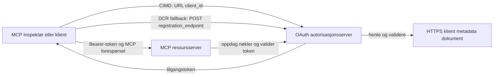

# CIMD og DCR autorisasjons-eksempel

Dette TypeScript-eksempelet sammenligner to måter en OAuth-klient kan oppnå en identitet
før tilgang til en beskyttet MCP-server:

- **Client ID Metadata Documents (CIMD)** bruker en stabil HTTPS-URL som
  `client_id`. Dette er den foretrukne mekanismen for klienter og autorisasjons-
  servere som ikke har et forhåndseksisterende forhold.
- **Dynamic Client Registration (DCR)** ber autorisasjonsserveren om å lage
  en uigjennomsiktig klient-ID i kjøretid. MCP `2026-07-28` beholder DCR kun for bakover-
  kompatibilitet.

Eksempelet bruker den stabile MCP TypeScript SDK v2 og den statsløse
MCP `2026-07-28` forespørselsmodellen. Det fungerer med en ekstern OAuth 2.1/OpenID
Connect autorisasjonsserver som for eksempel Auth0. MCP-serveren er en ressurs-
server: den validerer tilgangstokener, men autentiserer ikke brukere eller utsteder
tokens.

## Læringsmål

Ved å fullføre dette eksempelet vil du kunne:

- Forklare hvorfor CIMD er foretrukket fremfor DCR for nye MCP-klienter.
- Publisere et gyldig CIMD-dokument for en offentlig native klient.
- Konfigurere en MCP ressursserver for OAuth-oppdagelse og JWT-validering.
- Øve på CIMD og DCR med samme MCP-server og autorisasjonsserver.
- Håndheve en OAuth-omfang (scope) inne i et MCP-verktøy.
- Identifisere hvilke ansvar som tilhører klienten, ressursserveren og
  autorisasjonsserveren.

## Arkitektur



Autorisasjonsserveren velger og validerer registreringsmekanismen.
MCP-serveren ser kun den verifiserte `client_id`-påstanden. En HTTPS URL
med en sti identifiserer CIMD. En uigjennomsiktig ID er ikke nok for å bevise DCR fordi en
forhåndsregistrert klient også kan bruke en uigjennomsiktig ID; den valgfrie
`DCR_CLIENT_ID_PREFIX`-innstillingen leverer et leverandørspesifikt demohint.

## Registreringsprioritet

MCP-klienter som støtter alle mekanismer bør bruke denne rekkefølgen:

1. Bruk forhåndsregistrert klientinformasjon når det allerede er tilgjengelig.
2. Bruk CIMD når autorisasjonsserveren annonserer
   `client_id_metadata_document_supported: true`.
3. Bruk DCR kun som reserve når serveren annonserer en
   `registration_endpoint`.
4. Spør brukeren om forhåndsregistrert klientinformasjon når ingen av de ovennevnte
   er tilgjengelige.

## Prosjektoppsett

```text
src/
  config.ts          Environment validation
  dcr.ts             DCR compatibility request
  mcp.ts             MCP tools and scope checks
  oauth.ts           Authorization metadata and JWT verification
  register-dcr.ts    DCR command-line helper
  registration.ts    CIMD document and mechanism classification
  server.ts          Express, OAuth discovery, and MCP endpoint
test/
  dcr.test.ts
  oauth.test.ts
  registration.test.ts
  server.test.ts
```

## Forutsetninger

- Node.js 20.6 eller nyere. Skriptene bruker `--env-file` og `--import`.
- En OAuth 2.1/OpenID Connect autorisasjonsserver som støtter:
  - Autorisasjonskodeflyt med S256 PKCE.
  - OAuth Protected Resource Metadata og Resource Indicators.
  - JWT tilgangstokener og en JWKS-endepunkt.
  - CIMD, pluss DCR hvis du ønsker å sammenligne den gamle reserve-løsningen.
- MCP Inspector eller en annen MCP `2026-07-28` klient.
- En offentlig HTTPS URL for CIMD-dokumentet. En utviklingstunnel er egnet
  for laben; bruk et stabilt domene i produksjon.

## Installer og test

```bash
npm install
npm run build
npm test
```

De tolv testene bruker lokale nøkler og simulerte HTTP-endepunkter. De krever ikke en
autorisasjonsserver-konto. De verifiserer:

- CIMD dokumentets form og URL-begrensninger.
- Ærlig klassifisering av URL- og uigjennomsiktige klient-IDer.
- Håndtering av DCR-forespørsler og -responser.
- Avvisning av usikre DCR-endepunkter som ikke er loopback.
- Validering av JWT signatur, utsteder, publikum, utløp, klient-ID og omfang.
- En MCP `2026-07-28` i-prosess kall til `registration-info`.

## Konfigurer autorisasjonsserveren

De eksakte kontrollnavnene varierer etter leverandør. Konfigurer disse funksjonene:

1. Lag en API eller ressursserver hvis identifikator matcher nøyaktig din MCP
   URL, inkludert `/mcp`, for eksempel `http://127.0.0.1:3001/mcp`.
2. Bruk RS256 tilgangstokener og inkluder en `client_id` eller `azp` påstand.
3. Legg til `tool:greet` tillatelsen eller omfanget.
4. Aktiver autorisasjonskodeflyt med S256 PKCE for offentlige native klienter.
5. Aktiver Client ID Metadata Documents.
6. For sammenligningen kun, aktiver Dynamic Client Registration.
7. Sørg for at autorisasjonsservermetadata annonserer:
   - `issuer`
   - `authorization_endpoint`
   - `token_endpoint`
   - `jwks_uri`
   - `client_id_metadata_document_supported: true`
   - `registration_endpoint` når DCR er aktivert

### Auth0-eksempel

For Auth0, aktiver Client ID Metadata Document Registration, OIDC Dynamic
Application Registration, og Resource Parameter-kompatibilitet. Lag en API
hvis identifikator er den nøyaktige MCP-URLen og legg til `tool:greet` tillatelsen.
Tillat testbrukeren og tredjepartsklienter å be om den tillatelsen.

Leverandørdashbord og funksjonsdisponibilitet endrer seg over tid. Sjekk
leverandørdokumentasjonen før du bruker disse innstillingene utenfor denne laben.

## Konfigurer eksempelet

Lag `.env` fra eksemplet:

```powershell
Copy-Item .env.example .env
```

På bash-kompatible skall:

```bash
cp .env.example .env
```

Sett disse verdiene:

```dotenv
MCP_SERVER_URL=http://127.0.0.1:3001/mcp
AUTHORIZATION_SERVER_ISSUER=https://your-tenant.example.com/
AUTHORIZATION_SERVER_METADATA_URL=https://your-tenant.example.com/.well-known/openid-configuration
CLIENT_METADATA_URL=https://your-public-host.example.com/client-metadata.json
OAUTH_REDIRECT_URIS=http://127.0.0.1:6274/oauth/callback
DCR_CLIENT_ID_PREFIX=tpc_
```

Viktige detaljer:

- `AUTHORIZATION_SERVER_ISSUER` må nøyaktig matche `issuer` i den oppdagede
  autorisasjonsservermetadataen, inkludert eventuell avsluttende skråstrek.
- `MCP_SERVER_URL` må matche publikum på tilgangstokenet.
- `CLIENT_METADATA_URL` må bruke HTTPS, inneholde en ikke-rotnivå sti, og være den
  offentlige URLen som tjener metadata-ruten. Spørringsstrenger og fragmenter
  avvises slik at ruten og `client_id` forblir identiske.
- `OAUTH_REDIRECT_URIS` er en kommaseparert tillatt-liste. Standard er MCP
  Inspector loopback callback.
- `DCR_CLIENT_ID_PREFIX` er valgfri og leverandørspesifikk. La den være tom når
  din leverandør ikke har et pålitelig DCR-prefiks.

## Publiser CIMD-dokumentet

Start en tunnel som videresender sin offentlige HTTPS-opprinnelse til `127.0.0.1:3001`.
Sett `CLIENT_METADATA_URL` til den opprinnelsen pluss `/client-metadata.json`, og kjør deretter:

```bash
npm run build
npm start
```

Verifiser begge oppdagelsesdokumentene:

```bash
curl http://127.0.0.1:3001/health
curl http://127.0.0.1:3001/client-metadata.json
curl http://127.0.0.1:3001/.well-known/oauth-protected-resource/mcp
```

`client_id` returnert av den offentlige HTTPS metadata-URLen må være byte-for-byte
identisk med den URLen. Autorisasjonsserveren må validere dokumentet og
dets redirect URI før den utsteder et token.

> [!NOTE]
> Eksempelet hoster klientdokumentet og MCP ressursserver i én prosess
> for å holde laben liten. I produksjon eier og hoster MCP-klienten sitt CIMD-
> dokument uavhengig av ressursserveren.

## Sammenlign CIMD og DCR

Start MCP Inspector:

```bash
npx @modelcontextprotocol/inspector
```

Bruk Streamable HTTP og koble til `http://127.0.0.1:3001/mcp`.

### CIMD (Foretrukket)

1. Skriv inn den offentlige `CLIENT_METADATA_URL` som OAuth-klient-ID.
2. Be om `tool:greet` pluss eventuelle identitets-omfang krevd av din leverandør.
3. Fullfør pålogging og samtykke.
4. Kall `registration-info`. Den rapporterer `mechanism: "cimd"`.
5. Kall `greet` for å verifisere omfangshåndhevelse.

### DCR (Kompatibilitetsreserver)

1. Tøm Inspectors lagrede OAuth-tilstand.
2. La OAuth-klient-ID stå tom så Inspector kan bruke den annonserte
   `registration_endpoint`.
3. Fullfør pålogging og samtykke.
4. Kall `registration-info`.
5. Hvis `DCR_CLIENT_ID_PREFIX` matcher leverandørens genererte IDer, rapporterer verktøyet
   `mechanism: "dcr"`; ellers rapporterer den korrekt
   `opaque-client-id`.

Du kan også demonstrere registreringsforespørselen direkte:

```bash
npm run build
npm run register:dcr
```

Hjelperen skriver ut den returnerte klient-IDen, men skriver aldri ut en klienthemmelighet.
Behandle alle returnerte hemmeligheter som sensitive og oppbevar dem i et passende hemmelighetslager.

## Verktøy

| Verktøy | Krevd omfang | Formål |
| --- | --- | --- |
| `registration-info` | Verifisert klient | Rapporter klient-ID typen |
| `greet` | `tool:greet` | Demonstrer per-verktøy autorisasjon |

## Sikkerhetsnotater

- Valider JWT-signaturer gjennom autorisasjonsserverens JWKS-endepunkt.
- Krev eksakte samsvar for utsteder og publikum.
- Krev utløps- og klient-ID-påstander.
- Godta aldri et token utstedt for en annen ressurs.
- Send aldri MCP-tokenet videre til en nedstrøms API.
- Hold DCR-legitimasjon bundet til utstederen som opprettet dem.
- Valider CIMD redirect URIer med eksakt samsvar.
- Bruk SSRF-kontroller når en autorisasjonsserver henter CIMD-URLer.
- Bruk HTTPS for autorisasjons- og metadataendepunkter utenfor loopback
  utvikling.
- Ikke anta DCR utifra en uigjennomsiktig klient-ID med mindre leverandøren dokumenterer en
  pålitelig identifikator-konvensjon.

## Referanser

- [MCP autorisasjonsspesifikasjon](https://modelcontextprotocol.io/specification/2026-07-28/basic/authorization)
- [MCP klientregistrering](https://modelcontextprotocol.io/specification/2026-07-28/basic/authorization/client-registration)
- [MCP sikkerhets beste praksis](https://modelcontextprotocol.io/specification/2026-07-28/basic/security_best_practices)
- [MCP TypeScript SDK v2 autorisasjonsveiledning](https://ts.sdk.modelcontextprotocol.io/v2/serving/authorization)
- [OAuth Dynamic Client Registration (RFC 7591)](https://datatracker.ietf.org/doc/html/rfc7591)
- [OAuth Client ID Metadata Document utkast](https://datatracker.ietf.org/doc/html/draft-ietf-oauth-client-id-metadata-document-00)

## Takk

Den side-ved-side undervisningstilnærmingen var inspirert av
[Sambego/auth0-xmcp-cimd](https://github.com/Sambego/auth0-xmcp-cimd). Dette
eksempelet er en original, leverandørnøytral implementering bygget med den offisielle
MCP TypeScript SDK v2 for dette læreplanen.

---

<!-- CO-OP TRANSLATOR DISCLAIMER START -->
**Ansvarsfraskrivelse**:
Dette dokumentet er oversatt ved hjelp av AI-oversettelsestjenesten [Co-op Translator](https://github.com/Azure/co-op-translator). Selv om vi streber etter nøyaktighet, vær oppmerksom på at automatiske oversettelser kan inneholde feil eller unøyaktigheter. Det opprinnelige dokumentet på originalspråket skal betraktes som den autoritative kilden. For kritisk informasjon anbefales profesjonell menneskelig oversettelse. Vi er ikke ansvarlige for eventuelle misforståelser eller feiltolkninger som oppstår ved bruk av denne oversettelsen.
<!-- CO-OP TRANSLATOR DISCLAIMER END -->