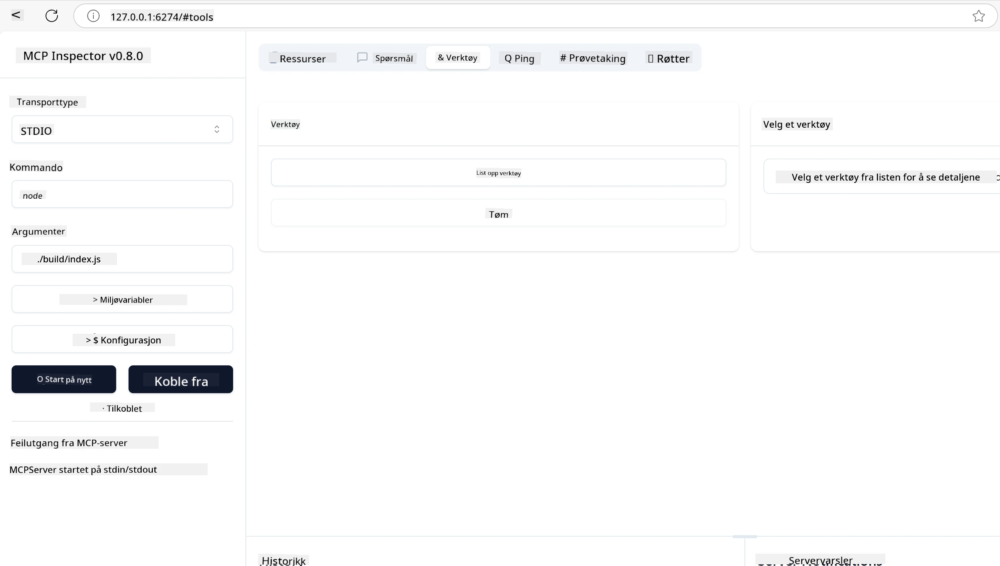
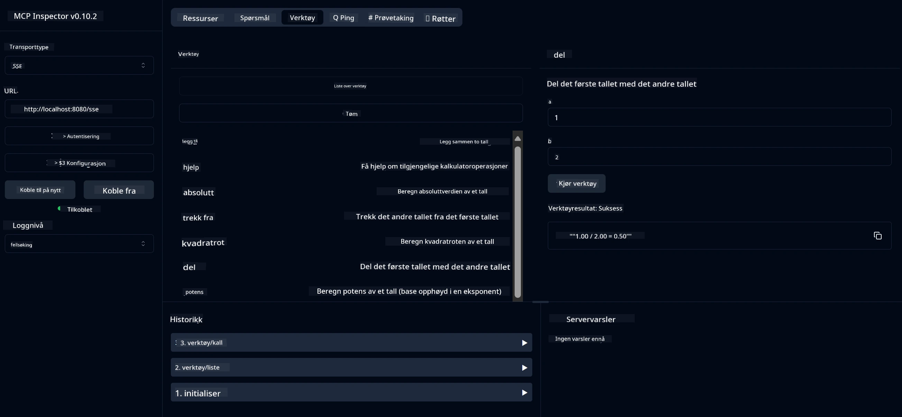
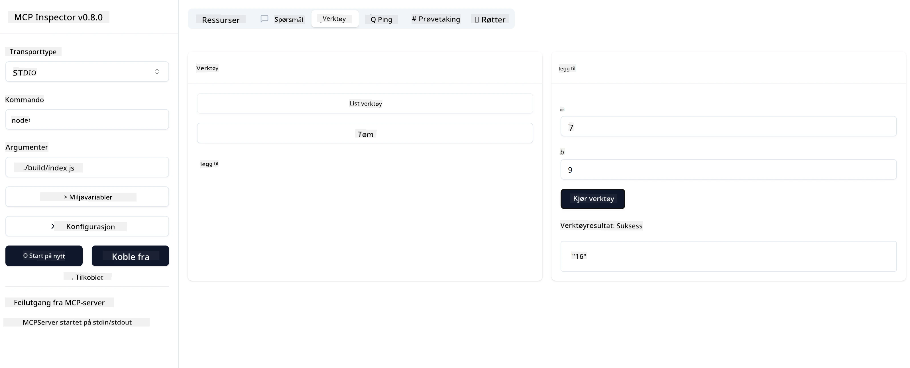

# Komme i gang med MCP

> [!NOTE]
> Java HTTP-eksempelet i denne leksjonen bruker den eldre HTTP+SSE-transporten og
> retter seg mot en SDK som er kompatibel med MCP `2025-11-25`. For nye fjernservere, bruk
> `2026-07-28` Streamable HTTP-transporten og bekreft støtte i din SDK.

Velkommen til dine første steg med Model Context Protocol (MCP)! Enten du er ny til MCP eller ønsker å utdype din forståelse, vil denne veiledningen lede deg gjennom nødvendig oppsett og utviklingsprosessen. Du vil oppdage hvordan MCP muliggjør sømløs integrasjon mellom AI-modeller og applikasjoner, og lære hvordan du raskt får miljøet klart for å bygge og teste løsninger drevet av MCP.

> TLDR; Hvis du bygger AI-apper, vet du at du kan legge til verktøy og andre ressurser til din LLM (stor språkmodell), for å gjøre LLM mer kunnskapsrik. Men hvis du plasserer disse verktøyene og ressursene på en server, kan appen og serverens kapasiteter brukes av alle klienter med/uten en LLM.

## Oversikt

Denne leksjonen gir praktisk veiledning om hvordan man setter opp MCP-miljøer og bygger dine første MCP-applikasjoner. Du vil lære hvordan man setter opp nødvendige verktøy og rammeverk, bygger grunnleggende MCP-servere, lager vertsapplikasjoner, og tester implementeringene dine.

Model Context Protocol (MCP) er en åpen protokoll som standardiserer hvordan applikasjoner gir kontekst til LLM-er. Tenk på MCP som en USB-C-port for AI-applikasjoner – den gir en standardisert måte å koble AI-modeller til forskjellige datakilder og verktøy.

## Læringsmål

Ved slutten av denne leksjonen vil du kunne:

- Sette opp utviklingsmiljøer for MCP i C#, Java, Python, TypeScript og Rust
- Bygge og distribuere grunnleggende MCP-servere med tilpassede funksjoner (ressurser, prompts og verktøy)
- Lage vertsapplikasjoner som kobler til MCP-servere
- Teste og feilsøke MCP-implementeringer

## Sette opp ditt MCP-miljø

Før du begynner å jobbe med MCP, er det viktig å forberede utviklingsmiljøet ditt og forstå den grunnleggende arbeidsflyten. Denne seksjonen vil lede deg gjennom de innledende oppsettsstegene for å sikre en smidig start med MCP.

### Forutsetninger

Før du dykker inn i MCP-utvikling, sørg for at du har:

- **Utviklingsmiljø**: For ditt valgte språk (C#, Java, Python, TypeScript eller Rust)
- **IDE/Editor**: Visual Studio, Visual Studio Code, IntelliJ, Eclipse, PyCharm eller en moderne kodeeditor
- **Pakkebehandlere**: NuGet, Maven/Gradle, pip, npm/yarn eller Cargo
- **API-nøkler**: For AI-tjenester du planlegger å bruke i dine vertsapplikasjoner

## Grunnleggende MCP-serverstruktur

En MCP-server inkluderer vanligvis:

- **Serverkonfigurasjon**: Sette opp port, autentisering og andre innstillinger
- **Ressurser**: Data og kontekst gjort tilgjengelig for LLM-er
- **Verktøy**: Funksjonalitet som modeller kan kalle på
- **Prompts**: Maler for å generere eller strukturere tekst

Her er et forenklet eksempel i TypeScript:

```typescript
import { McpServer, ResourceTemplate } from "@modelcontextprotocol/sdk/server/mcp.js";
import { StdioServerTransport } from "@modelcontextprotocol/sdk/server/stdio.js";
import { z } from "zod";

// Opprett en MCP-server
const server = new McpServer({
  name: "Demo",
  version: "1.0.0"
});

// Legg til et tillegg verktøy
server.tool("add",
  { a: z.number(), b: z.number() },
  async ({ a, b }) => ({
    content: [{ type: "text", text: String(a + b) }]
  })
);

// Legg til en dynamisk hilsningsressurs
server.resource(
  "file",
  // 'list'-parameteren styrer hvordan ressursen viser tilgjengelige filer. Å sette den til undefined deaktiverer visning for denne ressursen.
  new ResourceTemplate("file://{path}", { list: undefined }),
  async (uri, { path }) => ({
    contents: [{
      uri: uri.href,
      text: `File, ${path}!`
    }]
  })
);

// Legg til en filressurs som leser filinnholdet
server.resource(
  "file",
  new ResourceTemplate("file://{path}", { list: undefined }),
  async (uri, { path }) => {
    let text;
    try {
      text = await fs.readFile(path, "utf8");
    } catch (err) {
      text = `Error reading file: ${err.message}`;
    }
    return {
      contents: [{
        uri: uri.href,
        text
      }]
    };
  }
);

server.prompt(
  "review-code",
  { code: z.string() },
  ({ code }) => ({
    messages: [{
      role: "user",
      content: {
        type: "text",
        text: `Please review this code:\n\n${code}`
      }
    }]
  })
);

// Begynn å motta meldinger på stdin og sende meldinger på stdout
const transport = new StdioServerTransport();
await server.connect(transport);
```

I den foregående koden:

- Importerer nødvendige klasser fra MCP TypeScript SDK.
- Oppretter og konfigurerer en ny MCP-serverinstans.
- Registrerer et tilpasset verktøy (`calculator`) med en håndteringsfunksjon.
- Starter serveren for å lytte etter innkommende MCP-forespørsler.

## Testing og feilsøking

Før du begynner å teste MCP-serveren din, er det viktig å forstå tilgjengelige verktøy og beste praksis for feilsøking. Effektiv testing sikrer at serveren din oppfører seg som forventet og hjelper deg raskt å identifisere og løse problemer. Følgende seksjon skisserer anbefalte fremgangsmåter for å validere MCP-implementasjonen din.

MCP tilbyr verktøy som hjelper deg å teste og feilsøke serverne dine:

- **Inspector-verktøy**, denne grafiske grensesnittet lar deg koble til serveren og teste verktøy, prompts og ressurser.
- **curl**, du kan også koble til serveren ved å bruke et kommandolinjeverktøy som curl eller andre klienter som kan lage og kjøre HTTP-kommandoer.

### Bruke MCP Inspector

[MCP Inspector](https://github.com/modelcontextprotocol/inspector) er et visuelt testverktøy som hjelper deg å:

1. **Oppdage serverfunksjoner**: Automatisk oppdage tilgjengelige ressurser, verktøy og prompts
2. **Teste verktøyutførelse**: Prøve ulike parametere og se respons i sanntid
3. **Se servermetadata**: Undersøke serverinfo, skjemaer og konfigurasjoner

```bash
# for eksempel TypeScript, installere og kjøre MCP Inspector
npx @modelcontextprotocol/inspector node build/index.js
```

Når du kjører kommandoene ovenfor vil MCP Inspector starte et lokalt webgrensesnitt i nettleseren din. Du kan forvente å se et dashbord som viser dine registrerte MCP-servere, deres tilgjengelige verktøy, ressurser og prompts. Grensesnittet lar deg interaktivt teste verktøyutførelse, inspisere servermetadata og se respons i sanntid, noe som gjør det enklere å validere og feilsøke MCP-serverimplementeringene dine.

Her er et skjermbilde av hvordan det kan se ut:



## Vanlige oppsettproblemer og løsninger

| Problem | Mulig løsning |
|-------|-------------------|
| Tilkobling nektet | Sjekk om serveren kjører og at porten er riktig |
| Feil ved verktøyutførelse | Gå gjennom parameter-validering og feilhåndtering |
| Autentiseringsfeil | Verifiser API-nøkler og tillatelser |
| Skjema-valideringsfeil | Sørg for at parametrene matcher det definerte skjemaet |
| Server starter ikke | Sjekk for portkonflikter eller manglende avhengigheter |
| CORS-feil | Konfigurer riktige CORS-headere for kryss-opprinnelsesforespørsler |
| Autentiseringsproblemer | Verifiser tokenets gyldighet og tillatelser |

## Lokal utvikling

For lokal utvikling og testing kan du kjøre MCP-servere direkte på maskinen din:

1. **Start serverprosessen**: Kjør MCP-serverapplikasjonen din
2. **Konfigurer nettverk**: Sørg for at serveren er tilgjengelig på forventet port
3. **Koble klienter**: Bruk lokale tilkoblings-URLer som `http://localhost:3000`

```bash
# Eksempel: Kjøre en TypeScript MCP-server lokalt
npm run start
# Server kjører på http://localhost:3000
```

## Bygge din første MCP-server

Vi har dekket [Kjernebegreper](../../01-CoreConcepts/README.md) i en tidligere leksjon, nå er det tid for å bruke kunnskapen.

### Hva en server kan gjøre

Før vi begynner å skrive kode, la oss minne oss selv om hva en server kan gjøre:

En MCP-server kan for eksempel:

- Tilgå lokale filer og databaser
- Koble til eksterne APIer
- Utføre beregninger
- Integrere med andre verktøy og tjenester
- Tilby et brukergrensesnitt for interaksjon

Flott, nå som vi vet hva vi kan gjøre, la oss begynne å kode.

## Øvelse: Lage en server

For å lage en server, må du følge disse trinnene:

- Installer MCP SDK.
- Opprett et prosjekt og sett opp prosjektstrukturen.
- Skriv serverkoden.
- Test serveren.

### -1- Opprette prosjekt

#### TypeScript

```sh
# Opprett prosjektmappe og initialiser npm-prosjekt
mkdir calculator-server
cd calculator-server
npm init -y
```

#### Python

```sh
# Opprett prosjektmappe
mkdir calculator-server
cd calculator-server
# Åpne mappen i Visual Studio Code - Hopp over dette hvis du bruker en annen IDE
code .
```

#### .NET

```sh
dotnet new console -n McpCalculatorServer
cd McpCalculatorServer
```

#### Java

For Java, opprett et Spring Boot-prosjekt:

```bash
curl https://start.spring.io/starter.zip \
  -d dependencies=web \
  -d javaVersion=21 \
  -d type=maven-project \
  -d groupId=com.example \
  -d artifactId=calculator-server \
  -d name=McpServer \
  -d packageName=com.microsoft.mcp.sample.server \
  -o calculator-server.zip
```

Pakk ut zip-filen:

```bash
unzip calculator-server.zip -d calculator-server
cd calculator-server
# valgfritt fjern den ubrukte testen
rm -rf src/test/java
```

Legg til følgende komplette konfigurasjon i filen *pom.xml*:

```xml
<?xml version="1.0" encoding="UTF-8"?>
<project xmlns="http://maven.apache.org/POM/4.0.0"
    xmlns:xsi="http://www.w3.org/2001/XMLSchema-instance"
    xsi:schemaLocation="http://maven.apache.org/POM/4.0.0 http://maven.apache.org/xsd/maven-4.0.0.xsd">
    <modelVersion>4.0.0</modelVersion>
    
    <!-- Spring Boot parent for dependency management -->
    <parent>
        <groupId>org.springframework.boot</groupId>
        <artifactId>spring-boot-starter-parent</artifactId>
        <version>3.5.0</version>
        <relativePath />
    </parent>

    <!-- Project coordinates -->
    <groupId>com.example</groupId>
    <artifactId>calculator-server</artifactId>
    <version>0.0.1-SNAPSHOT</version>
    <name>Calculator Server</name>
    <description>Basic calculator MCP service for beginners</description>

    <!-- Properties -->
    <properties>
        <java.version>21</java.version>
        <maven.compiler.source>21</maven.compiler.source>
        <maven.compiler.target>21</maven.compiler.target>
    </properties>

    <!-- Spring AI BOM for version management -->
    <dependencyManagement>
        <dependencies>
            <dependency>
                <groupId>org.springframework.ai</groupId>
                <artifactId>spring-ai-bom</artifactId>
                <version>1.0.0-SNAPSHOT</version>
                <type>pom</type>
                <scope>import</scope>
            </dependency>
        </dependencies>
    </dependencyManagement>

    <!-- Dependencies -->
    <dependencies>
        <dependency>
            <groupId>org.springframework.ai</groupId>
            <artifactId>spring-ai-starter-mcp-server-webflux</artifactId>
        </dependency>
        <dependency>
            <groupId>org.springframework.boot</groupId>
            <artifactId>spring-boot-starter-actuator</artifactId>
        </dependency>
        <dependency>
         <groupId>org.springframework.boot</groupId>
         <artifactId>spring-boot-starter-test</artifactId>
         <scope>test</scope>
      </dependency>
    </dependencies>

    <!-- Build configuration -->
    <build>
        <plugins>
            <plugin>
                <groupId>org.springframework.boot</groupId>
                <artifactId>spring-boot-maven-plugin</artifactId>
            </plugin>
            <plugin>
                <groupId>org.apache.maven.plugins</groupId>
                <artifactId>maven-compiler-plugin</artifactId>
                <configuration>
                    <release>21</release>
                </configuration>
            </plugin>
        </plugins>
    </build>

    <!-- Repositories for Spring AI snapshots -->
    <repositories>
        <repository>
            <id>spring-milestones</id>
            <name>Spring Milestones</name>
            <url>https://repo.spring.io/milestone</url>
            <snapshots>
                <enabled>false</enabled>
            </snapshots>
        </repository>
        <repository>
            <id>spring-snapshots</id>
            <name>Spring Snapshots</name>
            <url>https://repo.spring.io/snapshot</url>
            <releases>
                <enabled>false</enabled>
            </releases>
        </repository>
    </repositories>
</project>
```

#### Rust

```sh
mkdir calculator-server
cd calculator-server
cargo init
```

### -2- Legge til avhengigheter

Nå som du har opprettet prosjektet, la oss legge til avhengigheter:

#### TypeScript

```sh
# Hvis ikke allerede installert, installer TypeScript globalt
npm install typescript -g

# Installer MCP SDK og Zod for skjema validering
npm install @modelcontextprotocol/sdk zod
npm install -D @types/node typescript
```

#### Python

```sh
# Opprett et virtuelt miljø og installer avhengigheter
python -m venv venv
venv\Scripts\activate
pip install "mcp[cli]"
```

#### Java

```bash
cd calculator-server
./mvnw clean install -DskipTests
```

#### Rust

```sh
cargo add rmcp --features server,transport-io
cargo add serde
cargo add tokio --features rt-multi-thread
```

### -3- Opprette prosjektfiler

#### TypeScript

Åpne filen *package.json* og erstatt innholdet med følgende for å sikre at du kan bygge og kjøre serveren:

```json
{
  "name": "calculator-server",
  "version": "1.0.0",
  "main": "index.js",
  "type": "module",
  "scripts": {
    "build": "tsc",
    "start": "npm run build && node ./build/index.js",
  },
  "keywords": [],
  "author": "",
  "license": "ISC",
  "description": "A simple calculator server using Model Context Protocol",
  "dependencies": {
    "@modelcontextprotocol/sdk": "^1.16.0",
    "zod": "^3.25.76"
  },
  "devDependencies": {
    "@types/node": "^24.0.14",
    "typescript": "^5.8.3"
  }
}
```

Lag en *tsconfig.json* med følgende innhold:

```json
{
  "compilerOptions": {
    "target": "ES2022",
    "module": "Node16",
    "moduleResolution": "Node16",
    "outDir": "./build",
    "rootDir": "./src",
    "strict": true,
    "esModuleInterop": true,
    "skipLibCheck": true,
    "forceConsistentCasingInFileNames": true
  },
  "include": ["src/**/*"],
  "exclude": ["node_modules"]
}
```

Lag en mappe for koden din:

```sh
mkdir src
touch src/index.ts
```

#### Python

Lag en fil *server.py*

```sh
touch server.py
```

#### .NET

Installer de nødvendige NuGet-pakkene:

```sh
dotnet add package ModelContextProtocol --prerelease
dotnet add package Microsoft.Extensions.Hosting
```

#### Java

For Java Spring Boot-prosjekter opprettes prosjektstrukturen automatisk.

#### Rust

For Rust opprettes en *src/main.rs* fil som standard når du kjører `cargo init`. Åpne filen og slett standardkoden.

### -4- Lage serverkode

#### TypeScript

Lag en fil *index.ts* og legg til følgende kode:

```typescript
import { McpServer, ResourceTemplate } from "@modelcontextprotocol/sdk/server/mcp.js";
import { StdioServerTransport } from "@modelcontextprotocol/sdk/server/stdio.js";
import { z } from "zod";
 
// Opprett en MCP-server
const server = new McpServer({
  name: "Calculator MCP Server",
  version: "1.0.0"
});
```

Nå har du en server, men den gjør ikke mye ennå, la oss fikse det.

#### Python

```python
# server.py
from mcp.server.fastmcp import FastMCP

# Opprett en MCP-server
mcp = FastMCP("Demo")
```

#### .NET

```csharp
using Microsoft.Extensions.DependencyInjection;
using Microsoft.Extensions.Hosting;
using Microsoft.Extensions.Logging;
using ModelContextProtocol.Server;
using System.ComponentModel;

var builder = Host.CreateApplicationBuilder(args);
builder.Logging.AddConsole(consoleLogOptions =>
{
    // Configure all logs to go to stderr
    consoleLogOptions.LogToStandardErrorThreshold = LogLevel.Trace;
});

builder.Services
    .AddMcpServer()
    .WithStdioServerTransport()
    .WithToolsFromAssembly();
await builder.Build().RunAsync();

// add features
```

#### Java

For Java, opprett kjerneserverkomponentene. Først, modifiser hovedapplikasjonsklassen:

*src/main/java/com/microsoft/mcp/sample/server/McpServerApplication.java*:

```java
package com.microsoft.mcp.sample.server;

import org.springframework.ai.tool.ToolCallbackProvider;
import org.springframework.ai.tool.method.MethodToolCallbackProvider;
import org.springframework.boot.SpringApplication;
import org.springframework.boot.autoconfigure.SpringBootApplication;
import org.springframework.context.annotation.Bean;
import com.microsoft.mcp.sample.server.service.CalculatorService;

@SpringBootApplication
public class McpServerApplication {

    public static void main(String[] args) {
        SpringApplication.run(McpServerApplication.class, args);
    }
    
    @Bean
    public ToolCallbackProvider calculatorTools(CalculatorService calculator) {
        return MethodToolCallbackProvider.builder().toolObjects(calculator).build();
    }
}
```

Lag kalkulatortjenesten *src/main/java/com/microsoft/mcp/sample/server/service/CalculatorService.java*:

```java
package com.microsoft.mcp.sample.server.service;

import org.springframework.ai.tool.annotation.Tool;
import org.springframework.stereotype.Service;

/**
 * Service for basic calculator operations.
 * This service provides simple calculator functionality through MCP.
 */
@Service
public class CalculatorService {

    /**
     * Add two numbers
     * @param a The first number
     * @param b The second number
     * @return The sum of the two numbers
     */
    @Tool(description = "Add two numbers together")
    public String add(double a, double b) {
        double result = a + b;
        return formatResult(a, "+", b, result);
    }

    /**
     * Subtract one number from another
     * @param a The number to subtract from
     * @param b The number to subtract
     * @return The result of the subtraction
     */
    @Tool(description = "Subtract the second number from the first number")
    public String subtract(double a, double b) {
        double result = a - b;
        return formatResult(a, "-", b, result);
    }

    /**
     * Multiply two numbers
     * @param a The first number
     * @param b The second number
     * @return The product of the two numbers
     */
    @Tool(description = "Multiply two numbers together")
    public String multiply(double a, double b) {
        double result = a * b;
        return formatResult(a, "*", b, result);
    }

    /**
     * Divide one number by another
     * @param a The numerator
     * @param b The denominator
     * @return The result of the division
     */
    @Tool(description = "Divide the first number by the second number")
    public String divide(double a, double b) {
        if (b == 0) {
            return "Error: Cannot divide by zero";
        }
        double result = a / b;
        return formatResult(a, "/", b, result);
    }

    /**
     * Calculate the power of a number
     * @param base The base number
     * @param exponent The exponent
     * @return The result of raising the base to the exponent
     */
    @Tool(description = "Calculate the power of a number (base raised to an exponent)")
    public String power(double base, double exponent) {
        double result = Math.pow(base, exponent);
        return formatResult(base, "^", exponent, result);
    }

    /**
     * Calculate the square root of a number
     * @param number The number to find the square root of
     * @return The square root of the number
     */
    @Tool(description = "Calculate the square root of a number")
    public String squareRoot(double number) {
        if (number < 0) {
            return "Error: Cannot calculate square root of a negative number";
        }
        double result = Math.sqrt(number);
        return String.format("√%.2f = %.2f", number, result);
    }

    /**
     * Calculate the modulus (remainder) of division
     * @param a The dividend
     * @param b The divisor
     * @return The remainder of the division
     */
    @Tool(description = "Calculate the remainder when one number is divided by another")
    public String modulus(double a, double b) {
        if (b == 0) {
            return "Error: Cannot divide by zero";
        }
        double result = a % b;
        return formatResult(a, "%", b, result);
    }

    /**
     * Calculate the absolute value of a number
     * @param number The number to find the absolute value of
     * @return The absolute value of the number
     */
    @Tool(description = "Calculate the absolute value of a number")
    public String absolute(double number) {
        double result = Math.abs(number);
        return String.format("|%.2f| = %.2f", number, result);
    }

    /**
     * Get help about available calculator operations
     * @return Information about available operations
     */
    @Tool(description = "Get help about available calculator operations")
    public String help() {
        return "Basic Calculator MCP Service\n\n" +
               "Available operations:\n" +
               "1. add(a, b) - Adds two numbers\n" +
               "2. subtract(a, b) - Subtracts the second number from the first\n" +
               "3. multiply(a, b) - Multiplies two numbers\n" +
               "4. divide(a, b) - Divides the first number by the second\n" +
               "5. power(base, exponent) - Raises a number to a power\n" +
               "6. squareRoot(number) - Calculates the square root\n" + 
               "7. modulus(a, b) - Calculates the remainder of division\n" +
               "8. absolute(number) - Calculates the absolute value\n\n" +
               "Example usage: add(5, 3) will return 5 + 3 = 8";
    }

    /**
     * Format the result of a calculation
     */
    private String formatResult(double a, String operator, double b, double result) {
        return String.format("%.2f %s %.2f = %.2f", a, operator, b, result);
    }
}
```

**Valgfrie komponenter for en produksjonsklar tjeneste:**

Lag en oppstartskonfigurasjon *src/main/java/com/microsoft/mcp/sample/server/config/StartupConfig.java*:

```java
package com.microsoft.mcp.sample.server.config;

import org.springframework.boot.CommandLineRunner;
import org.springframework.context.annotation.Bean;
import org.springframework.context.annotation.Configuration;

@Configuration
public class StartupConfig {
    
    @Bean
    public CommandLineRunner startupInfo() {
        return args -> {
            System.out.println("\n" + "=".repeat(60));
            System.out.println("Calculator MCP Server is starting...");
            System.out.println("SSE endpoint: http://localhost:8080/sse");
            System.out.println("Health check: http://localhost:8080/actuator/health");
            System.out.println("=".repeat(60) + "\n");
        };
    }
}
```

Lag en helse-kontroller *src/main/java/com/microsoft/mcp/sample/server/controller/HealthController.java*:

```java
package com.microsoft.mcp.sample.server.controller;

import org.springframework.http.ResponseEntity;
import org.springframework.web.bind.annotation.GetMapping;
import org.springframework.web.bind.annotation.RestController;
import java.time.LocalDateTime;
import java.util.HashMap;
import java.util.Map;

@RestController
public class HealthController {
    
    @GetMapping("/health")
    public ResponseEntity<Map<String, Object>> healthCheck() {
        Map<String, Object> response = new HashMap<>();
        response.put("status", "UP");
        response.put("timestamp", LocalDateTime.now().toString());
        response.put("service", "Calculator MCP Server");
        return ResponseEntity.ok(response);
    }
}
```

Lag en unntakshåndterer *src/main/java/com/microsoft/mcp/sample/server/exception/GlobalExceptionHandler.java*:

```java
package com.microsoft.mcp.sample.server.exception;

import org.springframework.http.HttpStatus;
import org.springframework.http.ResponseEntity;
import org.springframework.web.bind.annotation.ExceptionHandler;
import org.springframework.web.bind.annotation.RestControllerAdvice;

@RestControllerAdvice
public class GlobalExceptionHandler {

    @ExceptionHandler(IllegalArgumentException.class)
    public ResponseEntity<ErrorResponse> handleIllegalArgumentException(IllegalArgumentException ex) {
        ErrorResponse error = new ErrorResponse(
            "Invalid_Input", 
            "Invalid input parameter: " + ex.getMessage());
        return new ResponseEntity<>(error, HttpStatus.BAD_REQUEST);
    }

    public static class ErrorResponse {
        private String code;
        private String message;

        public ErrorResponse(String code, String message) {
            this.code = code;
            this.message = message;
        }

        // Hentere
        public String getCode() { return code; }
        public String getMessage() { return message; }
    }
}
```

Lag et tilpasset banner *src/main/resources/banner.txt*:

```text
_____      _            _       _             
 / ____|    | |          | |     | |            
| |     __ _| | ___ _   _| | __ _| |_ ___  _ __ 
| |    / _` | |/ __| | | | |/ _` | __/ _ \| '__|
| |___| (_| | | (__| |_| | | (_| | || (_) | |   
 \_____\__,_|_|\___|\__,_|_|\__,_|\__\___/|_|   
                                                
Calculator MCP Server v1.0
Spring Boot MCP Application
```

</details>

#### Rust

Legg til følgende kode øverst i *src/main.rs* filen. Dette importerer nødvendige biblioteker og moduler for MCP-serveren din.

```rust
use rmcp::{
    handler::server::{router::tool::ToolRouter, tool::Parameters},
    model::{ServerCapabilities, ServerInfo},
    schemars, tool, tool_handler, tool_router,
    transport::stdio,
    ServerHandler, ServiceExt,
};
use std::error::Error;
```

Kalkulator-serveren vil være enkel og kan legge sammen to tall. La oss lage en struct for å representere kalkulator-forespørselen.

```rust
#[derive(Debug, serde::Deserialize, schemars::JsonSchema)]
pub struct CalculatorRequest {
    pub a: f64,
    pub b: f64,
}
```

Deretter lager vi en struct som representerer kalkulator-serveren. Denne structen holder tool-routeren som brukes for å registrere verktøy.

```rust
#[derive(Debug, Clone)]
pub struct Calculator {
    tool_router: ToolRouter<Self>,
}
```

Nå kan vi implementere `Calculator` structen for å lage en ny forekomst av serveren og implementere serverhåndterer som gir serverinformasjon.

```rust
#[tool_router]
impl Calculator {
    pub fn new() -> Self {
        Self {
            tool_router: Self::tool_router(),
        }
    }
}

#[tool_handler]
impl ServerHandler for Calculator {
    fn get_info(&self) -> ServerInfo {
        ServerInfo {
            instructions: Some("A simple calculator tool".into()),
            capabilities: ServerCapabilities::builder().enable_tools().build(),
            ..Default::default()
        }
    }
}
```

Til slutt må vi implementere main-funksjonen for å starte serveren. Denne funksjonen lager en forekomst av `Calculator` structen og server den over standard input/output.

```rust
#[tokio::main]
async fn main() -> Result<(), Box<dyn Error>> {
    let service = Calculator::new().serve(stdio()).await?;
    service.waiting().await?;
    Ok(())
}
```

Serveren er nå satt opp til å gi grunnleggende informasjon om seg selv. Neste steg er å legge til et verktøy for å utføre addisjon.

### -5- Legge til et verktøy og en ressurs

Legg til et verktøy og en ressurs ved å legge til følgende kode:

#### TypeScript

```typescript
server.tool(
  "add",
  { a: z.number(), b: z.number() },
  async ({ a, b }) => ({
    content: [{ type: "text", text: String(a + b) }]
  })
);

server.resource(
  "greeting",
  new ResourceTemplate("greeting://{name}", { list: undefined }),
  async (uri, { name }) => ({
    contents: [{
      uri: uri.href,
      text: `Hello, ${name}!`
    }]
  })
);
```

Ditt verktøy tar parametrene `a` og `b` og kjører en funksjon som produserer en respons på formen:

```typescript
{
  contents: [{
    type: "text", content: "some content"
  }]
}
```

Din ressurs nås gjennom strengen "greeting" og tar en parameter `name` og produserer en lignende respons som verktøyet:

```typescript
{
  uri: "<href>",
  text: "a text"
}
```

#### Python

```python
# Legg til et tillegg verktøy
@mcp.tool()
def add(a: int, b: int) -> int:
    """Add two numbers"""
    return a + b


# Legg til en dynamisk hilsningsressurs
@mcp.resource("greeting://{name}")
def get_greeting(name: str) -> str:
    """Get a personalized greeting"""
    return f"Hello, {name}!"
```

I koden ovenfor har vi:

- Definert et verktøy `add` som tar parametrene `a` og `b`, begge heltall.
- Opprettet en ressurs kalt `greeting` som tar parameteren `name`.

#### .NET

Legg dette til i Program.cs-filen din:

```csharp
[McpServerToolType]
public static class CalculatorTool
{
    [McpServerTool, Description("Adds two numbers")]
    public static string Add(int a, int b) => $"Sum {a + b}";
}
```

#### Java

Verktøyene har allerede blitt opprettet i forrige steg.

#### Rust

Legg til et nytt verktøy inne i `impl Calculator` blokken:

```rust
#[tool(description = "Adds a and b")]
async fn add(
    &self,
    Parameters(CalculatorRequest { a, b }): Parameters<CalculatorRequest>,
) -> String {
    (a + b).to_string()
}
```

### -6- Endelig kode

La oss legge til siste koden vi trenger for at serveren kan starte:

#### TypeScript

```typescript
// Start å motta meldinger på stdin og sende meldinger på stdout
const transport = new StdioServerTransport();
await server.connect(transport);
```

Her er hele koden:

```typescript
// index.ts
import { McpServer, ResourceTemplate } from "@modelcontextprotocol/sdk/server/mcp.js";
import { StdioServerTransport } from "@modelcontextprotocol/sdk/server/stdio.js";
import { z } from "zod";

// Opprett en MCP-server
const server = new McpServer({
  name: "Calculator MCP Server",
  version: "1.0.0"
});

// Legg til et tillegg-verktøy
server.tool(
  "add",
  { a: z.number(), b: z.number() },
  async ({ a, b }) => ({
    content: [{ type: "text", text: String(a + b) }]
  })
);

// Legg til en dynamisk hilsen-ressurs
server.resource(
  "greeting",
  new ResourceTemplate("greeting://{name}", { list: undefined }),
  async (uri, { name }) => ({
    contents: [{
      uri: uri.href,
      text: `Hello, ${name}!`
    }]
  })
);

// Begynn å motta meldinger på stdin og sende meldinger på stdout
const transport = new StdioServerTransport();
server.connect(transport);
```

#### Python

```python
# server.py
from mcp.server.fastmcp import FastMCP

# Opprett en MCP-server
mcp = FastMCP("Demo")


# Legg til et addisjonsverktøy
@mcp.tool()
def add(a: int, b: int) -> int:
    """Add two numbers"""
    return a + b


# Legg til en dynamisk hilseneressurs
@mcp.resource("greeting://{name}")
def get_greeting(name: str) -> str:
    """Get a personalized greeting"""
    return f"Hello, {name}!"

# Hovedkjøringsblokk - dette er nødvendig for å kjøre serveren
if __name__ == "__main__":
    mcp.run()
```

#### .NET

Lag en Program.cs-fil med følgende innhold:

```csharp
using Microsoft.Extensions.DependencyInjection;
using Microsoft.Extensions.Hosting;
using Microsoft.Extensions.Logging;
using ModelContextProtocol.Server;
using System.ComponentModel;

var builder = Host.CreateApplicationBuilder(args);
builder.Logging.AddConsole(consoleLogOptions =>
{
    // Configure all logs to go to stderr
    consoleLogOptions.LogToStandardErrorThreshold = LogLevel.Trace;
});

builder.Services
    .AddMcpServer()
    .WithStdioServerTransport()
    .WithToolsFromAssembly();
await builder.Build().RunAsync();

[McpServerToolType]
public static class CalculatorTool
{
    [McpServerTool, Description("Adds two numbers")]
    public static string Add(int a, int b) => $"Sum {a + b}";
}
```

#### Java

Din komplette hovedapplikasjonsklasse bør se slik ut:

```java
// McpServerApplication.java
package com.microsoft.mcp.sample.server;

import org.springframework.ai.tool.ToolCallbackProvider;
import org.springframework.ai.tool.method.MethodToolCallbackProvider;
import org.springframework.boot.SpringApplication;
import org.springframework.boot.autoconfigure.SpringBootApplication;
import org.springframework.context.annotation.Bean;
import com.microsoft.mcp.sample.server.service.CalculatorService;

@SpringBootApplication
public class McpServerApplication {

    public static void main(String[] args) {
        SpringApplication.run(McpServerApplication.class, args);
    }
    
    @Bean
    public ToolCallbackProvider calculatorTools(CalculatorService calculator) {
        return MethodToolCallbackProvider.builder().toolObjects(calculator).build();
    }
}
```

#### Rust

Den endelige koden for Rust-serveren bør se slik ut:

```rust
use rmcp::{
    ServerHandler, ServiceExt,
    handler::server::{router::tool::ToolRouter, tool::Parameters},
    model::{ServerCapabilities, ServerInfo},
    schemars, tool, tool_handler, tool_router,
    transport::stdio,
};
use std::error::Error;

#[derive(Debug, serde::Deserialize, schemars::JsonSchema)]
pub struct CalculatorRequest {
    pub a: f64,
    pub b: f64,
}

#[derive(Debug, Clone)]
pub struct Calculator {
    tool_router: ToolRouter<Self>,
}

#[tool_router]
impl Calculator {
    pub fn new() -> Self {
        Self {
            tool_router: Self::tool_router(),
        }
    }
    
    #[tool(description = "Adds a and b")]
    async fn add(
        &self,
        Parameters(CalculatorRequest { a, b }): Parameters<CalculatorRequest>,
    ) -> String {
        (a + b).to_string()
    }
}

#[tool_handler]
impl ServerHandler for Calculator {
    fn get_info(&self) -> ServerInfo {
        ServerInfo {
            instructions: Some("A simple calculator tool".into()),
            capabilities: ServerCapabilities::builder().enable_tools().build(),
            ..Default::default()
        }
    }
}

#[tokio::main]
async fn main() -> Result<(), Box<dyn Error>> {
    let service = Calculator::new().serve(stdio()).await?;
    service.waiting().await?;
    Ok(())
}
```

### -7- Test serveren

Start serveren med følgende kommando:

#### TypeScript

```sh
npm run build
```

#### Python

```sh
mcp run server.py
```

> For å bruke MCP Inspector, bruk `mcp dev server.py` som automatisk starter Inspector og gir den nødvendige proxy-session token. Hvis du bruker `mcp run server.py`, må du manuelt starte Inspector og konfigurere tilkoblingen.

#### .NET

Sørg for at du er i prosjektmappen:

```sh
cd McpCalculatorServer
dotnet run
```

#### Java

```bash
./mvnw clean install -DskipTests
java -jar target/calculator-server-0.0.1-SNAPSHOT.jar
```

#### Rust

Kjør følgende kommandoer for å formatere og kjøre serveren:

```sh
cargo fmt
cargo run
```

### -8- Kjør med inspector

Inspector er et flott verktøy som kan starte opp serveren din og lar deg interagere med den slik at du kan teste at den fungerer. La oss starte den:

> [!NOTE]
> det kan se annerledes ut i "kommando"-feltet siden det inneholder kommandoen for å kjøre en server med din spesifikke runtime/

#### TypeScript

```sh
npx @modelcontextprotocol/inspector node build/index.js
```

eller legg det til i *package.json* slik: `"inspector": "npx @modelcontextprotocol/inspector node build/index.js"` og kjør deretter `npm run inspector`

#### Python

Python pakker inn et Node.js-verktøy kalt inspector. Det er mulig å kalle verktøyet slik:

```sh
mcp dev server.py
```


Men det implementerer ikke alle metodene som er tilgjengelige på verktøyet, så det anbefales at du kjører Node.js-verktøyet direkte som vist nedenfor:

```sh
npx @modelcontextprotocol/inspector mcp run server.py
```

Hvis du bruker et verktøy eller en IDE som lar deg konfigurere kommandoer og argumenter for å kjøre skript, 
sørg for å sette `python` i feltet `Command` og `server.py` som `Arguments`. Dette sikrer at skriptet kjører riktig.

#### .NET

Forsikre deg om at du befinner deg i prosjektmappen din:

```sh
cd McpCalculatorServer
npx @modelcontextprotocol/inspector dotnet run
```

#### Java

Sørg for at kalkulatorserveren din kjører
Kjør inspeksjonsverktøyet:

```cmd
npx @modelcontextprotocol/inspector
```

I inspeksjonsnettgrensesnittet:

1. Velg "SSE" som transporttype
2. Sett URL-en til: `http://localhost:8080/sse`
3. Klikk på "Connect"



**Du er nå koblet til serveren**
**Testseksjonen for Java-serveren er nå fullført**

Neste seksjon handler om å interagere med serveren.

Du bør se følgende brukergrensesnitt:


1. Koble til serveren ved å trykke på Connect-knappen
  Når du er koblet til serveren, bør du nå se følgende:

  

2. Velg "Tools" og "listTools", du bør se "Add" vises, velg "Add" og fyll inn parameterverdiene.

  Du bør se følgende svar, dvs. et resultat fra "add"-verktøyet:

  

Gratulerer, du har klart å lage og kjøre din første server!

#### Rust

For å kjøre Rust-serveren med MCP Inspector CLI, bruk følgende kommando:

```sh
npx @modelcontextprotocol/inspector cargo run --cli --method tools/call --tool-name add --tool-arg a=1 b=2
```

### Offisielle SDK-er

MCP tilbyr offisielle SDK-er for flere språk:

- [C# SDK](https://github.com/modelcontextprotocol/csharp-sdk) - Vedlikeholdes i samarbeid med Microsoft
- [Java SDK](https://github.com/modelcontextprotocol/java-sdk) - Vedlikeholdes i samarbeid med Spring AI
- [TypeScript SDK](https://github.com/modelcontextprotocol/typescript-sdk) - Den offisielle TypeScript-implementeringen
- [Python SDK](https://github.com/modelcontextprotocol/python-sdk) - Den offisielle Python-implementeringen
- [Kotlin SDK](https://github.com/modelcontextprotocol/kotlin-sdk) - Den offisielle Kotlin-implementeringen
- [Swift SDK](https://github.com/modelcontextprotocol/swift-sdk) - Vedlikeholdes i samarbeid med Loopwork AI
- [Rust SDK](https://github.com/modelcontextprotocol/rust-sdk) - Den offisielle Rust-implementeringen

## Viktige punkter

- Oppsett av et MCP-utviklingsmiljø er enkelt med språkspesifikke SDK-er
- Å bygge MCP-servere innebærer å lage og registrere verktøy med klare skjemaer
- Testing og feilsøking er essensielt for pålitelige MCP-implementeringer

## Eksempler

- [Java Calculator](../samples/java/calculator/README.md)
- [.NET Calculator](../../../../03-GettingStarted/samples/csharp)
- [JavaScript Calculator](../samples/javascript/README.md)
- [TypeScript Calculator](../samples/typescript/README.md)
- [Python Calculator](../../../../03-GettingStarted/samples/python)
- [Rust Calculator](../../../../03-GettingStarted/samples/rust)

## Oppgave

Lag en enkel MCP-server med et verktøy etter eget valg:

1. Implementer verktøyet i ditt foretrukne språk (.NET, Java, Python, TypeScript eller Rust).
2. Definer inndata-parametere og returverdier.
3. Kjør inspeksjonsverktøyet for å sikre at serveren fungerer som forventet.
4. Test implementeringen med forskjellige inndata.

## Løsning

[Løsning](./solution/README.md)

## Ytterligere ressurser

- [Bygg Agenter ved hjelp av Model Context Protocol på Azure](https://learn.microsoft.com/azure/developer/ai/intro-agents-mcp)
- [Ekstern MCP med Azure Container Apps (Node.js/TypeScript/JavaScript)](https://learn.microsoft.com/samples/azure-samples/mcp-container-ts/mcp-container-ts/)
- [.NET OpenAI MCP Agent](https://learn.microsoft.com/samples/azure-samples/openai-mcp-agent-dotnet/openai-mcp-agent-dotnet/)

## Hva skjer videre

Neste: [Kom i gang med MCP-klienter](../02-client/README.md)

---

<!-- CO-OP TRANSLATOR DISCLAIMER START -->
**Ansvarsfraskrivelse**:
Dette dokumentet er oversatt ved hjelp av AI-oversettelsestjenesten [Co-op Translator](https://github.com/Azure/co-op-translator). Selv om vi streber etter nøyaktighet, vær oppmerksom på at automatiske oversettelser kan inneholde feil eller unøyaktigheter. Det opprinnelige dokumentet på originalspråket skal betraktes som den autoritative kilden. For kritisk informasjon anbefales profesjonell menneskelig oversettelse. Vi er ikke ansvarlige for eventuelle misforståelser eller feiltolkninger som oppstår ved bruk av denne oversettelsen.
<!-- CO-OP TRANSLATOR DISCLAIMER END -->