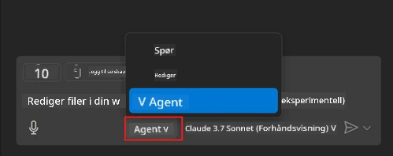
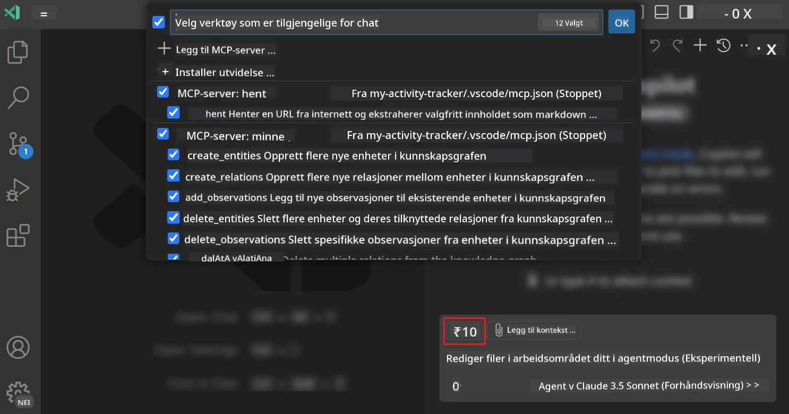
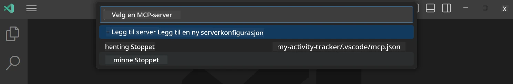
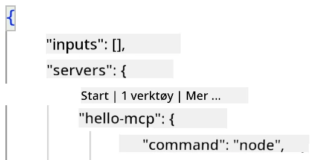
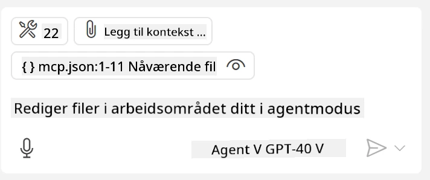
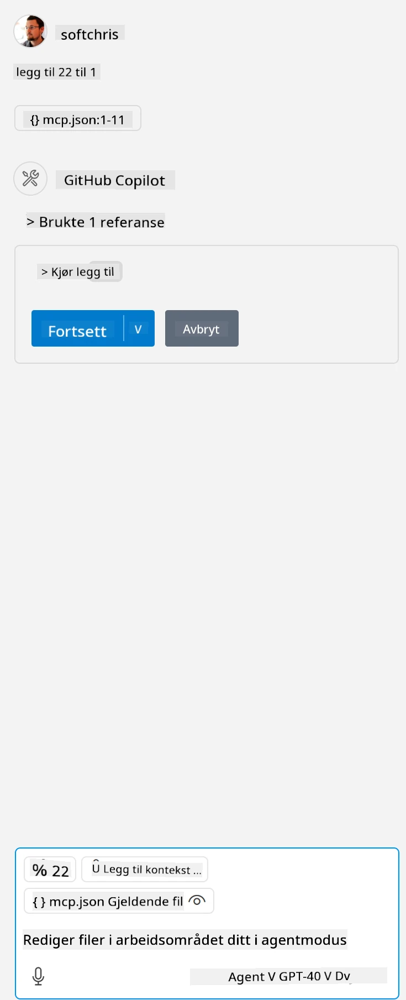

# Bruke en server fra GitHub Copilot Agent-modus

Visual Studio Code og GitHub Copilot kan fungere som klient og bruke en MCP-server. Hvorfor skulle vi ønske å gjøre det, kan du spørre? Vel, det betyr at hvilke som helst funksjoner MCP-serveren har kan nå brukes fra IDE-en din. Forestill deg at du legger til for eksempel GitHubs MCP-server, dette vil tillate deg å styre GitHub via forespørsler i stedet for å skrive spesifikke kommandoer i terminalen. Eller forestill deg generelt noe som kan forbedre din utvikleropplevelse, styrt via naturlig språk. Nå begynner du å se fordelen, ikke sant?

## Oversikt

Denne leksjonen dekker hvordan du bruker Visual Studio Code og GitHub Copilot sin Agent-modus som klient for din MCP-server.

## Læringsmål

Mot slutten av denne leksjonen vil du kunne:

- Bruke en MCP-server via Visual Studio Code.
- Kjøre funksjoner som verktøy via GitHub Copilot.
- Konfigurere Visual Studio Code til å finne og administrere MCP-serveren din.

## Bruk

Du kan kontrollere MCP-serveren din på to forskjellige måter:

- Brukergrensesnitt, du vil se hvordan dette gjøres senere i dette kapitlet.
- Terminal, det er mulig å styre ting fra terminalen ved å bruke `code`-kjørbar fil:

  For å legge til en MCP-server i brukerprofilen din, bruk kommandolinjealternativet --add-mcp og oppgi JSON-serverkonfigurasjonen i formen {\"name\":\"server-navn\",\"command\":...}.

  ```
  code --add-mcp "{\"name\":\"my-server\",\"command\": \"uvx\",\"args\": [\"mcp-server-fetch\"]}"
  ```

### Skjermbilder





La oss snakke mer om hvordan vi bruker det visuelle grensesnittet i neste avsnitt.

## Tilnærming

Slik må vi tilnærme oss dette på høyt nivå:

- Konfigurere en fil for å finne MCP-serveren vår.
- Starte/knytte til nevnte server for å få listen over dens funksjoner.
- Bruke disse funksjonene gjennom GitHub Copilot Chat-grensesnittet.

Flott, nå som vi forstår flyten, la oss prøve å bruke en MCP-server via Visual Studio Code gjennom en øvelse.

## Øvelse: Bruke en server

I denne øvelsen vil vi konfigurere Visual Studio Code til å finne din MCP-server slik at den kan brukes fra GitHub Copilot Chat-grensesnittet.

### -0- Forhåndstrinn, aktiver MCP Server-oppdagelse

Du må kanskje aktivere oppdagelse av MCP-servere.

1. Gå til `Fil -> Preferanser -> Innstillinger` i Visual Studio Code.

1. Søk etter "MCP" og aktiver `chat.mcp.discovery.enabled` i filen settings.json.

### -1- Lag konfigurasjonsfil

Begynn med å lage en konfigurasjonsfil i prosjektroten din, du trenger en fil kalt MCP.json og plassere den i en mappe kalt .vscode. Den skal se slik ut:

```text
.vscode
|-- mcp.json
```

La oss så se på hvordan vi kan legge til en serveroppføring.

### -2- Konfigurer en server

Legg til følgende innhold i *mcp.json*:

```json
{
    "inputs": [],
    "servers": {
       "hello-mcp": {
           "command": "node",
           "args": [
               "build/index.js"
           ]
       }
    }
}
```

Her er et enkelt eksempel over hvordan du starter en server skrevet i Node.js, for andre kjøretider pek ut riktig kommando for å starte serveren ved bruk av `command` og `args`.

### -3- Start serveren

Nå som du har lagt til en oppføring, la oss starte serveren:

1. Finn oppføringen din i *mcp.json* og sørg for at du finner "spill"-ikonet:

    

1. Klikk på "spill"-ikonet, du skal se verktøyikonet i GitHub Copilot Chat øker antallet tilgjengelige verktøy. Hvis du klikker på verktøyikonet, vil du se en liste over registrerte verktøy. Du kan hake av/fjerne hake for hvert verktøy avhengig av om du ønsker at GitHub Copilot skal bruke dem som kontekst:

  

1. For å kjøre et verktøy, skriv en prompt som du vet matcher beskrivelsen for ett av verktøyene dine, for eksempel en prompt som "add 22 to 1":

  

  Du skal se et svar som sier 23.

## Oppgave

Prøv å legge til en serveroppføring i *mcp.json*-filen din og sørg for at du kan starte/stanse serveren. Sørg også for at du kan kommunisere med verktøyene på serveren via GitHub Copilot Chat-grensesnittet.

## Løsning

[Løsning](./solution/README.md)

## Viktige punkter

Viktige punkter fra dette kapitlet er som følger:

- Visual Studio Code er en flott klient som lar deg bruke flere MCP-servere og deres verktøy.
- GitHub Copilot Chat-grensesnittet er hvordan du interagerer med serverne.
- Du kan be brukeren om inndata som API-nøkler som kan sendes til MCP-serveren når serveroppføringen konfigureres i *mcp.json*-filen.

## Eksempler

- [Java Calculator](../samples/java/calculator/README.md)
- [.Net Calculator](../../../../03-GettingStarted/samples/csharp)
- [JavaScript Calculator](../samples/javascript/README.md)
- [TypeScript Calculator](../samples/typescript/README.md)
- [Python Calculator](../../../../03-GettingStarted/samples/python)

## Ytterligere ressurser

- [Visual Studio-dokumentasjon](https://code.visualstudio.com/docs/copilot/chat/mcp-servers)

## Hva er neste

- Neste: [Opprette en stdio-server](../05-stdio-server/README.md)

---

<!-- CO-OP TRANSLATOR DISCLAIMER START -->
**Ansvarsfraskrivelse**:
Dette dokumentet er oversatt ved hjelp av AI-oversettelsestjenesten [Co-op Translator](https://github.com/Azure/co-op-translator). Selv om vi streber etter nøyaktighet, vær oppmerksom på at automatiske oversettelser kan inneholde feil eller unøyaktigheter. Det opprinnelige dokumentet på originalspråket skal betraktes som den autoritative kilden. For kritisk informasjon anbefales profesjonell menneskelig oversettelse. Vi er ikke ansvarlige for eventuelle misforståelser eller feiltolkninger som oppstår ved bruk av denne oversettelsen.
<!-- CO-OP TRANSLATOR DISCLAIMER END -->