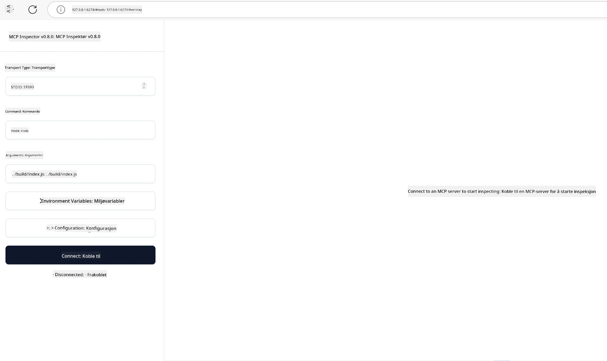

## Testing og Feilsøking

Før du begynner å teste MCP-serveren din, er det viktig å forstå tilgjengelige verktøy og beste praksis for feilsøking. Effektiv testing sikrer at serveren din oppfører seg som forventet og hjelper deg raskt med å identifisere og løse problemer. Følgende seksjon skisserer anbefalte tilnærminger for å validere din MCP-implementering.

## Oversikt

Denne leksjonen dekker hvordan du velger riktig testmetode og det mest effektive testverktøyet.

## Læringsmål

Innen slutten av denne leksjonen skal du kunne:

- Beskrive ulike tilnærminger for testing.
- Bruke forskjellige verktøy for å effektivt teste koden din.


## Teste MCP-servere

MCP tilbyr verktøy for å hjelpe deg med å teste og feilsøke serverne dine:

- **MCP Inspector**: Et kommandolinjeverktøy som kan kjøres både som CLI-verktøy og som et visuelt verktøy.
- **Manuell testing**: Du kan bruke et verktøy som curl til å kjøre web-forespørsler, men ethvert verktøy som kan kjøre HTTP fungerer.
- **Enhetstesting**: Det er mulig å bruke ditt foretrukne test-rammeverk for å teste funksjonene til både server og klient.

### Bruke MCP Inspector

Vi har forklart bruken av dette verktøyet i tidligere leksjoner, men la oss snakke om det litt på et overordnet nivå. Det er et verktøy bygget i Node.js, og du kan bruke det ved å kjøre `npx`-kjørbar fil som midlertidig laster ned og installerer verktøyet og rydder opp etter seg når forespørselen din er fullført.

[MCP Inspector](https://github.com/modelcontextprotocol/inspector) hjelper deg med å:

- **Oppdage serverkapasiteter**: Oppdage tilgjengelige ressurser, verktøy og forespørsler automatisk
- **Teste verktøykjøring**: Prøve ulike parametere og se svar i sanntid
- **Se servermetadata**: Undersøke serverinfo, skjemaer og konfigurasjoner

En typisk kjøring av verktøyet ser slik ut:

```bash
npx @modelcontextprotocol/inspector node build/index.js
```

Kommandoen ovenfor starter en MCP og dens visuelle grensesnitt og åpner et lokal webgrensesnitt i nettleseren din. Du kan forvente å se et dashbord som viser dine registrerte MCP-servere, deres tilgjengelige verktøy, ressurser og forespørsler. Grensesnittet lar deg interaktivt teste verktøykjøring, inspisere servermetadata og se svar i sanntid, noe som gjør det enklere å validere og feilsøke dine MCP-serverimplementasjoner.

Slik kan det se ut: 

Du kan også kjøre dette verktøyet i CLI-modus ved å legge til `--cli`-attributtet. Her er et eksempel på kjøring av verktøyet i "CLI"-modus som viser alle verktøyene på serveren:

```sh
npx @modelcontextprotocol/inspector --cli node build/index.js --method tools/list
```

### Manuell Testing

I tillegg til å kjøre inspector-verktøyet for å teste serverkapasiteter, er en annen lignende tilnærming å kjøre en klient som kan bruke HTTP, for eksempel curl.

Med curl kan du teste MCP-servere direkte ved bruk av HTTP-forespørsler:

```bash
# Eksempel: Test server metadata
curl http://localhost:3000/v1/metadata

# Eksempel: Kjør et verktøy
curl -X POST http://localhost:3000/v1/tools/execute \
  -H "Content-Type: application/json" \
  -d '{"name": "calculator", "parameters": {"expression": "2+2"}}'
```

Som du kan se fra eksempelet med curl ovenfor, brukes en POST-forespørsel for å påkalle et verktøy ved hjelp av en nyttelast som består av verktøyets navn og dets parametere. Bruk den tilnærmingen som passer deg best. CLI-verktøy pleier generelt å være raskere å bruke og egner seg godt til skripting, noe som kan være nyttig i et CI/CD-miljø.

### Enhetstesting

Lag enhetstester for verktøyene og ressursene dine for å sikre at de fungerer som forventet. Her er et eksempel på testkode.

```python
import pytest

from mcp.server.fastmcp import FastMCP
from mcp.shared.memory import (
    create_connected_server_and_client_session as create_session,
)

# Merk hele modulen for asynkrone tester
pytestmark = pytest.mark.anyio


async def test_list_tools_cursor_parameter():
    """Test that the cursor parameter is accepted for list_tools.

    Note: FastMCP doesn't currently implement pagination, so this test
    only verifies that the cursor parameter is accepted by the client.
    """

 server = FastMCP("test")

    # Lag et par testverktøy
    @server.tool(name="test_tool_1")
    async def test_tool_1() -> str:
        """First test tool"""
        return "Result 1"

    @server.tool(name="test_tool_2")
    async def test_tool_2() -> str:
        """Second test tool"""
        return "Result 2"

    async with create_session(server._mcp_server) as client_session:
        # Test uten markørparameter (utelatt)
        result1 = await client_session.list_tools()
        assert len(result1.tools) == 2

        # Test med markør=None
        result2 = await client_session.list_tools(cursor=None)
        assert len(result2.tools) == 2

        # Test med markør som streng
        result3 = await client_session.list_tools(cursor="some_cursor_value")
        assert len(result3.tools) == 2

        # Test med tom streng som markør
        result4 = await client_session.list_tools(cursor="")
        assert len(result4.tools) == 2
    
```

Koden ovenfor gjør følgende:

- Utnytter pytest-rammeverket som lar deg lage tester som funksjoner og bruke assert-setninger.
- Oppretter en MCP-server med to forskjellige verktøy.
- Bruker `assert` for å sjekke at visse betingelser er oppfylt.

Ta en titt på [hele filen her](https://github.com/modelcontextprotocol/python-sdk/blob/main/tests/client/test_list_methods_cursor.py)

Med filen over kan du teste din egen server for å sikre at kapasiteter opprettes som de skal.

Alle større SDK-er har lignende testseksjoner slik at du kan tilpasse etter ditt valgte runtime-miljø.

## Eksempler

- [Java Kalkulator](../samples/java/calculator/README.md)
- [.Net Kalkulator](../../../../03-GettingStarted/samples/csharp)
- [JavaScript Kalkulator](../samples/javascript/README.md)
- [TypeScript Kalkulator](../samples/typescript/README.md)
- [Python Kalkulator](../../../../03-GettingStarted/samples/python)

## Ytterligere Ressurser

- [Python SDK](https://github.com/modelcontextprotocol/python-sdk)

## Hva er Neste

- Neste: [Distribusjon](../09-deployment/README.md)

---

<!-- CO-OP TRANSLATOR DISCLAIMER START -->
**Ansvarsfraskrivelse**:
Dette dokumentet er oversatt ved hjelp av AI-oversettelsestjenesten [Co-op Translator](https://github.com/Azure/co-op-translator). Selv om vi streber etter nøyaktighet, vær oppmerksom på at automatiske oversettelser kan inneholde feil eller unøyaktigheter. Det opprinnelige dokumentet på originalspråket skal betraktes som den autoritative kilden. For kritisk informasjon anbefales profesjonell menneskelig oversettelse. Vi er ikke ansvarlige for eventuelle misforståelser eller feiltolkninger som oppstår ved bruk av denne oversettelsen.
<!-- CO-OP TRANSLATOR DISCLAIMER END -->