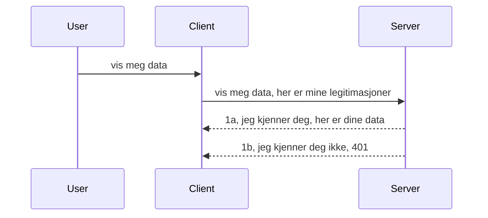

# Enkel autentisering

MCP SDK-er støtter bruk av OAuth 2.1 som, for å være ærlig, er en ganske involvert prosess som innebærer konsepter som autorisasjonsserver, ressursserver, sending av legitimasjon, mottak av en kode, bytte av koden mot en bærertoken til du endelig kan hente ressursdataene dine. Hvis du ikke er vant til OAuth, som er en flott ting å implementere, er det en god idé å starte med et grunnleggende nivå av autentisering og bygge opp til bedre og bedre sikkerhet. Derfor eksisterer dette kapitlet, for å bygge deg opp til mer avansert autentisering.

## Autentisering, hva mener vi?

Autentisering er en forkortelse for autentisering og autorisasjon. Tanken er at vi må gjøre to ting:

- **Autentisering**, som er prosessen med å finne ut om vi lar en person komme inn i huset vårt, at de har rett til å være "her", altså ha tilgang til ressursserveren vår hvor MCP Server-funksjonene våre ligger.
- **Autorisasjon**, er prosessen med å finne ut om en bruker skal ha tilgang til de spesifikke ressursene de ber om, for eksempel disse ordrene eller disse produktene, eller om de har tillatelse til å lese innholdet, men ikke slette som et annet eksempel.

## Legitimasjon: hvordan vi forteller systemet hvem vi er

Vel, de fleste webutviklere begynner å tenke i termer av å gi serveren en legitimasjon, vanligvis en hemmelighet som sier om de har lov til å være her, altså "Autentisering". Denne legitimasjonen er vanligvis en base64-kodet versjon av brukernavn og passord eller en API-nøkkel som entydig identifiserer en spesifikk bruker.

Dette innebærer å sende den via en header kalt "Authorization" slik:

```json
{ "Authorization": "secret123" }
```

Dette kalles vanligvis grunnleggende autentisering. Hvordan den overordnede flyten da fungerer er på følgende måte:



Nå som vi forstår hvordan det fungerer fra et flytperspektiv, hvordan implementerer vi det? Vel, de fleste webservere har et konsept som heter middleware, en kodebit som kjører som en del av forespørselen som kan verifisere legitimasjon, og hvis legitimasjonen er gyldig kan la forespørselen passere. Hvis forespørselen ikke har gyldig legitimasjon får du en autentiseringsfeil. La oss se hvordan dette kan implementeres:

**Python**

```python
class AuthMiddleware(BaseHTTPMiddleware):
    async def dispatch(self, request, call_next):

        has_header = request.headers.get("Authorization")
        if not has_header:
            print("-> Missing Authorization header!")
            return Response(status_code=401, content="Unauthorized")

        if not valid_token(has_header):
            print("-> Invalid token!")
            return Response(status_code=403, content="Forbidden")

        print("Valid token, proceeding...")
       
        response = await call_next(request)
        # legg til eventuelle kundehoder eller endre svaret på en eller annen måte
        return response


starlette_app.add_middleware(CustomHeaderMiddleware)
```

Her har vi:

- Opprettet en middleware kalt `AuthMiddleware` hvor dens `dispatch`-metode blir kalt av webserveren.
- Lagt til middleware i webserveren:

    ```python
    starlette_app.add_middleware(AuthMiddleware)
    ```

- Skrevet valideringslogikk som sjekker om Authorization-headeren er til stede og om hemmeligheten som sendes er gyldig:

    ```python
    has_header = request.headers.get("Authorization")
    if not has_header:
        print("-> Missing Authorization header!")
        return Response(status_code=401, content="Unauthorized")

    if not valid_token(has_header):
        print("-> Invalid token!")
        return Response(status_code=403, content="Forbidden")
    ```

    hvis hemmeligheten er til stede og gyldig lar vi forespørselen passere ved å kalle `call_next` og returnerer responsen.

    ```python
    response = await call_next(request)
    # legg til eventuelle kundehoder eller endre svaret på noen måte
    return response
    ```

Slik det fungerer er at hvis en webforespørsel gjøres mot serveren vil middleware bli kalt, og gitt implementeringen vil den enten la forespørselen passere eller returnere en feil som indikerer at klienten ikke har lov til å fortsette.

**TypeScript**

Her lager vi en middleware med det populære rammeverket Express og griper inn forespørselen før den når MCP Server. Her er koden for det:

```typescript
function isValid(secret) {
    return secret === "secret123";
}

app.use((req, res, next) => {
    // 1. Autorisasjonsheader til stede?
    if(!req.headers["Authorization"]) {
        res.status(401).send('Unauthorized');
    }
    
    let token = req.headers["Authorization"];

    // 2. Sjekk gyldighet.
    if(!isValid(token)) {
        res.status(403).send('Forbidden');
    }

   
    console.log('Middleware executed');
    // 3. Sender forespørselen videre til neste steg i forespørselsprosessen.
    next();
});
```

I denne koden gjør vi:

1. Sjekker om Authorization-headeren i det hele tatt er til stede, hvis ikke sender vi en 401-feil.
2. Sikrer at legitimasjonen/token er gyldig, hvis ikke sender vi en 403-feil.
3. Til slutt sender vi forespørselen videre i forespørselsrøret og returnerer den etterspurte ressursen.

## Øvelse: Implementer autentisering

La oss ta vår kunnskap og prøve å implementere det. Her er planen:

Server

- Lag en webserver og MCP-instans.
- Implementer en middleware for serveren.

Klient

- Send webforespørsel, med legitimasjon, via header.

### -1- Lag en webserver og MCP-instans

> [!WARNING]
> TypeScript-eksempelet under sikter mot MCP `2025-11-25`. Det sporer transport
> med `mcp-session-id` og er ikke et nåværende `2026-07-28` transporteksempel. MCP
> `2026-07-28` fjerner `initialize`-håndtrykket og protokollsesjons-ID; nye
> implementeringer bruker selvinnholdende forespørsler. Se
> [Hva som er endret i MCP: Spesifikasjonen 2026-07-28](../../01-CoreConcepts/mcp-2026-07-28.md).

I vårt første steg må vi lage webserverinstansen og MCP Serveren.

**Python**

Her lager vi en MCP server-instans, oppretter en starlette web-app og hoster den med uvicorn.

```python
# oppretter MCP-server

app = FastMCP(
    name="MCP Resource Server",
    instructions="Resource Server that validates tokens via Authorization Server introspection",
    host=settings["host"],
    port=settings["port"],
    debug=True
)

# oppretter starlette nettapp
starlette_app = app.streamable_http_app()

# serverer app via uvicorn
async def run(starlette_app):
    import uvicorn
    config = uvicorn.Config(
            starlette_app,
            host=app.settings.host,
            port=app.settings.port,
            log_level=app.settings.log_level.lower(),
        )
    server = uvicorn.Server(config)
    await server.serve()

run(starlette_app)
```

I denne koden:

- Oppretter MCP Serveren.
- Konstruerer starlette web-appen fra MCP Serveren, `app.streamable_http_app()`.
- Host og server web-appen ved bruk av uvicorn `server.serve()`.

**TypeScript**

Her lager vi en MCP Server-instans.

```typescript
const server = new McpServer({
      name: "example-server",
      version: "1.0.0"
    });

    // ... sett opp serverressurser, verktøy og prompt ...
```

Denne MCP Server-opprettelsen må skje innenfor vår POST /mcp-rutedefinisjon, så la oss ta koden over og flytte den slik:

```typescript
import express from "express";
import { randomUUID } from "node:crypto";
import { McpServer } from "@modelcontextprotocol/sdk/server/mcp.js";
import { StreamableHTTPServerTransport } from "@modelcontextprotocol/sdk/server/streamableHttp.js";
import { isInitializeRequest } from "@modelcontextprotocol/sdk/types.js"

const app = express();
app.use(express.json());

// Kart for å lagre transporter etter økt-ID
const transports: { [sessionId: string]: StreamableHTTPServerTransport } = {};

// Håndtere POST-forespørsler for klient-til-server kommunikasjon
app.post('/mcp', async (req, res) => {
  // Sjekk for eksisterende økt-ID
  const sessionId = req.headers['mcp-session-id'] as string | undefined;
  let transport: StreamableHTTPServerTransport;

  if (sessionId && transports[sessionId]) {
    // Gjenbruk eksisterende transport
    transport = transports[sessionId];
  } else if (!sessionId && isInitializeRequest(req.body)) {
    // Ny initialiseringsforespørsel
    transport = new StreamableHTTPServerTransport({
      sessionIdGenerator: () => randomUUID(),
      onsessioninitialized: (sessionId) => {
        // Lagre transporten etter økt-ID
        transports[sessionId] = transport;
      },
      // DNS rebinding-beskyttelse er som standard deaktivert for bakoverkompatibilitet. Hvis du kjører denne serveren
      // lokalt, sørg for å sette:
      // enableDnsRebindingProtection: true,
      // allowedHosts: ['127.0.0.1'],
    });

    // Rydd opp i transport når den stenges
    transport.onclose = () => {
      if (transport.sessionId) {
        delete transports[transport.sessionId];
      }
    };
    const server = new McpServer({
      name: "example-server",
      version: "1.0.0"
    });

    // ... sette opp serverressurser, verktøy og meldinger ...

    // Koble til MCP-serveren
    await server.connect(transport);
  } else {
    // Ugyldig forespørsel
    res.status(400).json({
      jsonrpc: '2.0',
      error: {
        code: -32000,
        message: 'Bad Request: No valid session ID provided',
      },
      id: null,
    });
    return;
  }

  // Håndtere forespørselen
  await transport.handleRequest(req, res, req.body);
});

// Gjenbrukbar håndterer for GET- og DELETE-forespørsler
const handleSessionRequest = async (req: express.Request, res: express.Response) => {
  const sessionId = req.headers['mcp-session-id'] as string | undefined;
  if (!sessionId || !transports[sessionId]) {
    res.status(400).send('Invalid or missing session ID');
    return;
  }
  
  const transport = transports[sessionId];
  await transport.handleRequest(req, res);
};

// Håndtere GET-forespørsler for server-til-klient varslinger via SSE
app.get('/mcp', handleSessionRequest);

// Håndtere DELETE-forespørsler for øktslutt
app.delete('/mcp', handleSessionRequest);

app.listen(3000);
```

Nå ser du hvordan MCP Server-opprettelsen ble flyttet inn i `app.post("/mcp")`.

La oss gå videre til neste steg med å lage middleware så vi kan validere den innkommende legitimasjonen.

### -2- Implementer en middleware for serveren

La oss gå videre til middleware-delen nå. Her lager vi en middleware som leter etter en legitimasjon i `Authorization`-headeren og validerer den. Hvis den er akseptabel vil forespørselen fortsette å gjøre det den skal (f.eks. liste verktøy, lese en ressurs eller hvilken som helst MCP-funksjonalitet klienten ba om).

**Python**

For å lage middleware må vi lage en klasse som arver fra `BaseHTTPMiddleware`. Det er to interessante deler:

- Forespørselen `request`, som vi leser header-informasjonen fra.
- `call_next` callbacken vi må kalle hvis klienten har medbrakt en legitimasjon vi godtar.

Først må vi håndtere tilfellet at `Authorization`-headeren mangler:

```python
has_header = request.headers.get("Authorization")

# ingen overskrift til stede, avvis med 401, ellers fortsett.
if not has_header:
    print("-> Missing Authorization header!")
    return Response(status_code=401, content="Unauthorized")
```

Her sender vi en 401 unauthorized-melding siden klienten feiler i autentiseringen.

Neste, hvis en legitimasjon ble sendt inn, må vi sjekke gyldigheten slik:

```python
 if not valid_token(has_header):
    print("-> Invalid token!")
    return Response(status_code=403, content="Forbidden")
```

Merk hvordan vi sender en 403 forbidden-melding ovenfor. La oss se hele middleware-eksempelet nedenfor som implementerer alt vi nevnte:

```python
class AuthMiddleware(BaseHTTPMiddleware):
    async def dispatch(self, request, call_next):

        has_header = request.headers.get("Authorization")
        if not has_header:
            print("-> Missing Authorization header!")
            return Response(status_code=401, content="Unauthorized")

        if not valid_token(has_header):
            print("-> Invalid token!")
            return Response(status_code=403, content="Forbidden")

        print("Valid token, proceeding...")
        print(f"-> Received {request.method} {request.url}")
        response = await call_next(request)
        response.headers['Custom'] = 'Example'
        return response

```

Flott, men hva med `valid_token`-funksjonen? Her er den:

```python
# IKKE bruk til produksjon - forbedre det !!
def valid_token(token: str) -> bool:
    # fjern "Bearer " prefikset
    if token.startswith("Bearer "):
        token = token[7:]
        return token == "secret-token"
    return False
```

Dette bør selvsagt forbedres.

VIKTIG: Du bør ALDRI ha hemmeligheter som dette i kode. Du bør ideelt hente verdien å sammenligne med fra en datakilde eller fra en IDP (identitetstjenesteleverandør) eller enda bedre, la IDP gjøre valideringen.

**TypeScript**

For å implementere dette med Express må vi kalle `use`-metoden som tar middleware-funksjoner.


Vi trenger å:

- Samhandle med request-variabelen for å sjekke oppgitt legitimasjon i `Authorization`-egenskapen.
- Validere legitimasjonen, og hvis gyldig la requesten fortsette slik at klientens MCP-request gjør det den skal (f.eks liste verktøy, lese ressurser eller hva enn som er MCP-relatert).

Her sjekker vi om `Authorization`-headeren er tilstede, og hvis ikke stopper vi requesten fra å gå gjennom:

```typescript
if(!req.headers["authorization"]) {
    res.status(401).send('Unauthorized');
    return;
}
```

Hvis headeren ikke sendes i det hele tatt, får du en 401.

Deretter sjekker vi om legitimasjonen er gyldig, hvis ikke stopper vi requesten igjen, men med en litt annen melding:

```typescript
if(!isValid(token)) {
    res.status(403).send('Forbidden');
    return;
} 
```

Legg merke til at du nå får en 403-feil.

Her er hele koden:

```typescript
app.use((req, res, next) => {
    console.log('Request received:', req.method, req.url, req.headers);
    console.log('Headers:', req.headers["authorization"]);
    if(!req.headers["authorization"]) {
        res.status(401).send('Unauthorized');
        return;
    }
    
    let token = req.headers["authorization"];

    if(!isValid(token)) {
        res.status(403).send('Forbidden');
        return;
    }  

    console.log('Middleware executed');
    next();
});
```

Vi har satt opp webserveren til å akseptere en middleware som sjekker legitimasjonen klienten forhåpentligvis sender oss. Hva med klienten selv?

### -3- Send nettforespørsel med legitimasjon via header

Vi må sikre at klienten sender legitimasjonen gjennom headeren. Siden vi skal bruke en MCP-klient for dette, må vi finne ut hvordan det gjøres.

**Python**

For klienten må vi sende en header med legitimasjonen slik:

```python
# IKKE hardkod verdien, ha den minst i en miljøvariabel eller en sikrere lagring
token = "secret-token"

async with streamablehttp_client(
        url = f"http://localhost:{port}/mcp",
        headers = {"Authorization": f"Bearer {token}"}
    ) as (
        read_stream,
        write_stream,
        session_callback,
    ):
        async with ClientSession(
            read_stream,
            write_stream
        ) as session:
            await session.initialize()
      
            # TODO, hva du ønsker gjort i klienten, f.eks. liste verktøy, kalle verktøy osv.
```

Legg merke til hvordan vi fyller `headers`-egenskapen slik: ` headers = {"Authorization": f"Bearer {token}"}`.

**TypeScript**

Vi kan løse dette i to trinn:

1. Fyll et konfigurasjonsobjekt med legitimasjonen vår.
2. Send konfigurasjonsobjektet til transporten.

```typescript

// IKKE hardkod verdien som vist her. Ha det minst som en miljøvariabel og bruk noe som dotenv (i utviklingsmodus).
let token = "secret123"

// definer et klient transportvalg-objekt
let options: StreamableHTTPClientTransportOptions = {
  sessionId: sessionId,
  requestInit: {
    headers: {
      "Authorization": "secret123"
    }
  }
};

// send valg-objektet til transporten
async function main() {
   const transport = new StreamableHTTPClientTransport(
      new URL(serverUrl),
      options
   );
```

Her ser du over hvordan vi måtte lage et `options`-objekt og plassere headerne våre under `requestInit`-egenskapen.

VIKTIG: Hvordan kan vi forbedre dette fra nå av? Vel, dagens implementasjon har noen utfordringer. For det første er det ganske risikabelt å sende legitimasjon på denne måten med mindre du i det minste har HTTPS. Selv da kan legitimasjonen bli stjålet, så du trenger et system hvor du enkelt kan tilbakekalle token og legge til ekstra kontroller som hvor i verden det kommer fra, om forespørselen skjer altfor ofte (bot-aktig atferd), kort sagt, det er mange bekymringer. 

Det bør sies at for veldig enkle APIer der du ikke vil at hvem som helst skal ringe APIet uten autentisering, er det vi har her en god start. 

Med det sagt, la oss prøve å styrke sikkerheten litt ved å bruke et standardisert format som JSON Web Token, også kjent som JWT eller "JOT"-token.

## JSON Web Tokens, JWT

Så, vi prøver å forbedre ting fra å sende veldig enkle legitimasjoner. Hva er de umiddelbare forbedringene vi får ved å adoptere JWT?

- **Sikkerhetsforbedringer**. I basic auth sender du brukernavn og passord som en base64-kodet token (eller sender en API-nøkkel) om og om igjen, noe som øker risikoen. Med JWT sender du brukernavn og passord og får en token tilbake som også er tidsbegrenset, altså den utløper. JWT lar deg enkelt bruke finmasket tilgangskontroll med roller, scopes og rettigheter.
- **Statelessness og skalerbarhet**. JWT-er er selvinnholdende, de bærer all brukerinfo og eliminerer behovet for å lagre server-side sesjonslagring. Token kan også valideres lokalt.
- **Interoperabilitet og føderasjon**. JWT er sentralt i Open ID Connect og brukes med kjente identitetsleverandører som Entra ID, Google Identity og Auth0. De gjør det også mulig med single sign-on og mye mer, og er dermed egnet for bedriftsbruk.
- **Modularitet og fleksibilitet**. JWT kan også brukes med API-gatewayer som Azure API Management, NGINX og flere. De støtter også autentiseringsscenarier og kommunikasjon mellom tjenester, inkludert imitasjon og delegasjon.
- **Ytelse og caching**. JWT kan cache etter dekoding, noe som reduserer behovet for parsing. Dette hjelper spesielt med apper med høy trafikk da det forbedrer gjennomstrømning og reduserer belastning på valgt infrastruktur.
- **Avanserte funksjoner**. De støtter også introspeksjon (sjekke gyldighet på server) og tilbakekalling (gjøre en token ugyldig).

Med alle disse fordelene, la oss se hvordan vi kan ta implementasjonen vår til neste nivå.

## Gjøre basic auth om til JWT

Så, de endringene vi må gjøre på oversiktsnivå er å:

- **Lære å konstruere en JWT-token** og gjøre den klar til å sendes fra klient til server.
- **Validere en JWT-token**, og hvis gyldig la klienten få tilgang til ressursene våre.
- **Sikker lagring av token**. Hvordan vi lagrer denne tokenen.
- **Beskytt rutene**. Vi må beskytte rutene, i vårt tilfelle må vi beskytte ruter og spesifikke MCP-funksjoner.
- **Legg til refresh tokens**. Sørg for at vi lager tokens som er kortvarige, men refresh tokens som er langvarige som kan brukes til å skaffe nye tokens hvis de utløper. Sørg også for at det finnes et refresh-endepunkt og en rotasjonsstrategi.

### -1- Konstruer en JWT-token

Først har en JWT-token følgende deler:

- **header**, algoritme brukt og tokentypen.
- **payload**, claims, som sub (brukeren eller enheten token representerer. I et auth-scenario er dette vanligvis brukerid), exp (når den utløper) role (rollen)
- **signatur**, signert med en hemmelighet eller privat nøkkel.

For dette må vi konstruere header, payload og den kodede token.

**Python**

```python

import jwt
import jwt
from jwt.exceptions import ExpiredSignatureError, InvalidTokenError
import datetime

# Hemmelig nøkkel brukt til å signere JWT
secret_key = 'your-secret-key'

header = {
    "alg": "HS256",
    "typ": "JWT"
}

# brukerinfo og dens påstander og utløpstid
payload = {
    "sub": "1234567890",               # Emne (bruker-ID)
    "name": "User Userson",                # Egendefinert påstand
    "admin": True,                     # Egendefinert påstand
    "iat": datetime.datetime.utcnow(),# Utstedt ved
    "exp": datetime.datetime.utcnow() + datetime.timedelta(hours=1)  # Utløp
}

# kode det
encoded_jwt = jwt.encode(payload, secret_key, algorithm="HS256", headers=header)
```

I koden over har vi:

- Definert en header som bruker HS256 som algoritme og type til JWT.
- Konstruert en payload som inneholder en subject eller brukerid, et brukernavn, en rolle, når token er utstedt og når den skal utløpe, dermed implementerer vi tidsbegrensningen vi nevnte tidligere. 

**TypeScript**

Her trenger vi noen avhengigheter som hjelper oss å konstruere JWT-tokenen.

Avhengigheter

```sh

npm install jsonwebtoken
npm install --save-dev @types/jsonwebtoken
```

Nå som vi har det på plass, la oss lage header, payload og gjennom det lage den kodede token.

```typescript
import jwt from 'jsonwebtoken';

const secretKey = 'your-secret-key'; // Bruk miljøvariabler i produksjon

// Definer nyttelasten
const payload = {
  sub: '1234567890',
  name: 'User usersson',
  admin: true,
  iat: Math.floor(Date.now() / 1000), // Utstedt på
  exp: Math.floor(Date.now() / 1000) + 60 * 60 // Utløper om 1 time
};

// Definer headeren (valgfritt, jsonwebtoken setter standardverdier)
const header = {
  alg: 'HS256',
  typ: 'JWT'
};

// Lag tokenet
const token = jwt.sign(payload, secretKey, {
  algorithm: 'HS256',
  header: header
});

console.log('JWT:', token);
```

Denne token er:

Signert med HS256
Gyldig i 1 time
Inneholder claims som sub, name, admin, iat, og exp.

### -2- Validere en token

Vi må også validere en token, dette bør gjøres på serveren for å sikre at det klienten sender oss faktisk er gyldig. Det er mange sjekker vi bør gjøre her, fra å validere struktur til gyldighet. Du oppfordres også til å legge til andre sjekker for å se om brukeren finnes i systemet ditt og mer.

For å validere en token må vi dekode den slik at vi kan lese den og deretter begynne å sjekke gyldigheten:

**Python**

```python

# Dekode og verifisere JWT
try:
    decoded = jwt.decode(token, secret_key, algorithms=["HS256"])
    print("✅ Token is valid.")
    print("Decoded claims:")
    for key, value in decoded.items():
        print(f"  {key}: {value}")
except ExpiredSignatureError:
    print("❌ Token has expired.")
except InvalidTokenError as e:
    print(f"❌ Invalid token: {e}")

```


I denne koden kaller vi `jwt.decode` med token, hemmelig nøkkel og valgt algoritme som input. Legg merke til at vi bruker en try-catch-konstruksjon siden en mislykket validering fører til at det kastes en feil.

**TypeScript**

Her må vi kalle `jwt.verify` for å få en dekodet versjon av token som vi kan analysere videre. Hvis dette kallet feiler, betyr det at strukturen på token er feil eller at den ikke lenger er gyldig.

```typescript

try {
  const decoded = jwt.verify(token, secretKey);
  console.log('Decoded Payload:', decoded);
} catch (err) {
  console.error('Token verification failed:', err);
}
```

MERK: som nevnt tidligere, bør vi utføre tilleggssjekker for å sikre at denne token refererer til en bruker i vårt system og sikre at brukeren har de rettighetene den hevder å ha.

Neste, la oss se nærmere på rollebasert tilgangskontroll, også kjent som RBAC.

## Legge til rollebasert tilgangskontroll

Ideen er at vi ønsker å uttrykke at forskjellige roller har ulike tillatelser. For eksempel antar vi at en admin kan gjøre alt, en vanlig bruker kan lese/skrive, og en gjest kan bare lese. Derfor er her noen mulige tillatelsesnivåer:

- Admin.Write 
- User.Read
- Guest.Read

La oss se på hvordan vi kan implementere slik kontroll med middleware. Middleware kan legges til per rute så vel som for alle ruter.

**Python**

```python
from starlette.middleware.base import BaseHTTPMiddleware
from starlette.responses import JSONResponse
import jwt

# IKKE ha hemmeligheten i koden som dette, det er kun for demonstrasjonsformål. Les den fra et trygt sted.
SECRET_KEY = "your-secret-key" # sett dette i en miljøvariabel
REQUIRED_PERMISSION = "User.Read"

class JWTPermissionMiddleware(BaseHTTPMiddleware):
    async def dispatch(self, request, call_next):
        auth_header = request.headers.get("Authorization")
        if not auth_header or not auth_header.startswith("Bearer "):
            return JSONResponse({"error": "Missing or invalid Authorization header"}, status_code=401)

        token = auth_header.split(" ")[1]
        try:
            decoded = jwt.decode(token, SECRET_KEY, algorithms=["HS256"])
        except jwt.ExpiredSignatureError:
            return JSONResponse({"error": "Token expired"}, status_code=401)
        except jwt.InvalidTokenError:
            return JSONResponse({"error": "Invalid token"}, status_code=401)

        permissions = decoded.get("permissions", [])
        if REQUIRED_PERMISSION not in permissions:
            return JSONResponse({"error": "Permission denied"}, status_code=403)

        request.state.user = decoded
        return await call_next(request)


```

Det finnes noen forskjellige måter å legge til middleware på som vist under:

```python

# Alternativ 1: legg til mellomvare mens starlette-appen blir konstruert
middleware = [
    Middleware(JWTPermissionMiddleware)
]

app = Starlette(routes=routes, middleware=middleware)

# Alternativ 2: legg til mellomvare etter at starlette-appen allerede er konstruert
starlette_app.add_middleware(JWTPermissionMiddleware)

# Alternativ 3: legg til mellomvare per rute
routes = [
    Route(
        "/mcp",
        endpoint=..., # håndterer
        middleware=[Middleware(JWTPermissionMiddleware)]
    )
]
```

**TypeScript**

Vi kan bruke `app.use` og en middleware som kjører for alle forespørsler.

```typescript
app.use((req, res, next) => {
    console.log('Request received:', req.method, req.url, req.headers);
    console.log('Headers:', req.headers["authorization"]);

    // 1. Sjekk om autorisasjonsheaderen er sendt

    if(!req.headers["authorization"]) {
        res.status(401).send('Unauthorized');
        return;
    }
    
    let token = req.headers["authorization"];

    // 2. Sjekk om token er gyldig
    if(!isValid(token)) {
        res.status(403).send('Forbidden');
        return;
    }  

    // 3. Sjekk om tokenbrukeren eksisterer i vårt system
    if(!isExistingUser(token)) {
        res.status(403).send('Forbidden');
        console.log("User does not exist");
        return;
    }
    console.log("User exists");

    // 4. Bekreft at token har riktige tillatelser
    if(!hasScopes(token, ["User.Read"])){
        res.status(403).send('Forbidden - insufficient scopes');
    }

    console.log("User has required scopes");

    console.log('Middleware executed');
    next();
});

```

Det finnes en del ting vi kan la vår middleware gjøre, og som vår middleware BØR gjøre, nemlig:

1. Sjekke om authorization-header er tilstede
2. Sjekke om token er gyldig, vi kaller `isValid` som er en metode vi skrev som sjekker integritet og gyldighet av JWT-token.
3. Verifisere at brukeren eksisterer i vårt system, dette bør vi sjekke.

   ```typescript
    // brukere i DB
   const users = [
     "user1",
     "User usersson",
   ]

   function isExistingUser(token) {
     let decodedToken = verifyToken(token);

     // TODO, sjekk om bruker finnes i DB
     return users.includes(decodedToken?.name || "");
   }
   ```

   Ovenfor har vi opprettet en veldig enkel `users` liste, som åpenbart burde vært i en database.

4. I tillegg bør vi også sjekke at token har riktige tillatelser.

   ```typescript
   if(!hasScopes(token, ["User.Read"])){
        res.status(403).send('Forbidden - insufficient scopes');
   }
   ```

   I koden over fra middleware sjekker vi at token inneholder User.Read tillatelse, hvis ikke sender vi en 403-feil. Under er `hasScopes` hjelpsmetoden.

   ```typescript
   function hasScopes(scope: string, requiredScopes: string[]) {
     let decodedToken = verifyToken(scope);
    return requiredScopes.every(scope => decodedToken?.scopes.includes(scope));
  }
   ```

Have a think which additional checks you should be doing, but these are the absolute minimum of checks you should be doing.

Using Express as a web framework is a common choice. There are helpers library when you use JWT so you can write less code.

- `express-jwt`, helper library that provides a middleware that helps decode your token.
- `express-jwt-permissions`, this provides a middleware `guard` that helps check if a certain permission is on the token.

Here's what these libraries can look like when used:

```typescript
const express = require('express');
const jwt = require('express-jwt');
const guard = require('express-jwt-permissions')();

const app = express();
const secretKey = 'your-secret-key'; // put this in env variable

// Decode JWT and attach to req.user
app.use(jwt({ secret: secretKey, algorithms: ['HS256'] }));

// Check for User.Read permission
app.use(guard.check('User.Read'));

// multiple permissions
// app.use(guard.check(['User.Read', 'Admin.Access']));

app.get('/protected', (req, res) => {
  res.json({ message: `Welcome ${req.user.name}` });
});

// Error handler
app.use((err, req, res, next) => {
  if (err.code === 'permission_denied') {
    return res.status(403).send('Forbidden');
  }
  next(err);
});

```

Nå har du sett hvordan middleware kan brukes både til autentisering og autorisering, men hva med MCP, endrer det hvordan vi gjør auth? La oss finne ut i neste seksjon.

### -3- Legg til RBAC til MCP

Du har så langt sett hvordan du kan legge til RBAC via middleware, men for MCP finnes det ingen enkel måte å legge til RBAC per MCP-funksjon, så hva gjør vi? Vel, vi må bare legge til kode som sjekker i dette tilfellet om klienten har rettigheter til å kalle et spesifikt verktøy:

Du har noen ulike valg om hvordan du kan oppnå RBAC per funksjon, her er noen:

- Legg til en sjekk for hvert verktøy, ressurs, prompt der du trenger å sjekke tillatelsesnivå.

   **python**

   ```python
   @tool()
   def delete_product(id: int):
      try:
          check_permissions(role="Admin.Write", request)
      catch:
        pass # klienten mislyktes i autorisasjon, kast autorisasjonsfeil
   ```

   **typescript**

   ```typescript
   server.registerTool(
    "delete-product",
    {
      title: Delete a product",
      description: "Deletes a product",
      inputSchema: { id: z.number() }
    },
    async ({ id }) => {
      
      try {
        checkPermissions("Admin.Write", request);
        // å gjøre, send id til productService og ekstern inngang
      } catch(Exception e) {
        console.log("Authorization error, you're not allowed");  
      }

      return {
        content: [{ type: "text", text: `Deletected product with id ${id}` }]
      };
    }
   );
   ```


- Bruk avansert servertilnærming og request handlers slik at du minimerer hvor mange steder du må gjøre sjekken.

   **Python**

   ```python
   
   tool_permission = {
      "create_product": ["User.Write", "Admin.Write"],
      "delete_product": ["Admin.Write"]
   }

   def has_permission(user_permissions, required_permissions) -> bool:
      # bruker_tillatelser: liste over tillatelser brukeren har
      # nødvendige_tillatelser: liste over tillatelser som kreves for verktøyet
      return any(perm in user_permissions for perm in required_permissions)

   @server.call_tool()
   async def handle_call_tool(
     name: str, arguments: dict[str, str] | None
   ) -> list[types.TextContent]:
    # Anta at request.user.permissions er en liste over brukerens tillatelser
     user_permissions = request.user.permissions
     required_permissions = tool_permission.get(name, [])
     if not has_permission(user_permissions, required_permissions):
        # Kaste feil "Du har ikke tillatelse til å bruke verktøyet {name}"
        raise Exception(f"You don't have permission to call tool {name}")
     # fortsett og kall verktøyet
     # ...
   ```   
   

   **TypeScript**

   ```typescript
   function hasPermission(userPermissions: string[], requiredPermissions: string[]): boolean {
       if (!Array.isArray(userPermissions) || !Array.isArray(requiredPermissions)) return false;
       // Returner true hvis brukeren har minst ett nødvendig tillatelse
       
       return requiredPermissions.some(perm => userPermissions.includes(perm));
   }
  
   server.setRequestHandler(CallToolRequestSchema, async (request) => {
      const { params: { name } } = request;
  
      let permissions = request.user.permissions;
  
      if (!hasPermission(permissions, toolPermissions[name])) {
         return new Error(`You don't have permission to call ${name}`);
      }
  
      // fortsett..
   });
   ```

   Merk, du må sikre at din middleware tildeler en dekodet token til request sin user-egenskap slik at koden over blir enkel.

### Oppsummering

Nå som vi har diskutert hvordan legge til støtte for RBAC generelt og for MCP spesielt, er det tid for å prøve å implementere sikkerhet på egen hånd for å sikre at du forstod konseptene som ble presentert.

## Oppgave 1: Bygg en MCP-server og MCP-klient med grunnleggende autentisering

Her skal du bruke det du har lært om å sende credentials gjennom headers.

## Løsning 1

[Solution 1](./code/basic/README.md)

## Oppgave 2: Oppgrader løsningen fra Oppgave 1 til å bruke JWT

Ta den første løsningen, men denne gangen la oss forbedre den.

I stedet for å bruke Basic Auth, la oss bruke JWT.

## Løsning 2

[Solution 2](./solution/jwt-solution/README.md)

## Utfordring

Legg til RBAC per verktøy som vi beskriver i seksjonen "Legg til RBAC til MCP".

## Oppsummering

Du har forhåpentligvis lært mye i dette kapitlet, fra ingen sikkerhet i det hele tatt, til grunnleggende sikkerhet, til JWT og hvordan det kan legges til MCP.

Vi har bygget et solid fundament med tilpassede JWT-er, men ettersom vi skalerer, beveger vi oss mot en standardbasert identitetsmodell. Å ta i bruk en IdP som Entra eller Keycloak lar oss avlaste token-utstedelse, validering og livssyklusstyring til en betrodd plattform — og gir oss frihet til å fokusere på applogikk og brukeropplevelse.

For dette har vi et mer [avansert kapittel om Entra](../../05-AdvancedTopics/mcp-security-entra/README.md)

## Hva Nå

- Neste: [Setting Up MCP Hosts](../12-mcp-hosts/README.md)

---

<!-- CO-OP TRANSLATOR DISCLAIMER START -->
**Ansvarsfraskrivelse**:
Dette dokumentet er oversatt ved hjelp av AI-oversettelsestjenesten [Co-op Translator](https://github.com/Azure/co-op-translator). Selv om vi streber etter nøyaktighet, vær oppmerksom på at automatiske oversettelser kan inneholde feil eller unøyaktigheter. Det opprinnelige dokumentet på originalspråket skal betraktes som den autoritative kilden. For kritisk informasjon anbefales profesjonell menneskelig oversettelse. Vi er ikke ansvarlige for eventuelle misforståelser eller feiltolkninger som oppstår ved bruk av denne oversettelsen.
<!-- CO-OP TRANSLATOR DISCLAIMER END -->