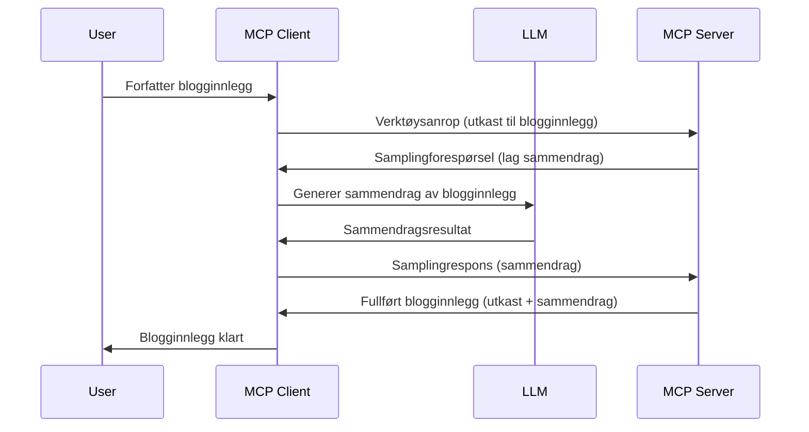

> [!WARNING]
> Sampling er avviklet i MCP `2026-07-28`. Denne leksjonen beholdes for
> eldre implementasjoner. Nye servere bør integrere direkte med en LLM
> leverandør-API.

# Sampling - delegere funksjoner til Client

> Sampling forblir i `2026-07-28` spesifikasjonen for kompatibilitet og er
> kvalifisert for fjerning i den første revisjonen som slippes på eller etter 28. juli,
> 2027. Eksempler i denne leksjonen kan bruke SDK-APIer som implementerer `2025-11-25`.
> Se [Hva som er endret i MCP: Spesifikasjonen 2026-07-28](../../01-CoreConcepts/mcp-2026-07-28.md).

I eldre implementasjoner lar Sampling en MCP-server be om hjelp fra en LLM
som styres av klienten. For nye implementasjoner, kall den valgte LLM-leverandøren
direkte i stedet.

La oss utforske noen brukstilfeller og hvordan du bygger en løsning som involverer sampling.

## Oversikt

I denne leksjonen fokuserer vi på å forklare når og hvor man bruker Sampling og hvordan konfigurere det.

## Læringsmål

I dette kapitlet skal vi:

- Forklare hva Sampling er og når man bruker det.
- Vise hvordan man konfigurerer Sampling i MCP.
- Gi eksempler på Sampling i praksis.

## Hva er Sampling og hvorfor bruke det?

Sampling er en avansert funksjon som fungerer på følgende måte:



### Sampling-forespørsel

Ok, nå som vi har et overordnet bilde av et troverdig scenario, la oss snakke om sampling-forespørselen som serveren sender tilbake til klienten. Slik kan en slik forespørsel se ut i JSON-RPC-format:

```json
{
  "jsonrpc": "2.0",
  "id": 1,
  "method": "sampling/createMessage",
  "params": {
    "messages": [
      {
        "role": "user",
        "content": {
          "type": "text",
          "text": "Create a blog post summary of the following blog post: <BLOG POST>"
        }
      }
    ],
    "modelPreferences": {
      "hints": [
        {
          "name": "claude-3-sonnet"
        }
      ],
      "intelligencePriority": 0.8,
      "speedPriority": 0.5
    },
    "systemPrompt": "You are a helpful assistant.",
    "maxTokens": 100
  }
}
```

Det er noen ting her verdt å nevne:

- Prompt, under content -> text, er vår prompt som er en instruksjon til LLM om å oppsummere innholdet i et blogginnlegg.

- **modelPreferences**. Denne seksjonen er nettopp det, et ønske, en anbefaling om hvilken konfigurasjon som bør brukes med LLM. Brukeren kan velge å følge disse anbefalingene eller endre dem. I dette tilfellet er det anbefalinger om modell å bruke samt hastighet og prioritet på intelligens.
- **systemPrompt**, dette er din vanlige systemprompt som gir LLM-en din en personlighet og inneholder veiledningsinstruksjoner.
- **maxTokens**, dette er en annen egenskap som angir hvor mange tokens som anbefales å brukes for denne oppgaven.

### Sampling-respons

Denne responsen er det MCP-klienten ender opp med å sende tilbake til MCP-serveren og er resultatet av at klienten kaller LLM, venter på det svaret og deretter konstruerer denne meldingen. Slik kan den se ut i JSON-RPC:

```json
{
  "jsonrpc": "2.0",
  "id": 1,
  "result": {
    "role": "assistant",
    "content": {
      "type": "text",
      "text": "Here's your abstract <ABSTRACT>"
    },
    "model": "gpt-5",
    "stopReason": "endTurn"
  }
}
```

Merk hvordan responsen er et sammendrag av blogginnlegget akkurat som vi ba om. Legg også merke til hvordan den brukte `model` ikke er den vi ba om, men "gpt-5" over "claude-3-sonnet". Dette illustrerer at brukeren kan ombestemme seg på hva som skal brukes, og at din sampling-forespørsel er en anbefaling.

Ok, nå som vi forstår hovedflyten, og nyttig oppgave å bruke det til "blogginnlegg + sammendrag", la oss se hva vi må gjøre for å få det til å fungere.

### Meldings-typer

Sampling-meldinger er ikke begrenset til bare tekst, men du kan også sende bilder og lyd. Slik ser JSON-RPC forskjellig ut:

**Tekst**

```json
{
  "type": "text",
  "text": "The message content"
}
```

**Bildeinnhold**

```json
{
  "type": "image",
  "data": "base64-encoded-image-data",
  "mimeType": "image/jpeg"
}
```

**Lydinnhold**

```json
{
  "type": "audio",
  "data": "base64-encoded-audio-data",
  "mimeType": "audio/wav"
}
```

> NOTE: For nåværende status og migreringsveiledning, se den
> [avviklede Sampling-dokumentasjonen](https://modelcontextprotocol.io/specification/2026-07-28/client/sampling).

## Hvordan konfigurere Sampling i Client

> Merk: hvis du bare bygger en server, trenger du ikke gjøre mye her.

I en klient må du spesifisere følgende funksjon slik:

```json
{
  "capabilities": {
    "sampling": {}
  }
}
```

Dette vil deretter bli plukket opp når din valgte klient initialiseres med serveren.

## Eksempel på Sampling i praksis - Lag et Blogginnlegg

La oss kode en sampling-server sammen, vi må gjøre følgende:

1. Lag et verktøy på Serveren.
1. Dette verktøyet skal lage en sampling-forespørsel.
1. Verktøyet skal vente på at klientens sampling-forespørsel blir besvart.
1. Så skal verktøyets resultat produseres.

La oss se på koden steg for steg:

### -1- Lag verktøyet

**python**

```python
@mcp.tool()
async def create_blog(title: str, content: str, ctx: Context[ServerSession, None]) -> str:
    """Create a blog post and generate a summary"""

```

### -2- Lag en sampling-forespørsel

Utvid verktøyet ditt med følgende kode:

**python**

```python
post = BlogPost(
        id=len(posts) + 1,
        title=title,
        content=content,
        abstract=""
    )

prompt = f"Create an abstract of the following blog post: title: {title} and draft: {content} "

result = await ctx.session.create_message(
        messages=[
            SamplingMessage(
                role="user",
                content=TextContent(type="text", text=prompt),
            )
        ],
        max_tokens=100,
)

```

### -3- Vent på svar og returner respons

**python**

```python
post.abstract = result.content.text

posts.append(post)

# returner hele produktet
return json.dumps({
    "id": post.title,
    "abstract": post.abstract
})
```

### -4- Full kode

**python**

```python
from starlette.applications import Starlette
from starlette.routing import Mount, Host

from mcp.server.fastmcp import Context, FastMCP

from mcp.server.session import ServerSession
from mcp.types import SamplingMessage, TextContent

import json


from uuid import uuid4
from typing import List
from pydantic import BaseModel


mcp = FastMCP("Blog post generator")

# app = FastAPI()

posts = []

class BlogPost(BaseModel):
    id: int
    title: str
    content: str
    abstract: str

posts: List[BlogPost] = []

@mcp.tool()
async def create_blog(title: str, content: str, ctx: Context[ServerSession, None]) -> str:
    """Create a blog post and generate a summary"""

    post = BlogPost(
        id=len(posts) + 1,
        title=title,
        content=content,
        abstract=""
    )

    prompt = f"Create an abstract of the following blog post: title: {title} and draft: {content} "

    result = await ctx.session.create_message(
        messages=[
            SamplingMessage(
                role="user",
                content=TextContent(type="text", text=prompt),
            )
        ],
        max_tokens=100,
    )

    post.abstract = result.content.text

    posts.append(post)

    # returner hele blogginnlegget
    return json.dumps({
        "id": post.title,
        "abstract": post.abstract
    })

if __name__ == "__main__":
    print("Starting server...")
    # mcp.run()
    mcp.run(transport="streamable-http")

# kjør appen med: python server.py
```

### -5- Teste det i Visual Studio Code

For å teste dette ut i Visual Studio Code, gjør følgende:

1. Start server i terminal
1. Legg det til i *mcp.json* (og sørg for at det er startet) eksempelvis slik:

   ```json
   "servers": {
      "blog-server": {
        "type": "http",
        "url": "http://localhost:8000/mcp"
      }
   }
   ```

1. Skriv inn en prompt:

   ```text
   create a blog post named "Where Python comes from", the content is "Python is actually named after Monty Python Flying Circus"
   ```

1. Tillat sampling å skje. Første gang du tester dette vil du bli presentert for en ekstra dialog som du må godta, deretter får du den vanlige dialogen for å spørre deg om å kjøre et verktøy

1. Inspiser resultatene. Du vil se resultatene pent gjengitt i GitHub Copilot Chat men du kan også inspisere rå JSON-respons.

**Bonus**. Visual Studio Code verktøyene har god støtte for sampling. Du kan konfigurere Sampling-tilgangen på din installerte server ved å navigere slik:

1. Naviger til utvidelsesdelen.
1. Velg tannhjul-ikonet for din installerte server i "MCP SERVERS - INSTALLED"-seksjonen.
1 Velg "Configure Model Access", her kan du velge hvilke modeller GitHub Copilot får bruke når sampling utføres. Du kan også se alle sampling-forespørsler som har skjedd nylig ved å velge "Show Sampling requests".

## Oppgave

I denne oppgaven skal du bygge en litt annerledes Sampling, nemlig en sampling-integrasjon som støtter generering av produktbeskrivelse. Her er ditt scenario:

**Scenario**: Back office-ansatt i en e-handelsbedrift trenger hjelp, det tar altfor lang tid å generere produktbeskrivelser. Derfor skal du bygge en løsning hvor du kan kalle et verktøy "create_product" med "title" og "keywords" som argumenter, og det skal produsere et komplett produkt inkludert et "description"-felt som skal fylles ut av klientens LLM.

TIP: bruk det du lærte tidligere til å konstruere denne serveren og dens verktøy ved hjelp av en sampling-forespørsel.

## Løsning

[Løsning](./solution/README.md)

## Viktige punkter

Sampling er en kraftfull funksjon som lar serveren delegere oppgaver til klienten når den trenger hjelp fra en LLM.

## Hva er neste steg

- [Kapittel 4 - Praktisk implementering](../../04-PracticalImplementation/README.md)

---

<!-- CO-OP TRANSLATOR DISCLAIMER START -->
**Ansvarsfraskrivelse**:
Dette dokumentet er oversatt ved hjelp av AI-oversettelsestjenesten [Co-op Translator](https://github.com/Azure/co-op-translator). Selv om vi streber etter nøyaktighet, vær oppmerksom på at automatiske oversettelser kan inneholde feil eller unøyaktigheter. Det opprinnelige dokumentet på originalspråket skal betraktes som den autoritative kilden. For kritisk informasjon anbefales profesjonell menneskelig oversettelse. Vi er ikke ansvarlige for eventuelle misforståelser eller feiltolkninger som oppstår ved bruk av denne oversettelsen.
<!-- CO-OP TRANSLATOR DISCLAIMER END -->