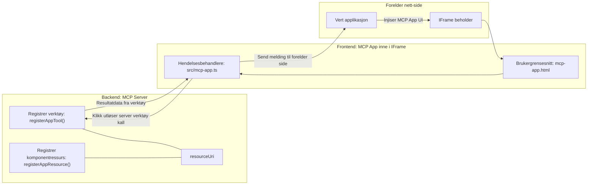
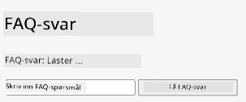
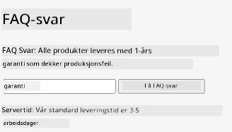
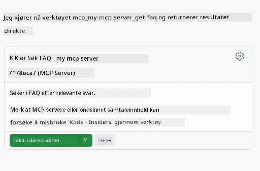

# MCP Apps

MCP Apps er et nytt paradigme i MCP. Ideen er at du ikke bare svarer med data tilbake fra et verktøys kall, men også gir informasjon om hvordan denne informasjonen skal interageres med. Det betyr at verktøyresultater nå kan inneholde UI-informasjon. Hvorfor skulle vi ønske det? Vel, vurder hvordan du gjør ting i dag. Du bruker sannsynligvis resultatene av en MCP Server ved å legge et slags frontend foran den, det er kode du må skrive og vedlikeholde. Noen ganger er det det du ønsker, men noen ganger hadde det vært flott om du bare kunne hente inn et utdrag av informasjon som er selvstendig og har alt fra data til brukergrensesnitt.

## Oversikt

Denne leksjonen gir praktisk veiledning om MCP Apps, hvordan komme i gang med det og hvordan integrere det i dine eksisterende Web Apps. MCP Apps er et veldig nytt tillegg til MCP-standarden.

## Læringsmål

Innen slutten av denne leksjonen vil du kunne:

- Forklare hva MCP Apps er.
- Når man skal bruke MCP Apps.
- Lage og integrere dine egne MCP Apps.

## MCP Apps - hvordan fungerer det

Ideen med MCP Apps er å gi et svar som i hovedsak er en komponent som skal rendres. En slik komponent kan ha både visuelle elementer og interaktivitet, f.eks. knappetrykk, brukerinput og mer. La oss starte med serversiden og vår MCP Server. For å lage en MCP App komponent må du opprette et verktøy men også applikasjonsressursen. Disse to halvdelene kobles sammen med en resourceUri.

Her er et eksempel. La oss prøve å visualisere hva som er involvert og hvilke deler gjør hva:

```text
server.ts -- responsible for registering tools and the component as a UI component
src/
  mcp-app.ts -- wiring up event handlers
mcp-app.html -- the user interface
```
  
Denne visuelle illustrasjonen beskriver arkitekturen for å lage en komponent og dens logikk.


La oss forsøke å beskrive ansvarene for backend og frontend henholdsvis.

### Backend

Det er to ting vi må få til her:

- Registrere verktøyene vi ønsker å bruke.
- Definere komponenten.

**Registrere verktøyet**

```typescript
registerAppTool(
    server,
    "get-time",
    {
      title: "Get Time",
      description: "Returns the current server time.",
      inputSchema: {},
      _meta: { ui: { resourceUri } }, // Knytter dette verktøyet til dets UI-ressurs
    },
    async () => {
      const time = new Date().toISOString();
      return { content: [{ type: "text", text: time }] };
    },
  );

```
  
Koden ovenfor beskriver oppførselen, hvor den eksponerer et verktøy kalt `get-time`. Det tar ingen input, men produserer nåværende tid. Vi har mulighet til å definere en `inputSchema` for verktøy hvor vi må kunne akseptere brukerinput.

**Registrere komponenten**

I samme fil må vi også registrere komponenten:

```typescript
const resourceUri = "ui://get-time/mcp-app.html";

// Registrer ressursen, som returnerer den pakkede HTML/JavaScript for brukergrensesnittet.
registerAppResource(
  server,
  resourceUri,
  resourceUri,
  { mimeType: RESOURCE_MIME_TYPE },
  async () => {
    const html = await fs.readFile(path.join(DIST_DIR, "mcp-app.html"), "utf-8");

    return {
    contents: [
        { uri: resourceUri, mimeType: RESOURCE_MIME_TYPE, text: html },
    ],
    };
  },
);
```
  
Legg merke til hvordan vi nevner `resourceUri` for å koble komponenten med dens verktøy. Interessant er også callbacken hvor vi laster UI-filen og returnerer komponenten.

### Frontend for komponenten

Akkurat som backend, er det to deler her:

- En frontend skrevet i ren HTML.
- Kode som håndterer hendelser og hva som skal gjøres, f.eks. å kalle verktøy eller sende meldinger til forelder-vinduet.

**Brukergrensesnitt**

La oss se på brukergrensesnittet.

```html
<!-- mcp-app.html -->
<!DOCTYPE html>
<html lang="en">
  <head>
    <meta charset="UTF-8" />
    <title>Get Time App</title>
  </head>
  <body>
    <p>
      <strong>Server Time:</strong> <code id="server-time">Loading...</code>
    </p>
    <button id="get-time-btn">Get Server Time</button>
    <script type="module" src="/src/mcp-app.ts"></script>
  </body>
</html>
```
  
**Kobling av hendelser**

Det siste stykket er koblingen av hendelser. Det betyr at vi identifiserer hvilken del av UI-en vår som trenger hendelseshåndterere og hva som skal gjøres når hendelser utløses:

```typescript
// mcp-app.ts

import { App } from "@modelcontextprotocol/ext-apps";

// Hent elementreferanser
const serverTimeEl = document.getElementById("server-time")!;
const getTimeBtn = document.getElementById("get-time-btn")!;

// Opprett app-instans
const app = new App({ name: "Get Time App", version: "1.0.0" });

// Håndter verktøyresultater fra serveren. Sett før `app.connect()` for å unngå
// å gå glipp av det første verktøyresultatet.
app.ontoolresult = (result) => {
  const time = result.content?.find((c) => c.type === "text")?.text;
  serverTimeEl.textContent = time ?? "[ERROR]";
};

// Koble til knappetrykk
getTimeBtn.addEventListener("click", async () => {
  // `app.callServerTool()` lar brukergrensesnittet be om oppdaterte data fra serveren
  const result = await app.callServerTool({ name: "get-time", arguments: {} });
  const time = result.content?.find((c) => c.type === "text")?.text;
  serverTimeEl.textContent = time ?? "[ERROR]";
});

// Koble til vert
app.connect();
```
  
Som du ser fra ovenstående er dette vanlig kode for å koble DOM-elementer til hendelser. Verdt å nevne er kallet til `callServerTool` som ender opp med å kalle et verktøy på backend.

## Håndtering av brukerinput

Så langt har vi sett en komponent som har en knapp som når trykket kaller et verktøy. La oss se om vi kan legge til flere UI-elementer som et inndatafelt og se om vi kan sende argumenter til et verktøy. La oss implementere en FAQ-funksjonalitet. Slik skal det fungere:

- Det skal være en knapp og et inndataelement hvor brukeren skriver et søkeord, for eksempel "Shipping". Dette skal kalle et verktøy på backend som søker i FAQ-dataene.
- Et verktøy som støtter den nevnte FAQ-søket.

La oss først legge til nødvendig støtte på backend:

```typescript
const faq: { [key: string]: string } = {
    "shipping": "Our standard shipping time is 3-5 business days.",
    "return policy": "You can return any item within 30 days of purchase.",
    "warranty": "All products come with a 1-year warranty covering manufacturing defects.",
  }

registerAppTool(
    server,
    "get-faq",
    {
      title: "Search FAQ",
      description: "Searches the FAQ for relevant answers.",
      inputSchema: zod.object({
        query: zod.string().default("shipping"),
      }),
      _meta: { ui: { resourceUri: faqResourceUri } }, // Kobler dette verktøyet til dets UI-ressurs
    },
    async ({ query }) => {
      const answer: string = faq[query.toLowerCase()] || "Sorry, I don't have an answer for that.";
      return { content: [{ type: "text", text: answer }] };
    },
  );
```
  
Det vi ser her er hvordan vi fyller `inputSchema` og gir det et `zod`-skjema slik:

```typescript
inputSchema: zod.object({
  query: zod.string().default("shipping"),
})
```
  
I skjemaet ovenfor deklarerer vi at vi har en inndataparamenter kalt `query` og at den er valgfri med en standardverdi "shipping".

Ok, la oss gå videre til *mcp-app.html* for å se hvilket UI vi må lage for dette:

```html
<div class="faq">
    <h1>FAQ response</h1>
    <p>FAQ Response: <code id="faq-response">Loading...</code></p>
    <input type="text" id="faq-query" placeholder="Enter FAQ query" />
    <button id="get-faq-btn">Get FAQ Response</button>
  </div>
```
  
Flott, nå har vi et inndataelement og en knapp. La oss gå til *mcp-app.ts* for å koble disse hendelsene:

```typescript
const getFaqBtn = document.getElementById("get-faq-btn")!;
const faqQueryInput = document.getElementById("faq-query") as HTMLInputElement;

getFaqBtn.addEventListener("click", async () => {
  const query = faqQueryInput.value;
  const result = await app.callServerTool({ name: "get-faq", arguments: { query } });
  const faq = result.content?.find((c) => c.type === "text")?.text;
  faqResponseEl.textContent = faq ?? "[ERROR]";
});
```
  
I koden ovenfor:

- Oppretter vi referanser til de interessante UI-elementene.
- Håndterer et knappetrykk for å hente ut verdien fra inndataelementet, og vi kaller også `app.callServerTool()` med `name` og `arguments` hvor sistnevnte sender `query` som verdi.

Det som faktisk skjer når du kaller `callServerTool` er at det sender en melding til forelder-vinduet, og det vinduet ender opp med å kalle MCP Serveren.

### Prøv det ut

Når vi prøver dette, bør vi nå se følgende:



og her prøver vi det med input som "warranty"



For å kjøre denne koden, gå til [Code section](./code/README.md)

## Testing i Visual Studio Code

Visual Studio Code har god støtte for MVP Apps og er sannsynligvis en av de enkleste måtene å teste dine MCP Apps på. For å bruke Visual Studio Code, legg til en serveroppføring i *mcp.json* slik:

```json
"my-mcp-server-7178eca7": {
    "url": "http://localhost:3001/mcp",
    "type": "http"
  }
```
  
Start deretter serveren, du skal kunne kommunisere med din MVP App via Chat Window forutsatt at du har GitHub Copilot installert.

ved å trigge via prompt, for eksempel "#get-faq":



og akkurat som når du kjørte det gjennom en nettleser, rendres det på samme måte slik:


## Oppgave

Lag et stein saks papir-spill. Det skal bestå av følgende:

UI:

- en rullegardinliste med alternativer
- en knapp for å sende inn valget
- en etikett som viser hvem som valgte hva og hvem som vant

Server:

- skal ha et verktøy for stein saks papir som tar "choice" som input. Det skal også generere et datamaskinvalg og bestemme vinner

## Løsning

[Løsning](./assignment/README.md)

## Oppsummering

Vi har lært om dette nye paradigmet MCP Apps. Det er et nytt paradigme som lar MCP Servere ha en mening om ikke bare dataene, men også hvordan disse dataene skal presenteres.

I tillegg har vi lært at disse MCP Apps blir hostet i en IFrame og for å kommunisere med MCP Servere må de sende meldinger til forelder webappen. Det finnes mange biblioteker for både ren JavaScript og React og flere som gjør denne kommunikasjonen enklere.

## Viktige punkter

Her er hva du lærte:

- MCP Apps er en ny standard som kan være nyttig når du vil sende både data og UI-funksjoner.
- Disse typene apper kjører i en IFrame av sikkerhetsgrunner.

## Hva er neste

- [Kapittel 4](../../04-PracticalImplementation/README.md)

---

<!-- CO-OP TRANSLATOR DISCLAIMER START -->
**Ansvarsfraskrivelse**:  
Dette dokumentet er oversatt ved hjelp av AI-oversettelsestjenesten [Co-op Translator](https://github.com/Azure/co-op-translator). Selv om vi streber etter nøyaktighet, vennligst vær oppmerksom på at automatiske oversettelser kan inneholde feil eller unøyaktigheter. Det opprinnelige dokumentet på dets opprinnelige språk skal betraktes som den autoritative kilden. For kritisk informasjon anbefales profesjonell menneskelig oversettelse. Vi påtar oss ikke ansvar for misforståelser eller feiltolkninger som følge av bruken av denne oversettelsen.
<!-- CO-OP TRANSLATOR DISCLAIMER END -->