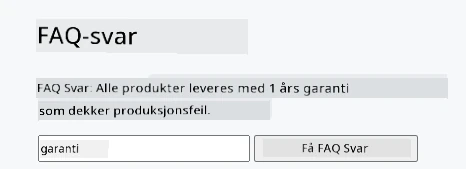
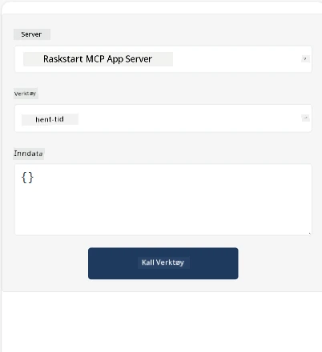
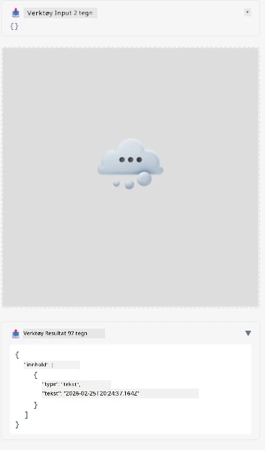

Her er et eksempel som demonstrerer MCP App

## Installer

1. Naviger til *mcp-app* mappen
1. Kjør `npm install`, dette skal installere frontend og backend avhengigheter

Verifiser at backend kompilerer ved å kjøre:

```sh
npx tsc --noEmit
```

Det skal ikke være noen output hvis alt er i orden.

## Kjør backend

> Dette krever litt ekstra arbeid hvis du er på en Windows-maskin siden MCP Apps-løsningen bruker `concurrently` biblioteket som du må finne en erstatter for. Her er den problematiske linjen i *package.json* på MCP App:

    ```json
    "start": "concurrently \"cross-env NODE_ENV=development INPUT=mcp-app.html vite build --watch\" \"tsx watch main.ts\""
    ```

Denne appen har to deler, en backend-del og en host-del.

Start backend ved å kalle:

```sh
npm start
```

Dette skal starte backend på `http://localhost:3001/mcp`.

> Merk, hvis du er i en Codespace må du kanskje sette port synlighet til offentlig. Sjekk at du kan nå endepunktet i nettleseren via https://<navnet på Codespace>.app.github.dev/mcp

## Valg -1 Test appen i Visual Studio Code

For å teste løsningen i Visual Studio Code, gjør følgende:

- Legg til en serveroppføring i `mcp.json` slik:

    ```json
    {
        "servers": {
            "my-mcp-server-7178eca7": {
                "url": "http://localhost:3001/mcp",
                "type": "http"
            }
        },
        "inputs": []
    }
    ```

1. Klikk på "start" knappen i *mcp.json*
1. Sørg for at et chatvindu er åpent og skriv `get-faq`, du skal se et resultat slik:

    

## Valg -2- Test appen med en host

Repoet <https://github.com/modelcontextprotocol/ext-apps> inneholder flere forskjellige hosts som du kan bruke for å teste dine MVP Apps.

Vi viser deg to forskjellige alternativer her:

### Lokal maskin

- Naviger til *ext-apps* etter at du har klonet repoet.

- Installer avhengigheter

   ```sh
   npm install
   ```

- I et separat terminalvindu, naviger til *ext-apps/examples/basic-host*

    > Hvis du er i Codespace, må du navigere til serve.ts og linje 27 og erstatte http://localhost:3001/mcp med din Codespace URL for backend, for eksempel https://psychic-xylophone-657rpjgvxpc5g64-3001.app.github.dev/mcp

- Kjør hosten:

    ```sh
    npm start
    ```

    Dette skal koble hosten til backend og du skal se at appen kjører slik:

    

### Codespace

Det krever litt ekstra arbeid for å få en Codespace-miljø til å fungere. For å bruke en host gjennom Codespace:

- Se i *ext-apps* katalogen og naviger til *examples/basic-host*.
- Kjør `npm install` for å installere avhengigheter
- Kjør `npm start` for å starte hosten.

## Test appen

Prøv appen på følgende måte:

- Velg "Call Tool" knappen og du skal se resultatene slik:

    

Flott, alt fungerer.

---

<!-- CO-OP TRANSLATOR DISCLAIMER START -->
**Ansvarsfraskrivelse**:
Dette dokumentet er oversatt ved hjelp av AI-oversettelsestjenesten [Co-op Translator](https://github.com/Azure/co-op-translator). Selv om vi streber etter nøyaktighet, vennligst vær oppmerksom på at automatiske oversettelser kan inneholde feil eller unøyaktigheter. Det originale dokumentet på det opprinnelige språket bør anses som den autoritative kilden. For kritisk informasjon anbefales profesjonell menneskelig oversettelse. Vi er ikke ansvarlige for eventuelle misforståelser eller feiltolkninger som oppstår ved bruk av denne oversettelsen.
<!-- CO-OP TRANSLATOR DISCLAIMER END -->