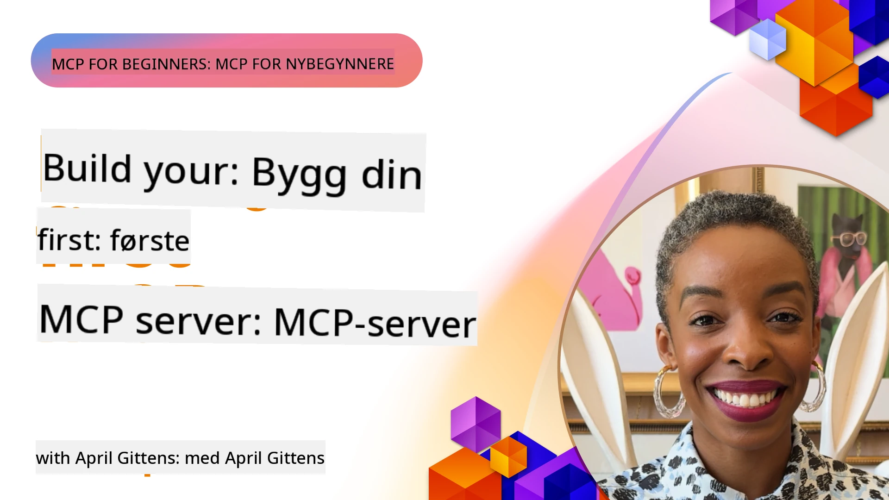

## Komme i gang  

_(Klikk på bildet over for å se video av denne leksjonen)_

Denne seksjonen består av flere leksjoner:

- **1 Din første server**, i denne første leksjonen vil du lære hvordan du lager din første server og inspiserer den med inspeksjonsverktøyet, en verdifull måte å teste og feilsøke serveren din på, [til leksjonen](01-first-server/README.md)

- **2 Klient**, i denne leksjonen vil du lære å skrive en klient som kan koble til serveren din, [til leksjonen](02-client/README.md)

- **3 Klient med LLM**, en enda bedre måte å skrive en klient på er ved å legge til en LLM slik at den kan "forhandle" med serveren din om hva som skal gjøres, [til leksjonen](03-llm-client/README.md)

- **4 Bruke en server GitHub Copilot Agent-modus i Visual Studio Code**. Her ser vi på å kjøre MCP-serveren vår fra Visual Studio Code, [til leksjonen](04-vscode/README.md)

- **5 stdio Transport Server** stdio-transport er den anbefalte standarden for lokal MCP server-til-klient kommunikasjon, og tilbyr sikker subprocess-basert kommunikasjon med innebygd prosessisolasjon [til leksjonen](05-stdio-server/README.md)

- **6 HTTP-streaming med MCP (Streamable HTTP)**. Lær om moderne HTTP-streaming transport (den anbefalte tilnærmingen for fjern-MCP-servere ifølge [MCP-spesifikasjon 2025-11-25](https://spec.modelcontextprotocol.io/specification/2025-11-25/basic/transports/#streamable-http)), fremdriftsvarsler, og hvordan du implementerer skalerbare, sanntids MCP-servere og klienter ved hjelp av Streamable HTTP. [til leksjonen](06-http-streaming/README.md)

- **7 Bruke AI Toolkit for VSCode** for å konsumere og teste MCP-klienter og servere [til leksjonen](07-aitk/README.md)

- **8 Testing**. Her fokuserer vi spesielt på hvordan vi kan teste serveren og klienten på forskjellige måter, [til leksjonen](08-testing/README.md)

- **9 Distribusjon**. Dette kapitlet ser på ulike måter å distribuere MCP-løsningene dine på, [til leksjonen](09-deployment/README.md)

- **10 Avansert serverbruk**. Dette kapitlet dekker avansert serverbruk, [til leksjonen](./10-advanced/README.md)

- **11 Autentisering**. Dette kapitlet dekker hvordan man legger til enkel autentisering, fra Basic Auth til bruk av JWT og RBAC. Du oppfordres til å starte her og deretter se på avanserte emner i kapittel 5 og utføre ytterligere sikkerhetshardening via anbefalinger i kapittel 2, [til leksjonen](./11-simple-auth/README.md)

- **12 MCP-verter**. Konfigurer og bruk populære MCP vertsklienter inkludert Claude Desktop, Cursor, Cline og Windsurf. Lær transporttyper og feilsøking, [til leksjonen](./12-mcp-hosts/README.md)

- **13 MCP Inspektør**. Feilsøk og test MCP-serverne dine interaktivt ved hjelp av MCP Inspektør-verktøyet. Lær å feilsøke verktøy, ressurser og protokollmeldinger, [til leksjonen](./13-mcp-inspector/README.md)

- **14 Sampling**. Lag MCP-servere som samarbeider med MCP-klienter om LLM-relaterte oppgaver. [til leksjonen](./14-sampling/README.md)

- **15 MCP-apper**. Bygg MCP-servere som også svarer med UI-instruksjoner, [til leksjonen](./15-mcp-apps/README.md)

Model Context Protocol (MCP) er en åpen protokoll som standardiserer hvordan applikasjoner gir kontekst til LLM. Tenk på MCP som en USB-C-port for AI-applikasjoner – det gir en standardisert måte å koble AI-modeller til forskjellige datakilder og verktøy på.

## Læringsmål

Ved slutten av denne leksjonen vil du kunne:

- Sette opp utviklingsmiljøer for MCP i C#, Java, Python, TypeScript og JavaScript
- Bygge og distribuere grunnleggende MCP-servere med tilpassede funksjoner (ressurser, prompts og verktøy)
- Lage vertsapplikasjoner som kobler til MCP-servere
- Teste og feilsøke MCP-implementasjoner
- Forstå vanlige oppsettsutfordringer og deres løsninger
- Koble MCP-implementasjonene dine til populære LLM-tjenester

## Sette opp ditt MCP-miljø

Før du begynner å arbeide med MCP, er det viktig å forberede utviklingsmiljøet ditt og forstå grunnleggende arbeidsflyt. Denne seksjonen vil guide deg gjennom de første oppsettsstegene for å sikre en smidig start med MCP.

### Forutsetninger

Før du dykker ned i MCP-utvikling, vær sikker på at du har:

- **Utviklingsmiljø**: For det valgte språket ditt (C#, Java, Python, TypeScript eller JavaScript)
- **IDE/Editor**: Visual Studio, Visual Studio Code, IntelliJ, Eclipse, PyCharm eller en moderne kodeeditor
- **Pakkebehandlere**: NuGet, Maven/Gradle, pip eller npm/yarn
- **API-nøkler**: For alle AI-tjenester du planlegger å bruke i vertsapplikasjonene dine

### Offisielle SDK-er

I de kommende kapitlene vil du se løsninger bygget med Python, TypeScript, Java og .NET. Her er alle offisielt støttede SDK-er.

MCP tilbyr offisielle SDK-er for flere språk (i samsvar med [MCP-spesifikasjon 2025-11-25](https://spec.modelcontextprotocol.io/specification/2025-11-25/)):
- [C# SDK](https://github.com/modelcontextprotocol/csharp-sdk) - Vedlikeholdes i samarbeid med Microsoft
- [Java SDK](https://github.com/modelcontextprotocol/java-sdk) - Vedlikeholdes i samarbeid med Spring AI
- [TypeScript SDK](https://github.com/modelcontextprotocol/typescript-sdk) - Den offisielle TypeScript-implementeringen
- [Python SDK](https://github.com/modelcontextprotocol/python-sdk) - Den offisielle Python-implementeringen (FastMCP)
- [Kotlin SDK](https://github.com/modelcontextprotocol/kotlin-sdk) - Den offisielle Kotlin-implementeringen
- [Swift SDK](https://github.com/modelcontextprotocol/swift-sdk) - Vedlikeholdes i samarbeid med Loopwork AI
- [Rust SDK](https://github.com/modelcontextprotocol/rust-sdk) - Den offisielle Rust-implementeringen
- [Go SDK](https://github.com/modelcontextprotocol/go-sdk) - Den offisielle Go-implementeringen

## Viktige punkter

- Oppsett av MCP-utviklingsmiljø er enkelt med språkspesifikke SDK-er
- Å bygge MCP-servere innebærer å lage og registrere verktøy med klare skjemaer
- MCP-klienter kobler til servere og modeller for å utnytte utvidede funksjoner
- Testing og feilsøking er essensielt for pålitelige MCP-implementasjoner
- Distribusjonsmuligheter spenner fra lokal utvikling til skytjenester

## Øve

Vi har et sett med eksempler som utfyller øvelsene du vil se i alle kapitlene i denne seksjonen. I tillegg har hvert kapittel også sine egne oppgaver og øvelser

- [Java Kalkulator](./samples/java/calculator/README.md)
- [.Net Kalkulator](../../../03-GettingStarted/samples/csharp)
- [JavaScript Kalkulator](./samples/javascript/README.md)
- [TypeScript Kalkulator](./samples/typescript/README.md)
- [Python Kalkulator](../../../03-GettingStarted/samples/python)

## Ekstra ressurser

- [Bygg agenter med Model Context Protocol på Azure](https://learn.microsoft.com/azure/developer/ai/intro-agents-mcp)
- [Fjern-MCP med Azure Container Apps (Node.js/TypeScript/JavaScript)](https://learn.microsoft.com/samples/azure-samples/mcp-container-ts/mcp-container-ts/)
- [.NET OpenAI MCP Agent](https://learn.microsoft.com/samples/azure-samples/openai-mcp-agent-dotnet/openai-mcp-agent-dotnet/)

## Hva nå

Start med den første leksjonen: [Lage din første MCP-server](01-first-server/README.md)

Når du har fullført dette modulen, fortsett til: [Modul 4: Praktisk implementering](../04-PracticalImplementation/README.md)

---

<!-- CO-OP TRANSLATOR DISCLAIMER START -->
**Ansvarsfraskrivelse**:
Dette dokumentet er oversatt ved hjelp av AI-oversettelsestjenesten [Co-op Translator](https://github.com/Azure/co-op-translator). Selv om vi streber etter nøyaktighet, vennligst vær oppmerksom på at automatiske oversettelser kan inneholde feil eller unøyaktigheter. Det opprinnelige dokumentet på originalspråket skal betraktes som den autoritative kilden. For kritisk informasjon anbefales profesjonell menneskelig oversettelse. Vi er ikke ansvarlige for misforståelser eller feiltolkninger som følge av bruk av denne oversettelsen.
<!-- CO-OP TRANSLATOR DISCLAIMER END -->