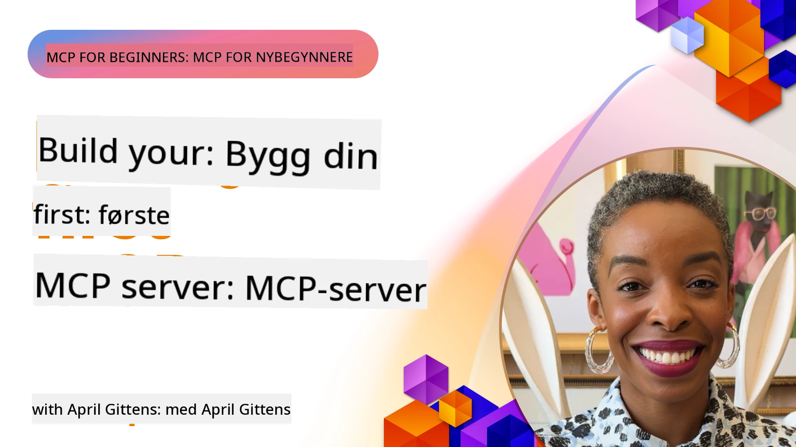

## Komme i gang  

_(Klikk på bildet over for å se videoen til denne leksjonen)_

Denne seksjonen består av flere leksjoner:

- **1 Din første server**, i denne første leksjonen vil du lære hvordan du lager din første server og inspiserer den med inspeksjonsverktøyet, en verdifull måte å teste og feilsøke serveren på, [til leksjonen](01-first-server/README.md)

- **2 Klient**, i denne leksjonen vil du lære hvordan du skriver en klient som kan koble til serveren din, [til leksjonen](02-client/README.md)

- **3 Klient med LLM**, en enda bedre måte å skrive en klient på er å legge til en LLM slik at den kan "forhandle" med serveren om hva som skal gjøres, [til leksjonen](03-llm-client/README.md)

- **4 Bruke serverens GitHub Copilot Agent-modus i Visual Studio Code**. Her ser vi på å kjøre MCP-serveren vår fra innenfor Visual Studio Code, [til leksjonen](04-vscode/README.md)

- **5 stdio Transport Server** stdio transport er den anbefalte standarden for lokal server-til-klient-kommunikasjon i MCP, og gir sikker underprosess-basert kommunikasjon med innebygd prosessisolasjon [til leksjonen](05-stdio-server/README.md)

- **6 HTTP Streaming med MCP (Streamable HTTP)**. Lær om den standard
	fjerntransporten i [MCP Spesifikasjon 2026-07-28](https://modelcontextprotocol.io/specification/2026-07-28/basic/transports/streamable-http),
	pluss den tidligere sesjonsbaserte implementeringen som beholdes i leksjonen.
	[til leksjonen](06-http-streaming/README.md)

- **7 Bruke AI Toolkit for VSCode** for å konsumere og teste MCP-kunder og servere [til leksjonen](07-aitk/README.md)

- **8 Testing**. Her vil vi spesielt fokusere på hvordan vi kan teste serveren og klienten på forskjellige måter, [til leksjonen](08-testing/README.md)

- **9 Distribuering**. Dette kapittelet ser på forskjellige måter å distribuere dine MCP-løsninger på, [til leksjonen](09-deployment/README.md)

- **10 Avansert serverbruk**. Dette kapittelet dekker avansert serverbruk, [til leksjonen](./10-advanced/README.md)

- **11 Auth**. Dette kapittelet dekker hvordan legge til enkel autentisering, fra Basic Auth til bruk av JWT og RBAC. Du oppfordres til å begynne her og deretter se på avanserte temaer i Kapittel 5 og utføre ytterligere sikkerhetsforsterkninger via anbefalingene i Kapittel 2, [til leksjonen](./11-simple-auth/README.md)

- **12 MCP-hosts**. Konfigurer og bruk populære MCP-hostklienter inkludert Claude Desktop, Cursor, Cline, og Windsurf. Lær om transporttyper og feilsøking, [til leksjonen](./12-mcp-hosts/README.md)

- **13 MCP Inspektør**. Feilsøk og test MCP-servere interaktivt ved hjelp av MCP Inspector-verktøyet. Lær å feilsøke verktøy, ressurser og protokollmeldinger, [til leksjonen](./13-mcp-inspector/README.md)

- **14 Sampling**. Lær den tidligere Sampling-primitive for `2025-11-25` og
	hvordan migrere nye design til direkte LLM-leverandørintegrasjon. Sampling er
	utfaset i MCP `2026-07-28`. [til leksjonen](./14-sampling/README.md)

- **15 MCP Apper**. Bygg MCP-servere som også svarer med UI-instruksjoner, [til leksjonen](./15-mcp-apps/README.md)

Model Context Protocol (MCP) er en åpen protokoll som standardiserer hvordan applikasjoner gir kontekst til LLM-er. Tenk på MCP som en USB-C-port for AI-applikasjoner - det gir en standardisert måte å koble AI-modeller til forskjellige datakilder og verktøy på.

## Læringsmål

Når du er ferdig med denne leksjonen vil du kunne:

- Sette opp utviklingsmiljøer for MCP i C#, Java, Python, TypeScript og JavaScript
- Bygge og distribuere grunnleggende MCP-servere med tilpassede funksjoner (ressurser, forespørsler og verktøy)
- Lage host-applikasjoner som kobler til MCP-servere
- Teste og feilsøke MCP-implementasjoner
- Forstå vanlige oppsettsutfordringer og deres løsninger
- Koble dine MCP-implementasjoner til populære LLM-tjenester

## Sette opp ditt MCP-miljø

Før du begynner å jobbe med MCP, er det viktig å forberede utviklingsmiljøet ditt og forstå den grunnleggende arbeidsflyten. Denne seksjonen vil lede deg gjennom de innledende oppsettsstegene for å sikre en smidig start med MCP.

### Forutsetninger

Før du dykker inn i MCP-utvikling, må du sørge for at du har:

- **Utviklingsmiljø**: For ditt valgte språk (C#, Java, Python, TypeScript, eller JavaScript)
- **IDE/Editor**: Visual Studio, Visual Studio Code, IntelliJ, Eclipse, PyCharm, eller en hvilken som helst moderne kodeeditor
- **Pakkebehandlere**: NuGet, Maven/Gradle, pip, eller npm/yarn
- **API-nøkler**: For eventuelle AI-tjenester du planlegger å bruke i dine host-applikasjoner

### Offisielle SDK-er

I de kommende kapitlene vil du se løsninger bygget med Python, TypeScript,
Java og .NET. Her er de offisielle SDK-ene.

SDK-støtte for MCP `2026-07-28` implementeres uavhengig per språk.
Før du kjører et eksempel, sjekk versjonen av pakken og SDKens utgivelsesnotater
for støttede protokollversjoner. Se
[offisiell SDK-liste](https://modelcontextprotocol.io/docs/sdk):
- [C# SDK](https://github.com/modelcontextprotocol/csharp-sdk) - Vedlikeholdes i samarbeid med Microsoft
- [Java SDK](https://github.com/modelcontextprotocol/java-sdk) - Vedlikeholdes i samarbeid med Spring AI
- [TypeScript SDK](https://github.com/modelcontextprotocol/typescript-sdk) - Den offisielle TypeScript-implementasjonen
- [Python SDK](https://github.com/modelcontextprotocol/python-sdk) - Den offisielle Python-implementasjonen (FastMCP)
- [Kotlin SDK](https://github.com/modelcontextprotocol/kotlin-sdk) - Den offisielle Kotlin-implementasjonen
- [Swift SDK](https://github.com/modelcontextprotocol/swift-sdk) - Vedlikeholdes i samarbeid med Loopwork AI
- [Rust SDK](https://github.com/modelcontextprotocol/rust-sdk) - Den offisielle Rust-implementasjonen
- [Go SDK](https://github.com/modelcontextprotocol/go-sdk) - Den offisielle Go-implementasjonen

## Viktige punkter

- Å sette opp et utviklingsmiljø for MCP er enkelt med språkspesifikke SDK-er
- Å bygge MCP-servere innebærer å lage og registrere verktøy med klare skjemaer
- MCP-klienter kobler til servere og modeller for å utnytte utvidede muligheter
- Testing og feilsøking er essensielt for pålitelige MCP-implementasjoner
- Distribueringsmulighetene spenner fra lokal utvikling til skyløsninger

## Øve

Vi har et sett med eksempler som utfyller øvelsene du vil se i alle kapitlene i denne seksjonen. I tillegg har hvert kapittel sine egne øvelser og oppgaver

- [Java Kalkulator](./samples/java/calculator/README.md)
- [.NET Kalkulator](../../../03-GettingStarted/samples/csharp)
- [JavaScript Kalkulator](./samples/javascript/README.md)
- [TypeScript Kalkulator](./samples/typescript/README.md)
- [Python Kalkulator](../../../03-GettingStarted/samples/python)

## Tilleggsressurser

- [Bygg agenter med Model Context Protocol på Azure](https://learn.microsoft.com/azure/developer/ai/intro-agents-mcp)
- [Fjern-MCP med Azure Container Apps (Node.js/TypeScript/JavaScript)](https://learn.microsoft.com/samples/azure-samples/mcp-container-ts/mcp-container-ts/)
- [.NET OpenAI MCP Agent](https://learn.microsoft.com/samples/azure-samples/openai-mcp-agent-dotnet/openai-mcp-agent-dotnet/)

## Hva nå

Start med den første leksjonen: [Opprette din første MCP-server](01-first-server/README.md)

Når du er ferdig med denne modulen, fortsett til: [Modul 4: Praktisk implementering](../04-PracticalImplementation/README.md)

---

<!-- CO-OP TRANSLATOR DISCLAIMER START -->
**Ansvarsfraskrivelse**:
Dette dokumentet er oversatt ved hjelp av AI-oversettelsestjenesten [Co-op Translator](https://github.com/Azure/co-op-translator). Selv om vi streber etter nøyaktighet, vær oppmerksom på at automatiske oversettelser kan inneholde feil eller unøyaktigheter. Det opprinnelige dokumentet på originalspråket skal betraktes som den autoritative kilden. For kritisk informasjon anbefales profesjonell menneskelig oversettelse. Vi er ikke ansvarlige for eventuelle misforståelser eller feiltolkninger som oppstår ved bruk av denne oversettelsen.
<!-- CO-OP TRANSLATOR DISCLAIMER END -->