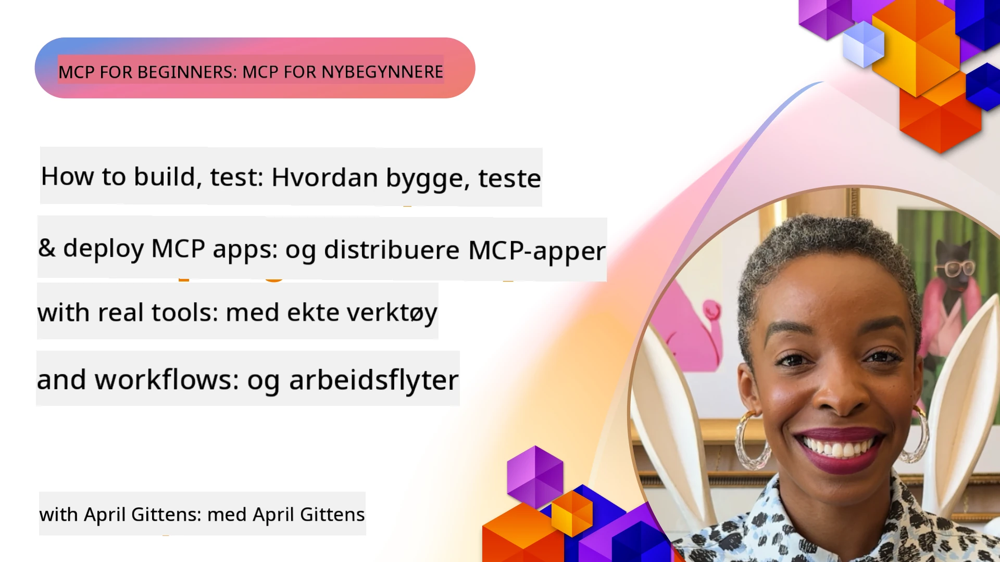
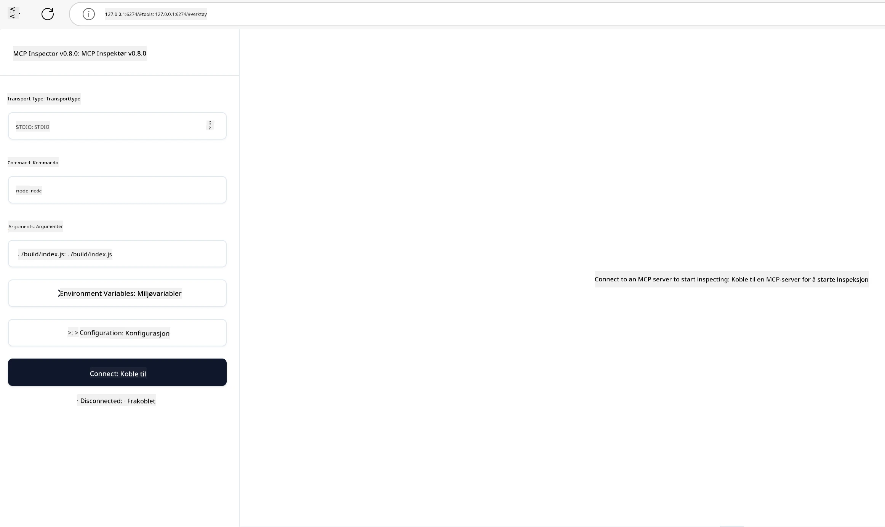

# Praktisk implementering

[](https://youtu.be/vCN9-mKBDfQ)

_(Klikk på bildet over for å se video av denne leksjonen)_

Praktisk implementering er der kraften i Model Context Protocol (MCP) blir håndgripelig. Selv om det er viktig å forstå teorien og arkitekturen bak MCP, oppstår den virkelige verdien når du anvender disse konseptene for å bygge, teste og distribuere løsninger som løser reelle problemer. Dette kapitlet bygger bro mellom konseptuell kunnskap og praktisk utvikling, og veileder deg gjennom prosessen med å bringe MCP-baserte applikasjoner til liv.

Enten du utvikler intelligente assistenter, integrerer AI i forretningsflyter eller bygger tilpassede verktøy for databehandling, gir MCP et fleksibelt grunnlag. Dets språk-agnostiske design og offisielle SDK-er for populære programmeringsspråk gjør det tilgjengelig for et bredt spekter av utviklere. Ved å utnytte disse SDK-ene kan du raskt prototype, iterere og skalere løsningene dine på tvers av forskjellige plattformer og miljøer.

I de følgende seksjonene finner du praktiske eksempler, eksempelkode og distribusjonsstrategier som demonstrerer hvordan du implementerer MCP i C#, Java med Spring, TypeScript, JavaScript og Python. Du lærer også hvordan du feilsøker og tester MCP-servere, administrerer API-er, og distribuerer løsninger til skyen ved bruk av Azure. Disse praksisrettede ressursene er designet for å akselerere læringen din og hjelpe deg å trygt bygge robuste MCP-applikasjoner klare for produksjon.

## Oversikt

Denne leksjonen fokuserer på praktiske aspekter ved MCP-implementering på tvers av flere programmeringsspråk. Vi utforsker hvordan du bruker MCP SDK-er i C#, Java med Spring, TypeScript, JavaScript og Python for å bygge robuste applikasjoner, feilsøke og teste MCP-servere, og opprette gjenbrukbare ressurser, fremgangsmåter (prompter) og verktøy.

## Læringsmål

Ved slutten av denne leksjonen vil du kunne:

- Implementere MCP-løsninger ved bruk av offisielle SDK-er i ulike programmeringsspråk  
- Feilsøke og teste MCP-servere systematisk  
- Opprette og bruke serverfunksjoner (ressurser, prompter og verktøy)  
- Designe effektive MCP-arbeidsflyter for komplekse oppgaver  
- Optimalisere MCP-implementeringer for ytelse og pålitelighet  

## Offisielle SDK-ressurser

Model Context Protocol tilbyr offisielle SDK-er for flere språk (i samsvar med [MCP-spesifikasjon 2025-11-25](https://spec.modelcontextprotocol.io/specification/2025-11-25/)):

- [C# SDK](https://github.com/modelcontextprotocol/csharp-sdk)  
- [Java med Spring SDK](https://github.com/modelcontextprotocol/java-sdk) **Merk:** krever avhengighet på [Project Reactor](https://projectreactor.io). (Se [diskusjons-issue 246](https://github.com/orgs/modelcontextprotocol/discussions/246).)  
- [TypeScript SDK](https://github.com/modelcontextprotocol/typescript-sdk)  
- [Python SDK](https://github.com/modelcontextprotocol/python-sdk)  
- [Kotlin SDK](https://github.com/modelcontextprotocol/kotlin-sdk)  
- [Go SDK](https://github.com/modelcontextprotocol/go-sdk)  

## Arbeide med MCP SDK-er

Denne seksjonen gir praktiske eksempler på implementering av MCP på tvers av flere programmeringsspråk. Du finner eksempelkode i mappen `samples` organisert etter språk.

### Tilgjengelige eksempler

Repositoryet inkluderer [prøveimplementeringer](../../../04-PracticalImplementation/samples) i følgende språk:

- [C#](./samples/csharp/README.md)  
- [Java med Spring](./samples/java/containerapp/README.md)  
- [TypeScript](./samples/typescript/README.md)  
- [JavaScript](./samples/javascript/README.md)  
- [Python](./samples/python/README.md)  

Hver prøve demonstrerer nøkkelkonsepter og implementeringsmønstre for MCP innen det gitte språket og økosystemet.

### Praktiske guider

Ytterligere guider for praktisk MCP-implementering:

- [Paginering og store resultatssett](./pagination/README.md) – Håndtere kursorbasert paginering for verktøy, ressurser og store datasett  

## Kjernefunksjoner på serveren

MCP-servere kan implementere en hvilken som helst kombinasjon av disse funksjonene:

### Ressurser

Ressurser gir kontekst og data som brukeren eller AI-modellen kan bruke:

- Dokumentlager  
- Kunnskapsbaser  
- Strukturerte datakilder  
- Filsystemer  

### Prompter

Prompter er malbaserte meldinger og arbeidsflyter for brukere:

- Forhåndsdefinerte samtalemaler  
- Veiledede interaksjonsmønstre  
- Spesialiserte dialogstrukturer  

### Verktøy

Verktøy er funksjoner som AI-modellen kan utføre:

- Databehandlingsverktøy  
- Eksterne API-integrasjoner  
- Beregningskapasiteter  
- Søksfunksjonalitet  

## Eksempelimplementeringer: C# implementering

Det offisielle C# SDK-repositoriet inneholder flere eksempelimplementeringer som demonstrerer ulike aspekter av MCP:

- **Grunnleggende MCP-klient**: Enkelt eksempel som viser hvordan man oppretter en MCP-klient og kaller verktøy  
- **Grunnleggende MCP-server**: Minimal serverimplementering med grunnleggende verktøyregistrering  
- **Avansert MCP-server**: Fullverdig server med verktøyregistrering, autentisering og feilbehandling  
- **ASP.NET-integrasjon**: Eksempler som demonstrerer integrasjon med ASP.NET Core  
- **Mønstre for verktøyimplementering**: Ulike mønstre for å implementere verktøy med varierende kompleksitetsnivåer  

MCP C# SDK er i forhåndsvisning og API-er kan endres. Vi vil kontinuerlig oppdatere denne bloggen etter hvert som SDK-en utvikler seg.

### Nøkkelfunksjoner

- [C# MCP Nuget ModelContextProtocol](https://www.nuget.org/packages/ModelContextProtocol)  
- Bygge din [første MCP-server](https://devblogs.microsoft.com/dotnet/build-a-model-context-protocol-mcp-server-in-csharp/)  

For fullstendige C#-implementasjonseksempler, besøk det [offisielle C# SDK-eksempellageret](https://github.com/modelcontextprotocol/csharp-sdk)  

## Eksempelimplementering: Java med Spring implementering

Java med Spring SDK tilbyr robuste MCP-implementeringsmuligheter med bedriftsnivåfunksjoner.

### Nøkkelfunksjoner

- Spring Framework-integrasjon  
- Sterk typesikkerhet  
- Støtte for reaktiv programmering  
- Omfattende feilbehandling  

For et komplett Java med Spring-eksempel, se [Java med Spring-eksempel](samples/java/containerapp/README.md) i sample-mappen.

## Eksempelimplementering: JavaScript-implementering

JavaScript SDK gir en lettvekts og fleksibel tilnærming til MCP-implementering.

### Nøkkelfunksjoner

- Støtte for Node.js og nettlesere  
- Promise-basert API  
- Enkel integrasjon med Express og andre rammeverk  
- WebSocket-støtte for streaming  

For et komplett JavaScript-implementeringseksempel, se [JavaScript-eksempel](samples/javascript/README.md) i sample-mappen.

## Eksempelimplementering: Python-implementering

Python SDK tilbyr en Pythonisk tilnærming til MCP-implementering med gode integrasjoner mot ML-rammeverk.

### Nøkkelfunksjoner

- Støtte for async/await med asyncio  
- FastAPI-integrasjon  
- Enkel registrering av verktøy  
- Nativ integrasjon med populære ML-biblioteker  

For et komplett Python-implementeringseksempel, se [Python-eksempel](samples/python/README.md) i sample-mappen.

## API-administrasjon

Azure API Management er en flott løsning på hvordan vi kan sikre MCP-servere. Ideen er å sette en Azure API Management-instans foran MCP-serveren din og la den håndtere funksjoner du sannsynligvis vil trenge, som:

- hastighetsbegrensning  
- token-administrasjon  
- overvåking  
- lastbalansering  
- sikkerhet  

### Azure-eksempel

Her er et Azure-eksempel som gjør akkurat dette, altså [oppretter en MCP-server og sikrer den med Azure API Management](https://github.com/Azure-Samples/remote-mcp-apim-functions-python).

Se hvordan autorisasjonsflyten skjer i bildet under:


I det foregående bildet skjer følgende:

- Autentisering / Autorisering skjer via Microsoft Entra.  
- Azure API Management fungerer som en gateway og bruker policyer for å styre og administrere trafikk.  
- Azure Monitor logger alle forespørsler for videre analyse.  

#### Autorisasjonsflyt

La oss se nærmere på autorisasjonsflyten:


#### MCP autorisasjonsspesifikasjon

Lær mer om [MCP Autorisasjonsspesifikasjon](https://spec.modelcontextprotocol.io/specification/2025-11-25/basic/authorization/)  

## Distribuer ekstern MCP-server til Azure

La oss se om vi kan distribuere eksemplet vi nevnte tidligere:

1. Klon repo

    ```bash
    git clone https://github.com/Azure-Samples/remote-mcp-apim-functions-python.git
    cd remote-mcp-apim-functions-python
    ```

1. Registrer ressursleverandøren `Microsoft.App`.

   - Hvis du bruker Azure CLI, kjør `az provider register --namespace Microsoft.App --wait`.  
   - Hvis du bruker Azure PowerShell, kjør `Register-AzResourceProvider -ProviderNamespace Microsoft.App`. Kjør deretter `(Get-AzResourceProvider -ProviderNamespace Microsoft.App).RegistrationState` etter en stund for å sjekke om registreringen er fullført.

1. Kjør denne [azd](https://aka.ms/azd)-kommandoen for å provisjonere API Management-tjenesten, funksjonsapp (med kode) og alle andre nødvendige Azure-ressurser

    ```shell
    azd up
    ```

    Denne kommandoen skal distribuere alle skyressursene på Azure

### Teste serveren din med MCP Inspector

1. I et **nytt terminalvindu**, installer og kjør MCP Inspector

    ```shell
    npx @modelcontextprotocol/inspector
    ```

    Du bør se et grensesnitt som ligner:

    

1. CTRL-klikk for å laste MCP Inspector webapp fra URLen som vises av appen (f.eks. [http://127.0.0.1:6274/#resources](http://127.0.0.1:6274/#resources))  
1. Sett transporttype til `SSE`  
1. Sett URL til din kjørende API Management SSE-endepunkt vist etter `azd up` og **Koble til**:

    ```shell
    https://<apim-servicename-from-azd-output>.azure-api.net/mcp/sse
    ```

1. **List verktøy**. Klikk på et verktøy og **Kjør verktøy**.  

Hvis alle trinnene har fungert, skal du nå være koblet til MCP-serveren og ha kunnet kalle et verktøy.

## MCP-servere for Azure

[Remote-mcp-functions](https://github.com/Azure-Samples/remote-mcp-functions-dotnet): Dette settet med repositorier er hurtigstartmaler for å bygge og distribuere egendefinerte eksterne MCP (Model Context Protocol)-servere med Azure Functions ved hjelp av Python, C# .NET eller Node/TypeScript.

Eksemplene gir en komplett løsning som lar utviklere:

- Bygge og kjøre lokalt: utvikle og feilsøke en MCP-server på en lokal maskin  
- Distribuere til Azure: enkelt distribuere til skyen med en enkel azd up-kommando  
- Koble til fra klienter: koble til MCP-serveren fra forskjellige klienter inkludert VS Codes Copilot agent-modus og MCP Inspector-verktøyet  

### Nøkkelfunksjoner

- Sikkerhet som design: MCP-serveren er sikret med nøkler og HTTPS  
- Autentiseringsmuligheter: støtter OAuth ved bruk av innebygd autentisering og/eller API Management  
- Nettverksisolasjon: tillater nettverksisolasjon med Azure Virtual Networks (VNET)  
- Serverløs arkitektur: benytter Azure Functions for skalerbar, hendelsesdrevet kjøring  
- Lokal utvikling: omfattende støtte for lokal utvikling og feilsøking  
- Enkel distribusjon: strømlinjeformet distribusjonsprosess til Azure  

Repositoryet inkluderer alle nødvendige konfigurasjonsfiler, kildekode og infrastrukturdefinisjoner for raskt å komme i gang med en produksjonsklar MCP-serverimplementering.

- [Azure Remote MCP Functions Python](https://github.com/Azure-Samples/remote-mcp-functions-python) – Eksempelimplementering av MCP ved bruk av Azure Functions med Python  

- [Azure Remote MCP Functions .NET](https://github.com/Azure-Samples/remote-mcp-functions-dotnet) – Eksempelimplementering av MCP ved bruk av Azure Functions med C# .NET  

- [Azure Remote MCP Functions Node/Typescript](https://github.com/Azure-Samples/remote-mcp-functions-typescript) – Eksempelimplementering av MCP ved bruk av Azure Functions med Node/TypeScript.  

## Viktige punkter

- MCP SDK-er gir språkspesifikke verktøy for å implementere robuste MCP-løsninger  
- Feilsøkings- og testingsprosessen er kritisk for pålitelige MCP-applikasjoner  
- Gjenbrukbare prompter gjør det mulig å ha konsekvente AI-interaksjoner  
- Gode arbeidsflyter kan orkestrere komplekse oppgaver med flere verktøy  
- Implementering av MCP-løsninger krever hensyn til sikkerhet, ytelse og feilbehandling  

## Øvelse

Design en praktisk MCP-arbeidsflyt som adresserer et virkelig problem innen ditt domene:

1. Identifiser 3-4 verktøy som ville være nyttige for å løse dette problemet  
2. Lag et arbeidsflytdiagram som viser hvordan disse verktøyene samhandler  
3. Implementer en grunnleggende versjon av ett av verktøyene ved bruk av ditt foretrukne språk  
4. Lag en promptmal som vil hjelpe modellen å bruke verktøyet effektivt  

## Ytterligere ressurser

---

## Hva er neste

Neste: [Avanserte emner](../05-AdvancedTopics/README.md)

---

<!-- CO-OP TRANSLATOR DISCLAIMER START -->
**Ansvarsfraskrivelse**:
Dette dokumentet er oversatt ved hjelp av AI-oversettelsestjenesten [Co-op Translator](https://github.com/Azure/co-op-translator). Selv om vi streber etter nøyaktighet, vennligst vær oppmerksom på at automatiske oversettelser kan inneholde feil eller unøyaktigheter. Det opprinnelige dokumentet på dets morsmål skal betraktes som den autoritative kilden. For kritisk informasjon anbefales profesjonell menneskelig oversettelse. Vi er ikke ansvarlige for eventuelle misforståelser eller feiltolkninger som oppstår fra bruk av denne oversettelsen.
<!-- CO-OP TRANSLATOR DISCLAIMER END -->