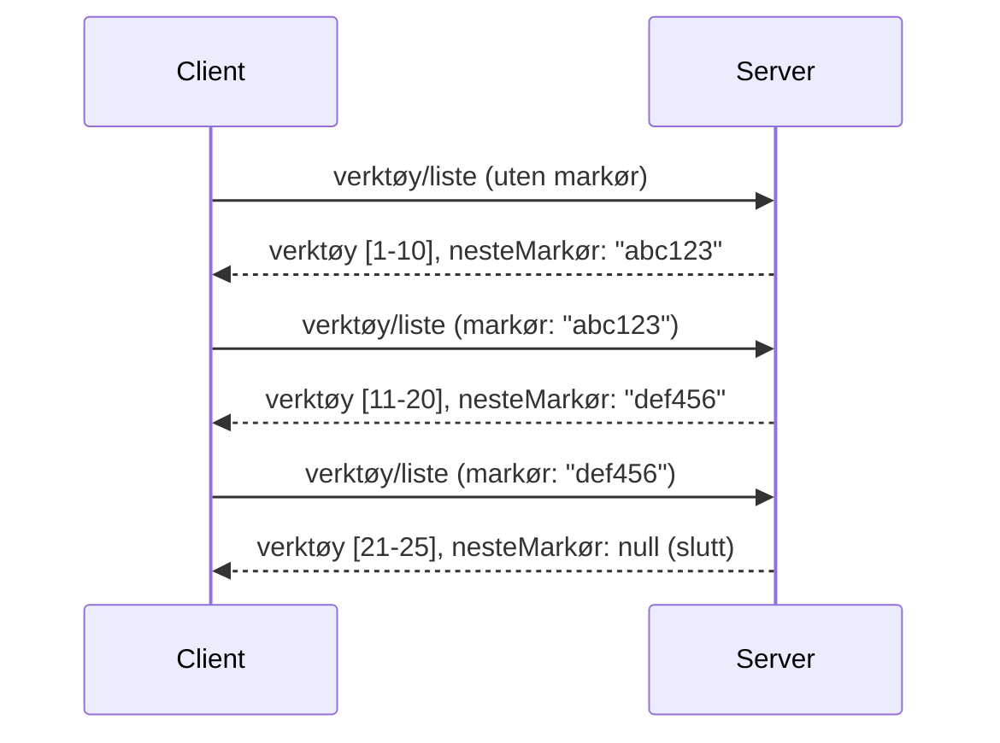

# Paginering og Store Resultatsett i MCP

Når MCP-serveren din håndterer store datasett - enten det er tusenvis av filer, databaseoppføringer eller søkeresultater - trenger du paginering for å håndtere minnet effektivt og gi responsive brukeropplevelser. Denne veiledningen forklarer hvordan du implementerer og bruker paginering i MCP.

## Hvorfor Paginering Er Viktig

Uten paginering kan store responser føre til:

- **Minneutmattelse** - Laste millioner av oppføringer samtidig
- **Langsomme responstider** - Brukere venter mens all data lastes
- **Tidsavbruddsfeil** - Forespørsler overskrider tidsbegrensninger
- **Dårlig AI-ytelse** - LLM-er sliter med enorme kontekster

MCP bruker **kursørbasert paginering** for pålitelig, konsistent navigering gjennom resultatsett.

---

## Hvordan MCP Paginering Fungerer

### Konseptet med Kursør

En **kursør** er en uklar streng som markerer din posisjon i et resultatsett. Tenk på det som et bokmerke i en lang bok.



### Paginering i MCP-metoder

Disse MCP-metodene støtter paginering:

| Metode | Returnerer | Kursørstøtte |
|--------|---------|----------------|
| `tools/list` | Verktøydefinisjoner | ✅ |
| `resources/list` | Ressursdefinisjoner | ✅ |
| `prompts/list` | Promptdefinisjoner | ✅ |
| `resources/templates/list` | Ressursskjemaer | ✅ |

---

## Serverimplementasjon

### Python (FastMCP)

```python
from mcp.server import Server
from mcp.types import Tool, ListToolsResult
import math

app = Server("paginated-server")

# Simulert stort datasett
ALL_TOOLS = [
    Tool(name=f"tool_{i}", description=f"Tool number {i}", inputSchema={})
    for i in range(100)
]

PAGE_SIZE = 10

@app.list_tools()
async def list_tools(cursor: str | None = None) -> ListToolsResult:
    """List tools with pagination support."""
    
    # Dekode markør for å få startindeks
    start_index = 0
    if cursor:
        try:
            start_index = int(cursor)
        except ValueError:
            start_index = 0
    
    # Hent side med resultater
    end_index = min(start_index + PAGE_SIZE, len(ALL_TOOLS))
    page_tools = ALL_TOOLS[start_index:end_index]
    
    # Beregn neste markør
    next_cursor = None
    if end_index < len(ALL_TOOLS):
        next_cursor = str(end_index)
    
    return ListToolsResult(
        tools=page_tools,
        nextCursor=next_cursor
    )
```

### TypeScript

```typescript
import { Server } from "@modelcontextprotocol/sdk/server/index.js";
import { ListToolsResultSchema } from "@modelcontextprotocol/sdk/types.js";

const server = new Server({
  name: "paginated-server",
  version: "1.0.0"
});

// Simulert stort datasett
const ALL_TOOLS = Array.from({ length: 100 }, (_, i) => ({
  name: `tool_${i}`,
  description: `Tool number ${i}`,
  inputSchema: { type: "object", properties: {} }
}));

const PAGE_SIZE = 10;

server.setRequestHandler(ListToolsResultSchema, async (request) => {
  // Dekode peker
  let startIndex = 0;
  if (request.params?.cursor) {
    startIndex = parseInt(request.params.cursor, 10) || 0;
  }
  
  // Hent resultatside
  const endIndex = Math.min(startIndex + PAGE_SIZE, ALL_TOOLS.length);
  const pageTools = ALL_TOOLS.slice(startIndex, endIndex);
  
  // Beregn neste peker
  const nextCursor = endIndex < ALL_TOOLS.length ? String(endIndex) : undefined;
  
  return {
    tools: pageTools,
    nextCursor
  };
});
```

### Java (Spring MCP)

```java
@Service
public class PaginatedToolService {
    
    private static final int PAGE_SIZE = 10;
    private final List<Tool> allTools;
    
    public PaginatedToolService() {
        // Initialiser stort datasett
        this.allTools = IntStream.range(0, 100)
            .mapToObj(i -> new Tool("tool_" + i, "Tool number " + i, Map.of()))
            .collect(Collectors.toList());
    }
    
    @McpMethod("tools/list")
    public ListToolsResult listTools(@Param("cursor") String cursor) {
        // Dekod kursor
        int startIndex = 0;
        if (cursor != null && !cursor.isEmpty()) {
            try {
                startIndex = Integer.parseInt(cursor);
            } catch (NumberFormatException e) {
                startIndex = 0;
            }
        }
        
        // Hent resultat-side
        int endIndex = Math.min(startIndex + PAGE_SIZE, allTools.size());
        List<Tool> pageTools = allTools.subList(startIndex, endIndex);
        
        // Beregn neste kursor
        String nextCursor = endIndex < allTools.size() ? String.valueOf(endIndex) : null;
        
        return new ListToolsResult(pageTools, nextCursor);
    }
}
```

---

## Klientimplementasjon

### Python-klient

```python
from mcp import ClientSession

async def get_all_tools(session: ClientSession) -> list:
    """Fetch all tools using pagination."""
    all_tools = []
    cursor = None
    
    while True:
        result = await session.list_tools(cursor=cursor)
        all_tools.extend(result.tools)
        
        if result.nextCursor is None:
            break
        cursor = result.nextCursor
    
    return all_tools

# Bruk
async with client_session as session:
    tools = await get_all_tools(session)
    print(f"Found {len(tools)} tools")
```

### TypeScript-klient

```typescript
import { Client } from "@modelcontextprotocol/sdk/client/index.js";

async function getAllTools(client: Client): Promise<Tool[]> {
  const allTools: Tool[] = [];
  let cursor: string | undefined = undefined;
  
  do {
    const result = await client.listTools({ cursor });
    allTools.push(...result.tools);
    cursor = result.nextCursor;
  } while (cursor);
  
  return allTools;
}

// Bruk
const tools = await getAllTools(client);
console.log(`Found ${tools.length} tools`);
```

### Latskap-laste-mønster

For veldig store datasett, last sider ved behov:

```python
class PaginatedToolIterator:
    """Lazily iterate through paginated tools."""
    
    def __init__(self, session: ClientSession):
        self.session = session
        self.cursor = None
        self.buffer = []
        self.exhausted = False
    
    async def __anext__(self):
        # Returner fra buffer hvis tilgjengelig
        if self.buffer:
            return self.buffer.pop(0)
        
        # Sjekk om vi har brukt opp alle sider
        if self.exhausted:
            raise StopAsyncIteration
        
        # Hent neste side
        result = await self.session.list_tools(cursor=self.cursor)
        self.buffer = list(result.tools)
        self.cursor = result.nextCursor
        
        if self.cursor is None:
            self.exhausted = True
        
        if not self.buffer:
            raise StopAsyncIteration
        
        return self.buffer.pop(0)
    
    def __aiter__(self):
        return self

# Bruk - minneeffektiv for store datasett
async for tool in PaginatedToolIterator(session):
    process_tool(tool)
```

---

## Paginering for Ressurser

Ressurser trenger ofte paginering for kataloger eller store datasett:

```python
from mcp.server import Server
from mcp.types import Resource, ListResourcesResult
import os

app = Server("file-server")

@app.list_resources()
async def list_resources(cursor: str | None = None) -> ListResourcesResult:
    """List files in directory with pagination."""
    
    directory = "/data/files"
    all_files = sorted(os.listdir(directory))
    
    # Dekode peker (filindeks)
    start_index = int(cursor) if cursor else 0
    page_size = 20
    end_index = min(start_index + page_size, len(all_files))
    
    # Lag ressursliste for denne siden
    resources = []
    for filename in all_files[start_index:end_index]:
        filepath = os.path.join(directory, filename)
        resources.append(Resource(
            uri=f"file://{filepath}",
            name=filename,
            mimeType="application/octet-stream"
        ))
    
    # Beregn neste peker
    next_cursor = str(end_index) if end_index < len(all_files) else None
    
    return ListResourcesResult(
        resources=resources,
        nextCursor=next_cursor
    )
```

---

## Kursør-designstrategier

### Strategi 1: Indeksbasert (Enkel)

```python
# Markøren er bare indeksen
cursor = "50"  # Start ved element 50
```

**Fordeler:** Enkel, tilstandsløs
**Ulemper:** Resultater kan skifte hvis elementer legges til/fjernes

### Strategi 2: ID-basert (Stabil)

```python
# Kursor er den sist registrerte ID-en
cursor = "item_abc123"  # Start etter dette elementet
```

**Fordeler:** Stabil selv om elementer endres
**Ulemper:** Krever ordnede ID-er

### Strategi 3: Kodet Tilstand (Kompleks)

```python
import base64
import json

def encode_cursor(state: dict) -> str:
    return base64.b64encode(json.dumps(state).encode()).decode()

def decode_cursor(cursor: str) -> dict:
    return json.loads(base64.b64decode(cursor).decode())

# Markøren inneholder flere tilstands-felt
cursor = encode_cursor({
    "offset": 50,
    "filter": "active",
    "sort": "name"
})
```

**Fordeler:** Kan kode kompleks tilstand
**Ulemper:** Mer komplisert, lengre kursørstrenger

---

## Beste praksis

### 1. Velg Passende Sidestørrelser

```python
# Vurder datastørrelsen
PAGE_SIZE_SMALL_ITEMS = 100   # Enkel metadata
PAGE_SIZE_MEDIUM_ITEMS = 20   # Mer omfattende objekter
PAGE_SIZE_LARGE_ITEMS = 5     # Komplekst innhold
```

### 2. Håndter Ugyldige Kursører Forsiktig

```python
@app.list_tools()
async def list_tools(cursor: str | None = None) -> ListToolsResult:
    try:
        start_index = int(cursor) if cursor else 0
        if start_index < 0 or start_index >= len(ALL_TOOLS):
            start_index = 0  # Tilbakestill til begynnelsen
    except (ValueError, TypeError):
        start_index = 0  # Ugyldig markør, start på nytt
    # ...
```

### 3. Inkluder Totalt Antall (Valgfritt)

```python
return ListToolsResult(
    tools=page_tools,
    nextCursor=next_cursor,
    # Noen implementasjoner inkluderer total for UI-fremdrift
    _meta={"total": len(ALL_TOOLS)}
)
```

### 4. Test Kanttilfeller

```python
async def test_pagination():
    # Tomt resultatsett
    result = await session.list_tools()
    assert result.tools == []
    assert result.nextCursor is None
    
    # Enkelt side
    result = await session.list_tools()
    assert len(result.tools) <= PAGE_SIZE
    
    # Ugyldig markør
    result = await session.list_tools(cursor="invalid")
    assert result.tools  # Bør returnere første side
```

---

## Vanlige Fallgruver

### ❌ Returnere Alle Resultater og Paginere På Klientsiden

```python
# DÅRLIG: Laster alt inn i minnet
@app.list_tools()
async def list_tools() -> ListToolsResult:
    all_tools = load_all_tools()  # 1 million verktøy!
    return ListToolsResult(tools=all_tools)
```

### ✅ Paginere Ved Datakilden

```python
# BRA: Laster kun det som trengs
@app.list_tools()
async def list_tools(cursor: str | None = None) -> ListToolsResult:
    offset = int(cursor) if cursor else 0
    tools = await db.query_tools(offset=offset, limit=PAGE_SIZE)
    return ListToolsResult(tools=tools, nextCursor=...)
```

---

## Hva er Neste Steg

- [Modul 5.14 - Kontekst Engineering](../../05-AdvancedTopics/mcp-contextengineering/README.md)
- [Modul 8 - Beste Praksis](../../08-BestPractices/README.md)
- [3.8 - Testing av MCP Serveren din](../../03-GettingStarted/08-testing/README.md)

---

## Ytterligere Ressurser

- [MCP Spesifikasjon - Paginering](https://modelcontextprotocol.io/specification/2026-07-28/)
- [Forklaring av Kursørbasert Paginering](https://slack.engineering/evolving-api-pagination-at-slack/)
- [Python SDK pagineringstester](https://github.com/modelcontextprotocol/python-sdk/blob/main/tests/client/test_list_methods_cursor.py)

---

<!-- CO-OP TRANSLATOR DISCLAIMER START -->
**Ansvarsfraskrivelse**:
Dette dokumentet er oversatt ved hjelp av AI-oversettelsestjenesten [Co-op Translator](https://github.com/Azure/co-op-translator). Selv om vi streber etter nøyaktighet, vær oppmerksom på at automatiske oversettelser kan inneholde feil eller unøyaktigheter. Det opprinnelige dokumentet på originalspråket skal betraktes som den autoritative kilden. For kritisk informasjon anbefales profesjonell menneskelig oversettelse. Vi er ikke ansvarlige for eventuelle misforståelser eller feiltolkninger som oppstår ved bruk av denne oversettelsen.
<!-- CO-OP TRANSLATOR DISCLAIMER END -->