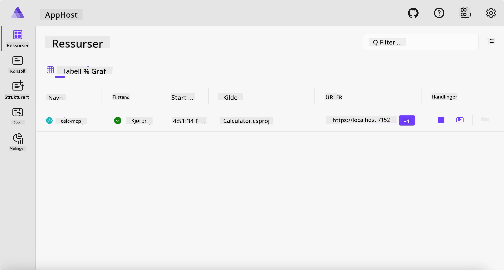
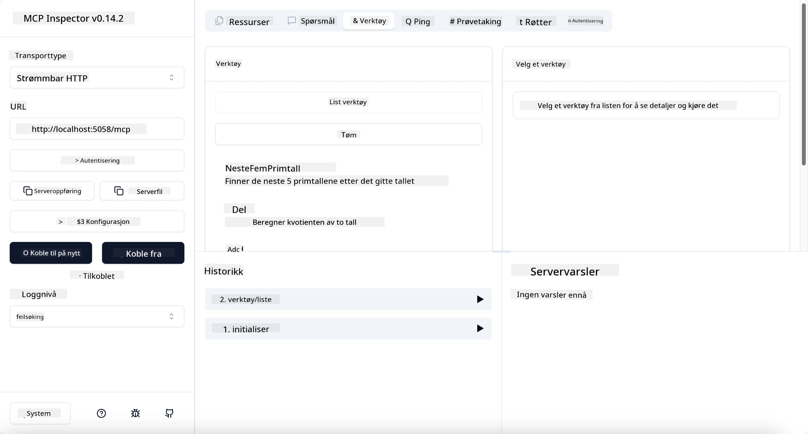
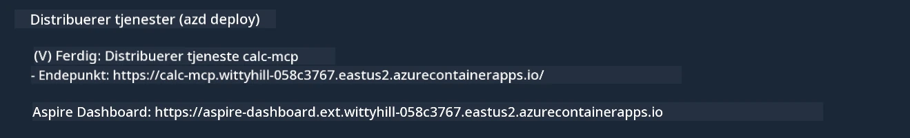

# Eksempel

Det forrige eksemplet viser hvordan man bruker et lokalt .NET-prosjekt med typen `stdio`. Og hvordan man kjører serveren lokalt i en container. Dette er en god løsning i mange situasjoner. Det kan imidlertid være nyttig å ha serveren kjørende eksternt, for eksempel i et sky-miljø. Her kommer typen `http` inn.

Når man ser på løsningen i mappen `04-PracticalImplementation`, kan det se mye mer komplisert ut enn det forrige eksemplet. Men i realiteten er det ikke det. Om du ser nøye på prosjektet `src/Calculator`, vil du se at det stort sett er den samme koden som i forrige eksempel. Den eneste forskjellen er at vi bruker et annet bibliotek `ModelContextProtocol.AspNetCore` for å håndtere HTTP-forespørslene. Og vi endrer metoden `IsPrime` til å bli privat, bare for å vise at du kan ha private metoder i koden din. Resten av koden er den samme som før.

De andre prosjektene er fra [Aspire](https://aspire.dev/get-started/what-is-aspire/). Å ha Aspire i løsningen vil forbedre utvikleropplevelsen under utvikling og testing og hjelpe med observabilitet. Det er ikke nødvendig for å kjøre serveren, men det er god praksis å ha det i løsningen din.

## Start serveren lokalt

1. Fra VS Code (med C# DevKit-utvidelsen), naviger ned til mappen `04-PracticalImplementation/samples/csharp`.
1. Kjør følgende kommando for å starte serveren:

   ```bash
    dotnet watch run --project ./src/AppHost
   ```

1. Når en nettleser åpner Aspire dashboardet, noter `http` URL-en. Den bør være noe som `http://localhost:5058/`.

   

## Test Streamable HTTP med MCP Inspector

Hvis du har Node.js 22.7.5 eller nyere, kan du bruke MCP Inspector for å teste serveren din.

Start serveren og kjør følgende kommando i en terminal:

```bash
npx @modelcontextprotocol/inspector http://localhost:5058
```



- Velg `Streamable HTTP` som Transport-type.
- I Url-feltet, skriv inn URL-en til serveren notert tidligere, og legg til `/mcp`. Det bør være `http` (ikke `https`) noe som `http://localhost:5058/mcp`.
- velg Connect-knappen.

En fin ting med Inspector er at den gir god synlighet i hva som skjer.

- Prøv å liste opp tilgjengelige verktøy
- Prøv noen av dem, det skal fungere akkurat som før.

## Test MCP Server med GitHub Copilot Chat i VS Code

For å bruke Streamable HTTP transport med GitHub Copilot Chat, endre konfigurasjonen av `calc-mcp` serveren som ble laget tidligere til å se slik ut:

```jsonc
// .vscode/mcp.json
{
  "servers": {
    "calc-mcp": {
      "type": "http",
      "url": "http://localhost:5058/mcp"
    }
  }
}
```

Gjør noen tester:

- Be om «3 primtall etter 6780». Legg merke til at Copilot vil bruke de nye verktøyene `NextFivePrimeNumbers` og bare returnere de tre første primtallene.
- Be om «7 primtall etter 111», for å se hva som skjer.
- Be om «John har 24 lollies og vil dele dem alle på sine 3 barn. Hvor mange lollies har hvert barn?», for å se hva som skjer.

## Distribuer serveren til Azure

La oss distribuere serveren til Azure slik at flere kan bruke den.

Fra en terminal, naviger til mappen `04-PracticalImplementation/samples/csharp` og kjør følgende kommando:

```bash
azd up
```

Når distribusjonen er ferdig, bør du se en melding som denne:



Ta URL-en og bruk den i MCP Inspector og i GitHub Copilot Chat.

```jsonc
// .vscode/mcp.json
{
  "servers": {
    "calc-mcp": {
      "type": "http",
      "url": "https://calc-mcp.gentleriver-3977fbcf.australiaeast.azurecontainerapps.io/mcp"
    }
  }
}
```

## Hva nå?

Vi prøver forskjellige transporttyper og testverktøy. Vi distribuerer også din MCP-server til Azure. Men hva om serveren vår trenger tilgang til private ressurser? For eksempel en database eller en privat API? I neste kapittel vil vi se på hvordan vi kan forbedre sikkerheten til serveren vår.

---

<!-- CO-OP TRANSLATOR DISCLAIMER START -->
**Ansvarsfraskrivelse**:
Dette dokumentet er oversatt ved hjelp av AI-oversettelsestjenesten [Co-op Translator](https://github.com/Azure/co-op-translator). Selv om vi streber etter nøyaktighet, vær oppmerksom på at automatiske oversettelser kan inneholde feil eller unøyaktigheter. Det opprinnelige dokumentet på originalspråket skal betraktes som den autoritative kilden. For kritisk informasjon anbefales profesjonell menneskelig oversettelse. Vi er ikke ansvarlige for eventuelle misforståelser eller feiltolkninger som oppstår ved bruk av denne oversettelsen.
<!-- CO-OP TRANSLATOR DISCLAIMER END -->