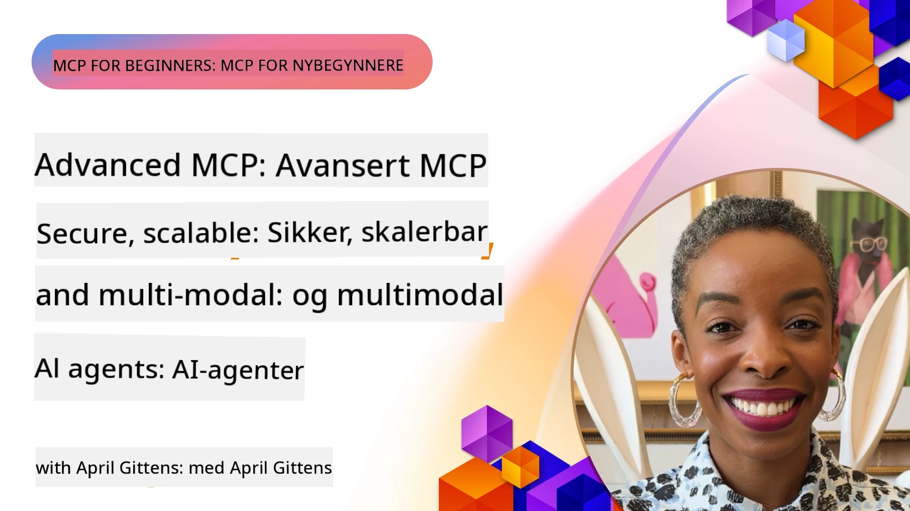

# Avanserte emner i MCP

_(Klikk på bildet ovenfor for å se video av denne leksjonen)_

Dette kapitlet dekker en rekke avanserte emner innen implementering av Model Context Protocol (MCP), inkludert multimodal integrasjon, skalerbarhet, sikkerhets beste praksis og bedriftsintegrasjon. Disse temaene er avgjørende for å bygge robuste og produksjonsklare MCP-applikasjoner som kan møte kravene til moderne AI-systemer.

## Oversikt

Denne leksjonen utforsker avanserte konsepter i implementering av Model Context Protocol, med fokus på multimodal integrasjon, skalerbarhet, sikkerhets beste praksis og bedriftsintegrasjon. Disse temaene er essensielle for å bygge produksjonsklare MCP-applikasjoner som kan håndtere komplekse krav i bedriftsmiljøer.

> **Gjeldende spesifikasjonsnotat:** MCP `2026-07-28` avvikler Roots- og
> Sampling-primitiver som dekkes i leksjonene 5.4 og 5.6. Den flytter også
> den eksperimentelle Tasks-funksjonen referert til i Protocol Features (5.16) til en
> dedikert Tasks-utvidelse. Disse leksjonene beholdes for eldre
> `2025-11-25`-implementeringer og inkluderer migrasjonsveiledning. Se
> [Hva som er endret i MCP: Spesifikasjonen 2026-07-28](../01-CoreConcepts/mcp-2026-07-28.md).

## Læringsmål

Innen slutten av denne leksjonen vil du kunne:

- Implementere multimodale kapasiteter innen MCP-rammeverk
- Designe skalerbare MCP-arkitekturer for scenarier med høye krav
- Anvende sikkerhets beste praksis i tråd med MCPs sikkerhetsprinsipper
- Integrere MCP med bedrifts AI-systemer og rammeverk
- Optimalisere ytelse og pålitelighet i produksjonsmiljøer

## Leksjoner og eksempler på prosjekter

| Lenke | Tittel | Beskrivelse |
|------|-------|-------------|
| [5.1 Integrasjon med Azure](./mcp-integration/README.md) | Integrere med Azure | Lær hvordan du integrerer din MCP-server på Azure |
| [5.2 Multimodal eksempel](./mcp-multi-modality/README.md) | MCP multimodale eksempler  | Eksempler for lyd, bilde og multimodale responser |
| [5.3 MCP OAuth2 eksempel](../../../05-AdvancedTopics/mcp-oauth2-demo) | MCP OAuth2 Demo | Minimal Spring Boot-app som viser OAuth2 med MCP, både som autorisasjons- og ressursserver. Demonstrerer sikker tokenutstedelse, beskyttede endepunkter, Azure Container Apps-distribusjon, og API Management-integrasjon. |
| [5.4 Root Contexts](./mcp-root-contexts/README.md) | Root contexts  | Lær den eldre `2025-11-25` Roots-primitiven og nåværende migrasjonsalternativer (avviklet i `2026-07-28`) |
| [5.5 Rutings](./mcp-routing/README.md) | Rutings | Lær om ulike typer ruting |
| [5.6 Sampling](./mcp-sampling/README.md) | Sampling | Lær den eldre `2025-11-25` Sampling-primitiven og nåværende migrasjonsalternativer (avviklet i `2026-07-28`) |
| [5.7 Skalerbarhet](./mcp-scaling/README.md) | Skalerbarhet  | Lær om skalerbarhet |
| [5.8 Sikkerhet](./mcp-security/README.md) | Sikkerhet  | Sikre din MCP-server |
| [5.9 Web Search eksempel](./web-search-mcp/README.md) | Web Search MCP | Python MCP-server og klient som integrerer med SerpAPI for sanntid web-, nyhets-, produkt-søk og Q&A. Demonstrerer multi-verktøy orkestrering, ekstern API-integrasjon og robust feilhåndtering. |
| [5.10 Sanntidsstrømming](./mcp-realtimestreaming/README.md) | Streaming  | Sanntids datastreaming har blitt essensielt i dagens datadrevne verden, hvor virksomheter og applikasjoner krever umiddelbar tilgang til informasjon for å ta tidsriktige beslutninger.|
| [5.11 Sanntids nett-søk](./mcp-realtimesearch/README.md) | Web Search | Sanntids nett-søk: hvordan MCP forvandler sanntids nett-søk ved å tilby en standardisert tilnærming til kontekststyring på tvers av AI-modeller, søkemotorer og applikasjoner.| 
| [5.12 Entra ID-autentisering for Model Context Protocol-servere](./mcp-security-entra/README.md) | Entra ID-autentisering | Microsoft Entra ID tilbyr en robust skybasert identitets- og tilgangsstyringsløsning, som hjelper med å sikre at bare autoriserte brukere og applikasjoner kan interagere med din MCP-server.|
| [5.13 Microsoft Foundry Agent-integrasjon](./mcp-foundry-agent-integration/README.md) | Microsoft Foundry-integrasjon | Lær hvordan du integrerer Model Context Protocol-servere med Microsoft Foundry-agenter, som muliggjør kraftig verktøyorkestrering og bedrifts AI-muligheter med standardiserte tilkoblinger til eksterne datakilder.|
| [5.14 Kontekstteknikk](./mcp-contextengineering/README.md) | Kontekstteknikk | Fremtidige muligheter innen kontekstteknikk for MCP-servere, inkludert kontekstoptimalisering, dynamisk kontekststyring og strategier for effektiv prompt engineering innen MCP-rammeverk.|
| [5.15 MCP egendefinert transport](./mcp-transport/README.md) | Egendefinert transport | Lær hvordan du implementerer egendefinerte transportmekanismer for spesialiserte MCP kommunikasjons-scenarier.|
| [5.16 Dypdykk i protokollfunksjoner](./mcp-protocol-features/README.md) | Protokollfunksjoner | Mestre avanserte protokollfunksjoner inkludert fremdriftsvarsler, avbestilling av forespørsler, ressursmaler og feilbehandlingsmønstre.|
| [5.17 Adversarial Multi-Agent resonnering](./mcp-adversarial-agents/README.md) | Adversarielle agenter | Bruk to agenter med motstridende posisjoner, som deler et enkelt MCP verktøysett, for å oppdage hallusinasjoner, belyse kanttilfeller og produsere bedre kalibrerte resultater gjennom strukturert debatt.|

> **Historisk `2025-11-25` notat:** denne revisjonen introduserte eksperimentelle
> Tasks og utvidet flere protokollfunksjoner. I `2026-07-28` ble Tasks flyttet til
> en offisiell utvidelse og Roots ble avviklet. Ikke bruk
> `2025-11-25` status som gjeldende veiledning; se
> [2026-07-28 endringslogg](https://modelcontextprotocol.io/specification/2026-07-28/changelog).

## Ytterligere referanser

For den mest oppdaterte informasjonen om avanserte MCP-emner, se:
- [MCP-dokumentasjon](https://modelcontextprotocol.io/)
- [MCP-spesifikasjon (2026-07-28)](https://modelcontextprotocol.io/specification/2026-07-28/)
- [GitHub Repository](https://github.com/modelcontextprotocol)
- [OWASP MCP Topp 10](https://microsoft.github.io/mcp-azure-security-guide/mcp/) - Sikkerhetsrisikoer og tiltak
- [MCP Security Summit Workshop (Sherpa)](https://azure-samples.github.io/sherpa/) - Praktisk sikkerhetstrening

## Viktige læringspunkter

- Multimodale MCP-implementeringer utvider AI-kapasiteter utover tekstbehandling
- Skalerbarhet er avgjørende for bedriftsdistribusjoner og kan håndteres via horisontal og vertikal skalering
- Omfattende sikkerhetstiltak beskytter data og sikrer forsvarlig tilgangskontroll
- Bedriftsintegrasjon med plattformer som Azure OpenAI og Microsoft AI Foundry forbedrer MCP-kapasiteter
- Avanserte MCP-implementeringer drar nytte av optimaliserte arkitekturer og nøye ressursforvaltning

## Øvelse

Design en bedriftsklar MCP-implementering for en spesifikk brukstilfelle:

1. Identifiser multimodale krav for ditt brukstilfelle
2. Skisser sikkerhetskontroller som trengs for å beskytte sensitiv data
3. Design en skalerbar arkitektur som kan håndtere varierende belastning
4. Planlegg integrasjonspunkter med bedrifts AI-systemer
5. Dokumenter potensielle ytelsesflaskehalser og strategier for mitigering

## Ytterligere ressurser

- [Azure OpenAI dokumentasjon](https://learn.microsoft.com/en-us/azure/ai-services/openai/)
- [Microsoft AI Foundry dokumentasjon](https://learn.microsoft.com/en-us/ai-services/)

---

## Hva er det neste

Utforsk leksjonene i denne modulen med start fra: [5.1 MCP Integrasjon](./mcp-integration/README.md)

Når du har fullført denne modulen, fortsett til: [Modul 6: Fellesbidrag](../06-CommunityContributions/README.md)

---

<!-- CO-OP TRANSLATOR DISCLAIMER START -->
**Ansvarsfraskrivelse**:
Dette dokumentet er oversatt ved hjelp av AI-oversettelsestjenesten [Co-op Translator](https://github.com/Azure/co-op-translator). Selv om vi streber etter nøyaktighet, vær oppmerksom på at automatiske oversettelser kan inneholde feil eller unøyaktigheter. Det opprinnelige dokumentet på originalspråket skal betraktes som den autoritative kilden. For kritisk informasjon anbefales profesjonell menneskelig oversettelse. Vi er ikke ansvarlige for eventuelle misforståelser eller feiltolkninger som oppstår ved bruk av denne oversettelsen.
<!-- CO-OP TRANSLATOR DISCLAIMER END -->