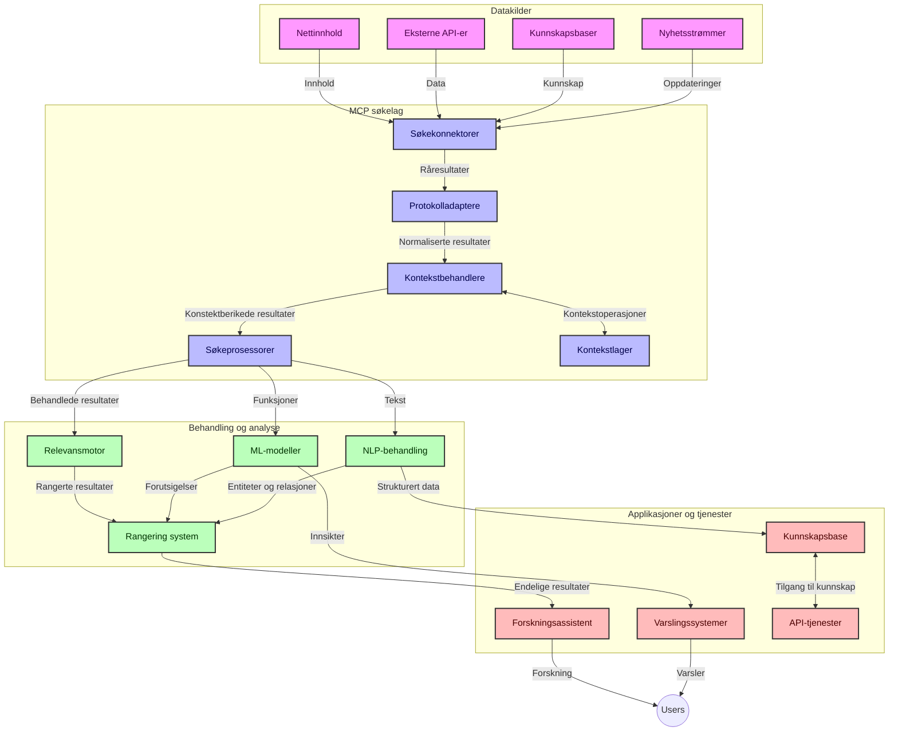
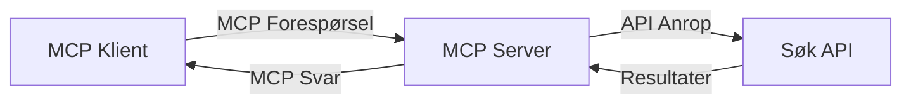
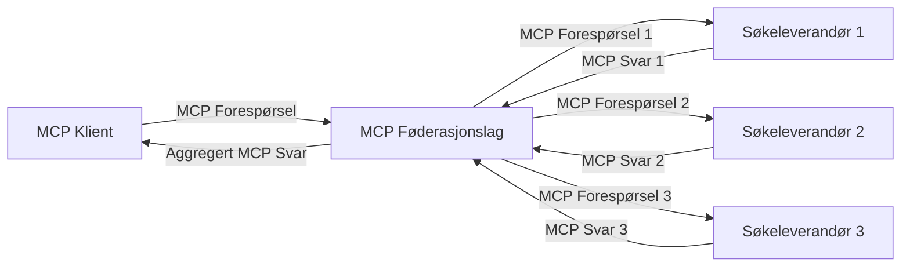
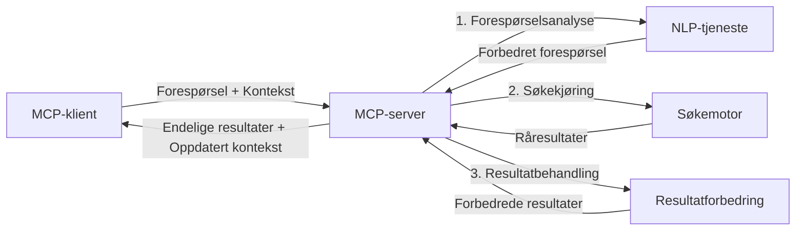

# Model Context Protocol for sanntidssøk på nettet

## Oversikt

Sanntidssøk på nettet har blitt essensielt i dagens informasjonsdrevne miljø, hvor applikasjoner trenger umiddelbar tilgang til oppdatert informasjon fra internett for å gi relevante og tidsriktige svar. Model Context Protocol (MCP) representerer et betydelig fremskritt i å optimalisere disse sanntidssøkeprosessene, forbedre søkeeffektiviteten, opprettholde kontekstuell integritet, og forbedre systemets samlede ytelse.

Denne modulen utforsker hvordan MCP forvandler sanntidssøk på nettet ved å tilby en standardisert tilnærming til kontekststyring på tvers av AI-modeller, søkemotorer, og applikasjoner.

### Hva du vil lære

I denne omfattende guiden vil du oppdage:

- Hvordan MCP skaper en sømløs bro mellom AI-modeller og sanntids websøkemuligheter
- Arkitekturmodeller for implementering av effektive og skalerbare søkeløsninger med MCP
- Teknikker for bevaring av søkekontekst på tvers av flere spørringer og samhandlinger
- Praktiske kodeimplementeringer i Python og JavaScript for ulike søkescenarier
- Metoder for å balansere relevans, aktualitet og ytelse i MCP-drevne søkesystemer

## Introduksjon til sanntidssøk på nettet

Sanntidssøk på nettet er en teknologisk tilnærming som muliggjør kontinuerlig spørring, behandling og analyse av nettbasert informasjon i det den publiseres eller oppdateres, slik at systemer kan levere fersk og relevant informasjon med minimal forsinkelse. I motsetning til tradisjonelle søkesystemer som opererer på indeksert data som kan være timer eller dager gammel, bearbeider sanntidssøk levende data fra nettet og leverer innsikter og informasjon som reflekterer den nåværende tilstanden til online innhold.

### Kjernebegreper for sanntidssøk på nettet:

- **Kontinuerlig spørringsprosessering**: Søkeforespørsler behandles mot stadig oppdaterte datakilder
- **Prioritering av aktualitet**: Systemer er designet for å prioritere fersk informasjon
- **Balansere relevans**: Opprettholde balanse mellom relevans og aktualitet
- **Skalerbar arkitektur**: Systemer må håndtere varierende spørringsmengder og datavolumer
- **Kontekstuell forståelse**: Opprettholde brukerkontekst på tvers av søkeiterasjoner er avgjørende for meningsfulle resultater
- **Dynamisk spørringsomformulering**: Tilpasset endring av spørringer basert på kontekst og tidligere resultater
- **Integrering av flere kilder**: Kombinere resultater fra flere søkeleverandører og nettbaserte kilder
- **Semantisk forståelse**: Behandle spørringer og innhold basert på mening fremfor bare nøkkelord
- **Sanntidsrangering**: Kontinuerlig justere resultatrangeringer etter hvert som ny informasjon blir tilgjengelig

### Model Context Protocol og sanntidssøk på nettet

Model Context Protocol (MCP) adresserer flere kritiske utfordringer i sanntidssøk-miljøer på nettet:

1. **Bevaring av søkekontekst**: MCP standardiserer hvordan kontekst opprettholdes på tvers av distribuerte søkekomponenter, og sikrer at AI-modeller og behandlingsnoder har tilgang til relevant spørringshistorikk og brukerpreferanser.

2. **Effektiv styring av forespørsler**: Ved å tilby strukturerte mekanismer for kontekstoverføring, reduserer MCP overheaden ved å gjenta kontekst i hver søkeiterasjon.

3. **Interoperabilitet**: MCP skaper et felles språk for kontekstdeling mellom ulike søketeknologier og AI-modeller, noe som muliggjør mer fleksible og utvidbare arkitekturer.

4. **Søkeoptimalisert kontekst**: MCP-implementasjoner kan prioritere hvilke kontekstelementer som er mest relevante for effektivt søk, og optimalisere både ytelse og nøyaktighet.

5. **Adaptiv søkebehandling**: Med riktig kontekststyring gjennom MCP kan søkesystemer dynamisk justere behandlingen basert på brukerbehov og informasjonslandskap som utvikler seg.

I moderne applikasjoner, fra nyhetsaggregasjon til forskningsassistenter, muliggjør integrasjonen av MCP med nettsøketeknologier mer intelligente, kontekstbevisste søk som kan gi stadig mer relevante resultater etter hvert som brukerinteraksjoner fortsetter.

## Læringsmål

Ved slutten av denne leksjonen vil du kunne:

- Forstå grunnprinsippene for sanntidssøk på nettet og dets utfordringer i moderne applikasjoner
- Forklare hvordan Model Context Protocol (MCP) forbedrer sanntidssøk-muligheter på nettet
- Implementere MCP-baserte søkeløsninger ved hjelp av populære rammeverk og APIer
- Designe og distribuere skalerbare, høyytelses søkearkitekturer med MCP
- Anvende MCP-konsepter til ulike brukstilfeller inklusive semantisk søk, forskningsassistanse og AI-forsterket nettlesing
- Evaluere nye trender og fremtidige innovasjoner innen MCP-baserte søketeknologier
- Utvikle kontekstbevisste søkesystemer som lærer av brukerinteraksjoner
- Integrere nettsøkemuligheter i AI-assistenter ved bruk av standardiserte MCP-protokoller
- Lage flerstegs søkepipelines som gradvis forbedrer resultater basert på kontekst
- Optimalisere søkeytelsen samtidig som omfattende kontekstbevissthet opprettholdes

### Definisjon og betydning

Sanntidssøk på nettet innebærer kontinuerlig spørring, henting og levering av nettbasert informasjon med minimal forsinkelse. I motsetning til tradisjonelle søkemotorer som periodisk crawler nettet og indekserer, har sanntidssøk som mål å bringe informasjon frem i det den blir tilgjengelig, og gir umiddelbar tilgang til det mest aktuelle innholdet.

Nøkkelvekst ved sanntidssøk på nettet inkluderer:

- **Ferskhet**: Prioritering av nylig innhold og oppdateringer
- **Kontinuerlig behandling**: Konstant overvåking for ny informasjon
- **Spørringsjustering**: Forbedring av søkespørringer basert på kontekst og tilbakemeldinger
- **Umiddelbar levering**: Tilby søkeresultater med minimal forsinkelse
- **Kontekstbevaring**: Bygger videre på tidligere spørringer for forbedret relevans

### Utfordringer i tradisjonelt nettsøk

Tradisjonelle tilnærminger til nettsøk har flere begrensninger når de anvendes i sanntidsscenarier:

1. **Kontekstfragmentering**: Vanskeligheter med å opprettholde søkekontekst på tvers av flere spørringer
2. **Informationsfreskhet**: Utfordringer med tilgang til og prioritering av den mest oppdaterte informasjonen
3. **Integrasjonskompleksitet**: Problemer med interoperabilitet mellom søkesystemer og applikasjoner
4. **Forsinkelsesproblemer**: Balansering mellom omfattende søk og responstid
5. **Relevansjustering**: Sørge for nøyaktighet og relevans samtidig som aktualitet prioriteres

## Forstå Model Context Protocol (MCP) for søk

### Hva er MCP i søkekontekster?

Model Context Protocol (MCP) er en standardisert kommunikasjonsprotokoll designet for å muliggjøre effektiv interaksjon mellom AI-modeller og applikasjoner. I sammenheng med sanntidssøk på nettet gir MCP et rammeverk for:

- Bevaring av søkekontekst gjennom hele spørringssekvensene
- Standardisering av søkespørrings- og resultatformater
- Optimalisering av overføring av søkeparametere og resultater
- Forbedring av kommunikasjonen mellom modeller og søkemotorer

### Kjernekomponenter og arkitektur

MCP-arkitekturen for sanntidssøk på nettet består av flere nøkkelkomponenter:

1. **Spørringskontekst-håndterere**: Administrerer og opprettholder søkekontekst på tvers av flere spørringer
2. **Søkeprosessorer**: Behandler innkommende søkforespørsler ved bruk av kontekstbevisste metoder
3. **Protocol-adaptere**: Konverterer mellom ulike søke-APIer samtidig som konteksten bevares
4. **Kontekstlager**: Effektiv lagring og henting av søkehistorikk og preferanser
5. **Søketilkoblinger**: Knytter til ulike søkemotorer og web-APIer



### Hvordan MCP forbedrer sanntidssøk på nettet

MCP adresserer tradisjonelle nettsøksutfordringer gjennom:

- **Kontekstuell kontinuitet**: Opprettholder relasjoner mellom spørringer gjennom hele søkesesjonen
- **Optimalisert overføring**: Reduserer redundans i søkeparametere gjennom intelligent kontekststyring
- **Standardiserte grensesnitt**: Tilbyr konsistente APIer for søkekomponenter
- **Redusert forsinkelse**: Minimerer behandlingsbelastning gjennom effektiv kontekstbehandling
- **Forbedret relevans**: Forbedrer søkerelevans ved å bevare brukerintensjon over flere spørringer

## Integrasjon og implementering

Sanntidssøkesystemer krever nøye arkitektonisk design og implementering for å opprettholde både ytelse og kontekstuell integritet. Model Context Protocol tilbyr en standardisert tilnærming til integrasjon av AI-modeller og søketeknologier, som muliggjør mer sofistikerte, kontekstbevisste søkepipelines.

### Oversikt over MCP-integrasjon i søkearkitekturer

Implementering av MCP i sanntidssøk-miljøer innebærer flere viktige hensyn:

1. **Serialisering av søkekontekst**: MCP tilbyr effektive mekanismer for koding av kontekstuell informasjon i søkforespørsler, og sikrer at essensiell kontekst følger med spørringen gjennom hele behandlingskjeden. Dette inkluderer standardiserte serialiseringsformater optimalisert for metadata relatert til søk.

2. **Stateful søkebehandling**: MCP muliggjør mer intelligent stateful behandling ved å opprettholde konsistent kontekstrepresentasjon mellom søkeiterasjoner. Dette er særlig verdifullt i flerstegs søkepipelines hvor kontekstforfining forbedrer resultater.

3. **Utvidelse og forbedring av spørringer**: MCP-implementasjoner i søkesystemer kan legge til rette for sofistikert spørringsutvidelse og forbedring basert på akkumulert kontekst, som gir stadig mer relevante resultater etter hvert som søkesesjonen utvikler seg.

4. **Resultatbufring og prioritering**: Ved å standardisere kontekstbehandling hjelper MCP til å administrere resultatbufring og prioritering, noe som gjør at komponenter kan tilpasse seg basert på den utviklende søkekonteksten.

5. **Søkeføderasjon og aggregering**: MCP legger til rette for mer avansert føderasjon av søk på tvers av flere backends ved å tilby strukturerte representasjoner av søkekontekst, noe som muliggjør mer meningsfull aggregering av resultater fra ulike kilder.

Implementeringen av MCP på tvers av ulike søketeknologier skaper en enhetlig tilnærming til kontekststyring, reduserer behovet for spesialtilpasset integrasjonskode samtidig som systemets evne til å opprettholde meningsfull kontekst etter hvert som søkespørringer utvikler seg, forbedres.

### MCP i ulike nettsøkeimplementasjoner

Disse eksemplene følger nåværende MCP-spesifikasjon som fokuserer på en JSON-RPC-basert protokoll med distinkte transportmekanismer. Koden demonstrerer hvordan du kan implementere tilpassede søkeintegrasjoner samtidig som full kompatibilitet med MCP-protokollen opprettholdes.


<details>
<summary>Python-implementering med generisk søke-API</summary>

```python
import asyncio
import json
import aiohttp
from typing import Dict, Any, Optional, List
from contextlib import asynccontextmanager
from collections.abc import AsyncIterator

# Importer standard MCP-biblioteker
from mcp.client.session import ClientSession
from mcp.client.streamable_http import streamablehttp_client
from mcp.types import TextContent, CreateMessageRequestParams, CreateMessageResult
from mcp.server.fastmcp import FastMCP

# Opprett en FastMCP-server for nettsøk
search_server = FastMCP("WebSearch")

# Klasse for å håndtere nettsøksoperasjoner
class WebSearchHandler:
    def __init__(self, api_endpoint: str, api_key: str):
        self.api_endpoint = api_endpoint
        self.api_key = api_key
        self.session = None
        
    async def initialize(self):
        """Initialize the HTTP session"""
        self.session = aiohttp.ClientSession(
            headers={"Authorization": f"Bearer {self.api_key}"}
        )
    
    async def close(self):
        """Close the HTTP session"""
        if self.session:
            await self.session.close()
            
    async def perform_search(self, query: str, max_results: int = 5, 
                           include_domains: List[str] = None, 
                           exclude_domains: List[str] = None,
                           time_period: str = "any") -> Dict[str, Any]:
        """Perform web search using the search API"""
        # Konstruer søkeparametere
        search_params = {
            "q": query,
            "limit": max_results,
            "time": time_period
        }
        
        if include_domains:
            search_params["site"] = ",".join(include_domains)
            
        if exclude_domains:
            search_params["exclude_site"] = ",".join(exclude_domains)
        
        # Utfør søkeforespørselen
        try:
            async with self.session.get(
                self.api_endpoint,
                params=search_params
            ) as response:
                if response.status != 200:
                    error_text = await response.text()
                    raise Exception(f"Search API error: {response.status} - {error_text}")
                
                search_data = await response.json()
                
                # Konverter API-spesifikt svar til standardformat
                results = []
                for item in search_data.get("results", []):
                    results.append({
                        "title": item.get("title", ""),
                        "url": item.get("url", ""),
                        "snippet": item.get("snippet", ""),
                        "date": item.get("published_date", ""),
                        "source": item.get("source", "")
                    })
                
                return {
                    "query": query,
                    "totalResults": len(results),
                    "results": results
                }
        except Exception as e:
            print(f"Search API request error: {e}")
            raise

# Initialiser søkehåndtereren
search_handler = WebSearchHandler(
    api_endpoint="https://api.search-service.example/search",
    api_key="your-api-key-here"
)

# Sett opp livsløp for å administrere søkehåndtereren
@asyncio.asynccontextmanager
async def app_lifespan(server: FastMCP):
    """Manage application lifecycle"""
    await search_handler.initialize()
    try:
        yield {"search_handler": search_handler}
    finally:
        await search_handler.close()

# Sett livsløp for serveren
search_server = FastMCP("WebSearch", lifespan=app_lifespan)

# Registrer et nettsøkverktøy
@search_server.tool()
async def web_search(query: str, max_results: int = 5, 
                   include_domains: List[str] = None,
                   exclude_domains: List[str] = None,
                   time_period: str = "any") -> Dict[str, Any]:
    """
    Search the web for information
    
    Args:
        query: The search query
        max_results: Maximum number of results to return (default: 5)
        include_domains: List of domains to include in search results
        exclude_domains: List of domains to exclude from search results
        time_period: Time period for results ("day", "week", "month", "any")
        
    Returns:
        Dictionary containing search results
    """
    ctx = search_server.get_context()
    search_handler = ctx.request_context.lifespan_context["search_handler"]
    
    results = await search_handler.perform_search(
        query=query,
        max_results=max_results,
        include_domains=include_domains,
        exclude_domains=exclude_domains,
        time_period=time_period
    )
    
    return results

# Eksempel på klientbruk
async def client_example():
    # Koble til søkeserveren ved hjelp av Streamable HTTP transport
    async with streamablehttp_client("http://localhost:8000/mcp") as (read, write, _):
        async with ClientSession(read, write) as session:
            # Initialiser tilkoblingen
            await session.initialize()
            
            # Kall nettsøkverktøyet
            search_results = await session.call_tool(
                "web_search", 
                {
                    "query": "latest developments in AI and Model Context Protocol",
                    "max_results": 5,
                    "time_period": "day",
                    "include_domains": ["github.com", "microsoft.com"]
                }
            )
            
            print(f"Search results: {search_results}")

# Eksempel på serverkjøring
if __name__ == "__main__":
    # Kjør serveren med Streamable HTTP transport
    search_server.run(transport="streamable-http")
```
</details> 

<details>
<summary>JavaScript-implementering med nettleserbasert søk</summary>


```javascript
// MCP-serverimplementering for nettsøk
import { McpServer, ResourceTemplate } from '@modelcontextprotocol/sdk/server/mcp.js';
import { StreamableHTTPServerTransport } from '@modelcontextprotocol/sdk/server/streamableHttp.js';
import { z } from 'zod';

// Opprett en MCP-server for nettsøk
const searchServer = new McpServer({
    name: "BrowserSearch",
    description: "A server that provides web search capabilities"
});

// Søketjenesteklasse
class SearchService {
    constructor(searchApiUrl, apiKey) {
        this.searchApiUrl = searchApiUrl;
        this.apiKey = apiKey;
    }

    async performSearch(parameters) {
        const {
            query = '',
            maxResults = 5,
            includeDomains = [],
            excludeDomains = [],
            timePeriod = 'any'
        } = parameters;
        
        // Konstruer søke-URL med parametere
        const url = new URL(this.searchApiUrl);
        url.searchParams.append('q', query);
        url.searchParams.append('limit', maxResults);
        url.searchParams.append('time', timePeriod);
        
        if (includeDomains.length > 0) {
            url.searchParams.append('site', includeDomains.join(','));
        }
        
        if (excludeDomains.length > 0) {
            url.searchParams.append('exclude_site', excludeDomains.join(','));
        }
        
        try {
            const response = await fetch(url.toString(), {
                method: 'GET',
                headers: {
                    'Authorization': `Bearer ${this.apiKey}`,
                    'Content-Type': 'application/json'
                }
            });
            
            if (!response.ok) {
                const errorText = await response.text();
                throw new Error(`Search API error: ${response.status} - ${errorText}`);
            }
            
            const searchData = await response.json();
            
            // Transformer API-spesifikt svar til et standardformat
            const results = searchData.results?.map(item => ({
                title: item.title || '',
                url: item.url || '',
                snippet: item.snippet || '',
                date: item.published_date || '',
                source: item.source || ''
            })) || [];
            
            return {
                query,
                totalResults: results.length,
                results
            };
        } catch (error) {
            console.error('Search API request error:', error);
            throw error;
        }
    }
}

// Initialiser søketjenesten
const searchService = new SearchService(
    'https://api.search-service.example/search',
    'your-api-key-here'
);

// Sett opp kontekstleverandøren for serveren
searchServer.setContextProvider(() => {
    return {
        searchService
    };
});

// Registrer verktøy for nettsøk
searchServer.tool({
    name: 'web_search',
    description: 'Search the web for information',
    parameters: {
        type: 'object',
        properties: {
            query: {
                type: 'string',
                description: 'The search query'
            },
            maxResults: {
                type: 'integer',
                description: 'Maximum number of results to return',
                default: 5
            },
            includeDomains: {
                type: 'array',
                items: { type: 'string' },
                description: 'List of domains to include in search results'
            },
            excludeDomains: {
                type: 'array',
                items: { type: 'string' },
                description: 'List of domains to exclude from search results'
            },
            timePeriod: {
                type: 'string',
                description: 'Time period for results',
                enum: ['day', 'week', 'month', 'any'],
                default: 'any'
            }
        },
        required: ['query']
    },
    handler: async (params, context) => {
        const { searchService } = context;
        return await searchService.performSearch(params);
    }
});

// Eksempel på klientkode for å koble til søkeserveren
import { Client } from '@modelcontextprotocol/sdk/client/index.js';
import { StreamableHTTPClientTransport } from '@modelcontextprotocol/sdk/client/streamableHttp.js';

async function connectToSearchServer() {
    // Koble til søkeserveren
    const transport = new StreamableHTTPClientTransport(
        new URL('http://localhost:8000/mcp')
    );
    
    const client = new Client({
        name: 'search-client',
        version: '1.0.0'
    });
    
    await client.connect(transport);
    
    // Utfør søkeverktøyet
    const searchResults = await client.callTool({
        name: 'web_search',
        arguments: {
            query: 'Model Context Protocol implementation examples',
            maxResults: 10,
            timePeriod: 'week',
            includeDomains: ['github.com', 'docs.microsoft.com']
        }
    });
    
    console.log('Search results:', searchResults);
    
    // Rydd opp
    await client.disconnect();
}

// Start serveren
const transport = new StreamableHTTPServerTransport();
await searchServer.connect(transport);
console.log('Search server running at http://localhost:8000/mcp');

// I en separat prosess eller etter at serveren er startet
// connectToSearchServer().catch(console.error);
```
</details> 


## Ansvarsfraskrivelse for kodeeksempler

> **Viktig merknad**: Kodeeksemplene nedenfor demonstrerer integrasjon av Model Context Protocol (MCP) med søkefunksjonalitet på nettet. Selv om de følger mønstrene og strukturene i de offisielle MCP-SDKene, er de forenklet for pedagogiske formål.
> 
> Disse eksemplene viser:
> 
> 1. **Python-implementering**: En FastMCP-serverimplementering som tilbyr et nettsøkeverktøy og kobler til en ekstern søke-API. Dette eksempelet demonstrerer riktig livsløpsstyring, kontekstbehandling og verktøyimplementering basert på mønstrene fra den [offisielle MCP Python SDK](https://github.com/modelcontextprotocol/python-sdk). Serveren bruker den anbefalte Streamable HTTP-transporten som har erstattet den eldre SSE-transporten for produksjonsdistribusjoner.
> 
> 2. **JavaScript-implementering**: En TypeScript/JavaScript-implementering som bruker FastMCP-mønsteret fra den [offisielle MCP TypeScript SDK](https://github.com/modelcontextprotocol/typescript-sdk) for å lage en søkeserver med riktige verktøydefinisjoner og klientforbindelser. Den følger de siste anbefalte mønstrene for sesjonsstyring og kontekstbevaring.
> 
> Disse eksemplene vil kreve ytterligere feilbehandling, autentisering og spesifikk API-integrasjonskode for produksjonsbruk. Søke-API-endepunktene som vises (`https://api.search-service.example/search`) er plassholdere og må erstattes med faktiske søketjenestens endepunkter.
> 
> For komplett implementeringsdetaljer og de mest oppdaterte tilnærmingene,
> se den [offisielle MCP-spesifikasjonen](https://modelcontextprotocol.io/specification/2026-07-28/)
> og SDK-dokumentasjonen.

## Kjernebegreper

### Model Context Protocol (MCP) rammeverket

I sin kjerne gir Model Context Protocol en standardisert måte for AI-modeller, applikasjoner og tjenester til å utveksle kontekst. I sanntidssøk på nettet er dette rammeverket avgjørende for å skape sammenhengende, flerspørsmålssøk-opplevelser. Nøkkelkomponenter inkluderer:

1. **Klient-tjener arkitektur**: MCP etablerer en klar separasjon mellom søkeklienter (forespørrere) og søketjenere (tilbydere), noe som tillater fleksible distribusjonsmodeller.

2. **JSON-RPC-kommunikasjon**: Protokollen bruker JSON-RPC for meldingsutveksling, noe som gjør den kompatibel med webteknologier og lett å implementere på tvers av plattformer.

3. **Kontekststyring**: MCP definerer strukturerte metoder for å opprettholde, oppdatere og utnytte søkekontekst gjennom flere interaksjoner.

4. **Verktøydefinisjoner**: Søkemuligheter eksponeres som standardiserte verktøy med veldefinerte parametere og returverdier.

5. **Streaming-støtte**: Protokollen støtter strømmede resultater, essensielt for sanntidssøk der resultater kan komme fortløpende.

### Integrasjonsmønstre for nettsøk

Ved integrering av MCP med nettsøk fremkommer flere mønstre:

#### 1. Direkte integrasjon med søkeleverandør



I dette mønsteret grensesnittserveren MCP direkte med en eller flere søke-APIer, oversetter MCP-forespørsler til API-spesifikke kall og formaterer resultatene som MCP-svar.

#### 2. Føderert søk med kontekstbevaring



Dette mønsteret distribuerer søkespørringer på tvers av flere MCP-kompatible søkeleverandører, som potensielt spesialiserer seg på ulike typer innhold eller søkefunksjoner, samtidig som en samlet kontekst opprettholdes.

#### 3. Kontekstforsterket søkekjede



I dette mønsteret deles søkeprosessen inn i flere trinn, hvor kontekst blir beriket på hvert steg og resulterer i gradvis mer relevante resultater.

### Søkekontekst-komponenter

I MCP-baserte nettsøk inkluderer kontekst typisk:

- **Spørringshistorikk**: Tidligere søkespørringer i sesjonen
- **Brukerpreferanser**: Språk, region, sikker søk-innstillinger
- **Interaksjonshistorikk**: Hvilke resultater som ble klikket, tid brukt på resultater
- **Søkeparametere**: Filtre, sorteringsrekkefølge og andre søkemodifikatorer
- **Domene-kunnskap**: Fagspesifikk kontekst relevant for søket
- **Tidsmessig kontekst**: Tidsbaserte relevansfaktorer
- **Kildepreferanser**: Pålitelige eller foretrukne informasjonskilder

## Bruksområder og applikasjoner

### Forskning og informasjonsinnsamling

MCP forbedrer forskningsarbeidsflyter ved å:

- Bevare forskningskontekst på tvers av søkesesjoner
- Muliggjøre mer sofistikerte og kontekstrelevante spørringer
- Støtte føderert søk på tvers av flere kilder
- Legge til rette for kunnskapsekstraksjon fra søkresultater

### Sanntids nyhets- og trendovervåkning

MCP-drevet søk tilbyr fordeler for nyhetsovervåkning:

- Nesten sanntids oppdagelse av nye nyhetshistorier
- Kontekstuell filtrering av relevant informasjon
- Emne- og enhetssporing over flere kilder
- Personlige nyhetsvarsler basert på brukerkontekst

### AI-forsterket nettlesing og forskning

MCP skaper nye muligheter for AI-augmented browsing:

- Kontekstuelle søkeforslag basert på nåværende nettleseraktivitet
- Sømløs integrasjon av nettsøk med LLM-drevne assistenter
- Flerspørsmålssøk med opprettholdt kontekst
- Forbedret faktasjekking og informasjonsverifisering

## Fremtidige trender og innovasjoner

### Utvikling av MCP i nettsøk

Med blikket fremover forventer vi at MCP vil utvikle seg for å adressere:


- **Multimodal søk**: Integrering av tekst, bilde, lyd og videosøk med bevart kontekst
- **Desentralisert søk**: Støtte for distribuerte og fødererte søkøkosystemer
- **Søke personvern**: Kontekstbevisste personvernbevarende søkemekanismer
- **Spørringsforståelse**: Dyp semantisk analyse av søkespørringer på naturlig språk

### Potensielle teknologiske fremskritt

Fremvoksende teknologier som vil forme fremtiden for MCP-søk:

1. **Neural søkearkitektur**: Innebyggede søkesystemer optimalisert for MCP
2. **Personalisert søkekontekst**: Læring av individuelle brukersøkvaner over tid
3. **Integrasjon av kunnskapsgraf**: Kontekstualisert søk forbedret med domene-spesifikke kunnskapsgrafer
4. **Tverrmodal kontekst**: Opprettholde kontekst på tvers av forskjellige søkemodaliteter

## Praktiske øvelser

### Øvelse 1: Sette opp en grunnleggende MCP søkepipeline

I denne øvelsen vil du lære å:
- Konfigurere et grunnleggende MCP-søkemiljø
- Implementere kontekstbehandlere for nettsøk
- Teste og validere kontekstbevaring gjennom søkeiterasjoner

### Øvelse 2: Bygge en forskningsassistent med MCP-søk

Lag en komplett applikasjon som:
- Bearbeider spørsmål på naturlig språk for forskning
- Utfører kontekstbevisste nettsøk
- Syntetiserer informasjon fra flere kilder
- Presenterer organiserte forskningsfunn

### Øvelse 3: Implementere fler-kilde søkeføderasjon med MCP

Avansert øvelse som dekker:
- Kontekstbevisst spørringsfordeling til flere søkemotorer
- Resultatrangering og aggregering
- Kontekstuell fjerning av duplikater i søkeresultater
- Håndtering av kilde-spesifikk metadata

## Ytterligere ressurser

- [Model Context Protocol Specification](https://modelcontextprotocol.io/specification/2026-07-28/) - Offisiell MCP-spesifikasjon og detaljert protokoll-dokumentasjon
- [Model Context Protocol Documentation](https://modelcontextprotocol.io/) - Detaljerte veiledninger og implementasjonsguider
- [MCP Python SDK](https://github.com/modelcontextprotocol/python-sdk) - Offisiell Python-implementasjon av MCP-protokollen
- [MCP TypeScript SDK](https://github.com/modelcontextprotocol/typescript-sdk) - Offisiell TypeScript-implementasjon av MCP-protokollen
- [MCP Reference Servers](https://github.com/modelcontextprotocol/servers) - Referanseimplementasjoner av MCP-servere
- [Bing Web Search API Documentation](https://learn.microsoft.com/en-us/bing/search-apis/bing-web-search/overview) - Microsofts web søke-API
- [Google Custom Search JSON API](https://developers.google.com/custom-search/v1/overview) - Googles programmerbare søkemotor
- [SerpAPI Documentation](https://serpapi.com/search-api) - API for søkeresultatsider
- [Meilisearch Documentation](https://www.meilisearch.com/docs) - Åpen kildekode søkemotor
- [Elasticsearch Documentation](https://www.elastic.co/guide/index.html) - Distribuert søk- og analyse motor
- [LangChain Documentation](https://python.langchain.com/docs/get_started/introduction) - Bygge applikasjoner med LLMs

## Læringsmål

Ved å fullføre denne modulen vil du kunne:

- Forstå grunnleggende prinsipper for sanntid netttsøk og dets utfordringer
- Forklare hvordan Model Context Protocol (MCP) forbedrer sanntids netttsøk
- Implementere MCP-baserte søkeløsninger med populære rammeverk og APIer
- Designe og distribuere skalerbare, høyytelses søkearkitekturer med MCP
- Bruke MCP-konsepter på ulike bruksområder inkludert semantisk søk, forskningsassistanse og AI-forbedret nettlesing
- Vurdere nye trender og fremtidige innovasjoner innen MCP-baserte søketeknologier


### Tillits- og sikkerhetshensyn

Når du implementerer MCP-baserte netttsøk-løsninger, husk disse viktige prinsippene fra MCP-spesifikasjonen:

1. **Brukersamtykke og kontroll**: Brukere må eksplisitt gi samtykke til og forstå all datatilgang og -operasjoner. Dette er spesielt viktig for nettsøk-implementasjoner som kan få tilgang til eksterne datakilder.

2. **Datapersonvern**: Sørg for riktig håndtering av søkespørringer og resultater, spesielt når de kan inneholde sensitiv informasjon. Implementer passende tilgangskontroller for å beskytte brukerdata.

3. **Verktøysikkerhet**: Implementer korrekt autorisasjon og validering for søkeverktøy, da de representerer potensielle sikkerhetsrisikoer gjennom vilkårlig kodekjøring. Beskrivelser av verktøysatferd bør anses som upålitelige med mindre de kommer fra en betrodd server.

4. **Klar dokumentasjon**: Gi tydelig dokumentasjon om kapasitetene, begrensningene og sikkerhetshensynene i din MCP-baserte søkeimplementasjon, i samsvar med implementasjonsretningslinjene fra MCP-spesifikasjonen.

5. **Robuste samtykkeflyt**: Bygg robuste samtykke- og autorisasjonsflyter som klart forklarer hva hvert verktøy gjør før autorisasjon av bruk, særlig for verktøy som interagerer med eksterne nettressurser.

For fullstendige detaljer om MCP-sikkerhet og tillitshensyn, se
[offisiell dokumentasjon](https://modelcontextprotocol.io/specification/2026-07-28/basic/security_best_practices).

## Hva nå

- [5.12 Entra ID Authentication for Model Context Protocol Servers](../mcp-security-entra/README.md)

---

<!-- CO-OP TRANSLATOR DISCLAIMER START -->
**Ansvarsfraskrivelse**:
Dette dokumentet er oversatt ved hjelp av AI-oversettelsestjenesten [Co-op Translator](https://github.com/Azure/co-op-translator). Selv om vi streber etter nøyaktighet, vær oppmerksom på at automatiske oversettelser kan inneholde feil eller unøyaktigheter. Det opprinnelige dokumentet på originalspråket skal betraktes som den autoritative kilden. For kritisk informasjon anbefales profesjonell menneskelig oversettelse. Vi er ikke ansvarlige for eventuelle misforståelser eller feiltolkninger som oppstår ved bruk av denne oversettelsen.
<!-- CO-OP TRANSLATOR DISCLAIMER END -->