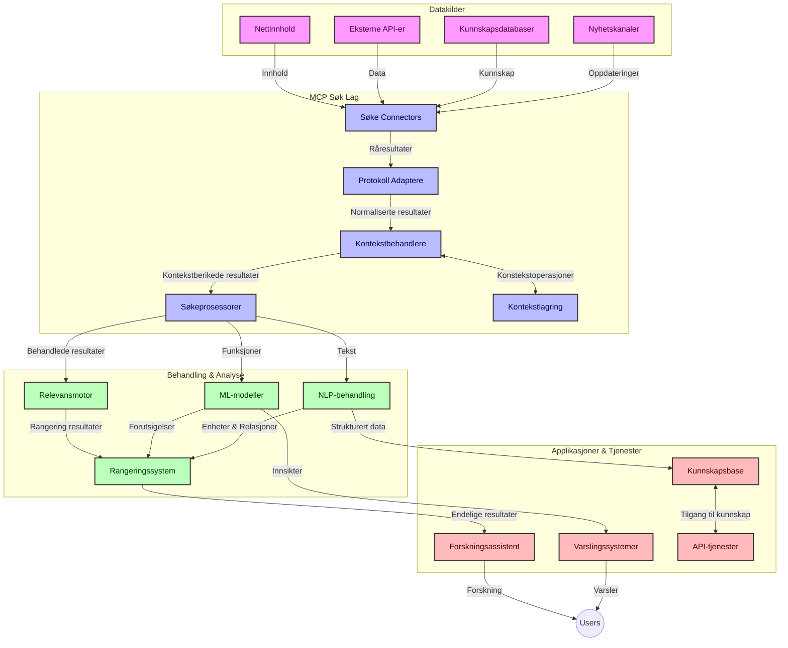
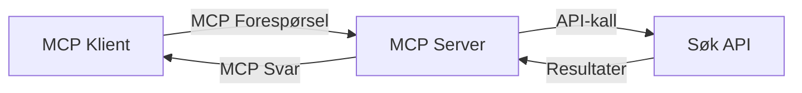
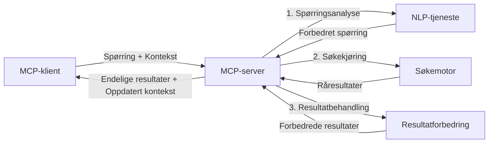

# Model Context Protocol for sanntid websøking

## Oversikt

Sanntid websøking har blitt essensielt i dagens informasjonsdrevne miljø, der applikasjoner trenger umiddelbar tilgang til oppdatert informasjon på Internett for å levere relevante og tidsriktige svar. Model Context Protocol (MCP) representerer et betydelig fremskritt i å optimalisere disse sanntidssøkeprosessene, forbedre søkeeffektiviteten, opprettholde kontekstuell integritet og forbedre systemytelsen.

Denne modulen utforsker hvordan MCP forvandler sanntid websøking ved å tilby en standardisert tilnærming til kontekststyring på tvers av AI-modeller, søkemotorer og applikasjoner.

### Hva du vil lære

I denne omfattende guiden vil du oppdage:

- Hvordan MCP skaper en sømløs bro mellom AI-modeller og sanntid websøkemuligheter
- Arkitektoniske mønstre for implementering av effektive og skalerbare søkeløsninger med MCP
- Teknikker for å bevare søkekontekst over flere spørringer og interaksjoner
- Praktiske kodeimplementeringer i Python og JavaScript for ulike søkescenarier
- Metoder for å balansere relevans, aktualitet og ytelse i MCP-drevne søkesystemer

## Introduksjon til sanntid websøking

Sanntid websøking er en teknologisk tilnærming som muliggjør kontinuerlige spørringer, behandling og analyse av nettbasert informasjon etter hvert som den publiseres eller oppdateres, noe som gjør det mulig for systemer å levere fersk og relevant informasjon med minimal forsinkelse. I motsetning til tradisjonelle søkesystemer som opererer på indeksert data som kan være flere timer eller dager gamle, bearbeider sanntidssøk levende data fra nettet og gir innsikt og informasjon som gjenspeiler den nåværende tilstanden til nettinnhold.

### Kjernebegreper for sanntid websøking:

- **Kontinuerlig spørringsbehandling**: Søkesøk spørringer behandles mot stadig oppdaterte datakilder
- **Prioritering av aktualitet**: Systemer er designet for å prioritere fersk informasjon
- **Balansere relevans**: Opprettholde balanse mellom relevans og aktualitet
- **Skalerbar arkitektur**: Systemer må håndtere variable spørringsbelastninger og datavolumer
- **Kontekstuell forståelse**: Opprettholde brukerkontekst over søkeiterasjoner er avgjørende for meningsfulle resultater
- **Dynamisk spørringsomformulering**: Tilpasset endring av spørringer basert på kontekst og tidligere resultater
- **Integrasjon av flere kilder**: Kombinere resultater fra flere søkeleverandører og nettressurser
- **Semantisk forståelse**: Behandling av spørringer og innhold basert på mening fremfor bare nøkkelord
- **Sanntids rangering**: Kontinuerlig justering av resultatrangering etter hvert som ny informasjon blir tilgjengelig

### Model Context Protocol og sanntid websøking

Model Context Protocol (MCP) adresserer flere kritiske utfordringer i sanntids søkemiljøer:

1. **Bevaring av søkekontekst**: MCP standardiserer hvordan konteksten opprettholdes på tvers av distribuerte søkekomponenter, og sikrer at AI-modeller og prosesseringsnoder har tilgang til relevant søkehistorikk og brukervalg.

2. **Effektiv spørringshåndtering**: Ved å tilby strukturerte mekanismer for kontekstoverføring reduserer MCP overhead ved å gjenta kontekst i hver søkeiterasjon.

3. **Interoperabilitet**: MCP skaper et felles språk for kontekstdeling mellom ulike søketeknologier og AI-modeller, som muliggjør mer fleksible og utvidbare arkitekturer.

4. **Søkeoptimalisert kontekst**: MCP-implementasjoner kan prioritere hvilke kontekstelementer som er mest relevante for effektiv søking, optimalisert for både ytelse og nøyaktighet.

5. **Adaptiv søkeprosessering**: Med riktig kontekststyring gjennom MCP kan søkesystemer dynamisk justere prosessering basert på brukernes utviklende behov og informasjonslandskap.

I moderne applikasjoner som strekker seg fra nyhetssamling til forskningsassistenter, muliggjør integrasjonen av MCP med websøketeknologier mer intelligente, kontekstbevisste søk som kan levere stadig mer relevante resultater etter hvert som brukerinteraksjoner fortsetter.

## Læringsmål

Ved slutten av denne leksjonen skal du kunne:

- Forstå det grunnleggende om sanntid websøking og utfordringene i moderne applikasjoner
- Forklare hvordan Model Context Protocol (MCP) forbedrer sanntid websøkemuligheter
- Implementere MCP-baserte søkeløsninger ved bruk av populære rammeverk og API-er
- Designe og distribuere skalerbare, høyytelses søkearkitekturer med MCP
- Anvende MCP-konsepter til ulike brukstilfeller inkludert semantisk søk, forskningsassistanse og AI-forsterket nettlesing
- Evaluere nye trender og fremtidige innovasjoner i MCP-baserte søketeknologier
- Utvikle kontekstbevisste søkesystemer som lærer av brukerinteraksjoner
- Integrere websøkemuligheter i AI-assistenter ved bruk av standardiserte MCP-protokoller
- Lage flertrinns søkepipelines som gradvis forbedrer resultater basert på kontekst
- Optimalisere søkeytelse samtidig som full kontekstbevissthet opprettholdes

### Definisjon og betydning

Sanntid websøking innebærer kontinuerlig spørring, henting og levering av nettbasert informasjon med minimal forsinkelse. I motsetning til tradisjonelle søkemotorer som periodisk crawler og indekserer nettet, har sanntidssøk som mål å frembringe informasjon så snart den blir tilgjengelig, noe som muliggjør umiddelbar tilgang til det mest oppdaterte innholdet.

Nøkkeltrekk ved sanntid websøking inkluderer:

- **Ferskhet**: Prioritering av nylig innhold og oppdateringer
- **Kontinuerlig prosessering**: Konstant overvåking etter ny informasjon
- **Tilpasning av spørringer**: Forbedring av søkespørringer basert på kontekst og tilbakemeldinger
- **Umiddelbar levering**: Levere søkeresultater med minimal forsinkelse
- **Bevaring av kontekst**: Bygge videre på tidligere spørringer for forbedret relevans

### Utfordringer i tradisjonell websøking

Tradisjonelle tilnærminger til websøking møter flere begrensninger når de anvendes i sanntidsscenarioer:

1. **Fragmentering av kontekst**: Vanskeligheter med å opprettholde søkekontekst over flere spørringer
2. **Ferskhetsproblemer**: Utfordringer med å få tilgang til og prioritere den mest oppdaterte informasjonen
3. **Integrasjonskompleksitet**: Problemer med interoperabilitet mellom søkesystemer og applikasjoner
4. **Forsinkelsesproblemer**: Balansering mellom omfattende søk og responstid
5. **Relevansjustering**: Sikre nøyaktighet og relevans samtidig som aktualitet prioriteres

## Forstå Model Context Protocol (MCP) for søk

### Hva er MCP i søkekontekster?

Model Context Protocol (MCP) er en standardisert kommunikasjonsprotokoll designet for å legge til rette for effektiv interaksjon mellom AI-modeller og applikasjoner. I konteksten av sanntid websøking gir MCP en rammeverk for:

- Bevaring av søkekontekst gjennom spørringssekvenser
- Standardisering av søkespørringer og resultatformater
- Optimalisering av overføring av søkeparametere og resultater
- Forbedring av kommunikasjon mellom modell og søkemotor

### Kjernekomponenter og arkitektur

MCP-arkitektur for sanntid websøking består av flere nøkkelkomponenter:

1. **Håndterere for spørringskontekst**: Administrerer og opprettholder søkekontekst på tvers av flere spørringer
2. **Søkeprosessorer**: Behandler innkommende søkeforespørsler med kontekstbevisste teknikker
3. **Protokolladaptere**: Konverterer mellom ulike søke-API-er samtidig som kontekst bevares
4. **Kontekstlager**: Effektivt lagrer og henter søkehistorikk og brukerpreferanser
5. **Søketilkoblinger**: Knytter til ulike søkemotorer og nett API-er



### Hvordan MCP forbedrer sanntid websøking

MCP adresserer tradisjonelle utfordringer med websøking gjennom:

- **Kontekstuelt kontinuitet**: Opprettholde sammenhenger mellom spørringer gjennom hele søkeøkten
- **Optimalisert overføring**: Redusere redundans i søkeparametere gjennom intelligent kontekststyring
- **Standardiserte grensesnitt**: Tilby konsistente API-er for søkekomponenter
- **Redusert forsinkelse**: Minimere prosesseringskostnader gjennom effektiv kontekstbehandling
- **Forbedret relevans**: Øke søkets relevans ved å bevare brukerens intensjon over flere spørringer

## Integrasjon og implementering

Sanntids websøkesystemer krever nøye arkitektonisk design og implementering for å opprettholde både ytelse og kontekstuell integritet. Model Context Protocol tilbyr en standardisert tilnærming for integrasjon av AI-modeller og søketeknologier, som muliggjør mer sofistikerte, kontekstbevisste søkepipeliner.

### Oversikt over MCP-integrasjon i søkearkitekturer

Implementering av MCP i sanntid websøkemiljøer krever flere viktige hensyn:

1. **Serialisering av søkekontekst**: MCP tilbyr effektive mekanismer for koding av kontekstuell informasjon i søkeforspørsler, som sikrer at vesentlig kontekst følger spørringen gjennom hele prosesseringsrøret. Dette inkluderer standardiserte serialiseringsformater optimalisert for søkebasert metadata.

2. **Tilstandsbasert søkeprosessering**: MCP muliggjør mer intelligent tilstandsbasert prosessering ved å opprettholde konsistent kontekstrepresentasjon over søkeiterasjoner. Dette er særlig verdifullt i flertrinns søkepipeliner der kontekstforfining forbedrer resultater.

3. **Utvidelse og raffinering av spørringer**: MCP-implementasjoner i søkesystemer kan legge til rette for sofistikerte utvidelser og forfining av spørringer basert på oppsamlet kontekst, noe som gir stadig mer relevante resultater etter hvert som søkeøkten utvikler seg.

4. **Resultatcaching og prioritering**: Ved å standardisere kontekstbehandling hjelper MCP med å håndtere resultatcache og prioritering, slik at komponenter kan tilpasse seg den utviklende søkekonteksten.

5. **Søkefederasjon og aggregering**: MCP muliggjør mer sofistikert føderasjon av søk på tvers av flere backender ved å tilby strukturerte representasjoner av søkekontekst, som gjør det mulig med mer meningsfull aggregering av resultater fra forskjellige kilder.

Implementeringen av MCP på tvers av ulike søketeknologier skaper en enhetlig tilnærming til kontekststyring, reduserer behovet for tilpasset integrasjonskode samtidig som systemets evne til å opprettholde meningsfull kontekst etter hvert som søkespørringer utvikler seg, forbedres.

### MCP i ulike websøkeimplementasjoner

Disse eksemplene følger den nåværende MCP-spesifikasjonen som fokuserer på en JSON-RPC-basert protokoll med distinkte transportmekanismer. Koden demonstrerer hvordan du kan implementere tilpassede søkeintegrasjoner samtidig som du opprettholder full kompatibilitet med MCP-protokollen.


<details>
<summary>Python-implementering med generell søke-API</summary>

```python
import asyncio
import json
import aiohttp
from typing import Dict, Any, Optional, List
from contextlib import asynccontextmanager
from collections.abc import AsyncIterator

# Importer standard MCP-biblioteker
from mcp.client.session import ClientSession
from mcp.client.streamable_http import streamablehttp_client
from mcp.types import TextContent, CreateMessageRequestParams, CreateMessageResult
from mcp.server.fastmcp import FastMCP

# Opprett en FastMCP-server for nettsøk
search_server = FastMCP("WebSearch")

# Klasse for å håndtere nettsøkoperasjoner
class WebSearchHandler:
    def __init__(self, api_endpoint: str, api_key: str):
        self.api_endpoint = api_endpoint
        self.api_key = api_key
        self.session = None
        
    async def initialize(self):
        """Initialize the HTTP session"""
        self.session = aiohttp.ClientSession(
            headers={"Authorization": f"Bearer {self.api_key}"}
        )
    
    async def close(self):
        """Close the HTTP session"""
        if self.session:
            await self.session.close()
            
    async def perform_search(self, query: str, max_results: int = 5, 
                           include_domains: List[str] = None, 
                           exclude_domains: List[str] = None,
                           time_period: str = "any") -> Dict[str, Any]:
        """Perform web search using the search API"""
        # Konstruer søkeparametere
        search_params = {
            "q": query,
            "limit": max_results,
            "time": time_period
        }
        
        if include_domains:
            search_params["site"] = ",".join(include_domains)
            
        if exclude_domains:
            search_params["exclude_site"] = ",".join(exclude_domains)
        
        # Utfør søkforespørselen
        try:
            async with self.session.get(
                self.api_endpoint,
                params=search_params
            ) as response:
                if response.status != 200:
                    error_text = await response.text()
                    raise Exception(f"Search API error: {response.status} - {error_text}")
                
                search_data = await response.json()
                
                # Konverter API-spesifikt svar til et standardformat
                results = []
                for item in search_data.get("results", []):
                    results.append({
                        "title": item.get("title", ""),
                        "url": item.get("url", ""),
                        "snippet": item.get("snippet", ""),
                        "date": item.get("published_date", ""),
                        "source": item.get("source", "")
                    })
                
                return {
                    "query": query,
                    "totalResults": len(results),
                    "results": results
                }
        except Exception as e:
            print(f"Search API request error: {e}")
            raise

# Initialiser søkehåndtereren
search_handler = WebSearchHandler(
    api_endpoint="https://api.search-service.example/search",
    api_key="your-api-key-here"
)

# Sett opp levetid for å administrere søkehåndtereren
@asyncio.asynccontextmanager
async def app_lifespan(server: FastMCP):
    """Manage application lifecycle"""
    await search_handler.initialize()
    try:
        yield {"search_handler": search_handler}
    finally:
        await search_handler.close()

# Sett levetid for serveren
search_server = FastMCP("WebSearch", lifespan=app_lifespan)

# Registrer et nettsøkverktøy
@search_server.tool()
async def web_search(query: str, max_results: int = 5, 
                   include_domains: List[str] = None,
                   exclude_domains: List[str] = None,
                   time_period: str = "any") -> Dict[str, Any]:
    """
    Search the web for information
    
    Args:
        query: The search query
        max_results: Maximum number of results to return (default: 5)
        include_domains: List of domains to include in search results
        exclude_domains: List of domains to exclude from search results
        time_period: Time period for results ("day", "week", "month", "any")
        
    Returns:
        Dictionary containing search results
    """
    ctx = search_server.get_context()
    search_handler = ctx.request_context.lifespan_context["search_handler"]
    
    results = await search_handler.perform_search(
        query=query,
        max_results=max_results,
        include_domains=include_domains,
        exclude_domains=exclude_domains,
        time_period=time_period
    )
    
    return results

# Eksempel på klientbruk
async def client_example():
    # Koble til søkeserveren ved hjelp av Streamable HTTP-transport
    async with streamablehttp_client("http://localhost:8000/mcp") as (read, write, _):
        async with ClientSession(read, write) as session:
            # Initialiser tilkoblingen
            await session.initialize()
            
            # Kall nettsøkverktøyet
            search_results = await session.call_tool(
                "web_search", 
                {
                    "query": "latest developments in AI and Model Context Protocol",
                    "max_results": 5,
                    "time_period": "day",
                    "include_domains": ["github.com", "microsoft.com"]
                }
            )
            
            print(f"Search results: {search_results}")

# Eksempel på serverkjøring
if __name__ == "__main__":
    # Kjør serveren med Streamable HTTP-transport
    search_server.run(transport="streamable-http")
```
</details> 

<details>
<summary>JavaScript-implementering med nettleserbasert søk</summary>


```javascript
// MCP serverimplementering for nettsøk
import { McpServer, ResourceTemplate } from '@modelcontextprotocol/sdk/server/mcp.js';
import { StreamableHTTPServerTransport } from '@modelcontextprotocol/sdk/server/streamableHttp.js';
import { z } from 'zod';

// Opprett en MCP-server for nettsøk
const searchServer = new McpServer({
    name: "BrowserSearch",
    description: "A server that provides web search capabilities"
});

// Søketjenesteklasse
class SearchService {
    constructor(searchApiUrl, apiKey) {
        this.searchApiUrl = searchApiUrl;
        this.apiKey = apiKey;
    }

    async performSearch(parameters) {
        const {
            query = '',
            maxResults = 5,
            includeDomains = [],
            excludeDomains = [],
            timePeriod = 'any'
        } = parameters;
        
        // Konstruer søke-URL med parametere
        const url = new URL(this.searchApiUrl);
        url.searchParams.append('q', query);
        url.searchParams.append('limit', maxResults);
        url.searchParams.append('time', timePeriod);
        
        if (includeDomains.length > 0) {
            url.searchParams.append('site', includeDomains.join(','));
        }
        
        if (excludeDomains.length > 0) {
            url.searchParams.append('exclude_site', excludeDomains.join(','));
        }
        
        try {
            const response = await fetch(url.toString(), {
                method: 'GET',
                headers: {
                    'Authorization': `Bearer ${this.apiKey}`,
                    'Content-Type': 'application/json'
                }
            });
            
            if (!response.ok) {
                const errorText = await response.text();
                throw new Error(`Search API error: ${response.status} - ${errorText}`);
            }
            
            const searchData = await response.json();
            
            // Transformer API-spesifikk respons til et standardformat
            const results = searchData.results?.map(item => ({
                title: item.title || '',
                url: item.url || '',
                snippet: item.snippet || '',
                date: item.published_date || '',
                source: item.source || ''
            })) || [];
            
            return {
                query,
                totalResults: results.length,
                results
            };
        } catch (error) {
            console.error('Search API request error:', error);
            throw error;
        }
    }
}

// Initialiser søketjenesten
const searchService = new SearchService(
    'https://api.search-service.example/search',
    'your-api-key-here'
);

// Sett opp kontekstleverandøren for serveren
searchServer.setContextProvider(() => {
    return {
        searchService
    };
});

// Registrer nettsøkverktøy
searchServer.tool({
    name: 'web_search',
    description: 'Search the web for information',
    parameters: {
        type: 'object',
        properties: {
            query: {
                type: 'string',
                description: 'The search query'
            },
            maxResults: {
                type: 'integer',
                description: 'Maximum number of results to return',
                default: 5
            },
            includeDomains: {
                type: 'array',
                items: { type: 'string' },
                description: 'List of domains to include in search results'
            },
            excludeDomains: {
                type: 'array',
                items: { type: 'string' },
                description: 'List of domains to exclude from search results'
            },
            timePeriod: {
                type: 'string',
                description: 'Time period for results',
                enum: ['day', 'week', 'month', 'any'],
                default: 'any'
            }
        },
        required: ['query']
    },
    handler: async (params, context) => {
        const { searchService } = context;
        return await searchService.performSearch(params);
    }
});

// Eksempel på klientkode for å koble til søkeserver
import { Client } from '@modelcontextprotocol/sdk/client/index.js';
import { StreamableHTTPClientTransport } from '@modelcontextprotocol/sdk/client/streamableHttp.js';

async function connectToSearchServer() {
    // Koble til søkeserver
    const transport = new StreamableHTTPClientTransport(
        new URL('http://localhost:8000/mcp')
    );
    
    const client = new Client({
        name: 'search-client',
        version: '1.0.0'
    });
    
    await client.connect(transport);
    
    // Utfør søkeverktøyet
    const searchResults = await client.callTool({
        name: 'web_search',
        arguments: {
            query: 'Model Context Protocol implementation examples',
            maxResults: 10,
            timePeriod: 'week',
            includeDomains: ['github.com', 'docs.microsoft.com']
        }
    });
    
    console.log('Search results:', searchResults);
    
    // Rydd opp
    await client.disconnect();
}

// Start serveren
const transport = new StreamableHTTPServerTransport();
await searchServer.connect(transport);
console.log('Search server running at http://localhost:8000/mcp');

// I en separat prosess eller etter at serveren er startet
// connectToSearchServer().catch(console.error);
```
</details> 


## Ansvarsfraskrivelse for kodeeksempler

> **Viktig merknad**: Kodeeksemplene nedenfor demonstrerer integrasjonen av Model Context Protocol (MCP) med websøke-funksjonalitet. Selv om de følger mønstrene og strukturene til de offisielle MCP-SDK-ene, er de forenklet for pedagogiske formål.
> 
> Disse eksemplene viser:
> 
> 1. **Python-implementering**: En FastMCP-serverimplementering som tilbyr et websøkeverktøy og kobler til et eksternt søke-API. Dette eksemplet viser riktig levetidshåndtering, kontekstbehandling og verktøyimplementering etter mønstrene til [den offisielle MCP Python SDK](https://github.com/modelcontextprotocol/python-sdk). Serveren benytter den anbefalte Streamable HTTP-transporten som har erstattet den eldre SSE-transporten for produksjonsdistribusjoner.
> 
> 2. **JavaScript-implementering**: En TypeScript/JavaScript-implementering ved bruk av FastMCP-mønsteret fra [den offisielle MCP TypeScript SDK](https://github.com/modelcontextprotocol/typescript-sdk) for å lage en søkeserver med korrekte verktøydefinisjoner og klienttilkoblinger. Den følger de nyeste anbefalte mønstrene for sesjonshåndtering og kontekstbevaring.
> 
> Disse eksemplene vil kreve ytterligere feilhåndtering, autentisering og spesifikk API-integrasjonskode for produksjonsbruk. De viste søke-API-endepunktene (`https://api.search-service.example/search`) er plassholdere og må erstattes med faktiske søketjenesteendepunkter.
> 
> For fullstendige implementeringsdetaljer og de mest oppdaterte tilnærmingene, vennligst se [den offisielle MCP-spesifikasjonen](https://spec.modelcontextprotocol.io/) og SDK-dokumentasjonen.

## Kjernebegreper

### Model Context Protocol (MCP)-rammeverket

Grunnleggende tilbyr Model Context Protocol en standardisert måte for AI-modeller, applikasjoner og tjenester å utveksle kontekst. I sanntid websøking er dette rammeverket essensielt for å skape koherente, flerturns søkeopplevelser. Nøkkelkomponenter inkluderer:

1. **Klient-server-arkitektur**: MCP etablerer en tydelig separasjon mellom søkeklienter (forespørrere) og søkeservere (tilbydere), noe som muliggjør fleksible distribusjonsmodeller.

2. **JSON-RPC-kommunikasjon**: Protokollen bruker JSON-RPC for meldingsutveksling, noe som gjør den kompatibel med webteknologier og enkel å implementere på ulike plattformer.

3. **Kontekststyring**: MCP definerer strukturerte metoder for å opprettholde, oppdatere og utnytte søkekontekst på tvers av flere interaksjoner.

4. **Verktøydefinisjoner**: Søkefunksjoner eksponeres som standardiserte verktøy med veldefinerte parametere og returverdier.

5. **Strømmestøtte**: Protokollen støtter strømming av resultater, noe som er essensielt for sanntidssøk hvor resultater kan komme inn gradvis.

### Integrasjonsmønstre for websøking

Ved integrering av MCP med websøking oppstår flere mønstre:

#### 1. Direkte integrasjon med søkeleverandør



I dette mønsteret grensesnitt MCP-serveren direkte med en eller flere søke-API-er, oversetter MCP-forespørsler til API-spesifikke kall og formaterer resultatene som MCP-responser.

#### 2. Føderert søk med kontekstbevaring


Dette mønsteret distribuerer søkespørringer på tvers av flere MCP-kompatible søkeleverandører, hvor hver potensielt spesialiserer seg på ulike typer innhold eller søkemuligheter, samtidig som en enhetlig kontekst opprettholdes.

#### 3. Kontekstsforbedret søkekjede



I dette mønsteret deles søkeprosessen opp i flere trinn, der konteksten berikes i hvert steg, noe som resulterer i gradvis mer relevante resultater.

### Komponenter for søkekontekst

I MCP-baserte websøking inkluderer kontekst typisk:

- **Spørringshistorikk**: Tidligere søkespørringer i sesjonen
- **Brukerpreferanser**: Språk, region, sikker søk-innstillinger
- **Interaksjonshistorikk**: Hvilke resultater som ble klikket, tid brukt på resultater
- **Søkeparametere**: Filtre, sorteringsrekkefølge og andre søkemodifikatorer
- **Domeneekspertise**: Fagspesifikk kontekst relevant for søket
- **Temporær kontekst**: Tidbaserte relevansfaktorer
- **Kildepreferanser**: Pålitelige eller foretrukne informasjonskilder

## Bruksområder og applikasjoner

### Forskning og informasjonsinnhenting

MCP forbedrer forskningsflyter ved å:

- Bevare forskningskontekst på tvers av søkesesjoner
- Muliggjøre mer sofistikerte og kontekstuelt relevante spørringer
- Støtte føderert søk fra flere kilder
- Legge til rette for kunnskapsutvinning fra søkeresultater

### Sanntid nyheter og trendovervåking

MCP-drevet søk tilbyr fordeler for nyhetsovervåking:

- Nesten sanntids oppdagelse av nye nyhetshistorier
- Kontekstuell filtrering av relevant informasjon
- Sporing av temaer og enheter på tvers av flere kilder
- Personlige nyhetsvarsler basert på brukerkontekst

### AI-forsterket nettlesing og forskning

MCP skaper nye muligheter for AI-forsterket nettlesing:

- Kontekstuelle søkeforslag basert på nåværende nettleseraktivitet
- Sømløs integrasjon av websøking med LLM-drevne assistenter
- Multi-turn søkeforfining med vedlikeholdt kontekst
- Forbedret fakta-sjekking og informasjonsverifisering

## Fremtidige trender og innovasjoner

### Utvikling av MCP i websøking

Ser framover forventer vi at MCP utvikler seg for å adressere:


- **Multimodal søk**: Integrere tekst-, bilde-, lyd- og videosøk med bevart kontekst
- **Desentralisert søk**: Støtte distribuerte og fødererte søkøkosystemer
- **Søk personvern**: Kontekstbevisste personvernbevarende søkeme-kanismer
- **Spørringsforståelse**: Dyp semantisk parsing av naturlige språksøkespørringer

### Potensielle teknologiske fremskritt

Fremvoksende teknologier som vil forme fremtiden for MCP-søk:

1. **Nevrale søkearkitekturer**: Innebygde søkesystemer optimalisert for MCP
2. **Personlig søkekontekst**: Læring av individuelle bruker-søkemønstre over tid
3. **Kunnskapsgrafintegrasjon**: Kontekstuell søk forbedret med domene-spesifikke kunnskapsgrafer
4. **Tverrmodal kontekst**: Opprettholde kontekst på tvers av ulike søkemodaliteter

## Praktiske øvelser

### Øvelse 1: Sette opp en grunnleggende MCP-søkerørledning

I denne øvelsen vil du lære å:
- Konfigurere et grunnleggende MCP-søkemiljø
- Implementere kontekstbehandlere for web-søk
- Teste og validere bevaring av kontekst gjennom søkeiterasjoner

### Øvelse 2: Bygge en forskningsassistent med MCP-søk

Lag en komplett applikasjon som:
- Behandler spørsmål i naturlig språk
- Utfører kontekstbevisste websøk
- Syntherer informasjon fra flere kilder
- Presenterer organiserte forskningsfunn

### Øvelse 3: Implementere flerkilde søkeføderasjon med MCP

Avansert øvelse som dekker:
- Kontekstbevisst spørringsdistribusjon til flere søkemotorer
- Resultatrangering og aggregering
- Kontekstuell duplikatsjekk av søkeresultater
- Håndtering av kilde-spesifikk metadata

## Ytterligere ressurser

- [Model Context Protocol Specification](https://spec.modelcontextprotocol.io/) - Offisiell MCP-spesifikasjon og detaljert protokoll-dokumentasjon
- [Model Context Protocol Documentation](https://modelcontextprotocol.io/) - Detaljerte veiledninger og implementasjonsguider
- [MCP Python SDK](https://github.com/modelcontextprotocol/python-sdk) - Offisiell Python-implementasjon av MCP-protokollen
- [MCP TypeScript SDK](https://github.com/modelcontextprotocol/typescript-sdk) - Offisiell TypeScript-implementasjon av MCP-protokollen
- [MCP Reference Servers](https://github.com/modelcontextprotocol/servers) - Referanseimplementasjoner av MCP-servere
- [Bing Web Search API Documentation](https://learn.microsoft.com/en-us/bing/search-apis/bing-web-search/overview) - Microsofts web-søke-API
- [Google Custom Search JSON API](https://developers.google.com/custom-search/v1/overview) - Googles programmerbare søkemotor
- [SerpAPI Documentation](https://serpapi.com/search-api) - API for søkeresultatside
- [Meilisearch Documentation](https://www.meilisearch.com/docs) - Åpen kildekode søkemotor
- [Elasticsearch Documentation](https://www.elastic.co/guide/index.html) - Distribuert søke- og analysemotor
- [LangChain Documentation](https://python.langchain.com/docs/get_started/introduction) - Bygge applikasjoner med LLM-er

## Læringsutbytte

Etter å ha fullført denne modulen vil du kunne:

- Forstå grunnprinsippene for sanntids websøk og dets utfordringer
- Forklare hvordan Model Context Protocol (MCP) forbedrer sanntids websøk
- Implementere MCP-baserte søkeløsninger med populære rammeverk og API-er
- Designe og distribuere skalerbare, høyytelses søkearkitekturer med MCP
- Anvende MCP-konsepter til ulike brukstilfeller som semantisk søk, forskningsassistanse og AI-forsterket nettlesing
- Vurdere fremvoksende trender og fremtidige innovasjoner innen MCP-baserte søketeknologier


### Tillit og sikkerhetshensyn

Ved implementering av MCP-baserte websøkeløsninger, husk disse viktige prinsippene fra MCP-spesifikasjonen:

1. **Brukersamtykke og kontroll**: Brukere må eksplisitt samtykke til og forstå all data-tilgang og operasjoner. Dette er spesielt viktig for websøkimplementasjoner som kan få tilgang til eksterne datakilder.

2. **Datapersonvern**: Sørg for korrekt håndtering av søkespørringer og resultater, særlig når de kan inneholde sensitiv informasjon. Implementer passende tilgangskontroller for å beskytte brukerdata.

3. **Verktøysikkerhet**: Implementer riktig autorisasjon og validering for søkeverktøy, da de utgjør potensielle sikkerhetsrisikoer via vilkårlig kodekjøring. Beskrivelser av verktøyets oppførsel bør anses som upålitelige med mindre de er hentet fra en pålitelig server.

4. **Klar dokumentasjon**: Gi tydelig dokumentasjon om muligheter, begrensninger og sikkerhetshensyn ved din MCP-baserte søkeimplementasjon, i tråd med retningslinjene i MCP-spesifikasjonen.

5. **Robuste samtykkeflyt**: Bygg robuste samtykke- og autorisasjonsflyter som klart forklarer hva hvert verktøy gjør før brukstillatelse gis, spesielt for verktøy som samhandler med eksterne nettressurser.

For fullstendige detaljer om MCP-sikkerhet og tillitshensyn, se [offisiell dokumentasjon](https://modelcontextprotocol.io/specification/2025-11-25/basic/security_best_practices).

## Hva er neste

- [5.12 Entra ID-autentisering for Model Context Protocol-servere](../mcp-security-entra/README.md)

---

<!-- CO-OP TRANSLATOR DISCLAIMER START -->
**Ansvarsfraskrivelse**:
Dette dokumentet er oversatt ved hjelp av AI-oversettelsestjenesten [Co-op Translator](https://github.com/Azure/co-op-translator). Selv om vi streber etter nøyaktighet, vær oppmerksom på at automatiske oversettelser kan inneholde feil eller unøyaktigheter. Det opprinnelige dokumentet på originalspråket skal betraktes som den autoritative kilden. For kritisk informasjon anbefales profesjonell menneskelig oversettelse. Vi er ikke ansvarlige for eventuelle misforståelser eller feiltolkninger som oppstår ved bruk av denne oversettelsen.
<!-- CO-OP TRANSLATOR DISCLAIMER END -->