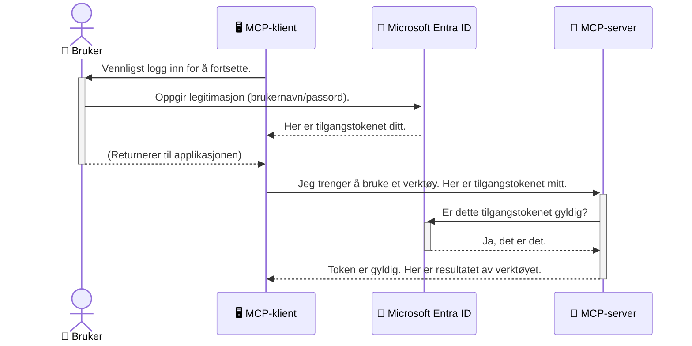

# Sikring av AI-arbeidsflyter: Entra ID-autentisering for Model Context Protocol-servere

> [!NOTE]
> Koden for den eksterne serveren i denne leksjonen beskytter eldre `/sse` og `/message`
> endepunkter og retter seg mot MCP `2025-11-25`. Behold dens praksis for identitets- og token-validering,
> men bruk en `2026-07-28`-kompatibel Streamable HTTP transport for nye
> implementasjoner.

## Introduksjon
Å sikre din Model Context Protocol (MCP) server er like viktig som å låse inngangsdøren til huset ditt. Å la MCP-serveren stå åpen eksponerer verktøy og data for uautorisert tilgang, noe som kan føre til sikkerhetsbrudd. Microsoft Entra ID gir en robust skybasert identitets- og tilgangsstyringsløsning som hjelper til med å sikre at kun autoriserte brukere og applikasjoner kan samhandle med din MCP-server. I denne seksjonen vil du lære hvordan du kan beskytte dine AI-arbeidsflyter ved hjelp av Entra ID-autentisering.

## Læringsmål
Ved slutten av denne seksjonen vil du kunne:

- Forstå viktigheten av å sikre MCP-servere.
- Forklare det grunnleggende om Microsoft Entra ID og OAuth 2.0-autentisering.
- Gjenkjenne forskjellen mellom offentlige og konfidensielle klienter.
- Implementere Entra ID-autentisering i både lokale (offentlige klienter) og eksterne (konfidensielle klienter) MCP-server-scenarier.
- Anvende sikkerhets beste praksis ved utvikling av AI-arbeidsflyter.

## Sikkerhet og MCP

Akkurat som du ikke ville latt inngangsdøren stå ulåst, bør du ikke la MCP-serveren være åpen for alle å få tilgang til. Å sikre dine AI-arbeidsflyter er avgjørende for å bygge robuste, pålitelige og sikre applikasjoner. Dette kapitlet vil introdusere deg for bruk av Microsoft Entra ID for å sikre MCP-serverne dine, og sørge for at bare autoriserte brukere og apper kan samhandle med verktøyene og dataene dine.

## Hvorfor sikkerhet er viktig for MCP-servere

Forestill deg at MCP-serveren din har et verktøy som kan sende e-post eller få tilgang til en kundedatabase. En usikret server vil bety at hvem som helst potensielt kan bruke det verktøyet, noe som kan føre til uautorisert datatilgang, spam eller annen skadelig aktivitet.

Ved å implementere autentisering sikrer du at hver forespørsel til serveren din er verifisert, og bekrefter identiteten til brukeren eller applikasjonen som gjør forespørselen. Dette er det første og mest kritiske steget i å sikre AI-arbeidsflytene dine.

## Introduksjon til Microsoft Entra ID

[**Microsoft Entra ID**](https://adoption.microsoft.com/microsoft-security/entra/) er en skybasert tjeneste for identitets- og tilgangsstyring. Tenk på det som en universell sikkerhetsvakt for applikasjonene dine. Den håndterer den komplekse prosessen med å verifisere brukeridentiteter (autentisering) og avgjøre hva de har tillatelse til å gjøre (autorisasjon).

Ved å bruke Entra ID kan du:

- Aktivere sikker pålogging for brukere.
- Beskytte API-er og tjenester.
- Administrere tilgangspolicyer fra ett sentralt sted.

For MCP-servere gir Entra ID en robust og allment anerkjent løsning for å kontrollere hvem som kan få tilgang til serverens funksjoner.

---

## Forstå magien: Hvordan Entra ID-autentisering fungerer

Entra ID bruker åpne standarder som **OAuth 2.0** for å håndtere autentisering. Selv om detaljene kan være komplekse, er kjerneideen enkel og kan forstås med en analogi.

### En enkel introduksjon til OAuth 2.0: Parkeringsvaktnøkkelen

Tenk på OAuth 2.0 som en parkeringsvakt-tjeneste for bilen din. Når du ankommer en restaurant, gir du ikke parkeringsvakten hovednøkkelen din. I stedet gir du en **parkeringsvaktnøkkel** som har begrensede tillatelser — den kan starte bilen og låse dørene, men den kan ikke åpne bagasjerommet eller hanskerommet.

I denne analogien:

- **Du** er **brukeren**.
- **Bilen din** er **MCP-serveren** med sine verdifulle verktøy og data.
- **Parkeringsvakten** er **Microsoft Entra ID**.
- **Parkeringsassistenten** er **MCP-klienten** (applikasjonen som prøver å få tilgang til serveren).
- **Parkeringsvaktnøkkelen** er **tilgangstokenet**.

Tilgangstokenet er en sikker tekststreng som MCP-klienten mottar fra Entra ID etter at du har logget inn. Klienten presenterer så dette tokenet til MCP-serveren ved hver forespørsel. Serveren kan verifisere tokenet for å bekrefte at forespørselen er legitim og at klienten har nødvendige tillatelser, alt uten å måtte håndtere dine faktiske påloggingsdetaljer (som passordet ditt).

### Autentiseringsflyten

Slik fungerer prosessen i praksis:



### Introduksjon til Microsoft Authentication Library (MSAL)

Før vi går inn i koden, er det viktig å introdusere en nøkkelkomponent du vil se i eksemplene: **Microsoft Authentication Library (MSAL)**.

MSAL er et bibliotek utviklet av Microsoft som gjør det mye enklere for utviklere å håndtere autentisering. I stedet for at du må skrive all den komplekse koden for håndtering av sikkerhetstokener, administrasjon av pålogginger og oppfrisking av økter, tar MSAL seg av det tunge arbeidet.

Å bruke et bibliotek som MSAL anbefales sterkt fordi:

- **Det er sikkert:** Det implementerer industristandardprotokoller og sikkerhets beste praksis, og reduserer risikoen for sårbarheter i koden din.
- **Det forenkler utviklingen:** Det skjuler kompleksiteten i OAuth 2.0- og OpenID Connect-protokollene, og gjør det enkelt å legge til robust autentisering i applikasjonen din med bare noen få kodelinjer.
- **Det vedlikeholdes:** Microsoft oppdaterer og vedlikeholder MSAL aktivt for å håndtere nye sikkerhetstrusler og plattformendringer.

MSAL støtter et bredt utvalg språk og applikasjonsrammeverk, inkludert .NET, JavaScript/TypeScript, Python, Java, Go og mobilplattformer som iOS og Android. Dette betyr at du kan bruke samme konsistente autentiseringsmønstre på tvers av hele teknologistacken din.

For å lære mer om MSAL, kan du sjekke den offisielle [MSAL oversiktsdokumentasjonen](https://learn.microsoft.com/entra/identity-platform/msal-overview).

---

## Sikring av din MCP-server med Entra ID: En trinnvis veiledning

Nå skal vi gå gjennom hvordan du sikrer en lokal MCP-server (en som kommuniserer over `stdio`) ved hjelp av Entra ID. Dette eksemplet bruker en **offentlig klient**, som passer for applikasjoner som kjører på brukerens maskin, som en skrivebordsapp eller en lokal utviklingsserver.

### Scenario 1: Sikring av en lokal MCP-server (med en offentlig klient)

I dette scenariet ser vi på en MCP-server som kjører lokalt, kommuniserer over `stdio`, og bruker Entra ID for å autentisere brukeren før verktøyene blir tilgjengelige. Serveren har et enkelt verktøy som henter brukerens profilinformasjon fra Microsoft Graph API.

#### 1. Sette opp applikasjonen i Entra ID

Før du skriver kode, må du registrere applikasjonen i Microsoft Entra ID. Dette forteller Entra ID om applikasjonen din og gir den tillatelse til å bruke autentiseringstjenesten.

1. Gå til **[Microsoft Entra-portalen](https://entra.microsoft.com/)**.
2. Gå til **App registrations** og klikk på **New registration**.
3. Gi applikasjonen et navn (f.eks. "Min lokale MCP-server").
4. For **Supported account types**, velg **Accounts in this organizational directory only**.
5. Du kan la **Redirect URI** stå tom for dette eksempelet.
6. Klikk **Register**.

Når appen er registrert, noter deg **Application (client) ID** og **Directory (tenant) ID**. Disse trenger du i koden.

#### 2. Koden: En gjennomgang

La oss se på nøkkelkomponentene i koden som håndterer autentisering. Fullständig kode for dette eksempelet er tilgjengelig i [Entra ID - Local - WAM](https://github.com/Azure-Samples/mcp-auth-servers/tree/main/src/entra-id-local-wam)-mappen i [mcp-auth-servers GitHub-repositoriet](https://github.com/Azure-Samples/mcp-auth-servers).

**`AuthenticationService.cs`**

Denne klassen håndterer samhandlingen med Entra ID.

- **`CreateAsync`**: Denne metoden initialiserer `PublicClientApplication` fra MSAL (Microsoft Authentication Library). Den konfigureres med applikasjonens `clientId` og `tenantId`.
- **`WithBroker`**: Dette aktiverer bruk av en broker (som Windows Web Account Manager), som gir en sikrere og sømløs single sign-on opplevelse.
- **`AcquireTokenAsync`**: Dette er kjernemetoden. Den prøver først å hente et token stille (uten at brukeren må logge inn på nytt hvis en gyldig økt finnes). Hvis et stille token ikke kan hentes, vil brukeren bli bedt om å logge inn interaktivt.

```csharp
// Simplified for clarity
public static async Task<AuthenticationService> CreateAsync(ILogger<AuthenticationService> logger)
{
    var msalClient = PublicClientApplicationBuilder
        .Create(_clientId) // Your Application (client) ID
        .WithAuthority(AadAuthorityAudience.AzureAdMyOrg)
        .WithTenantId(_tenantId) // Your Directory (tenant) ID
        .WithBroker(new BrokerOptions(BrokerOptions.OperatingSystems.Windows))
        .Build();

    // ... cache registration ...

    return new AuthenticationService(logger, msalClient);
}

public async Task<string> AcquireTokenAsync()
{
    try
    {
        // Try silent authentication first
        var accounts = await _msalClient.GetAccountsAsync();
        var account = accounts.FirstOrDefault();

        AuthenticationResult? result = null;

        if (account != null)
        {
            result = await _msalClient.AcquireTokenSilent(_scopes, account).ExecuteAsync();
        }
        else
        {
            // If no account, or silent fails, go interactive
            result = await _msalClient.AcquireTokenInteractive(_scopes).ExecuteAsync();
        }

        return result.AccessToken;
    }
    catch (Exception ex)
    {
        _logger.LogError(ex, "An error occurred while acquiring the token.");
        throw; // Optionally rethrow the exception for higher-level handling
    }
}
```

**`Program.cs`**

Her settes MCP-serveren opp og autentiseringstjenesten integreres.

- **`AddSingleton<AuthenticationService>`**: Dette registrerer `AuthenticationService` i dependency injection containeren, slik at den kan brukes av andre deler av applikasjonen (som vårt verktøy).
- **`GetUserDetailsFromGraph`-verktøyet**: Dette verktøyet krever en instans av `AuthenticationService`. Før det gjør noe, kaller det `authService.AcquireTokenAsync()` for å få et gyldig tilgangstoken. Hvis autentisering lykkes, bruker det tokenet for å kalle Microsoft Graph API og hente brukerens detaljer.

```csharp
// Simplified for clarity
[McpServerTool(Name = "GetUserDetailsFromGraph")]
public static async Task<string> GetUserDetailsFromGraph(
    AuthenticationService authService)
{
    try
    {
        // This will trigger the authentication flow
        var accessToken = await authService.AcquireTokenAsync();

        // Use the token to create a GraphServiceClient
        var graphClient = new GraphServiceClient(
            new BaseBearerTokenAuthenticationProvider(new TokenProvider(authService)));

        var user = await graphClient.Me.GetAsync();

        return System.Text.Json.JsonSerializer.Serialize(user);
    }
    catch (Exception ex)
    {
        return $"Error: {ex.Message}";
    }
}
```

#### 3. Hvordan dette fungerer sammen

1. Når MCP-klienten prøver å bruke `GetUserDetailsFromGraph`-verktøyet, kaller verktøyet først `AcquireTokenAsync`.
2. `AcquireTokenAsync` får MSAL-biblioteket til å sjekke etter et gyldig token.
3. Hvis det ikke finnes noe token, vil MSAL, gjennom broker, be brukeren logge inn med Entra ID-kontoen.
4. Når brukeren logger inn, utsteder Entra ID et tilgangstoken.
5. Verktøyet mottar tokenet og bruker det til å gjøre sikre kall til Microsoft Graph API.
6. Brukerens detaljer returneres til MCP-klienten.

Denne prosessen sørger for at bare autentiserte brukere kan bruke verktøyet, og sikrer effektivt din lokale MCP-server.

### Scenario 2: Sikring av en fjern MCP-server (med en konfidensiell klient)

Når MCP-serveren din kjører på en ekstern maskin (som en skyløsning) og kommuniserer over en protokoll som HTTP Streaming, er sikkerhetskravene annerledes. I dette tilfellet bør du bruke en **konfidensiell klient** og **Authorization Code Flow**. Dette er en sikrere metode fordi applikasjonens hemmeligheter aldri eksponeres i nettleseren.

Dette eksemplet bruker en TypeScript-basert MCP-server som bruker Express.js til å håndtere HTTP-forespørsler.

#### 1. Set up applikasjonen i Entra ID

Oppsettet i Entra ID er likt som for den offentlige klienten, men med en viktig forskjell: du må lage en **client secret**.

1. Gå til **[Microsoft Entra-portalen](https://entra.microsoft.com/)**.
2. I app-registreringen din, gå til fanen **Certificates & secrets**.
3. Klikk **New client secret**, gi den en beskrivelse, og klikk **Add**.
4. **Viktig:** Kopier hemmelighetsverdien umiddelbart. Du vil ikke kunne se den igjen.
5. Du må også konfigurere en **Redirect URI**. Gå til fanen **Authentication**, klikk **Add a platform**, velg **Web**, og skriv inn redirect URI for applikasjonen (f.eks. `http://localhost:3001/auth/callback`).

> **⚠️ Viktig sikkerhetsnotat:** For produksjonsapplikasjoner anbefaler Microsoft sterkt å bruke **hemmelighetsfrie autentiseringsmetoder** som **Managed Identity** eller **Workload Identity Federation** i stedet for klienthemmeligheter. Klienthemmeligheter utgjør sikkerhetsrisikoer da de kan eksponeres eller kompromitteres. Managed identiteter gir en tryggere tilnærming ved å eliminere behovet for å lagre legitimasjon i koden eller konfigurasjonen din.
>
> For mer informasjon om managed identities og hvordan implementere dem, se [Oversikt over Managed identities for Azure resources](https://learn.microsoft.com/entra/identity/managed-identities-azure-resources/overview).

#### 2. Koden: En gjennomgang

Dette eksemplet bruker en session-basert tilnærming. Når bruker autentiserer seg, lagrer serveren tilgangstoken og oppfriskingstoken i en session og gir brukeren en sesjonstoken. Denne sesjonstoken brukes deretter for påfølgende forespørsler. Fullstendig kode for dette eksempelet er tilgjengelig i [Entra ID - Confidential client](https://github.com/Azure-Samples/mcp-auth-servers/tree/main/src/entra-id-cca-session)-mappen i [mcp-auth-servers GitHub-repositoriet](https://github.com/Azure-Samples/mcp-auth-servers).

**`Server.ts`**

Denne filen setter opp Express-serveren og MCP transportlaget.

- **`requireBearerAuth`**: Dette er middleware som beskytter `/sse` og `/message` endepunktene. Den sjekker for et gyldig bearer-token i `Authorization` headeren i forespørselen.
- **`EntraIdServerAuthProvider`**: Dette er en egendefinert klasse som implementerer `McpServerAuthorizationProvider`-grensesnittet. Den håndterer OAuth 2.0-flyten.
- **`/auth/callback`**: Dette endepunktet håndterer redirecten fra Entra ID etter at brukeren har autentisert seg. Det bytter autorisasjonskoden mot et tilgangstoken og et oppfriskingstoken.

```typescript
// Forenklet for klarhet
const app = express();
const { server } = createServer();
const provider = new EntraIdServerAuthProvider();

// Beskytt SSE-endepunktet
app.get("/sse", requireBearerAuth({
  provider,
  requiredScopes: ["User.Read"]
}), async (req, res) => {
  // ... koble til transporten ...
});

// Beskytt meldingendepunktet
app.post("/message", requireBearerAuth({
  provider,
  requiredScopes: ["User.Read"]
}), async (req, res) => {
  // ... håndter meldingen ...
});

// Håndter OAuth 2.0 tilbakeringing
app.get("/auth/callback", (req, res) => {
  provider.handleCallback(req.query.code, req.query.state)
    .then(result => {
      // ... håndter suksess eller feil ...
    });
});
```

**`Tools.ts`**

Denne filen definerer verktøyene MCP-serveren tilbyr. `getUserDetails` verktøyet ligner på det i forrige eksempel, men henter tilgangstokenet fra session.

```typescript
// Forenklet for klarhet
server.setRequestHandler(CallToolRequestSchema, async (request) => {
  const { name } = request.params;
  const context = request.params?.context as { token?: string } | undefined;
  const sessionToken = context?.token;

  if (name === ToolName.GET_USER_DETAILS) {
    if (!sessionToken) {
      throw new AuthenticationError("Authentication token is missing or invalid. Ensure the token is provided in the request context.");
    }

    // Hent Entra ID-tokenet fra sesjonslageret
    const tokenData = tokenStore.getToken(sessionToken);
    const entraIdToken = tokenData.accessToken;

    const graphClient = Client.init({
      authProvider: (done) => {
        done(null, entraIdToken);
      }
    });

    const user = await graphClient.api('/me').get();

    // ... returner brukerdetaljer ...
  }
});
```

**`auth/EntraIdServerAuthProvider.ts`**

Denne klassen håndterer logikken for:

- Å redirecte brukeren til Entra ID påloggingsside.
- Å bytte autorisasjonskoden mot et tilgangstoken.
- Å lagre tokenene i `tokenStore`.
- Å oppdatere tilgangstokenet når det utløper.


#### 3. Hvordan alt fungerer sammen

1. Når en bruker først prøver å koble til MCP-serveren, ser `requireBearerAuth` middleware at de ikke har en gyldig økt og vil omdirigere dem til påloggingssiden for Entra ID.
2. Brukeren logger inn med sin Entra ID-konto.
3. Entra ID omdirigerer brukeren tilbake til `/auth/callback` endepunktet med en autorisasjonskode.
4. Serveren bytter koden mot et tilgangstoken og et oppfriskningstoken, lagrer dem, og oppretter en økttoken som sendes til klienten.
5. Klienten kan nå bruke denne økttoken i `Authorization` header for alle fremtidige forespørsler til MCP-serveren.
6. Når verktøyet `getUserDetails` kalles, bruker det økttoken for å finne Entra ID tilgangstoken og bruker det til å kalle Microsoft Graph API.

Denne flyten er mer kompleks enn den offentlige klientflyten, men er nødvendig for internettvendte endepunkter. Siden eksterne MCP-servere er tilgjengelige over det offentlige internett, trenger de sterkere sikkerhetstiltak for å beskytte mot uautorisert tilgang og potensielle angrep.


## Sikkerhets beste praksis

- **Bruk alltid HTTPS**: Krypter kommunikasjonen mellom klient og server for å beskytte tokens fra å bli avlyttet.
- **Implementer rollebasert tilgangskontroll (RBAC)**: Ikke bare sjekk *om* en bruker er autentisert; sjekk *hva* de har autorisasjon til å gjøre. Du kan definere roller i Entra ID og sjekke for dem i din MCP-server.
- **Overvåk og revider**: Loggfør alle autentiseringshendelser slik at du kan oppdage og reagere på mistenkelig aktivitet.
- **Håndter ratebegrensning og throttling**: Microsoft Graph og andre API-er implementerer ratebegrensning for å forhindre misbruk. Implementer eksponentiell tilbakeslag og gjenforsøkslogikk i din MCP-server for å håndtere HTTP 429 (For mange forespørsler) svar på en ryddig måte. Vurder caching av ofte aksessert data for å redusere API-kall.
- **Sikker lagring av tokens**: Lagre tilgangstokens og oppfriskningstokens sikkert. For lokale applikasjoner, bruk systemets sikre lagringsmekanismer. For serverapplikasjoner, vurder å bruke kryptert lagring eller sikre nøkkelhåndteringstjenester som Azure Key Vault.
- **Håndtering av tokenutløp**: Tilgangstokens har begrenset levetid. Implementer automatisk fornyelse av token ved bruk av oppfriskningstokens for å opprettholde sømløs brukeropplevelse uten behov for re-autentisering.
- **Vurder å bruke Azure API Management**: Selv om implementering av sikkerhet direkte i din MCP-server gir finmasket kontroll, kan API-gatewayer som Azure API Management håndtere mange av disse sikkerhetsproblemene automatisk, inkludert autentisering, autorisering, ratebegrensning, og overvåkning. De tilbyr et sentralisert sikkerhetslag som sitter mellom dine klienter og dine MCP-servere. For mer informasjon om bruk av API-gatewayer med MCP, se vår [Azure API Management Your Auth Gateway For MCP Servers](https://techcommunity.microsoft.com/blog/integrationsonazureblog/azure-api-management-your-auth-gateway-for-mcp-servers/4402690).


## Viktige punkter å huske

- Å sikre din MCP-server er avgjørende for å beskytte dine data og verktøy.
- Microsoft Entra ID tilbyr en robust og skalerbar løsning for autentisering og autorisering.
- Bruk en **offentlig klient** for lokale applikasjoner og en **konfidensiell klient** for eksterne servere.
- **Authorization Code Flow** er det sikreste alternativet for webapplikasjoner.


## Øvelse

1. Tenk på en MCP-server du kunne bygge. Ville det være en lokal server eller en ekstern server?
2. Basert på svaret ditt, ville du bruke en offentlig eller konfidensiell klient?
3. Hvilken tillatelse ville din MCP-server be om for å utføre handlinger mot Microsoft Graph?


## Praktiske øvelser

### Øvelse 1: Registrer en applikasjon i Entra ID
Naviger til Microsoft Entra-portalen.
Registrer en ny applikasjon for din MCP-server.
Noter Application (klient) ID og Directory (leietaker) ID.

### Øvelse 2: Sikre en lokal MCP-server (offentlig klient)
- Følg kodeeksemplet for å integrere MSAL (Microsoft Authentication Library) for brukerautentisering.
- Test autentiseringsflyten ved å kalle MCP-verktøyet som henter brukeropplysninger fra Microsoft Graph.

### Øvelse 3: Sikre en ekstern MCP-server (konfidensiell klient)
- Registrer en konfidensiell klient i Entra ID og opprett en klienthemmelighet.
- Konfigurer din Express.js MCP-server til å bruke Authorization Code Flow.
- Test de beskyttede endepunktene og bekreft tokenbasert tilgang.

### Øvelse 4: Anvend sikkerhets beste praksis
- Aktiver HTTPS for din lokale eller eksterne server.
- Implementer rollebasert tilgangskontroll (RBAC) i serverlogikken.
- Legg til håndtering av tokenutløp og sikker lagring av tokens.

## Ressurser

1. **MSAL Oversiktsdokumentasjon**  
   Lær hvordan Microsoft Authentication Library (MSAL) muliggjør sikker tokeninnhenting på tvers av plattformer:  
   [MSAL Overview on Microsoft Learn](https://learn.microsoft.com/en-gb/entra/msal/overview)

2. **Azure-Samples/mcp-auth-servers GitHub Repository**  
   Referanseimplementasjoner av MCP-servere som demonstrerer autentiseringsflyter:  
   [Azure-Samples/mcp-auth-servers on GitHub](https://github.com/Azure-Samples/mcp-auth-servers)

3. **Managed Identities for Azure Resources Oversikt**  
   Forstå hvordan man eliminerer hemmeligheter ved å bruke system- eller bruker-tilordnede administrerte identiteter:  
   [Managed Identities Overview on Microsoft Learn](https://learn.microsoft.com/en-us/entra/identity/managed-identities-azure-resources/)

4. **Azure API Management: Din Auth Gateway for MCP Servers**  
   En grundig gjennomgang av bruk av APIM som en sikker OAuth2-gateway for MCP-servere:  
   [Azure API Management Your Auth Gateway For MCP Servers](https://techcommunity.microsoft.com/blog/integrationsonazureblog/azure-api-management-your-auth-gateway-for-mcp-servers/4402690)

5. **Microsoft Graph Tillatelsesreferanse**  
   Omfattende liste over delegert og applikasjonstillatelser for Microsoft Graph:  
   [Microsoft Graph Permissions Reference](https://learn.microsoft.com/zh-tw/graph/permissions-reference)


## Læringsutbytte
Etter å ha fullført denne delen, vil du kunne:

- Forklare hvorfor autentisering er kritisk for MCP-servere og AI-arbeidsflyter.
- Sette opp og konfigurere Entra ID-autentisering for både lokale og eksterne MCP-server scenarioer.
- Velge riktig klienttype (offentlig eller konfidensiell) basert på serverens distribusjon.
- Implementere sikre programmeringspraksiser, inkludert tokenlagring og rollebasert autorisasjon.
- Trygt beskytte din MCP-server og dens verktøy mot uautorisert tilgang.

## Hva er neste

- [5.13 Model Context Protocol (MCP) Integrasjon med Microsoft Foundry](../mcp-foundry-agent-integration/README.md)

---

<!-- CO-OP TRANSLATOR DISCLAIMER START -->
**Ansvarsfraskrivelse**:
Dette dokumentet er oversatt ved hjelp av AI-oversettelsestjenesten [Co-op Translator](https://github.com/Azure/co-op-translator). Selv om vi streber etter nøyaktighet, vær oppmerksom på at automatiske oversettelser kan inneholde feil eller unøyaktigheter. Det opprinnelige dokumentet på originalspråket skal betraktes som den autoritative kilden. For kritisk informasjon anbefales profesjonell menneskelig oversettelse. Vi er ikke ansvarlige for eventuelle misforståelser eller feiltolkninger som oppstår ved bruk av denne oversettelsen.
<!-- CO-OP TRANSLATOR DISCLAIMER END -->