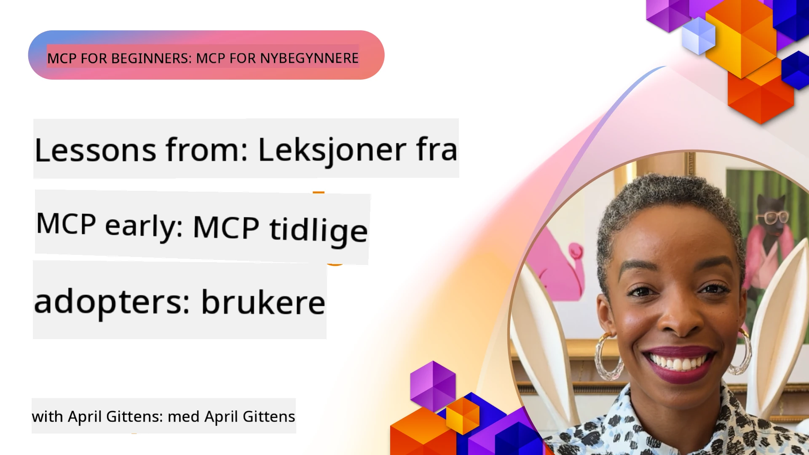

# 🌟 Lærdom fra Tidlige Adoptere

[](https://youtu.be/jds7dSmNptE)

_(Klikk på bildet over for å se videoen av denne leksjonen)_

## 🎯 Hva Dette Modulet Dekker

Dette moduler utforsker hvordan ekte organisasjoner og utviklere bruker Model Context Protocol (MCP) for å løse faktiske utfordringer og drive innovasjon. Gjennom detaljerte casestudier, hands-on prosjekter og praktiske eksempler vil du oppdage hvordan MCP muliggjør sikker, skalerbar AI-integrasjon som kobler språkmodeller, verktøy og bedriftsdata.

### 📚 Se MCP i Praksis

Vil du se disse prinsippene brukt i produksjonsklare verktøy? Sjekk ut våre [**10 Microsoft MCP-servere som Transformerer Utviklerproduktivitet**](microsoft-mcp-servers.md), som viser ekte Microsoft MCP-servere du kan bruke i dag.

## Oversikt

Denne leksjonen utforsker hvordan tidlige brukere har tatt i bruk Model Context Protocol (MCP) for å løse utfordringer i den virkelige verden og drive innovasjon på tvers av bransjer. Gjennom detaljerte casestudier og hands-on prosjekter vil du se hvordan MCP muliggjør standardisert, sikker og skalerbar AI-integrasjon — som kobler store språkmodeller, verktøy og bedriftsdata i en enhetlig ramme. Du vil få praktisk erfaring med å designe og bygge løsninger basert på MCP, lære av velprøvde implementeringsmønstre og oppdage beste praksis for distribusjon av MCP i produksjonsmiljøer. Leksjonen fremhever også fremvoksende trender, fremtidige retninger og åpen kilde-ressurser som hjelper deg med å holde deg i front med MCP-teknologien og dens stadig utviklende økosystem.

## Læringsmål

- Analysere MCP-implementeringer i den virkelige verden på tvers av forskjellige bransjer
- Designe og bygge fullstendige applikasjoner basert på MCP
- Utforske fremvoksende trender og fremtidige retninger innen MCP-teknologi
- Anvende beste praksis i faktiske utviklingsscenarier

## MCP-Implementeringer i den Virkelige Verden

### Case Studie 1: Automatisering av Bedriftskundesupport

Et multinasjonalt selskap implementerte en MCP-basert løsning for å standardisere AI-interaksjoner på tvers av deres kundesupportsystemer. Dette tillot dem å:

- Lage et enhetlig grensesnitt for flere LLM-leverandører
- Opprettholde konsekvent prompt-administrasjon på tvers av avdelinger
- Implementere robuste sikkerhets- og samsvarskontroller
- Enkel overgang mellom forskjellige AI-modeller basert på spesifikke behov

**Teknisk Implementering:**

```python
# Python MCP serverimplementering for kundestøtte
import logging
import asyncio
from modelcontextprotocol import create_server, ServerConfig
from modelcontextprotocol.server import MCPServer
from modelcontextprotocol.transports import create_http_transport
from modelcontextprotocol.resources import ResourceDefinition
from modelcontextprotocol.prompts import PromptDefinition
from modelcontextprotocol.tool import ToolDefinition

# Konfigurer logging
logging.basicConfig(level=logging.INFO)

async def main():
    # Opprett serverkonfigurasjon
    config = ServerConfig(
        name="Enterprise Customer Support Server",
        version="1.0.0",
        description="MCP server for handling customer support inquiries"
    )
    
    # Initialiser MCP-server
    server = create_server(config)
    
    # Registrer kunnskapsbase ressurser
    server.resources.register(
        ResourceDefinition(
            name="customer_kb",
            description="Customer knowledge base documentation"
        ),
        lambda params: get_customer_documentation(params)
    )
    
    # Registrer promptmaler
    server.prompts.register(
        PromptDefinition(
            name="support_template",
            description="Templates for customer support responses"
        ),
        lambda params: get_support_templates(params)
    )
    
    # Registrer støtteredskaper
    server.tools.register(
        ToolDefinition(
            name="ticketing",
            description="Create and update support tickets"
        ),
        handle_ticketing_operations
    )
    
    # Start server med HTTP-transport
    transport = create_http_transport(port=8080)
    await server.run(transport)

if __name__ == "__main__":
    asyncio.run(main())
```

**Resultater:** 30 % reduksjon i modellkostnader, 45 % forbedring i responskonsistens og forbedret samsvar på tvers av globale operasjoner.

### Case Studie 2: Helsevesen Diagnostisk Assistent

En helseleverandør utviklet en MCP-infrastruktur for å integrere flere spesialiserte medisinske AI-modeller samtidig som sensitive pasientdata forble beskyttet:

- Sømløs veksling mellom generalist- og spesialistmedisinske modeller
- Strenge personvernkontroller og revisjonsspor
- Integrasjon med eksisterende Elektroniske Pasientjournaler (EHR)
- Konsekvent prompt-utforming for medisinsk terminologi

**Teknisk Implementering:**

```csharp
// C# MCP host application implementation in healthcare application
using Microsoft.Extensions.DependencyInjection;
using ModelContextProtocol.SDK.Client;
using ModelContextProtocol.SDK.Security;
using ModelContextProtocol.SDK.Resources;

public class DiagnosticAssistant
{
    private readonly MCPHostClient _mcpClient;
    private readonly PatientContext _patientContext;
    
    public DiagnosticAssistant(PatientContext patientContext)
    {
        _patientContext = patientContext;
        
        // Configure MCP client with healthcare-specific settings
        var clientOptions = new ClientOptions
        {
            Name = "Healthcare Diagnostic Assistant",
            Version = "1.0.0",
            Security = new SecurityOptions
            {
                Encryption = EncryptionLevel.Medical,
                AuditEnabled = true
            }
        };
        
        _mcpClient = new MCPHostClientBuilder()
            .WithOptions(clientOptions)
            .WithTransport(new HttpTransport("https://healthcare-mcp.example.org"))
            .WithAuthentication(new HIPAACompliantAuthProvider())
            .Build();
    }
    
    public async Task<DiagnosticSuggestion> GetDiagnosticAssistance(
        string symptoms, string patientHistory)
    {
        // Create request with appropriate resources and tool access
        var resourceRequest = new ResourceRequest
        {
            Name = "patient_records",
            Parameters = new Dictionary<string, object>
            {
                ["patientId"] = _patientContext.PatientId,
                ["requestingProvider"] = _patientContext.ProviderId
            }
        };
        
        // Request diagnostic assistance using appropriate prompt
        var response = await _mcpClient.SendPromptRequestAsync(
            promptName: "diagnostic_assistance",
            parameters: new Dictionary<string, object>
            {
                ["symptoms"] = symptoms,
                patientHistory = patientHistory,
                relevantGuidelines = _patientContext.GetRelevantGuidelines()
            });
            
        return DiagnosticSuggestion.FromMCPResponse(response);
    }
}
```

**Resultater:** Forbedrede diagnostiske forslag til leger samtidig som full HIPAA-overholdelse ble opprettholdt og betydelig redusert kontekstavbrudd mellom systemer.

### Case Studie 3: Risikoanalyse i Finansielle Tjenester

En finansinstitusjon implementerte MCP for å standardisere sine risikoanalyser på tvers av ulike avdelinger:

- Opprettet et enhetlig grensesnitt for kredittrisiko, svindeldeteksjon og investeringsrisikomodeller
- Implementerte strenge tilgangskontroller og modellversjonering
- Sikret revisjon av alle AI-anbefalinger
- Opprettholdt konsekvent dataformatering på tvers av forskjellige systemer

**Teknisk Implementering:**

```java
// Java MCP-server for finansiell risikovurdering
import org.mcp.server.*;
import org.mcp.security.*;

public class FinancialRiskMCPServer {
    public static void main(String[] args) {
        // Opprett MCP-server med funksjoner for finansiell etterlevelse
        MCPServer server = new MCPServerBuilder()
            .withModelProviders(
                new ModelProvider("risk-assessment-primary", new AzureOpenAIProvider()),
                new ModelProvider("risk-assessment-audit", new LocalLlamaProvider())
            )
            .withPromptTemplateDirectory("./compliance/templates")
            .withAccessControls(new SOCCompliantAccessControl())
            .withDataEncryption(EncryptionStandard.FINANCIAL_GRADE)
            .withVersionControl(true)
            .withAuditLogging(new DatabaseAuditLogger())
            .build();
            
        server.addRequestValidator(new FinancialDataValidator());
        server.addResponseFilter(new PII_RedactionFilter());
        
        server.start(9000);
        
        System.out.println("Financial Risk MCP Server running on port 9000");
    }
}
```

**Resultater:** Forbedret regulatorisk samsvar, 40 % raskere modellutrullingssykluser, og bedre konsekvens i risikoanalyser på tvers av avdelinger.

### Case Studie 4: Microsoft Playwright MCP Server for Nettleserautomatisering

Microsoft utviklet [Playwright MCP-serveren](https://github.com/microsoft/playwright-mcp) for å muliggjøre sikker, standardisert nettleserautomatisering gjennom Model Context Protocol. Denne produksjonsklare serveren lar AI-agenter og LLM-er samhandle med nettlesere på en kontrollert, revisjonerbar og utvidbar måte — og muliggjør bruksområder som automatisert nett-testing, datauttrekking og ende-til-ende arbeidsflyter.

> **🎯 Produksjonsklart Verktøy**
> 
> Denne casestudien viser en ekte MCP-server du kan bruke i dag! Lær mer om Playwright MCP Server og 9 andre produksjonsklare Microsoft MCP-servere i vår [**Microsoft MCP Servers Guide**](microsoft-mcp-servers.md#8--playwright-mcp-server).

**Nøkkelfunksjoner:**
- Eksponerer nettleserautomatiseringsmuligheter (navigasjon, utfylling av skjema, skjermbildetaking osv.) som MCP-verktøy
- Implementerer strenge tilgangskontroller og sandkassemiljø for å forhindre uautoriserte handlinger
- Tilbyr detaljerte revisjonslogger for alle nettleserinteraksjoner
- Støtter integrasjon med Azure OpenAI og andre LLM-leverandører for agentdrevet automatisering
- Driver GitHub Copilots koding-agent med nettleserfunksjonalitet

**Teknisk Implementering:**

```typescript
// TypeScript: Registrerer Playwright nettleserautomatiseringsverktøy i en MCP-server
import { createServer, ToolDefinition } from 'modelcontextprotocol';
import { launch } from 'playwright';

const server = createServer({
  name: 'Playwright MCP Server',
  version: '1.0.0',
  description: 'MCP server for browser automation using Playwright'
});

// Registrer et verktøy for å navigere til en URL og ta et skjermbilde
server.tools.register(
  new ToolDefinition({
    name: 'navigate_and_screenshot',
    description: 'Navigate to a URL and capture a screenshot',
    parameters: {
      url: { type: 'string', description: 'The URL to visit' }
    }
  }),
  async ({ url }) => {
    const browser = await launch();
    const page = await browser.newPage();
    await page.goto(url);
    const screenshot = await page.screenshot();
    await browser.close();
    return { screenshot };
  }
);

// Start MCP-serveren
server.listen(8080);
```

**Resultater:**

- Muliggjorde sikker, programmatisk nettleserautomatisering for AI-agenter og LLM-er
- Reduserte manuelt testarbeid og forbedret testdekning for nettapplikasjoner
- Tilbød en gjenbrukbar, utvidbar ramme for nettleserbasert verktøy-integrasjon i bedriftsmiljøer
- Driver GitHub Copilots nettleserfunksjoner

**Referanser:**

- [Playwright MCP Server GitHub Repository](https://github.com/microsoft/playwright-mcp)
- [Microsoft AI and Automation Solutions](https://azure.microsoft.com/en-us/products/ai-services/)

### Case Studie 5: Azure MCP – Enterprise-Grade Model Context Protocol som Tjeneste

Azure MCP Server ([https://aka.ms/azmcp](https://aka.ms/azmcp)) er Microsofts administrerte, enterprise-kvalitetsimplementasjon av Model Context Protocol, designet for å tilby skalerbare, sikre og samsvarende MCP-serverkapasiteter som en skytjeneste. Azure MCP gjør det mulig for organisasjoner å raskt distribuere, administrere og integrere MCP-servere med Azure AI, data- og sikkerhetstjenester, redusere operasjonell belastning og akselerere AI-adopsjon.

> **🎯 Produksjonsklart Verktøy**
> 
> Dette er en ekte MCP-server du kan bruke i dag! Lær mer om Microsoft Foundry MCP Server i vår [**Microsoft MCP Servers Guide**](microsoft-mcp-servers.md).


- Fullstendig administrert MCP-serverhosting med innebygd skalering, overvåking og sikkerhet
- Naturlig integrasjon med Azure OpenAI, Azure AI Search og andre Azure-tjenester
- Bedriftsautentisering og autorisasjon via Microsoft Entra ID
- Støtte for tilpassede verktøy, prompt-maler og ressurskoblinger
- Samsvar med bedrifts- og regulatoriske sikkerhetskrav

**Teknisk Implementering:**

```yaml
# Example: Azure MCP server deployment configuration (YAML)
apiVersion: mcp.microsoft.com/v1
kind: McpServer
metadata:
  name: enterprise-mcp-server
spec:
  modelProviders:
    - name: azure-openai
      type: AzureOpenAI
      endpoint: https://<your-openai-resource>.openai.azure.com/
      apiKeySecret: <your-azure-keyvault-secret>
  tools:
    - name: document_search
      type: AzureAISearch
      endpoint: https://<your-search-resource>.search.windows.net/
      apiKeySecret: <your-azure-keyvault-secret>
  authentication:
    type: EntraID
    tenantId: <your-tenant-id>
  monitoring:
    enabled: true
    logAnalyticsWorkspace: <your-log-analytics-id>
```

**Resultater:**  
- Redusert tid til verdi for bedrifts-AI-prosjekter ved å tilby en klar-til-bruk, samsvarende MCP-serverplattform
- Forenklet integrasjon av LLM-er, verktøy og bedriftsdatakilder
- Forbedret sikkerhet, observabilitet og operasjonell effektivitet for MCP-arbeidsmengder
- Forbedret kodekvalitet med Azure SDK beste praksis og gjeldende autentiseringsmønstre

**Referanser:**  
- [Azure MCP Documentation](https://aka.ms/azmcp)
- [Azure MCP Server GitHub Repository](https://github.com/Azure/azure-mcp)
- [Azure AI Services](https://azure.microsoft.com/en-us/products/ai-services/)
- [Microsoft MCP Center](https://mcp.azure.com)

## Case Studie 6: NLWeb 
MCP (Model Context Protocol) er en fremvoksende protokoll for chatboter og AI-assistenter å interagere med verktøy. Hver NLWeb-instans er også en MCP-server, som støtter en kjernefunksjon, ask, som brukes til å stille et nettsted et spørsmål på naturlig språk. Det returnerte svaret utnytter schema.org, et mye brukt vokabular for å beskrive webringdata. Fritt sagt er MCP til NLWeb det Http er til HTML. NLWeb kombinerer protokoller, schema.org-formater og eksempel-kode for å hjelpe nettsteder med raskt å lage disse endepunktene, noe som gagner både mennesker gjennom konversasjonsgrensesnitt og maskiner gjennom naturlig agent-til-agent-interaksjon.

Det er to distinkte komponenter i NLWeb.
- En protokoll, veldig enkel å begynne med, for å interfase med et nettsted på naturlig språk og et format, som utnytter json og schema.org for det returnerte svaret. Se dokumentasjonen på REST API for flere detaljer.
- En enkel implementering av (1) som utnytter eksisterende markup, for nettsteder som kan abstrakteres som lister over elementer (produkter, oppskrifter, attraksjoner, anmeldelser, osv.). Sammen med et sett brukergrensesnitt-widgets kan nettsted enkelt tilby konversasjonsgrensesnitt til innholdet. Se dokumentasjonen om Life of a chat query for flere detaljer om hvordan dette fungerer.
 
**Referanser:**  
- [Azure MCP Documentation](https://aka.ms/azmcp)
- [NLWeb](https://github.com/microsoft/NlWeb)

### Case Studie 7: Microsoft Foundry MCP Server – Enterprise AI Agent Integrasjon

Microsoft Foundry MCP-servere demonstrerer hvordan MCP kan brukes til å orkestrere og administrere AI-agenter og arbeidsflyter i bedriftsmiljøer. Ved å integrere MCP med Microsoft Foundry kan organisasjoner standardisere agentinteraksjoner, utnytte Foundrys arbeidsflyt-administrasjon, og sikre sikre, skalerbare distribusjoner.

> **🎯 Produksjonsklart Verktøy**
> 
> Dette er en ekte MCP-server du kan bruke i dag! Lær mer om Microsoft Foundry MCP Server i vår [**Microsoft MCP Servers Guide**](microsoft-mcp-servers.md#9--microsoft-foundry-mcp-server).

**Nøkkelfunksjoner:**
- Omfattende tilgang til Azures AI-økosystem, inkludert modellkataloger og distribusjonsadministrasjon
- Kunnskapsindeksering med Azure AI Search for RAG-applikasjoner
- Evaluering verktøy for AI-modellens ytelse og kvalitetssikring
- Integrasjon med Microsoft Foundry Catalog og Labs for banebrytende forskningsmodeller
- Agentadministrasjon og evalueringsmuligheter for produksjonsscenarioer

**Resultater:**
- Rask prototyping og robust overvåkning av AI-agent-arbeidsflyter
- Sømløs integrasjon med Azure AI-tjenester for avanserte scenarioer
- Enhetlig grensesnitt for bygging, distribusjon og overvåkning av agent-pipelines
- Forbedret sikkerhet, samsvar og driftseffektivitet for bedrifter
- Akselerert AI-adopsjon samtidig som kontroll over komplekse agentdrevede prosesser opprettholdes

**Referanser:**
- [Microsoft Foundry MCP Server GitHub Repository](https://github.com/azure-ai-foundry/mcp-foundry)
- [Integrering av Azure AI-agenter med MCP (Microsoft Foundry Blog)](https://devblogs.microsoft.com/foundry/integrating-azure-ai-agents-mcp/)

### Case Studie 8: Foundry MCP Playground – Eksperimentering og Prototyping

Foundry MCP Playground tilbyr et klart-til-bruk-miljø for eksperimentering med MCP-servere og Microsoft Foundry-integrasjoner. Utviklere kan raskt prototype, teste og evaluere AI-modeller og agent-arbeidsflyter ved hjelp av ressurser fra Microsoft Foundry Catalog og Labs. Playground forenkler oppsett, gir eksempelprosjekter og støtter samarbeidende utvikling, noe som gjør det enkelt å utforske beste praksis og nye scenarioer med minimal overhead. Den er spesielt nyttig for team som ønsker å validere ideer, dele eksperimenter og akselerere læring uten behov for komplisert infrastruktur. Ved å senke inngangsbarrieren hjelper playground å fremme innovasjon og fellesskapsbidrag i MCP- og Microsoft Foundry-økosystemet.

**Referanser:**

- [Foundry MCP Playground GitHub Repository](https://github.com/azure-ai-foundry/foundry-mcp-playground)

### Case Studie 9: Microsoft Learn Docs MCP Server – AI-drevet Dokumentasjonstilgang

Microsoft Learn Docs MCP Server er en sky-hostet tjeneste som gir AI-assistenter sanntidstilgang til offisiell Microsoft-dokumentasjon gjennom Model Context Protocol. Denne produksjonsklare serveren kobler til det omfattende Microsoft Learn-økosystemet og muliggjør semantisk søk på tvers av alle offisielle Microsoft-kilder.

> **🎯 Produksjonsklart Verktøy**
> 
> Dette er en ekte MCP-server du kan bruke i dag! Lær mer om Microsoft Learn Docs MCP Server i vår [**Microsoft MCP Servers Guide**](microsoft-mcp-servers.md#1--microsoft-learn-docs-mcp-server).

**Nøkkelfunksjoner:**
- Sanntidstilgang til offisiell Microsoft-dokumentasjon, Azure-dokumenter og Microsoft 365-dokumentasjon
- Avanserte semantiske søkefunksjoner som forstår kontekst og intensjon
- Alltid oppdatert informasjon når Microsoft Learn-innhold publiseres
- Omfattende dekning på tvers av Microsoft Learn, Azure-dokumentasjon og Microsoft 365-kilder
- Returnerer opptil 10 høykvalitets innholdsbiter med artikkeltitler og URL-er

**Hvorfor Det Er Kritisk:**
- Løser problemet med "utdatert AI-kunnskap" for Microsoft-teknologier
- Sikrer at AI-assistenter har tilgang til de nyeste .NET-, C#-, Azure- og Microsoft 365-funksjonene
- Tilbyr autoritativ, førstepartsinformasjon for nøyaktig kodegenerering
- Essensielt for utviklere som jobber med raskt utviklende Microsoft-teknologier

**Resultater:**
- Dramatiske forbedringer i nøyaktigheten av AI-generert kode for Microsoft-teknologier
- Redusert tid brukt på å søke etter oppdatert dokumentasjon og beste praksis
- Forbedret utviklerproduktivitet med kontekstbevisst dokumentasjonshenting
- Sømløs integrasjon med utviklingsarbeidsflyter uten å forlate IDE-en

**Referanser:**
- [Microsoft Learn Docs MCP Server GitHub Repository](https://github.com/MicrosoftDocs/mcp)
- [Microsoft Learn Dokumentasjon](https://learn.microsoft.com/)

## Hands-on Prosjekter

### Prosjekt 1: Bygg en Multi-Leverandør MCP Server

**Mål:** Lag en MCP-server som kan rute forespørsler til flere AI-modell-leverandører basert på spesifikke kriterier.

**Krav:**

- Støtte minst tre forskjellige modell-leverandører (f.eks. OpenAI, Anthropic, lokale modeller)
- Implementere en rute-mekanisme basert på forespørselsmetadata
- Lag et konfigurasjonssystem for å håndtere leverandør-legitimasjon
- Legg til hurtigbuffer for å optimalisere ytelse og kostnader
- Bygg et enkelt dashbord for å overvåke bruk

**Implementeringssteg:**

1. Sett opp den grunnleggende MCP-serverinfrastrukturen
2. Implementer leverandøradaptere for hver AI-modelltjeneste
3. Lag rutelogikken basert på forespørselens attributter
4. Legg til hurtigbuffer-mekanismer for hyppige forespørsler
5. Utvikle overvåkingsdashbordet
6. Test med ulike forespørselsmønstre

**Teknologier:** Velg blant Python (.NET/Java/Python basert på ditt preferanse), Redis for caching, og et enkelt webrammeverk for dashbordet.

### Prosjekt 2: Bedrifts-Promptadministrasjonssystem

**Mål:** Utvikle et MCP-basert system for å administrere, versjonere og distribuere prompt-maler på tvers av en organisasjon.

**Krav:**


- Opprett et sentralisert lager for promptmaler
- Implementer versjonskontroll og godkjenningsarbeidsflyter
- Bygg testmuligheter for maler med prøveinnganger
- Utvikle rollebaserte tilgangskontroller
- Opprett et API for henting og distribusjon av maler

**Implementeringstrinn:**

1. Design databaseskjemaet for lagring av maler
2. Opprett kjernen API for CRUD-operasjoner på maler
3. Implementer versjonssystemet
4. Bygg godkjenningsarbeidsflyten
5. Utvikle test-rammeverket
6. Lag en enkel webgrensesnitt for administrasjon
7. Integrer med en MCP-server

**Teknologier:** Valgt backend-rammeverk, SQL- eller NoSQL-database, og et frontend-rammeverk for administrasjonsgrensesnittet.

### Prosjekt 3: MCP-basert innholdsgenereringsplattform

**Mål:** Bygg en innholdsgenereringsplattform som bruker MCP for å gi konsistente resultater på tvers av forskjellige innholdstyper.

**Krav:**

- Støtte flere innholdsformater (blogginnlegg, sosiale medier, markedsføringskopi)
- Implementer malbasert generering med tilpasningsmuligheter
- Opprett et innholdsrevisjons- og tilbakemeldingssystem
- Spor ytelsesmetrikk for innhold
- Støtte versjonering og iterasjon av innhold

**Implementeringstrinn:**

1. Sett opp MCP-klientinfrastrukturen
2. Opprett maler for forskjellige innholdstyper
3. Bygg innholdsgenereringspipelinjen
4. Implementer revisjonssystemet
5. Utvikle systemet for metrikksporing
6. Lag et brukergrensesnitt for maladministrasjon og innholdsgenerering

**Teknologier:** Din foretrukne programmeringsspråk, webrammeverk og databasesystem.

## Fremtidige retninger for MCP-teknologi

### Fremvoksende trender

1. **Multi-modalt MCP**
   - Utvidelse av MCP for å standardisere interaksjoner med bilde-, lyd- og videomodeller
   - Utvikling av tverr-modale resonneringsmuligheter
   - Standardiserte promptformater for forskjellige modaliteter

2. **Federert MCP-infrastruktur**
   - Distribuerte MCP-nettverk som kan dele ressurser på tvers av organisasjoner
   - Standardiserte protokoller for sikker modell-deling
   - Personvern-bevarende beregningsteknikker

3. **MCP-markedsplasser**
   - Økosystemer for deling og inntektsgenerering av MCP-maler og plugins
   - Kvalitetssikring og sertifiseringsprosesser
   - Integrasjon med modellmarkedsplasser

4. **MCP for edge computing**
   - Tilpasning av MCP-standarder for ressursbegrensede edge-enheter
   - Optimaliserte protokoller for lavbåndbredde-miljøer
   - Spesialiserte MCP-implementasjoner for IoT-økosystemer

5. **Regulatoriske rammeverk**
   - Utvikling av MCP-utvidelser for regelverksoverholdelse
   - Standardiserte revisjonsspor og forklaringsgrensesnitt
   - Integrasjon med fremvoksende AI-styringsrammer

### MCP-løsninger fra Microsoft

Microsoft og Azure har utviklet flere open source-lagre for å hjelpe utviklere med å implementere MCP i ulike scenarioer:

#### Microsoft-organisasjonen

1. [playwright-mcp](https://github.com/microsoft/playwright-mcp) - En Playwright MCP-server for nettleserautomatisering og testing
2. [files-mcp-server](https://github.com/microsoft/files-mcp-server) - En OneDrive MCP-serverimplementasjon for lokal testing og fellesskapsbidrag
3. [NLWeb](https://github.com/microsoft/NlWeb) - NLWeb er en samling åpne protokoller og tilhørende open source-verktøy. Hovedfokuset er å etablere et grunnleggende lag for AI-webben

#### Azure-Samples-organisasjonen

1. [mcp](https://github.com/Azure-Samples/mcp) - Lenker til eksempler, verktøy og ressurser for bygging og integrering av MCP-servere på Azure ved bruk av flere språk
2. [mcp-auth-servers](https://github.com/Azure-Samples/mcp-auth-servers) - Referanse MCP-servere som demonstrerer autentisering med gjeldende Model Context Protocol-spesifikasjon
3. [remote-mcp-functions](https://github.com/Azure-Samples/remote-mcp-functions) - Landingsside for Remote MCP Server-implementasjoner i Azure Functions med lenker til språkspesifikke repoer
4. [remote-mcp-functions-python](https://github.com/Azure-Samples/remote-mcp-functions-python) - Hurtigstartmal for bygging og distribusjon av tilpassede eksterne MCP-servere ved bruk av Azure Functions med Python
5. [remote-mcp-functions-dotnet](https://github.com/Azure-Samples/remote-mcp-functions-dotnet) - Hurtigstartmal for bygging og distribusjon av tilpassede eksterne MCP-servere ved bruk av Azure Functions med .NET/C#
6. [remote-mcp-functions-typescript](https://github.com/Azure-Samples/remote-mcp-functions-typescript) - Hurtigstartmal for bygging og distribusjon av tilpassede eksterne MCP-servere ved bruk av Azure Functions med TypeScript
7. [remote-mcp-apim-functions-python](https://github.com/Azure-Samples/remote-mcp-apim-functions-python) - Azure API Management som AI-gateway til Remote MCP-servere ved bruk av Python
8. [AI-Gateway](https://github.com/Azure-Samples/AI-Gateway) - APIM ❤️ AI-eksperimenter inkludert MCP-funksjonalitet, integrert med Azure OpenAI og AI Foundry

Disse lagrene tilbyr ulike implementasjoner, maler og ressurser for arbeid med Model Context Protocol på tvers av forskjellige programmeringsspråk og Azure-tjenester. De dekker en rekke brukstilfeller fra grunnleggende serverimplementasjoner til autentisering, skyutplassering og bedriftsintegrasjon.

#### MCP-ressurskatalog

[MCP Resources directory](https://github.com/microsoft/mcp/tree/main/Resources) i den offisielle Microsoft MCP-lageret tilbyr en kuratert samling av eksempleressurser, promptmaler og verktøydefinisjoner for bruk med Model Context Protocol-servere. Denne katalogen er laget for å hjelpe utviklere med å raskt komme i gang med MCP ved å tilby gjenbrukbare byggeklosser og beste praksiseksempler for:

- **Promptmaler:** Ferdiglagde promptmaler for vanlige AI-oppgaver og scenarioer, som kan tilpasses for dine egne MCP-serverimplementasjoner.
- **Verktøydefinisjoner:** Eksempelskjemaer for verktøy og metadata for å standardisere verktøyintegrasjon og -kall på tvers av forskjellige MCP-servere.
- **Ressursprøver:** Eksempelressursdefinisjoner for tilkobling til datakilder, API-er og eksterne tjenester innen MCP-rammeverket.
- **Referanseimplementasjoner:** Praktiske eksempler som demonstrerer hvordan strukturere og organisere ressurser, prompts og verktøy i reelle MCP-prosjekter.

Disse ressursene akselererer utvikling, fremmer standardisering og bidrar til å sikre beste praksis når du bygger og distribuerer MCP-baserte løsninger.

#### MCP-ressurskatalog

- [MCP Resources (Sample Prompts, Tools, and Resource Definitions)](https://github.com/microsoft/mcp/tree/main/Resources)

### Forskningsmuligheter

- Effektive promptoptimaliseringsteknikker innen MCP-rammeverk
- Sikkerhetsmodeller for multi-leietaker MCP-distribusjoner
- Ytelsesmåling på tvers av forskjellige MCP-implementasjoner
- Formelle verifikasjonsmetoder for MCP-servere

## Konklusjon

Model Context Protocol (MCP) former raskt fremtiden for standardisert, sikker og interoperabel AI-integrasjon på tvers av bransjer. Gjennom casestudier og praktiske prosjekter i denne leksjonen har du sett hvordan tidlige brukere — inkludert Microsoft og Azure — utnytter MCP for å løse virkelige utfordringer, akselerere AI-adopsjon og sikre overholdelse, sikkerhet og skalerbarhet. MCPs modulære tilnærming gjør det mulig for organisasjoner å koble sammen store språkmodeller, verktøy og bedriftsdata i en enhetlig, reviderbar ramme. Etter hvert som MCP fortsetter å utvikle seg, vil det å holde seg engasjert i fellesskapet, utforske open source-ressurser og anvende beste praksis være avgjørende for å bygge robuste og fremtidsklare AI-løsninger.

## Ytterligere ressurser

- [MCP Foundry GitHub repository](https://github.com/azure-ai-foundry/mcp-foundry)
- [Foundry MCP Playground](https://github.com/azure-ai-foundry/foundry-mcp-playground)
- [Integrering av Azure AI-agenter med MCP (Microsoft Foundry Blog)](https://devblogs.microsoft.com/foundry/integrating-azure-ai-agents-mcp/)
- [MCP GitHub repository (Microsoft)](https://github.com/microsoft/mcp)
- [MCP Resources Directory (Sample Prompts, Tools, and Resource Definitions)](https://github.com/microsoft/mcp/tree/main/Resources)
- [MCP Community & Documentation](https://modelcontextprotocol.io/introduction)
- [MCP Specification (2026-07-28)](https://modelcontextprotocol.io/specification/2026-07-28/)
- [Azure MCP Documentation](https://aka.ms/azmcp)
- [OWASP MCP Top 10](https://microsoft.github.io/mcp-azure-security-guide/mcp/) - Sikkerhets beste praksis
- [Playwright MCP Server GitHub repository](https://github.com/microsoft/playwright-mcp)
- [Files MCP Server (OneDrive)](https://github.com/microsoft/files-mcp-server)
- [Azure-Samples MCP](https://github.com/Azure-Samples/mcp)
- [MCP Auth Servers (Azure-Samples)](https://github.com/Azure-Samples/mcp-auth-servers)
- [Remote MCP Functions (Azure-Samples)](https://github.com/Azure-Samples/remote-mcp-functions)
- [Remote MCP Functions Python (Azure-Samples)](https://github.com/Azure-Samples/remote-mcp-functions-python)
- [Remote MCP Functions .NET (Azure-Samples)](https://github.com/Azure-Samples/remote-mcp-functions-dotnet)
- [Remote MCP Functions TypeScript (Azure-Samples)](https://github.com/Azure-Samples/remote-mcp-functions-typescript)
- [Remote MCP APIM Functions Python (Azure-Samples)](https://github.com/Azure-Samples/remote-mcp-apim-functions-python)
- [AI-Gateway (Azure-Samples)](https://github.com/Azure-Samples/AI-Gateway)
- [Microsoft AI and Automation Solutions](https://azure.microsoft.com/en-us/products/ai-services/)

## Øvelser

1. Analyser en av casestudiene og foreslå en alternativ implementeringsmetode.
2. Velg en av prosjektideene og lag en detaljert teknisk spesifikasjon.
3. Undersøk en bransje som ikke er dekket i casestudiene og skissér hvordan MCP kan møte dens spesifikke utfordringer.
4. Utforsk en av framtidsretningene og lag et konsept for en ny MCP-utvidelse som støtter den.

## Hva nå

Utforsk mer: [Microsoft MCP Servers](./microsoft-mcp-servers.md)

Fortsett til: [Modul 8: Beste praksis](../08-BestPractices/README.md)

---

<!-- CO-OP TRANSLATOR DISCLAIMER START -->
**Ansvarsfraskrivelse**:
Dette dokumentet er oversatt ved hjelp av AI-oversettelsestjenesten [Co-op Translator](https://github.com/Azure/co-op-translator). Selv om vi streber etter nøyaktighet, vær oppmerksom på at automatiske oversettelser kan inneholde feil eller unøyaktigheter. Det opprinnelige dokumentet på originalspråket skal betraktes som den autoritative kilden. For kritisk informasjon anbefales profesjonell menneskelig oversettelse. Vi er ikke ansvarlige for eventuelle misforståelser eller feiltolkninger som oppstår ved bruk av denne oversettelsen.
<!-- CO-OP TRANSLATOR DISCLAIMER END -->