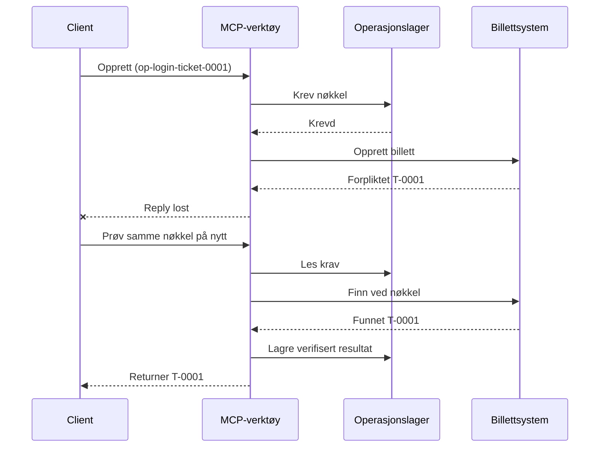
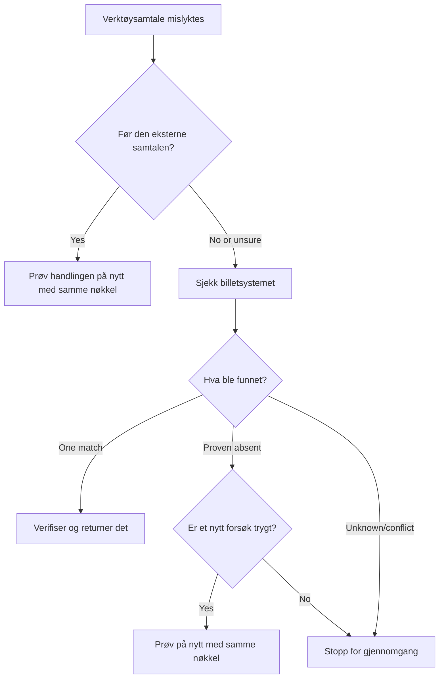

# Sikker Retry for MCP-verktøy: Et Pålitelighet Sidevognsmønster

Et manglende svar betyr ikke at handlingen mangler. Et verktøy for supporthenvendelser
kan opprette billett `T-0001` og så miste tilkoblingen før klienten ser
resultatet. Hvis klienten prøver på nytt blindt, kan det opprette `T-0002`.

Denne leksjonen viser hvordan man kan kjenne igjen et usikkert utfall, holde en stabil
identitet for den tiltenkte handlingen, og sjekke billettsystemet før man prøver
igjen. Den medfølgende Python-øvelsen kjører lokalt med standardbiblioteket
og SQLite.

## Hvorfor en Tidsavbrudd Betyr "Utfall Ukjent"

Anta at klienten kaller `create_support_ticket` med operasjonsnøkkel
`op-login-ticket-0001`:



Tilkoblingen mislykkes etter at billetten er bekreftet, men før resultatet kommer.
Klienten vet bare at svaret mangler. Den vet ikke om billetten mangler. Å bruke
operasjonsnøkkelen på nytt lar verktøyet finne og returnere
`T-0001` i stedet for å opprette `T-0002`.

## Hva en Pålitelighet Sidevogn Gjør

En pålitelighet sidevogn er applikasjonskode som holder på gjenopprettingsstatus rundt et
verktøy. Det kan være et bibliotek, mellomvare, en database-støttet tjeneste, eller
rett og slett en del av verktøyimplementasjonen. Det trenger ikke å være en separat prosess,
og det er ikke en MCP protokollfunksjon.

Sidevognen har fire oppgaver:

1. lagre den tiltenkte handlingen før du ringer det eksterne systemet;
2. la bare én arbeider kreve den handlingen;
3. huske nok status til å gjenopprette etter en krasj; og
4. sjekke det eksterne systemet når utfallet er usikkert.

Denne leksjonen retter seg mot den endelige MCP-spesifikasjonen `2026-07-28`. MCP har ingen
protokoll-nivå økt, så operasjonsnøkkelen er et vanlig verktøyargument
støttet av varig applikasjonsstatus. Det samme mønsteret fungerer også med tidligere
MCP-versjoner.

## Fire ID-er som Løser Ulike Problemer

Disse identifikatorene er relaterte, men de er ikke utskiftbare:

| Identifikator | Hva den identifiserer | Overlever et retry? |
| --- | --- | --- |
| JSON-RPC ID | En forespørsel og svar | Nei; bruk ny forespørsels-ID |
| MCP Oppgave-ID | En langvarig oppgave | Ja; behold den for polling |
| Operasjonsnøkkel | En tiltenkt handling | Ja; gjenbruk den for den handlingen |
| Billett-ID | Det lagrede resultatet | Ja; returner den etter verifisering |

Fremdriftsvarsler og sporingskontekst hjelper deg å observere en forespørsel.
Avbrytelse ber arbeid om å stoppe. Ingen av dem forhindrer en duplikatbillett.

## Bygg Vakten

Lag operasjonsnøkkelen før første verktøysamtale og lagre den med
arbeidsflyten. Hvert forsøk på å opprette samme tiltenkte billett bruker samme nøkkel:

```json
{
  "operation_key": "op-login-ticket-0001",
  "title": "Cannot sign in"
}
```

En annen tiltenkt billett får en ny nøkkel. I produksjon generer et ugjettbart,
ugjennomtrengelig verdi i stedet for å legge kundeopplysninger inn i nøkkelen.

Her er det komplette MCP-verktøyskjemaet brukt i denne leksjonen:

```json
{
  "name": "create_support_ticket",
  "title": "Create support ticket",
  "description": "Creates or recovers one support ticket for an operation key.",
  "inputSchema": {
    "$schema": "https://json-schema.org/draft/2020-12/schema",
    "type": "object",
    "properties": {
      "operation_key": {
        "type": "string",
        "minLength": 16,
        "maxLength": 128,
        "description": "Stable key reused for the same intended action."
      },
      "title": {
        "type": "string",
        "minLength": 1,
        "maxLength": 200
      }
    },
    "required": ["operation_key", "title"],
    "additionalProperties": false
  },
  "outputSchema": {
    "$schema": "https://json-schema.org/draft/2020-12/schema",
    "type": "object",
    "properties": {
      "ticket_id": {
        "type": "string"
      },
      "operation_key": {
        "type": "string"
      },
      "status": {
        "type": "string",
        "const": "verified"
      }
    },
    "required": ["ticket_id", "operation_key", "status"],
    "additionalProperties": false
  }
}
```

Den autentiserte anroperidentiteten kommer fra serverkontekst, ikke fra
modell-levert verktøyinndata. Angi hver lagret operasjon til:

- den anroperen, leietaker eller tjenestekonto;
- verktøynavnet og versjonen; og
- en hash av de normaliserte inngangene som definerer den eksterne handlingen.

Inngangshashen svarer på et enkelt spørsmål: "Er denne retryen etterspør den samme
billetten?" Hvis nøkkelen allerede tilhører en annen tittel, avvis forespørselen.
Å returnere et tidligere resultat for endret input ville skjule en kontraktsfeil.

Lagre kravet med én atomisk databaseoperasjon. "Atomisk" betyr at to arbeidere
ikke kan begge observere en tom post og begge bli eier. En prosess-lokal
lås er ikke nok når en annen serverinstans kan motta retryen.

Arbeidsflyten oppretter nøkkelen mens handlingen er `planned`. Eksemplet persisterer så
disse statuser:

- `claimed`: en arbeider har reservert operasjonen;
- `completed`: billettsystemet returnerte et resultat; og
- `verified`: en lesing fra billettsystemet bekrefter resultatet.

En krasj kan etterlate lagret status på `claimed` selv etter at billetten ble
opprettet. Behandle hvert ikke-terminalt krav som usikkert inntil eksterne bevis
avklarer det. Ikke anta at `claimed` betyr "ingenting skjedde."

## Gjenopprett Før Du Prøver På Nytt

Når en verktøysamtale mislykkes, avgjør hva som er kjent før du sender en annen ekstern
skriv:



Validering som feiler før billett-API-et kalles er en kjent feil.
Prøv på nytt en uendret handling med samme operasjonsnøkkel. Hvis korrigering av input
endrer den tiltenkte billetten, opprett en ny nøkkel for den nye handlingen.

Hvis forespørselen kan ha nådd billettsystemet, foren det først.
Forening betyr å sammenligne det lagrede kravet med den autoritative billettposten.
Returner eksisterende billett når nøyaktig én matchende post finnes.
Prøv kun på nytt når billetten med sikkerhet er fraværende og nedstrøms kontrakten
gjør et nytt forsøk trygt.

"Ikke funnet" er ikke alltid avgjørende. En leverandør med eventual consistency
i søket kan trenge en begrenset ventetid og en ny sjekk. Hvis systemet ikke kan
søkes, gir motstridende resultater, eller ikke trygt kan deduplisere et nytt
forsøk, stopp og rapporter `utfall ukjent`. Å stoppe her kalles noen ganger
"feile lukket": arbeidsflyten nekter å gjette.

## Bevis, Oppgaver og Avbrytelse

Et verktøysvar sier hva verktøyet rapporterte. Et lagret kontrollpunkt sier hva
arbeidsflyten registrerte. Det sterkeste beviset kommer fra systemet som eier
resultatet: for dette eksemplet, en lesing fra billettsystemet som finner nøyaktig én
matchende billett.

Match beviset med risikoen. En leverandørs melding-ID kan være nok for en
lavrisikovarsel. Betalinger, utrullinger, og destruktive handlinger kan
kreve leverandørstatus, regnskapsbok, eller manuelt gjennomgangsbevis.

MCP Tasks-utvidelsen utfyller dette mønsteret for langvarig arbeid. En Oppgave-ID
lar klienten gjenoppta polling etter en frakobling, men den identifiserer ikke
eller dedupliserer selve billetten. Når Tasks brukes, kobles identitetene
slik:

```text
operation key -> Task ID -> ticket ID -> verification evidence
```

Avbrytelse er kooperativ, ikke en rollback. Billetten kan fortsatt bli opprettet
etter at avbrytelse er bekreftet, så et usikkert resultat trenger fortsatt
forening.

## Kjør Feilinjektjonsøvelsen

Eksemplet bruker to SQLite-filer: en representerer operasjonslageret og den
andre representerer det eksterne billettsystemet. Det finnes ingen transaksjon som spenner over
begge filene. Feilen injiseres etter at billetten bekreftes, men før
sidevognen registrerer fullføring.

Den direkte Python-metoden aksepterer `caller_id` som en representant for autentisert
serverkontekst. Ikke legg til `caller_id` i den modellkontrollerte MCP-inndatas
skjemaet.

Forutsi resultatet før du kjører testene:

| Sti | Resultat etter retry | Billettantall |
| --- | --- | --- |
| Blind retry | Oppretter `T-0002` etter å ha mistet svaret for `T-0001` | 2 |
| Beskyttet retry | Finner og returnerer `T-0001` | 1 |

Kjør:

```bash
cd 08-BestPractices/reliability-sidecars/python
python -m unittest discover -p "test_*.py" -v
```

De seks testene viser at:

1. en blind retry oppretter en duplikat;
2. svarstap pluss en omstart gjenoppretter en billett fra et varig krav;
3. en verifisert retry gjenbruker det lagrede resultatet;
4. endret input eller motstridende eksterne bevis avvises;
5. et eksisterende krav uten eksternt bevis stopper trygt; og
6. samtidige krav tillater én eier uten å gå tilbake til et verifisert resultat.

Åpne eksemplet:

- [Python-implementering](../../../../08-BestPractices/reliability-sidecars/python/reliability_sidecar.py)
- [Deterministiske tester](../../../../08-BestPractices/reliability-sidecars/python/test_reliability_sidecar.py)

Eksemplet utelater med vilje leieavtaler for foreldede krav. En produksjonsovergangs-
politikk trenger en begrenset leie, atomisk eierskapsoverføring og en annen ekstern
sjekk før utførelse.

## Valgfri Fellesskapsimplementering

Agent Enhancer Utilities er en fellesskapsimplementering av dette
applikasjonsnivåmønsteret. Dens planlegger velger en gjenopprettingsmetode, mens dens
kontrollpunkt registrerer krav- og usikkeresultatstatus. Domeneverktøyet eller MCP-
serveren utfører og verifiserer fortsatt den virkelige handlingen. Denne tjenesten er ikke en del
av MCP-spesifikasjonen og er ikke påkrevd for denne leksjonen.

| Leksjonskonsept | Agent Enhancer-del | Viktig begrensning |
| --- | --- | --- |
| Gjenopprettingsplan | `workflow-guard-planner` | Kaller ikke domeneverktøyet |
| Krav og gjenoppretting | `workflow-checkpoint` | `external_proof` forblir `false` |
| Eksakt sidevogn gjenspill | `lab.invoke_tool` | Bruker en separat idempotensnøkkel |
| Verifiser den virkelige handlingen | Destinasjonssøk/-lesing | Domene MCP eier det |

For et eksakt retry av ett sidevognkall, tar `lab.invoke_tool` en ytre
`idempotency_key`. Den nøkkelen identifiserer sidevognspåkallelsen; det er ikke
forretnings-`operation_key` som brukes for billetten.

Den taggede offentlige kontrakten og et valgfritt nettverksbasert eksempel er tilgjengelig
her:

- [Pålitelighet Sidevogn Kontrakt v1](https://github.com/artiehinz/Agent-Enhancer-Utilities/blob/v1.6.0/docs/RELIABILITY_SIDECAR_CONTRACT_V1.md)
- [Planlegger- og mock-domene-eksempel](https://github.com/artiehinz/Agent-Enhancer-Utilities/tree/v1.6.0/examples/reliability-sidecar)

Disse lenkene illustrerer applikasjonsmønsteret. De påstår ikke at
den hostede tjenesten er i samsvar med MCP `2026-07-28`, og kontrollpunktstatus teller aldri
som eksternt bevis for billetten.

## Produksjonssjekkliste

- [ ] Lag og lagre operasjonsnøkkelen før første eksterne forsøk.
- [ ] Bind nøkkelen til anroper, verktøyversjon og normalisert inngangshash.
- [ ] Avvis endret input under en eksisterende nøkkel.
- [ ] Tillat én eier med en atomisk delt-lageroperasjon.
- [ ] Send nøkkelen videre til nedstrøms leverandør når det støtter idempotens.
- [ ] Foren usikre utfall før en annen skrivning.
- [ ] Behold verifiserte resultater og bevis for hele retry-vinduet.
- [ ] Stopp for gjennomgang når det eksterne utfallet ikke trygt kan fastslås.

## Referanser

- [MCP-spesifikasjon `2026-07-28`](https://modelcontextprotocol.io/specification/2026-07-28)
- [MCP `2026-07-28` verktøyanvisning](https://modelcontextprotocol.io/specification/2026-07-28/server/tools)
- [MCP Tasks-utvidelse](https://modelcontextprotocol.io/extensions/tasks/overview)
- [JSON-RPC 2.0-spesifikasjon](https://www.jsonrpc.org/specification)

---

<!-- CO-OP TRANSLATOR DISCLAIMER START -->
**Ansvarsfraskrivelse**:
Dette dokumentet er oversatt ved hjelp av AI-oversettelsestjenesten [Co-op Translator](https://github.com/Azure/co-op-translator). Selv om vi streber etter nøyaktighet, vær oppmerksom på at automatiske oversettelser kan inneholde feil eller unøyaktigheter. Det opprinnelige dokumentet på originalspråket skal betraktes som den autoritative kilden. For kritisk informasjon anbefales profesjonell menneskelig oversettelse. Vi er ikke ansvarlige for eventuelle misforståelser eller feiltolkninger som oppstår ved bruk av denne oversettelsen.
<!-- CO-OP TRANSLATOR DISCLAIMER END -->